## 8

**传输层协议**

在本章中，我们将继续研究各个协议及其在数据包级别的表现。向上走到 OSI 模型，我们将讨论传输层和两种最常见的传输协议，TCP 和 UDP。

### 传输控制协议（TCP）

*传输控制协议（TCP）* 的最终目标是提供端到端的数据传输可靠性。TCP 在 RFC 793 中定义，负责数据排序和错误恢复，并最终确保数据能够到达预定目标。TCP 被认为是 *面向连接的协议*，因为它在传输数据之前会建立正式的连接，跟踪数据包的传递，通常还会在传输完成后正式关闭通信通道。许多常用的应用层协议依赖于 TCP 和 IP 来将数据包传递到最终目的地。

#### *TCP 数据包结构*

TCP 提供了大量功能，正如其头部的复杂性所反映的那样。如 图 8-1 所示，以下是 TCP 头部字段：

**源端口**   用于传输数据包的端口。

**目标端口**   数据包将传输到的端口。

**序列号**   用于标识 TCP 段的编号。该字段用于确保数据流的部分数据不丢失。

**确认号**   在通信的另一方预计会在下一个数据包中发送的序列号。

**标志**   用于标识正在传输的 TCP 数据包类型的 URG、ACK、PSH、RST、SYN 和 FIN 标志。

**窗口大小**   TCP 接收缓冲区的大小（以字节为单位）。

**校验和**   用于确保到达时 TCP 头部和数据的内容完整无误。

**紧急指针**   如果设置了 URG 标志，则检查此字段以获取额外的指令，告诉 CPU 从数据包中的何处开始读取数据。

**选项**   可以在 TCP 数据包中指定的各种可选字段。

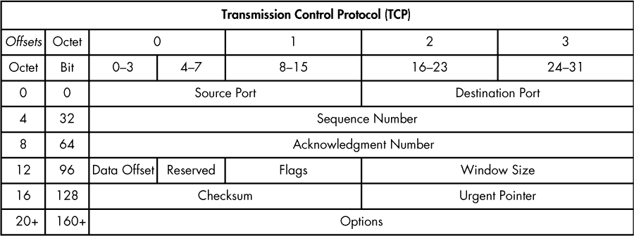

*图 8-1：TCP 头部*

#### *TCP 端口*

*tcp_ports.pcapng*

所有 TCP 通信都使用源端口和目标端口，这可以在每个 TCP 头部中找到。端口就像旧电话交换机上的插孔。交换机操作员会监视一板灯光和插孔。当灯亮起时，他会接通来电者，询问她想联系谁，然后通过插入电缆将她连接到另一方。每个电话都需要有源端口（来电者）和目标端口（接收者）。TCP 端口的工作方式非常相似。

为了将数据传输到远程服务器或设备上的特定应用程序，TCP 数据包必须知道远程服务正在监听的端口。如果尝试访问未配置用于访问的端口上的应用程序，通信将失败。

这个序列中的源端口并不是非常重要，可以随机选择。远程服务器会从发送的原始数据包中确定与之通信的端口（参见图 8-2）。

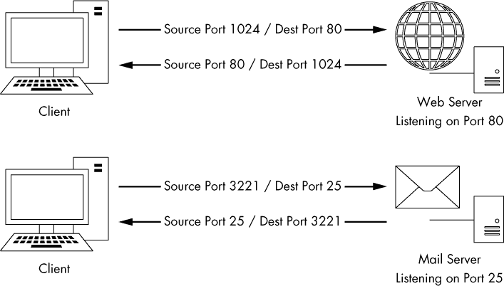

*图 8-2：TCP 使用端口传输数据。*

在与 TCP 通信时，有 65,535 个端口可供使用。我们通常将这些端口分为两组：

*系统端口组*（也称为标准端口或知名端口组）的范围从 1 到 1023（忽略 0，因为它是保留的）。知名的、已建立的服务通常使用位于系统端口组内的端口。

*临时端口组*的范围从 1024 到 65535（尽管一些操作系统对这一范围有不同的定义）。在任何给定时刻，只有一个服务可以在某个端口上进行通信，因此现代操作系统会随机选择源端口，以便使通信具有唯一性。这些源端口通常位于临时端口范围内。

让我们检查几个 TCP 数据包，并通过打开文件*tcp_ports.pcapng*来识别它们使用的端口号。在这个文件中，我们有一个客户端浏览两个网站的 HTTP 通信。如前所述，HTTP 使用 TCP 进行通信，这使它成为标准 TCP 流量的一个很好的示例。

在此文件中的第一个数据包中（参见图 8-3），前两个值表示数据包的源端口和目标端口。该数据包正从 172.16.16.128 发送到 212.58.226.142。源端口是 2826 ➊，一个临时端口。（请记住，源端口是由操作系统随机选择的，尽管它们可以从该随机选择中递增。）目标端口是一个系统端口，端口 80 ➋，这是用于使用 HTTP 的 Web 服务器的标准端口。

*图 8-3：源端口和目标端口可以在 TCP 头部找到。*

注意，Wireshark 将这些端口标记为 slc-systemlog（2826）和 http（80）。Wireshark 维护着一份端口及其最常见用途的列表。尽管系统端口是主要具有常见用途标签的端口，但许多临时端口也与常用服务相关联。由于这些端口的标签可能会让人困惑，因此通常最好通过关闭传输名称解析来禁用它。操作方法是：进入**编辑** ▶ **首选项** ▶ **名称解析**，然后取消选中启用传输名称解析。如果你希望保留此选项，但想要更改 Wireshark 如何识别某个端口，可以通过修改位于 Wireshark 系统目录中的*services*文件来实现。该文件的内容基于 IANA 的常见端口列表（参见第 86 页的“使用自定义主机文件”部分，了解如何编辑名称解析文件的示例）。

第二个数据包从 212.58.226.142 发送回 172.16.16.128（见图 8-4）。与 IP 地址一样，源端口和目标端口现在也被切换 ➊。

在大多数情况下，基于 TCP 的通信工作方式相同：选择一个随机的源端口与已知的目标端口进行通信。发送此初始数据包后，远程设备将使用已建立的端口与源设备进行通信。

这个示例捕获文件包含了一个额外的通信流。看看你能否找到它在通信中使用的端口号。

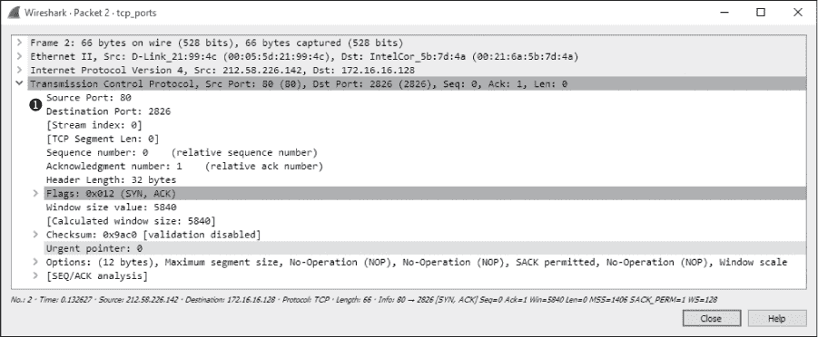

*图 8-4：切换源端口和目标端口号以实现反向通信*

**注意**

*随着本书的深入，你将了解更多关于常见协议和服务相关的端口。最终，你将能够通过它们使用的端口来对服务和设备进行分析。有关常见端口的完整列表，请查看位于 Wireshark 系统目录中的* services *文件。*

#### *TCP 三次握手*

所有基于 TCP 的通信都必须从两台主机之间的 *握手* 开始。此握手过程有几个目的：

•     它允许发送方主机确保接收方主机处于运行状态并能够进行通信。

•     它让发送方主机检查接收方是否在发送方尝试通信的端口上监听。

*tcp_handshake.pcapng*

•     它允许发送方主机将其起始序列号发送给接收方，以便两台主机能够保持数据包流的正确顺序。

TCP 握手过程分为三个步骤，如图 8-5 所示。在第一步，想要进行通信的设备（主机 A）向其目标（主机 B）发送一个 TCP 数据包。这个初始数据包除了底层协议头部外不包含其他数据。该数据包中的 TCP 头部设置了 SYN 标志，并包括将用于通信过程中的初始序列号和最大报文段大小（MSS）。主机 B 对此数据包做出响应，发送一个类似的数据包，设置 SYN 和 ACK 标志，并带有其初始序列号。最后，主机 A 向主机 B 发送最后一个数据包，仅设置 ACK 标志。一旦这个过程完成，两个设备应该就拥有开始正常通信所需的所有信息。

**注意**

*TCP 数据包通常通过其设置的标志来命名。例如，我们不说“设置了 SYN 标志的 TCP 数据包”，而是称其为 SYN 数据包。因此，在 TCP 握手过程中使用的数据包分别称为 SYN、SYN/ACK 和 ACK。*

要查看这个过程的实际操作，请打开*tcp_handshake.pcapng*。Wireshark 提供了一个功能，可以将 TCP 数据包的序列号替换为相对序列号，以便更轻松地进行分析。为了我们的目的，我们将禁用此功能，以查看实际的序列号。要禁用此功能，请选择**编辑** ▶ **首选项**，展开**协议**部分，然后选择**TCP**。在窗口中，取消勾选**相对序列号**旁边的框，并点击**确定**。

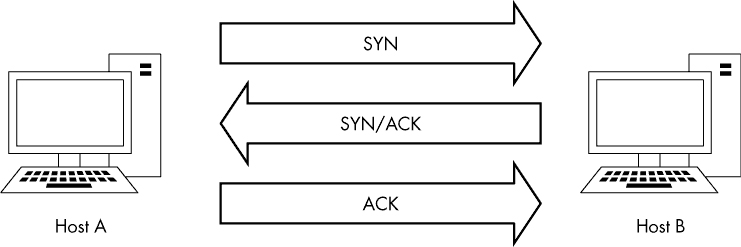

*图 8-5：TCP 三次握手*

该捕获中的第一个数据包代表我们的初始 SYN 数据包 ➋（参见图 8-6）。该数据包从 172.16.16.128 的 2826 端口发送到 212.58.226.142 的 80 端口。我们可以看到这里传输的序列号是 3691127924 ➊。

握手中的第二个数据包是来自 212.58.226.142 的 SYN/ACK 响应 ➌（参见图 8-7）。该数据包还包含此主机的初始序列号（233779340） ➊ 和一个确认号（3691127925） ➋。这里显示的确认号比前一个数据包中的序列号大 1，因为该字段用于指定主机预计接收到的下一个序列号。

最后的数据包是从 172.16.16.128 发送的 ACK ➋ 数据包（参见图 8-8）。这个数据包，正如预期的那样，包含了序列号 3691127925 ➊，该序列号如前一个数据包的确认号字段所定义。

每次 TCP 通信序列开始前都会发生握手。当你在忙碌的捕获文件中查找通信序列的开始时，序列 SYN-SYN/ACK-ACK 是一个很好的标记。

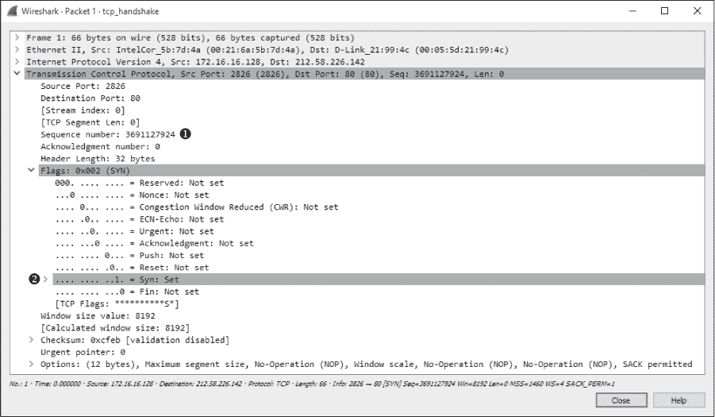

*图 8-6：初始 SYN 数据包*

*图 8-7：SYN/ACK 响应*

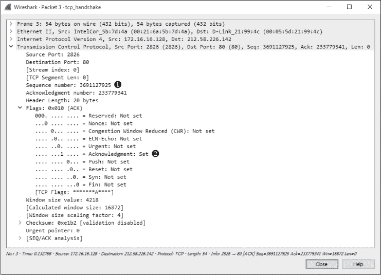

*图 8-8：最终的 ACK*

#### *TCP 拆除*

*tcp_teardown.pcapng*

大多数问候语最终都会有告别，TCP 的情况也是如此，每次握手后都有拆除过程。*TCP 拆除*用于在两个设备完成通信后，优雅地结束它们之间的连接。这个过程涉及四个数据包，并利用 FIN 标志来表示连接的结束。

在拆除序列中，主机 A 通过发送一个设置了 FIN 和 ACK 标志的 TCP 数据包，告诉主机 B 它已完成通信。主机 B 用一个 ACK 数据包响应，并发送它自己的 FIN/ACK 数据包。主机 A 以一个 ACK 数据包作出响应，结束通信。这个过程在图 8-9 中进行了说明。

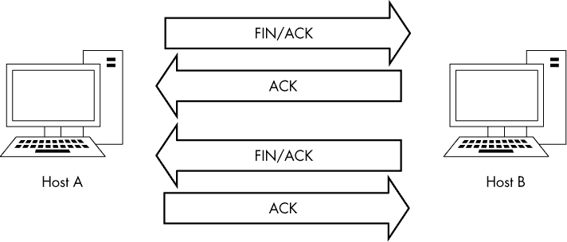

*图 8-9：TCP 拆除过程*

要在 Wireshark 中查看此过程，请打开文件 *tcp_teardown.pcapng*。从序列中的第一个数据包开始（参见图 8-10），你可以看到位于 67.228.110.120 的设备通过发送一个设置了 FIN 和 ACK 标志的数据包 ➊ 来启动拆除过程。

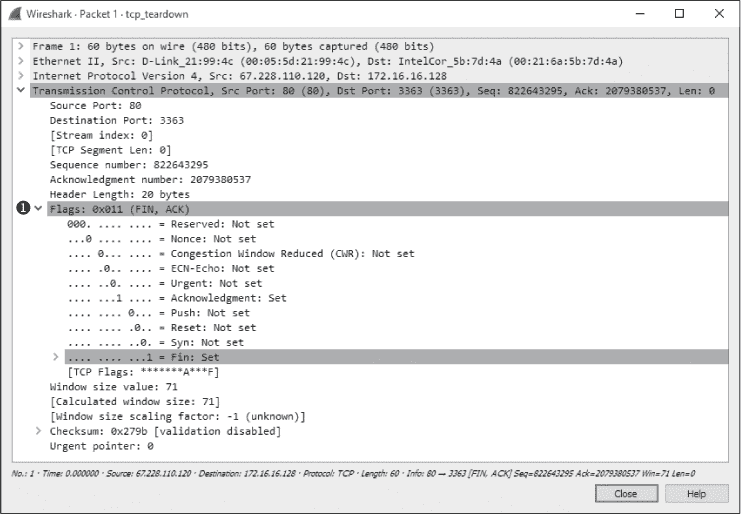

*图 8-10：FIN/ACK 数据包启动了断开连接的过程。*

一旦发送了这个数据包，172.16.16.128 将通过 ACK 数据包响应，以确认收到第一个数据包，并发送一个 FIN/ACK 数据包。当 67.228.110.120 发送最终的 ACK 数据包时，过程完成。此时，两个设备之间的通信结束。如果它们需要再次开始通信，则必须完成新的 TCP 握手过程。

#### *TCP 重置*

*tcp_refuseconnection.pcapng*

在理想的世界中，每个连接都会优雅地以 TCP 断开过程结束。实际上，连接往往会突然终止。例如，主机可能配置错误，或者潜在的攻击者可能进行端口扫描。在这些情况下，当数据包被发送到一个不愿意接收它的设备时，可能会发送一个带有 RST 标志的 TCP 数据包。RST 标志用于表示连接被突然关闭或拒绝连接请求。

文件 *tcp_refuseconnection.pcapng* 显示了一个包含 RST 数据包的网络流量示例。该文件中的第一个数据包来自 IP 地址为 192.168.100.138 的主机，它正在尝试与 192.168.100.1 的端口 80 通信。这个主机并不知道的是，192.168.100.1 并没有在端口 80 上监听，因为它是一个没有配置 Web 界面的 Cisco 路由器，该端口没有配置任何接受连接的服务。作为对这种尝试通信的响应，192.168.100.1 向 192.168.100.138 发送了一个数据包，告知它无法通过端口 80 进行通信。图 8-11 显示了这种通信尝试在第二个数据包的 TCP 头部中的突然结束。该 RST 数据包仅包含 RST 和 ACK 标志 ➊，且没有进一步的通信。

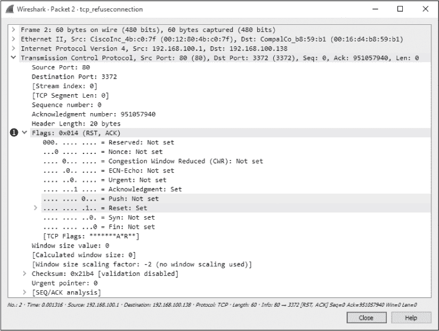

*图 8-11：RST 和 ACK 标志表示通信结束。*

无论 RST 数据包是在尝试通信序列的开始时到达（如本例所示），还是在主机之间的通信中间发送，它都能结束通信。

### 用户数据报协议（UDP）

*udp_dnsrequest.pcapng*

*用户数据报协议（UDP）* 是现代网络中常用的另一种第四层协议。虽然 TCP 设计用于可靠的数据传输并内建错误检测，但 UDP 旨在提供快速传输。因此，UDP 是一种尽力而为的服务，通常被称为 *无连接协议*。无连接协议不像 TCP 那样正式地建立和终止主机之间的连接，它没有握手和断开连接的过程。

使用无连接协议的情况下，UDP 流量看起来最多也只是零散的。然而，这种情况并不完全准确，因为依赖 UDP 的协议通常具有内置的可靠性服务，或利用 ICMP 的某些特性使连接更加可靠。例如，应用层协议 DNS 和 DHCP，高度依赖于数据包在网络中传输的速度，使用 UDP 作为它们的传输层协议，但它们自行处理错误检查和重传定时器。

#### *UDP 数据包结构*

*udp_dnsrequest.pcapng*

UDP 头部比 TCP 头部小得多，也更简单。如图 8-12 所示，以下是 UDP 头部字段：

**源端口**   用于传输数据包的端口

**目标端口**   数据包将被传输到的端口

**数据包长度**   数据包的字节长度

**校验和**   用于确保 UDP 头部和数据内容到达时未被损坏

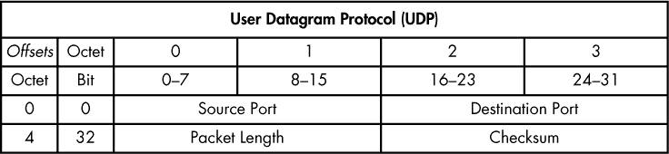

*图 8-12：UDP 头部*

文件 *udp_dnsrequest.pcapng* 包含一个数据包。该数据包表示一个 DNS 请求，使用 UDP 协议。当你展开该数据包的 UDP 头部时，你会看到四个字段（见图 8-13）。

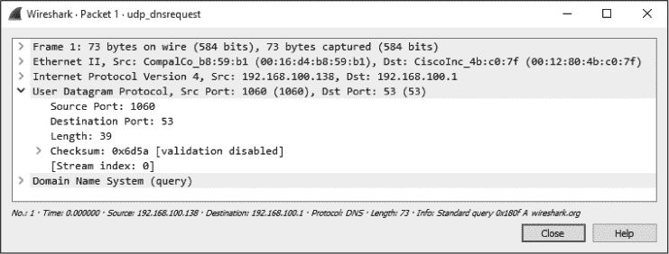

*图 8-13：UDP 数据包的内容非常简单。*

需要记住的关键点是，UDP 不关心可靠交付。因此，任何使用 UDP 的应用程序如果需要可靠交付，必须采取特殊步骤确保这一点。这与 TCP 相反，TCP 使用正式的连接建立和拆除过程，并具备验证数据包是否成功传输的功能。

本章介绍了传输层协议 TCP 和 UDP。与网络协议类似，TCP 和 UDP 是大多数日常通信的核心，能够有效分析它们对于成为一个高效的数据包分析员至关重要。在第九章，我们将介绍常见的应用层协议。
