## **9**

**常见上层协议**

在本章中，我们将继续探讨各个协议的功能，以及使用 Wireshark 查看时它们的表现。我们将讨论五种最常见的上层（第 7 层）协议：DHCP、DNS、HTTP 和 SMTP。

### **动态主机配置协议（DHCP）**

在网络发展的早期，当设备希望通过网络进行通信时，需要手动分配一个地址。随着网络的扩展，这一手动过程迅速变得繁琐。为了解决这个问题，创建了引导协议（BOOTP）来自动为网络连接的设备分配地址。后来，BOOTP 被更先进的动态主机配置协议（DHCP）所取代。

DHCP 是一个应用层协议，负责允许设备自动获取 IP 地址（以及其他重要的网络资源地址，如 DNS 服务器和路由器）。如今，大多数 DHCP 服务器还会向客户端提供其他参数，例如默认网关和网络中使用的 DNS 服务器的地址。

#### ***DHCP 数据包结构***

DHCP 数据包可以携带相当多的信息给客户端。如图 9-1 所示，DHCP 数据包中包含以下字段：

**操作码**   表示数据包是 DHCP 请求还是 DHCP 回复

**硬件类型**   硬件地址的类型（10MB 以太网、IEEE 802、ATM 等）

**硬件长度**   硬件地址的长度

**跳数**   由中继代理使用，帮助查找 DHCP 服务器

**事务 ID**   用于将请求与响应配对的随机数字

**已用秒数**   客户端从第一次向 DHCP 服务器请求地址以来的秒数

**标志**   DHCP 客户端可以接受的流量类型（单播、广播等）

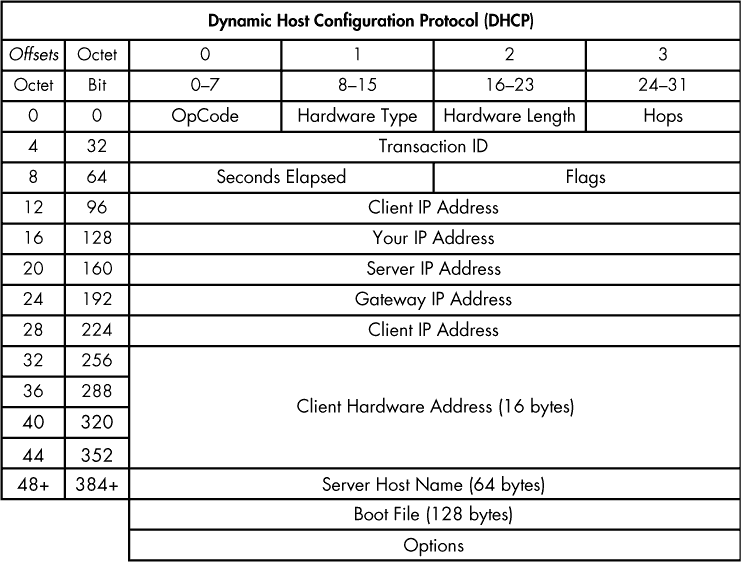

*图 9-1：DHCP 数据包结构*

**客户端 IP 地址**   客户端的 IP 地址（源自“您的 IP 地址”字段）

**您的 IP 地址**   DHCP 服务器提供的 IP 地址（最终成为客户端 IP 地址字段的值）

**服务器 IP 地址**   DHCP 服务器的 IP 地址

**网关 IP 地址**   网络默认网关的 IP 地址

**客户端硬件地址**   客户端的 MAC 地址

**服务器主机名**   服务器的主机名（可选）

**引导文件**   用于 DHCP 的引导文件（可选）

**选项**   用于扩展 DHCP 数据包结构，赋予其更多功能

#### ***DHCP 初始化过程***

*dhcp_nolease _initialization.pcapng*

DHCP 的主要目标是在初始化过程中为客户端分配地址。续租过程发生在单个客户端和 DHCP 服务器之间，如文件*dhcp_nolease_initialization.pcapng*所示。DHCP 初始化过程通常称为 DORA 过程，因为它使用四种类型的 DHCP 数据包：发现、提供、请求和确认，如图 9-2 所示。在这里，我们将逐一查看每种类型的 DORA 数据包。

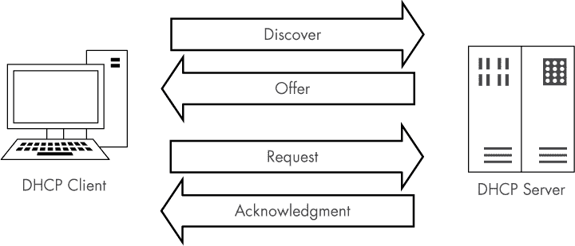

*图 9-2：DHCP DORA 过程*

##### **发现数据包**

如你在引用的捕获文件中所见，第一个数据包是从 0.0.0.0 的 68 端口发送到 255.255.255.255 的 67 端口。客户端使用 0.0.0.0，因为它还没有 IP 地址。该数据包发送到 255.255.255.255，因为这是一个与网络无关的广播地址，从而确保该数据包将被发送到网络上的每个设备。由于设备不知道 DHCP 服务器的地址，因此此第一个数据包是为了尝试寻找一个会监听的 DHCP 服务器。

查看数据包详细信息窗格时，首先注意到的是 DHCP 依赖 UDP 作为其传输层协议。DHCP 非常关注客户端接收请求信息的速度。DHCP 具有内置的可靠性措施，这意味着 UDP 非常适合。你可以通过查看数据包详细信息窗格中的第一个数据包的 DHCP 部分，来查看发现过程的细节，如图 9-3 所示。

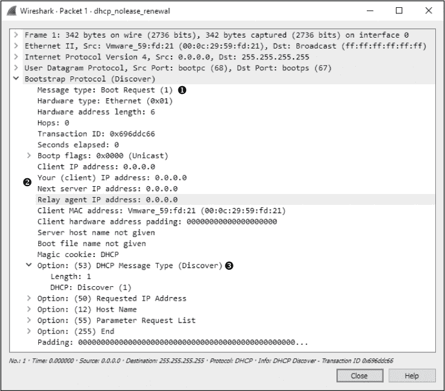

*图 9-3：DHCP 发现数据包*

**注意**

*由于 Wireshark 在处理 DHCP 时仍参考 BOOTP，因此你将在数据包详细信息窗格中看到一个 Bootstrap 协议部分，而不是 DHCP 部分。然而，在本书中我会将其称为数据包的*DHCP 部分*。*

该数据包是一个请求，由消息类型字段中的(1)标识 ➊。此发现数据包中的大多数字段要么全为零（如你在 IP 地址字段 ➋中看到的那样），要么根据上一节中列出的 DHCP 字段的说明非常容易理解。这个数据包的核心内容在于其四个选项字段 ➌。

**DHCP 消息类型**   这是选项类型`53`，长度为`1`，值为`Discover (1)`。这些值表明这是一个 DHCP 发现数据包。

**客户端标识符**   提供有关请求 IP 地址的客户端的额外信息。

**请求的 IP 地址**   提供客户端希望接收的 IP 地址。这可以是之前使用过的 IP 地址，或者是 0.0.0.0 以表示没有偏好。

**参数请求列表**   列出了客户端希望从 DHCP 服务器接收的不同配置项（其他重要网络设备的 IP 地址以及其他非 IP 项目）。

##### **提供数据包**

本文件中的第二个数据包列出了其 IP 头中的有效 IP 地址，显示一个从 192.168.1.5 到 192.168.1.10 的数据包，如 图 9-4 所示。客户端实际上还没有 192.168.1.10 地址，因此服务器将首先尝试使用 ARP 提供的硬件地址与客户端进行通信。如果通信不可行，服务器将简单地广播该响应以进行通信。

这个第二个数据包的 DHCP 部分，被称为 *响应数据包*，表明消息类型是回复 ➊。该数据包包含与前一个数据包相同的事务 ID ➋，这告诉我们这个回复确实是对我们原始请求的回应。

响应数据包是由 DHCP 服务器发送的，目的是向客户端提供服务。它通过提供关于自身以及它希望提供给客户端的地址信息来完成此操作。在 图 9-4 中，IP 地址 192.168.1.10 在“您的（客户端）IP 地址”字段中被提供给客户端 ➌，该地址由“下一服务器 IP 地址”字段中的 192.168.1.5 标识 ➍。

第一个列出的选项将数据包标识为 `DHCP 响应` ➎。后续的选项由服务器提供，并指示它可以提供的附加信息，以及客户端的 IP 地址。你可以看到它提供了以下内容：

•     IP 地址租用时间为 10 分钟

•     子网掩码为 255.255.255.0

•     广播地址为 192.168.1.255

•     路由器地址为 192.168.1.254

•     一个域名 *mydomain.example*

•     域名服务器地址为 192.168.1.1 和 192.168.1.2

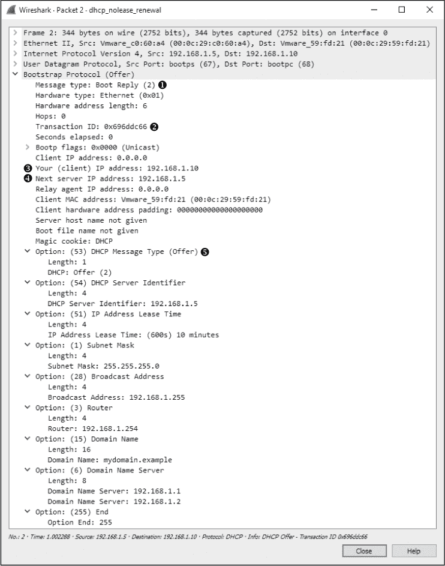

*图 9-4：DHCP 响应数据包*

##### **请求数据包**

一旦客户端收到来自 DHCP 服务器的响应，它应该通过一个 DHCP 请求数据包接受该响应，如 图 9-5 所示。

这个捕获中的第三个数据包仍然来自 IP 地址 0.0.0.0，因为我们还没有完成获取 IP 地址的过程 ➊。此数据包现在已经知道它正在与哪个 DHCP 服务器通信。

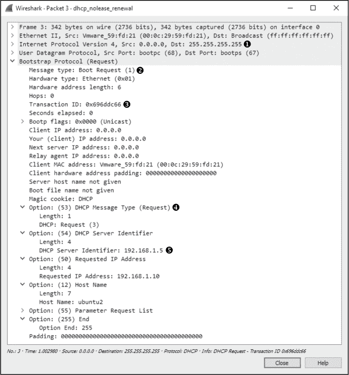

*图 9-5：DHCP 请求数据包*

消息类型字段显示该数据包是一个请求 ➋，而事务 ID 字段与前两个数据包相同 ➌，这表明它们属于同一过程。此数据包类似于发现数据包，因为其所有 IP 地址信息都被置为零。

最后，在选项字段中，我们看到这是一条 `DHCP 请求` ➍。请注意，请求的 IP 地址不再为空，且 DHCP 服务器标识符字段也包含了一个地址 ➎。

##### **确认数据包**

在这个过程的最后一步，DHCP 服务器通过确认数据包将请求的 IP 地址发送给客户端，并将该信息记录在其数据库中，如 图 9-6 所示。客户端现在已经有了一个 IP 地址，并可以开始在网络上进行通信。

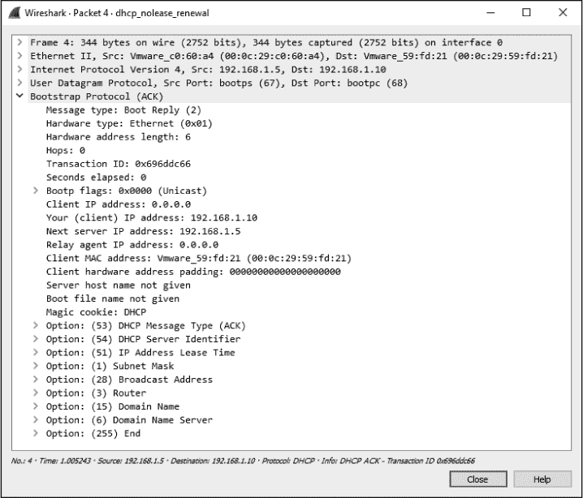

*图 9-6：DCHP 确认包*

#### ***DHCP 租用续期***

*dhcp_inlease_renewal.pcapng*

当 DHCP 服务器为设备分配 IP 地址时，它会将该地址*租用*给客户端。这意味着客户端只能在有限的时间内使用该 IP 地址，之后必须续租。前面讨论的 DORA 过程发生在客户端第一次获取 IP 地址或其租期已到期时。在这两种情况下，设备都被视为*租期结束*。

当一个带有租用 IP 地址的客户端重启时，它必须执行简化版的 DORA 过程以重新获得其 IP 地址。这个过程叫做*租用续期*。

在租期续期的情况下，发现和提供数据包是不必要的。可以把租期续期看作是与租期结束续期相同的 DORA 过程，但租期续期不需要做太多的工作，仅剩下请求和确认步骤。你可以在文件*dhcp_inlease_renewal.pcapng*中找到租期续期的示例抓包。

#### ***DHCP 选项和消息类型***

DHCP 的真正灵活性体现在其可用选项上。正如你所看到的，数据包的 DHCP 选项可以在大小和内容上有所不同。数据包的总体大小取决于所使用的选项组合。你可以在* [`www.iana.org/assignments/bootp-dhcp-parameters/`](http://www.iana.org/assignments/bootp-dhcp-parameters/)*查看所有 DHCP 选项的完整列表。

所有 DHCP 数据包中唯一必需的选项是消息类型选项（选项 53）。此选项用于标识 DHCP 客户端或服务器如何处理数据包中的信息。消息类型共有 8 种，如表 9-1 所定义。

**表 9-1：DHCP 消息类型**

| **类型编号** | **消息类型** | **描述** |
| --- | --- | --- |
| 1 | Discover | 客户端用来定位可用的 DHCP 服务器 |
| 2 | Offer | 服务器响应发现数据包时发送给客户端 |
| 3 | Request | 客户端发送给服务器，请求提供的参数 |
| 4 | Decline | 客户端发送给服务器，指示数据包内的参数无效 |
| 5 | ACK | 由服务器发送给客户端，包含客户端请求的配置信息 |
| 6 | NAK | 客户端发送给服务器，用于拒绝配置参数请求 |
| 7 | Release | 客户端发送给服务器，取消租约并释放其配置参数 |
| 8 | Inform | 客户端发送给服务器，请求配置参数，当客户端已拥有 IP 地址时 |

#### ***DHCP 版本 6（DHCPv6）***

*dhcp6_outlease_acquisition.pcapng*

如果你查看图 9-1 中 DHCP 数据包的结构，你会发现它没有足够的空间来支持 IPv6 地址分配所需的长度。为了不将 DHCP 修改用于此目的，RFC3315 中设计了 DHCPv6。由于 DHCPv6 并不是基于 BOOTP 的概念，它的数据包格式要简单得多（见图 9-7）。

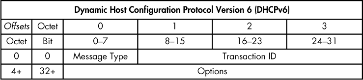

*图 9-7：DHCPv6 数据包结构*

这里显示的数据包结构仅包含两个静态值，它们的作用与 DHCP 中的对应值相同。数据包结构的其余部分根据第一个字节中标识的消息类型而变化。在选项部分，每个选项都通过 2 字节的选项代码和 2 字节的长度字段进行标识。有关这些字段中可能出现的消息类型和选项代码的完整列表，请访问： *[`www.iana.org/assignments/dhcpv6-parameters/dhcpv6-parameters.xhtml`](http://www.iana.org/assignments/dhcpv6-parameters/dhcpv6-parameters.xhtml)*。

DHCPv6 达成的目标与 DHCP 相同，但要理解 DHCPv6 通信的流程，我们必须用一个新的缩写词 SARR 来替换原有的 DORA。这个过程在图 9-8 中有所示，图中代表了一个当前超出租期的客户端。

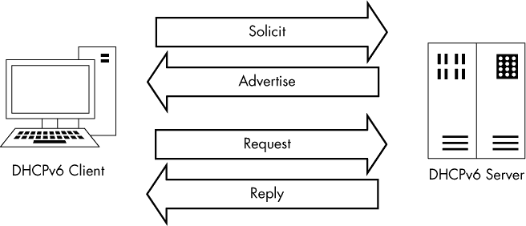

*图 9-8：DHCPv6 SARR 超出租期续租过程*

SARR 过程有四个步骤：

1.  **请求**：客户端从客户端向特殊的多播地址（ff02::1:2）发送初始数据包，尝试在网络上定位可用的 DHCPv6 服务器。

1.  **广告**：可用的服务器直接响应客户端，表明它可以提供地址分配和配置信息。

1.  **请求**：客户端通过多播向服务器发送正式的配置信息请求。

1.  **回复**：服务器将所有可用的请求配置信息直接发送给客户端，过程完成。

这个过程的总结显示在图 9-9 中，取自文件 *dhcp6_outlease_acquisition.pcapng*。在这个示例中，我们可以看到 SARR 过程的实际操作，新的主机（fe80::20c:29ff:fe5e:7744）从 DHCPv6 服务器（fe80::20c:29ff:fe1f:a755）接收到配置信息。每个数据包代表 SARR 过程的一个步骤，初始的请求和广告数据包通过事务 ID 0x9de03f 连接在一起，请求和回复数据包通过事务 ID 0x2d1603 关联。尽管图中没有显示，但这种通信是通过端口 546 和 547 进行的，这是 DHCPv6 使用的标准端口。

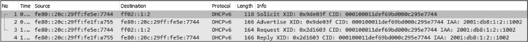

*图 9-9：客户端通过 DHCPv6 获取 IPv6 地址*

总体而言，DHCPv6 流量的包结构看起来与我们之前讨论的包类型有很大不同，但大多数相同的概念依然适用。该过程仍然需要某种形式的 DHCP 服务器发现，并正式检索配置信息。这些事务通过客户端和服务器之间交换的每对数据包中的事务标识符关联在一起。传统的 DHCP 机制无法支持 IPv6 地址分配，因此，如果你的设备从网络中的服务器自动获取 IPv6 地址，可能已经在网络上运行 DHCPv6 服务。如果你想进一步比较 DHCP 和 DHCPv6，我建议你并排查看本章讨论的数据包捕获，并逐步分析它们。

### **域名系统（DNS）**

域名系统（DNS）是互联网上最重要的协议之一，因为它就像粘合剂一样，将网络中的各个部分联系在一起。DNS 将域名（例如 *[www.google.com](http://www.google.com)*）与 IP 地址（例如 74.125.159.99）关联。当我们想与网络设备通信，而又不知道其 IP 地址时，我们通过其 DNS 名称访问该设备。

DNS 服务器存储 IP 地址与 DNS 名称映射的*资源记录*数据库，并与客户端和其他 DNS 服务器共享这些记录。

**注意**

*由于 DNS 服务器的架构较为复杂，我们只关注一些常见的 DNS 流量类型。你可以在* [`www.isc.org/community/rfcs/dns/`](https://www.isc.org/community/rfcs/dns/) *查看各种与 DNS 相关的 RFC 文档。*

#### ***DNS 数据包结构***

正如你在图 9-10 中看到的，DNS 数据包的结构与我们之前讨论的数据包类型略有不同。DNS 数据包中可以包含以下字段：

**DNS ID 号** 用于将 DNS 查询与 DNS 响应关联

**查询/响应（QR）** 表示数据包是 DNS 查询还是响应

**操作码（OpCode）** 定义消息中查询的类型

**权威回答（AA）** 如果此值在响应数据包中设置，表示该响应来自具有该域名权威的名称服务器

**截断（TC）** 表示响应被截断，因为它太大，无法放入数据包中

**递归请求（RD）** 当此值在查询中设置时，表示如果目标名称服务器没有包含所请求的信息，DNS 客户端请求递归查询

**递归可用（RA）** 如果此值在响应中设置，表示名称服务器支持递归查询

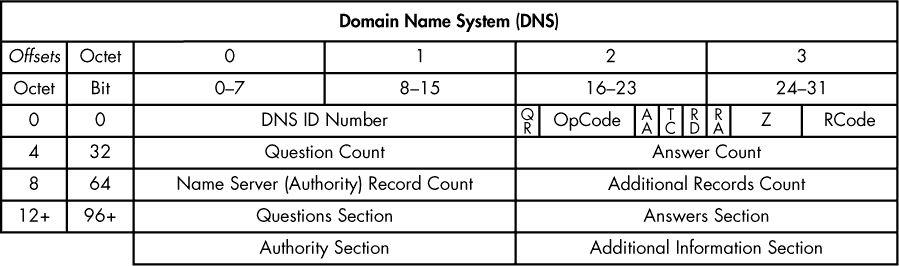

*图 9-10：DNS 数据包结构*

**保留（Z）** 根据 RFC 1035 定义，应该设置为全零；然而，有时它被用作 RCode 字段的扩展

**响应码（RCode）** 用于 DNS 响应中，表示是否存在错误

**问题计数** 问题部分中的条目数

**回答数量**   回答部分中的条目数量

**名称服务器（授权）记录数量**   授权部分中名称服务器资源记录的数量

**附加记录数量**   附加信息部分中其他资源记录的数量

**问题部分**   可变大小的部分，包含一个或多个查询，用于向 DNS 服务器发送信息

**回答部分**   可变大小的部分，包含一个或多个资源记录，用于回答查询

**授权部分**   可变大小的部分，包含指向授权名称服务器的资源记录，这些服务器可以用于继续解析过程

**附加信息部分**   可变大小的部分，包含与查询相关的附加资源记录，这些记录对于回答查询并非绝对必要

#### ***一个简单的 DNS 查询***

*dns_query_response.pcapng*

DNS 以查询-响应格式工作。希望将 DNS 名称解析为 IP 地址的客户端向 DNS 服务器发送一个 *查询*，然后服务器在其 *响应* 中返回请求的信息。在最简单的形式下，这个过程需要两个数据包，正如在捕获文件 *dns_query_response.pcapng* 中看到的那样。

第一个数据包，如 图 9-11 所示，是客户端 192.168.0.114 向服务器 205.152.37.23 发送的 DNS 查询，目标端口为 53，这是 DNS 使用的标准端口。

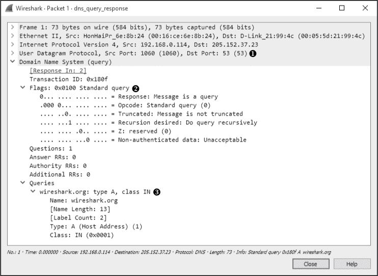

*图 9-11：DNS 查询数据包*

当你开始检查这个数据包中的头部时，你会发现 DNS 也依赖于 UDP ➊。

在数据包的 DNS 部分，你可以看到数据包开头的较小字段被 Wireshark 压缩成了一个单独的标志部分。展开此部分，你会看到该消息确实是一个标准查询 ➋，它没有被截断，并且需要递归（稍后我们会讲解递归）。这里只识别了一个问题，可以通过展开查询部分来查看。你会看到该查询是针对 *[wireshark.org](http://wireshark.org)* 域名的一个主机（类型 `A`）互联网（`IN`）地址 ➌。这个数据包基本上是在问：“哪个 IP 地址与 *[wireshark.org](http://wireshark.org)* 域名关联？”

对该请求的响应在数据包 2 中，如 图 9-12 所示。因为这个数据包有相同的标识号 ➊，我们知道它包含对原始查询的正确响应。

Flags 部分确认这是一个响应，如果需要，可以使用递归 ➋。此数据包仅包含一个问题和一个资源记录 ➌，因为它包括原始问题及其答案。展开 Answers 部分，我们可以看到查询的响应：*wireshark.org* 的 IP 地址是 128.121.50.122 ➍。通过此信息，客户端现在可以构建 IP 数据包并开始与 *wireshark.org* 通信。

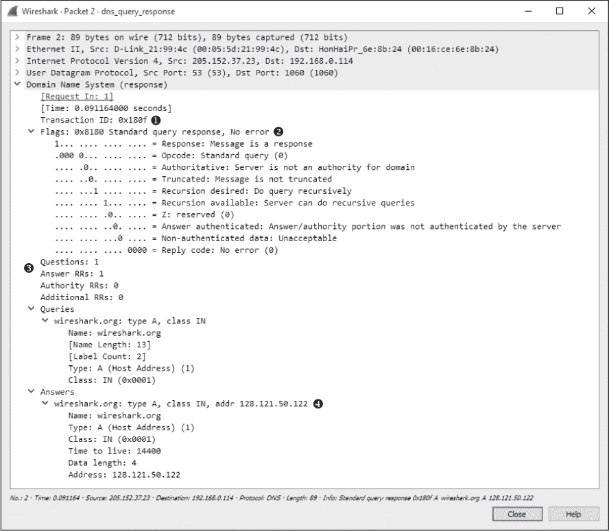

*图 9-12：DNS 响应数据包*

#### ***DNS 查询类型***

在 DNS 查询和响应中使用的 Type 字段表示查询或响应的资源记录类型。一些常见的消息/资源记录类型列在 表 9-2 中。在正常流量和本书中，您将看到这些类型。（表 9-2 中的列表很简短，并且并非详尽无遗。如需查看所有 DNS 资源记录类型，请访问 *[`www.iana.org/assignments/dns-parameters/`](http://www.iana.org/assignments/dns-parameters/)*。）

**表 9-2：** 常见的 DNS 资源记录类型

| **值** | **类型** | **描述** |
| --- | --- | --- |
| 1 | A | IPv4 主机地址 |
| 2 | NS | 权威名称服务器 |
| 5 | CNAME | 别名的规范名称 |
| 15 | MX | 邮件交换 |
| 16 | TXT | 文本字符串 |
| 28 | AAAA | IPv6 主机地址 |
| 251 | IXFR | 增量区域传输 |
| 252 | AXFR | 完整区域传输 |

#### ***DNS 递归***

*dns_recursivequery_client.pcapng, dns_recursivequery_server.pcapng*

由于互联网 DNS 结构的层次性，DNS 服务器必须能够相互通信，以回答客户端提交的查询。虽然我们期望内部 DNS 服务器知道我们本地内部网络服务器的名称到 IP 地址的映射，但我们不能指望它知道 Google 或 Dell 的关联 IP 地址。

当 DNS 服务器需要查找 IP 地址时，它会代表客户端向另一台 DNS 服务器发起查询，实际上充当客户端的角色。这个过程称为 *递归*。

要从 DNS 客户端和服务器的角度查看递归过程，请打开文件 *dns_recursivequery_client.pcapng*。此文件包含一个客户端的 DNS 流量捕获文件，包含两个数据包。第一个数据包是从 DNS 客户端 172.16.0.8 发往其 DNS 服务器 172.16.0.102 的初始查询，如 图 9-13 所示。

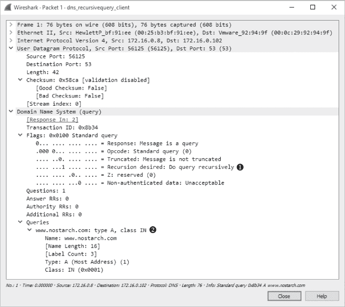

*图 9-13：设置了递归请求标志的 DNS 查询*

当您展开此数据包的 DNS 部分时，您将看到这是一个标准查询，请求 DNS 名称 *[www.nostarch.com](http://www.nostarch.com)* 的 `A` 类型记录 ➋。要了解更多关于此数据包的信息，请展开 Flags 部分，您将看到需要递归 ➊。

第二个数据包是我们期望看到的对初始查询的响应，如图 9-14 所示。

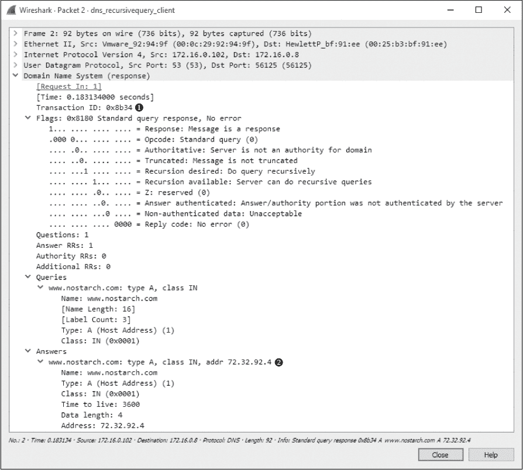

*图 9-14：DNS 查询响应*

这个数据包的事务 ID 与我们的查询 ➊ 匹配，没有列出任何错误，我们收到了与 *[www.nostarch.com](http://www.nostarch.com)* 相关联的 `A` 类型资源记录 ➋。

我们可以通过监听 DNS 服务器的流量来看到此查询是通过递归方式得到回答的，正如文件 *dns_recursivequery_server.pcapng* 所示。该文件展示了当查询发起时本地 DNS 服务器的流量捕获（图 9-15）。

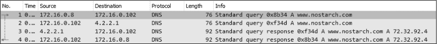

*图 9-15：从服务器的角度看 DNS 递归*

第一个数据包是我们在前一个捕获文件中看到的相同初始查询。此时，DNS 服务器已经收到查询，检查了其本地数据库，并意识到它不知道哪个 IP 地址与 DNS 名称 (*[www.nostarch.com](http://www.nostarch.com)*) 对应。由于数据包是带着“需要递归”标志发送的，DNS 服务器可以向另一个 DNS 服务器提出这个问题，试图找到答案，正如你在第二个数据包中看到的那样。

在第二个数据包中，位于 172.16.0.102 的 DNS 服务器向 4.2.2.1 发送了一个新的查询 ➊，这是它配置转发上游请求的服务器，如图 9-16 所示。这个查询与原始查询相同，实际上将 DNS 服务器变成了一个客户端。我们可以通过事务 ID 号与前一个捕获文件中的事务 ID 号不同来判断这是一个新的查询 ➋。

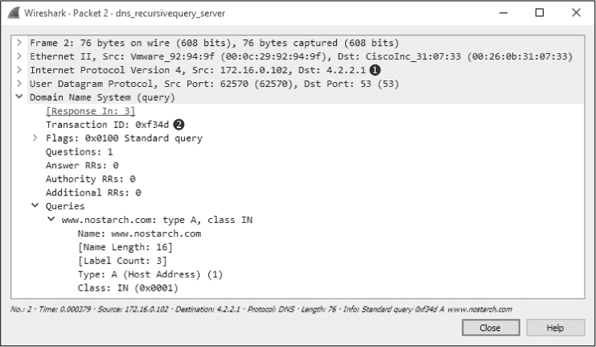

*图 9-16：递归 DNS 查询*

一旦服务器 4.2.2.1 收到这个数据包，局部 DNS 服务器就会收到如图 9-17 所示的响应。

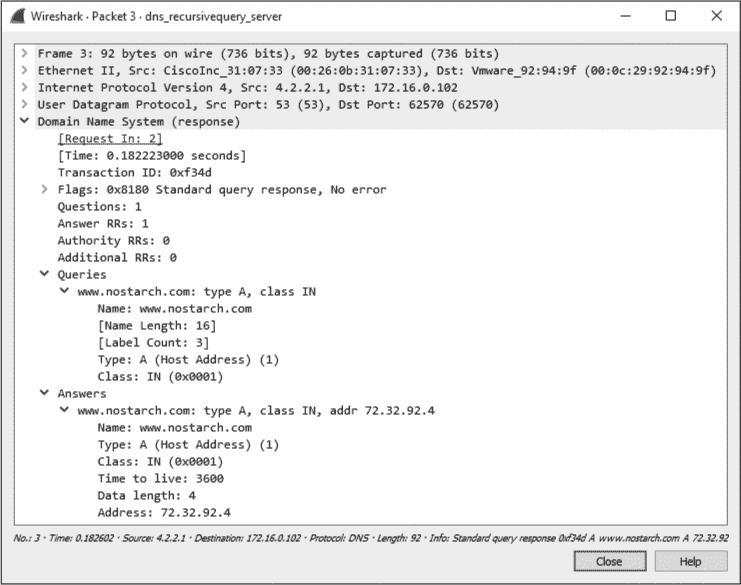

*图 9-17：递归 DNS 查询的响应*

收到这个响应后，局部 DNS 服务器可以将第四个也是最后一个数据包传送给 DNS 客户端，包含所请求的信息。

尽管这个例子只展示了单层递归，但对于单个 DNS 请求，递归可能会发生多次。在这里，我们从 DNS 服务器 4.2.2.1 收到了回答，但该服务器可能已经将查询递归地转发到另一个服务器以找到答案。一个简单的查询可能会在全球范围内传输，直到最终收到正确的响应。图 9-18 展示了递归 DNS 查询的过程。

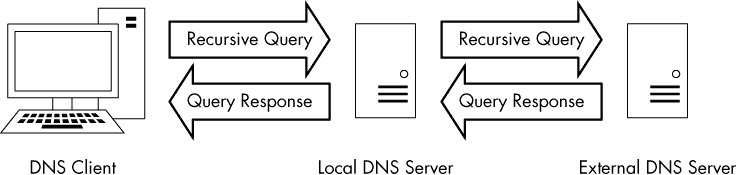

*图 9-18：递归 DNS 查询*

#### ***DNS 区域传输***

*dns_axfr.pcapng*

一个*DNS 区域*是 DNS 服务器被委托管理的命名空间（或 DNS 名称组）。例如，Emma’s Diner 可能有一个 DNS 服务器负责* [emmasdiner.com](http://emmasdiner.com) *。在这种情况下，想要将* [emmasdiner.com](http://emmasdiner.com) *解析为 IP 地址的设备，无论是在 Emma’s Diner 内部还是外部，都需要联系该 DNS 服务器作为该区域的权威。如果 Emma’s Diner 扩展业务，它可以增加第二个 DNS 服务器，仅处理其 DNS 命名空间中的电子邮件部分，例如* [mail.emmasdiner.com](http://mail.emmasdiner.com) *，该服务器将成为该邮件子域的权威。如图 9-19 所示，可能会根据需要为子域添加额外的 DNS 服务器。

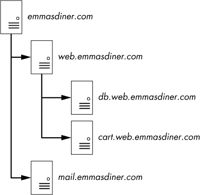

*图 9-19：DNS 区域划分了命名空间的责任。*

一个*区域传输*发生在区域数据在两个设备之间传输时，通常是出于冗余的需求。例如，在有多个 DNS 服务器的组织中，管理员通常会配置一个辅助 DNS 服务器，以保持主服务器 DNS 区域信息的副本，以防主服务器不可用。区域传输有两种类型：

**完整区域传输（AXFR）** 这些类型的传输在设备之间发送整个区域。

**增量区域传输（IXFR）** 这些类型的传输只发送部分区域信息。

文件*dns_axfr.pcapng*包含了主机 172.16.16.164 和 172.16.16.139 之间的完整区域传输示例。刚开始查看这个文件时，你可能会怀疑自己是否打开了正确的文件，因为你看到的是 TCP 数据包，而不是 UDP 数据包。虽然 DNS 依赖于 UDP，但在某些任务中，它使用 TCP，比如区域传输，因为 TCP 在传输大量数据时更为可靠。此捕获文件中的前三个数据包是 TCP 三次握手过程。

第四个数据包开始了 172.16.16.164 与 172.16.16.139 之间的区域传输请求。这个数据包不包含任何 DNS 信息。它被标记为“重新组装的 PDU 的 TCP 段”，因为区域传输请求数据包中的数据是通过多个数据包发送的。数据包 4 和 6 包含该数据包的数据，数据包 5 是确认数据包 4 已接收。这些数据包以这种方式显示，是因为 Wireshark 解析并显示 TCP 数据包的方式，使其更易于阅读。为了我们的目的，我们可以将数据包 6 作为完整的 DNS 区域传输请求，见图 9-20。

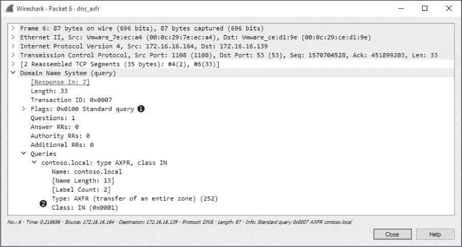

*图 9-20：DNS 完整区域传输请求*

区域传输请求是一个标准查询➊，但它请求的是 AXFR 类型➋，这意味着它希望从服务器接收整个 DNS 区域。服务器在数据包 7 中响应区域记录，如图 9-21 所示。如你所见，区域传输包含了相当多的数据，这只是其中一个简单的示例！随着区域传输完成，捕获文件以 TCP 连接拆除过程结束。

**警告**

*区域传输中包含的数据在不当的人手中可能非常危险。例如，通过枚举单一的 DNS 服务器，你可以绘制出一个网络的完整基础设施。*

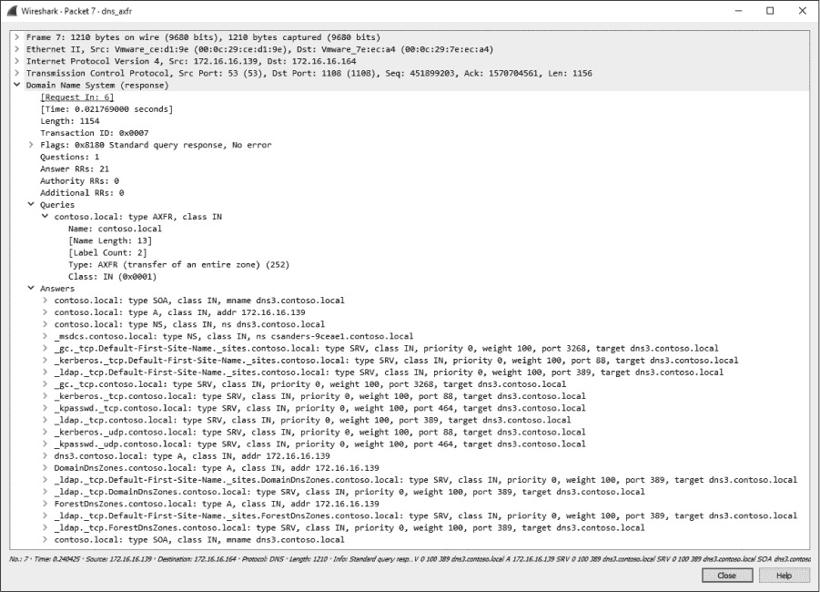

*图 9-21：发生 DNS 完整区域传输的过程*

### **超文本传输协议 (HTTP)**

超文本传输协议是万维网的传输机制，允许网页浏览器连接到网页服务器以查看网页。在大多数组织中，HTTP 代表了通过网络传输的流量中占比最高的部分。每次你进行 Google 搜索、发送推文或查看肯塔基大学篮球比分时，你都在使用 HTTP，*例如访问[`www.espn.com/`](http://www.espn.com/)*。

我们不会深入研究 HTTP 传输的数据包结构，因为 HTTP 协议有许多不同的实现方式，结构可能会有很大差异。因此，这部分练习留给你自己完成。在这里，我们将重点讨论一些 HTTP 的实际应用，例如检索和发布内容。

#### ***使用 HTTP 浏览***

*http_google.pcapng*

HTTP 最常用于使用浏览器浏览网页。在捕获文件*http_google.pcapng*中，展示了一个使用 TCP 作为传输层协议的 HTTP 传输。通信从客户端 172.16.16.128 与 Google 网页服务器 74.125.95.104 之间的三次握手开始。

一旦建立通信，第一个数据包被标记为从客户端到服务器的 HTTP 数据包，如图 9-22 所示。

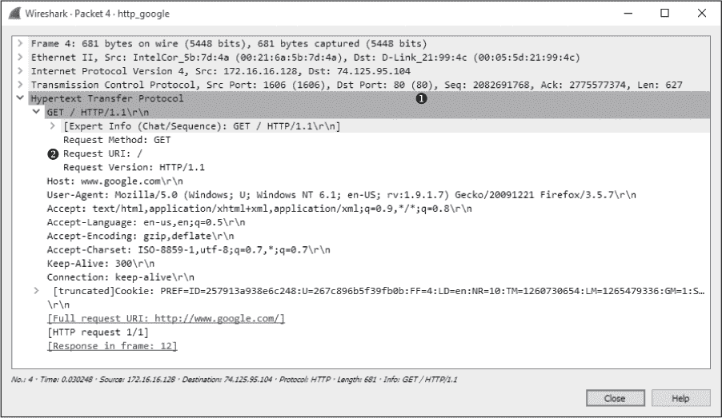

*图 9-22：初始 HTTP `GET`请求数据包*

HTTP 数据包通过 TCP 传输到服务器的端口 80➊，这是 HTTP 通信的标准端口（此外还经常使用其他端口，如 8080 和 8888）。

HTTP 数据包通过 HTTP 规范版本 1.1 中定义的八种请求方法之一来标识（见 *[`www.iana.org/assignments/http-methods/http-methods.xhtml`](http://www.iana.org/assignments/http-methods/http-methods.xhtml)*），这些方法指示数据包的发送者将对接收者执行的操作。如图 9-22 所示，该数据包将其方法标识为`GET`，其请求统一资源标识符（URI）为`/`，请求版本为`HTTP/1.1` ➋。这些信息告诉我们，客户端正在发送请求以下载（`GET`）Web 服务器的根目录（`/`），并使用 HTTP 的 1.1 版本。

接下来，主机将有关其自身的信息发送到 Web 服务器。这些信息包括正在使用的浏览器（User-Agent）、浏览器接受的语言（Accept-Languages）以及 cookie 信息（捕获的底部）。服务器可以利用这些信息确定返回给客户端的数据，以确保兼容性。

当服务器收到第 4 个数据包中的 HTTP `GET`请求时，它会回应一个 TCP ACK，确认该数据包，并开始从第 6 到第 11 个数据包传输请求的数据。HTTP 仅用于在客户端和服务器之间发出应用层命令。为什么这些 HTTP 数据包在数据包列表中的协议标题下显示为 TCP？当数据传输开始时，Wireshark 数据包列表窗口将这些数据包标识为 TCP，而不是 HTTP，因为这些单独的数据包中没有 HTTP 请求/响应头。因此，在数据传输发生的地方，你会看到协议列显示为 TCP，而不是 HTTP。不过，这仍然是 HTTP 通信过程的一部分。

数据从服务器通过第 6 和第 7 个数据包发送，从客户端通过第 8 个数据包进行确认，再通过第 9 和第 10 个数据包发送两个数据包，最后通过第 11 个数据包进行另一次确认，如图 9-23 所示。所有这些数据包在 Wireshark 中显示为 TCP 段，而不是 HTTP 数据包，尽管 HTTP 仍然负责它们的传输。

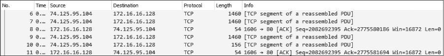

*图 9-23：TCP 在客户端浏览器和 Web 服务器之间传输数据*

一旦数据传输完成，Wireshark 会重新组装数据流以供查看，如图 9-24 所示。

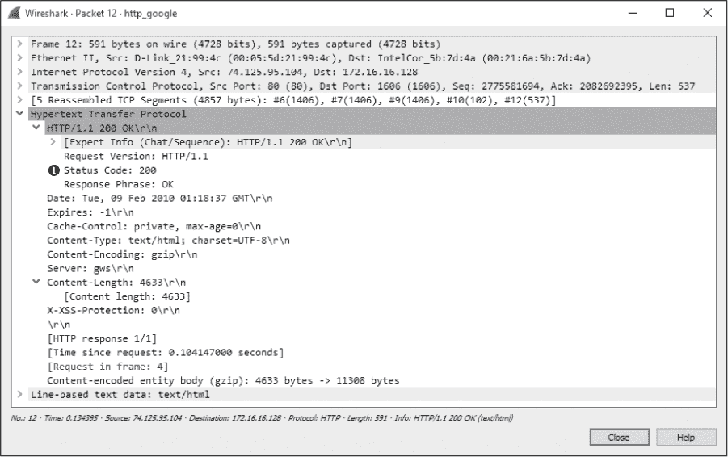

*图 9-24：最终 HTTP 数据包，响应代码为 200*

**注意**

*在许多情况下，你在浏览数据包列表时无法看到可读的 HTML 数据，因为这些数据经过 gzip 压缩以提高带宽效率。这可以通过 Web 服务器返回的 HTTP 响应中的 Content-Encoding 字段来表示。只有当你查看完整流时，数据才会被解码并变得易于阅读。*

HTTP 使用许多预定义的响应代码来指示请求方法的结果。在这个例子中，我们看到一个状态码为 200 ➊的数据包，表示请求方法成功。该数据包还包含了一个时间戳以及一些关于内容编码和 Web 服务器配置参数的附加信息。当客户端收到这个数据包时，交易就完成了。

#### ***使用 HTTP 发送数据***

*http_post.pcapng*

现在我们已经查看了从 Web 服务器下载数据的过程，接下来让我们关注上传数据。文件*http_post.pcapng*包含了一个非常简单的上传示例：一个用户向网站发布评论。在初始的三次握手之后，客户端（172.16.16.128）发送一个 HTTP 数据包到 Web 服务器（69.163.176.56），如图 9-25 所示。

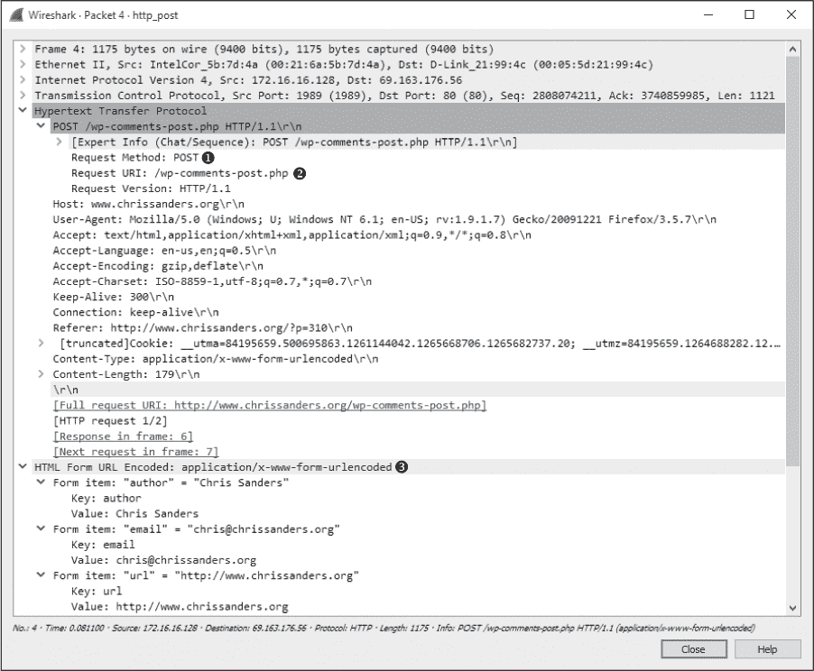

*图 9-25：HTTP `POST`数据包*

这个数据包使用`POST`方法 ➊将数据上传到 Web 服务器进行处理。这里使用的`POST`方法指定了 URI`/wp-comments-post.php` ➋以及 HTTP 版本`HTTP/1.1`。要查看发布的数据内容，请展开数据包中的 HTML 表单 URL 编码部分 ➌。

一旦数据通过这个`POST`传输，便会发送一个 ACK 数据包。如图 9-26 所示，服务器通过数据包 6 响应，传送响应代码 302 ➊，表示“找到”。

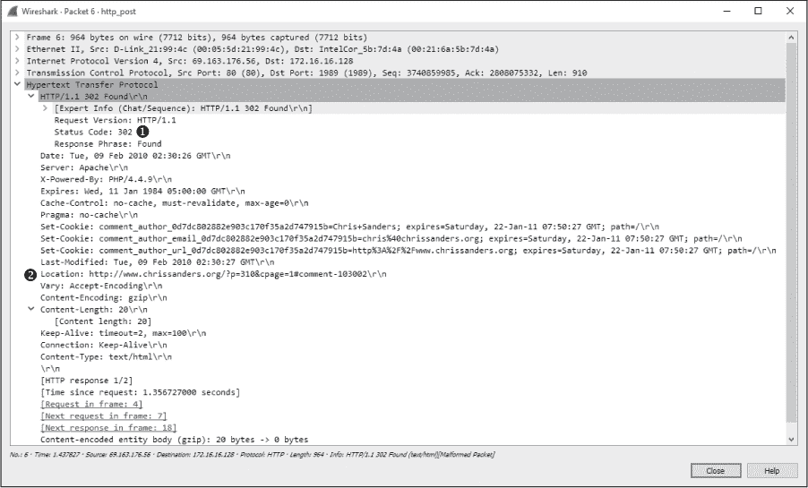

*图 9-26：HTTP 响应 302 用于重定向。*

302 响应代码是 HTTP 世界中常用的重定向方式。这个数据包中的 Location 字段指定了客户端应该被重定向到的位置 ➋。在这种情况下，位置是在发布评论的源网页上。客户端会执行一个新的`GET`请求，以获取新位置的内容，并通过接下来的几个数据包发送。最后，服务器传输状态码 200，通信结束。

### **简单邮件传输协议（SMTP）**

如果说网页浏览是用户最常参与的活动，那么发送和接收电子邮件大概排在第二位。*简单邮件传输协议（SMTP）*，用于 Microsoft Exchange 和 Postfix 等平台，是发送电子邮件的标准协议。

与 HTTP 类似，SMTP 数据包的结构可能会根据实现和客户端、服务器支持的功能集有所不同。在这一节中，我们将通过查看电子邮件发送过程的数据包级别内容来回顾 SMTP 的一些基本功能。

#### ***发送和接收电子邮件***

支持电子邮件的架构类似于美国邮政服务。当你写信时，你把信放进邮箱，邮递员把信件取走并送到邮局进行分类。然后，信件要么被送到由同一个邮局服务的另一个邮箱，要么被送到另一个邮局，后者负责将其递送到目的地。信件可能会经过多个邮局，甚至是专门用于分发到特定地理区域的“中转”邮局。这个信息流在图 9-27 中有所展示。

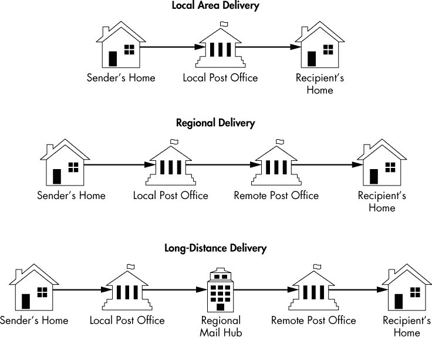

*图 9-27：通过邮政服务发送信件*

发送电子邮件的方式非常类似，但术语有所不同。在个人用户层面，物理邮箱被一个数字邮箱所取代，数字邮箱负责存储和促进电子邮件的发送和接收。你通过*邮件用户代理（MUA）*来访问这个邮箱，MUA 是像微软 Outlook 或 Mozilla Thunderbird 这样的电子邮件客户端。

当你发送一条消息时，它会从你的 MUA 发送到*邮件传输代理（MTA）*。MTA 通常被称为邮件服务器，常见的邮件服务器应用程序有微软 Exchange 或 Postfix。如果发送的电子邮件目的地是来自同一域，那么 MTA 可以在无需进一步通信的情况下将其与收件人的邮箱关联。如果电子邮件要发送到另一个域，MTA 必须使用 DNS 来找到收件人邮件服务器的位置地址，然后将消息传输到该服务器。值得注意的是，邮件服务器通常由其他组件组成，如邮件投递代理（MDA）或邮件提交代理（MSA），但从网络角度来看，我们通常只关心客户端和服务器的概念。这个基本概述在图 9-28 中有所说明。

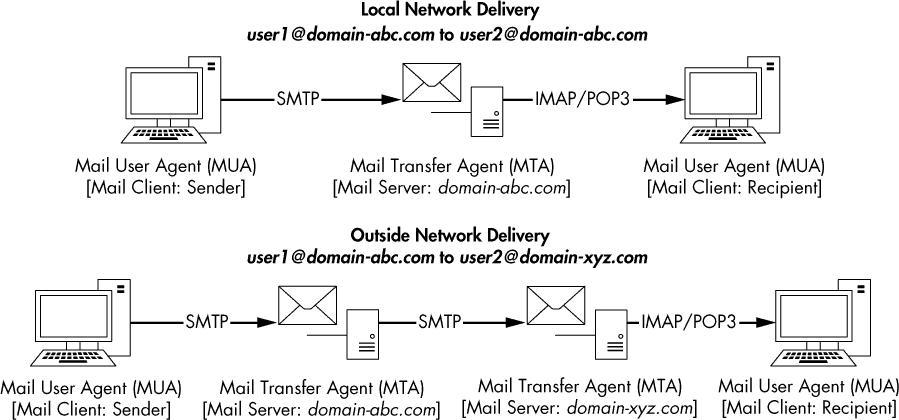

*图 9-28：通过 SMTP 发送电子邮件*

为了简化，我们将 MUA 称为电子邮件客户端，将 MTA 称为电子邮件服务器。

#### ***跟踪电子邮件消息***

通过基本了解电子邮件消息的传输方式，我们可以开始查看表示这个过程的数据包。让我们从图 9-29 中的场景开始。

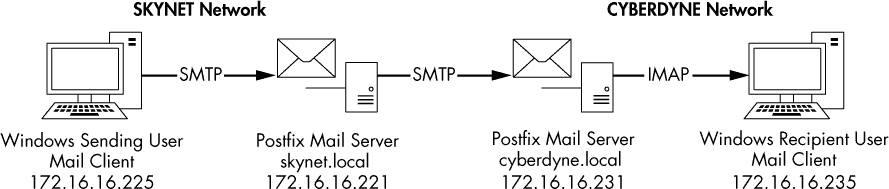

*图 9-29：从发件人到收件人跟踪电子邮件*

这个场景包含三个步骤：

1.  用户从工作站（172.16.16.225）发送消息。电子邮件客户端通过 SMTP 将消息传输到本地邮件服务器（172.16.16.221 / *skynet.local* 域）。

1.  本地邮件服务器接收消息，并通过 SMTP 将其传输到远程邮件服务器（172.16.16.231 / *cyberdyne.local* 域）。

1.  远程邮件服务器接收消息，并将其与适当的邮箱关联。用户工作站上的电子邮件客户端（172.16.16.235）使用 IMAP 协议检索此消息。

##### **步骤 1：客户端到本地服务器**

*mail_sender_client_1.pcapng*

我们将通过查看步骤 1 来开始这个过程，这一步由*mail_sender_client_1.pcapng*表示。文件在用户点击其邮件客户端中的发送按钮时开始，启动了工作站与本地邮件服务器之间的数据包 1 到数据包 3 的 TCP 握手。

**注意**

*在分析本节中的数据包捕获时，您可以忽略任何观察到的`ETHERNET FRAME CHECK SEQUENCE INCORRECT`错误。这些错误是实验环境中的副作用。*

一旦建立连接，SMTP 协议接管并开始将用户的消息传输到服务器。您可以通过逐个滚动数据包并查看数据包详情窗口中的 SMTP 部分来检查每个 SMTP 请求和响应，但有更简单的方法。由于 SMTP 是一个简单的事务协议，并且我们的示例是明文传输，您可以通过跟踪 TCP 流来在一个窗口中查看整个事务。右键点击数据包中的任何一个，选择**跟踪** ▶ **TCP 流**。生成的流在图 9-30 中显示。

连接建立后，邮件服务器在数据包 4 中向客户端发送服务横幅，表示它准备好接收命令。在此情况下，它自我标识为运行在 Ubuntu Linux 操作系统上的 Postfix 服务器 ➊。它还标识了它能够接收*扩展 SMTP（ESMTP）*命令。ESMTP 是 SMTP 规范的扩展，允许在邮件传输过程中使用额外的命令。

邮件客户端通过在数据包 5 中发出`EHLO`命令来做出响应 ➋。`EHLO`是“Hello”命令，用于在支持 ESMTP 时识别发送主机。如果 ESMTP 不可用，客户端将回退到`HELO`命令来标识自己。在本例中，发送方通过其 IP 地址进行标识，尽管也可以使用 DNS 名称。

在数据包 7 中，服务器响应包含包括`VRFY`、`STARTTLS`和`SIZE 10240000` ➌等项的列表。这个列表反映了 SMTP 服务器支持的命令，提供给客户端，以便客户端知道在传输消息时可以使用哪些命令。每次 SMTP 事务开始时，在发送消息之前，都会进行此功能协商。消息的传输从数据包 8 开始，占据了本次捕获的大部分内容。

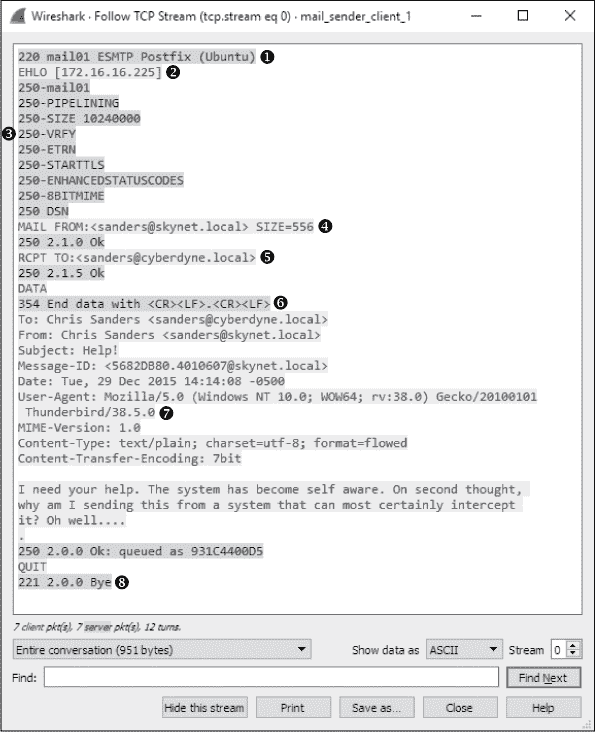

*图 9-30：查看从邮件客户端到本地服务器的 TCP 流*

SMTP 由客户端发送的简单命令和参数值控制，之后是服务器返回的响应代码。这与 HTTP 和 TELNET 等协议非常相似，且设计简洁。一个示例请求和响应可以在数据包 8 和 9 中看到，客户端发出`MAIL`命令，并带有参数`FROM:<sanders@skynet.local> SIZE=556` ➍，服务器以响应代码 250（请求的邮件操作正常，已完成）和`2.1.0 Ok`参数做出响应。在这里，客户端识别了发件人的电子邮件地址和消息的大小，服务器则响应说已接收到这些数据并且是可接受的。在数据包 10 和 11 中会发生类似的交易，客户端发出`RCPT`命令，并带有参数`TO:<sanders@cyberdyne.local>` ➎，服务器则回应另一个`250 2.1.5 Ok`代码。

**注意**

*如果你想查看所有可用的 SMTP 命令和参数，可以在这里查看：* [`www.iana.org/assignments/mail-parameters/mail-parameters.xhtml`](http://www.iana.org/assignments/mail-parameters/mail-parameters.xhtml)*。如果你想查看可用的响应代码，也可以在这里查看：* [`www.iana.org/assignments/smtp-enhanced-status-codes/smtp-enhanced-status-codes.xml`](https://www.iana.org/assignments/smtp-enhanced-status-codes/smtp-enhanced-status-codes.xml)。

剩下的就是传输邮件内容本身了。客户端在数据包 12 中发出`DATA`命令，启动这个过程。服务器以代码 354 和一条信息 ➏回应，表示服务器已为消息创建了一个缓冲区，并告诉客户端开始传输。包含代码 354 的那一行告诉客户端，发送一个点（`<CR><LF>.<CR><LF>`）来标记传输的结束。消息以明文形式传输，且成功传输后，服务器发送响应代码。你会注意到，消息文本中还包含了一些附加信息，包括日期、内容类型和编码，以及与该传输相关的用户代理。这表明发送此消息的最终用户使用的是 Mozilla Thunderbird ➐。

传输完成后，SMTP 连接由邮件客户端通过在数据包 18 中发出没有参数的`QUIT`命令终止。服务器在数据包 19 中以响应代码 221（*<domain>* 服务关闭传输通道）和`2.0.0 Bye`参数 ➑作出回应。TCP 连接在数据包 20–23 中优雅地断开。

##### **步骤 2：本地服务器到远程服务器**

*mail_sender_server_2.pcapng*

接下来，我们将从负责*skynet.local*域的本地邮件服务器的角度来审视同样的场景；其地址是 172.16.16.221\。这个捕获文件可以在 *mail_sender_server_2.pcapng* 中找到，该文件直接从邮件服务器捕获。正如你所预期的，前 20 个左右的数据包与步骤 1 中的捕获镜像相同，因为它们是从另一个来源捕获的相同数据包。

如果发送的消息是发送到*skynet.local*域的另一个邮箱，我们就不会看到更多的 SMTP 流量；相反，我们会看到使用 POP3 或 IMAP 协议从邮件客户端检索消息。然而，由于此消息是发送到*cyberdyne.local*域，本地 SMTP 服务器必须将消息传输到负责该域的远程 SMTP 服务器。这个过程从数据包 22 开始，涉及本地服务器 172.16.16.221 和远程邮件服务器 172.16.16.231 之间的 TCP 握手。

**注意**

*在实际场景中，邮件服务器通过使用一种称为邮件交换（MX）记录的特殊 DNS 记录类型来定位另一个服务器。由于这个场景是在实验室中创建的，且远程邮件服务器的 IP 地址已预配置在本地服务器上，因此我们不会在此看到该流量。如果你在排查邮件传输问题时，应考虑 DNS 问题与邮件协议问题的可能性。*

建立连接后，我们可以在数据包列表窗口中看到，SMTP 被用来将消息发送到远程服务器。你可以通过查看此次事务的 TCP 流来更好地查看这个过程。它在图 9-31 中显示。如果你需要帮助来隔离这个连接，可以在过滤栏中应用过滤器 tcp.stream == 1。

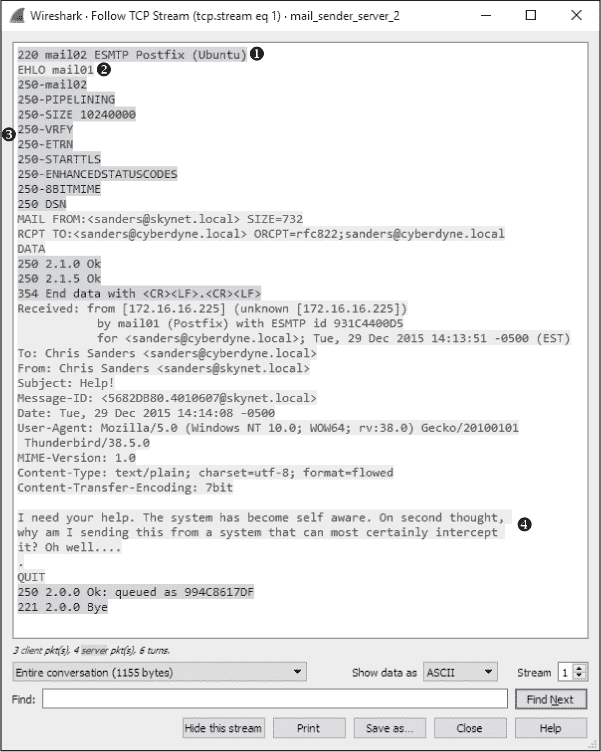

*图 9-31：查看从本地邮件服务器到远程邮件服务器的 TCP 流*

这个事务与图 9-30 中的几乎相同。本质上，消息只是通过服务器之间传输。远程服务器将自己标识为`mail02` ➊，本地服务器将自己标识为`mail01` ➋，共享一组支持命令 ➌，并且消息在传输时完整无缺，其中之前事务的部分数据被附加到消息的收件人行（To line）上 ➍。这一切发生在数据包 27 到 35 之间，最后通过 TCP 拆除关闭了通信通道。

服务器最终并不关心消息是来自电子邮件客户端还是另一台 SMTP 服务器，因此所有相同的规则和程序都适用（除非有任何访问控制限制）。在现实世界中，本地邮件服务器和远程邮件服务器可能不支持相同的功能集，或者可能基于完全不同的平台。这就是为什么最初的 SMTP 通信如此重要的原因；它允许接收服务器将其支持的功能集传输给发送方。当一个 SMTP 客户端或服务器知道接收服务器支持的功能时，SMTP 命令可以进行调整，以便有效地传输消息。这种能力使得 SMTP 可以在任何数量的客户端和服务器技术之间广泛使用，这也是你在发送电子邮件时不必了解接收方的网络基础设施的原因。

##### **步骤 3：远程服务器到远程客户端**

*mail_receiver_server_3.pcapng*

此时，我们的消息已经到达了负责将电子邮件投递到 *cyberdyne.local* 域邮箱的远程服务器。接下来，我们将查看从远程服务器角度捕获的一个数据包，它的名称是 *mail_receiver_server_3.pcapng*，如 图 9-32 所示。

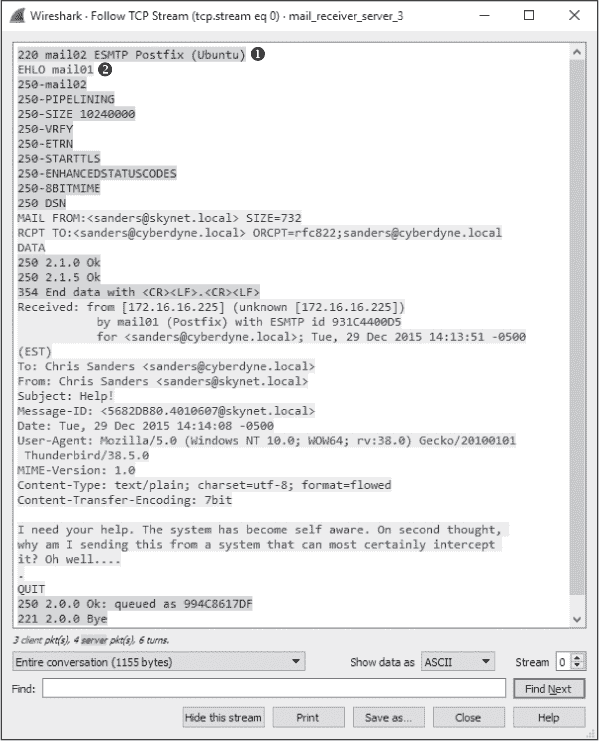

*图 9-32：查看从本地邮件服务器到远程邮件服务器的 TCP 流*

再次提醒，这次捕获中的前 15 个数据包看起来非常熟悉，因为它们代表的是相同的消息交换，其中源地址代表本地邮件服务器 ➊，目标地址代表远程邮件服务器 ➋。完成此序列后，SMTP 服务器可以将消息与适当的邮箱关联起来，以便目标接收者可以通过他们的电子邮件客户端检索消息。

如前所述，SMTP 主要用于发送电子邮件，并且迄今为止是最常见的用于该目的的协议。从服务器上的邮箱中检索电子邮件则相对更加开放，因为在这个过程中有不同的需求，因此有几种协议被设计来支持这个任务。最常见的协议是邮局协议版本 3（POP3）和互联网邮件访问协议（IMAP）。在我们的例子中，远程客户端通过 IMAP 协议在数据包 16 到 34 中从邮件服务器检索消息。

本书中我们不讨论 IMAP，但在这个例子中，即使我们讨论了它，它也不会给你太多帮助，因为通信是加密的。如果你查看数据包 21，你会看到客户端（172.16.16.235）在数据包 21 中向邮件服务器（172.16.16.231）发送了 `STARTTLS` 命令 ➊，如 图 9-33 所示。

*图 9-33：STARTTLS 命令表示 IMAP 流量将被加密。*

该命令告知服务器客户端希望使用 TLS 加密安全地检索邮件。在数据包 24–27 ➋ 中，客户端和服务器之间会协商出一个安全通道，随后邮件通过 *TLS（传输层安全）* 协议在剩余数据包 ➌ 中安全地被检索。如果你点击这些数据包查看数据或尝试跟踪 TCP 流（图 9-34），你会发现内容是不可读的，这样就能保护电子邮件不被可能试图恶意劫持或嗅探流量的人员截取。

随着最后的数据包接收完成，从一个域的用户向另一个域的用户发送邮件的过程就完成了。

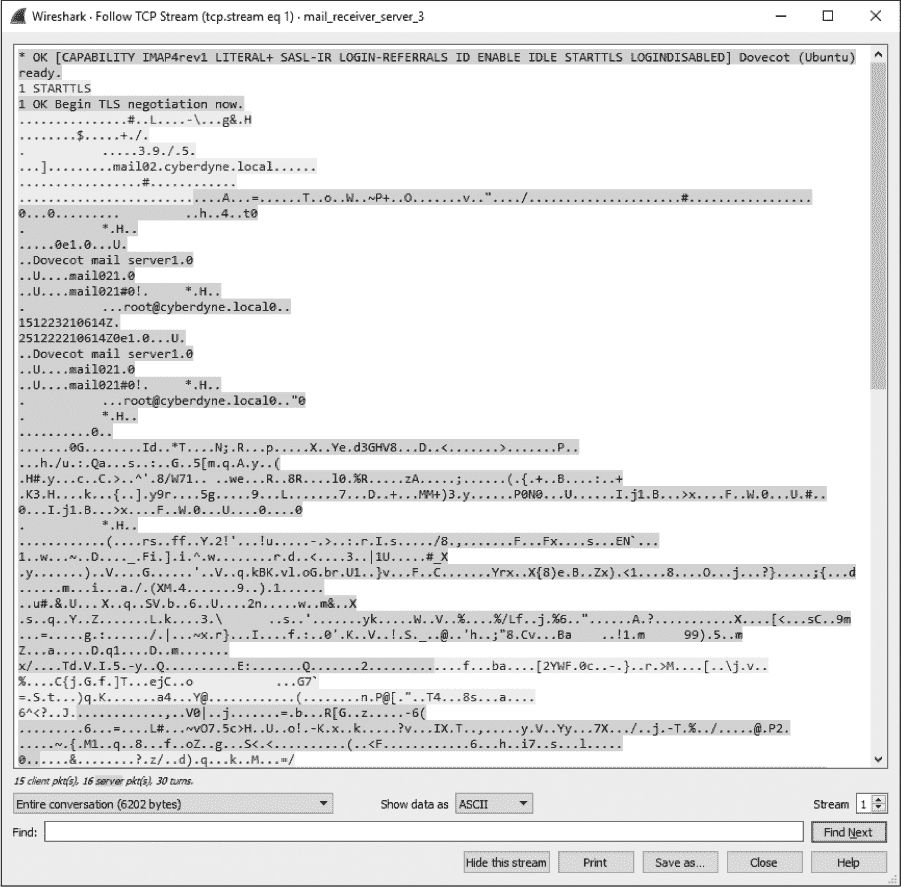

*图 9-34：IMAP 流量在客户端下载邮件时被加密。*

#### ***通过 SMTP 发送附件***

*mail_sender_attachment.pcapng*

SMTP 从来不是用来传输文件的机制，但由于通过电子邮件发送文件的便利性，它已经成为许多人主要的共享机制。让我们通过一个简单的例子，看看使用 SMTP 发送文件在数据包层面上是如何进行的。

在数据包捕获文件 *mail_sender_attachment.pcapng* 中，用户正在从其客户端（172.16.16.225）通过本地 SMTP 邮件服务器（172.16.16.221）向同一网络中的另一用户发送电子邮件。邮件包含一些文本，并附带一个图片文件。

通过 SMTP 发送附件与发送文本并没有太大区别。对于服务器来说，这些都只是数据，虽然通常会进行一些特殊编码，但我们仍然依赖 `DATA` 命令将数据传送到目的地。要看到这一过程的实际操作，打开捕获文件并跟踪给定 SMTP 事务的 TCP 流。这一过程在 图 9-35 中有所展示。

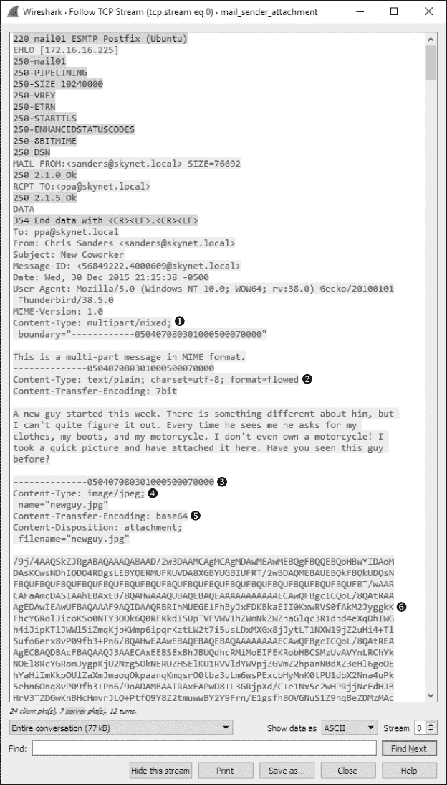

*图 9-35：用户通过 SMTP 发送附件*

这个例子和之前的场景一样，首先是服务识别和支持协议的交换。当客户端准备好发送邮件时，它会提供发件人和收件人的地址，并发送 `DATA` 命令，指示服务器打开一个缓冲区来接收信息。此时，事情就有些不同了。

在前面的示例中，客户端直接将文本传输到服务器，仅此而已。在这个示例中，客户端必须同时发送明文消息和与图像附件相关的二进制数据。为了实现这一点，它将其 Content-Type 标识为`multipart/mixed`，并使用边界值`------------050407080301000500070000` ➊。这告诉服务器，正在传输多种类型的数据，每种数据都有自己独特的 MIME 类型和编码，并且每种数据将通过指定的边界值进行分隔。因此，当另一个邮件客户端接收到这些数据时，它将根据边界值以及每个数据块中指定的唯一 MIME 类型和编码来解释数据。

在我们的示例中，这条消息有两个独特的部分。第一个是邮件正文本身，它通过内容类型`text/plain` ➋进行标识。接下来，我们看到一个边界标记和新消息部分的开始 ➌。这一部分包含图像文件，并通过内容类型`image/jpeg` ➍进行标识。还值得注意的是，`Content-Transfer-Encoding`的值被设置为`base64` ➎，这意味着数据必须从 Base64 编码转换才能进行解析。剩余的传输内容包括编码后的图像文件 ➏。

无论你做什么，都不要把这种编码与安全功能混淆。Base64 编码几乎是瞬时可逆的，任何拦截此通信的攻击者都能轻松恢复图像文件。如果你有兴趣自己从数据包捕获中提取出这个图像文件，在第十二章的远程访问木马部分有一个类似的场景，我们在那里从基于 HTTP 的文件传输中提取图像。阅读完后，翻回这个捕获文件，看看你是否能找出用户神秘的新同事是谁。

### **最终思考**

本章介绍了在分析应用层流量时最常遇到的协议。在接下来的章节中，我们将探讨新的协议以及我们在此处讨论的协议的附加功能，同时探索各种真实世界的场景。

要了解更多关于各个协议的信息，请阅读它们相关的 RFC，或参考 Charles M. Kozierok 所著的*《TCP/IP 指南》*（No Starch Press，2005）。此外，请参阅附录 A 中的资源列表。
