## 第十章：**基础现实世界场景**

从这一章开始，我们将深入数据包分析的核心内容，使用 Wireshark 分析现实世界中的网络问题。我将通过描述问题的背景并提供分析师当时获得的信息来介绍一系列问题场景。在打下基础后，我们将转向分析部分，我会描述用于捕获适当数据包的方法，并引导你一步步向诊断迈进。一旦分析完成，我将指出潜在的解决方案并概述学到的经验教训。

在整个过程中，请记住，分析是一个非常动态的过程。因此，我用来分析每个场景的方法可能和你使用的方法不同。每个人通过自己的视角来解决问题和推理。最重要的是，分析的结果能解决问题，即使没有解决问题，从失败中学习也是至关重要的。毕竟，经验是我们在没有得到想要的结果时获得的。

此外，本章讨论的大多数问题可能通过不一定需要使用数据包嗅探器的方法来解决，但那样有什么趣味呢？当我第一次学习如何分析数据包时，我发现通过使用数据包分析技巧以不寻常的方式分析典型问题很有帮助，这也是我向你们展示这些场景的原因。

### 缺失的网页内容

*http_espn_fail.pcapng*

在我们要查看的第一个场景中，我们的用户是数据包皮特，他是一个大学篮球迷，不熬夜，通常错过西海岸的比赛。每当他早上坐到工作站时，他首先做的事就是访问*[`www.espn.com/`](http://www.espn.com/)*查看前一晚的比赛最终得分。当皮特今天早上浏览 ESPN 时，他发现页面加载非常缓慢，最终加载完成时，大部分图片和内容都缺失了（图 10-1）。让我们帮皮特诊断这个问题。

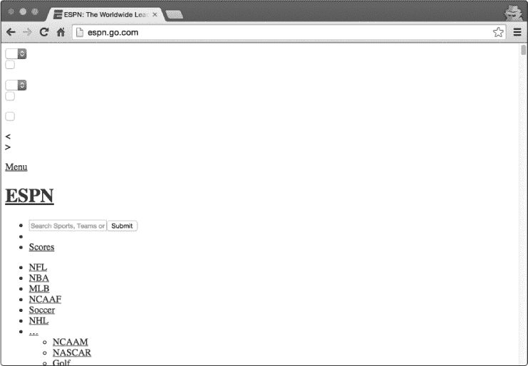

*图 10-1：ESPN 加载不正常*

#### *连接到线路*

这个问题仅限于皮特的工作站，并没有影响到其他工作站，所以我们将从皮特的工作站直接捕获数据包来开始。为此，我们将安装 Wireshark 并在浏览 ESPN 网站时捕获数据包。这些数据包存储在文件*http_espn_fail.pcapng*中。

#### *分析*

我们知道 Pete 的问题是他无法查看他正在浏览的网站，因此我们主要会查看 HTTP 协议。如果你阅读了上一章，你应该对客户端和服务器之间的 HTTP 流量有一个基本的了解。一个好的起点是查看向远程服务器发出的 HTTP 请求。你可以通过应用`GET`请求的过滤器（使用 http.request.method == "GET"）来做到这一点，但也可以通过从主下拉菜单中选择**统计信息** ▶ **HTTP** ▶ **请求**来实现这一点（图 10-2）。

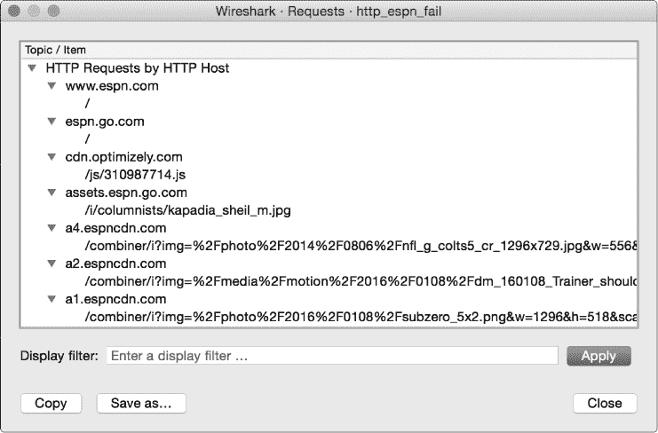

*图 10-2：查看向 ESPN 发送的 HTTP 请求*

从这个概述中看，捕获内容似乎仅限于七个不同的 HTTP 请求，而且它们看起来都与 ESPN 网站相关。每个请求的域名中都包含`espn`这个字符串，唯一例外的是 *[cdn.optimizely.com](http://cdn.optimizely.com)*，它是一个*内容分发网络*(CDN)，用于向多个网站投放广告。浏览到托管广告或其他外部内容的网站时，看到对各种 CDN 的请求是很常见的。

由于没有明确的线索可供追踪，下一步是通过选择**统计信息** ▶ **协议层级**来查看捕获文件的协议层级。这将帮助我们发现意外的协议或每种协议的流量分布情况（图 10-3）。请记住，协议层级屏幕基于当前应用的显示过滤器。请确保清除先前应用的过滤器，以便基于整个数据包捕获获得预期结果。

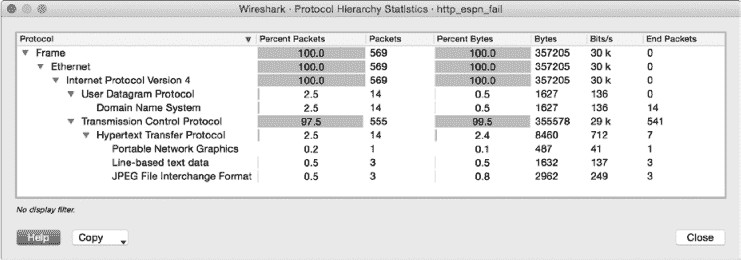

*图 10-3：查看浏览会话的协议层级*

协议层级并不复杂，我们可以迅速解读出只有两个应用层协议在工作：HTTP 和 DNS。正如你在第九章中所学，DNS 用于将域名转换为 IP 地址。因此，当你浏览像 *[`www.espn.com/`](http://www.espn.com/)* 这样的网站时，如果系统尚未知道远程服务器的 IP 地址，可能需要发送 DNS 查询来查找该 IP 地址。一旦收到包含适当 IP 地址的 DNS 回复，该信息可以被添加到本地缓存中，然后可以开始进行 HTTP 通信（使用 TCP）。

虽然这里看起来并没有什么异常，但 14 个 DNS 数据包是值得注意的。一个域名的 DNS 请求通常会包含在一个数据包中，响应也会构成一个数据包（除非数据包非常大，在这种情况下 DNS 会使用 TCP）。由于这里有 14 个 DNS 数据包，可能生成了多达七个 DNS 查询（7 个查询 + 7 个回复 = 14 个数据包）。图 10-2 确实显示了对七个不同域名的 HTTP 请求，但 Pete 在浏览器中只输入了一个 URL。为什么会发出这么多额外的请求呢？

在一个简单的世界里，访问一个网页可能就像查询一个服务器并通过一次 HTTP 对话拉取所有内容一样简单。实际上，单个网页可能会提供托管在多个服务器上的内容。所有基于文本的内容可能在一个地方，图形可能在另一个地方，嵌入的视频可能在第三个地方。除此之外，还有广告，这些广告可能由多个提供商托管，跨越数十个独立的服务器。每当 HTTP 客户端解析 HTML 代码并找到引用其他主机内容的链接时，它会尝试查询该主机以获取内容，这就可能生成额外的 DNS 查询和 HTTP 请求。这正是 Pete 访问 ESPN 时发生的情况。尽管他可能只打算查看来自单一来源的内容，但在 HTML 代码中找到了对其他内容的引用，他的浏览器自动向多个不同的域名请求这些内容。

现在我们已经理解了所有这些额外请求的存在原因，接下来的步骤是检查与每个请求相关的个别对话（**统计 ▶ 对话**）。查看对话窗口（图 10-4）提供了一个重要线索。

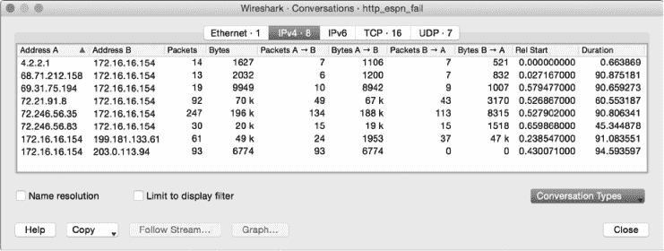

*图 10-4：审查 IP 对话*

我们之前发现有七个 DNS 请求和七个 HTTP 请求相匹配。考虑到这一点，合理的预期是会有七个匹配的 IP 对话，但事实并非如此。实际上有八个。那该如何解释呢？

一个可能的想法是，捕获的数据中可能有与当前问题无关的额外对话“污染”了分析结果。确保分析不受无关流量的影响是非常重要的，但这并不是本次对话中的问题。如果你检查每个 HTTP 请求并记录请求发送的 IP 地址，你应该会发现有一个对话没有匹配的 HTTP 请求。这个对话的终端是 Pete 的工作站（172.16.16.154）和远程 IP（203.0.113.94）。这个对话在图 10-4 的底部表示。我们注意到，6,774 字节被发送到这个未知主机，但没有字节被返回：这值得进一步探究。

如果你对这个对话进行过滤（右键点击该对话并选择**应用为过滤器 ▶ 选择 ▶ A<->B**），你可以运用你对 TCP 的知识来识别出了什么问题（图 10-5）。

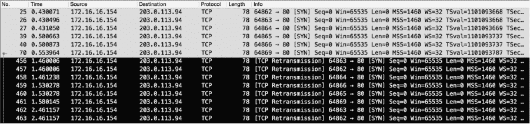

*图 10-5：回顾意外连接*

在正常的 TCP 通信中，你会看到标准的 SYNSYN/ACK-ACK 握手序列。在这种情况下，Pete 的工作站向 203.0.113.94 发送了一个 SYN 数据包，但我们从未看到 SYN/ACK 响应。不仅如此，Pete 的工作站多次发送 SYN 数据包也未能成功，最终导致他的计算机发送 TCP 重传数据包。我们将在第十一章中详细讨论 TCP 重传的具体情况，但这里的关键要点是，一个主机发送了数据包，却没有收到任何响应。从时间列中可以看到，重传持续了 95 秒而没有得到响应。在网络通信中，这比蜂蜜还慢。

我们已经识别出七个 DNS 请求、七个 HTTP 请求和八个 IP 对话。由于我们知道捕获的数据没有被额外数据污染，因此可以合理推测神秘的第八个 IP 对话可能是 Pete 的网页加载缓慢且不完全的原因。由于某种原因，Pete 的工作站正在尝试与一个不存在或根本没有响应的设备进行通信。为了理解为什么会发生这种情况，我们不去查看捕获文件中的内容，而是考虑文件中缺失的部分。

当 Pete 浏览到 *[`www.espn.com/`](http://www.espn.com/)* 时，他的浏览器识别出了托管在其他域名上的资源。为了检索这些数据，他的工作站生成了 DNS 请求来查找它们的 IP 地址，然后通过 TCP 连接到这些地址，以便发送 HTTP 请求获取内容。在与 203.0.113.94 的对话中，并没有找到 DNS 请求。那么，Pete 的工作站是如何知道这个地址的呢？

如果你还记得我们在第九章中讨论的 DNS 内容，或者你对 DNS 有一定了解，你就知道大多数系统都实现了某种形式的 DNS 缓存。这使得它们可以引用已经检索到的本地 DNS 到 IP 地址的映射，而无需每次访问一个常用域名时都生成 DNS 请求。最终，这些 DNS 到 IP 的映射会过期，必须生成新的请求。然而，如果 DNS 到 IP 的映射发生了变化，而设备在下次访问时没有生成 DNS 请求来获取新的地址，那么该设备将尝试连接一个已经失效的地址。

在皮特的情况下，正是发生了这种情况。皮特的工作站已经缓存了一个 DNS 到 IP 的映射，该映射指向托管 ESPN 内容的域名。由于这个缓存条目存在，DNS 请求没有被生成，他的系统尝试直接连接到旧的地址。然而，那个地址已经不再配置为响应请求。因此，请求超时，内容也没有加载出来。

幸运的是，对于皮特来说，手动清除 DNS 缓存只需要在命令行或终端窗口中敲几下键就能完成。或者，他也可以等几分钟，等 DNS 缓存条目过期时，再尝试一次，这时会生成一个新的请求。

#### *经验教训*

这是一项大工程，目的只是为了知道肯塔基大学以 90 分的优势击败了杜克大学，但我们却从中获得了对网络主机关系更深的理解。在这个场景中，我们通过评估与请求和通信相关的多个数据点，逐步找到了问题的解决办法。通过这些数据点，我们发现了一些不一致之处，进而发现了客户端与 ESPN 内容分发服务器之间的通信故障。

在现实世界中，诊断问题很少像滚动查看数据包列表并寻找看起来奇怪的数据包那么简单。即便是最简单的问题，排除故障也可能导致非常大的抓包文件，这时就需要依赖 Wireshark 的分析和统计功能来识别异常。熟悉这种分析方式对于在数据包级别上成功排查故障至关重要。

如果你想看看正常的 web 浏览器与 ESPN 之间的通信示例，试着自己访问该网站并捕获流量，看看你能否识别出所有负责传递内容的服务器。

### 无响应的天气服务

*weather_broken.pcapng weather_working.pcapng*

我们的第二个场景再次涉及到我们的朋友数据包皮特。在他众多的爱好中，皮特自认为是一个业余气象学家，几乎每隔几个小时就会检查当前的天气状况和预报。不过，他并不完全依赖当地新闻的天气预报；他实际上在家外面安装了一个小型气象站，将数据报告上传到* [`www.wunderground.com/`](https://www.wunderground.com/)*，以便聚合和查看。今天，皮特去检查他的气象站，看看气温一夜之间下降了多少，但发现他的气象站已经超过九个小时没有向 Wunderground 报告数据了，从大约午夜开始（图 10-6）。

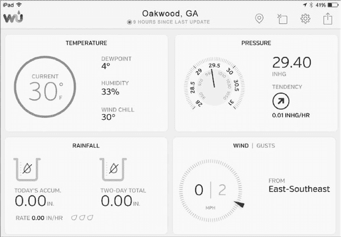

*图 10-6：气象站已经九小时没有报告数据了。*

#### *深入了解数据线*

在 Pete 的网络中，安装在他屋顶上的气象站通过 RF 连接与屋内的接收器相连。接收器连接到他的网络交换机，并通过互联网向 Wunderground 报告统计数据。这种架构在图 10-7 中进行了示意。

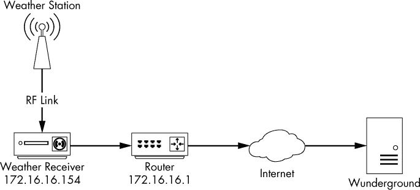

*图 10-7：气象站网络架构*

接收器有一个简单的基于网页的管理页面，但 Pete 登录后只看到一条关于最后一次同步时间的晦涩信息，并没有提供任何额外的故障排除指导——软件没有提供详细的错误日志。由于接收器是气象站基础设施的通信枢纽，捕获传入和传出的数据包来诊断问题是有意义的。这是一个家庭网络，所以在 SOHO 交换机上可能没有端口镜像功能。我们最好的选择是使用便宜的 taps，或者执行 ARP 缓存中毒来拦截这些数据包。捕获的数据包存储在文件*weather_broken.pcapng*中。

#### *分析*

打开捕获文件后，你会发现我们再次处理的是 HTTP 通信。数据包捕获仅限于 Pete 本地气象接收器 172.16.16.154 与互联网中一个未知远程设备 38.102.136.125 之间的单一对话（见图 10-8）。

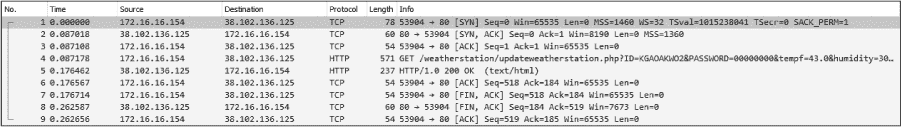

*图 10-8：隔离的气象站接收器通信*

在我们检查对话的特征之前，先看看能否识别出这个未知 IP。在没有广泛研究的情况下，我们可能无法确定这个 IP 是否是 Pete 的气象接收器应该连接的确切 IP 地址，但我们至少可以通过进行 WHOIS 查询验证它是否属于 Wunderground 的基础设施。你可以通过大多数域名注册或区域互联网注册网站进行 WHOIS 查询，例如*[`whois.arin.net/`](http://whois.arin.net/)*。在这种情况下，看起来该 IP 属于 Cogent，一家*互联网服务提供商（ISP）*（见图 10-9）。PSINet Inc.也在这里提到，但通过快速搜索发现，PSINet 的大多数资产在 2000 年代初被 Cogent 收购。

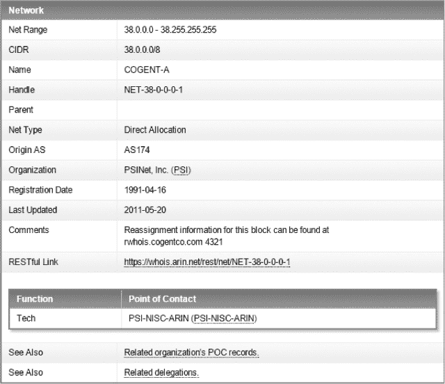

*图 10-9：WHOIS 数据识别了该 IP 的所有者。*

在某些情况下，如果一个 IP 地址直接注册到某个组织，WHOIS 查询会返回该组织的名称。然而，很多时候公司只是利用互联网服务提供商（ISP）的 IP 地址空间，而没有将其直接注册到自己名下。在这些情况下，另一个有用的策略是搜索与 IP 地址相关联的 *自治系统号码（ASN）*。组织需要注册 ASN 以支持公共互联网中的某些类型路由。有多种方式可以查找 IP 到 ASN 的关联（一些 WHOIS 查询会自动提供），但我喜欢使用 Team Cymru 的自动查找工具 (*[`asn.cymru.com/`](https://asn.cymru.com/)*)。通过这个工具查询 38.102.136.125，我们看到它与 AS 36347 相关联，而 AS 36347 又与“Wunderground – The Weather Channel, LLC, US”相关联（图 10-10）。这告诉我们，天气站正在与设备进行通信，至少该设备在正确的网络环境中。如果我们无法识别该地址的正确归属，可能需要探索 Pete 的接收器是否与错误的设备通信，但该地址是正确的。

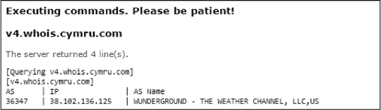

*图 10-10：外部 IP 地址的 IP 到 ASN 查找*

在明确了未知主机之后，我们可以深入研究通信的细节。整个通信过程相对简短。它包括一次 TCP 握手，一个 `GET` 请求和响应，以及一次 TCP 拆除。握手和拆除看起来是成功的，因此我们遇到的问题很可能仅限于 HTTP 请求本身。为了仔细检查这一点，我们将跟踪 TCP 流（图 10-11）。

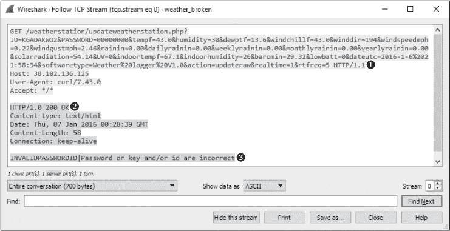

*图 10-11：跟踪天气接收器通信的 TCP 流*

HTTP 通信从 Pete 的天气接收器向 Wunderground 发送的 `GET` 请求开始。没有传输 HTTP 内容，但在 URL ➊ 中传输了大量数据。通过 URL 查询字符串传输数据在 Web 应用中很常见，看来接收器正通过这种机制传递天气更新。例如，你可以看到字段如 `tempf=43.0`、`dewptf=13.6` 和 `windchillf=43.0`。Wunderground 的收集服务器正在从 URL 中解析字段和参数列表，并将它们存储在数据库中。

初看之下，向 Wunderground 服务器发送的 `GET` 请求似乎一切正常。但查看相应的回复时发现报告了一个错误。服务器响应了一个 `HTTP/1.0 200 OK` 响应代码 ➋，表示 `GET` 请求已接收并成功，但响应体中包含一条有用的消息：`INVALIDPASSWORDID|密码或密钥和/或 ID 不正确` ➌。

如果你回过头看一下请求 URL，你会发现传递的前两个参数是`ID`和`PASSWORD`。这两个参数用于识别气象站的呼号并将其认证到 Wunderground 服务器。

在这种情况下，Pete 的气象站 ID 是正确的，但密码不正确。由于某种未知原因，它被替换成了零。由于上次已知的成功通信发生在午夜，因此有可能是应用了某次更新，或者接收器重启后丢失了密码配置。

**注意**

*虽然许多开发人员选择在 URL 中传递参数，但通常不推荐像这里一样将密码放在 URL 中。因为在使用 HTTP 时，所请求的 URL 会以明文形式传输，除非添加了加密，例如 HTTPS。因此，任何一个恰巧监听网络的恶意用户都可能拦截你的密码。*

在这一点上，Pete 能够访问他的接收器并输入新密码。没过多久，他的气象站开始重新同步数据。成功的气象站通信示例可以在 *weather_working.pcapng* 中找到。通信流如 图 10-12 所示。

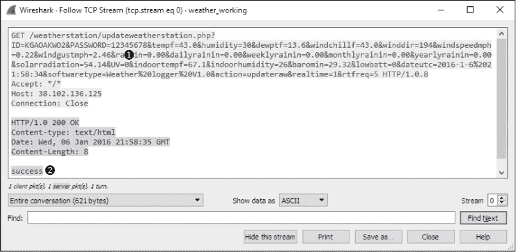

*图 10-12：成功的气象站通信*

现在密码是正确的 ➊，Wunderground 服务器在 HTTP 响应体中返回了 `success` 消息 ➋。

#### *经验教训*

在这种情况下，我们遇到了一个第三方服务，通过使用另一种协议（HTTP）中可用的功能来促进网络通信。解决第三方服务的通信问题是你经常会遇到的事情，而当没有合适的文档或错误日志时，数据包分析技术非常适合用于排查这些服务的问题。随着物联网（IoT）设备的普及，如本示例中的气象站，这种情况变得越来越常见。

解决这些问题需要能够检查未知的流量序列，并推断出事物应该如何工作。一些应用程序，如本场景中的基于 HTTP 的气象数据传输，比较简单。而其他一些应用则相当复杂，可能涉及多个事务、添加加密，甚至是 Wireshark 无法原生解析的自定义协议。

当你调查更多第三方服务时，你最终会开始了解开发人员用来促进网络通信的常见模式。这些知识将提高你在排查问题时的效率。

### 无互联网访问

在许多情况下，你可能需要诊断和解决互联网连接问题。我们将讨论一些你可能遇到的常见问题。

#### *网关配置问题*

*nowebaccess1.pcapng*

我们的下一个场景呈现了一个常见问题：用户无法访问互联网。我们已确认用户可以访问网络的所有内部资源，包括其他工作站的共享资源和本地服务器上托管的应用程序。

网络架构非常简单，因为所有的客户端和服务器都连接到一系列简单的交换机。互联网接入通过一个路由器处理，该路由器作为默认网关，IP 地址信息由 DHCP 提供。这是小型办公室中非常常见的场景。

##### 接入网络

为了确定问题的原因，我们可以让用户在我们监听网络时尝试浏览互联网。我们使用第二章中的信息（见图 2-15）来确定放置嗅探器的最合适方法。

我们网络中的交换机不支持端口镜像。我们已经需要中断用户以进行测试，因此我们可以假设再次将用户下线是可以的。即使这不是一个高吞吐量的场景，如果有 TAP 设备，使用它也是合适的。生成的文件是*nowebaccess1.pcapng*。

##### 分析

流量捕获始于一个 ARP 请求和回复，如图 10-13 所示。在数据包 1 中，用户的计算机，MAC 地址为 00:25:b3:bf:91:ee，IP 地址为 172.16.0.8，向网络段上的所有计算机广播 ARP 数据包，试图找到与其默认网关的 IP 地址 172.16.0.10 相关联的 MAC 地址。

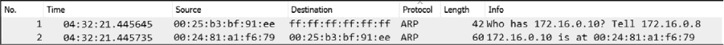

*图 10-13：计算机默认网关的 ARP 请求和回复*

在数据包 2 中接收到一个响应，用户的计算机得知 172.16.0.10 的 MAC 地址是 00:24:81:a1:f6:79。一旦接收到这个回复，计算机便有了通往网关的路由，网关应该能够将其引导到互联网。

在 ARP 回复之后，计算机必须尝试通过 DNS 解析网站的 DNS 名称为 IP 地址，在数据包 3 中完成。如图 10-14 所示，计算机通过向其主要 DNS 服务器 4.2.2.2 发送 DNS 查询数据包来执行此操作➊。

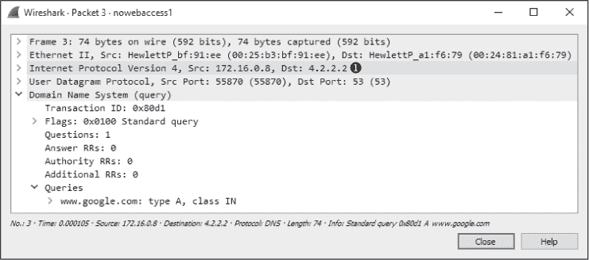

*图 10-14：发送到 4.2.2.2 的 DNS 查询*

在正常情况下，DNS 服务器会非常快速地响应 DNS 查询，但这里并非如此。我们没有收到响应，而是看到同样的 DNS 查询第二次发送到不同的目标地址。如图 10-15 所示，在数据包 4 中，第二个 DNS 查询被发送到计算机上配置的备用 DNS 服务器 4.2.2.1➊。

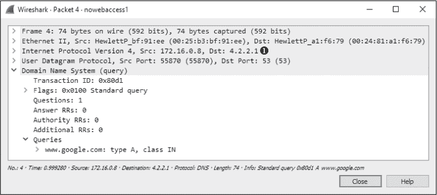

*图 10-15：发送到 4.2.2.1 的第二个 DNS 查询*

再次，由于没有收到 DNS 服务器的回复，查询在 1 秒后再次发送到 4.2.2.2。这个过程会重复进行，在接下来的几秒钟内，查询会在主 DNS 服务器➊和备用 DNS 服务器➋之间交替进行，如图 10-16 所示。整个过程大约需要 8 秒钟➌，或者直到用户的互联网浏览器报告无法访问网站。

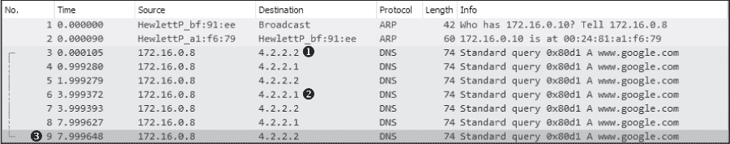

*图 10-16：DNS 查询会一直重复，直到通信停止。*

根据我们看到的数据包，我们可以开始定位问题的根源。首先，我们看到一个成功的 ARP 请求，目标是我们认为是网络默认网关路由器的设备，所以我们知道该设备在线并且在通信。我们还知道用户的计算机实际上正在向网络发送数据包，因此可以假设计算机本身的协议栈没有问题。问题显然在 DNS 请求发出时发生。

在该网络中，DNS 查询由互联网上的外部服务器（4.2.2.2 或 4.2.2.1）解析。这意味着，要正确解析，负责将数据包路由到互联网的路由器必须成功地将 DNS 查询转发到服务器，并且服务器必须做出响应。在 HTTP 请求网页之前，这一切都必须先发生。

因为没有其他用户遇到连接互联网的问题，所以网络路由器和远程 DNS 服务器可能不是问题的根源。剩下需要调查的唯一问题就是用户的计算机本身。

在对受影响的计算机进行更深入检查后，我们发现计算机并没有收到由 DHCP 分配的地址，而是手动设置了地址信息，并且默认网关地址设置错误。设置为默认网关的地址不是路由器，无法将 DNS 查询数据包转发到网络外部。

##### 经验教训

这个场景中的问题源于客户端配置错误。虽然问题本身很简单，但对用户的影响却很大。对于缺乏网络知识或无法进行快速数据包分析的人员来说，像这样一个简单的配置错误可能需要相当长的时间来排除，就像我们这里所做的那样。正如你所看到的，数据包分析并不限于大型复杂的问题。

请注意，由于我们在进入场景时并不知道网络网关路由器的 IP 地址，Wireshark 没有准确识别问题，但它确实告诉我们该往哪里找，节省了宝贵的时间。与其检查网关路由器、联系 ISP，或尝试找到资源来排除远程 DNS 服务器的问题，我们能够将故障排除的重点放在计算机本身，事实证明，问题的根源就在于此。

**注意**

*如果我们对该特定网络的 IP 地址分配方案更为熟悉，分析可能会更加迅速。一旦我们发现 ARP 请求发送到了与网关路由器不同的 IP 地址，我们就能立即识别出问题。这类简单的配置错误通常是网络问题的根源，并且通过一些数据包分析通常可以迅速解决。*

#### *不需要的重定向*

*nowebaccess2.pcapng*

在这种情况下，我们再次遇到一个用户，正在遇到无法从工作站访问互联网的问题。然而，与前一情形中的用户不同，这个用户能够访问互联网。他们的问题是无法访问主页，* [`www.google.com/`](https://www.google.com/)*。当用户尝试访问任何由 Google 托管的域时，他们被引导到一个浏览器页面，显示“Internet Explorer 无法显示网页”。这个问题只影响这个特定的用户。

与之前的情况一样，这也是一个小型网络，拥有一些简单的交换机和一个作为默认网关的路由器。

##### 接入网络

为了开始分析，我们让用户尝试访问*[`www.google.com/`](https://www.google.com/)*，同时我们通过一个监听点来捕获生成的流量。结果生成的文件是*nowebaccess2.pcapng*。

##### 分析

捕获开始时是一个 ARP 请求和回复，如图 10-17 所示。在数据包 1 中，用户的计算机，MAC 地址为 00:25:b3:bf:91:ee，IP 地址为 172.16.0.8，向网络段上的所有计算机广播 ARP 数据包，试图找到与主机 IP 地址 172.16.0.102 关联的 MAC 地址。我们暂时没有识别出这个地址。

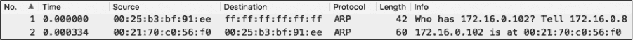

*图 10-17：网络上另一个设备的 ARP 请求和回复*

在数据包 2 中，用户的计算机得知 IP 地址 172.16.0.102 对应的 MAC 地址是 00:21:70:c0:56:f0。基于之前的情形，我们可能会假设这是网关路由器的地址，并且该地址被用来转发数据包到外部 DNS 服务器。然而，如图 10-18 所示，接下来的数据包并不是 DNS 请求，而是从 172.16.0.8 到 172.16.0.102 的 TCP 数据包。它设置了 SYN 标志➌，表明这是两个主机之间建立新 TCP 连接的握手中的第一个数据包。

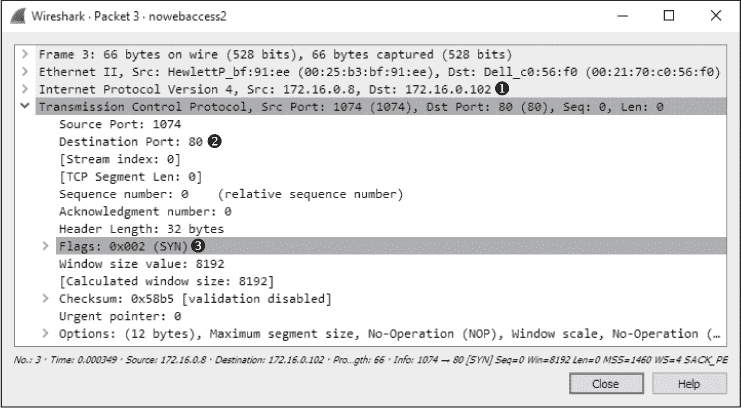

*图 10-18：从一个内部主机发送到另一个主机的 TCP SYN 数据包*

值得注意的是，TCP 连接尝试是向 172.16.0.102 ➊的端口 80 ➋发起的，该端口通常与 HTTP 流量相关。

如图 10-19 所示，当主机 172.16.0.102 发送一个 TCP 数据包（数据包 4）并设置了 RST 和 ACK 标志➊时，连接尝试被突然中断。

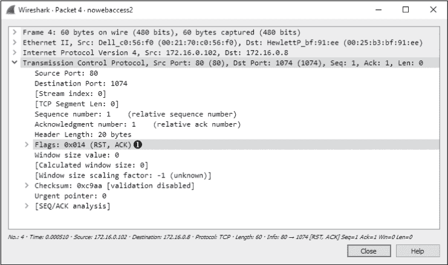

*图 10-19：响应 TCP SYN 的 TCP RST 数据包*

回想一下第八章，当 RST 标志位设置时，数据包用于终止 TCP 连接。在这里，IP 地址为 172.16.0.8 的主机尝试与 IP 地址为 172.16.0.102 的主机在 80 端口建立 TCP 连接。不幸的是，因为该主机没有配置监听 80 端口请求的服务，所以发送了 TCP RST 数据包来终止连接。此过程重复了三次，最终通信结束，正如在图 10-20 中所示。此时，用户在浏览器中收到一条消息，表示页面无法显示。

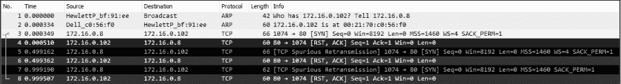

*图 10-20：TCP SYN 和 RST 数据包共出现了三次。*

在检查了另一台正常工作的网络设备的配置后，我们对数据包 1 和 2 中的 ARP 请求和回复感到担忧，因为 ARP 请求不是针对网关路由器的实际 MAC 地址，而是针对某个未知设备。紧接着 ARP 请求和回复，我们预计会看到一个 DNS 查询发送到我们配置的 DNS 服务器，以便查找与*[`www.google.com/`](https://www.google.com/)*相关联的 IP 地址，但实际上没有。可能阻止 DNS 查询发生的两种情况是：

•     发起连接的设备已经在其 DNS 缓存中拥有 DNS 名称到 IP 地址的映射（如本章第一个场景所示）。

•     连接到 DNS 名称的设备已经在其*hosts*文件中指定了 DNS 名称到 IP 地址的映射。

进一步检查客户端计算机后，我们发现该计算机的*hosts*文件中有一条与内部 IP 地址 172.16.0.102 关联的*[`www.google.com/`](https://www.google.com/)*条目。这个错误的条目是导致用户问题的根源。

计算机通常会将其*hosts*文件作为 DNS 名称到 IP 地址映射的权威来源，并且在查询外部源之前会检查该文件。在这个场景中，用户的计算机检查了其*hosts*文件，发现了与*[`www.google.com/`](https://www.google.com/)*相关的条目，并决定*[`www.google.com/`](https://www.google.com/)*实际上位于它自己的本地网络段。接下来，它发送了一个 ARP 请求到该主机，收到了响应，并尝试与 172.16.0.102 的 80 端口建立 TCP 连接。然而，由于远程系统未配置为 Web 服务器，它未能接受连接尝试。

一旦移除了*hosts*文件中的条目，用户的计算机开始正确地进行通信，并且能够访问*[`www.google.com/`](https://www.google.com/)*。

**注意**

*要检查 Windows 系统上的*hosts*文件，请打开*C:\Windows\System32\drivers\etc\hosts*。在 Linux 上，查看*/etc/hosts*。

这种非常常见的情况是恶意软件多年来一直在使用的，用来将用户重定向到托管恶意代码的网站。试想，如果攻击者修改了你的*hosts*文件，让你每次进行网上银行操作时，都被重定向到一个旨在窃取账户凭证的假网站！

##### 经验教训

当你继续分析流量时，你会了解到各种协议如何工作以及如何破坏它们。在这个场景中，DNS 查询没有发送，是因为客户端配置错误，而不是由于外部的限制或配置错误。

通过在数据包级别检查这个问题，我们能够迅速发现一个未知的 IP 地址，并确定通信过程中的关键组件 DNS 丢失。通过这些信息，我们能够将问题源归结为客户端。

#### *上游问题*

*nowebaccess3.pcapng*

与前两个场景类似，在这个场景中，用户抱怨工作站无法访问互联网。该用户已将问题缩小到一个网站，* [`www.google.com/`](https://www.google.com/)*。进一步调查后，我们发现这个问题影响了组织中的所有人——没有人能够访问 Google 域名。

网络配置与之前的两个场景相同，只有一些简单的交换机和一台路由器将网络连接到互联网。

##### 接入线路

为了解决这个问题，我们首先访问* [`www.google.com/`](https://www.google.com/)* 来生成流量。由于这个问题是全网络范围的，理想情况下网络中的任何设备都应该能够通过大多数捕获方法重现这个问题。通过接入捕获得到的文件是 *nowebaccess3.pcapng*。

##### 分析

这个数据包捕获从 DNS 流量开始，而不是我们习惯看到的 ARP 流量。因为捕获中的第一个数据包是发送到外部地址的，且数据包 2 包含来自该地址的回复，我们可以假设 ARP 过程已经完成，网关路由器的 MAC 到 IP 地址映射已经存在于主机的 ARP 缓存中，地址为 172.16.0.8。

如图 10-21 所示，捕获中的第一个数据包是从主机 172.16.0.8 发送到地址 4.2.2.1 ➊，这是一个 DNS 数据包 ➋。检查数据包的内容，我们看到这是一个查询* [www.google.com](http://www.google.com)*的 A 记录 ➌，用于将 DNS 名称映射到 IP 地址。

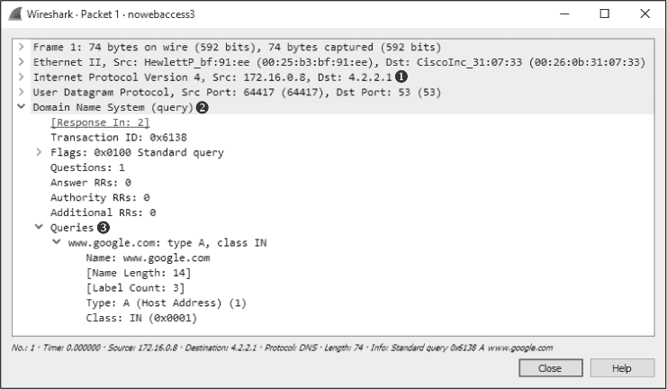

*图 10-21：* [www.google.com](http://www.google.com) *的 DNS 查询 A 记录*

来自 4.2.2.1 的查询响应是捕获文件中的第二个数据包，如图 10-22 所示。在这里，我们看到响应这个请求的名称服务器为查询提供了多个答案 ➊。此时，一切看起来都正常，通信也按预期进行。

*图 10-22：DNS 回复包含多个 A 记录*

现在，用户的计算机已经确定了 Web 服务器的 IP 地址，它可以尝试与服务器进行通信。如图 10-23 所示，这一过程在数据包 3 中开始，TCP 数据包从 172.16.0.8 发送到 74.125.95.105 ➊。这个目标地址来自 DNS 查询响应中看到的第一个 A 记录，即数据包 2 中的内容。该 TCP 数据包的 SYN 标志被设置 ➋，并且它尝试与远程服务器在端口 80 上进行通信 ➌。

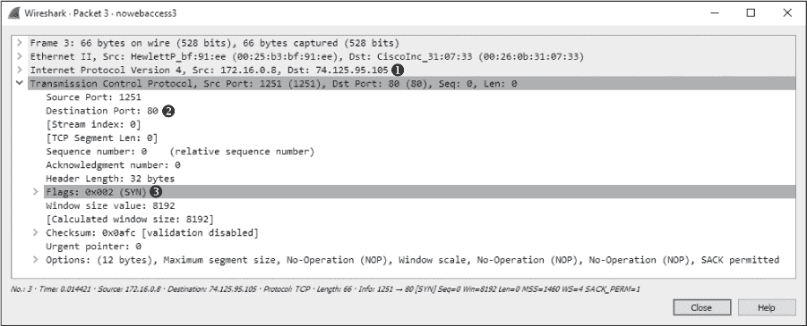

*图 10-23：SYN 数据包正在尝试在端口 80 上发起连接。*

因为这是一个 TCP 握手过程，我们知道应该会收到一个 TCP SYN/ACK 数据包作为响应，但实际上，在短暂的时间后，源主机再次向目标发送了另一个 SYN 数据包。大约一秒钟后，这一过程再次发生，如图 10-24 所示，随后通信停止，浏览器显示无法找到该网站。

*图 10-24：尝试三次发送 TCP SYN 数据包，但没有收到响应。*

在我们排查这个问题时，请考虑到，我们知道网络内的工作站能够连接到外部世界，因为向外部 DNS 服务器（4.2.2.1）的 DNS 查询成功。DNS 服务器响应了一个看起来有效的地址，我们的主机尝试连接这些地址之一。此外，我们试图连接的本地工作站似乎也是正常的。

问题在于远程服务器根本没有响应我们的连接请求；没有发送 TCP RST 数据包。这可能由多种原因引起：配置错误的 Web 服务器、Web 服务器上的协议栈损坏，或者远程网络中的数据包过滤设备（如防火墙）。假设没有本地的数据包过滤设备，所有其他潜在的解决方案都在远程网络上，超出了我们的控制范围。在这种情况下，Web 服务器无法正常工作，访问尝试均未成功。问题解决后，Google 端修复了问题，通信才得以继续。

##### 经验教训

在这种情况下，问题并不是我们能解决的。我们的分析表明，问题不在于我们网络中的主机、我们的路由器，或者提供名称解析服务的外部 DNS 服务器。问题在我们的网络基础设施之外。

有时候，发现问题并非我们自己的问题，不仅能减轻压力，还能在管理层找上门时挽回面子。我曾与许多 ISP、供应商和软件公司发生过争执，他们声称问题不在他们，但正如你刚刚看到的，数据包是不会撒谎的。

### 不稳定的打印机

在下一个场景中，一位 IT 帮助台管理员正在解决打印问题。销售部门的用户报告称，高容量打印机出现故障。当用户将大打印任务发送到打印机时，打印机会打印几页，然后在任务完成前停止打印。虽然已经尝试了多次驱动程序配置更改，但都没有成功。帮助台工作人员希望你能确保这不是网络问题。

#### *连接到数据线*

*inconsistent_printer.pcapng*

这个问题的共同点是打印机，因此我们首先将嗅探器放置在尽可能靠近打印机的位置。虽然我们不能在打印机上安装 Wireshark，但该网络使用的是先进的 3 层交换机，因此我们可以使用端口镜像。我们将打印机使用的端口镜像到一个空闲端口，并将安装了 Wireshark 的笔记本电脑连接到该端口。一旦设置完成，我们将让用户向打印机发送大打印任务，以便我们监控输出。结果生成的捕获文件是 *inconsistent_printer.pcapng*。

#### *分析*

网络工作站（172.16.0.8）与打印机（172.16.0.253）之间的 TCP 握手开始时发起连接，并出现在捕获文件的开头。握手之后，一个 1,460 字节的 TCP 数据包 ➊ 被发送到打印机，出现在数据包 4 中（图 10-25）。数据的数量可以在包列表窗格的最右侧的“信息”列中或在包详细信息窗格的 TCP 头部信息的底部看到。

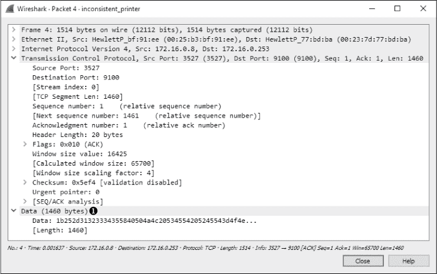

*图 10-25：通过 TCP 向打印机传输的数据*

在数据包 4 之后，又发送了一个数据包，包含 1,460 字节的数据 ➊，如图 10-26 所示。打印机在数据包 6 ➋ 中确认接收了这些数据。

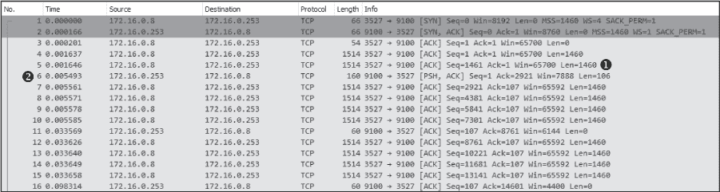

*图 10-26：正常的数据传输和 TCP 确认*

数据流会一直持续，直到捕获到最后几包数据。数据包 121 是一个 TCP 重传数据包，这是一个问题的迹象，如图 10-27 所示。

当一个设备向远程设备发送 TCP 数据包，而远程设备没有确认接收时，会发送一个 TCP 重传数据包。一旦达到重传阈值，发送设备假设远程设备没有接收到数据，并重新传输该数据包。这个过程会重复几次，直到通信最终停止。

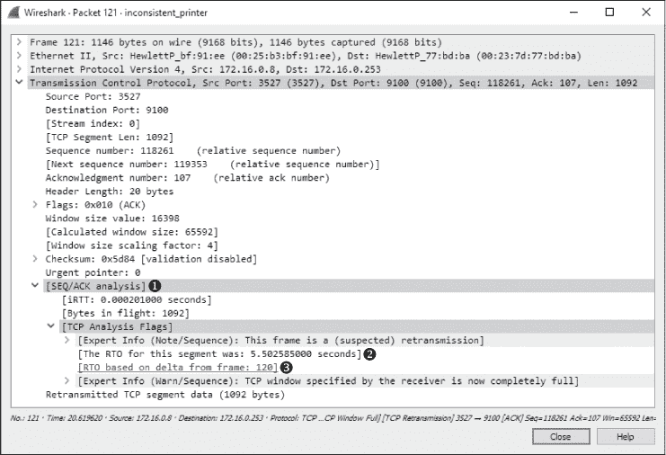

*图 10-27：这些 TCP 重传数据包是潜在问题的迹象。*

在这个场景中，重传是从客户端工作站发送到打印机的，因为打印机未能确认已传输的数据。如图 10-27 所示，如果你展开 TCP 头部的 SEQ/ACK 分析部分➊以及其下的附加信息，你可以查看为何这是一次重传的详细信息。根据 Wireshark 处理的细节，第 121 包是第 120 包的重传➌。此外，重传数据包的重传超时（RTO）大约是 5.5 秒➋。

在分析数据包之间的延迟时，你可以根据自己的情况调整时间显示格式。在本例中，由于我们希望查看重传发生在前一个数据包发送后多长时间，可以通过选择**查看 ▶ 时间显示格式**并选择**自上一捕获数据包以来的秒数**来更改此选项。然后，如图 10-28 所示，你可以清楚地看到，第 121 包的重传发生在原始数据包（第 120 包）发送后 5.5 秒➊。

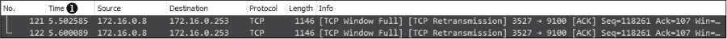

*图 10-28：查看数据包之间的时间对于故障排除非常有用。*

下一个数据包是第 120 包的另一次重传。这个数据包的 RTO 是 11.10 秒，其中包括前一个数据包的 5.5 秒 RTO。从数据包列表窗格的时间列中，我们可以看到这次重传是在前一次重传后 5.6 秒发送的。这似乎是捕获文件中的最后一个数据包，并且巧合的是，打印机大约在此时停止打印。

在这个场景中，我们的优势是只涉及到两个设备，且都在我们自己的网络内，因此我们只需要确定是客户端工作站还是打印机出了问题。我们可以看到，数据流在一段时间内是正常的，然后在某个时刻，打印机就停止了响应工作站。工作站尽力将数据发送到目的地，正如重传所证明的那样，但结果没有任何响应。这个问题是可以重现的，并且无论哪台计算机发送打印任务都会发生，所以我们推测问题出在打印机上。

经过进一步分析，我们发现打印机的 RAM 出现故障。当大量打印任务发送到打印机时，它只能打印一定数量的页面，可能直到访问到内存的某些区域为止。此时，内存问题导致打印机无法接收任何新数据，并停止与发送打印任务的主机通信。

#### *经验教训*

尽管这次打印机问题并非由网络故障引起，但我们仍然能够使用 Wireshark 定位问题。与之前的场景不同，这次问题完全集中在 TCP 流量上。由于 TCP 关注的是可靠的数据传输，因此当两个设备停止通信时，它通常会留下有用的信息。

在这种情况下，当通信突然中断时，我们仅凭 TCP 的内建重传功能就能准确定位问题所在。在接下来的场景中，我们将经常依赖此类功能来排查更复杂的问题。

### 分支办公室无法连接

*stranded_clientside.pcapng stranded_branchdns.pcapng*

在这种情况下，我们有一家公司，拥有一个中央总部办公室和一个新部署的远程分支办公室。公司的 IT 基础设施大多集中在总部办公室，使用基于 Windows 服务器的域。该基础设施由一个域控制器、一个 DNS 服务器和一个应用服务器组成，后者用于托管公司员工每天使用的基于 Web 的软件。分支办公室通过路由器连接，建立广域网（WAN）连接。分支办公室内部有用户工作站和一个从属 DNS 服务器，应该从总部的上游 DNS 服务器接收其资源记录信息。图 10-29 展示了每个办公室的地图以及办公室之间的连接方式。

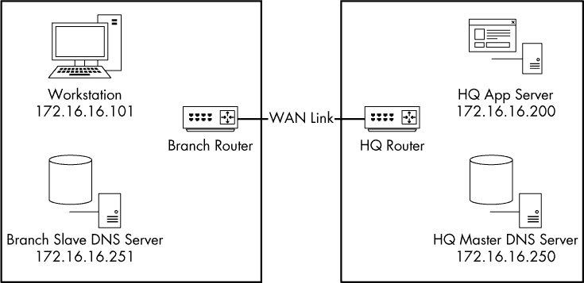

*图 10-29：孤立分支办公室问题相关组件*

部署团队正在向分支办公室部署新基础设施时发现，没有人能够从分支办公室网络访问内网 Web 应用服务器。该服务器位于总部，通过 WAN 链接进行访问。这个连接问题影响了分支办公室的所有用户。所有用户都能访问互联网以及分支办公室内的其他资源。

#### *接入网络*

因为问题出在总部和分支办公室之间的通信，我们可以从几个地方收集数据，以开始追踪问题。问题可能出在分支办公室内部的客户端，因此我们将从镜像其中一台计算机的端口开始，检查它在网络中看到的内容。一旦收集到这些信息，我们可以利用它指向其他收集点，以帮助解决问题。从其中一台客户端获取的初始捕获文件是*stranded_clientside.pcapng*。

#### *分析*

如图 10-30 所示，我们的第一个捕获文件开始于工作站地址 172.16.16.101 的用户尝试访问总部应用服务器 172.16.16.200 上托管的应用程序时。此捕获文件仅包含两个数据包。似乎第一个数据包发送了一个 DNS 请求到 172.16.16.251 ➊，请求`appserver` ➋的 A 记录 ➌。这是总部中央办公室中 172.16.16.200 服务器的 DNS 名称。

如图 10-31 所示，响应此数据包的是服务器故障 ➊，这表明某些因素正在阻止 DNS 查询成功解析。请注意，此数据包没有回答查询 ➋，因为它是一个错误（服务器故障）。

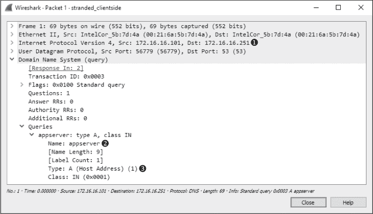

*图 10-30：通信开始于 `appserver` A 记录的 DNS 查询。*

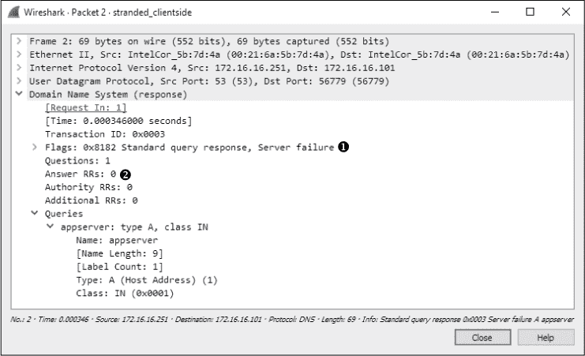

*图 10-31：查询响应表明上游存在问题。*

我们现在知道，通信问题与某些 DNS 问题有关。由于分支办公室的 DNS 查询是由位于 172.16.16.251 的本地 DNS 服务器解析的，因此这是我们下一个要检查的地方。

为了捕获来自分支 DNS 服务器的适当流量，我们将保持嗅探器不变，只需更改端口镜像分配，使得现在镜像到嗅探器的流量来自 DNS 服务器，而不是工作站的流量。结果就是文件 *stranded_branchdns.pcapng*。

如图 10-32 所示，这次捕获从我们之前看到的查询和响应开始，并且有一个附加的数据包。这个附加的数据包看起来有点奇怪，因为它试图与总部的主 DNS 服务器（172.16.16.250） ➊ 在标准 DNS 服务器端口 53 ➌ 进行通信，但它不是我们习惯看到的 UDP ➋。

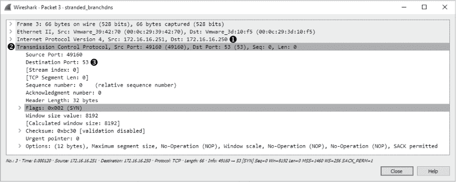

*图 10-32：这个 SYN 数据包使用了 53 端口，但不是 UDP。*

要弄清楚这个数据包的目的，回想一下我们在第九章中讨论的 DNS 内容。DNS 通常使用 UDP，但当查询的响应超过一定大小时，它会使用 TCP。在这种情况下，我们会看到一些初始的 UDP 流量，进而触发 TCP 流量。在 DNS 区域传输期间，当资源记录在 DNS 服务器之间传输时，TCP 也会被用于 DNS，这很可能就是这里的情况。

分支办公室的 DNS 服务器是总部 DNS 服务器的从服务器，这意味着它依赖于总部 DNS 服务器来接收资源记录。分支办公室用户尝试访问的应用服务器位于总部内部，这意味着总部 DNS 服务器对该服务器具有权威性。为了让分支办公室的服务器解析应用服务器的 DNS 请求，该服务器的 DNS 资源记录必须从总部 DNS 服务器传输到分支办公室 DNS 服务器。这很可能就是这个捕获文件中 SYN 数据包的来源。

对这个 SYN 数据包没有响应告诉我们，DNS 问题是由于分支和总部 DNS 服务器之间的区域传输失败导致的。现在我们可以进一步探究区域传输失败的原因。可能的原因可以缩小到办公室之间的路由器或总部 DNS 服务器本身。为了确定是哪一方出现问题，我们可以嗅探总部 DNS 服务器的流量，看看 SYN 数据包是否到达了服务器。

我没有包括中央办公室 DNS 服务器流量的捕获文件，因为没有此类流量。SYN 数据包从未到达服务器。在派遣技术人员检查连接两地办公室路由器的配置时，发现中央办公室路由器的入站 53 端口流量配置仅允许 UDP 流量，阻止了入站的 TCP 流量。这个简单的配置错误导致了服务器之间的区域传输失败，从而阻止了分支办公室的客户端解析中央办公室设备的查询。

#### *经验教训*

通过观看犯罪剧，你可以学到很多关于调查网络通信问题的技巧。当犯罪发生时，侦探们通常会从最受影响的人开始采访。由此得到的线索会被追踪，直到最终找出罪犯。

在这个场景中，我们首先检查了目标（工作站），并通过发现 DNS 通信问题获得了线索。我们的线索引导我们来到了分支 DNS 服务器，然后是中央 DNS 服务器，最后是路由器，最终找到了问题的根源。

在进行分析时，试着将数据包视为线索。这些线索并不总是能直接告诉你谁是罪犯，但它们通常最终会将你引向罪犯。

### 软件数据损坏

*tickedoffdeveloper.pcapng*

IT 领域最常见的争论之一发生在开发人员和网络管理员之间。开发人员总是将程序错误归咎于网络工程不良和设备故障。而网络管理员则往往将网络错误和通信延迟归咎于坏代码。

在这个场景中，一名程序员开发了一个用于追踪多家商店销售情况并将数据回传至中央数据库的应用程序。为了节省在正常营业时间的带宽，应用程序不会实时更新。数据在一天中不断积累，然后在晚上作为逗号分隔值（CSV）文件传输，并插入到中央数据库中。

这个新开发的应用程序没有正常工作。来自商店的文件虽然被服务器接收到，但插入数据库的数据并不正确。部分内容缺失，数据放错了位置，有些数据甚至完全丢失。令网络管理员十分沮丧的是，程序员将问题归咎于网络。他们坚信文件在从商店传输到中央数据存储库的过程中发生了损坏。我们的目标是确定他们的判断是否正确。

#### *深入探测网络*

为了收集所需的数据，我们可以在其中一家商店或中央办公室捕获数据包。因为这个问题影响到所有商店，如果问题是网络相关的，那么它应该在中央办公室发生——这是所有商店的共同点（除了软件本身）。

网络交换机支持端口镜像，因此我们将镜像服务器所在端口，并嗅探其流量。流量捕获将被限制为商店将其 CSV 文件上传到集合服务器的单一实例。该结果即为捕获文件* tickenoffdeveloper.pcapng*。

#### *分析*

我们对程序员开发的应用了解不多，除了网络上的基本信息流动。捕获文件似乎是从一些 FTP 流量开始的，因此我们将进行调查，看它是否真的是传输此文件的机制。

首先查看包列表（图 10-33），我们可以看到 172.16.16.128 ➊发起了与 172.16.16.121 ➋的 TCP 握手通信。由于 172.16.16.128 发起了通信，我们可以假设它是客户端，而 172.16.16.121 是编译和处理数据的服务器。完成握手后，我们开始看到来自客户端的 FTP 请求和来自服务器的响应 ➌。

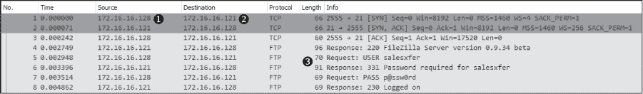

*图 10-33：初始通信有助于识别客户端和服务器。*

我们知道这里应该发生一些数据传输，因此我们可以利用 FTP 的知识来定位数据传输开始的包。FTP 连接和数据传输是由客户端发起的，所以从 172.16.16.128 我们应该能看到 FTP 的`STOR`命令，这是用来上传数据到 FTP 服务器的。找到这个命令的最简单方法是构建一个过滤器。

由于该捕获文件中充满了 FTP 请求命令，我们不需要在表达式构建器中筛选数百个协议和选项，而是可以直接从包列表窗格中构建所需的过滤器。为此，我们首先需要选择一个包含 FTP 请求命令的包。我们选择第 5 个包，因为它靠近列表顶部。然后展开包详细信息窗格中的 FTP 部分，并展开 USER 部分。右键点击**请求命令：USER**字段并选择**准备过滤器**。最后，选择**选定**。

这将为所有包含`FTP USER`请求命令的包准备一个过滤器，并将其放入过滤器对话框中。接下来，如图 10-34 所示，编辑过滤器，将`USER`替换为`STOR` ➊。

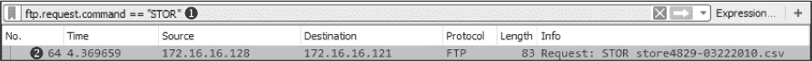

*图 10-34：此过滤器有助于识别数据传输的开始位置。*

我们可以通过提供客户端的 IP 地址并将其指定为连接的来源，进一步缩小过滤器范围，通过在过滤器中添加`&& ip.src == 172.16.16.128`，但由于该捕获文件已经限制为单一客户端，因此在这里并不需要。

现在按下 ENTER 应用这个过滤器，你会看到在捕获文件中只有一个`STOR`命令实例，出现在第 64 个包 ➋。

现在我们知道数据传输的起始位置，点击该包进行选择，然后通过点击包列表窗格上方的**X**按钮清除筛选器。此时，您的屏幕应该显示所有数据包，并且包 64 已被选中。

检查从包 64 开始的捕获文件，我们看到该包指定了文件*store4829-03222010.csv*的传输➊，如图 10-35 所示。

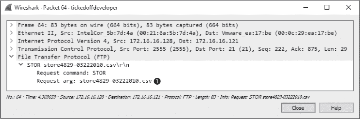

*图 10-35：CSV 文件正在通过 FTP 传输。*

紧随`STOR`命令的包使用了不同的端口，但被识别为 FTP-DATA 传输的一部分。我们已经验证了数据正在传输，但我们尚未确定程序员是否正确。为了做到这一点，我们需要展示文件内容在穿越网络后是否完整，因此我们将继续从捕获的包中提取传输的文件。

当文件以未加密的格式通过网络传输时，它会被分解成多个片段，并在目标处重新组装。在此场景中，我们捕获了到达目标的包，但在它们被重新组装之前。数据是完整的；我们只需要通过提取数据流来重新组装它。为了执行重新组装，选择 FTP-DATA 流中的任何包（例如包 66），然后点击**跟踪 TCP 流**。结果将如图 10-36 所示。看起来像一个包含销售订单数据的正常 CSV 格式文本文件。

数据出现是因为它通过 FTP 以明文形式传输，但仅凭流数据我们无法确定文件是否完整。为了重新组装数据并以原始格式提取它，请点击**另存为**按钮，并指定文件名，如包 64 中所示。然后点击**保存**。

此保存操作的结果应为一个 CSV 文件，它是从商店系统原始传输文件的精确字节级副本。可以通过比较原始文件的 MD5 哈希值与提取文件的 MD5 哈希值来验证该文件。MD5 哈希值应该是相同的，如图 10-37 所示。

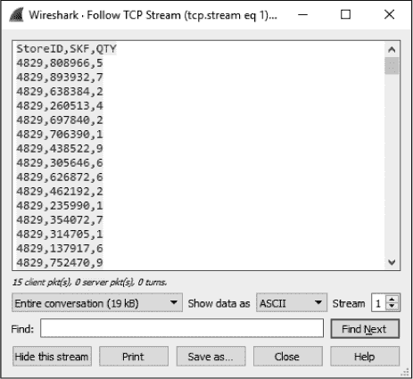

*图 10-36：TCP 流显示的是似乎正在传输的数据。*

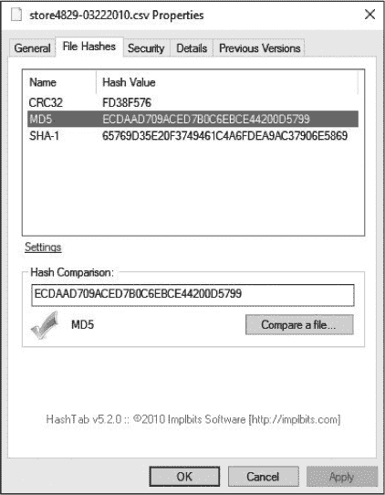

*图 10-37：原始文件和提取文件的 MD5 哈希值是相等的。*

一旦文件被比较，我们可以断言，网络并不是导致应用程序中数据库损坏的原因。从商店到集线器服务器传输的文件在到达服务器时是完整的，因此任何损坏都必须发生在文件由服务器端应用程序处理时。

#### *经验教训*

数据包级分析的一个优点是，你不需要处理应用程序的杂乱。编写不良的应用程序数量远远超过了优秀的应用程序，但在数据包级别，这些都不重要。在这个案例中，程序员担心他们的应用程序所依赖的所有神秘组件，但归根结底，他们复杂的数据传输——那些需要数百行代码的内容——仍然不过是 FTP、TCP 和 IP。利用我们对这些基本协议的了解，我们能够确保通信过程正常流畅，甚至提取文件以证明网络的可靠性。必须记住，不论问题多么复杂，最终归结起来还是数据包的问题。

### 最终思考

在本章中，我们讨论了几个通过数据包分析帮助我们更好地理解通信问题的场景。通过对常见协议的基本分析，我们能够及时跟踪并解决网络问题。虽然在你的网络中可能不会遇到完全相同的场景，但这里介绍的分析技术应该对你分析自己独特的问题有所帮助。
