## 第十一章：**对抗慢速网络**

作为网络管理员，您大部分时间都会花在修复运行速度慢的计算机和服务上。但仅仅因为有人说网络运行缓慢，并不意味着网络就是问题的根源。

在开始解决慢速网络问题之前，您首先需要确定网络是否确实运行缓慢。您将在本章中学习如何做到这一点。

我们将首先讨论 TCP 的错误恢复和流控制功能。接着我们将探讨如何检测网络上的慢速来源。最后，我们将研究如何基准测试网络以及运行在其上的设备和服务。完成本章后，您将更好地准备识别、诊断和排除慢速网络问题。

**注意**

*有多种技术可以用于排查慢速网络问题。我选择主要聚焦于 TCP，因为大多数时候，它是您可以使用的唯一工具。TCP 允许您进行被动回顾性分析，而无需生成额外的流量（与 ICMP 不同）。*

### TCP 错误恢复特性

TCP 的错误恢复特性是我们定位、诊断并最终修复网络高延迟的最佳工具。在计算机网络中，*延迟*是指数据包传输和接收之间的延迟时间。

延迟可以以单程（从单一来源到目的地）或往返（从来源到目的地再返回到原始来源）来衡量。当设备之间的通信速度快，数据包从一个点传输到另一个点的时间较短时，通信被认为是*低延迟*的。相反，当数据包在源和目的地之间传输所需时间较长时，通信被认为是*高延迟*的。高延迟是所有网络管理员的头号敌人，尤其是那些珍惜自己理智（和工作）的管理员。

在第八章中，我们讨论了 TCP 如何使用序列号和确认号来确保数据包的可靠传输。在本章中，我们将再次查看序列号和确认号，了解当高延迟导致这些数字按顺序接收（或根本没有接收）时，TCP 是如何响应的。

#### *TCP 重传*

*tcp_retransmissions.pcapng*

主机重新传输数据包的能力是 TCP 最基本的错误恢复特性之一。它旨在应对数据包丢失问题。

数据包丢失的原因有很多种，包括应用程序故障、路由器负载过重或临时服务中断。在数据包层面，事情发生得非常快，而且数据包丢失通常是暂时的，因此 TCP 能够检测并恢复数据包丢失至关重要。

确定是否需要重传数据包的主要机制是 *重传计时器*。该计时器负责维护一个名为 *重传超时（RTO）* 的值。每当使用 TCP 发送数据包时，重传计时器会启动。当该数据包的 ACK 被接收到时，计时器停止。数据包传输和接收 ACK 数据包之间的时间称为 *往返时间（RTT）*。这些时间的平均值会被用来确定最终的 RTO 值。

在确定 RTO 值之前，发送操作系统依赖其默认配置的 RTT 设置，该设置用于主机间的初始通信。然后，这个值会根据接收数据包的 RTT 进行调整，以确定最终的 RTO 值。

一旦 RTO 值确定，重传计时器就会在每个传输的数据包上使用，以确定是否发生了数据包丢失。图 11-1 展示了 TCP 重传过程。

*图 11-1：TCP 重传过程的概念视图*

当一个数据包发送出去，但接收方没有返回 TCP ACK 数据包时，发送主机会假设原始数据包丢失，并重新发送该数据包。当重传被发送时，RTO 值会加倍；如果在达到该值之前没有收到 ACK 数据包，就会发生另一轮重传。如果这次重传仍然没有收到 ACK 响应，RTO 值会再次加倍。这个过程会继续进行，每次重传时 RTO 值都会加倍，直到收到 ACK 数据包或发送方达到它配置的最大重传次数为止。关于这个过程的更多细节可以参考 RFC6298。

最大的重传尝试次数取决于发送操作系统中配置的值。默认情况下，Windows 主机会进行最多五次重传尝试。大多数 Linux 主机默认最大重传尝试次数为 15 次。这个选项在两个操作系统中都可以进行配置。

作为 TCP 重传的一个示例，打开文件 *tcp_retransmissions.pcapng*，该文件包含六个数据包。第一个数据包如图 11-2 所示。

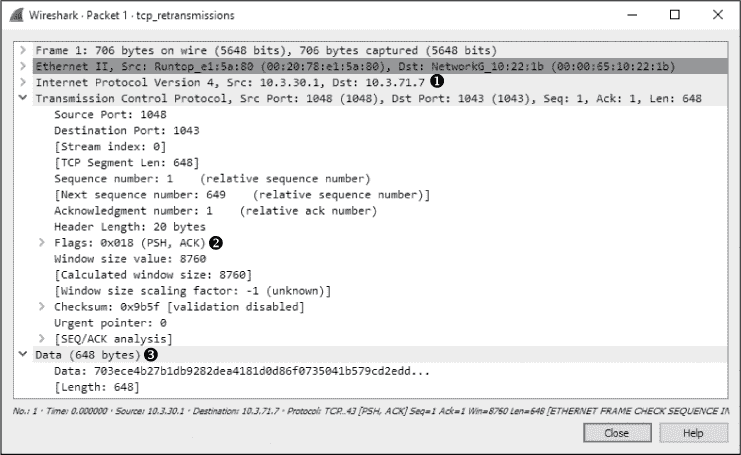

*图 11-2：包含数据的简单 TCP 数据包*

这个数据包是一个 TCP PSH/ACK 数据包 ➋，包含 648 字节的数据 ➌，从 10.3.30.1 发送到 10.3.71.7 ➊。这是一个典型的数据包。

在正常情况下，你可以期望在发送第一个数据包后不久看到一个 TCP ACK 数据包作为响应。然而，在这种情况下，下一个数据包是重传。你可以通过查看数据包列表窗格中的数据包来判断这一点。信息列会清楚地显示`[TCP Retransmission]`，并且数据包会以红色文本显示在黑色背景上。图 11-3 显示了数据包列表窗格中列出的重传示例。

*图 11-3：数据包列表窗格中的重传*

你还可以通过在数据包详细信息窗格中检查数据包，来判断它是否为重传，如图 11-4 所示。

在数据包详细信息窗格中，可以看到重传的数据包在 SEQ/ACK 分析标题下有一些附加信息 ➊。此有用信息由 Wireshark 提供，而不包含在数据包本身中。SEQ/ACK 分析告诉我们，这确实是一个重传 ➋，RTO 值为 0.206 秒 ➌，并且 RTO 是基于数据包 1 的时间差 ➍。

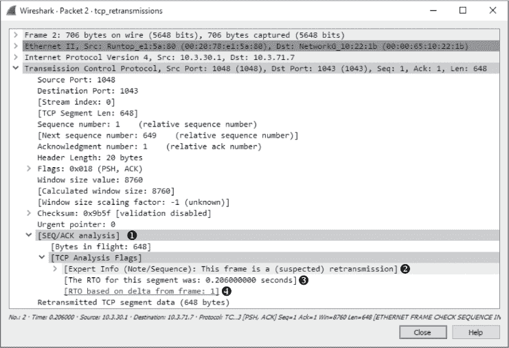

*图 11-4：单个重传数据包*

请注意，此数据包与原始数据包相同（除了 IP 标识符和校验和字段）。为验证这一点，比较此重传数据包与原始数据包的“数据包字节”窗格。

检查其余的数据包应得出类似的结果，数据包之间的唯一差异存在于 IP 标识符、校验和字段和 RTO 值中。要查看每个数据包之间的时间间隔，请查看数据包列表窗格中的时间列，如图 11-5 所示。在这里，你可以看到随着每次重传，RTO 值的指数增长。

TCP 重传功能被发送设备用于检测和恢复丢包。接下来，我们将探讨*TCP 重复确认*功能，这是数据接收方用来检测和恢复丢包的一项特性。

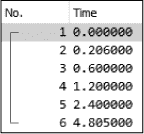

*图 11-5：时间列显示 RTO 值的增加。*

#### *TCP 重复确认与快速重传*

*tcp_dupack.pcapng*

重复 ACK 是接收方在接收到乱序的数据包时发送的 TCP 数据包。TCP 使用其头部中的序列号和确认号字段，可靠地确保数据按照发送的顺序接收并重新组装。

**注意**

*TCP 数据包的正确术语实际上是* TCP 段*，但大多数人称其为数据包。*

当建立一个新的 TCP 连接时，握手过程中交换的最重要的信息之一是初始序列号（ISN）。一旦为连接的每一端设置了 ISN，每个随后传输的包都会根据其数据负载的大小递增序列号。

考虑一个 ISN 为 5000 的主机，它向接收方发送一个 500 字节的数据包。一旦这个数据包被接收，接收方主机将以确认号 5500 响应一个 TCP 确认包，基于以下公式：

*序列号输入* + *接收的数据字节* = *确认号输出*

根据这个计算，返回给发送主机的确认号是接收方预计接收的下一个序列号。这个例子可以在图 11-6 中看到。

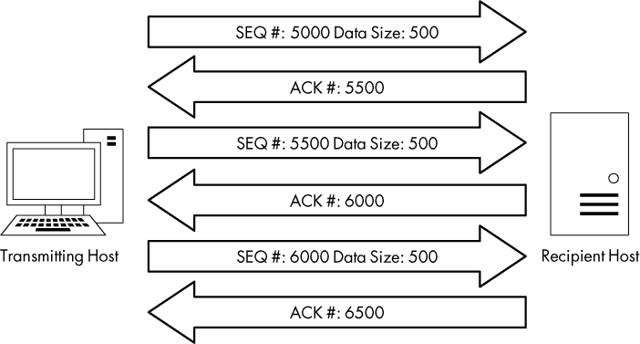

*图 11-6：TCP 序列号和确认号*

数据接收方通过序列号检测数据包丢失的能力。随着接收方跟踪接收到的序列号，它可以判断何时收到的序列号是乱序的。

当接收方收到一个意外的序列号时，它会认为数据包在传输过程中丢失了。为了正确地重新组装数据，接收方必须拥有丢失的数据包，因此它会重新发送包含丢失数据包预期序列号的确认包，以便从发送主机请求重新传输该数据包。

当发送主机收到接收方的三个重复确认包时，它会认为数据包确实在传输过程中丢失，并立即发送一个*快速重传*。一旦触发快速重传，所有其他正在传输的数据包都会被排队，直到快速重传的数据包发送完毕。这个过程在图 11-7 中有所展示。

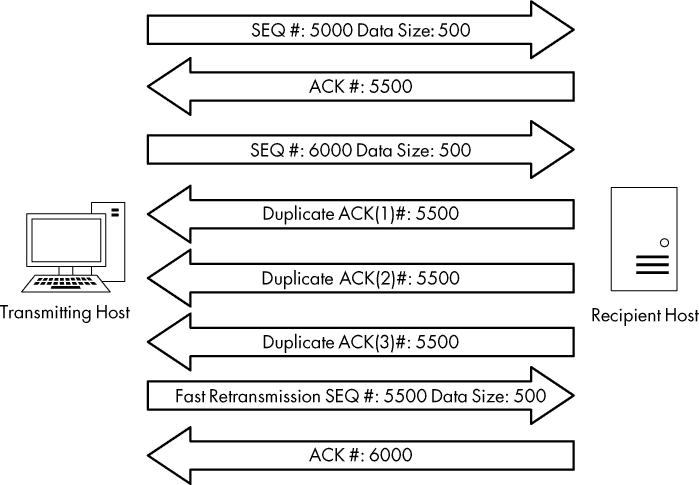

*图 11-7：接收方的重复确认包导致快速重传。*

在文件*tcp_dupack.pcapng*中，你可以找到重复确认包和快速重传的示例。此捕获中的第一个数据包显示在图 11-8 中。

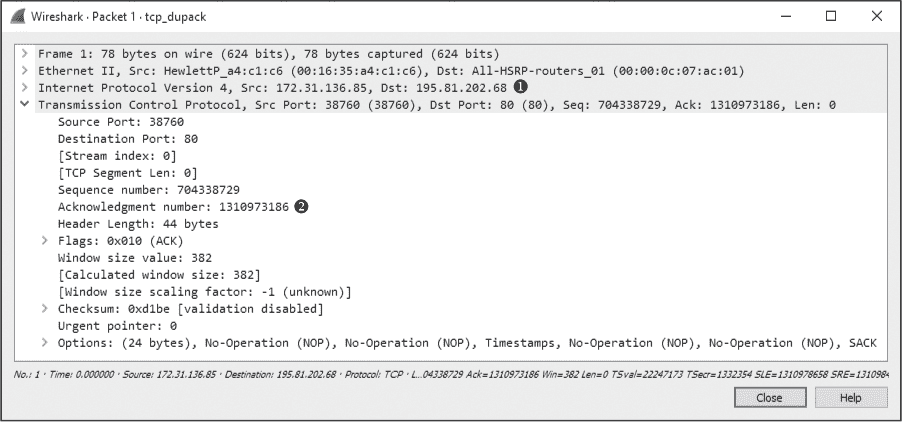

*图 11-8：显示下一个预期序列号的确认包*

这个数据包，一个从数据接收方（172.31.136.85）到发送方（195.81.202.68）发送的 TCP 确认包 ➊，包含对前一个数据包中发送的数据的确认，这些数据不包含在此捕获文件中。

**注意**

*默认情况下，Wireshark 使用相对序列号使得这些数字的分析更加容易，但接下来的几个部分中的示例和截图并未使用此功能。要关闭此功能，请选择* ***编辑 ▶ 首选项***。在首选项窗口中，选择* ***协议***，然后选择* ***TCP*** *部分。然后取消选中* ***相对序列号*** *旁边的复选框。*

这个数据包中的确认号是 1310973186 ➋。它应该与接收到的下一个数据包中的序列号相匹配，如图 11-9 所示。

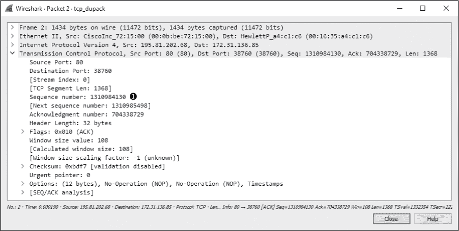

*图 11-9：这个数据包的序列号不是预期的序列号。*

不幸的是，对于我们和接收方来说，下一个数据包的序列号是 1310984130 ➊，这不是我们预期的。这一错乱的数据包表明预期的数据包在传输过程中丢失了。接收主机注意到该数据包顺序错乱，并在本次捕获的第三个数据包中发送了一个重复 ACK，如图 11-10 所示。

你可以通过以下任意一种方式来确定这是一个重复 ACK 数据包：

•     数据包详情窗格中的“信息”列。该数据包应该以红色文本显示在黑色背景上。

•     SEQ/ACK 分析标题下的数据包详情窗格（图 11-10）。如果展开该标题，你会发现该数据包被列为数据包 1 ➊ 的重复 ACK。

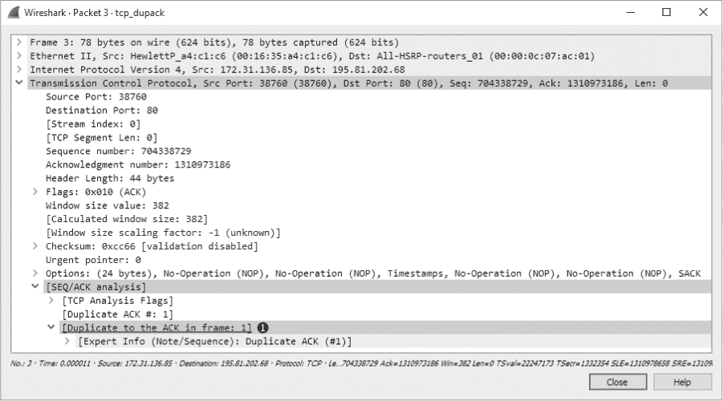

*图 11-10：第一个重复 ACK 数据包*

接下来的几个数据包继续这个过程，如图 11-11 所示。

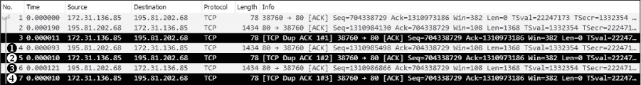

*图 11-11：由于数据包顺序错乱，产生了额外的重复 ACK。*

捕获文件中的第四个数据包是另一个从发送主机发送的带有错误序列号 ➊的数据块。因此，接收主机发送了第二个重复 ACK ➋。接收主机又接收到一个带有错误序列号的数据包 ➌，这导致它发送了第三个也是最后一个重复 ACK ➍。

一旦发送方主机接收到收件方的第三个重复 ACK，它必须停止所有数据包传输并重新发送丢失的数据包。图 11-12 展示了丢失数据包的快速重传。

通过数据包列表窗格中的信息列，你可以再次找到重传的数据包。与之前的示例一样，该数据包明确标注为红色文本显示在黑色背景上。该数据包的 SEQ/ACK 分析部分（图 11-12）告诉我们这是一个疑似的快速重传 ➊。（再次说明，标记此数据包为快速重传的信息并非数据包本身设置的值，而是 Wireshark 的一项特性。）捕获中的最后一个数据包是一个 ACK 数据包，确认已收到快速重传的数据包。

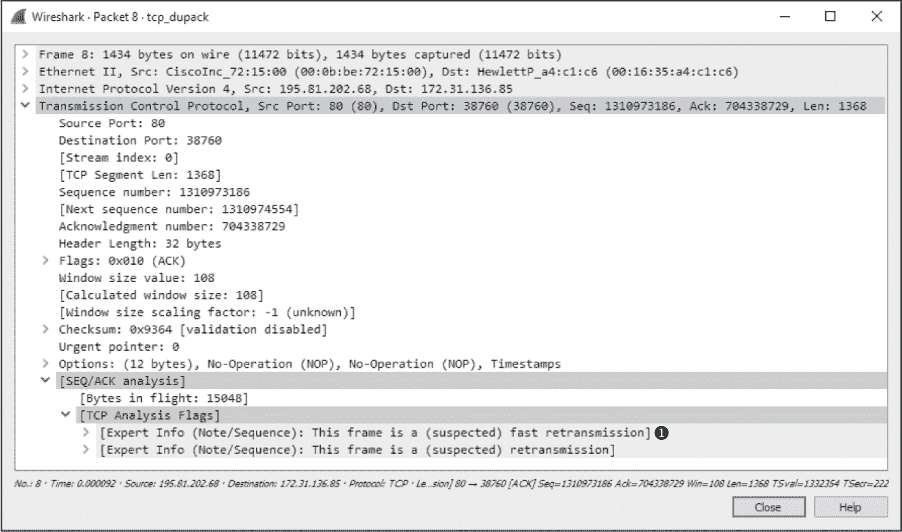

*图 11-12：三个重复 ACK 导致了该丢失数据包的快速重传。*

**注意**

*在 TCP 通信中，当出现丢包时，可能影响数据流动的一个特点是选择性确认（Selective Acknowledgment）功能。在我们刚刚检查的包捕获中，选择性确认在初始的三次握手过程中被协商为启用的功能。因此，每当发生丢包并收到重复确认时，只有丢失的数据包需要重新传输，即使在丢失的数据包之后，其他数据包已经成功接收。如果没有启用选择性确认，丢失数据包之后的每个数据包都需要重新传输。选择性确认使得数据丢失恢复更加高效。由于大多数现代 TCP/IP 协议栈实现都支持选择性确认，因此你会发现这一功能通常是已实现的。*

### TCP 流量控制

重新传输和重复确认是 TCP 的反应式功能，旨在从丢包中恢复。如果 TCP 没有包含某种形式的主动方法来防止丢包，它将是一个非常糟糕的协议。

TCP 实现了一个*滑动窗口机制*，用于检测何时可能发生丢包，并调整数据传输速率以防止丢包。滑动窗口机制利用数据接收方的*接收窗口*来控制数据流。

接收窗口是由数据接收方指定并存储在 TCP 头部（以字节为单位）的一个值，告知发送设备接收方愿意在其*TCP 缓冲区空间*中存储多少数据。这个缓冲区空间是数据暂时存储的地方，直到它可以被传递到栈上等待处理的应用层协议。因此，发送方一次只能发送接收方在窗口大小字段中指定的数量的数据。为了让发送方发送更多数据，接收方必须发送确认，表示先前的数据已经接收。同时，它还必须通过处理占用该位置的数据来清理 TCP 缓冲区空间。图 11-13 说明了接收窗口的工作原理。

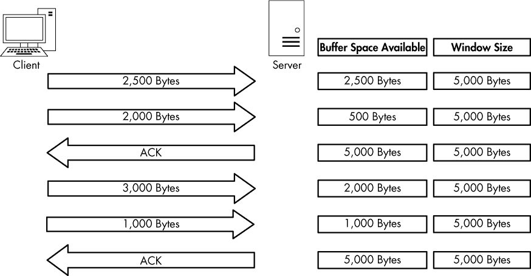

*图 11-13：接收窗口防止数据接收方被淹没。*

在图 11-13 中，客户端正在向服务器发送数据，服务器已传达接收窗口大小为 5,000 字节。客户端发送了 2,500 字节，减少了服务器的缓冲区空间至 2,500 字节，然后又发送了 2,000 字节，进一步将缓冲区减少至 500 字节。服务器对此数据发送了确认，并在处理完缓冲区中的数据后，缓冲区变为空。这个过程会重复，客户端发送 3,000 字节和另外 1,000 字节，减少服务器缓冲区至 1,000 字节。客户端再次确认这些数据并处理缓冲区中的内容。

#### *调整窗口大小*

调整窗口大小的过程相当直接，但并不总是完美的。每当 TCP 栈接收到数据时，都会生成并发送一个确认响应，但并不是所有放入接收方缓冲区的数据都会立即被处理。

当一台繁忙的服务器正在处理来自多个客户端的数据包时，它很可能在清空其缓冲区时变得缓慢，从而无法为新数据腾出空间。如果没有流量控制机制，缓冲区满了可能会导致数据包丢失和数据损坏。幸运的是，当服务器变得过于繁忙，无法按照其接收窗口所广告的速率处理数据时，它可以调整窗口大小。它通过减少在返回给发送数据的主机的 ACK 数据包中的 TCP 头部窗口大小值来做到这一点。图 11-14 展示了这一过程的示例。

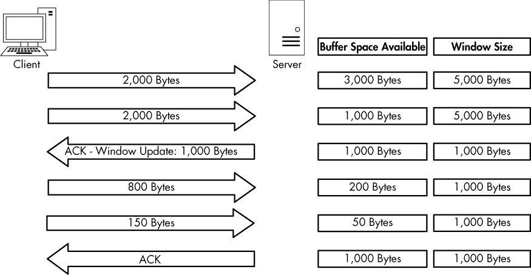

*图 11-14：当服务器变得繁忙时，窗口大小可以调整。*

在图 11-14 中，服务器开始时的广告窗口大小为 5000 字节。客户端发送了 2000 字节，然后又发送了 2000 字节，剩下的缓冲区空间只有 1000 字节。服务器意识到其缓冲区正在快速填满，并知道如果数据传输以此速度继续进行，数据包很快就会丢失。为了避免这种意外，服务器向客户端发送了一个更新后的窗口大小为 1000 字节的确认数据包。客户端通过发送较少的数据进行响应，现在服务器处理缓冲区内容的速率使得数据能够以稳定的方式流入。

窗口大小调整的过程是双向的。当服务器可以以更快的速率处理数据时，它可以发送一个带有更大窗口大小的 ACK 数据包。

#### *通过零窗口通知停止数据流*

由于内存不足、处理能力不足或其他问题，服务器可能不再处理来自客户端的数据。这种停止可能导致数据包丢失并中断通信过程，但接收窗口可以最小化负面影响。

当这种情况发生时，服务器可以发送一个包含零窗口大小的数据包。当客户端接收到此数据包时，它会停止所有数据传输，但有时会保持与服务器的连接，通过传输*保持连接数据包*。客户端可以定期发送保持连接数据包，以检查服务器接收窗口的状态。一旦服务器可以再次开始处理数据，它将以非零窗口大小响应，通信将恢复。图 11-15 展示了零窗口通知的示例。

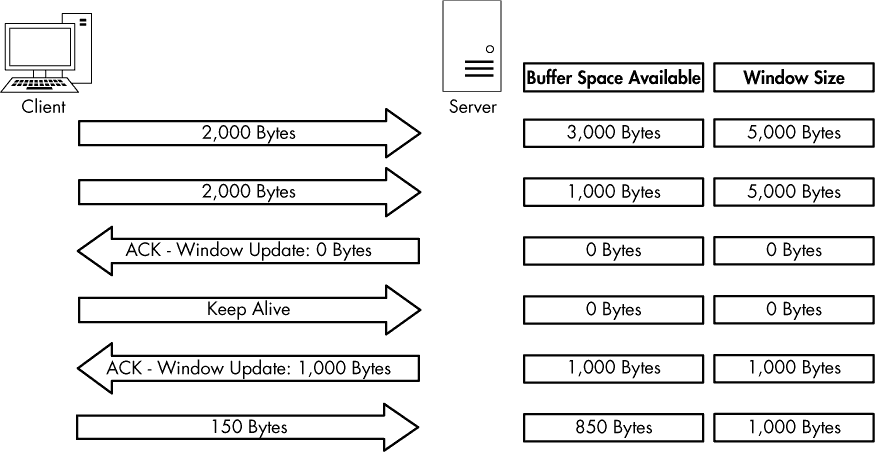

*图 11-15：当窗口大小设置为 0 字节时，数据传输停止。*

在图 11-15 中，服务器开始以 5,000 字节的窗口大小接收数据。在从客户端接收到总计 4,000 字节的数据后，服务器开始经历非常高的处理器负载，无法再处理来自客户端的任何数据。然后，服务器发送一个数据包，将窗口大小值字段设置为 0。客户端停止发送数据，并发送一个保持连接的数据包。在接收到保持连接的数据包后，服务器回应一个数据包，通知客户端它现在可以接收数据，并且其窗口大小为 1,000 字节。客户端恢复发送数据，但速度比之前慢。

#### *实际中的 TCP 滑动窗口*

*tcp_zerowindow recovery.pcapng tcp_zerowindow dead.pcapng*

在讲解完 TCP 滑动窗口的理论后，我们将开始检查捕获文件*tcp_zerowindowrecovery.pcapng*中的实际情况。

在这个文件中，我们首先看到几个从 192.168.0.20 发送到 192.168.0.30 的 TCP ACK 数据包。我们最关心的值是窗口大小值字段，可以在数据包列表窗格的“信息”列和数据包详细信息窗格中的 TCP 头部看到。你可以立即看到，这个字段的值在前三个数据包中逐渐减小，如图 11-16 所示。

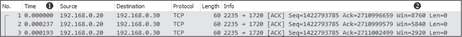

*图 11-16：这些数据包的窗口大小正在减小。*

窗口大小值从第一个数据包中的 8,760 字节下降到第二个数据包的 5,840 字节，再到第三个数据包的 2,920 字节 ➋。窗口大小值的下降是主机延迟增加的经典指示器。请注意，在“时间”列中，这一过程发生得非常迅速 ➊。当窗口大小如此快速下降时，窗口大小通常会降到零，这正是第四个数据包中的情况，如图 11-17 所示。

*图 11-17：这个零窗口数据包表示主机无法再接收任何数据。*

第四个数据包也从 192.168.0.20 发送到 192.168.0.30，但它的目的是告诉 192.168.0.30，它已经无法再接收任何数据。TCP 头部中看到的 0 值 ➊。Wireshark 还告诉我们，这是一个零窗口数据包，显示在数据包列表窗格的“信息”列和 TCP 头部的 SEQ/ACK 分析部分 ➋。

一旦这个零窗口数据包被发送，位于 192.168.0.30 的设备将不会再发送任何数据，直到它收到来自 192.168.0.20 的窗口更新，通知它窗口大小已经增大。幸运的是，这个捕获文件中的零窗口问题只是暂时的。因此，在下一个数据包中发送了一个窗口更新，如图 11-18 所示。

在这种情况下，窗口大小增加到了一个非常健康的 64,240 字节 ➊。Wireshark 再次告知我们，这是一个在 SEQ/ACK 分析标题下的窗口更新。

一旦更新包被接收，位于 192.168.0.30 的主机可以重新开始发送数据，就像在数据包 6 和 7 中所做的那样。整个数据传输暂停的过程发生得非常迅速。如果这一过程稍微长一点，它可能会导致网络出现潜在的卡顿，导致数据传输变慢或失败。

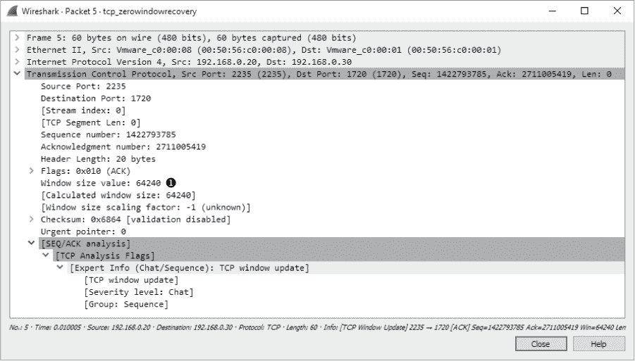

*图 11-18：TCP 窗口更新数据包让另一台主机知道它可以重新开始传输。*

再次查看滑动窗口，检查 *tcp_zerowindowdead.pcapng*。此捕获中的第一个数据包是从 195.81.202.68 发送到 172.31.136.85 的正常 HTTP 流量。该数据包后面紧跟着一个从 172.31.136.85 发送回来的零窗口数据包，如图 11-19 所示。

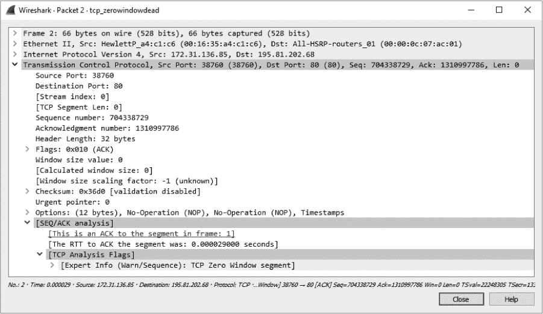

*图 11-19：零窗口数据包暂停数据传输。*

这看起来与图 11-17 中显示的零窗口数据包非常相似，但结果却大不相同。我们没有看到来自 172.31.136.85 主机的窗口更新以及通信的恢复，而是看到一个保持连接的数据包，如图 11-20 所示。

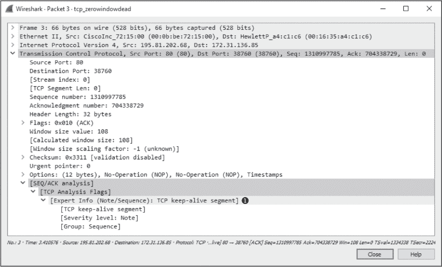

*图 11-20：该保持连接数据包确保零窗口主机仍然存活。*

该数据包在 Wireshark 中被标记为保持连接数据包，位于数据包详细信息面板的 TCP 头部 SEQ/ACK 分析部分 ➊。时间列显示该数据包是在收到上一个数据包后 3.4 秒发送的。这个过程还会继续几次，一台主机发送零窗口数据包，另一台主机发送保持连接数据包，如图 11-21 所示。

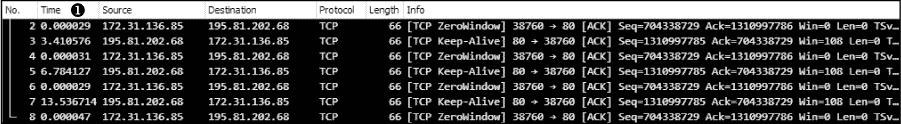

*图 11-21：主机和客户端继续分别发送零窗口和保持连接数据包。*

这些保持连接的数据包间隔为 3.4 秒、6.8 秒和 13.5 秒 ➊。这个过程可以持续很长时间，具体取决于通信设备的操作系统。通过累加时间列中的值，可以看到连接被暂停了将近 25 秒。想象一下，在进行域控制器身份验证或从互联网下载文件时，经历 25 秒的延迟——这是无法接受的！

### 从 TCP 错误控制和流量控制数据包中学习

让我们将重传、重复 ACK 和滑动窗口机制放入一些背景中。在排查延迟问题时，记住以下几点。

**重传数据包**

重传发生是因为客户端检测到服务器没有接收到它发送的数据。因此，根据你分析的通信方，可能永远看不到重传。如果你从服务器端捕获数据，并且服务器确实没有接收到客户端发送并重传的数据包，你可能一无所知，因为你看不到重传的数据包。如果你怀疑自己在服务器端遭遇了数据包丢失，考虑尝试从客户端捕获流量（如果可能的话），这样你就可以看到是否存在重传数据包。

**重复 ACK 数据包**

我倾向于将重复 ACK 视为重传的伪相反，因为它是在服务器检测到与之通信的客户端丢失数据包时发送的。在大多数情况下，你可以在捕获两端的流量时看到重复 ACK。记住，重复 ACK 是在数据包按顺序接收时触发的。例如，如果服务器只接收到三包数据中的第一包和第三包，它会发送一个重复 ACK，以促使客户端快速重传第二个数据包。由于已经接收到第一包和第三包，因此导致第二包丢失的条件很可能是暂时性的，因此重复 ACK 很可能会成功发送和接收。当然，这种情况并不总是如此，所以当你怀疑服务器端丢包并且没有看到任何重复 ACK 时，考虑从客户端侧捕获数据包。

**零窗口和保持活动数据包**

滑动窗口直接与服务器无法接收和处理数据有关。窗口大小的任何减少或零窗口状态都是服务器存在问题的直接结果，因此，如果你在网络上传输中看到这些情况，你应该将调查重点放在那里。你通常会在网络通信的两端看到窗口更新数据包。

### 定位高延迟的来源

在某些情况下，数据包丢失可能不是延迟的原因。你可能会发现，即使两个主机之间的通信很慢，这种慢速并没有显示出 TCP 重传或重复 ACK 的常见症状。因此，你需要使用其他技术来定位高延迟的来源。

查找高延迟来源的一个有效方法是检查初始连接握手以及随后的前几个数据包。例如，考虑一个简单的客户端和 Web 服务器之间的连接，客户端尝试浏览托管在 Web 服务器上的网站。我们关心的是这次通信序列中的前六个数据包，包括 TCP 握手、初始 HTTP `GET`请求、该`GET`请求的确认以及服务器发送到客户端的第一个数据包。

**注意**

*要跟随本节内容，请确保在 Wireshark 中设置了正确的时间显示格式，选择***视图*** ▶ ***时间显示格式*** ▶ ***自上次显示的数据包以来的秒数***。*

#### *正常通信*

*latency1.pcapng*

稍后我们将在本章中详细讨论网络基线。现在，只需要知道你需要一个正常通信的基线，以便与高延迟的情况进行比较。对于这些示例，我们将使用文件*latency1.pcapng*。我们已经涵盖了 TCP 握手和 HTTP 通信的细节，因此不再重复这些主题。事实上，我们根本不需要查看数据包详情面板。我们真正关心的是“时间”这一列，如图 11-22 所示。

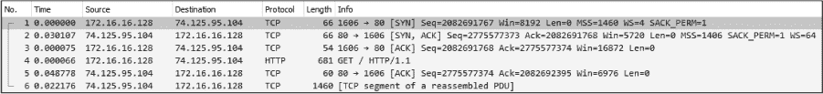

*图 11-22：这种流量发生得非常快，可以视为正常。*

这段通信序列非常快速，整个过程耗时不到 0.1 秒。

接下来我们将检查的几个捕获文件将包含相同的流量模式，只是数据包的时间有所不同。

#### *慢速通信：线缆延迟*

*latency2.pcapng*

现在让我们来看看捕获文件*latency2.pcapng*。请注意，所有数据包内容相同，唯一的不同是其中两个数据包的时间值，正如图 11-23 所示。

*图 11-23：数据包 2 和 5 显示了较高的延迟。*

当我们开始逐一分析这六个数据包时，立刻就遇到了第一个延迟的迹象。初始的 SYN 数据包由客户端（172.16.16.128）发送，用于启动 TCP 握手，而在接收到来自服务器（74.125.95.104）返回的 SYN/ACK 之前，出现了 0.87 秒的延迟。这是我们首次发现存在线缆延迟的迹象，延迟是由于客户端和服务器之间的某个设备造成的。

我们可以判断这是线缆延迟，因为传输的数据包类型的特性。当服务器接收到 SYN 数据包时，回复所需的处理非常少，因为工作负载不涉及超出传输层的任何处理。即使服务器在承受非常重的流量负载时，通常也会迅速回应 SYN 数据包并发送 SYN/ACK。这排除了服务器作为高延迟的潜在原因。

客户端也被排除了，因为此时它仅仅是在接收 SYN/ACK 数据包，并未进行任何进一步处理。排除客户端和服务器后，我们可以将慢速通信的潜在来源指向此捕获的前两个数据包。

继续观察，我们看到完成三次握手的 ACK 数据包传输非常快，客户端发送的 HTTP `GET`请求也是如此。所有生成这两个数据包的处理都发生在客户端本地，在收到 SYN/ACK 之后，因此只要客户端没有面临重负载，这两个数据包应该会很快传输。

在数据包 5 处，我们看到另一个数据包具有非常高的时间值。看起来，在我们发送初始的 HTTP `GET`请求后，服务器返回的 ACK 数据包花费了 1.15 秒才被接收。在收到 HTTP `GET`请求后，服务器发送了一个 TCP ACK，随后才开始发送数据，这又一次表明服务器几乎没有处理负担。这是网络延迟的另一个迹象。

每当你遇到网络延迟时，你几乎总是会在初始握手中的 SYN/ACK 以及通信过程中其他 ACK 数据包中看到它。尽管这些信息不能告诉你网络中高延迟的确切来源，但它能告诉你，既不是客户端也不是服务器是延迟的源头，因此你知道延迟是由中间的某个设备引起的。此时，你可以开始检查各种防火墙、路由器和代理，以定位罪魁祸首。

#### *慢速通信：客户端延迟*

*latency3.pcapng*

接下来的延迟场景我们将在*latency3.pcapng*中查看，如图 11-24 所示。

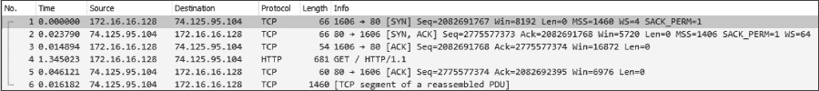

*图 11-24：此抓包中的慢速数据包是初始的 HTTP `GET`。*

这个抓包正常开始，TCP 握手非常快速地完成，没有任何延迟的迹象。直到数据包 4，它是握手完成后的 HTTP `GET`请求。这个数据包显示出从前一个接收到的数据包的 1.34 秒延迟。

要确定这个延迟的来源，我们需要检查数据包 3 和数据包 4 之间发生了什么。数据包 3 是客户端发送到服务器的 TCP 握手中的最后一个 ACK，而数据包 4 是客户端发送到服务器的`GET`请求。这里的共同点是，这两个数据包都是客户端发送的，并且与服务器无关。`GET`请求应该在 ACK 发送后迅速发生，因为所有这些动作都集中在客户端。

对最终用户来说，不幸的是，从 ACK 到`GET`的过渡并不会很快发生。`GET`数据包的创建和传输需要处理到应用层，而这一处理的延迟表明客户端未能及时执行该操作。因此，客户端最终对通信中的高延迟负责。

#### *慢速通信：服务器延迟*

*latency4.pcapng*

我们将要检查的最后一个延迟场景使用文件*latency4.pcapng*，如图 11-25 所示。这是一个服务器延迟的示例。

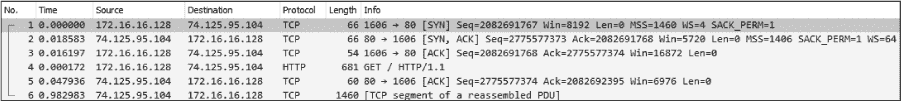

*图 11-25：直到这次捕获的最后一个数据包才表现出高延迟。*

在这次捕获中，这两台主机之间的 TCP 握手过程完成得非常顺利且快速，因此一切开始得很好。接下来的几个数据包也带来了好消息，因为初始的`GET`请求和响应 ACK 数据包也很快被传送。直到该文件的最后一个数据包，我们才看到高延迟的迹象。

第六个数据包是服务器响应客户端发送的`GET`请求的第一个 HTTP 数据包，在服务器发送完`GET`请求的 TCP ACK 后，延迟到达时间为 0.98 秒。数据包 5 和 6 之间的过渡非常类似于我们在之前场景中看到的握手 ACK 和`GET`请求之间的过渡。然而，在这种情况下，服务器是我们关注的重点。

数据包 5 是服务器在响应客户端的`GET`请求时发送的 ACK 数据包。一旦该数据包发送完，服务器应几乎立即开始发送数据。数据包中数据的访问、打包和传输是由 HTTP 协议完成的，鉴于这是一个应用层协议，服务器需要进行一些处理。此数据包的接收延迟表明服务器未能在合理的时间内处理该数据，最终将其指向为此捕获文件中的延迟源。

#### *延迟定位框架*

通过六个数据包，我们已经能够在多个场景中定位客户端与服务器之间的高网络延迟源。图 11-26 应当能帮助你排查自己的延迟问题。这些原则可以应用于几乎所有基于 TCP 的通信。

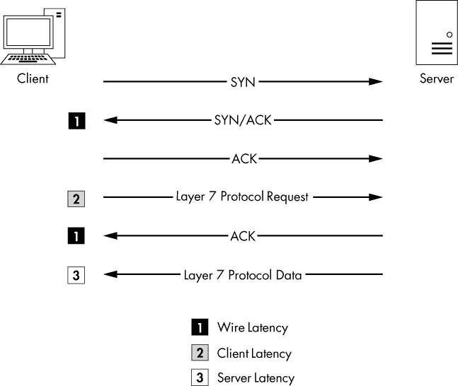

*图 11-26：此图可用于排查你的延迟问题。*

**注意**

*请注意，我们没有详细讨论 UDP 延迟。由于 UDP 设计上是快速但不可靠的，它没有任何内置的特性来检测和恢复延迟。相反，它依赖于与之配对的应用层协议（和 ICMP）来处理数据传输的可靠性。*

### 网络基准

当其他方法都失败时，你的*网络基准*可以是排查网络延迟问题时最重要的数据之一。就我们的目的而言，网络基准由来自网络各个点的流量样本组成，包含了我们认为的“大部分正常”网络流量。建立网络基准的目标是，它可以作为比较的基础，当网络或其上的设备出现异常时，进行分析。

例如，考虑一个场景，网络上的几个客户端在登录本地 Web 应用服务器时抱怨慢。如果您捕获了这段流量并将其与网络基线进行比较，您可能会发现 Web 服务器的响应是正常的，但由于 Web 应用中嵌入的外部内容，外部 DNS 请求的响应速度只有正常的两倍。

您可能已经在没有网络基线的帮助下注意到慢速外部 DNS 服务器，但当您处理的是微小的变化时，情况可能并非如此。十个 DNS 查询处理时间比正常情况多 0.1 秒，和一个 DNS 查询多 1 秒的情况一样糟糕，但前者在没有网络基线的情况下更难以发现。

因为没有两个网络是完全相同的，所以网络基线的组成部分可能会有很大差异。以下部分提供了网络基线组成部分的示例。您可能会发现这些项目中的所有内容都适用于您的网络基础设施，或者只有很少一部分适用。无论如何，您应该能够将基线的每个组成部分归类到三个基本基线类别之一：站点、主机和应用程序。

#### *站点基线*

网站基线的目的是获取网络中每个物理站点的流量概况。理想情况下，这应包括广域网的每个段。

这个基线的组成部分可能包括以下内容：

**正在使用的协议**

要查看来自所有设备的流量，请在捕获来自网络边缘（路由器/防火墙）上所有设备的流量时，使用协议层次统计窗口（**统计** ▶ **协议层次**）。之后，您可以将其与层次输出进行比较，找出是否缺少常见协议，或是否有新协议在网络中出现。您还可以使用此输出根据协议查找异常的某些类型的流量。

**广播流量**

这包括网络段上的所有广播流量。在站点内的任何位置嗅探都应该让您捕获到所有的广播流量，从而让您知道谁或什么通常在网络上发送大量的广播。然后，您可以快速判断是否存在过多（或不足）的广播。

**认证序列**

这些包括从随机客户端到所有服务的身份验证过程流量，如活动目录、Web 应用程序和特定于组织的软件。身份验证是服务常常变慢的一个领域。基线可以帮助您判断身份验证是否是导致通信缓慢的原因。

**数据传输速率**

这通常包括衡量从该站点到网络中其他站点的大量数据传输。你可以使用 Wireshark 的捕获摘要和图形功能（在第五章中展示）来确定传输速率和连接的一致性。这可能是你拥有的最重要的站点基线。每当任何进入或离开网络段的连接看起来很慢时，你可以执行与你的基线相同的数据传输并进行比较。这样你可以判断连接是否真的很慢，甚至可能帮助你找到导致慢速的区域。

#### *主机基线*

你可能不需要为网络中的每个主机设置基线。主机基线应仅在高流量或关键任务服务器上执行。基本上，如果一个缓慢的服务器会导致管理层打来愤怒的电话，那么你应该为该主机设置基线。

主机基线的组成部分包括以下内容：

**使用中的协议**

这个基线提供了一个很好的机会，可以在捕获主机流量时使用协议层次统计窗口。之后，你可以将其与基线进行比较，找出是否有正常存在的协议丢失，或新协议已出现在主机上。你还可以用它来根据协议发现异常大的某些类型的流量。

**空闲/繁忙流量**

这个基线仅包括在高峰和非高峰时间段的正常操作流量的通用捕获。了解在一天中不同时间连接数和这些连接使用的带宽量，将帮助你判断缓慢是否由于用户负载或其他问题引起。

**启动/关闭**

要获得这个基线，你需要创建一个捕获，记录主机启动和关闭序列期间生成的流量。如果计算机拒绝启动、拒绝关闭，或在任何一个序列中表现出异常的慢速，你可以利用这个基线来判断原因是否与网络相关。

**认证序列**

获取这个基线需要捕获所有服务认证过程的流量。认证是服务常常变慢的一个领域。基线使你能够判断认证是否是造成通信缓慢的原因。

**关联/依赖关系**

这个基线由一个较长时间的捕获组成，用于确定该主机依赖于哪些其他主机（以及哪些主机依赖于它）。你可以使用会话窗口（**统计** ▶ **会话**）查看这些关联和依赖关系。例如，一个 SQL 服务器主机，网络中的一个 Web 服务器依赖于它。我们并不总是意识到主机之间潜在的依赖关系，因此可以通过主机基线来识别这些依赖关系。接下来，你可以判断是否由于某个故障或高延迟的依赖关系导致主机无法正常工作。

#### *应用程序基准*

最终的网络基准类别是应用程序基准。这个基准应该在所有业务关键的网络应用程序上执行。

以下是应用程序基准的组成部分：

**使用的协议**

再次，对于这个基准，使用 Wireshark 中的协议层次统计窗口，这次是在捕获来自运行应用程序的主机的流量时进行。之后，你可以与这个列表进行比较，以查看应用程序依赖的协议是否出现故障，或根本无法工作。

**启动/关闭**

该基准包括在应用程序启动和关闭序列期间生成的流量捕获。如果应用程序在任何一个序列中拒绝启动或异常缓慢，可以使用该基准来确定问题原因。

**关联/依赖**

这个基准需要进行较长时间的捕获，可以利用会话窗口来确定该应用程序依赖于哪些其他主机和应用程序。我们并不总是意识到应用程序之间的潜在依赖关系，因此可以使用这个基准来确定这些依赖关系。然后，你可以确定应用程序是否因某个故障或高延迟的依赖而无法正常运行。

**数据传输速率**

你可以使用 Wireshark 的捕获总结和图形功能来确定应用程序服务器在正常操作期间的传输速率和连接一致性。每当应用程序报告为缓慢时，你可以使用这个基准来确定是否是由于高利用率或高用户负载导致的问题。

#### *基准的额外说明*

在创建网络基准时，还有一些其他要点需要记住：

•     在创建基准时，每个基准至少要捕获三次：一次在低流量时段（清晨），一次在高流量时段（下午），一次在无流量时段（深夜）。

•     在可能的情况下，避免直接从你正在基准化的主机上捕获数据。在高流量时段这样做可能会增加设备的负载，影响其性能，并导致丢包，使得基准无效。

•     你的基准将包含一些关于你网络的非常敏感的信息，因此要确保对其进行保护。将其存储在一个安全的地方，只有合适的人才能访问。但同时，也要确保它随时可用，以便在需要时使用。可以考虑将其存储在 USB 闪存驱动器或加密分区中。

•     保留所有与基准相关的*.pcap*和*.pcapng*文件，并创建一份常用值的备忘单，例如关联关系或平均数据传输速率。

### 最终思考

本章重点讨论了慢网络故障排除。我们介绍了一些 TCP 中更有用的可靠性检测和恢复功能，演示了如何定位网络通信中的高延迟来源，并讨论了网络基线及其一些组成部分的重要性。运用本文中讨论的技术，以及 Wireshark 的图形和分析功能，你应该能够做好充分准备，当接到抱怨网络慢的电话时进行故障排除。
