## 12

**安全的报文分析**


尽管本书的大部分内容侧重于使用报文分析进行网络故障排除，但相当一部分实际的报文分析是出于安全目的进行的。例如，入侵分析师可能会审查来自潜在入侵者的网络流量，或者取证调查员可能会尝试确定在被攻陷主机上恶意软件感染的程度。

在调查安全事件时进行报文分析总是一个具有挑战性的场景，因为它涉及到一个攻击者控制的未知设备。你无法走到攻击者的工作区提问或基准测试他们的正常流量；你只能依赖于你可以捕获到的他们的系统和你系统之间的交互。幸运的是，为了远程入侵你的系统，攻击者必须以某种形式与网络互动。当然，他们也知道这一点，所以他们不缺少用来混淆技术的手段。

在本章中，我们将从安全实践者的角度出发，检查系统在网络层面的不同方面被攻陷的情况。我们将讨论网络侦察、恶意流量重定向和常见的恶意软件技术。在某些情况下，我们将扮演入侵分析师的角色，根据入侵检测系统（IDS）发出的警报分析流量。阅读本章将为你提供关于网络安全的深刻见解，即使你目前不在一个专注于安全的角色中，这些知识也可能至关重要。

### 侦察

攻击者的第一步通常是对目标系统进行深入的研究。这个步骤通常被称为*信息收集*，通常通过各种公开可用的资源来完成，例如目标公司的官方网站或谷歌。一旦完成这项研究，攻击者通常会开始扫描他们目标的 IP 地址（或 DNS 名称），以寻找开放的端口或正在运行的服务。

扫描可以让攻击者判断目标是否存活且可达。例如，考虑一个场景，其中银行劫匪计划从城市最大的银行——位于 123 Main Street 的银行——进行盗窃。他们花了几周时间策划精密的抢劫计划，结果一到地址就发现银行已经搬到了 555 Vine Street。更糟糕的是，假设这些劫匪计划在正常营业时间进入银行，打算从金库里偷东西，结果一到银行才发现当天银行关门了。无论是抢劫银行还是攻击网络，确保目标存活且可达是第一道难关。

扫描还可以告诉攻击者目标在哪些端口上进行监听。回到我们的银行抢劫者比喻，假设抢劫者来到银行，完全不了解大楼的物理布局。他们根本不知道如何进入金库，因为他们不知道银行物理安全的薄弱环节。

在本节中，我们将讨论一些常见的扫描技术，用于识别网络上的主机、开放端口和漏洞。

**注意**

*到目前为止，本书提到的连接双方分别是* 发送方 *和* 接收方 *，或是* 客户端 *和* 服务器*。本章则将通信的每一方称为* 攻击者 *或* 目标*。

#### *SYN 扫描*

*synscan.pcapng*

针对系统进行的常见扫描类型之一是 *TCP SYN 扫描*，也称为 *隐身扫描* 或 *半开放扫描*。SYN 扫描之所以是最常见的类型，原因有几个：

•      它非常快速且可靠。

•      它在所有平台上都非常准确，无论 TCP 堆栈实现如何。

•      它比其他扫描技术更不容易被察觉。

TCP SYN 扫描依赖于三次握手过程来确定目标主机上哪些端口是开放的。攻击者向目标的多个端口发送一个 TCP SYN 数据包，仿佛是在尝试为正常通信在这些端口上建立一个通道。一旦目标收到这个数据包，可能会发生几种不同的情况，如图 12-1 所示。

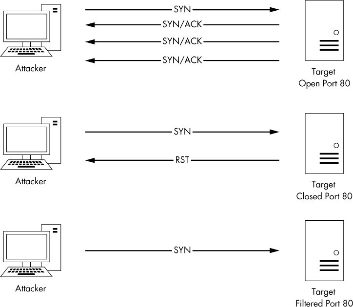

*图 12-1：TCP SYN 扫描的可能结果*

如果目标机器上的某个服务正在监听接收 SYN 数据包的端口，它将通过一个 TCP SYN/ACK 数据包回应攻击者，这是 TCP 三次握手的第二部分。此时，攻击者就知道该端口是开放的，并且有服务在监听。正常情况下，最终会发送一个 TCP ACK 数据包来完成连接的握手。然而，在这种情况下，攻击者并不希望发生这种情况，因为此时他们不会与主机进一步通信，因此攻击者不会尝试完成 TCP 握手。

如果在扫描的端口上没有服务在监听，攻击者将不会收到 SYN/ACK 数据包。根据目标操作系统的配置，攻击者可能会收到一个 RST 数据包，表示该端口已关闭。或者，攻击者可能根本没有收到任何响应。没有响应可能意味着该端口被中间设备（如防火墙或主机本身）过滤。另一方面，也有可能是响应在传输过程中丢失。因此，虽然这种结果通常表示端口已关闭，但最终仍无法得出结论。

文件 *synscan.pcapng* 提供了一个使用 Nmap 工具执行 SYN 扫描的良好示例。Nmap 是一款功能强大的网络扫描应用程序，由 Gordon “Fyodor” Lyon 开发。它几乎可以执行你能想象的任何类型的扫描。你可以从 *[`www.nmap.com/download.html`](http://www.nmap.com/download.html)* 免费下载 Nmap。

我们的示例捕获包含大约 2,000 个数据包，这告诉我们这个扫描的规模是合理的。确定此类扫描范围的最佳方法之一是查看对话窗口，如图 12-2 所示。在那里，你应该只看到一条 IPv4 对话 ➊，它是攻击者（172.16.0.8）与目标（64.13.134.52）之间的通信。你还会看到这两个主机之间有 1,994 个 TCP 对话 ➋——基本上每个涉及通信的端口配对都会生成一个新的对话。

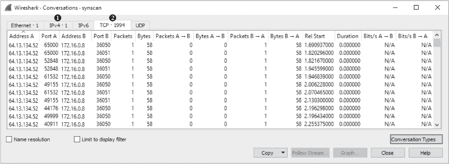

*图 12-2：对话窗口显示了各种 TCP 通信。*

扫描进行得非常快，所以滚动查看捕获文件并不是找到每个初始 SYN 数据包响应的最佳方式。在收到原始数据包的响应之前，可能会发送几个其他数据包。幸运的是，我们可以创建过滤器来帮助我们找到正确的流量。

##### 使用过滤器进行 SYN 扫描

作为过滤的示例，我们来看捕获中的第一个数据包，它是发送到目标端口 443（HTTPS）的 SYN 数据包。为了查看是否有响应此数据包的流量，我们可以创建一个过滤器，显示所有往返于端口 443 的流量。以下是如何快速完成此操作：

1.  选择捕获文件中的第一个数据包。

1.  展开数据包详细信息窗格中的 TCP 头部。

1.  右键单击**目标端口**字段，选择**准备为过滤器**，然后点击**选定**。

1.  这将为所有目标端口为 443 的数据包在过滤器对话框中设置一个过滤器。现在，因为我们还需要所有源端口为 443 的数据包，点击屏幕顶部的过滤器对话框，并删除过滤器中的 *dst* 部分。

结果过滤器将显示两个数据包，它们都是从攻击者到目标发送的 TCP SYN 数据包，如图 12-3 所示。

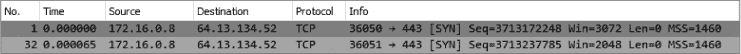

*图 12-3：使用 SYN 数据包建立连接的两次尝试*

**注意**

*在本节中，数据包使用自上一个显示的数据包以来的秒数格式进行显示。*

由于这两个数据包没有收到响应，可能是响应被目标主机或中间设备过滤，或者端口已关闭。最终，对端口 443 的扫描结果是不确定的。

我们可以尝试对另一个数据包使用相同的技术，看是否得到不同的结果。为此，清除之前的过滤器并选择列表中的数据包 9。这是发送到端口 53 的 SYN 数据包，通常与 DNS 相关。使用前述步骤中的方法，或者通过修改最后一个过滤器，创建一个过滤器，显示所有 TCP 端口 53 的流量。当你应用这个过滤器时，你应该看到五个数据包，如图 12-4 所示。


*图 12-4：表示端口开放的五个数据包*

这些数据包中的第一个是我们在捕获开始时选择的 SYN（数据包 9）。第二个是目标的响应。这是一个 TCP SYN/ACK——在建立三次握手时预期的响应。在正常情况下，下一个数据包将是发送初始 SYN 的主机的 ACK。然而，在这种情况下，我们的攻击者并不希望完成连接，因此没有发送响应。结果，目标在放弃之前重新传输了三次 SYN/ACK。由于在尝试与端口 53 上的主机通信时收到了 SYN/ACK 响应，因此可以安全地假设该端口上有服务在监听。

让我们再重复这个过程一次，针对数据包 13。这是发送到端口 113 的 SYN 数据包，通常与 Ident 协议相关，常用于 IRC 身份验证和认证服务。如果对这个数据包中列出的端口应用相同类型的过滤器，你将看到四个数据包，如图 12-5 所示。

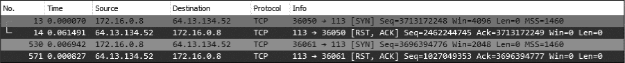

*图 12-5：一个 SYN 后跟一个 RST，表示端口关闭*

第一个数据包是初始 SYN，紧接着是目标的 RST。这表示目标没有在目标端口上接受连接，并且很可能没有服务在该端口上运行。

##### 识别开放和关闭的端口

现在你理解了 SYN 扫描可以引发的不同类型的响应，你将希望找到一种快速的方法来识别哪些端口是开放的，哪些是关闭的。答案再次存在于会话窗口中。在这个窗口中，你可以通过点击“数据包”列标题，按数据包编号对 TCP 会话进行排序，直到箭头指向下方，如图 12-6 所示。

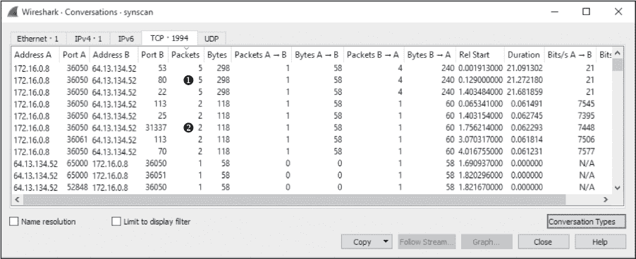

*图 12-6：使用会话窗口查找开放端口*

三个扫描端口在它们的每个会话中包含五个数据包➊。我们知道端口 53、80 和 22 是开放的，因为这五个数据包代表了初始 SYN、相应的 SYN/ACK 以及目标的重传 SYN/ACK。

对五个端口，只有两个数据包参与了通信➋。第一个是初始 SYN，第二个是目标的 RST。这些结果表明端口 113、25、31337、113 和 70 是关闭的。

对话窗口中的剩余条目仅包括一个数据包，意味着目标主机从未对初始的 SYN 做出响应。这些端口很可能是关闭的，但我们不确定。

这种通过计数数据包的技术在这个主机上有效，但并不适用于你可能扫描的所有主机，因此你不应完全依赖它。相反，应该专注于学习什么是正常的刺激和响应，以及对正常刺激的异常响应可能意味着什么。

#### *操作系统指纹识别*

攻击者非常重视了解目标操作系统的情况。了解操作系统有助于攻击者正确配置所有攻击方法，以适应该系统。它还允许攻击者知道目标文件系统中某些关键文件和目录的位置，如果他们成功访问系统的话。

*操作系统指纹识别*是指一组技术，用于在没有物理访问权限的情况下确定系统上运行的操作系统。有两种类型的操作系统指纹识别：被动和主动。

##### 被动指纹识别

*passiveosfinger printing.pcapng*

使用*被动指纹识别*，你可以检查从目标发送的某些数据包字段，以确定正在使用的操作系统。该技术被认为是被动的，因为你只监听目标主机发送的数据包，而不是主动向主机发送任何数据包。这种类型的操作系统指纹识别非常适合攻击者，因为它使他们能够保持隐蔽。

话虽如此，我们如何仅凭目标主机发送的数据包来确定其操作系统呢？这项技术之所以可能，是因为协议 RFC 中定义的规范没有标准化的值。尽管 TCP、UDP 和 IP 头中的各种字段非常具体，但通常并未为每个字段定义默认值。这意味着每个操作系统中的 TCP/IP 堆栈实现必须为这些字段定义自己的默认值。表 12-1 列出了部分常见字段及其默认值，这些默认值可以用来将它们与不同的操作系统关联。请记住，这些值可能会随着新的操作系统版本发布而发生变化。

**表 12-1：** 常见的被动指纹识别值

| **协议头** | **字段** | **默认值** | **平台** |
| --- | --- | --- | --- |
| IP | 初始生存时间 | 64 | NMap, BSD, OS X, Linux |
|  |  | 128 | Novell, Windows |
|  |  | 255 | Cisco IOS, Palm OS, Solaris |
| IP | 不分段标志 | 设置 | BSD, OS X, Linux, Novell, Windows, Palm OS, Solaris |
|  |  | 未设置 | Nmap, Cisco IOS |
| TCP | 最大报文段大小 | 0 | Nmap |
|  |  | 1440–1460 | Windows, Novell |
|  |  | 1460 | BSD, OS X, Linux, Solaris |
| TCP | 窗口大小 | 1024–4096 | Nmap |
|  |  | 65535 | BSD, OS X |
|  |  | 变量 | Linux |
|  |  | 16384 | Novell |
|  |  | 4128 | Cisco IOS |
|  |  | 24820 | Solaris |
|  |  | 可变 | Windows |
| TCP | SackOK | 设置 | Linux, Windows, OS X, OpenBSD |
|  |  | 未设置 | Nmap, FreeBSD, Novell, Cisco IOS, Solaris |

存储在文件*passiveosfingerprinting.pcapng*中的数据包是这种技术的绝佳示例。文件中有两个数据包，两个都是发送到端口 80 的 TCP SYN 数据包，但它们来自不同的主机。仅使用这些数据包中包含的值，并参考表 12-1，我们应该能够确定每个主机上使用的操作系统架构。每个数据包的详细信息见图 12-7。

使用表 12-1 作为参考，我们可以创建表 12-2，它是这些数据包中相关字段的细分。

**表 12-2：** 操作系统指纹识别数据包细分

| **协议头** | **字段** | **数据包 1 值** | **数据包 2 值** |
| --- | --- | --- | --- |
| IP | 初始生存时间 | 128 | 64 |
| IP | 不分片标志 | 设置 | 设置 |
| TCP | 最大段大小 | 1,440 字节 | 1,460 字节 |
| TCP | 窗口大小 | 64,240 字节 | 2,920 字节 |
| TCP | SackOK | 设置 | 设置 |

基于这些值，我们可以得出结论，数据包 1 很可能是由运行 Windows 的设备发送的，而数据包 2 很可能是由运行 Linux 的设备发送的。

请记住，表 12-1 中列出的常见被动指纹识别标识字段并非详尽无遗。还有许多特殊情况可能导致这些预期值的偏差。因此，你不能完全依赖被动操作系统指纹识别得到的结果。

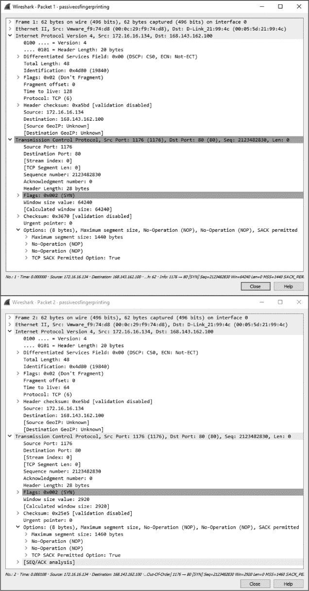

*图 12-7：这些数据包可以告诉我们它们是从哪个操作系统发送的。*

**注意**

*在许多情况下，攻击者依赖自动化工具来被动识别目标的操作系统。使用操作系统指纹识别技术的一个工具是 p0f。该工具分析数据包捕获中的相关字段并输出疑似的操作系统。通过使用像 p0f 这样的工具，你不仅可以获取操作系统架构，有时甚至可以得到操作系统的版本或补丁级别。你可以从* [`lcamtuf.coredump.cx/p0f.shtml`](http://lcamtuf.coredump.cx/p0f.shtml) 下载 p0f。

##### 主动指纹识别

*activeosfingerprinting.pcapng*

当被动监控流量未能获得预期结果时，可能需要采取更直接的方法——*主动指纹识别*。在这种方法中，攻击者主动向目标发送特别构造的数据包，以引发回复，从而揭示目标机器上的操作系统。当然，由于这种方法涉及直接与目标通信，因此并不隐蔽，但它可以非常有效。

文件*activeosfingerprinting.pcapng*包含了一个使用 Nmap 扫描工具发起的主动操作系统指纹识别扫描的示例。该文件中的多个数据包是 Nmap 发送的不同探测包的结果，旨在引发响应，从而识别操作系统。Nmap 会记录这些探测包的响应，并构建指纹，随后与数据库中的值进行比对，以做出判断。

**注意**

*Nmap 用于主动指纹识别操作系统的技术相当复杂。要了解 Nmap 如何执行主动操作系统指纹识别，请阅读该工具作者 Gordon “Fyodor” Lyon 的权威指南，《Nmap 网络扫描》（2008）。*

### 流量操控

本书中我一直尝试展示的一个关键点是，通过分析正确的数据包，你可以了解一个系统或其用户的许多信息。因此，攻击者通常会自己捕获这些数据包，这一点并不奇怪。通过分析系统生成的数据包，攻击者可以了解操作系统、使用的应用程序、身份验证凭证等等。

本节中，我们将讨论两种数据包级别的技术：攻击者如何利用 ARP 缓存中毒拦截和捕获目标流量，以及他们如何拦截 HTTP cookies 进行会话劫持攻击。

#### *ARP 缓存中毒*

*arppoison.pcapng*

在第七章中，我们讨论了 ARP 协议如何允许设备在网络内部将 IP 地址映射到 MAC 地址；在第二章中，我们讨论了 ARP 缓存中毒如何成为一个有用的技术，可以帮助我们接入网络并拦截需要分析的主机流量。当用于合法目的时，ARP 缓存中毒对故障排除非常有帮助。然而，当该技术被用于恶意目的时，它将成为一种致命的*中间人攻击 (MITM)*。

在 MITM 攻击中，攻击者会重定向两个主机之间的流量，以便拦截或修改传输中的数据。MITM 攻击有很多种形式，包括 DNS 欺骗和 SSL 劫持。在 ARP 缓存中毒中，特殊构造的 ARP 数据包使得两台主机误认为它们在彼此之间通信，实际上它们是在与第三方通信，第三方充当中介转发数据包。通过这种方式，协议的正常功能被不正当使用，进而被用作恶意目的。

文件*arppoison.pcapng*包含了一个 ARP 缓存中毒的示例。当你打开它时，你会发现这些流量乍看之下是正常的。然而，如果你跟踪数据包，你会看到我们的目标 172.16.0.107 正在浏览 Google 并进行搜索。由于这次搜索，产生了大量的 HTTP 流量，并夹杂了一些 DNS 查询。

我们知道，ARP 缓存中毒是一种发生在第二层的技术，因此如果我们只是随便浏览数据包列表窗格，可能很难看到任何恶意行为。为了帮助我们识别这些，我们将在数据包列表窗格中添加几个列，如下所示：

1.  选择**编辑** ▶ **首选项**。

1.  点击首选项窗口左侧的**列**。

1.  点击加号（+）按钮以添加一个新列。

1.  在标题区域，输入源 MAC 并按 ENTER 键。

1.  在类型下拉列表中，选择**Hw src addr (resolved)**。

1.  点击新添加的条目并拖动它，使其紧接在源列后面。

1.  点击加号（+）按钮以添加一个新列。

1.  在标题区域，输入目标 MAC 并按 ENTER 键。

1.  在类型下拉列表中，选择**Hw dest addr (resolved)**。

1.  点击新添加的条目并拖动它，使其紧接在目标列后面。

1.  点击**确定**以应用更改。

当你完成这些步骤后，屏幕应该会像图 12-8 所示。此时，你应该有两列额外显示数据包的源 MAC 地址和目标 MAC 地址。

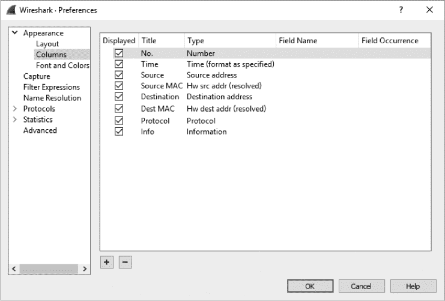

*图 12-8：添加了源和目标硬件地址的新列配置屏幕*

如果你仍然开启了 MAC 名称解析，你应该能看到通信设备的 MAC 地址，标示出 Dell 和 Cisco 硬件。记住这一点非常重要，因为当我们浏览捕获的数据时，会看到在第 54 个数据包处发生了变化，此时我们看到 Dell 主机（我们的目标）与新引入的 HP 主机（攻击者）之间发生了某些奇怪的 ARP 流量，如图 12-9 所示。

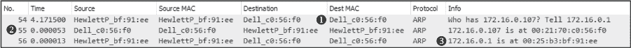

*图 12-9：Dell 设备与 HP 设备之间的奇怪 ARP 流量*

在继续操作之前，请注意此通信中涉及的端点，这些端点列在表 12-3 中。

**表 12-3:** 正在监控的端点

| **角色** | **设备类型** | **IP 地址** | **MAC 地址** |
| --- | --- | --- | --- |
| 目标 | Dell | 172.16.0.107 | 00:21:70:c0:56:f0 |
| 路由器 | Cisco | 172.16.0.1 | 00:26:0b:31:07:33 |
| 攻击者 | HP | 未知 | 00:25:b3:bf:91:ee |

但是，是什么让这段流量显得奇怪呢？回顾我们在第七章中关于 ARP 的讨论，ARP 数据包有两种主要类型：请求和响应。请求数据包作为广播发送到网络中的所有主机，以便找到与特定 IP 地址关联的 MAC 地址。然后，回复请求设备的主机发送一个单播数据包作为响应。根据这些背景信息，我们可以识别出此通信序列中的一些异常，参考图 12-9。

首先，数据包 54 是一个 ARP 请求，由攻击者（MAC 地址 00:25:b3:bf:91:ee）作为单播数据包直接发送到目标（MAC 地址 00:21:70:c0:56:f0）➊。这种类型的请求应该广播给网络上的所有主机，但这个请求仅仅指向了目标。同时，注意到尽管这个数据包是由攻击者发送，并且在 ARP 头中包含了攻击者的 MAC 地址，但它列出了路由器的 IP 地址，而不是攻击者自己的。

紧接着，目标向攻击者回应了一个包含其 MAC 地址信息的数据包➋。真正的“巫术”发生在数据包 56 中，攻击者向目标发送了一个未经请求的 ARP 回复，告诉目标 172.16.0.1 位于其 MAC 地址 00:25:b3:bf:91:ee 处➌。问题是，MAC 地址 172.16.0.1 并不是 00:25:b3:bf:91:ee，而是 00:26:0b:31:07:33。我们之所以知道这一点，是因为我们在之前的数据包捕获中看到了路由器与目标之间的通信。由于 ARP 协议本身不安全（它接受未经请求的 ARP 表更新），目标现在会把本应发送给路由器的流量发送给攻击者。

**注意**

*由于这个数据包捕获来自目标的机器，因此你实际上并没有看到整个情况。为了让这次攻击生效，攻击者必须向路由器发送相同的包序列，以让路由器认为攻击者实际上就是目标，但我们需要从路由器（或攻击者）获取另一个数据包捕获，才能看到那些数据包。*

一旦目标和路由器都被欺骗，二者之间的通信就会通过攻击者进行传输，如图 12-10 所示。

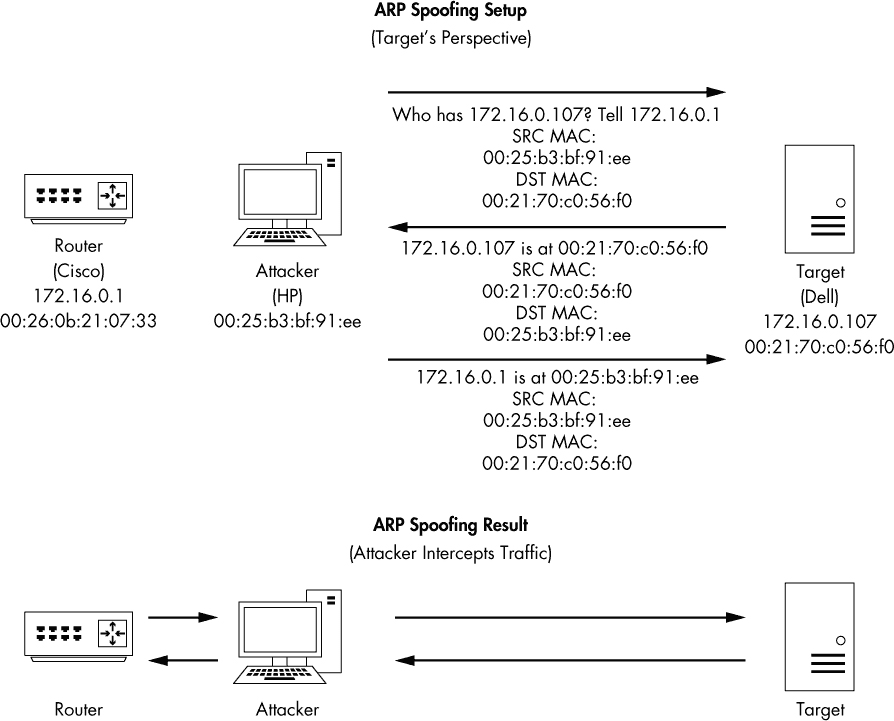

*图 12-10：作为 MITM 攻击的 ARP 缓存中毒*

数据包 57 确认了此次攻击的成功。通过将这个数据包与神秘 ARP 流量之前发送的一个数据包进行对比，比如数据包 40（见图 12-11），你会发现远程服务器（Google）的 IP 地址保持不变➋，但目标的 MAC 地址发生了变化➊。MAC 地址的变化告诉我们，流量现在正在通过攻击者进行路由，直到到达路由器。

由于此攻击非常隐蔽，因此很难检测。为了发现它，通常需要借助专门配置的 IDS（入侵检测系统），或者是运行在设备上的软件，用于检测 ARP 表条目的突变。由于你很可能会使用 ARP 缓存中毒来捕获你正在分析的网络上的数据包，因此了解这种技术如何被用于攻击你是很重要的。

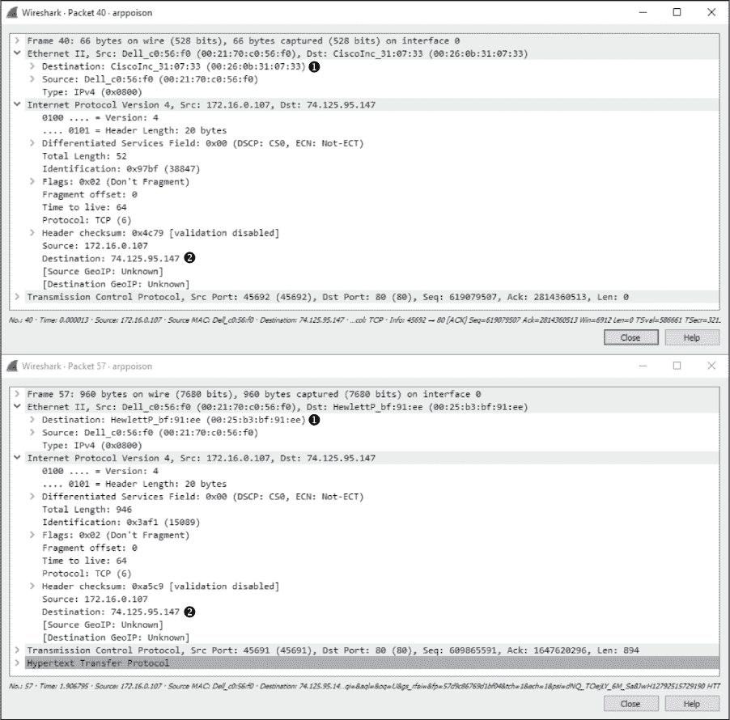

*图 12-11：目标 MAC 地址的变化表明此次攻击成功。*

#### *会话劫持*

*sessionhijacking.pcapng*

现在你已经知道了 ARP 缓存中毒可以被恶意利用，我想展示一种可以利用它的技术：*会话劫持*。在会话劫持中，攻击者获取一个 HTTP 会话 cookie，稍后我们将学习它，并用它冒充另一个用户。为了实现这一点，攻击者可以利用 ARP 缓存中毒来拦截目标的流量并找到相关的会话 cookie 信息。然后，攻击者可以使用这些信息以目标用户的身份访问目标 web 应用程序。

本场景从文件 *sessionhijacking.pcapng* 开始。该捕获文件包含了一个目标（172.16.16.164）与一个 web 应用程序（172.16.16.181）之间的通信流量。在目标不知情的情况下，他们已经成为攻击者（172.16.16.154）的受害者，攻击者正在积极拦截他们的通信。这些数据包是从 web 服务器的角度收集的，这很可能是防御者在针对其服务器基础设施实施会话劫持攻击时所拥有的视角。

**注意**

*这里访问的 web 应用程序名为 Damn Vulnerable Web Application (DVWA)。它故意存在许多类型的漏洞，常被用作教学工具。如果你想了解更多关于 web 应用攻击的信息或分析与这些攻击相关的数据包，可以在* [`www.dvwa.co.uk/`](http://www.dvwa.co.uk/) *了解更多关于 DVWA 的内容。*

该捕获中的流量主要包含两次对话。第一次是目标与 web 服务器之间的通信，可以通过过滤器 ip.addr == 172.16.16.164 && ip.addr == 172.16.16.181 来隔离。这种通信表示正常的 web 浏览流量，没有特别之处。特别值得关注的是请求中的 cookie 值。例如，如果你查看第 14 包中的 `GET` 请求，你会在数据包详细信息窗口中找到 cookie，如 图 12-12 所示。在这种情况下，cookie 通过一个 PHPSESSID 值 `ncobrqrb7fj2a2sinddtk567q4` ➊ 来标识会话 ID。

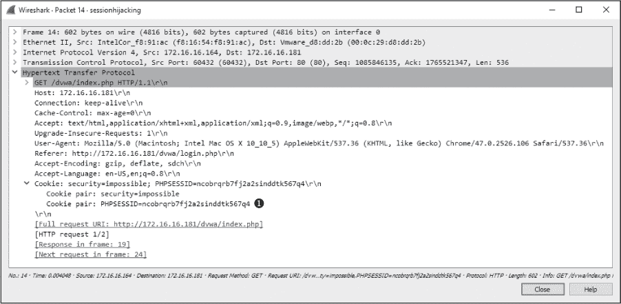

*图 12-12：查看目标的会话 cookie*

网站使用 cookies 来维持对单独主机的会话识别。当新访客访问网站时，系统会为其分配一个唯一的会话 ID（即 PHPSESSID）。为了进行身份验证，许多应用会等待具有会话 ID 的用户成功登录应用后，才会创建一个数据库记录，识别该 ID 为已验证会话的代表。任何拥有该 ID 的用户都可以使用该身份验证访问应用。当然，开发者通常认为只有单一用户拥有特定的 ID，因为这些 ID 是唯一生成的。然而，这种处理会话 ID 的方法并不安全，因为它允许恶意用户窃取其他用户的 ID 并冒充他们。虽然有方法可以防止会话劫持技术，但许多网站，包括 DVWA，仍然容易受到攻击。

目标并没有意识到他们的流量正被攻击者拦截，或者攻击者已经获取到会话 cookie，如图 12-12 所示。攻击者所要做的，就是使用该 cookie 值与 Web 服务器进行通信。这项任务可以通过某些类型的代理服务器来完成，但使用像 Chrome 的 Cookie 管理器这样的浏览器插件会更轻松。通过这个插件，攻击者可以指定从目标流量中获取的 PHPSESSID 值，如图 12-13 所示。


*图 12-13：使用 Cookie 管理器插件模拟目标身份*

如果你清除之前应用于捕获文件的过滤器并开始向下滚动，最终会看到攻击者的 IP 地址与 Web 服务器进行通信。你可以通过过滤器 ip.addr == 172.16.16.154 && ip.addr == 172.16.16.181 来限制视图，只显示这些通信。

在我们进一步探讨之前，先在数据包列表窗格中添加一列来显示 cookie 值。如果你在上一节的 ARP 缓存投毒部分已经添加了列，应该先移除这些列。然后，按照 ARP 缓存投毒部分的说明，基于字段名 http.cookie_pair 添加新的自定义列。一旦添加完成，将该列放置在目标字段后面。你的屏幕应该如图 12-14 所示。

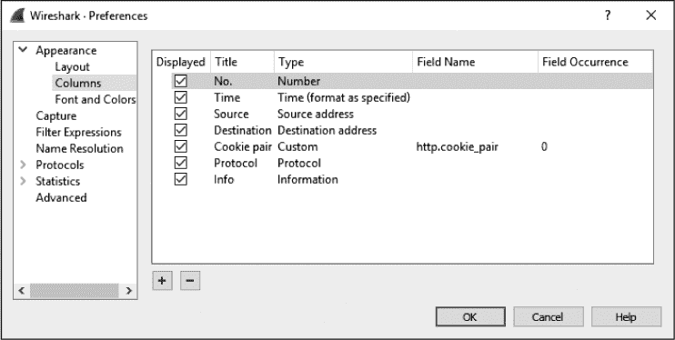

*图 12-14：配置列以调查会话劫持*

配置好新的列后，修改显示过滤器，只显示 HTTP 请求，因为 TCP 通信在这里没有用处。新的过滤器是 (ip.addr==172.16.16.154 && ip.addr==172.16.16.181) && (http.request.method || http.response.code)。结果包如图 12-15 所示。

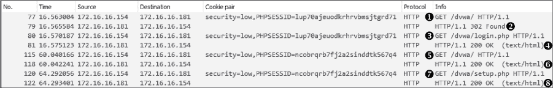

*图 12-15：攻击者冒充目标用户*

现在你正在查看攻击者与服务器之间的通信。在前四个数据包中，攻击者请求 */dvwa/* 目录 ➊，并收到 302 响应代码，这是 web 服务器用来将访客重定向到不同 URL 的正常方法。在这种情况下，攻击者被重定向到了登录页面 */dvwa/login.php* ➋。攻击者的机器请求了登录页面 ➌，并成功返回 ➍。这两个请求都使用了会话 ID *lup70ajeuodkrhrvbmsjtgrd71*。

随后，发出了新的请求来访问 */dvwa/* 目录，但这次请注意不同的会话 ID ➎。会话 ID 现在是 *ncobrqrb7fj2a2sinddtk567q4*，与目标先前使用的相同。这表明攻击者已经操控了流量，使用了被盗的 ID。请求没有被重定向到登录页面，而是返回了 HTTP 200 状态码，并且页面以目标认证后的样子被呈现 ➏。攻击者使用目标的 ID 浏览了另一个页面 *dvwa/setup.php* ➐，该页面也成功返回 ➑。攻击者像目标一样浏览 DVWA 网站，而无需知道目标的用户名或密码。

这只是一个例子，展示了攻击者如何将数据包分析转化为攻击工具。一般来说，可以安全地假设，如果攻击者能够看到与你的通信相关的数据包，那么就有可能导致某种类型的恶意活动。这也是安全专业人士主张通过加密保护传输数据的原因之一。

### 恶意软件

尽管完全合法的软件也可以用于恶意目的，*恶意软件*通常是指专门为了恶意意图而编写的代码。恶意软件可以有多种形态，包括自我传播的蠕虫和伪装成合法软件的特洛伊木马。从网络防御者的角度来看，大多数恶意软件在被捕获和分析之前是无法发现和未知的。这个分析过程涉及多个步骤，其中一个步骤是专注于恶意软件的网络通信模式的行为分析。在某些情况下，分析发生在法医恶意软件反向工程实验室中，但更多时候，它发生在野外，当安全分析师发现他们的网络中某个设备被感染时。

在这一部分，我们将通过数据包观察几个真实的恶意软件及其行为示例。

#### *奥罗拉行动*

*aurora.pcapng*

2010 年 1 月，发现奥罗拉行动利用了 Internet Explorer 中一个当时尚未被发现的漏洞。这个漏洞使得攻击者能够远程控制 Google 等公司内部的目标机器。

为了执行这些恶意代码，用户只需访问一个使用易受攻击版本的 Internet Explorer 的网页。攻击者随后便能够直接访问用户的机器，并且拥有与已登录用户相同的权限。*鱼叉式钓鱼*攻击通过向受害者发送设计用来诱使他们点击链接访问恶意网站的电子邮件来吸引目标。

在 Aurora 案例中，我们从目标用户点击鱼叉式钓鱼邮件中的链接开始跟踪此事件。生成的数据包包含在文件*aurora.pcapng*中。

该捕获过程开始于目标（192.168.100.206）与攻击者（192.168.100.202）之间的三次握手。初始连接是通过 80 端口，这让我们认为这是 HTTP 流量。这个假设在第四个数据包中得到了证实，该数据包是一个针对*/info*的 HTTP `GET`请求 ➊，如图 12-16 所示。

如图 12-17 所示，攻击者的机器确认收到了`GET`请求，并在数据包 6 ➊中报告了 302（暂时移动）响应代码，这是常用的重定向浏览器到另一个页面的状态码，正如本例所示。除了 302 响应代码外，Location 字段指定了位置*/info?rFfWELUjLJHpP* ➋。

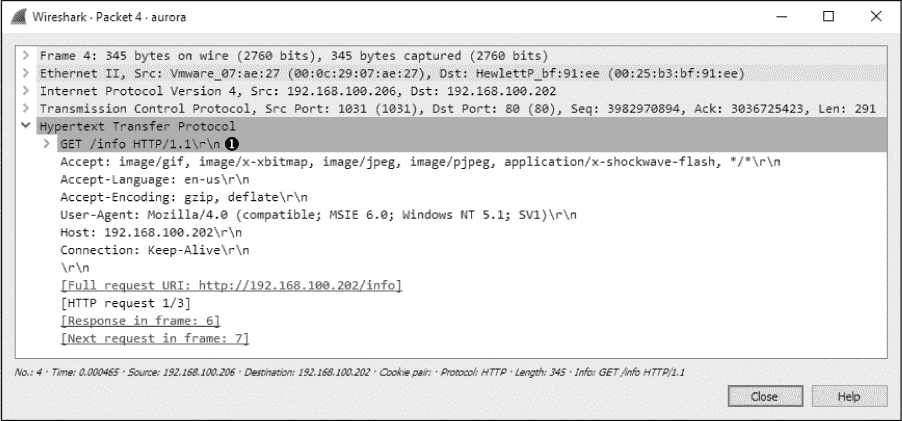

*图 12-16：目标发起了对* /info 的`GET`请求。

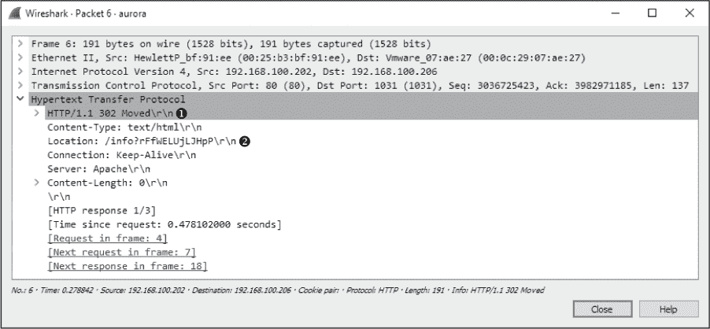

*图 12-17：客户端浏览器通过此数据包被重定向。*

收到 HTTP 302 数据包后，客户端发起了对*/info?rFfWELUjLJHpP* URL 的另一个`GET`请求，该请求在数据包 7 中出现，并且在数据包 8 中收到 ACK。接着，下一些数据包代表着攻击者向目标传输的数据。要查看这些数据，右键点击流中的一个数据包，比如数据包 9，然后选择**跟踪** ▶ **TCP 流**。在此流输出中，我们可以看到最初的`GET`请求、302 重定向以及第二个`GET`请求，如图 12-18 所示。

接下来，事情开始变得非常奇怪。攻击者用一些看起来非常奇怪的内容响应了`GET`请求，其中的第一部分如图 12-19 所示。

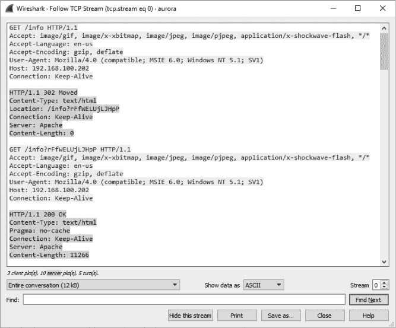

*图 12-18：数据流被传输到客户端*

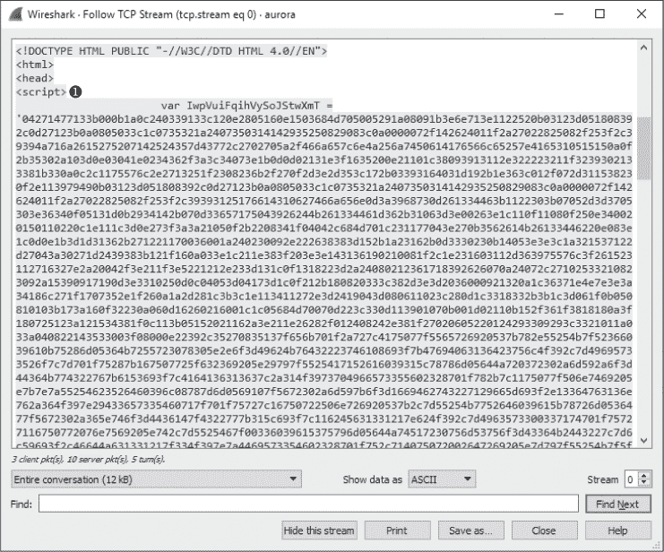

*图 12-19：`<script>`标签内的这段混淆内容似乎经过了编码处理。*

该内容看起来是一串随机的数字和字母，位于 `<script>` 标签内 ➊。`<script>` 标签用于 HTML 中，表示使用一种高级的客户端脚本语言，其代码在 HTTP 客户端上执行。在这个标签内，通常可以看到各种脚本语句。但这里的乱码表示内容可能已经被编码，以隐藏其真实信息。由于我们知道这是攻击流量，可以推测这段被混淆的文本包含了用于利用易受攻击服务的十六进制填充和 Shellcode。

**注意**

*脚本混淆是恶意软件常用的一种技术，用于规避检测并隐藏恶意内容。虽然本书不涉及脚本去混淆，但如果你继续研究恶意软件通信，这将是你会掌握的技能。许多经验丰富的恶意软件分析师可以通过快速的视觉检查立刻识别出恶意脚本。如果你想挑战自己，试着手动去混淆本例中找到的脚本。*

在攻击者发送的第二部分内容中，如 图 12-20 所示，我们最终看到了可以读取的文本。即使没有广泛的编程知识，我们也能看出，这段文本似乎基于一些变量进行字符串解析。这是 `</script>` 标签关闭之前的最后一段文本。

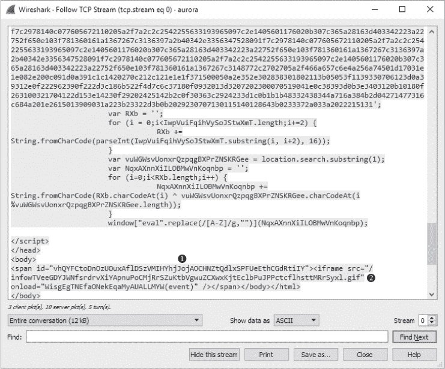

*图 12-20：这部分从服务器发送的内容包含可读文本和一个可疑的 iframe。*

从攻击者发送到客户端的最后一部分数据，如 图 12-20 所示，分为两部分。第一部分是 `<span id="vhQYFCtoDnOzUOuxAflDS zVMIHYhjJojAOCHNZtQdlxSPFUeEthCGdRtiIY">` 部分 ➊。第二部分，包含在 `<span></span>` 标签内，是 `<iframe src="/infowTVeeGDYJWNfsrdrvXiYApnuPoC MjRrSZuKtbVgwuZCXwxKjtEclbPuJPPctcflhsttMRrSyxl.gif" onload="WisgEgTNEfaONekE qaMyAUALLMYW(event)" />` ➋。再一次，这段内容可能是恶意活动的迹象，原因是其中有异常长且随机的无法读取、可能已混淆的文本。

包含在 `<span>` 标签内的部分代码是一个 *iframe*，这是攻击者常用的一种方法，用来将额外的意外内容嵌入到 HTML 页面中。`<iframe>` 标签创建了一个内联框架，用户通常无法察觉。在这种情况下，`<iframe>` 标签引用了一个命名奇怪的 GIF 文件。如 图 12-21 所示，当目标的浏览器看到这个文件的引用时，它会在第 21 包中发出一个 `GET` 请求 ➊，然后 GIF 文件会紧接着被发送 ➋。

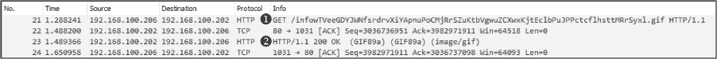

*图 12-21：iframe 中指定的 GIF 被目标请求并下载。*

此捕获中最奇怪的部分发生在数据包 25，当时目标发起了一个回连接到攻击者的端口 4321。查看来自数据包详细信息窗格的这第二个通信流没有提供太多信息，因此我们将再次查看 TCP 流，以便更清晰地了解正在传输的数据。 图 12-22 显示了跟踪 TCP 流的窗口输出。

在此显示中，我们看到一些应该立即引起警报的内容：一个 Windows 命令行 ➊。此命令行从目标发送到服务器，表明攻击者的漏洞利用尝试成功，并且有效负载已被投放。一旦漏洞被启动，客户端便将命令行传回给攻击者。在此捕获中，我们甚至能看到攻击者通过输入 `dir` 命令 ➋ 来查看目标机器上的目录列表 ➌。

假设漏洞已经利用并感染了以管理员身份运行的进程，或者已迁移至其中，攻击者几乎可以对目标机器做任何他们想做的事情。仅需点击一下，在几秒钟内，目标就将其计算机的完全控制权交给了攻击者。

像这样的漏洞利用通常会被编码以在传输过程中变得无法识别，以防止被网络 IDS 拦截。因此，在没有事先了解此漏洞或漏洞代码样本的情况下，可能很难确定目标系统上发生了什么，除非进行进一步的分析。幸运的是，我们能够从此数据包捕获中找出一些恶意代码的明显迹象。这包括 `<script>` 标签中的混淆文本、奇怪的 iframe 以及以明文显示的命令行。

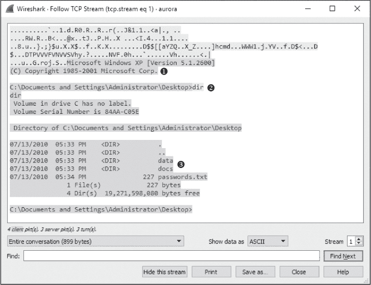

*图 12-22：攻击者通过此连接与命令行进行交互。*

以下是 Aurora 漏洞在这里如何工作的总结：

•     目标接收到攻击者发送的看似合法的电子邮件，点击其中的链接，并向攻击者的恶意站点发送 `GET` 请求。

•     攻击者的 Web 服务器向目标发出 302 重定向，目标的浏览器自动向重定向的 URL 发出 `GET` 请求。

•     攻击者的 Web 服务器向客户端传输一个包含混淆 JavaScript 代码的网页，代码中包含一个漏洞利用程序和一个包含指向 GIF 图像的链接的 iframe，后者被请求。

•     之前传输的 JavaScript 代码在目标的浏览器中渲染页面时被去混淆，并在他们的机器上执行，利用了 Internet Explorer 中的漏洞。

•     一旦漏洞被利用，隐藏在混淆代码中的有效负载将被执行，打开一个新的会话，从目标连接到攻击者的端口 4321。

•     从有效负载中生成命令行并返回给攻击者，以便他们与其交互。

从防御者的角度来看，我们可以使用这个捕获文件为我们的 IDS（入侵检测系统）创建一个签名，帮助检测未来可能发生的类似攻击。例如，我们可以过滤捕获文件中的一个未加密部分，比如`<script>`标签中加密文本结尾的明文代码。另一个思路是为所有带有 302 重定向到 URL 中含有*info*的站点的 HTTP 流量编写签名。这个签名需要进行一些额外的调整才能在生产环境中可行，但它是一个不错的开始。当然，值得记住的是，签名是可以被绕过的。如果攻击者只是更改了我们观察到的几个字符串，或者通过其他机制发送了这个漏洞，我们的签名可能会失效。因此，攻击者和防御者之间的永恒斗争依然在继续。

**注意**

*基于恶意流量样本创建流量签名是防御网络未知威胁的关键步骤。分析像这里描述的捕获文件是学习如何编写这些签名的好方法。要了解更多关于入侵检测和攻击签名的信息，请访问 Snort 项目：* [`www.snort.org/`](http://www.snort.org/).

#### *远程访问木马*

*ratinfected.pcapng*

到目前为止，我们已经在一定了解攻击背景的情况下分析了安全事件。这是学习攻击样式的好方法，但它并不完全贴近现实。在大多数实际的网络防御场景中，负责防守网络的人不会检查网络上每一个传输的数据包。相反，他们会使用某种形式的 IDS 来提醒他们网络流量中的异常情况，依据的是预定义的攻击签名。

在下一个示例中，我们将从一个简单的警报开始，假设我们是现实世界中的分析师。在这种情况下，我们的 IDS 触发了以下警报：

```
[**] [1:132456789:2] CyberEYE RAT Session Establishment [**]
[Classification: A Network Trojan was detected] [Priority: 1]
07/18-12:45:04.656854 172.16.0.111:4433 -> 172.16.0.114:6641
TCP TTL:128 TOS:0x0 ID:6526 IpLen:20 DgmLen:54 DF
***AP*** Seq: 0x53BAEB5E Ack: 0x18874922 Win: 0xFAF0 TcpLen: 20
```

我们的下一步是查看触发此警报的签名规则：

```
alert tcp any any -> $HOME_NET any (msg:"CyberEYE RAT Session Establishment";
content:"|41 4E 41 42 49 4C 47 49 7C|"; classtype:trojan-activity;
sid:132456789; rev:2;)
```

该规则设置为当它检测到任何来自外部网络进入内部网络的数据包，其中包含十六进制内容`41 4E 41 42 49 4C 47 49 7C`时触发警报，这些内容转换为人类可读的 ASCII 字符*ANA BILGI*。当检测到时，警报触发，表示可能存在 CyberEYE *远程访问木马（RAT）*。RAT 是一种在目标计算机上悄悄运行的恶意程序，为攻击者提供远程访问目标计算机的手段。

**注意**

*CyberEYE 是曾经流行的土耳其工具，用于创建 RAT 可执行文件并管理被攻陷的主机。具有讽刺意味的是，Snort 规则在这里触发的是字符串 ANA BILGI，这个词在土耳其语中表示“基本信息”。*

现在我们来看一下与*ratinfected.pcapng*中的警报相关的流量。这个 Snort 警报通常只会捕获触发警报的单个数据包，但幸运的是，我们拥有两台主机之间的整个通信序列。为了跳到重点，按照以下方式搜索 Snort 规则中提到的十六进制字符串：

1.  选择**Edit** ▶ **Find Packet**，或按 CTRL-F。

1.  从下拉菜单中选择**Hex Value**选项。

1.  在文本区域中输入值 41 4E 41 42 49 4C 47 49 7C。

1.  点击**Find**。

如图 12-23 所示，你现在应该能看到数据部分中包 4 ➊中首次出现的十六进制字符串。

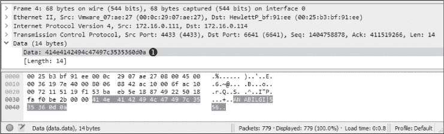

*图 12-23：在数据包 4 中首次看到 Snort 警报中的内容字符串。*

如果你选择多次点击**Find**，你会发现这个字符串也出现在包 5、10、32、156、280、405、531 和 652 中。尽管这个捕获文件中的所有通信都是在攻击者（172.16.0.111）和目标（172.16.0.114）之间进行的，但似乎有些字符串实例出现在不同的对话中。虽然包 4 和包 5 使用端口 4433 和 6641 进行通信，但其他大多数实例发生在端口 4433 和其他随机选择的临时端口之间。我们可以通过查看对话窗口的 TCP 选项卡来确认存在多个对话，如图 12-24 所示。

我们可以通过为不同的对话着色来在这个捕获文件中直观地区分它们，如下所示：

1.  在包列表窗格上方的过滤器对话框中，输入过滤器(tcp.flags.syn == 1) && (tcp.flags.ack == 0)。然后按 ENTER。这将选中流量中每个对话的初始 SYN 包。

1.  右键点击第一个包并选择**Colorize Conversation**。

1.  选择**TCP**，然后选择一个颜色。

1.  对剩余的 SYN 包重复此过程，为每个包选择不同的颜色。

1.  完成后，点击**X**以移除过滤器。

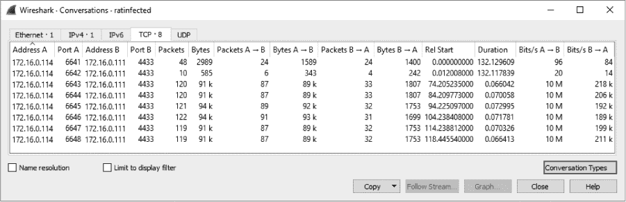

*图 12-24：攻击者和目标之间存在三个独立的对话。*

为对话着色后，我们可以清除过滤器，查看它们之间的关系，帮助我们跟踪两台主机之间的通信过程。第一个对话（端口 6641/4433）是两台主机开始通信的地方，因此是一个很好的起点。右键点击对话中的任何数据包，选择**Follow TCP Stream**查看传输的数据，如图 12-25 所示。


*图 12-25：第一个对话产生了有趣的结果。*

随即，我们看到攻击者向目标发送了文本字符串 `ANABILGI|556` ➊。因此，目标响应了一些基本的系统信息，包括计算机名称（`CSANDERS-6F7F77`）和正在使用的操作系统（`Windows XP Service Pack 3`） ➋，并开始反复将字符串 `BAGLIMI?` 发送回攻击者 ➌。攻击者唯一的回馈是字符串 `CAPSCREEN60` ➍，该字符串出现了六次。

攻击者返回的这个`CAPSCREEN60`字符串很有趣，接下来我们看看它指向哪里。为此，请确保你已经清除了任何显示过滤器，并使用搜索对话框在数据包中搜索文本字符串`CAPSCREEN60`，选择 **字符串** 选项并确保已选择 **数据包字节** 选项来执行搜索。

执行此搜索后，我们在第 27 个数据包中找到了第一个 `CAPSCREEN60` 字符串。这个信息的有趣之处在于，当字符串从攻击者发送到客户端时，客户端确认接收到数据包，并在第 29 个数据包中启动了一个新会话。你应该能更容易地注意到新会话的开始，因为之前应用的着色规则会帮助你辨认。

现在，如果我们跟踪这个新会话的 TCP 流输出（如图 12-26 所示），我们看到熟悉的字符串`ANABILGI|12`，接着是`SH|556`，最后是`CAPSCREEN|C:\WINDOWS\jpgevhook.dat|84972` ➊。注意 `CAPSCREEN` 字符串后面指定的文件路径，后面跟着一些无法读取的文本。最引人注目的是，这段无法读取的文本前面有一个字符串 `JFIF` ➋，快速 Google 搜索会告诉你，它通常出现在 JPG 文件的开头。

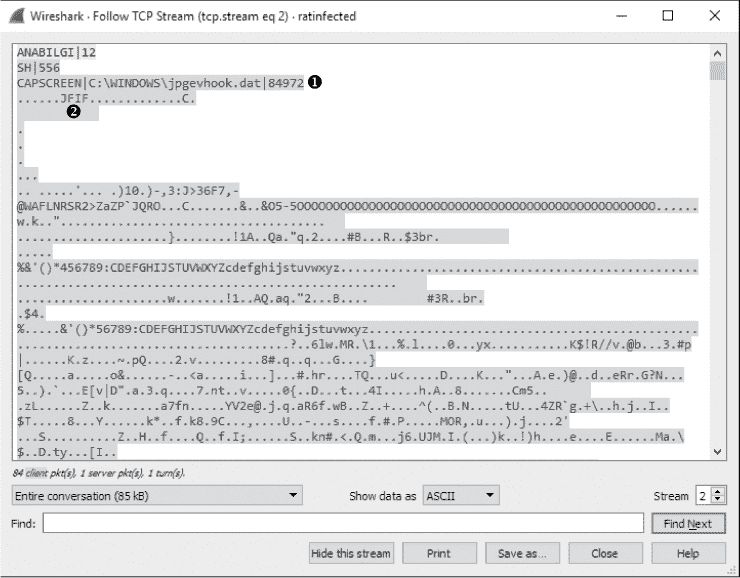

*图 12-26：攻击者似乎正在发起请求以获取 JPG 文件。*

到此为止，我们可以安全地得出结论，攻击者发起了请求以传输这张 JPG 图片。但更重要的是，我们开始看到流量中出现了命令结构。似乎 `CAPSCREEN` 是攻击者用来启动 JPG 文件传输的命令。事实上，每当发送 `CAPSCREEN` 命令时，结果都是相同的。为了验证这一点，可以查看每个包含 `CAPSCREEN` 命令的会话的 TCP 流，或者尝试使用 Wireshark 的 IO 图形功能，如下所示：

1.  选择 **统计信息** ▶ **IO 图形**。

1.  点击加号（+）按钮以添加五行。

1.  分别将过滤器 tcp.stream eq 2、tcp.stream eq 3、tcp.stream eq 4、tcp.stream eq 5 和 tcp.stream eq 6 插入到显示过滤器中，并为每个过滤器命名。

1.  将每个条目的 y 轴刻度更改为 **字节/秒**。

1.  点击 **图表 1**、**图表 2**、**图表 3**、**图表 4** 和 **图表 5** 按钮以启用为指定过滤器显示的数据点。

图 12-27 显示了结果图。

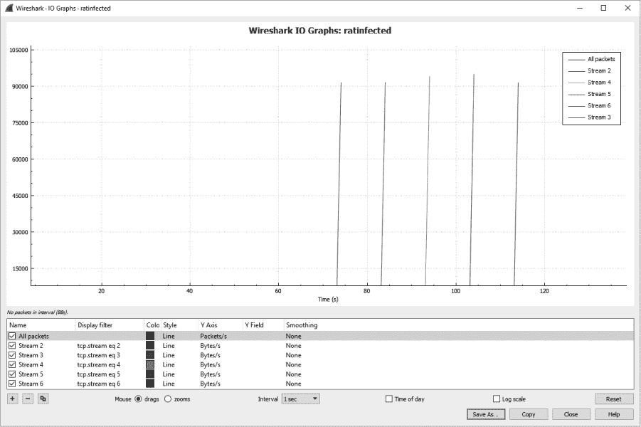

*图 12-27：此图表显示了类似的活动似乎在重复出现。*

根据这张图表，看起来每个会话大致包含相同数量的数据，并且持续时间相同。我们现在可以得出结论，这一活动多次重复。

你可能已经对传输中的 JPG 图像的内容有一些想法，那么让我们看看能否查看其中一个文件。要从 Wireshark 提取 JPG 数据，执行以下步骤：

1.  首先，像我们在图 12-25 中做的那样，跟踪适当数据包的 TCP 流。数据包 29 是一个不错的选择。

1.  必须将通信隔离，以便我们只看到从目标发送到攻击者的数据流。通过选择下拉菜单旁边的箭头（标记为“整个会话 (85033 字节)”）来执行此操作。确保选择正确的方向流量，即 172.16.0.114:6643 --> 172.16.0.111:4433（85 KB）。

1.  在**显示数据为**下拉菜单中，选择**RAW**。

1.  点击**另存为**按钮保存数据，确保以*.jpg*文件扩展名保存文件。

如果现在尝试打开图像，你可能会惊讶地发现它无法打开。这是因为我们还需要执行最后一步。与在第十章中从 FTP 流量中干净提取文件的情况不同，这里的流量向数据中添加了一些额外的内容。在这种情况下，TCP 流中的前两行实际上是恶意软件的命令序列的一部分，而不是构成 JPG 的实际数据（参见图 12-28）。当我们保存流时，这些多余的数据也被保存了。因此，文件查看器在寻找 JPG 文件头时看到的内容与它期望的内容不匹配，因此无法打开图像。

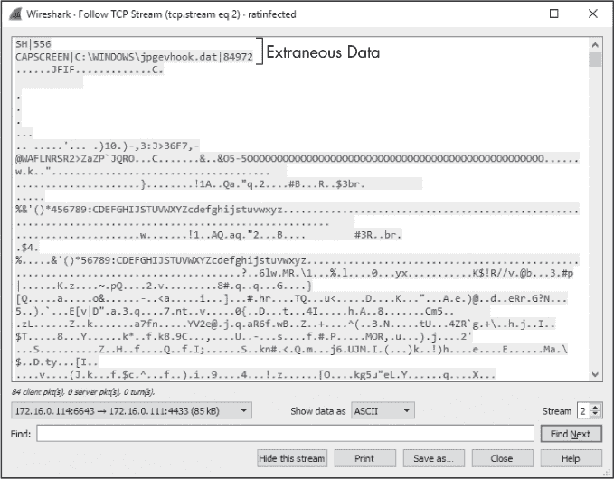

*图 12-28：恶意软件添加的多余数据阻止文件正确打开。*

解决此问题是一个简单的过程，只需使用十六进制编辑器稍微操作一下。这一过程称为*文件雕刻*。要从导出的数据中雕刻出这个文件，请完成以下过程：

1.  在查看图 12-28 中的 TCP 流时，点击**另存为**按钮。选择一个容易记住的文件名，并将文件保存到一个你稍后可以再次访问的位置。

1.  从*[`www.x-ways.net/winhex/`](https://www.x-ways.net/winhex/)*下载并安装 WinHex。

1.  执行 WinHex 并打开刚刚从 Wireshark 保存的文件。

1.  使用鼠标选择文件开头的所有多余数据。这应该包括所有在`FF D8 FF E0`字节之前的内容，这些字节表示新 JPG 文件的开始。要选择的字节在图 12-29 中已突出显示。

    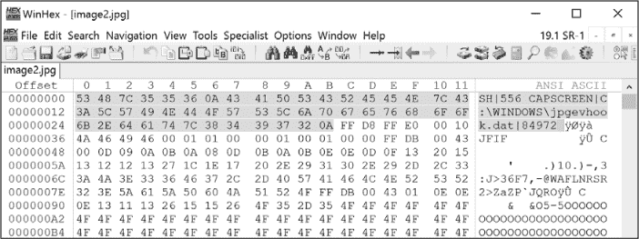

    *图 12-29：从 JPG 文件中移除多余的字节*

1.  按下**删除**键以删除选定的数据。

1.  点击 WinHex 主工具栏中的**保存**按钮以保存您的更改。

**注意**

*我喜欢在 Windows 上使用 WinHex 来执行这项任务，但任何您熟悉的十六进制编辑器都可以。*

去除不需要的数据字节后，您现在应该能够打开文件。应该清楚地看到木马正在捕获目标桌面的屏幕截图并将其传回攻击者（图 12-30）。在这些通信序列完成后，通信通过正常的 TCP 断开序列结束。

这个场景是入侵分析员在分析基于 IDS 警报的流量时所遵循的思维过程的典型例子：

•     检查警报以及生成它的签名。

•     确认签名匹配是否在正确的上下文中出现。

•     检查流量以了解攻击者在受感染机器上做了什么。

•     在更多敏感信息从受感染目标泄露之前，开始对问题进行遏制。


*图 12-30：传输的 JPG 是目标计算机的屏幕截图。*

### 漏洞利用工具包和勒索软件

*cryptowall4_c2.pcapng，ek_to_cryptowall4.pcapng*

在我们的最后一个场景中，我们将查看另一个始于 IDS 警报的调查。我们将探索从感染系统生成的实时数据包，然后尝试追踪入侵的源头。这个例子将利用真实的恶意软件，您可能会在您的网络中发现它感染了设备。

故事始于 Sguil 控制台中由 Snort 生成的 IDS 警报，如图 12-31 所示。Sguil 是一个用于管理、查看和调查来自一个或多个传感器的 IDS 警报的工具。它的用户界面并不最为吸引人，但它已经存在一段时间，并且是安全分析员非常流行的工具。

在 Sguil 中有大量关于此警报的信息可供查看。上方窗口 ➊ 显示了警报的摘要。在这里，您可以看到警报生成的时间、源和目标 IP 地址及端口、协议以及匹配的 IDS 签名生成的事件信息。在此案例中，192.168.122.145 是本地友好系统，它通过端口 80 与外部未知系统 184.170.149.44 进行通信，而端口 80 通常与 HTTP 流量相关。由于该系统在与指示恶意通信的签名相关时出现，因此假设外部系统是恶意的，并且对它知之甚少。匹配此流量的签名代表了 CryptoWall 恶意软件家族的注册流量，表明该恶意软件的某个变种已经安装在友好系统上。

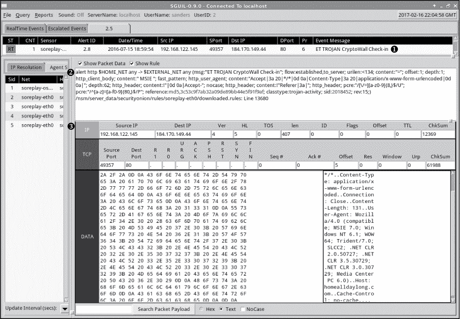

*图 12-31：此 IDS 警报表明存在 CryptoWall 4 感染。*

Sguil 控制台提供了匹配规则的语法 ➋ 和匹配该规则的单个数据包数据 ➌。请注意，数据包信息被分解为协议头和数据部分，类似于 Wireshark 中展示数据包信息的方式。不幸的是，Sguil 只提供匹配的单个数据包信息，我们需要深入挖掘。下一步是使用 Wireshark 检查与此警报相关的流量，尝试验证流量并查看发生了什么。该流量包含在文件*cryptowall4_c2.pcapng*中。

这个数据包捕获包含了在警报发生时进行的通信，并且并不复杂。第一次通信发生在数据包 1 至 16 之间，我们可以通过跟踪该通信的 TCP 流轻松查看它（图 12-32）。在捕获开始时，本地系统打开一个 TCP 连接到敌对主机的 80 端口，并向 URL *[`homealldaylong.com/76N1Lm.php?x4tk7t4jo6`](http://homealldaylong.com/76N1Lm.php?x4tk7t4jo6)* ➊ 发出一个`POST`请求，内容包含少量的字母数字数据 ➋。敌对主机以一个字母数字字符串 ➍ 和一个`HTTP 200 OK`响应代码 ➌ 回应，随后连接被正常终止。


*图 12-32：这些主机之间通过 HTTP 传输少量数据。*

如果你查看捕获文件的其余部分，你会看到在这些主机之间相同的序列重复出现，每次传输的数据量不同。使用过滤器`http.request.method == "POST"`可以查看三个具有相似 URL 结构的不同连接（图 12-33）。

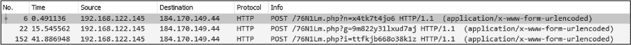

*图 12-33：URL 结构显示不同的数据传递到相同的页面。*

*76N1Lm.php*部分（网页）保持不变，但其余内容（传递给页面的参数和数据）则有所不同。重复的通信序列以及请求的结构与恶意软件的命令与控制（C2）行为一致，并且与生成警报的特征匹配。因此，本地系统很可能感染了 CryptoWall，就像特征所暗示的那样。你可以通过检查流行的 CryptoWall Tracker 研究页面上的类似样本进一步验证这一点：* [`www.cryptowalltracker.org/cryptowall-4.html#networktraffic`](https://www.cryptowalltracker.org/cryptowall-4.html#networktraffic)。

**注意**

*解密友好系统与敌对系统在 C2 序列中通信的数据对于本书来说可能有些复杂。但如果你感兴趣，可以在这里阅读更多相关内容：* [`www.cryptowalltracker.org/communication-protocol.html`](https://www.cryptowalltracker.org/communication-protocol.html)。

现在你已经确认了基于恶意软件的 C2 通信正在发生，接下来最好处理这个问题并修复受感染的机器。特别是当涉及到像 CryptoLocker 这样的恶意软件时，这一点尤为重要，因为它试图加密用户的数据，并且只有在用户支付了高额赎金后才会提供解密密钥——因此，类似的恶意软件被称为*勒索软件*。修复问题的步骤超出了本书的范围，但在实际的场景中，这些将是安全分析师接下来的行动。

一个常见的后续问题是，友好的机器是如何最初感染的。如果能够确定这一点，你可能会发现其他设备也以类似的方式感染了其他恶意软件，或者你可能能够开发保护或检测机制以防止未来的感染。

警报数据包仅在感染后显示了活跃的 C2 序列。在执行安全监控和持续数据包捕获的网络中，许多网络传感器被配置为存储数据包数据几个小时或几天，以便进行取证调查。毕竟，并不是每个组织都能够在警报发生的瞬间做出响应。临时存储数据包使我们能够查看友好主机在启动之前看到的 C2 序列的数据包。这些数据包包含在文件*ek_to_cryptowall4.pcapng*中。

浏览该数据包捕获文件的初步查看告诉我们，还有很多包需要查看，但它们都是 HTTP 请求。既然我们已经知道 HTTP 的工作原理，那么让我们直奔主题，使用显示过滤器`http.request`仅显示请求数据包。这将显示来自友好主机的 11 个 HTTP 请求（图 12-34）。

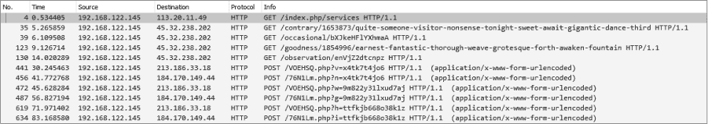

*图 12-34：来自友好主机的 11 个 HTTP 请求*

第一个请求来自友好的主机 192.168.122.145，目标是一个未知的外部主机 113.20.11.49。通过检查该数据包的 HTTP 部分（图 12-35），我们得知用户请求了页面*[`www.sydneygroup.com.au/index.php/services/`](http://www.sydneygroup.com.au/index.php/services/)* ➊，并且是从 Bing 搜索* [sydneygroup.com.au](http://sydneygroup.com.au) * ➋跳转过来的。到目前为止，这看起来是正常的。

接下来，友好的主机向另一个未知的外部主机 45.32.238.202 发出了四个请求，分别位于数据包 35、39、123 和 130 中。正如你在之前的示例中看到的，浏览器在查看存储了嵌入内容或广告的网页时，通常会从其他主机检索内容。这本身并不令人担忧，尽管这些请求中的域名看起来有些随机且可疑。

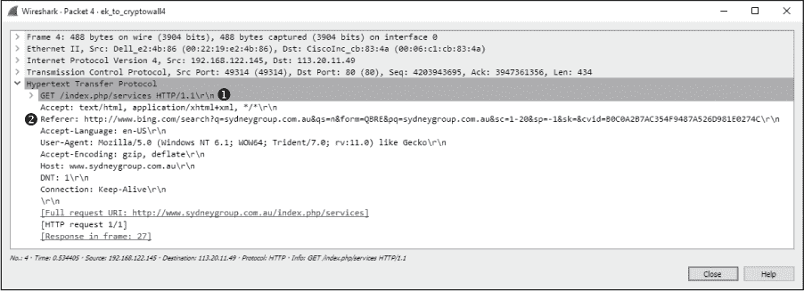

*图 12-35：一个 HTTP 请求到未知的外部主机*

在数据包 39 的 `GET` 请求中，事情变得有趣了。跟踪此交换的 TCP 流（图 12-36），你会注意到请求了一个名为 *bXJkeHFlYXhmaA* 的文件 ➊。这个文件的名称有些奇怪，并且没有包含文件扩展名。

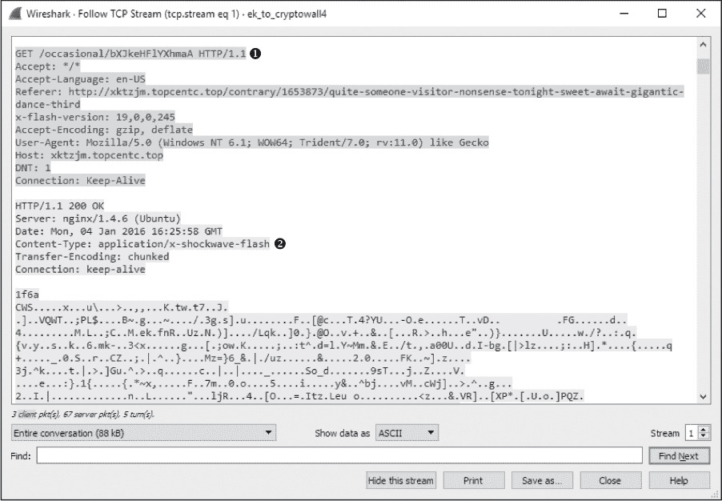

*图 12-36：下载了一个名字奇怪的 Flash 文件。*

经过仔细检查，我们看到 web 服务器将该文件的内容识别为 *x-shockwave-flash* ➋。Flash 是一种在浏览器中用于流媒体播放的流行插件。看到设备下载 Flash 内容并不异常，但值得注意的是，Flash 以其软件漏洞而臭名昭著，且这些漏洞经常得不到修复。Flash 文件在请求后成功下载。

在 Flash 文件下载后，数据包 130 中又有一个请求，要求下载一个类似命名的文件。跟踪这个 TCP 流（图 12-37），你会看到请求了一个名为 *enVjZ2dtcnpz* 的文件 ➊。此处没有通过扩展名或服务器识别文件类型。请求后，客户端下载了一个 358,400 字节的无法读取的数据块 ➋。

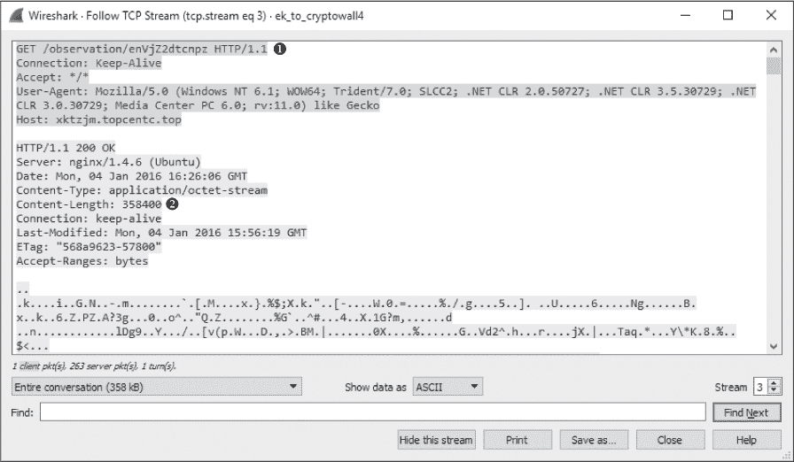

*图 12-37：又下载了一个名字奇怪的文件，但未识别出文件类型。*

在下载该文件不到 20 秒后，你应该在 图 12-34 中看到一些熟悉的内容。从数据包 441 开始，友好的主机开始向两个不同的服务器发送 HTTP `POST` 请求，使用之前观察到的相同 C2 模式。我们很可能已经找到了感染的源头。下载的两个文件是罪魁祸首。第一个文件来自数据包 39 的请求，交付了 Flash 漏洞，第二个文件来自数据包 130 的请求，交付了恶意软件。

**注意**

*你可以使用恶意软件分析技术来解码和分析数据包捕获中的文件。如果你对逆向工程恶意软件感兴趣，我推荐 Michael Sikorski 和 Andrew Honig 的《实用恶意软件分析》（2012 年），这是一本来自 No Starch Press 的书，也是我个人的最爱。*

这个场景代表了最常见的感染技巧之一。用户正在浏览互联网时，偶然进入了一个被恶意重定向代码感染的网站，这些代码来自一个利用工具包。这些工具包感染合法服务器，旨在识别客户端以确定其漏洞。被感染的页面被称为 *工具包的着陆页*，其目的是将客户端重定向到另一个包含该工具包已确定有效的漏洞的站点。

你刚刚看到的这些数据包来自于 Angler 利用工具包，它可能是 2015 年和 2016 年最常见的工具包。当用户访问一个被 Angler 感染的网站时，该工具包会判断用户会受到特定 Flash 漏洞的攻击。Flash 文件被传送，系统被利用，CryptoWall 恶意软件的二次负载被下载并安装到主机上。整个过程如图 12-38 所示。

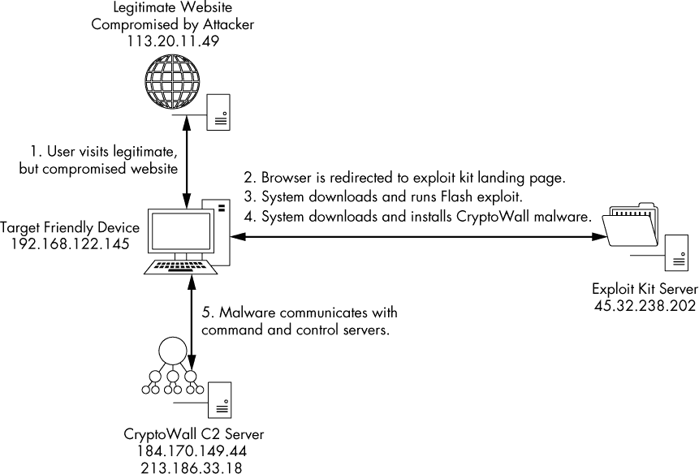

*图 12-38：利用工具包感染序列*

### 最终思考

关于在与安全相关的场景中分析数据包捕获、分析常见攻击以及响应 IDS 警报，完全可以写成整本书。在本章中，我们考察了一些常见的扫描和枚举技术、一种常见的 MITM 攻击，以及一些关于系统如何被利用以及可能会发生什么的例子。
