## **13**

**无线数据包分析**


无线网络的世界与传统的有线网络有所不同。尽管我们仍然在处理像 TCP 和 IP 这样的常见通信协议，但在进入 OSI 模型的最低层时，情况有些变化。在这里，数据链路层由于无线网络和物理层的特性而显得尤为重要。与变化不大的以太网等简单有线协议不同，我们需要考虑像 802.11 这样的无线协议的细微差别，而这些协议发展得相当迅速。这给我们访问的数据以及如何捕获这些数据带来了新的限制。

考虑到这些额外的因素，本书专门有一章讲述如何在无线网络上进行数据包捕获和分析，这一点应该不足为奇。在本章中，我们将讨论为什么无线网络在数据包分析中是独特的，并且如何克服任何挑战。当然，我们将通过实际的无线网络捕获案例来进行分析。

### **物理考虑**

捕获和分析通过无线网络传输的数据时，首先要考虑的是物理传输介质。直到现在，我们还没有考虑物理层，因为我们一直通过物理电缆进行通信。现在，我们通过看不见的无线电波进行通信，数据包就在我们身边飞过。

#### ***一次嗅探一个频道***

捕获无线局域网（WLAN）流量时一个特别需要考虑的因素是无线频谱是一个共享介质。与有线网络不同，在有线网络中，每个客户端都有自己的网络电缆连接到交换机，而无线通信介质是客户端共享的空气空间，其大小有限。一个 WLAN 只会占用 802.11 频谱的一部分，这允许多个系统在同一个物理区域内操作，并使用频谱的不同部分。

**注意**

*无线网络基于由电气和电子工程师协会（IEEE）开发的 802.11 标准。本章中，术语* 无线网络 *和* WLAN *指的是遵循 802.11 标准的网络。这个标准的最流行版本包括 802.11a、b、g 和 n。每个版本都有一套独特的功能和特性，像 n 这样的较新标准提供了更快的速度。它们都仍然使用相同的频谱。*

空间的分隔通过将频谱划分为操作频道来实现。*频道*只是 802.11 无线频谱的一部分。在美国，提供 11 个频道（在一些其他国家允许更多）。这很重要，因为，就像 WLAN 只能在一个频道上操作一样，我们也只能在一个频道上嗅探数据包，正如图 13-1 所示。因此，如果你正在故障排除一个在频道 6 上运行的 WLAN，你必须配置系统以捕获频道 6 上的流量。

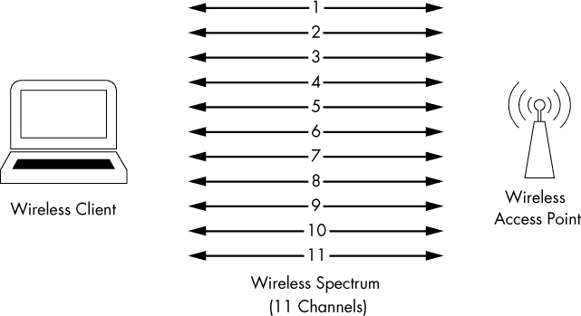

*图 13-1：无线嗅探可能是繁琐的，因为它一次只能在一个频道上进行。*

传统的无线嗅探一次只能在一个频道上进行，但有一个例外：某些无线扫描应用使用一种叫做*频道跳跃*的技术，快速切换频道以收集数据。这个类型中最流行的工具之一，Kismet（*[`www.kismetwireless.net/`](http://www.kismetwireless.net/)*），每秒最多可以跳跃 10 个频道，这使得它非常有效地同时嗅探多个频道。

#### ***无线信号干扰***

在无线通信中，我们有时不能依赖于通过空气传输的数据的完整性。可能会有一些干扰信号的因素。无线网络包括一些处理干扰的功能，但这些功能并不总是有效。因此，在无线网络中捕获数据包时，你必须密切关注周围环境，确保没有显著的干扰源，比如大的反射面、大型刚性物体、微波炉、2.4 GHz 的电话、厚墙或高密度的表面。这些都会导致数据包丢失、数据包重复和数据包格式错误。

通道之间的干扰也是一个值得关注的问题。虽然你一次只能嗅探一个通道，但这有一个小的 caveat：无线网络频谱中有多个传输通道可用，但由于空间有限，通道之间存在轻微的重叠，正如图 13-2 所示。这意味着，如果频道 4 和频道 5 上有流量，而你正在嗅探其中一个频道，你很可能会捕获到另一个频道的数据包。通常，在同一地区共存的网络会设计为使用不重叠的频道 1、6 和 11，所以你可能不会遇到这个问题。但为了以防万一，你应该理解其发生的原因。


*图 13-2：由于频谱空间有限，通道之间存在重叠。*

#### ***检测和分析信号干扰***

排查无线信号干扰并不是通过查看 Wireshark 中的数据包就能完成的。如果你打算经常或以此为职业来排查 WLAN 故障，你肯定需要定期检查信号干扰。这个任务是通过*频谱分析仪*来完成的，它能显示整个频谱的数据或干扰。

商业级频谱分析仪的价格可能高达数千美元，但有一个适合日常使用的优秀解决方案。MetaGeek 生产了一款 USB 硬件设备 Wi-Spy，可以监控整个 802.11 频谱中的信号。当与 MetaGeek 的 inSSIDer 或 Chanalyzer 软件配合使用时，该硬件能够图形化显示频谱，以便帮助排除故障。Chanalyzer 的示例输出显示在图 13-3 中。

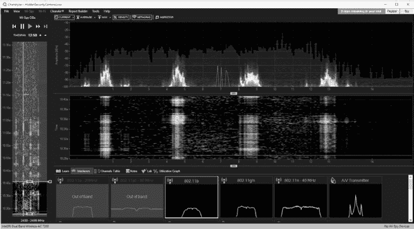

*图 13-3：此 Chanalyzer 输出显示了在 Wi-Fi 频谱上均匀分布的四个信号。*

### **无线网卡模式**

在开始嗅探无线数据包之前，我们需要了解无线网卡在数据包捕获方面可以操作的不同模式。

有四种无线网卡模式可供选择：

**受管模式** 当你的无线客户端直接连接到无线接入点（WAP）时，使用此模式。在这种情况下，与无线网卡相关联的驱动程序依赖 WAP 来管理整个通信过程。

**临时模式** 当你有一个无线网络设置，设备直接相互连接时，就使用此模式。在这种模式下，两个想要通信的无线客户端共同承担无线接入点（WAP）通常负责的任务。

**主模式** 一些高端无线网卡还支持主模式。该模式允许无线网卡与专用驱动程序配合工作，使计算机能够充当其他设备的无线接入点（WAP）。

**监控模式** 这是我们工作中最重要的模式。当你希望无线客户端停止发送和接收数据，而仅仅监听空中飞行的数据包时，就需要使用监控模式。为了让 Wireshark 能够捕获无线数据包，你的无线网卡及其驱动程序必须支持监控模式（也称为 RFMON 模式）。

大多数用户仅在受管模式或临时模式下使用无线网卡。每种模式的操作方式通过图 13-4 进行了图形化展示。

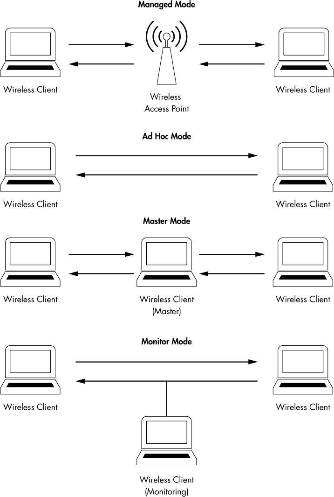

*图 13-4：不同无线网卡模式*

**注意**

*我经常被问到推荐哪种无线网卡用于无线数据包分析。我使用并强烈推荐 ALFA 网络的产品。它们的产品被认为是市场上最好的之一，能够确保你捕获到每一个可能的数据包，而且价格实惠、便于携带。ALFA 的产品可以通过大多数在线计算机硬件零售商购买。*

### **在 Windows 中进行无线嗅探**

即使你拥有支持监视模式的无线网卡，大多数基于 Windows 的无线网卡驱动程序也不允许你切换到该模式。这意味着你只能捕获从你用来连接网络的设备的无线接口传输的包。要捕获在一个频道上所有设备之间的包，你需要额外的硬件。

#### ***配置 AirPcap***

Riverbed Technologies 的 AirPcap（*[`www.riverbed.com/`](http://www.riverbed.com/)*)旨在克服 Windows 对无线数据包分析的限制。AirPcap 是一款小型 USB 设备，类似于闪存驱动器，如图 13-5 所示。它设计用于从一个或多个指定频道捕获无线流量。AirPcap 使用 WinPcap 驱动程序和一个特殊的客户端配置工具。

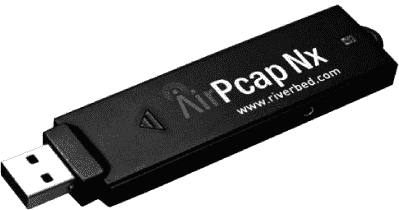

*图 13-5：AirPcap 设备非常紧凑，便于与笔记本电脑一起携带。*

AirPcap 配置程序（如图 13-6 所示）使用起来非常简单，只有几个可配置选项：

**接口** 你可以在这里选择用于捕获的设备。一些高级分析场景可能要求你使用多个 AirPcap 设备，分别在多个频道上同时嗅探。

**闪烁 LED** 点击此按钮将使 AirPcap 设备上的 LED 灯闪烁。主要用于识别你正在使用的特定适配器，特别是当你有多个 AirPcap 设备时。

**频道** 在此字段中，选择你希望 AirPcap 监听的频道。

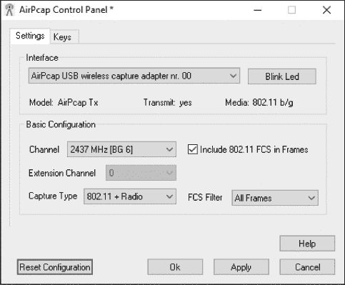

*图 13-6：AirPcap 配置程序*

**扩展频道** 在此，你可以选择一个扩展频道，这是 802.11n 适配器的一个功能，允许创建更宽的频道。

**在帧中包含 802.11 FCS** 默认情况下，一些系统会从无线数据包中去除最后四位校验和。这种校验和，称为帧检验序列（FCS），用于确保数据包在传输过程中没有被损坏。除非你有特殊理由，否则勾选此框以包含 FCS 校验和。

**捕获类型** 此处有三个选项：802.11 仅、802.11 + 无线电和 802.11 + PPI。802.11 仅选项包含所有捕获数据包的标准 802.11 数据包头。802.11 + 无线电选项包括此数据包头，并在其前面添加一个 radiotap 头，包含有关数据包的附加信息，例如数据速率、频率、信号强度和噪声水平。802.11 + PPI 选项则添加了每包信息头，包含有关 802.11n 数据包的附加信息。

**FCS 过滤器** 即使你取消勾选“在帧中包含 802.11 FCS”框，此选项仍然允许你过滤掉被 FCS 判断为损坏的数据包。使用“有效帧”选项只显示 FCS 认为能够成功接收的数据包。

**WEP 配置**   这个区域（可以在 AirPcap 控制面板的“Keys”标签页中访问）允许你输入 WEP 解密密钥，用于你将要嗅探的网络。为了能够解读由 WEP 加密的数据，你需要在此字段中输入正确的 WEP 密钥。WEP 密钥在《成功的 WEP 认证》一节中有详细讨论，详见第 309 页。

#### ***使用 AirPcap 捕获流量***

一旦你安装并配置了 AirPcap，捕获过程应该对你来说很熟悉。只需启动 Wireshark 并选择 AirPcap 接口开始从中收集数据包（参见图 13-7）。

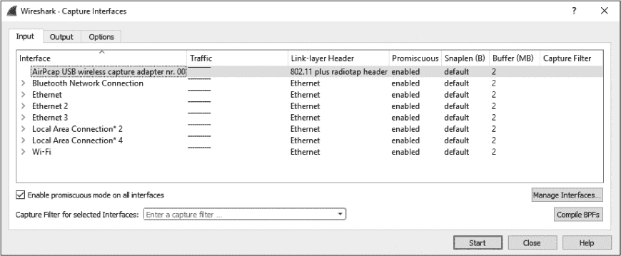

*图 13-7：选择 AirPcap 接口来捕获数据包*

请记住，你将从在 AirPcap 配置工具中选择的频道捕获数据包。如果你没有看到你想要的数据包，可能是因为你选择了错误的频道。你可以通过停止当前的捕获，选择 AirPcap 配置工具中的新频道，然后重新启动捕获来更改频道。在更改频道时，你不能同时进行数据包捕获。

如果你需要验证在 Wireshark 中捕获的频道，可以通过查看无线捕获统计信息来轻松确认。方法是从主下拉菜单中点击**Wireless** ▶ **WLAN Traffic**。弹出的窗口将显示观察到的设备及其信息，包括 802.11 频道，如图 13-8 所示。

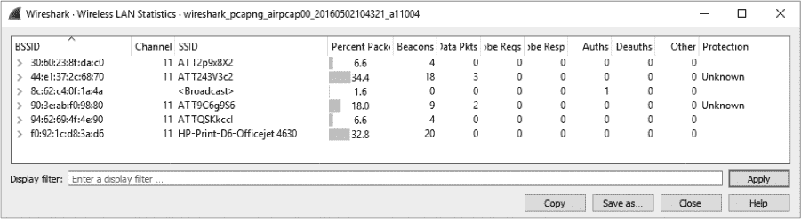

*图 13-8：无线 LAN 统计窗口显示数据是通过监听 11 频道捕获的。*

### **在 Linux 中无线嗅探**

在 Linux 中嗅探仅仅是启用无线网卡的监控模式并启动 Wireshark 的问题。不幸的是，启用监控模式的过程因每个无线网卡型号的不同而有所不同，因此我无法提供具体的操作建议。事实上，一些无线网卡根本不需要启用监控模式。最好的办法是通过快速的 Google 搜索查找你的网卡型号，确认是否需要启用监控模式，如果需要的话，查找具体的操作方法。

在 Linux 中启用监控模式的常见方法之一是通过其内建的无线扩展。你可以使用`iwconfig`命令访问这些无线扩展。如果你在终端中输入`iwconfig`，应该能看到类似这样的结果：

```
   $ iwconfig
➊ Eth0   no wireless extensions
   Lo0    no wireless extensions
➋ Eth1  IEEE 802.11g        ESSID: "Tesla Wireless Network"
          Mode: Managed Frequency: 2.462 GHz Access Point: 00:02:2D:8B:70:2E
          Bit Rate: 54 Mb/s Tx-Power-20 dBm Sensitivity=8/0
          Retry Limit: 7 RTS thr: off Fragment thr: off
          Power Management: off
          Link Quality=75/100 Signal level=-71 dBm Noise level=-86 dBm
          Rx invalid nwid: 0 Rx invalid crypt: 0 Rx invalid frag: 0
          Tx excessive retries: 0 Invalid misc: 0 Missed beacon: 2
```

`iwconfig`命令的输出显示，`Eth1`接口可以进行无线配置。这一点很明显，因为它显示了 802.11g 协议的数据➋，而`Eth0`和`Lo0`接口则返回了`no wireless extensions`的提示➊。

除了此命令提供的所有无线信息，如无线扩展服务集 ID（ESSID）和频率外，请注意`Eth1`下的第二行显示当前模式已设置为管理模式。这是我们想要更改的设置。

要将`Eth1`接口更改为监控模式，你必须以 root 用户身份登录，无论是直接登录还是通过切换用户（`su`）命令，如下所示：

```
$ su
Password: <enter root password here>
```

一旦你是 root 用户，你可以输入命令来配置无线接口选项。要将`Eth1`配置为监控模式，请输入以下命令：

```
# iwconfig eth1 mode monitor
```

一旦 NIC 进入监控模式，再次运行`iwconfig`命令应该能反映出你的更改。现在，通过输入以下命令来确保`Eth1`接口正常工作：

```
# iwconfig eth1 up
```

我们还将使用`iwconfig`命令来更改我们监听的频道。通过输入以下命令将`Eth1`接口的频道更改为频道 3：

```
# iwconfig eth1 channel 3
```

**注意**

*你可以在捕获数据包时实时更改频道，所以不要犹豫，随时更改。`iwconfig`命令也可以编写成脚本，以简化这个过程。*

完成这些配置后，启动 Wireshark 并开始数据包捕获。

### **802.11 数据包结构**

*80211beacon.pcapng*

无线数据包与有线数据包的主要区别在于增加了 802.11 头部。这个第二层头部包含有关数据包以及其传输媒介的额外信息。802.11 数据包有三种类型：

**管理**   这些数据包用于在第二层建立主机之间的连接。一些重要的管理数据包子类型包括认证、关联和 beacon 数据包。

**控制**   控制数据包允许管理和数据数据包的传输，并且与拥塞管理相关。常见的子类型包括请求发送（request-to-send）和清除发送（clear-to-send）数据包。

**数据**   这些数据包包含实际数据，并且是唯一可以从无线网络转发到有线网络的数据包类型。

无线数据包的类型和子类型决定了其结构，因此可能存在大量不同的结构。我们将通过查看文件*80211beacon.pcapng*中的一个数据包来研究其中一种结构。该文件包含一个称为*beacon*的管理数据包示例，如图 13-9 所示。

beacon 是你能找到的最具信息性的无线数据包之一。它作为广播数据包从 WAP 通过无线信道发送，通知任何正在监听的无线客户端该 WAP 可用，并定义必须设置的参数以便连接到它。在我们的示例文件中，可以看到该数据包在 802.11 头部的类型/子类型字段中被定义为 beacon ➊。

802.11 管理帧头中还包含大量附加信息，包括以下内容：

**时间戳**   数据包传输的时间

**Beacon 间隔**   beacon 数据包重新传输的间隔时间

**能力信息**   有关 WAP 硬件能力的信息

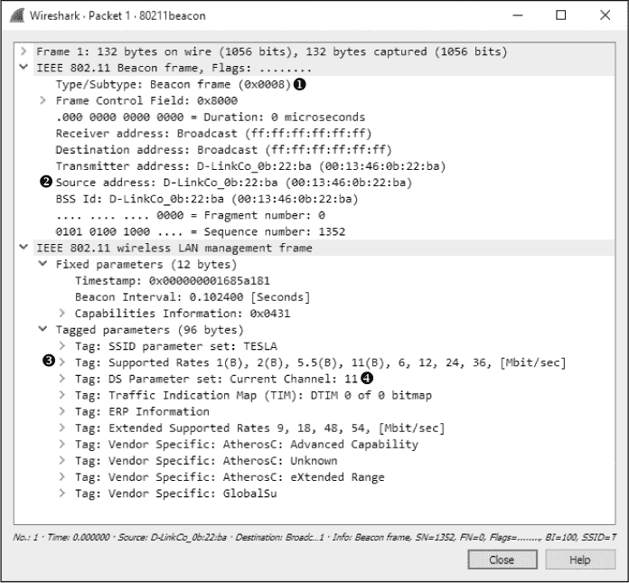

*图 13-9：这是一个 802.11 beacon 数据包。*

**SSID 参数设置**   WAP 广播的 SSID（网络名称）

**支持的速率**   WAP 支持的数据传输速率

**DS 参数集**   WAP 广播的频道

标头还包括源和目的地址以及厂商特定信息。

基于此，我们可以确定一些关于示例文件中广播信标的 WAP 的事情。显然，它是一个使用 802.11b 标准`(B)`的 D-Link 设备➋，运行在 11 频道➍。

尽管 802.11 管理包的确切内容和目的会有所变化，但其基本结构仍与此示例相似。

### **向数据包列表窗格添加无线特定列**

在前面的章节中，我们已经利用 Wireshark 灵活的界面添加了适应情况的列。在继续进行其他无线分析之前，添加以下三个列到数据包列表窗格会很有帮助。

•     频道列，显示捕获数据包时所在的频道

•     信号强度列，显示捕获数据包的信号强度（单位：dBm）

•     数据速率列，显示捕获数据包的吞吐速率

这些指示器在排查无线连接问题时非常有帮助。例如，即使你的无线客户端软件显示信号强度非常好，进行捕获并检查这些列可能会显示一个与此声明不符的数字。

要将这些列添加到数据包列表窗格，请按照以下步骤操作：

1.  选择**编辑** ▶ **首选项**。

1.  导航到列部分并点击+。

1.  在标题字段中输入**Channel**，在类型下拉菜单中选择**Custom**，并在字段名称框中使用过滤器**wlan_radio.channel**。

1.  对信号强度和数据速率列重复此过程，分别为它们命名，并在字段名称下拉列表中选择**wlan_radio.signal_dbm**和**wlan_radio.data_rate**。图 13-10 显示了在添加了所有三个列后，首选项窗口的样子。

    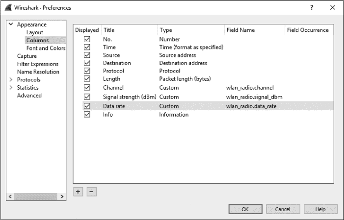

    *图 13-10：在数据包列表窗格中添加 IEEE 无线特定列*

1.  点击**确定**保存更改。

### **无线特定过滤器**

我们在第四章中讨论了捕获和显示过滤器的好处。在有线基础设施中，过滤流量要容易得多，因为每个设备都有自己的专用电缆。然而，在无线网络中，无线客户端生成的所有流量都在共享频道上共存，这意味着对任何一个频道的捕获可能包含来自几十个客户端的流量。本节将介绍一些可以帮助你找到特定流量的包过滤器。

#### ***为特定 BSS ID 过滤流量***

网络中的每个 WAP 都有一个唯一的标识名称，称为*基本服务集标识符（BSS ID）*。这个名称会在接入点传输的每个无线管理包和数据包中发送。

一旦你知道了想要检查的 BSS ID 名称，实际上你只需要找到从那个特定 WAP 发送的一个数据包。Wireshark 会在数据包列表窗格的“信息”列中显示发送的 WAP，所以找到这一信息通常很容易。

一旦从感兴趣的 WAP 获取到一个数据包，找到其 802.11 头部中的 BSS ID 字段。这是你用来设置过滤器的地址。在找到 BSS ID MAC 地址后，你可以使用以下过滤器：

```
wlan.bssid == 00:11:22:33:44:55
```

然后你将看到仅通过指定 WAP 流动的流量。

#### ***过滤特定无线数据包类型***

在本章前面，我们讨论了你可能在网络上看到的不同类型的无线数据包。你经常需要根据这些类型和子类型进行过滤。这可以通过过滤器 `wlan.fc.type` 来针对特定类型进行过滤，或者通过 `wlan.fc.type_subtype` 来针对特定类型或子类型组合进行过滤。例如，若要过滤 NULL 数据包（一个十六进制值为 Type 2 Subtype 4 的数据包），可以使用过滤器 `wlan.fc.type_subtype == 0x24`。表 13-1 提供了一个常用过滤器的快速参考，帮助你过滤 802.11 数据包类型和子类型。

**表 13-1：** 无线类型/子类型及其相关过滤器语法

| **帧类型/子类型** | **过滤器语法** |
| --- | --- |
| 管理帧 | `wlan.fc.type == 0` |
| 控制帧 | `wlan.fc.type == 1` |
| 数据帧 | `wlan.fc.type == 2` |
| 关联请求 | `wlan.fc.type_subtype == 0x00` |
| 关联响应 | `wlan.fc.type_subtype == 0x01` |
| 重新关联请求 | `wlan.fc.type_subtype == 0x02` |
| 重新关联响应 | `wlan.fc.type_subtype == 0x03` |
| 探测请求 | `wlan.fc.type_subtype == 0x04` |
| 探测响应 | `wlan.fc.type_subtype == 0x05` |
| 信标 | `wlan.fc.type_subtype == 0x08` |
| 取消关联 | `wlan.fc.type_subtype == 0x0A` |
| 认证 | `wlan.fc.type_subtype == 0x0B` |
| 解除认证 | `wlan.fc.type_subtype == 0x0C` |
| 动作帧 | `wlan.fc.type_subtype == 0x0D` |
| 块确认请求 | `wlan.fc.type_subtype == 0x18` |
| 块确认 | `wlan.fc.type_subtype == 0x19` |
| 节能轮询 | `wlan.fc.type_subtype == 0x1A` |
| 请求发送 | `wlan.fc.type_subtype == 0x1B` |
| 清除发送 | `wlan.fc.type_subtype == 0x1C` |
| 确认 | `wlan.fc.type_subtype == 0x1D` |
| 无争用期结束 | `wlan.fc.type_subtype == 0x1E` |
| NULL 数据 | `wlan.fc.type_subtype == 0x24` |
| QoS 数据 | `wlan.fc.type_subtype == 0x28` |
| NULL QoS 数据 | `wlan.fc.type_subtype == 0x2C` |

#### ***过滤特定频率***

如果你正在检查包含来自多个频道的数据包的流量，基于每个单独的频道进行过滤会非常有用。例如，如果你预期只在频道 1 和 6 上有流量，你可以输入一个过滤器来显示所有频道 11 的流量。如果你发现有流量，那么你就知道可能出现了问题——可能是配置错误或恶意设备。要针对特定频道进行过滤，可以使用以下过滤器语法：

```
wlan_radio.channel == 11
```

这将显示频道 11 上的所有流量。你可以将`11`值替换为你希望过滤的频道。你可以使用数百个其他有用的过滤器来过滤无线网络流量。你可以在 Wireshark wiki 上查看更多的无线捕获过滤器，网址为 *[`wiki.wireshark.org/`](http://wiki.wireshark.org/)*。

### **保存无线配置文件**

配置特定的列并保存自定义过滤器以进行无线数据包分析确实需要一些工作。与其每次都重新配置和移除列与过滤器，你可以创建并保存一个自定义配置文件，快速在有线和无线分析配置之间切换。

要保存一个自定义配置文件，首先配置无线列和过滤器，使其符合你的喜好。然后，右键单击屏幕右下角的活动配置文件列表，点击**新建**。命名配置文件为**无线**，然后点击**确定**。

### **无线安全**

部署和管理无线网络时，最大的关注点是通过无线网络传输的数据的安全性。由于数据在空中飞行，任何知道如何的人都可以轻松截获，因此加密数据至关重要。否则，任何拥有 Wireshark 和 AirPcap 的人都可以看到这些数据。

**注意**

*当使用另一层加密（如 SSL 或 SSH）时，流量仍将在该层进行加密，且使用数据包嗅探器的人仍然无法读取用户的通信内容。*

用于保护通过无线网络传输的数据的最初首选方法是按照有线等效隐私（WEP）标准进行的。WEP 在多年里略微成功，直到其加密密钥管理中暴露出多个弱点。为了提高安全性，创建了新的标准，其中包括 Wi-Fi 受保护访问（WPA）和更安全的 WPA2 标准。尽管 WPA 和 WPA2 也有缺陷，但它们被认为比 WEP 更安全。

在本节中，我们将查看一些 WEP 和 WPA 流量，并展示失败的认证尝试示例。

#### ***成功的 WEP 认证***

*3e80211_WEPauth.pcapng*

文件*3e80211_WEPauth.pcapng*包含一个成功连接到启用了 WEP 的无线网络的示例。该网络的安全性是通过 WEP 密钥进行设置的。这是一个你必须提供给 WAP（无线接入点）的密钥，用以进行认证并解密从该点发送的数据。你可以将这个 WEP 密钥看作是无线网络密码。

如图 13-11 所示，捕获文件从 WAP（28:c6:8e:ab:96:16）向无线客户端（ac:cf:5c:78:6c:9c）发出的挑战开始，发生在数据包 3 ➊中。此挑战的目的是确定无线客户端是否拥有正确的 WEP 密钥。您可以通过展开 802.11 头部及其标记参数来查看此挑战。

无线客户端做出响应，如图 13-12 所示，通过使用 WEP 密钥解密挑战文本 ➊，并将其返回给 WAP，数据包 4 中发送。WEP 密钥是用户在尝试连接到无线网络时提供的。

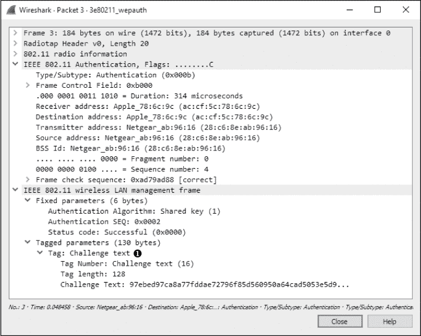

*图 13-11：WAP 向无线客户端发出挑战文本。*

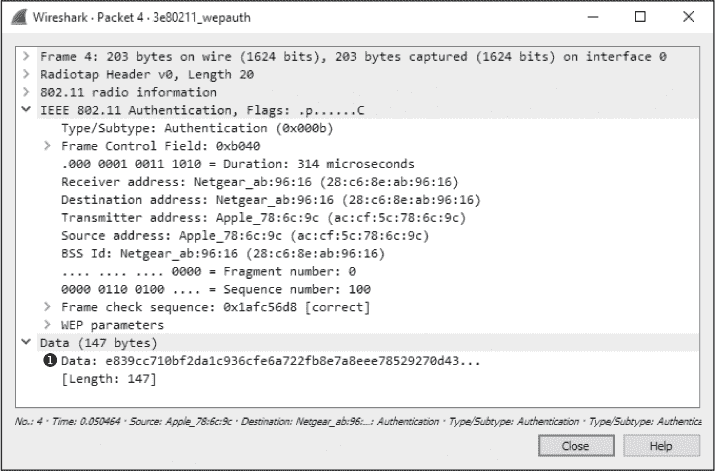

*图 13-12：无线客户端将未加密的挑战文本返回给 WAP。*

WAP 在数据包 5 中响应无线客户端，如图 13-13 所示。响应中包含通知，表明认证过程已成功完成 ➊。


*图 13-13：WAP 提醒客户端认证成功。*

最后，在认证成功后，客户端可以传输关联请求，接收确认，并完成连接过程，如图 13-14 所示。


*图 13-14：认证过程后跟随简单的两数据包关联请求和响应。*

#### ***WEP 认证失败***

*3e80211_WEPauthfail.pcapng.*

在我们的下一个示例中，用户输入 WEP 密钥以连接到 WAP。几秒钟后，无线客户端工具报告无法连接到无线网络，但没有告知原因。生成的文件是*3e80211_WEPauthfail.pcapng*。

与成功的尝试一样，此通信始于 WAP 在数据包 3 中向无线客户端发送挑战文本。在数据包 4 中，无线客户端使用用户提供的 WEP 密钥发送其响应。

此时，我们预计会看到认证成功的通知，但在数据包 5 中看到的是不同的内容，如图 13-15 所示 ➊。

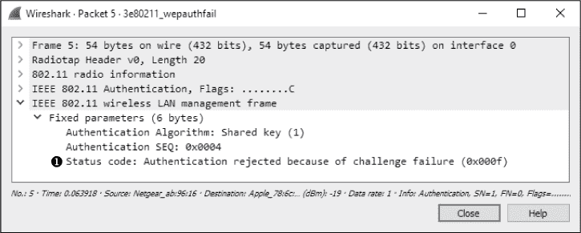

*图 13-15：此消息告诉我们认证未成功。*

此消息告诉我们，无线客户端对挑战文本的响应不正确，提示客户端用于解密文本的 WEP 密钥也必定是错误的。因此，连接过程失败。必须使用正确的 WEP 密钥重新尝试连接。

#### ***WPA 认证成功***

*3e80211_WPAauth.pcapng*

WPA 使用与 WEP 完全不同的认证机制，但它仍然依赖用户在无线客户端中输入密钥以连接到网络。一个成功的 WPA 认证示例可以在文件*3e80211_WPAauth.pcapng*中找到。

该文件的第一个数据包是来自 WAP 的信标广播。展开该数据包的 802.11 头部，查看标签参数，并展开“Vendor Specific”标题，如图 13-16 所示。你应该能看到一个部分，专门用于显示 WAP 的 WPA 属性 ➊。这可以让我们知道 WAP 支持的 WPA 版本和实现情况（如果有的话）。


*图 13-16：这个信标让我们知道 WAP 支持 WPA 认证。*

一旦信标被接收，无线客户端（ac:cf:5c:78:6c:9c）在数据包 2 中广播一个探测请求，该请求被 WAP（28:c6:8e:ab:96:16）接收，并在数据包 3 中作出回应。之后，认证和关联请求与响应在数据包 4 到 7 之间生成。这些类似于我们在早期 WEP 示例中看到的认证和关联数据包，但此时没有挑战和响应发生。那个交换接下来会发生。

真正开始加速的时刻是在数据包 8。此时 WPA 握手开始，持续到数据包 11。在握手过程中，WPA 的挑战和响应发生，如图 13-17 所示。

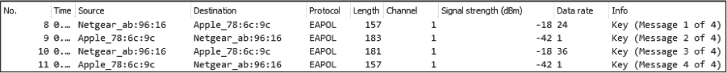

*图 13-17：这些数据包是 WPA 握手的一部分。*

有两个挑战和响应。每个可以根据 802.1x 身份验证头下的重放计数器字段互相匹配，如图 13-18 所示。注意，前两个握手数据包的重放计数器值为`1` ➊，而后两个握手数据包的重放计数器值为`2` ➋。

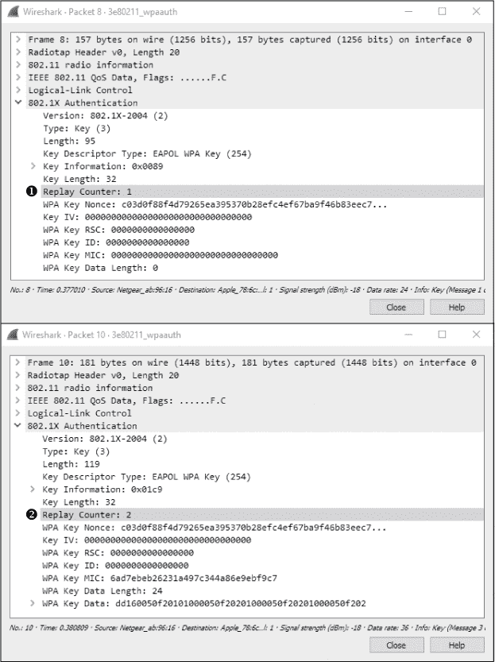

*图 13-18：重放计数器字段帮助我们配对挑战和响应。*

在 WPA 握手完成且认证成功后，数据开始在无线客户端和 WAP 之间传输。

**注意**

*这个示例来自于使用 TKIP 加密的 WPA 的 WAP。TKIP 只是 WLAN 上加密数据的一种方法。还有许多其他类型的加密，不同的接入点将支持不同的技术。使用不同加密方法或 WPA 版本的 WAP，在数据包层面上可能会表现出不同的特征。你可以阅读与所使用技术相关的 RFC 文档，以便更好地解读连接序列应如何呈现。*

#### ***WPA 认证失败***

*3e80211_WPAauthfail.pcapng*

与 WEP 类似，我们将看看当用户输入 WPA 密钥并且无线客户端工具报告无法连接到无线网络，但没有指示问题时发生了什么。生成的文件是*3e80211_WPAauthfail.pcapng*。

捕获文件的开始方式与显示成功 WPA 认证的文件相同，并包括探测、认证和关联请求。WPA 握手从第 8 个数据包开始，但在这种情况下，握手数据包有八个，而不是我们在成功认证尝试中看到的四个。

数据包 8 和 9 代表 WPA 握手中看到的前两个数据包。然而，在这种情况下，客户端发送回 WAP 的挑战文本是不正确的。因此，序列在数据包 10 和 11、12 和 13 以及 14 和 15 中重复，如图 13-19 所示。每个请求和响应可以通过重放计数器值进行配对。

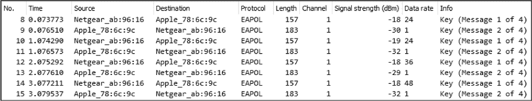

*图 13-19：此处额外的 EAPoL（局域网扩展认证协议）数据包表明 WPA 认证失败。*

一旦握手过程尝试并失败四次，通信将被中止。如图 13-20 所示，无线客户端在第 16 个数据包中从 WAP 断开认证➊。

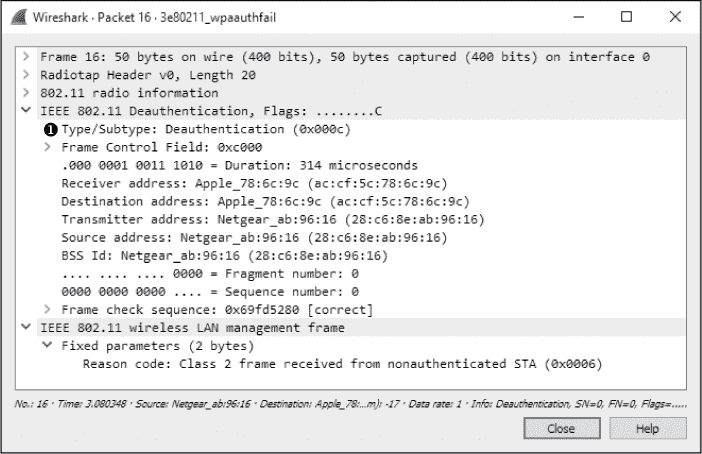

*图 13-20：在 WPA 握手失败后，客户端断开认证。*

### **最终思考**

尽管无线网络仍然被认为有些不安全，除非附加了大量额外的安全机制，否则这一担忧并没有减缓它们在各种组织环境中的部署。由于无线通信已经成为新常态，能够捕获并分析无线网络以及有线网络上的数据变得至关重要。本章所教授的技能和概念并非详尽无遗，但它们应该为理解使用数据包分析进行无线网络故障排除的复杂性提供一个起点。
