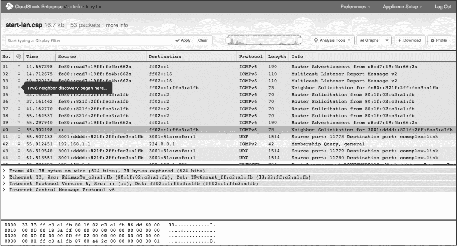
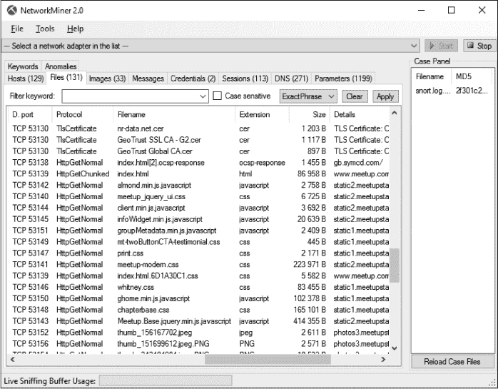
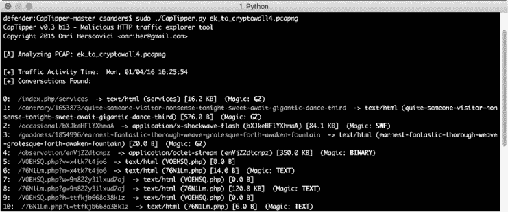

## A

**进一步阅读**

虽然本书中您主要使用的工具是 Wireshark，但在进行数据包分析时，无论是进行一般故障排除、网络慢速、安全问题还是无线网络问题，许多其他工具都会派上用场。本附录列出了一些有用的数据包分析工具和其他学习资源。

### 数据包分析工具

让我们来看看我发现的一些有用的数据包分析工具。

#### *CloudShark*

CloudShark（由 QA Café 开发）是我最喜欢的用于存储、索引和排序数据包捕获的工具。CloudShark 是一个商业的 Web 应用程序，作为一个数据包捕获库，允许您为数据包捕获添加标签以便快速引用，并在捕获文件中添加注释。它甚至提供了一些类似于 Wireshark 的分析功能（图 A-1）。

*图 A-1：用 CloudShark 查看示例捕获文件*

如果您或您的组织维护大量的数据包捕获，或者像我一样总是丢失文件，那么 CloudShark 可以帮忙。我在我的网络中部署了 CloudShark，并用它来存储和组织这本书中的所有数据包捕获。您可以在 *[`www.cloudshark.org/`](https://www.cloudshark.org/)* 了解更多关于 CloudShark 的信息。

#### *WireEdit*

您可能需要创建特定格式的数据包来支持入侵检测系统测试、渗透测试或网络软件开发。一种选择是重新创建一个生成所需数据包的场景，但这样做可能会非常耗时。另一种方法是找到一个相似的数据包，并手动编辑它以满足您的需求。我最喜欢的工具是 WireEdit，这是一款图形化工具，允许您编辑数据包中的特定值。它的用户界面非常直观，类似于 Wireshark。WireEdit 甚至会重新计算数据包的校验和，以确保您的数据包在 Wireshark 中打开时不会显示为无效。您可以在 *[`wireedit.com/`](https://wireedit.com/)* 了解更多关于 WireEdit 的信息。

#### *Cain & Abel*

在第二章中讨论的 Cain & Abel 是一个相当不错的 Windows 工具，用于 ARP 缓存中毒。Cain & Abel 实际上是一个功能非常强大的工具套件，您肯定还能找到其他用途。它可以从 *[`www.oxid.it/cain.html`](http://www.oxid.it/cain.html)* 下载。

#### *Scapy*

Scapy 是一个非常强大的 Python 库，您可以在其环境中通过命令行脚本创建和操作数据包。简单来说，Scapy 是目前最强大且灵活的数据包构建应用程序。您可以在 *[`www.secdev.org/projects/scapy/`](http://www.secdev.org/projects/scapy/)* 阅读更多关于 Scapy 的信息，下载它，并查看示例 Scapy 脚本。

#### *TraceWrangler*

数据包捕获包含了关于你的网络的大量信息。如果你需要与供应商或同事共享网络中的数据包捕获，可能不希望他们看到这些信息。TraceWrangler 通过提供匿名化不同类型地址的功能，帮助解决这个问题。它还有一些其他功能，比如编辑和合并捕获文件，但我主要用它来进行数据包捕获的消毒处理。你可以在 *[`www.tracewrangler.com/`](https://www.tracewrangler.com/)* 下载 TraceWrangler。

#### *Tcpreplay*

每当我有一组需要重新传输的数据包，以查看设备对其反应时，我就使用 Tcpreplay。这个工具专门用于重新传输数据包捕获文件中的数据包。你可以从 *[`tcpreplay.synfin.net/`](http://tcpreplay.synfin.net/)* 下载它。

#### *NetworkMiner*

NetworkMiner 是一款主要用于网络取证的工具，但我发现它在许多其他场合也非常有用。虽然它可以用来捕获数据包，但它的真正优势在于解析数据包捕获文件。NetworkMiner 会将 PCAP 文件拆解成检测到的操作系统和主机之间的会话。它甚至允许你直接从捕获中提取传输的文件（图 A-2）。所有这些功能在免费版本中都可以使用；商业版则提供了一些其他有用的功能，如执行操作系统指纹识别、将结果与白名单进行对比，以及提高数据包捕获处理的速度。NetworkMiner 可以免费下载，网址是 *[`www.netresec.com/?page=NetworkMiner`](http://www.netresec.com/?page=NetworkMiner)*。

*图 A-2: 使用 NetworkMiner 检查数据包捕获中的文件*

#### *CapTipper*

我希望你在本书中学到的一件事是，找到所需的答案通常涉及以不同的方式查看相同的数据。CapTipper 是一款专为分析恶意 HTTP 流量的安全从业人员设计的工具（见 图 A-3）。它提供了一个功能丰富的 shell 环境，允许用户互动式地探索个别会话，以找到重定向、文件对象和恶意内容。它还提供了一些方便的功能，帮助与发现的数据进行交互，包括提取压缩数据和将文件哈希提交到 VirusTotal。你可以在 *[`www.github.com/omriher/CapTipper/`](https://www.github.com/omriher/CapTipper/)* 下载 CapTipper。

*图 A-3: 使用 CapTipper 分析基于 HTTP 的恶意软件传输*

#### *ngrep*

如果你熟悉 Linux，肯定用过 grep 来搜索数据。ngrep 类似，它允许你对数据包捕获数据进行非常具体的搜索。当捕获和显示过滤器无法完成任务或者变得过于复杂时，我通常会使用 ngrep。你可以在*[`ngrep.sourceforge.net/`](http://ngrep.sourceforge.net/)*上了解更多关于 ngrep 的信息。

#### *libpcap*

如果你打算进行高级数据包解析或创建处理数据包的应用程序，你将会非常熟悉 libpcap。简而言之，libpcap 是一个用于网络流量捕获的可移植 C/C++库。Wireshark、tcpdump 以及大多数其他数据包分析应用程序在某种程度上都依赖于 libpcap 库。你可以在*[`www.tcpdump.org/`](http://www.tcpdump.org/)*上了解更多关于 libpcap 的信息。

#### *Npcap*

Npcap 是 Nmap 项目为 Windows 开发的数据包嗅探库，基于 WinPcap/libpcap。报告显示，它在捕获数据包时能够提升性能，并提供额外的安全功能，限制数据包捕获仅对管理员开放，并利用 Windows 用户账户控制。Npcap 可以作为 WinPCap 的替代品安装，并与 Wireshark 一起使用。你可以在这里了解更多信息：*[`www.github.com/nmap/npcap/`](https://www.github.com/nmap/npcap/)*

#### *hping*

hping 是一个非常多功能的工具，值得拥有。hping 是一个命令行数据包创建、编辑和传输工具。它支持多种协议，并且使用起来非常快速和直观。你可以从*[`www.hping.org/`](http://www.hping.org/)*下载 hping。

#### *Python*

Python 不是一款工具，而是一种值得一提的脚本语言。当你熟练掌握数据包分析时，你会遇到没有现成的自动化工具能够满足你需求的情况。在这些情况下，Python 是制作能够处理数据包并实现有趣功能的工具的首选语言。你还需要学一些 Python 来与 Scapy 库进行交互。我最喜欢的在线学习 Python 的资源是流行的*Learn Python the Hard Way*系列，你可以在这里找到它：*[`www.learnpythonthehardway.org/`](https://www.learnpythonthehardway.org/)*

### 数据包分析资源

从 Wireshark 首页到课程和博客，许多关于数据包分析的资源都可以找到。我将在这里列出我最喜欢的一些资源。

#### *Wireshark 首页*

关于 Wireshark 的所有资源中，最重要的就是它的首页，*[`www.wireshark.org/`](http://www.wireshark.org/)*。这里有软件文档的链接、一个非常有用的 Wiki，包含示例捕获文件，以及 Wireshark 邮件列表的注册信息。你也可以访问*[`ask.wireshark.org/`](https://ask.wireshark.org/)*，在那里可以询问你在 Wireshark 中看到的内容或特定功能。这个社区非常活跃且乐于助人。

#### *实用的数据包分析在线课程*

如果你喜欢这本书，你可能也会喜欢与之配套的在线培训课程。在《实用数据包分析》课程中，你可以通过视频跟随我一起分析本书及其他几本书中的所有数据包。我还提供了数据包实验室，你可以在其中测试你的技能，还有一个讨论论坛，帮助你在学习过程中与其他学生互动。这门课程将在 2017 年中推出。你可以在* [`www.chrissanders.org/training/`](http://www.chrissanders.org/training/)*了解我的培训内容，并注册我的邮件列表，获取培训机会的通知，地址是： *[`www.chrissanders.org/list/`](http://www.chrissanders.org/list/)*。

#### *SANS 的安全入侵检测深入课程*

SANS SEC503：入侵检测深入课程专注于数据包分析的安全方面。即使你不专注于安全，课程的前两天也能为你提供一个出色的数据包分析和 tcpdump 介绍。该课程每年在全球多个地点的现场活动中举办多次。

你可以在 *[`www.sans.org/`](http://www.sans.org/)* 了解更多关于 SEC503 和其他 SANS 学院课程的信息。

#### *Chris Sanders 的博客*

我偶尔会撰写与数据包分析相关的文章，并将其发布在我的博客上，地址是 *[`www.chrissanders.org/`](http://www.chrissanders.org/)*。我的博客也是一个门户，链接到我写的其他文章和书籍，并提供我的联系信息。你还会找到本书及其他书籍中包含的数据包捕获链接。

#### *Brad Duncan 的恶意软件流量分析*

我最喜欢的与安全相关的数据包捕获资源是 Brad Duncan 的恶意软件流量分析（MTA）网站。Brad 每周多次发布包含真实感染链的数据包捕获。这些数据包完整地包含相关的恶意软件二进制文件，并附有描述发生了什么的说明。如果你想获得分析恶意软件感染的经验，并了解当前的恶意软件技术，可以从下载一些这些数据包并尝试理解它们开始。你可以访问 MTA 网站 *[`www.malware-traffic-analysis.net/`](http://www.malware-traffic-analysis.net/)*，或者在 Twitter 上关注 Brad @malware_traffic，及时获得他的更新提醒。

#### *IANA 的网站*

互联网号码分配局（IANA），网址为 *[`www.iana.org/`](http://www.iana.org/)*，负责北美的 IP 地址分配和协议号码分配。它的网站提供了一些有价值的参考工具，例如查找端口号、查看与顶级域名相关的信息，并浏览配套网站以查找和查看 RFC。

#### *W. Richard Stevens 的 TCP/IP 图解系列*

被大多数人视为 TCP/IP 圣经的 W·理查德·史蒂文斯的*《TCP/IP 插图》*系列（Addison-Wesley，1994-1996）是大多数在数据包层面工作的人书架上的必备书籍。这些是我最喜欢的 TCP/IP 书籍，在写这本书时，我参考了这些书籍很多。与 Keven R. Fall 博士合著的第一卷第二版于 2012 年出版。

#### *TCP/IP 指南*

查尔斯·科齐耶罗克的*《TCP/IP 指南》*（No Starch Press，2005）是另一本有关 TCP/IP 协议信息的参考资源。全书超过 1600 页，非常详细，并包含许多适合视觉学习者的精彩图表。
