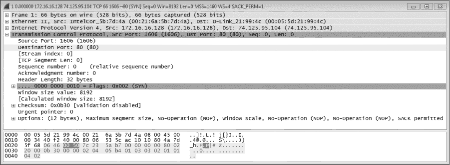
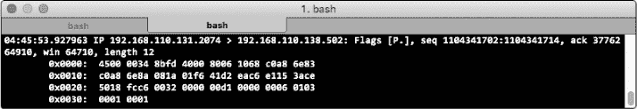
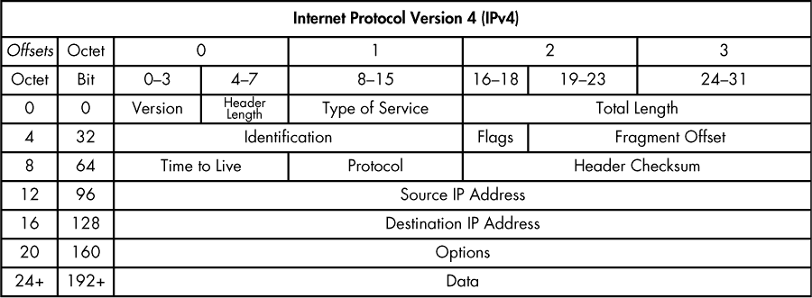
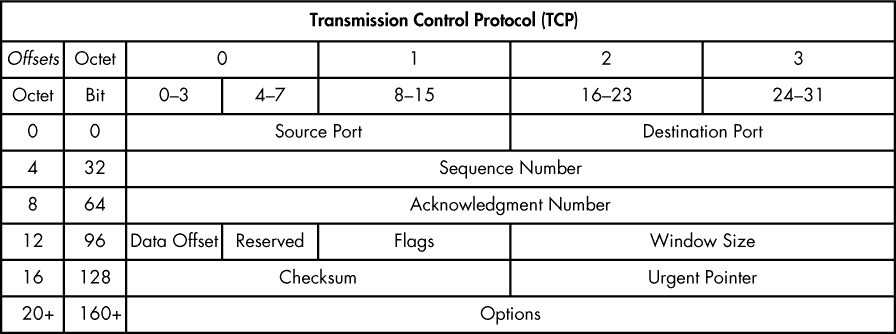
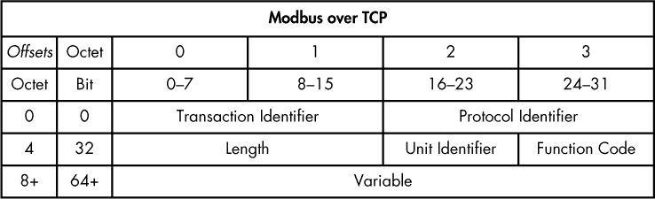

## **B**

**数据包导航**


在本附录中，我们将研究数据包的表示方式。我们将查看完全解释的表示法和十六进制表示法，以及如何使用数据包图解来读取和引用数据包值。

因为你会发现有大量的软件可以为你解释数据包信息，你可以在不理解本附录内容的情况下进行数据包嗅探和分析。但是，如果你花时间学习数据包数据及其结构，你将能够更好地理解像 Wireshark 这样的工具展示给你的内容。你和正在分析的数据之间的抽象越少，效果就越好。

### **数据包表示**

数据包可以通过多种方式进行表示。原始数据包数据可以表示为二进制，即由 1 和 0 组成的 2 进制，例如：

```
0110000001010011010111000000101011000001000000000001000000000000001000110000010
110101011011100000000000000000000000000000000000000000010000001000000000001011
0110100000000000001000000110000000000000000000000010000000100000000010000000010
```

二进制数字表示数字信息的最低层级，其中 1 代表电信号的存在，0 代表信号的缺失。每个数字是一个比特（bit），八个比特组成一个字节（byte）。然而，二进制数据对人类来说很难阅读和解释，所以我们通常将二进制数据转换为十六进制，这是一个由字母和数字组成的 16 进制系统。同一个数据包在十六进制下是这样的：

```
4500 0034 40f2 4000 8006 535c ac10 1080
4a7d 5f68 0646 0050 7c23 5ab7 0000 0000
8002 2000 0b30 0000 0204 05b4 0103 0302
0101 0402
```

*十六进制*（也称为 hex）是一种数字系统，使用数字 0 到 9 和字母 A 到 F 来表示值。它是数据包表示中最常见的方式之一，因为它简洁，并且可以方便地转换为更基础的二进制表示。在十六进制中，两个字符表示一个字节，字节包含八个比特。字节中的每个字符是一个 *半字节*（nibble，4 个比特），最左侧的值是 *高位半字节*，最右侧的值是 *低位半字节*。以示例数据包为例，这意味着第一个字节是 45，其中高位半字节是 4，低位半字节是 5。

数据包中字节的位置采用偏移量表示，从零开始。因此，数据包中的第一个字节（45）位于位置 0x00，第二个字节（00）位于位置 0x01，第三个字节（00）位于位置 0x02，依此类推。0x 前缀表示使用了十六进制表示法。当引用跨越多个字节的位置时，额外字节的数量会在冒号后面用数字表示。例如，要引用示例数据包（4500 0034）中的前四个字节的位置，可以使用 0x00:4。这种解释在我们使用数据包图解来解析未知协议时会非常重要，参考资料见《数据包导航》中 第 330 页。

**注意**

*我在分析数据包时看到的最常见错误是忘记从零开始计数。这很难适应，因为大多数人都被教导从一开始计数。我已经切割和解析数据包好多年了，我仍然会犯这个错误。我能给出的最佳建议是*不要害怕用手指计数*。你可能觉得这样做看起来很傻，但完全没有羞耻感，尤其是当它帮助你得出正确答案时。*

在更高的层次上，像 Wireshark 这样的工具可以通过使用协议解析器以完全解析的方式表示数据包，接下来我们将讨论这一点。我们刚刚看到的同一个数据包在图 B-1 中已经被 Wireshark 完全解析。



*图 B-1：Wireshark 解析的数据包*

Wireshark 通过标签显示数据包中的信息，这些标签用于描述数据包。数据包本身并不包含标签，但它们的数据会映射到由协议标准指定的精确格式。完全解析一个数据包意味着根据协议标准读取数据并将其拆解成标注的、易于理解的文本。

Wireshark 和类似工具之所以能够完全解析数据包数据，是因为它们内置了协议解析器，这些解析器定义了协议中每个字段的位置、长度和取值。例如，图 B-1 中的数据包是根据传输控制协议（TCP）拆解的。在 TCP 内部，有带标签的字段和值。源端口是一个标签，1606 是它的十进制值。这使得在进行分析时，能够轻松找到你要查找的信息。每当这个选项对你可用时，通常是完成工作的最有效方式。

Wireshark 有成千上万的解析器，但你可能会遇到一些 Wireshark 无法解析的协议。这通常发生在那些不广泛使用的厂商特定协议或自定义恶意软件协议上。当这种情况发生时，你将只得到部分解析的数据包。这就是为什么 Wireshark 默认在屏幕底部提供原始十六进制数据包数据（见图 B-1）。

更常见的是，像 tcpdump 这样的命令行程序显示原始十六进制数据时，并没有太多的解析器。对于更复杂的应用层协议尤其如此，这些协议更难解析。因此，在使用此工具时，遇到部分解析的数据包是常见的现象。使用 tcpdump 的一个示例如图 B-2 所示。

当你处理部分解析的数据包时，你需要依赖于更基本层次的包结构知识。Wireshark、tcpdump 和大多数其他工具都能通过以十六进制格式显示原始数据包数据来实现这一点。



*图 B-2：来自 tcpdump 的部分解析数据包*

### **使用数据包图解**

如我们在第一章中所学，数据包代表根据协议规则格式化的数据。由于常见协议以特定的方式格式化数据包数据，使得硬件和软件能够解释这些数据，因此数据包必须遵循明确的格式规则。我们可以通过使用数据包图来识别这种格式，并利用它来解释数据包数据。*数据包图*是数据包的图形表示，允许分析师将数据包中的字节映射到任何给定协议使用的字段。它源自协议的 RFC 规范文档，显示协议中存在的字段、字段长度及其顺序。

让我们再看看在第七章中看到的 IPv4 示例数据包图（为方便起见，提供在图 B-3 中）。



*图 B-3：IPv4 的数据包图*

在此图中，横轴表示从 0 到 31 的单独二进制位。位被分组为 8 位字节，编号从 0 到 3。纵轴也根据位和字节进行标注，每一行被划分为 32 位（或 4 字节）部分。我们通过首先从纵轴读取，确定字段所在的 4 字节部分，然后使用横轴按偏移量符号数出每个字节，来使用这些轴来计数字段的位置。第一行包含前四个字节，即字节 0 到 3，这些字节在横轴上标注相应的数字。第二行包含接下来的四个字节，即字节 4 到 7，也可以使用横轴来计数。从字节 4 开始，它是横轴上的字节 0，然后是字节 5，对应横轴上的字节 1，依此类推。

例如，我们可以确定对于 IPv4，字节 0x01 是服务类型字段，因为我们从偏移量 0 开始，然后数到字节 1。在纵轴上，前四个字节位于第一行，因此我们将使用横轴从 0 开始数到字节 1。另一个例子是字节 0x08 是生存时间字段。使用纵轴，我们确定字节 8 位于第三行，该行包含字节 8 至 11。然后我们使用横轴从 0 开始数到字节 8。由于字节 8 是该部分中的第一个字节，因此横轴列为 0，即生存时间字段。

一些字段，比如源 IP 字段，跨越多个字节，正如我们在 0x12:4 中看到的那样。其他字段则被划分为半字节。一个例子是 0x00，其中包含了版本字段的高位半字节和 IP 头部长度的低位半字节。字节 0x06 则包含了更细粒度的内容，使用单独的比特来表示特定的字段。当一个字段是单一的二进制值时，它通常被称为*标志*。例如，IPv4 头部中的保留字段、禁止分段字段和更多分段字段。一个标志只能有二进制值 1（真）或 0（假），因此当值为 1 时，标志被“设置”。标志设置的确切含义将根据协议和字段的不同而有所变化。

让我们看一下图 B-4 中的另一个示例（你可能会认出这个图来自第八章）。



*图 B-4：TCP 数据包图*

这张图展示了 TCP 头部。通过查看这张图，我们可以回答很多关于 TCP 数据包的问题，而不需要确切了解 TCP 的工作原理。考虑一下这里以十六进制表示的一个示例 TCP 数据包头：

```
0646 0050 7c23 5ab7 0000 0000 8002 2000
0b30 0000 0204 05b4 0103 0302 0101 0402
```

使用数据包图，我们可以定位并解释特定的字段。例如，我们可以确定以下内容：

•     源端口号位于 0x00:2，十六进制值为 0646（十进制：1606）。

•     目标端口号位于 0x02:2，十六进制值为 0050（十进制：80）。

•     头部长度位于数据偏移字段中的高位半字节 0x12，十六进制值为 8。

让我们通过解析一个神秘数据包来应用这些知识。

### **解析神秘数据包**

在图 B-2 中，我给你展示了一个仅部分解析的数据包。你可以通过解析的部分数据得知，这是一个在同一网络上两个设备之间传输的 TCP/IP 数据包，但除此之外，你对传输的数据并不了解。以下是数据包的完整十六进制输出：

```
4500 0034 8bfd 4000 8006 1068 c0a8 6e83
c0a8 6e8a 081a 01f6 41d2 eac6 e115 3ace
5018 fcc6 0032 0000 00d1 0000 0006 0103
0001 0001
```

快速统计后发现，这个数据包有 52 字节。IP 数据包图告诉我们，IP 头部的正常大小是 20 字节，这可以通过查看 0x00 的低位半字节中的头部大小值来确认。TCP 头部的数据包图告诉我们，如果没有额外选项（这里没有，我们将在第八章中更深入地讨论 TCP 选项），它的大小也是 20 字节。这意味着输出的前 40 字节与已经解析的 TCP 和 IP 数据相关。剩下的 12 字节是未解析的。

```
00d1 0000 0006 0103 0001 0001
```

如果没有了解如何解析数据包的知识，这可能会让你感到困惑，但现在你知道如何将数据包图解应用于未解释的字节。在这种情况下，解释后的 TCP 数据告诉我们该数据的目标端口是 502。回顾流量使用的端口并不是识别未解释字节的万无一失的方法，但它是一个很好的起点。快速的 Google 搜索显示端口 502 最常用于 TCP 上的 Modbus，这是一个在工业控制系统（ICS）网络中使用的协议。我们可以通过将十六进制输出与 Modbus 的数据包图解进行比较来验证这一点，如 图 B-5 所示。



*图 B-5：Modbus over TCP 数据包图解*

该数据包图解是基于 Modbus 实现指南中的信息创建的： *[`www.modbus.org/docs/Modbus_Messaging_Implementation_Guide_V1_0b.pdf`](http://www.modbus.org/docs/Modbus_Messaging_Implementation_Guide_V1_0b.pdf)*。这告诉我们应该有一个包含在 0x04:2 位置（相对于头部开始处）的长度字段的 7 字节头部。数到该位置时，我们得到了十六进制值 0006（或十进制值 6），这表明该字段后应该有 6 个字节，情况确实如此。看起来这确实是 Modbus over TCP 数据。

通过将数据包图解与完整的十六进制输出进行比较，可以得出以下信息：

•     事务标识符位于 0x00:2，并具有 00d1 的十六进制值。此字段用于将请求与响应配对。

•     协议标识符位于 0x02:2，并具有 0000 的十六进制值。这标识该协议为 Modbus。

•     长度位于 0x04:2，并具有 0006 的十六进制值。这定义了数据包的长度。

•     单元标识符位于 0x06，并具有十六进制值 01。用于系统内部路由。

•     功能代码位于 0x07，并具有 03 的十六进制值。这是读取保持寄存器功能，用于从系统中读取数据值。

•     基于功能代码值为 3，预计会有两个数据字段。参考号和字计数位于 0x08:4，每个字段的十六进制值为 0001。

现在，可以在 Modbus 协议的上下文中完全解释这个神秘的数据包。如果你正在排查负责该数据包的系统，这些信息应该就是你继续进行的全部所需。即使你从未遇到过 Modbus，这也是如何使用数据包图解来处理未知协议和未解释数据包的一个例子。

最好的做法是时刻意识到自己与正在分析的数据之间的抽象层次。这有助于你做出更合理、更有知识依据的决策，并能在各种情境中处理数据包。我自己就曾多次只能使用基于命令行的工具，如 tcpdump，来分析数据包。由于这些工具大多缺乏对许多第七层协议的解析，因此能够手动解析数据包中的特定字节变得至关重要。

**注意**

*有位同事曾经在一个高度安全的环境中帮助进行事件响应。他被允许查看需要分析的数据，但不能访问存储数据的具体系统。在他们拥有的时间内，他们唯一能做的事情就是打印出特定对话的包。多亏了他对数据包构建方式和如何浏览它们的基本知识，他能够在打印出的数据中找到所需的信息。当然，这个过程比冷糖浆顺着冰冻的树枝流下来还要慢。这是一个极端的例子，但它是为什么普遍的、与工具无关的知识如此重要的最佳证明。*

基于上述原因，花时间拆解数据包，以获得查看多种解读的经验，是非常有帮助的。我自己做得足够多，以至于打印出了几种常见的数据包图示，并将它们塑封，放在桌子旁边。我还在我的笔记本和手机上保留了数字版本，以便在旅行时快速查阅。为了方便起见，我已将几种常见的数据包图示包含在与本书相关的 ZIP 文件中，该文件包含了数据包捕获内容（* [`www.nostarch.com/packetanalysis3/`](https://www.nostarch.com/packetanalysis3/)*）。

### **总结思考**

在本附录中，我们学习了如何以多种格式解读数据包数据，并且如何使用数据包图示来浏览未解读的数据包。掌握了这些基本知识后，无论你使用什么工具来查看数据包数据，都应该能够顺利地解剖数据包。
