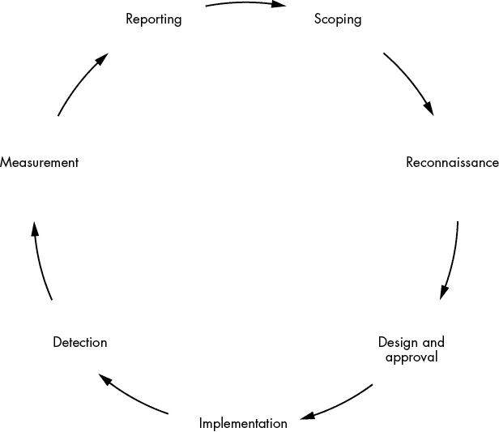
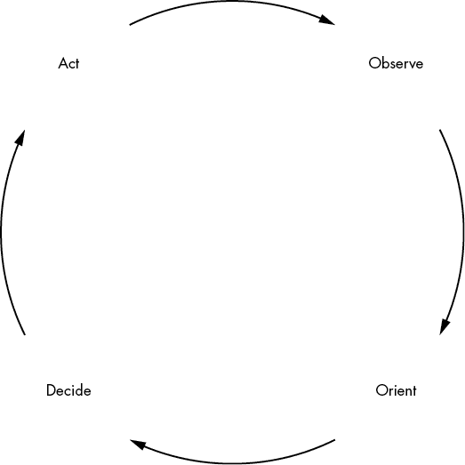

# 第三章：准备攻击

> 只要一个人全力以赴地说出最离谱的谎言，总会有人相信。
> 
> ——马克·吐温，《*Alta California*》报纸致旧金山信件，1867 年

执行社会工程学攻击带来的快感是无与伦比的。但在我们执行这些攻击之前，我们需要定义一个完成攻击的过程。如果不这样做，我们可能会陷入法律麻烦，甚至更糟，可能会损害目标的心理健康。框架在这时就发挥作用了。

本章将向你介绍一种与客户协调、确定（并遵守）任务范围的过程。我们还将介绍两个与执行开放源情报（OSINT）和社会工程学相关的过程——社会工程学框架和 OSINT OODA（观察-定位-决策-行动）循环——并讨论你可以使用的操作系统。

## 与客户协调

准备攻击的第一步是与客户协调，无论他们是付费客户、你的经理，还是公司内的其他团队。即使你已经完成了初步的范围界定过程，也不要犹豫，继续询问与工作执行相关的问题。你的刑事记录和生计可能处于危险之中，因此要确保你明确知道自己被允许做什么，和不被允许做什么。

### 范围界定

在*范围界定*阶段，你必须与客户合作，确定你的任务将如何执行。这包括确定你的联系人是谁，以及时间上的考虑因素（例如预算中的工作小时数；执行测试的具体时间（如一天中的某个时段、一周或一个月中的特定时间）；以及你不被授权进行测试的*黑客期间*）。你还应讨论法律问题，确保合同中包含能保护你免于法律问题的条款。因此，聘请律师是明智的选择。你需要的文字表述应能保护你免受天灾、自然灾害及其他不可预见情况的影响。最后，讨论任务的规模，比如需要拨打的电话数量或发送邮件的目标数量。

你和你的客户应当在*工作说明书（SOW）*中记录范围界定阶段的结果，这是合同中明确规定你在任务中被授权和未授权执行的事项的部分。确保 SOW 明确列出适当的任务规则。它应详细说明任何受限或要求的前提、源邮件地址、源或目的地 IP 地址以及其他与任务相关的约束或要求。同时，确保合同和 SOW 中提到你的名字。如果可能，最好列出所有测试人员的名字，以及你所工作的公司。

在定义范围时，确保你的社会工程测试符合特定要求。除了其他问题外，确保你拥有执行社会工程的适当授权和法律保护，并且签署合同的人有权授权你进行这些活动。如果你是公司内部员工进行测试，请确保获得书面授权。确保你拥有适当的*差错与遗漏（E&O）*保险，以便在法律上保护自己。E&O 保险也叫做*专业责任保险（PII）*或*专业责任保险（PLI）*，旨在保护你免于承担民事法院中防御过失索赔的全部费用。

范围定义阶段为整个任务设定了基调。如果没有正确地定义范围，可能会给双方带来相当大的麻烦。它可能会使任务变得不必要地复杂，导致你在后期花费更多时间进行电话沟通，或是执行不当的工作。如果公司认为你不专业，这也可能对你的声誉造成伤害。对于可重复的过程，请参考附录 A 中的范围定义工作表，工作表可以帮助你提出适当的问题，确保你收集到所需的所有信息。

### 定义目标

签署合同并制定 SOW（工作说明书）后，与客户讨论任务目标。这次测试是用于为公司增加防御措施（例如新的产品或技术）提供依据吗？还是用于评估人力资本需求？这次测试仅仅是为了满足合规要求吗？或者客户将其用来评估安全团队（例如，作为绩效评估的一部分，或是决定加薪的依据）？这些问题的答案不应该影响你如何执行任务，但它们应该帮助你了解预期的情况，并指导你如何构建沟通框架。

### 定义方法

你使用的方法是决定任务成败的关键因素。你会使用*打字错误*或*域名抢注*吗？换句话说，你会使用一个与客户相似的域名，但包含打字错误（如果正确拼写容易被拼错，这种策略尤其有效），还是会购买一个相同名称、不同顶级域名（例如，使用*nostarch.us*代替合法的*nostarch.com*）的域名？你会冒充供应商、客户还是合作伙伴？你会吸引恶意文档的下载，还是仅仅收集凭证？你会将*vish*和*phish*结合使用吗？客户希望你使用自动化解决方案，还是应该像我们在第七章中讨论的那样，进行更为手动的操作？

了解你的客户使用的技术和你要攻击的目标向量，将是成功实施的关键因素。为了超越常规，找出你是否能公开列举出公司的技术，然后在实施前自己完成这项工作。这种方法达成了两个目的：它为客户提供了一种检测和可能归因任何攻击的方法，同时也验证了客户是否充分实施了他们的技术。这一成果能为你的客户提供实质性的价值。

## 构建成功的借口

在构建借口时，尽量找出目标环境中可能被利用的当前事件。你可以声称自己是目标组织的云服务或电子邮件提供商，因“安全事件”需要额外的信息。你还可以查看本地社交媒体页面和群组，收集更多的开源情报（OSINT）关于这些事件。Facebook 和 Twitter 是寻找和列举此类信息的好资源，特别是当某个话题标签与事件相关联时。

如果有足够的时间，获取一些当地报纸的副本。如果你离目标地点足够近，可以走一趟城里，查看是否有传单或横幅在宣传这些事件。目标之间是否有共同的兴趣或目标？是否有员工喜欢远足、跑步、像斯巴达挑战赛（Spartan Race）、硬汉挑战赛（Tough Mudder）或铁人三项（Iron Man/Woman）等障碍赛？该组织是否有保龄球队或垒球队？如果有，他们参加的是哪个联赛，在哪儿比赛？他们的对手是谁？

这里提到的考虑因素将使你的网络钓鱼攻击与一般的攻击有所不同，使其成为国家级的威胁。花时间了解你的目标及其周围环境将极大地提高你的成功率，但务必确保你通过报告中分享这些提示，并在基于你的结果进行的任何培训中传递这些价值。

根据你收集到的信息，构建你的场景和借口。将前三到五个展示给客户，让他们选择一个你要使用的。如果可能的话，确认一个执行攻击的时间范围，但不是确切时间。这能让客户保持警觉，并且给你带来出其不意的效果。

尽管不应该让客户向员工透露你选择的场景，我遇到过类似的情况。在某次相关的合作中，客户限制了可能的借口和场景，然后规定了我可以发送网络钓鱼邮件和进行电话钓鱼（vishing）呼叫的确切时间。警告是：如果我因某种原因被要求回电，我可以在没有进一步同意的情况下进行。

幸运的是，我利用了这个警告并把它变成了我的优势。当我打电话时，我制造了很多非常响亮的背景噪音并伪装成中断。在噪音和“电话断线”之间，我成功地让大约三分之二的接听者要求我回拨电话。由于我在指定时间之外回拨电话，他们的警惕性降低了，他们也比在规定的通话期间更愿意透露信息。

## 使用专用操作系统进行社会工程学

作为一名专业的社会工程师或 OSINT 收集者，拥有合适的工具是必不可少的。*Kali*——一个为渗透测试设计的 Linux 发行版，由 Offensive Security 创建和维护——自带了像 *Social-Engineer Toolkit*（*SET*）、theHarvester、Ghost Phisher、Maltego 和 Recon-ng 等工具。我们将在接下来的章节中更详细地讨论这些工具。Kali 及其附带的工具最适合用于渗透测试或涉及一般社会工程学的任务，尤其是没有进行极端 OSINT 收集的情况下，尽管也可以使用 Kali 执行高级的 OSINT 调查。

此外，加拿大非营利组织 Trace Labs 创建并积极维护了一个 Kali Linux 的分支（得到了 Offensive Security 的支持和协助），旨在帮助进行 OSINT 调查，特别是在其 Search Party 比赛中，利用 OSINT 寻找失踪人员。Trace Labs 预配置的虚拟机（VM）包含了各种 OSINT 调查工具，专注于商业和个人数据。该虚拟机可以在 [`www.tracelabs.org/trace-labs-osint-vm/`](https://www.tracelabs.org/trace-labs-osint-vm/) 免费下载。

使用不太常见的操作系统和配置也有其优势。具体来说，这样做可以让你调整环境以适应自己的偏好和舒适度。如果我在对一个可能会检测并报告我的目标进行侦察时，我不想使用我的家庭或工作网络，即便是通过可能被攻破的 VPN 连接。相反，除了使用 Offensive Security 和 Trace Labs 版本的 Kali，我还使用一个在云虚拟私人服务器（VPS）实例上运行的 Ubuntu 系统，在该系统上安装了一套定制工具，包括 SpiderFoot、Recon-ng、Metasploit、Metagoofil、theHarvester 以及一些我自己修改过的较不为人知的脚本和实用程序。该 VPS 有自己的独立 IP 地址，我可以通过创建新实例来获取新的 IP 地址，从而避免被检测到。（我已经制作并存档了该 Ubuntu 系统的镜像，所以可以根据需要生成新的副本。）我还可能通过加固 VPS 来提高其安全性——删除不必要的服务或应用程序，关闭未使用的端口，并对系统应用安全配置——并使用一个或多个 VPN 连接到它。我们将在第七章中讨论钓鱼基础设施的设置。

一些工具也可以在 Windows 上使用。还有一些是基于网页的工具（例如，Netcraft、Hacker Target 和 OSINT Framework），你主要通过网页浏览器访问它们。从 Mac 或 PC 上操作可能比在 Linux 上更方便。不过，要理解的是，如果你使用个人系统甚至是工作系统进行这些操作，更可能会被发现。只要你有进行这些类型工作的适当权限，最坏的情况是（a）被封锁，和（b）你的 IP 地址被加入到 *威胁情报库*（一个众包的恶意实体列表，或包含恶意活动或文件特征的条目，例如电子邮件地址、IP 地址、文件哈希或域名），这意味着你的潜在客户或目标可能会收到警告，称你使用的 IP 被认为是“恶意”的。使用 VPS 进行攻击可以让你只使用一次该设置，然后销毁它。

## 遵循攻击阶段

所有的道德黑客通常都会遵循一个定义好的攻击流程，以确保收集到所需的所有信息。这个过程通常包括以下步骤：侦察、扫描与枚举、获取访问权限、维持访问权限、清除痕迹和报告。你可以在[`www.cybrary.it/blog/2015/05/summarizing-the-five-phases-of-penetration-testing/`](https://www.cybrary.it/blog/2015/05/summarizing-the-five-phases-of-penetration-testing/)阅读更多关于这些阶段的内容。然而，关于社会工程，定义一个稍微不同的攻击过程更为合理。图 3-1 中的 *社会工程过程* 对渗透测试过程进行了适应，以标准化社会工程。

图 3-1：社会工程过程

过程中的每个步骤如下：

**范围界定**

1.  在社会工程过程的范围界定阶段，你需要向客户提问，以确保你拥有所需的所有信息。

**侦察**

1.  在侦察阶段，你会尝试识别公司中的关键员工；供应商、合作伙伴、供应商使用的技术；使用的域名和子域名；以及电子邮件地址和公司标准的电子邮件地址语法（例如，名字和姓氏由一个句点分隔）。一旦你签署了执行任务的合同，你可以在合同中定义的时间框架内开始侦察。除了遵守合同并按与你的时间目标一致的方式进行侦察（例如，在一个 4 小时的任务中花 12 小时收集开源情报（OSINT）关于单个目标），通常你不能收集过多的 OSINT。然而，一些组织确实保持良好的操作安全（OPSEC）：他们不使用社交媒体，或者可能采取积极措施故意在他们的账户上发布误导性或虚假的信息，以避免此类威胁。我们称这一过程为*虚假信息和欺骗*。

    第 4、5、6 章将为你提供一些执行开源情报收集的工具。请记住，尽管收集关于目标公司及其员工的足够信息很重要，但你有责任在持有数据期间保护这些数据。你应该只保留在需要时的必要信息，并且仅在法律要求的时间段内保留。

**设计与审批**

1.  你必须花时间确保你收集到的开源情报是相关的，然后以一种能帮助员工和目标组织成长与学习的方式利用这些情报。毕竟，尽管你是在尝试获得系统或信息的访问权限，你应该希望被发现，并且希望你的客户能从你的活动中学习。

    设计与审批阶段包括为你的客户提出可能的借口供其审查和批准。你需要提供借口的详细信息，你将拨打的电话号码、发送电子邮件的电子邮件地址，以及你计划开始和结束的时间。同时解释你的目标。例如，目标可能是衡量目标点击电子邮件中链接的次数，或者你可能试图从他们那里获取敏感信息，或部署恶意软件或*反向 shell 投放器*（能够让你远程连接并安装恶意软件的软件）。

**实施**

1.  在实施阶段，你需要安装和配置所有软件。这包括基础设施，如电子邮件账户、Web 服务器、启用了宏功能的 Microsoft Office 文档、恶意软件、USB 驱动器以及其他诱饵。你还可能需要访问组织的垃圾桶，并收集物品带离现场进行进一步分析。你将根据联系人批准的借口，实施钓鱼攻击、语音钓鱼攻击及在工作说明书中定义的其他攻击。

**检测**

1.  在检测阶段，防守方会尝试检测到社会工程活动，并采取措施降低其效率或影响。根据参与活动的范围，防守方可能知道也可能不知道攻击已经被授权。如果这是红队演练的一部分，他们很可能不知道。虽然这一阶段似乎不如实际攻击那样令人兴奋，但它是整个过程最为关键的一部分。记住，你的最终目标是使组织能够检测和缓解社会工程活动。

**测量**

1.  在测量阶段，你需要确定一些信息，比如有多少人受到恶作剧的影响，检测到攻击的时间有多长，受害者何时提交报告，提交了多少份报告，以及其他各种指标。分析完这些信息后，你应该将其汇编成报告提供给客户。我们将在第九章讨论测量技术。

**报告**

1.  在报告阶段，你将收集到的指标与工作说明书（SOW）、执行总结、参与情况概述，以及从开源情报收集或参与活动中得出的任何发现一起整理。你可以使用附录 B 中的模板来撰写报告。你将把这份报告呈交给客户，以供他们存档和审阅。如果你选择保存报告副本，需妥善保管此文件，因为其中的信息可能被滥用，进而攻击客户。

除了这个社会工程过程之外，你可能会发现参考*观察-定位-决策-行动（OODA）循环*对于开源情报（OSINT）收集很有帮助，这是我常用的方法。该循环如图 3-2 所示，提示你*观察*你的发现并建立假设（即*定位*阶段），然后寻找更多信息以尝试确认这些信息。

图 3-2：OODA 循环

一旦你拥有足够的数据，你就可以*决定*如何处理这些数据。你应该进行钓鱼攻击（phishing）还是语音钓鱼攻击（vishing），或者你是否需要更多信息才能成功？你是否拥有足够的信息来进行渗透测试或红队活动，并保持适当的隐蔽性？然后，根据这些决策的结果，你采取行动。

行动阶段可能包括执行攻击或撰写报告（如果客户只需要开源情报），也可能触发更多 OODA 循环的迭代。在这里没有对错之分，取决于你的目标和与你客户达成协议中的时间限制。

也就是说，你可以将这个循环应用于任何类型的攻击，无论是利用 Web 服务器漏洞，还是攻击 Web 管理员。

## 案例研究：为什么范围界定很重要

2019 年 9 月，Coalfire 的两名渗透测试人员因试图进入位于爱荷华州阿德尔的达拉斯县法院而被逮捕。尽管有关此次合作的具体细节目前尚未公开，但我们知道这两人是作为爱荷华州法院行政机构（SCA）授权的渗透测试的一部分进行行动的。在接受《Ars Technica》采访时，SCA 承认授权 Coalfire 测试法院电子记录的安全性。

根据他们的声明，SCA 并未预期或计划让测试人员试图获得物理访问权限。测试人员和 Coalfire 声称，渗透测试的目的是为了评估记录的漏洞并衡量执法部门的反应。虽然这听起来并不完全不合理，但测试人员被关押了几个小时并且需要保释的事实，说明此次合作的范围设定并不理想。

根据提供的信息，渗透测试人员本可以采取不同的做法。频繁与客户的安全联系人沟通是个不错的主意。如果有问题，不要犹豫，直接询问。同时，测试人员本可以确保在进行物理渗透测试时，随时携带经过公证的正式授权副本。

如何避免或预防这种情况？

+   提出问题以澄清合作范围。

+   通过电子邮件与联系人的对话非常有用。口头沟通能够完成事情，但提供的法律保护有限。

+   管理层应在合同和授权文件中明确规定允许的事项以及不允许的事项。这应当是合同流程的一部分。

## 结论

花时间与客户正确界定合作范围，是节省双方时间和精力的绝佳方式。了解应该提问的正确问题无疑会对你有所帮助。按照社会工程学过程准备好你的攻势。一些社会工程师宣扬他们的工作是给公司带来混乱。虽然从某种角度来说确实如此，但你也必须有一种方法来应对这种混乱，确保所有相关人员都能获益。你完成工作并继续提升你的声誉，而客户则以一种能为其组织创造价值的方式，获得他们要求并支付的服务，且希望这为你带来回头客。
