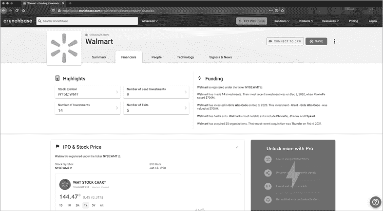
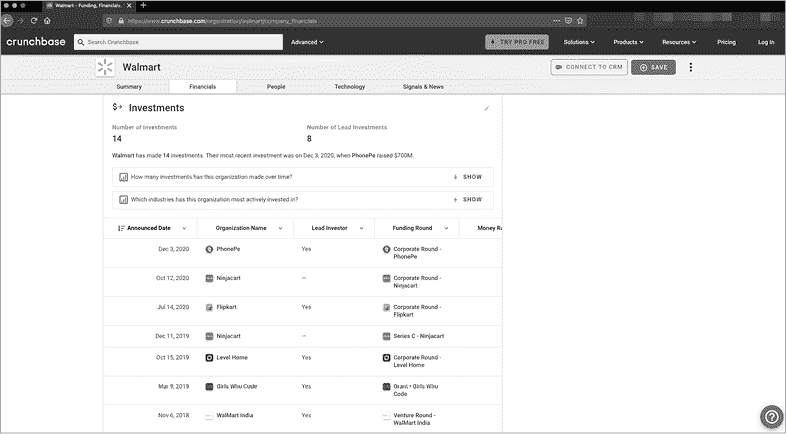
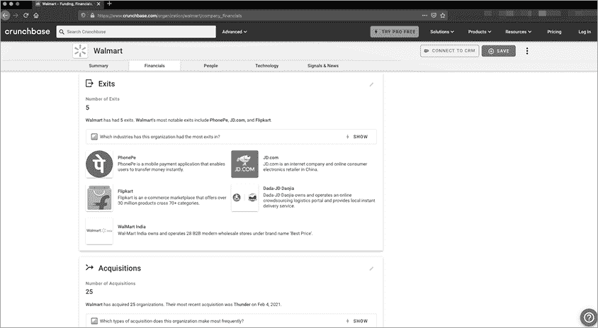
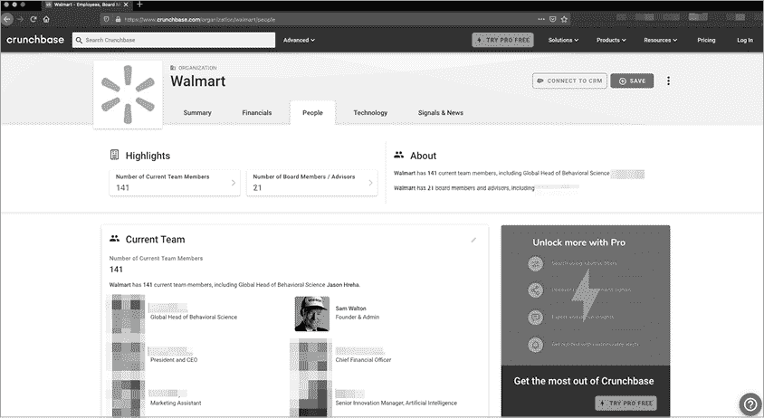
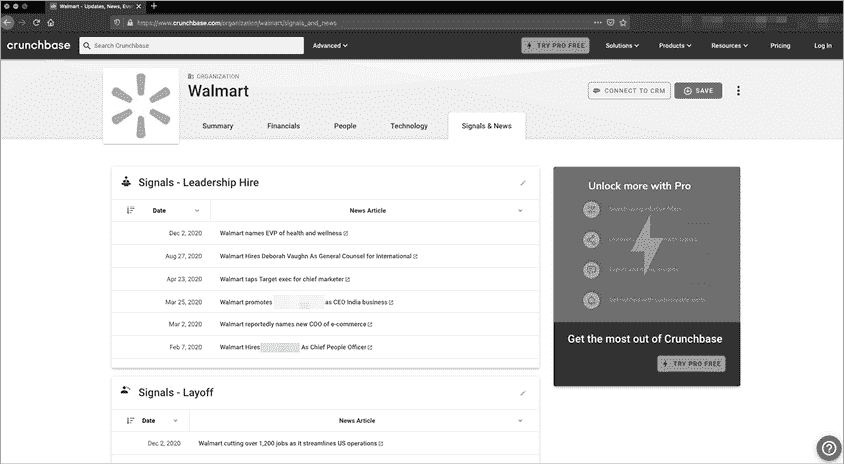
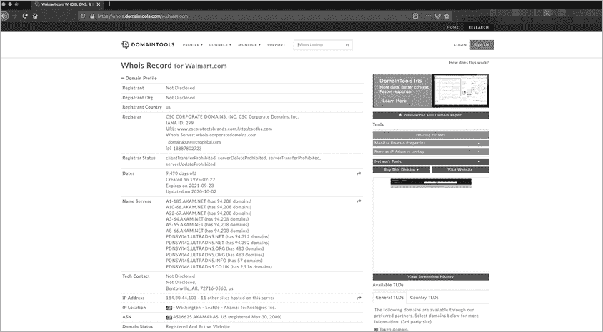
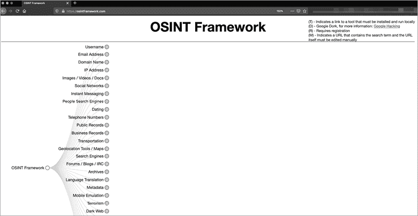
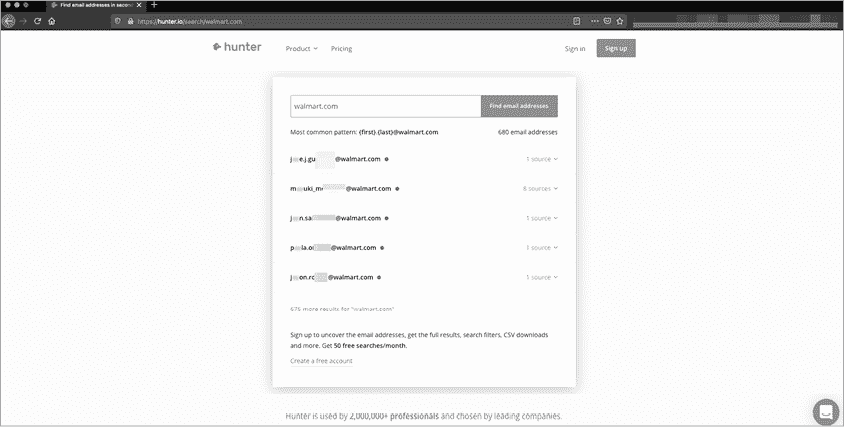
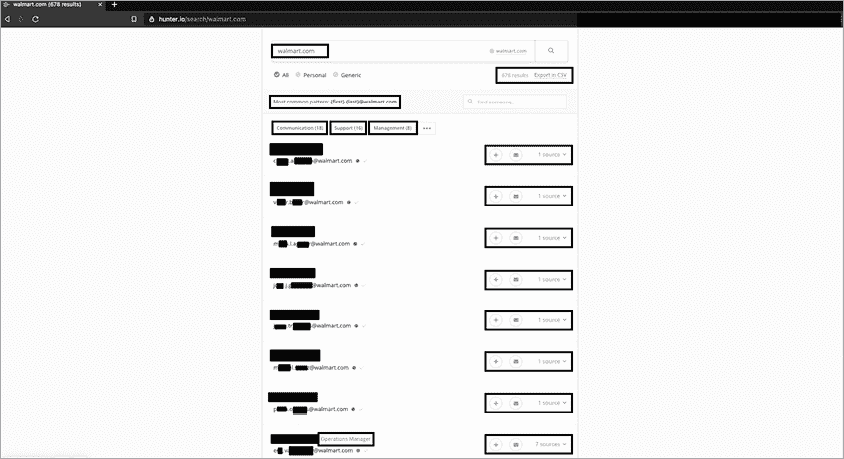

# 第四章：收集商业 OSINT


*开放源代码情报（OSINT）* 是指你可以从公开的、非隐藏的来源找到的任何数据。可用的公共数据的数量和重要性可能决定你的行动成败。如果你在没有了解目标的兴趣爱好、操作环境、组织结构或公司内部术语的情况下联系目标，可能会失败。

另一方面，花时间了解是什么让目标产生反应，将为你提供接触目标时的即时背景信息。很多时候，人们在没有充分进行或匆忙进行 OSINT 收集的情况下，尝试执行社会工程操作，这样他们就没有理由与目标交谈。

本章介绍了三种 OSINT 类型：商业、人物和网络威胁情报。接下来，我将介绍一些商业 OSINT 工具，用于执行有用的任务，比如查找公司高管姓名、发现公开可用的文件、收集电子邮件地址以及查看文档元数据。

## 案例研究：为什么 OSINT 很重要

2017 年，我赢得了 DerbyCon 的社会工程“夺旗赛”（SECTF）。这项活动让我和其他五名竞争者与一个毫不知情的财富 500 强公司进行对抗，地点位于肯塔基州路易斯维尔市。我们花了三周时间收集 OSINT，然后进入一个（大多数情况下）隔音的房间，花 20 分钟时间与目标公司的员工进行联系。在研究目标公司时，我查看了一位高管的社交媒体账户，了解到他因航空公司在纽瓦克的航班延误而迟到了阿姆斯特丹的一次商务会议。这条看似无害的信息给了我联系他的完美借口。

得到这个信息后，我将该航空公司的电话号码添加到我的“钓鱼”电话号码列表中。接着，我获得了该高管的姓名、电子邮件地址和电话号码，并将它们加入我的目标名单。如果这是一个允许进行网络钓鱼的任务，我将发送一封模仿航空公司模板的道歉电子邮件，然后打电话伪装成航空公司工作人员。之后，我可以确认我已经知道的信息，并问一些“安全问题”，让目标相信我是一个可信的来源。我甚至可能会加入一些 Windows 操作系统的声音，以增强我的可信度。最后，我将问他一些可能对公司运营环境致命的问题，比如设备升级状态、运营时间表或其他公司特有的机密数据。

如果我没有首先发现那位高管关于航班延误的帖子，这些攻击将不可能发生。有效的社会工程攻击很少在没有充分了解目标的情况下发生。更好的 OSINT 能带来更好的社会工程。

## 理解 OSINT 的类型

OSINT 可以涉及一个组织、一个人或一段代码。在 *商业 OSINT* 收集中，我们关注的是有关公司整体的信息：使用的技术、供应商、客户、运营和位置。

收集 *个人 OSINT* 时，我们可以走两条路。我们可以直接针对个人，搜寻诸如他们的喜好、厌恶、进一步的关系、密码重置问题和猜测密码的背景信息。另一方面，我们可以利用此人来了解他们所在公司的情况。这类 OSINT 可能包括他们在工作中的照片、简历、抱怨或不满、他们吹嘘的工作成就以及他们因工作而进行的旅行等。

*OSINT* 可以用于支持 *网络威胁情报 (CTI)*，通常涉及一段代码或特定的对手。我们使用它来识别攻击者及其动机。例如，你可能追踪代码中的元素，以确定其作者或来源国。或者，你可能追踪一个联系过你组织的电子邮件地址或电话号码。人们对于 OSINT 在威胁情报中的有效性有不同的看法。有些组织做得非常好，而有些则是试图通过牺牲客户利益来赚取短期利润。

## 商业 OSINT

本节将帮助你开始收集商业 OSINT。在与公司员工沟通时，哪些背景信息可以用来建立关系？我将在这里介绍一些 OSINT 收集工具。

### 从 Crunchbase 获取基本的商业信息

各种平台可以为你提供有关公司的洞察。虽然大多数平台对深入信息收费，但有些平台允许免费或无需认证地收集有限的内容。例如，*Crunchbase*（[`www.crunchbase.com/`](https://www.crunchbase.com/)）就是这样一个网站。Crunchbase 提供一个免费的服务层级，满足大多数休闲 OSINT 爱好者的需求。如果你打算大量使用它或作为专业顾问使用，建议支付 Pro 版费用。

在 Crunchbase 上搜索 *Walmart* 会弹出一个包含多个标签的资料页。图 4-1 显示了 Summary 标签页，它允许你获取公司总部的地址。在你滚动页面之前，可以找到公司涉及的并购、收购和退出的次数。你还可以看到公司的股票代码（如果它是上市公司）、关于公司的最新新闻，以及关于公司的基础性、甚至历史性的信息。Crunchbase 收集这些信息的方式包括分析师输入、网页抓取和自我报告，准确性各异。


图 4-1：Crunchbase 上 Walmart 的 Summary 标签页

“财务”标签提供了关于投资、退出和募资的具体信息（图 4-2）。



图 4-2：Crunchbase“财务”标签中 Walmart 的股票信息

如果公司是公开上市的，你将找到首次公开募股（IPO）和股票价格信息。如果你研究的是一家私人公司，你将在此部分看到很少或没有信息，或者可能会了解到募资情况，包括筹集的金额、投资者和日期。如果公司投资了资金或进行了捐赠，这些内容将列在接下来部分（图 4-3），随后是退出信息，并最后是收购信息（图 4-4）。



图 4-3：Crunchbase“财务”标签中 Walmart 的投资信息



图 4-4：Crunchbase“财务”标签中 Walmart 的收购信息

接下来是“人物”标签，其中包括重要员工。这些员工通常是负责某些关键领域的高层管理人员，或对公司历史产生过影响的人。例如，图 4-5 列出了 Walmart 的创始人 Sam Walton，作为“创始人兼管理员”出现在当前团队部分，并且虽然他已于 1992 年去世，但仍是董事会成员。



图 4-5：Walmart 在 Crunchbase 中的“人物”标签

“技术”标签通常是锁定的，除非你拥有专业账户。如果你有这种账户，这个标签将向你展示网站流量统计、移动应用指标，以及关于公司专利和其他知识产权申请的有限信息。这些信息可以在互联网上其他地方找到，因此无法访问也不是什么大问题。你可以尝试查看 BuiltWith（[`www.builtwith.com/`](https://www.builtwith.com/)）、Wappalyzer（[`www.wappalyzer.com/`](https://www.wappalyzer.com/)）或 Shodan（[`www.shodan.io/`](https://www.shodan.io/)）。

最后的标签是“信号与新闻”，它聚合了相关的新闻和领导层变动（图 4-6）。



图 4-6：Walmart 的 Crunchbase 个人资料中的“信号与新闻”标签

此标签还列出了组织有某种关联的事件，无论是通过赞助还是让员工在这些事件中发言。这是一个很好的起点，但不能替代其他信息来源，包括公开文件、新闻稿和媒体报道。（我们将在接下来的几章中讨论这些来源。）此标签还可能建议你可以在自己选择的搜索引擎中输入的搜索词。

### 使用 WHOIS 确定网站所有者

发音为“who is”，*WHOIS* 是一个网站目录，包含网站及其所有者、网络块和联系方式。其目的是允许有合法业务咨询的人联系公司的网页团队，以获取有关其网站存在的信息。欲了解更多，请参见 RFC 9312。

如图 4-7 所示，你可以通过 DomainTools 搜索 WHOIS。`whois` 命令内置于 Offensive Security 和 Trace Labs Kali 版本中，也可以通过 `apt-get` 或其他 Linux 发行版中的类似命令添加到任何 Linux 系统中。



图 4-7：通过 DomainTools 获取的 Walmart WHOIS 记录

页面顶部显示与目标域名相似且正在拍卖的域名。这些可能在进行域名抢占和进一步的网络钓鱼或诱饵攻击时派上用场。伪造很容易被发现，大多数邮件客户端都具备防伪造的保护措施，降低了你作为社交工程师的潜力。而域名抢占或拼写抢占更可能让邮件通过过滤器并进入收件箱。

接下来，注意到*转移*被禁止，这意味着你可能无法将该域名转移到不同的提供商，这也是红队常尝试的活动。还要注意域名的年龄，这有助于确认你正在查看正确的目标。或者，这一特性也可以揭示你使用的域名是假的。这就是为什么购买域名后，最好等待六个月到一年再使用它们。

接下来是该站点使用的域名服务器。这些服务器有时可以指示公司使用的其他软件。例如，Walmart 使用 Akamai 和 UltraDNS。Akamai 还提供内容分发网络（CDN）服务（加快页面加载速度并缓解 DOS 攻击）并执行网站保护和负载均衡（进一步减轻 DOS 攻击）。如果你正在为渗透测试做准备，了解这些信息非常重要。

请注意，自 2018 年 5 月 25 日起，欧盟通用数据保护条例（GDPR）改变了其管辖范围内 WHOIS 的处理方式。这促使负责 WHOIS 的互联网名称与数字地址分配机构（ICANN）改变了展示位于欧盟的公司和联系人信息的方式。

### 使用 Recon-ng 从命令行收集 OSINT

*Recon-ng*是一个 Linux 命令行工具，由 Tim Tomes 编写，用于收集 OSINT。它的操作方式类似于 Metasploit：你可以输入信息，设置目标，然后使用`run`命令执行搜索。

Recon-ng 内置了大量工具，用于收集企业和个人的 OSINT，从 Have I Been Pwned 泄露的电子邮件（在第六章中讨论）和 DNS 记录中的网络块，到 Shodan 中的主机或端口（在第五章中讨论）。通过使用 Recon-ng，你几乎可以找到关于一个公司的所有信息。

#### 安装 Recon-ng

Recon-ng 已预装在 Offensive Security 和 Trace Labs 的 Kali 版本中。要在其他 Linux 系统上使用 Recon-ng，你需要 Python 3、pip3 包管理工具和 Git。然后，你可以通过以下命令将其安装到*/opt*目录：

```
root@se-book:/opt# **git clone https://github.com/lanmaster53/recon-ng**
Cloning into 'recon-ng'...
`---snip--`
Resolving deltas: 100% (4824/4824), done.
root@se-book:/opt# cd recon-ng/
root@se-book:/opt/recon-ng# ls -la
`--snip--`
-rw-r--r-- 1 root root    97 Sep 25 18:37 REQUIREMENTS
`--snip--`
-rwxr-xr-x 1 root root  2498 Sep 25 18:37 recon-ng
-rwxr-xr-x 1 root root    97 Sep 25 18:37 recon-web
root@se-book:/opt/recon-ng# python3 -m **pip install -r REQUIREMENTS** 
Requirement already satisfied: pyyaml in /usr/lib/python3/dist-packages (from -r REQUIREMENTS (line 2))
Collecting dnspython (from -r REQUIREMENTS (line 3))
  Downloading https://files.pythonhosted.org/packages/ec/d3/3aa0e7213ef72b8585747aa0e271a9523e713813b9a20177ebe1e939deb0/dnspython-1.16.0-py2.py3-none-any.whl (188kB)
    100% |████████████████████████████████| 194kB 5.6MB/s
```

#### 设置工作区

Recon-ng 允许你定义独立的工作区，非常适合将收集的信息进行隔离。当你打开 Recon-ng 时，可以定义工作区并将收集的数据存储在其独特的 SQLite 数据库中。如果我正在进行同一调查，搜索不同的实体或公司，我会为它们分别指定工作区，这样在查看收集到的信息时就不会混淆。如果你没有定义工作区，Recon-ng 会将所有结果写入默认工作区及其关联的数据库。

在启动 Recon-ng 时使用工作区，请运行以下命令：

```
**recon-ng -w** `workspace_name` 
```

例如，如果我正在调查沃尔玛，我可能会运行这个：

```
recon-ng -w walmart
```

结果工作区看起来是这样的：

```
[recon-ng][walmart]
```

如果你已经在 Recon-ng 中，可以通过执行`workspace list`命令查看可用的工作区。

如果你想加载一个现有的工作区，可以执行此命令：

```
**workspace load** `workspace_name` 
```

你也可以通过以下命令创建工作区：

```
**workspace create** `workspace_name` 
```

一旦你不再需要工作区中的任何信息，并且过了数据保留期限，你可以删除它：

```
**workspace remove** `workspace_name`
```

#### 安装 Recon-ng 模块

接下来，你需要启用并安装模块。让我们通过使用`marketplace search`命令来查看哪些模块可用：

```
[recon-ng][walmart] > **marketplace search**
+-----------------------------------------------------------------------------------    ------+
|.             Path                            | Version |     Status    |  Updated   | D | K |
+---------------------------------------------------------------------------------------    --+
| discovery/info_disclosure/cache_snoop        | 1.0     | not installed | 2019-06-24 |   |   |
| discovery/info_disclosure/interesting_files  | 1.0     | not installed | 2019-06-24 |   |   |
| exploitation/injection/command_injector      | 1.0     | not installed | 2019-06-24 |   |   |
| exploitation/injection/xpath_bruter          | 1.1     | not installed | 2019-08-19 |   |   |
| import/csv_file                              | 1.1     | not installed | 2019-08-09 |   |   |
| import/list                                  | 1.0     | not installed | 2019-06-24 |   |   |
```

你可以通过两种方式安装模块：逐个安装或一次性安装所有模块。要安装单个模块，请输入以下命令，将`import/csv_file`替换为模块的完整路径：

```
[recon-ng][walmart] > **marketplace install**`import/csv_file`
[*] Module installed: import/csv_file
[*] Reloading modules...
```

要安装所有可用模块，请使用以下命令：

```
[recon-ng][walmart] > **marketplace install all**
[*] Module installed: discovery/info_disclosure/cache_snoop
[*] Module installed: discovery/info_disclosure/interesting_files
[*] Module installed: exploitation/injection/command_injector
`--snip--`
[*] Module installed: reporting/xml
[*] Reloading modules...
[!] 'google_api' key not set. pushpin module will likely fail at runtime. See 'keys add'.
[!] 'bing_api' key not set. bing_linkedin_cache module will likely fail at runtime. See 'keys add'.
[!] 'censysio_id' key not set. censysio module will likely fail at runtime. See 'keys add'.
```

#### 获取并添加 API 密钥

为了使某些工具能够访问外部资源，你需要从各种网站获取 API 密钥。每个网站都有自己的获取密钥的过程，而这些过程往往会发生变化。你可以在[`www.theosintion.com/practical-social-engineering/`](https://www.theosintion.com/practical-social-engineering/)查看我最新的教程，了解如何获取这些 API 密钥，或者查看每个工具网站上的 API 密钥页面。

获取密钥后，使用以下语法在 Recon-ng 中添加它们：

```
**keys add** `name_of_module value`
```

使用以下命令验证 Recon-ng 是否已在数据库中存储密钥：

```
**keys list**
```

#### 查找和运行 Recon-ng 模块

Recon-ng 模块有五种类型：发现、利用、导入、侦察和报告。在本书中，我们将使用发现、侦察和报告模块类型。

要查看与特定类型相关的模块，请使用 `search` 命令，后跟类型的名称：

```
**modules search discovery**
```

如果你知道模块名称的一部分，可以使用 `search` 功能来定位它，像这样：

```
**modules search hibp**
```

如果你知道模块的名称或模块名称的一部分，也可以直接通过 `modules load` 命令调用一个模块：

```
**modules load metacr**
```

上述命令将加载 `metacrawler` 模块。现在让我们更详细地探索这些模块。

要设置模块的目标，你需要知道该模块接受哪些输入。可以通过发出 `info` 命令来获取此信息。当你准备好在接受的字段中输入目标或值时，发出 `options set` `name_of_field value_of_field` 命令。

#### 使用 Metacrawler 枚举文件

`metacrawler` 模块会搜索目标站点或多个站点中的 Microsoft PowerPoint、Word、Excel 和 PDF 文件。它相当于进行一个*Google dork*——编写像这样的长查询语句：

```
site:nostarch.com Filetype:XLS* OR Filetype:DOC* OR Filetype:PPT* or Filetype:PDF
```

例如，要搜索 *nostarch.com* 中的所有文件类型，可以使用以下命令：

```
[recon-ng][default][metacrawler] > **options** **set SOURCE nostarch.com**
SOURCE => nostarch.com
[recon-ng][default][metacrawler] > **run**
------------
NOSTARCH.COM
------------
[*] Searching Google for: site:nostarch.com filetype:pdf OR filetype:docx OR 
filetype:xlsx OR filetype:pptx OR filetype:doc OR filetype:xls OR 
filetype:ppt
[*] https://www.nostarch.com/download/WGC_Chapter_3.pdf
[*] Producer: Acrobat Distiller 6.0 (Windows)
[*] Title: Write Great Code
[*] Author: (c) 2004 Randall Hyde
[*] Creator: PScript5.dll Version 5.2
[*] Moddate: D:20041006112107-07'00'
[*] Creationdate: D:20041006111512-07'00'
[*] https://www.nostarch.com/download/wcss_38.pdf
[*] Producer: Acrobat Distiller 5.0 (Windows)
[*] Title: wcss_book03.book
[*] Author: Riley
[*] Creator: PScript5.dll Version 5.2
[*] Moddate: D:20040206172946-08'00'
[*] Creationdate: D:20040116180100Z
```

如果 `Extract` 设置为 `True`，该命令将输出目标公开网站上的所有 PDF 或 Microsoft Office 格式（Excel、Word 或 PowerPoint）的文档，包括文件链接和元数据，如作者、创建软件、修改日期、生成软件以及创建日期。如果 `Extract` 设置为 `False`，输出仅提供文件名和链接。

根据这些信息，你可以做很多事情。从元数据中，你可以列举出用户、操作系统和使用的软件。从文件本身，你可能能找到目标本打算保密的信息，包括姓名、电子邮件地址、电话和传真号码、地址以及重要的商业事务。

#### 使用 whois_pocs 查找域名联系人

`whois_pocs` 模块列举了给定域名的所有已知联系点。它在此功能上比 `whois_miner` 模块更强大，甚至对具有域名隐私保护的目标也能工作。以下是对 Walmart 运行该模块的示例：

```
[recon-ng][default][whois_pocs] > **modules load whois_pocs**
[recon-ng][default][whois_pocs] > **options set SOURCE walmart.com**
SOURCE => nostarch.com
[recon-ng][default][whois_pocs] > **info**
      Name: Whois POC Harvester
      Path: modules/recon/domains-contacts/whois_pocs.py
    Author: Tim Tomes (@LaNMaSteR53)
Description:
  Uses the ARIN Whois RWS to harvest POC data from whois queries for the given
domain. Updates the 'contacts' table with the results.
Options:
  Name    Current Value  Required  Description
  ------  -------------  --------  -----------
  SOURCE  walmart.com    yes       source of input (see 'show info' for details)
Source Options:
  default        SELECT DISTINCT domain FROM domains WHERE domain IS NOT NULL
  <string>       string representing a single input
  <path>         path to a file containing a list of inputs
  query <sql>    database query returning one column of inputs
[recon-ng][default][whois_pocs] > **run**
-----------
WALMART.COM
-----------
[*] URL: http://whois.arin.net/rest/pocs;domain=walmart.com
[*] URL: http://whois.arin.net/rest/poc/ABUSE327-ARIN
[*] Country: United States
[*] Email: abuse@walmart.com
[*] First_Name: None
[*] Last_Name: Abuse
[*] Middle_Name: None
[*] Notes: None
[*] Phone: None
[*] Region: Brisbane, CA
[*] Title: Whois contact
[*] --------------------------------------------------
```

请记住，一些组织不会公开他们的 WHOIS 信息。

#### 使用 mx_spf_ip 了解域名的邮件策略

`mx_sfp_ip` 模块获取域名的 DNS 邮件交换器（MX）记录。*MX 记录* 定义了域名如何处理电子邮件。它显示了使用的邮件服务器和任何*发送者政策框架（SPF）记录*，这些记录限制了该域名能够接收邮件的 IP 范围，以及能够无审查地向该组织发送邮件的域名。

使用 MX 记录，攻击者可以利用其中包含的信息来策划成功的电子邮件伪造攻击。例如，攻击者可以枚举记录中列出的 IP 范围及其关联的域名。这可能为商业关系、供应商或使用的技术提供线索。

以下命令检索*nostarch.com*的 MX 记录。输出确认该站点使用了 Google 邮件服务器，但由于缺少 SPF 记录，表明 No Starch 尚未实施 SPF：

```
[recon-ng][book][mx_spf_ip] > **options set** **SOURCE** **nostarch.com**
SOURCE => nostarch.com
[recon-ng][book][mx_spf_ip] > **run**
[*] Retrieving MX records for nostarch.com.
[*] [host] alt1.aspmx.l.google.com (<blank>)
[*] [host] aspmx.l.google.com (<blank>)
[*] [host] alt3.aspmx.l.google.com (<blank>)
[*] [host] alt2.aspmx.l.google.com (<blank>)
[*] [host] alt4.aspmx.l.google.com (<blank>)
[*] Retrieving SPF records for nostarch.com.
[*] nostarch.com => No record found.
```

另一方面，以下输出向我们展示了 Walmart 使用了 SPF：

```
[recon-ng][book][mx_spf_ip] > **options set SOURCE walmart.com**
SOURCE => walmart.com
[recon-ng][book][mx_spf_ip] > **run**
[*] Retrieving MX records for walmart.com.
[*] [host] mxb-000c7201.gslb.pphosted.com (<blank>)1
[*] [host] mxa-000c7201.gslb.pphosted.com (<blank>)
[*] Retrieving SPF records for walmart.com.
[*] TXT record: "dtOeNuIs42WbSVe3Zf2qizxLw9LSQpFd6bWqCr166oTRIuJ9yKS+etPsGGNOvaiasQk2C6GV0/5PjT9CI2nNAg=="
[*] TXT record: "google-site-verification=ZZYRwyiI6QKg0jVwmdIha68vuiZlNtfAJ90msPo1i7E"
[*] TXT record: "adobe-idp-site-verification=7f3fb527466337ac0ac0752c569ca2ac48926dc6c6dad3636d581aa131a1cf3e"
[*] TXT record: "v=spf1 ip4:161.170.248.0/24 ip4:161.170.244.0/24 ip4:161.170.236.31 ip4:161.170.238.31 ip4:161.170.241.16/30 ip4:161.170.245.0/24 ip4:161.170.249.0/24 include:Walmart.com include:_netblocks.walmart.com include:_vspf1.walmart.com include:_vspf2.walmart.co" "m include:_vspf3.walmart.com ~all"
[*] [netblock] 161.170.248.0/242
[*] [netblock] 161.170.244.0/24
[*] [host] <blank> (161.170.236.31)
[*] [host] <blank> (161.170.238.31)
[*] [netblock] 161.170.241.16/30
[*] [netblock] 161.170.245.0/24
[*] [netblock] 161.170.249.0/24
[*] TXT record: "facebook-domain-verification=ximom3azpca8zph4n8lu200sos1nrk"3
[*] TXT record: "adobe-idp-site-verification=5800a1970527e7cc2f5394a2bfe99bcda4e5938e132c0a19139fda9bf6e30704"4
[*] TXT record: "docusign=5bdc0eb1-5fb2-471c-99a0-d0d9cc5fdac8"5
[*] TXT record: "MS=E4F53D5B1A485B7BA06E0D36A9D38654A16609F3"6
```

SPF 记录列出了 Adobe、Facebook、DocuSign、Microsoft 和 Google 的域验证。以`MS=`开头的文本（TXT）记录表明 Walmart 使用了 Microsoft Office 365 6。它还使用`adobe-idp-site-verification`来验证 Adobe 企业产品如 Creative Cloud 4 的域名。以`facebook-domain-verification`开头的 TXT 记录限制了哪些域可以编辑该域的官方 Facebook 页面 3。以`docusign=`开头的 TXT 记录表明该站点使用 DocuSign 签署官方文件 5。

注意*pphosted.com* 1 作为一个主机列出。这表明使用了 Proofpoint，一种防伪技术，它会在收到的电子邮件主题行中添加一个自定义消息，通常是字符串`[EXTERNAL]`，使得钓鱼邮件或企业邮件欺诈尝试更容易被识别。

还列出了一些网络范围 2。这些是目标的公共 IP 地址，列出的两个主机是主要的邮件服务器。你可以使用其他工具来确认这一点。

### 使用其他工具：theHarvester 和 OSINT Framework

像 Recon-ng 一样，*theHarvester*是一个基于 Linux 的命令行 OSINT 工具，可以自由使用，作为 Kali 和 Buscador 的一部分。你也可以在 GitHub 上找到它。该工具由 Christian Martorella 编写，theHarvester 需要 Shodan 和 Google 自定义搜索引擎（CSE）的 API 密钥。你可以在以下文件中输入这些密钥：

```
`theHarvester_path`/discovery/googleCSE.py
```

和

```
`theHarvester_path`/discovery/shodansearch.py
```

在 theHarvester 中，你可以使用开关来指示工具执行任务。选择使用 theHarvester 而不是 Recon-ng 是个人偏好的问题。即使你将 Recon-ng 作为主要工具，你也可能想使用 theHarvester 来获取第二意见，看看 Recon-ng 是否遗漏了任何附加信息。

*OSINT Framework*（[`osintframework.com/`](https://osintframework.com/)）是一个基于 GUI 的工具集合。由 Justin Nordine 策划，OSINT Framework 根据你所寻找的内容将资源分组（图 4-8）。



图 4-8：OSINT Framework

### 使用 Hunter 查找电子邮件地址

你通常需要找到电子邮件地址和公司的*电子邮件地址* *语法*（公司为其员工使用的电子邮件地址格式）。*Hunter* 是一个很好的工具，可以帮助你列举这些信息。在没有登录的情况下，你可以获取公司使用的基本电子邮件地址语法。一旦你创建账户并登录，你就可以获得最常见的电子邮件地址语法、完整的公司电子邮件地址，并且偶尔会看到某个人的职位。

图 4-9 显示了未认证搜索的输出结果。



图 4-9：未认证用户的 Hunter 搜索结果。（注意：Hunter 对这些结果进行了审查。）

图 4-10 显示了一个认证搜索的结果，返回了目标域名的有效电子邮件地址，以及它们的来源。



图 4-10：认证用户的 Hunter 搜索结果。（注意：作者对这些结果进行了审查。）

通过查看这些结果，你可以推测出公司电子邮件地址的语法。然后，你可以转到 LinkedIn 和公司网站，获取更多的名字，再自己将更多的电子邮件地址拼凑起来，假如你想对这些人进行钓鱼攻击。

Hunter 提供不同层级的服务；在撰写本文时，这些服务的价格范围从免费的（每月 100 次请求且不支持 CSV 导出）一直到每月 399 美元，包括 50,000 次请求并支持 CSV 导出。

### 利用映射和地理定位工具

你可能已经使用过 Google 地图或 Bing 地图，通过地图视图、卫星视图和街景视图来定位自己。在收集 OSINT（开源情报）时，卫星和街景模式通常是最有价值的。

卫星视图可以显示大门、垃圾桶、卫星天线、进出口、停车方案以及相邻设施。你可以放大一些站点，帮助你确定藏匿地点、入口和吸烟区。

街景视图让你看到的建筑物和设施，仿佛你走路或开车到达现场一样。从这个视图中，你可以识别出以下信息：

+   垃圾桶供应商（这是现场伪装有用的信息，可能帮助你进入建筑物或进行垃圾桶翻找）

+   大门、门和围栏，及其是否经常保持开启（有时还包括保安的存在）

+   停在外面的配送公司卡车

+   一些特定建筑的名称，如沃尔玛创新中心、沃尔玛员工中心或沃尔玛总部，这些名称可以帮助你更好地融入组织（一个快速被识破的方法是把迪士尼或沃尔玛的员工叫做 *员工*，而不是 *演员* 或 *员工*）。

+   其他租户

在本章开头提到的 DerbyCon SECTF 中，我使用 Google Maps 来确定我的目标公司运输供应商，通过查看谁的卡车在大门内。我本可以利用这些信息获得物理访问权限，或许通过在二手商店找到一件制服，或作为一种诈骗电话的借口来询问发货情况。

同时使用 Google Maps 和 Bing Maps 可以提供更好的信息，因为这两个应用的数据来源不同。此外，图像是收集于不同的日期，因此你可能会在一个应用中看到一辆送货卡车，但在另一个应用中看不到，或者在更新的照片中看到一个新的垃圾桶，或看到未经过滤的供应商名称。

## 结论

收集 OSINT（开放源信息）的途径有很多种。本章仅仅触及了这些工具功能的表面，旨在为你提供一个起点，帮助你将 OSINT 技巧应用于社会工程学、渗透测试或任何其他伦理应用。通过本章的练习，你已经使用开源工具收集了与企业相关的域名、IP 地址、电子邮件地址、姓名和技术。

下一章将介绍如何在没有高级工具的情况下收集 OSINT。第六章将讲解针对个人的 OSINT 操作。
