# 5

社交媒体与公共文档

在上一章中，我们讨论了使用高级工具进行 OSINT 收集。然而，您并不总是需要复杂的工具来获取所需的信息。很多时候，查看社交媒体平台就足够了。在本章中，我们将讨论互联网上一些看似无害的帖子是如何被武器化的。您将学会如何从这些平台收集 OSINT，以及一些虽不是社交媒体但同样具有影响力的平台。您将阅读公司的公共文档，并学习如何自动截图以记录您的发现。

## 分析社交媒体中的 OSINT

社交媒体平台让我们能够洞察目标人物和企业的生活。虽然一些组织有*清洁桌面政策*，要求员工在休息、午餐或外出时将桌面上的敏感信息移除，但许多政策并不包括拍摄在个人设备上的照片。因此，人们会在公共平台上发布他们关心或激动的事情，无论是在家里还是在工作中。这为 OSINT 调查员提供了一个全面了解组织设施的机会，通常能看到比亲自参观更多的信息。

在第六章中，我们将重新审视社交媒体网站作为了解发布帖子的人的一种方式。

### LinkedIn

*LinkedIn*是一个优秀的职业社交网络。它的许多用户过于开放，分享了内部使用的所有技术和流程。通过在该网站查找公司员工信息，我们可以为钓鱼攻击创建目标名单，发现公司使用的技术，并列出在语音钓鱼攻击中可以扮演的角色。LinkedIn 是一个 OSINT 的金矿，尤其适用于那些在线足迹较小的小型公司。

#### 一般公司信息

让我们来看看沃尔玛的 LinkedIn 公司页面（图 5-1）。在页面顶部，我们可以看到沃尔玛的粉丝数量、该账户的连接中有多少人在沃尔玛工作、股票代码以及公司概况。“关于我们”部分还提供了沃尔玛的一些基本信息。

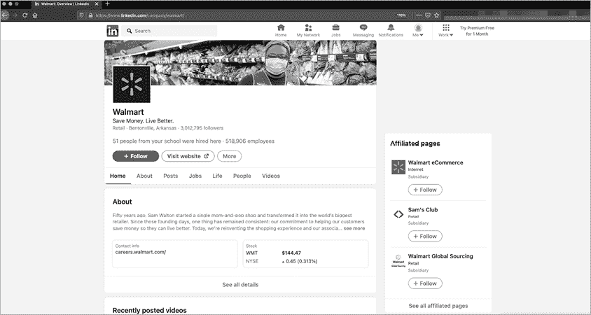

图 5-1：沃尔玛在 LinkedIn 上的公司详情

页面下方列出了所有主要沃尔玛网站的网址和地址、公司成立的时间和地点、总部位置、公司规模以及其专业领域的信息。

#### 职位信息

由于人们经常将 LinkedIn 作为求职平台，公司页面上列出了与求职者相关的信息，比如已知的员工数量以及该数量是增加还是减少（图 5-2）。

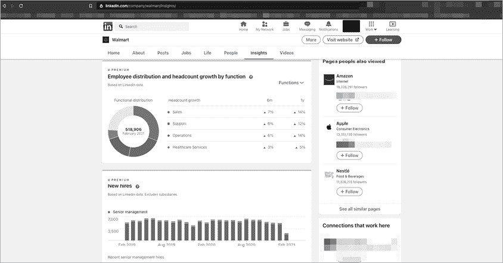

图 5-2：沃尔玛员工在 LinkedIn 上的详细信息

员工的平均任期可以帮助我们在进行钓鱼和语音钓鱼时与目标进行互动。我们可以估计某个员工是否可能认识另一站点的员工，特别是在像沃尔玛这样拥有超过 30 万员工的大公司中。类似地，LinkedIn 关于员工分布、增长和新员工的数据可以为我们提供线索，帮助我们估计如果我们打电话到公司，遇到新员工的可能性。

#### 公司员工

一个单独的页面列出了公司员工的 LinkedIn 用户。利用这个信息，可以查看每个人的角色。例如，图 5-3 显示了一个职位为 *入侵分析师* 的人，这是一个网络安全职位，表明公司正在积极监控其网站和网络以防止恶意行为。

我们可以通过信息安全员工的数量来评估公司的安全性。实现这一点的一个简单方法是查看员工资料中的认证缩写。检查 CISSP、GPEN、OSCP、CEH 和 Security+ 是不错的起点。可以搜索的职位名称包括 *信息安全*、*网络安全*、*入侵* 和 *CISO*。

图 5-3：沃尔玛员工在 LinkedIn 上的展示

这些员工资料还告诉我们公司使用的技术。通过搜索它们，我们可以检测到安全事件和事故管理（SEIM）解决方案、恶意软件保护、电子邮件过滤或 VPN 的存在。此外，它们帮助我们建立邮件列表，以便进一步的分析和钓鱼攻击。

### 招聘网站和职业网站

员工、招聘人员和外包招聘供应商可能会在其社交媒体上链接到招聘页面或职位网站。因此，聪明的社会工程师、红队成员和开源情报调查员可以抓取这些信息并将其武器化。

根据职位发布的方式，你可能会在一句话中找到通往王国的钥匙。在 图 5-4 中，你可以看到候选人必须具备 Oracle E-Business Suite (EBS) 版本 12.2.7 的经验。这告诉潜在攻击者去寻找这个特定的软件版本。职位发布的描述方式可能会让攻击者误以为他们仍在使用版本 11.5.10.2，而这个版本自 2006 年起就存在漏洞。

这可能有几种方式。首先，我们可以搜索与该特定软件相关的常见漏洞和暴露（CVE）条目，然后查看像[`www.exploit-db.com/`](https://www.exploit-db.com/)这样的网站，寻找已知的漏洞利用代码。或者，我们可以在钓鱼或语音钓鱼中的预设情境中使用这些信息。最后，我们也可以尝试对该软件的任何公开实例进行暴力破解，这是最嘈杂的一种方法，且超出了社会工程学或开源情报的范围。

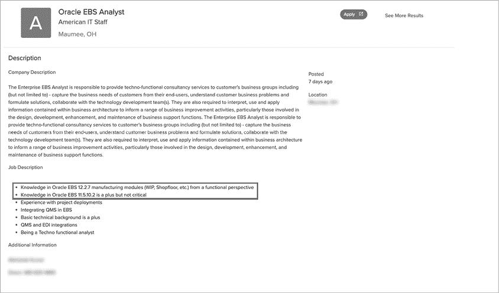

图 5-4：过于冗长的职位发布

在职位发布中，另一个值得注意的事项是提到该职位向哪个经理汇报。了解组织结构图以及谁担任哪个角色，在需要引用名字来增强可信度的情况下，对构建预设情境非常有帮助。不要仅限于当前的职位发布。查看像 Indeed、Ladders 和 LinkedIn 等网站上的旧职位发布。你还可以查看[`archive.org/`](https://archive.org/)以查找更早的页面。通过审查旧的职位发布，你可以了解该组织多频繁地修补或升级其软件，以及人力资源和安全部门的文化。

### Facebook

*Facebook* 可以是一个宝藏，也可以是一个垃圾场，这取决于你问谁以及你在寻找什么。这是因为数据丰富但审核较少，尽管有时会进行事实核查。许多人倾向于在这个网站上分享过多的信息（这种行为我们将在第六章中进一步探讨）。在这一部分，我们将专注于公司及其客户的业务相关信息。

要开始在 Facebook 上进行分析，创建一个不用于个人目的的帐户。尽管创建虚假帐户违反了该网站的服务条款，但这样做可以防止你在“你可能认识的人”标签下出现在真实个人资料中。你还可以公开发布内容，而不会让你的真实朋友感到困惑，也不必担心他们会揭露你。请记住，鉴于俄罗斯参与 2016 年美国总统选举的争议以及其他涉及数据实践和虚假信息的案例，Facebook 正在严厉打击虚假帐户以及使用人工智能生成的图像的用户。

作为另一层安全措施，避免使用该网站的移动应用程序，因为它们通常可以访问你移动设备上的所有应用程序，并且可以在没有其他输入的情况下识别出属于你的帐户。你也可能会收到越来越个性化的广告，而我个人觉得这非常令人不安。

那么，我们可以从 Facebook 上找到什么呢？竞争对手、客户、促销活动、新闻稿、新闻和公众情绪。

#### 公司信息

在一个组织的 Facebook 页面上（参见 图 5-5 中 Walmart 的页面），查看联系信息、相关时间表或新闻稿。对于较小的公司，通常可以看到有关获得奖项或被加入某些名单的新闻。你还可能看到有关员工活动和成就的帖子，尤其是如果你瞄准的是咨询公司。

图 5-5：Walmart 的 Facebook 登陆页面

查看页面的“关于”部分（图 5-6）。这里可能会找到电话号码，即使这些号码是帮助台、客户支持或公司热线的号码。我们可能会找到电子邮件地址，并且几乎可以确定会看到他们的网站。

公司还可能分享一系列事件时间表——例如成立日期、搬迁、并购以及关键员工的退休——这些都可以为我们提供用于编造前提或进行互动的信息。

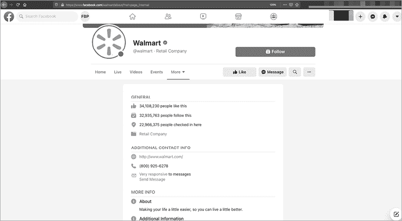

图 5-6：Walmart 的 Facebook “关于我们”页面

#### 顾客与公众情绪

当进行语音钓鱼时，获取员工与自己对话的一个狡猾方法是冒充顾客。你可以通过查看 Facebook 的社区标签和阅读评论，找到成千上万的真实顾客。在 图 5-7 中，Walmart 的社区标签展示了公众在页面上发布的各种帖子。这些帖子应当保持审慎的态度，并结合上下文来看。一些帖子是真正的关切，但也有一些是阴谋论、无根据的言论、试图走红的行为，以及假冒或伪装页面的报告。

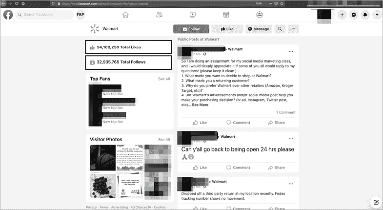

图 5-7：Walmart 的 Facebook 社区页面

社区标签向我们展示了公司的粉丝数量。这个指标表明品牌的力量，以及公司在顾客互动和客户获取方面的投入程度。

查看顾客在公司墙上分享的帖子类型，以及人们发布的频率。公司是否对这些帖子作出回应？公司是否表现出同理心，还是显得冷漠？这些都可以帮助我们制定公司档案，以及我们作为前提使用的档案。有时人们会分享随机的帖子到公司墙上，试图让帖子走红。考虑到这一点，分析时需要进行调整。

### Instagram

*Instagram*是开源情报（OSINT）的宝库。在我曾经参加过的一场社会工程学夺旗赛（SECTF）中，我通过使用 Instagram 找到了超过 90%的针对目标公司的信息。

#### 关注者与标签

比起公司账户的关注者，更有趣的是公司账户关注了谁。公司账户通常关注高管、相关的影响力人物以及市场营销和公关人员。例如，看看沃尔玛关注了谁（图 5-8）。列表中包括他们销售的品牌和勒布朗·詹姆斯。

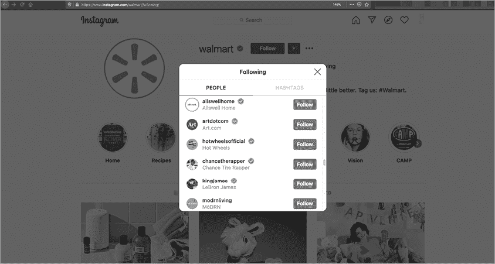

图 5-8：沃尔玛 Instagram 页面关注的账户列表

另外，搜索目标关注的标签。这能告诉我们目标认为重要的内容。这些标签可能与公司正在进行的促销活动相关，或者表明其社交媒体团队是否松散。标签还可能与公司的竞争对手有关。从沃尔玛选择关注的标签（图 5-9）中，我们可以了解到内部项目、客户激励措施以及可能的内部术语。

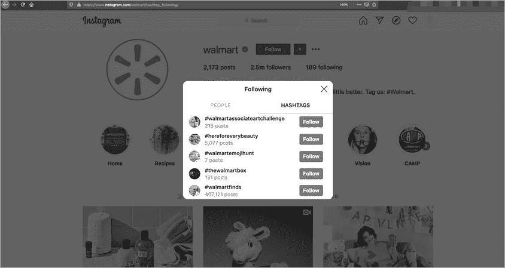

图 5-9：沃尔玛在 Instagram 上关注的标签

#### 寻找地理标签帖子

接下来，离开公司的 Instagram 页面，在 Instagram 上搜索公司的办公地址。这将引导我们到所有在该地址的*地理标签*帖子。地理标签会在设备和应用程序的位置服务启用时自动发生。位置将嵌入到帖子中，成为可搜索的字段。从返回的图片中，你很可能会找到两个非常有用的信息：公司徽章和员工桌面的照片。

徽章的图片可以帮助我们识别徽章的制造商和设计。在某些情况下，你可能能够复制门禁卡徽章，以便进入设施。Brent White 和 Tim Roberts 在[`wehackpeople.wordpress.com/2018/07/16/proxmark-3-cheat-sheet-and-rfid-thief-instructions/`](https://wehackpeople.wordpress.com/2018/07/16/proxmark-3-cheat-sheet-and-rfid-thief-instructions/)提供了使用 Proxmark 徽章克隆器（以及更多功能）的好指南。在其他情况下，你可能能够复制徽章的设计。例如，图 5-10 中的沃尔玛供应商徽章告诉我们供应商徽章的样式，包括他们使用的字体以及包含条形码和有效期。

我们可能能够重新创建徽章的条形码。尽管徽章上没有包含任何有助于身份识别的数字，但它确实包含了一个日期——这在巧妙的伎俩中可能有助于获得访问权限。

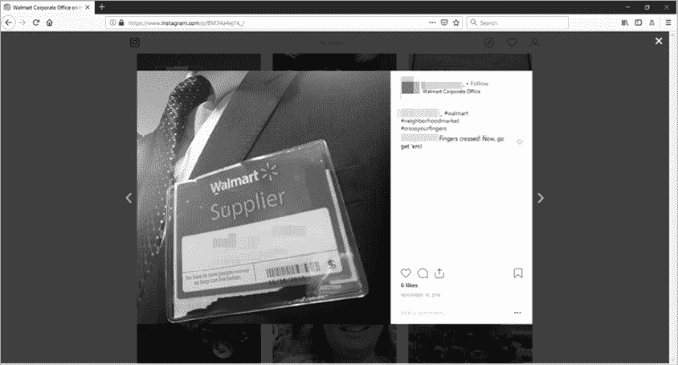

图 5-10：在 Instagram 上找到的沃尔玛供应商徽章

另外，你可以制作不具功能的假徽章。你还可以通过观察人们在该地点的着装来了解他们的穿着风格，从而让自己融入其中。例如，在沃尔玛的门店，员工通常穿着卡其裤和深蓝色衬衫，配有罩衫和徽章。图 5-11 展示了一系列沃尔玛徽章的图片，看起来都很无害，直到社会工程师或恶意行为者利用它们获得未经授权的访问权限。

图 5-11：在 Instagram 上找到的许多沃尔玛员工徽章

办公桌的照片可以告诉我们更多关于公司使用的技术。图 5-12 展示了一张员工工作站的照片。该员工（同事）在炫耀他们收到的卡片，但照片中还显示他们正在使用 MacBook，并且在 macOS 的任务栏上打开了 Photoshop、Microsoft Office 2016 和 Cisco WebEx。

图 5-12：在 Instagram 上找到的沃尔玛员工工作站

## 利用 Shodan 进行 OSINT（开放源信息搜集）

John Matherly 在 2009 年开发了 Shodan（[`www.shodan.io/`](https://www.shodan.io/)），作为一个索引互联网连接设备的搜索引擎。实际上，这意味着 Shodan 会主动扫描互联网上的不安全和开放设备，然后将这些设备输入其可搜索和已索引的数据库供用户使用。让我们来看看使用 Shodan 的主要分析方法。

Shodan 的会员价格根据访问级别而有所不同，从免费到每月 899 美元不等。会员级别由你希望持续监控的资产数量、你想进行的搜索次数以及是否搜索明确的漏洞来定义。Shodan 通常会在黑色星期五期间推出特价活动，提供便宜的终身访问权限。

### 使用 Shodan 搜索参数

使用以下搜索参数之一在 Shodan 中进行搜索：

1.  city 用于定义要搜索的城市。

1.  country 用于定义要搜索的国家。

1.  geo 用于在特定的经纬度范围内进行搜索。

1.  hostname 用于查找特定的主机名。

1.  net 用于搜索定义的 IP 地址、范围或 CIDR。

1.  os 用于查找特定的操作系统。

1.  port 用于查找特定的开放端口。

1.  before/after 用于定义搜索的时间范围。由于组织会更改其硬件和软件架构，而 Shodan 一直在扫描，条目会有所变化。设置时间范围有助于你发现更新的模式，以及当前实施和相关的技术。例如，如果你知道一个组织使用 Cisco ASA，你可以查看软件发布日期，并将其与 Shodan 中版本更改的出现时间进行对比，从而了解该组织的补丁节奏。

### 搜索 IP 地址

如果你知道一个 IP 地址或范围，可以在 Shodan 中查询它以解析主机、服务和服务横幅（图 5-13）。如果你正在进行这个开放源信息（OSINT）调查以准备渗透测试，这将非常有帮助。

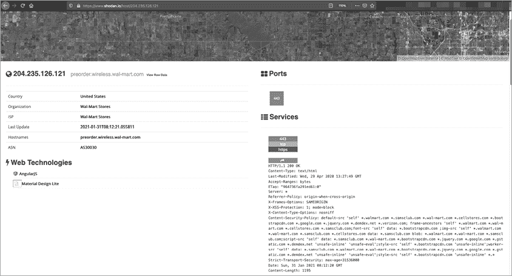

图 5-13：Shodan 枚举 IP 地址、运行的端口和服务以及服务横幅

Shodan 还会告诉我们用于加密网站流量的 TLS/SSL 证书信息。如果证书使用了弱加密算法，你可以将其视为一个技术性攻击向量。

### 搜索域名

如果你在 Shodan 中输入目标组织的域名，系统将返回所有已知的主机。这将帮助你获取有关使用的端口、协议、服务横幅和服务版本的信息。此方法还可以帮助我们识别他们使用的互联网连接系统类型（如 NGINX、Apache 和 IIS），除了主机名和 IP 地址之外。

图 5-14 显示了一个针对 *walmart.com* 域名的搜索结果，限定条件是主机必须属于沃尔玛商店。这可以防止出现包含 *walmart.com* 或链接到 *walmart.com* 的无关域名。

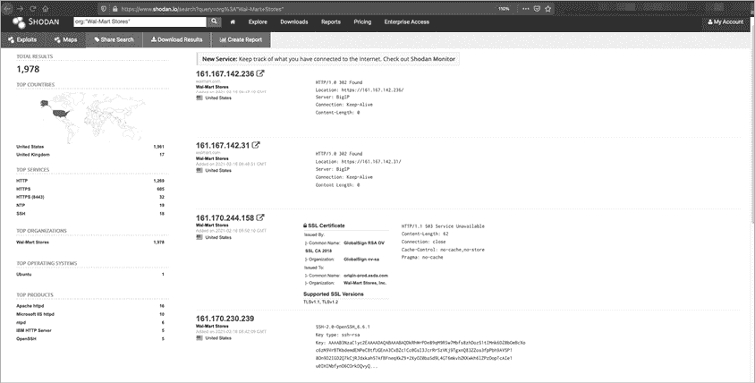

图 5-14：Shodan 域名和 IP 地址枚举，过滤条件为 *沃尔玛商店*

### 搜索主机名和子域名

如果我们知道一个特定的主机名或子域名，我们可以像搜索域名一样在 Shodan 中搜索它。Shodan 会为我们提供更聚焦的信息，如 IP 地址、服务以及主机上的开放端口。返回的具体信息会根据域名不同而有所不同，其有用性取决于我们计划如何使用这些信息。例如，图 5-15 显示了属于沃尔玛的 Microsoft IIS 网络服务器。

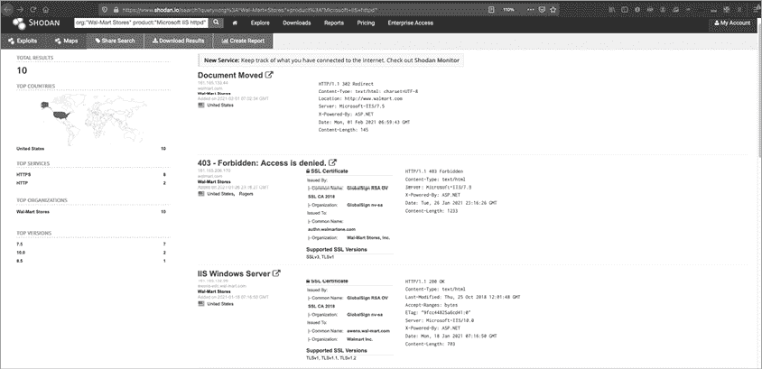

图 5-15：进一步的 Shodan IP 地址枚举

我们看到字符集、HTTP 代码，并且如果存在已知漏洞，还会显示 CVE 编号，这可以为我们提供技术利用的指导，如果这是最终目标的话。

## 使用 Hunchly 自动截图

到目前为止，在本章中，我们已经讨论了手动挖掘网页以获取有用信息。但是，当你没有使用像 Recon-ng 这样的专用 OSINT 工具时，跟踪你找到的所有信息并不总是容易的。Hunchly ([`www.hunch.ly/`](https://www.hunch.ly/)) 是一个 Chrome（或类似 Chromium 浏览器，如 Brave）扩展程序，它为你查找的每一项内容提供截图。Hunchly 由 Justin Seitz 创建，按此写作时，Hunchly 每年收费 129 美元，但提供 30 天的免费试用。如果你经常进行 OSINT 调查，购买许可证是非常值得的。

要使用 Hunchly，下载并安装插件。在 Hunchly 仪表盘中，你可以通过点击**+**图标并选择**新建案件**来定义调查（图 5-16）。这将会整理在会话期间拍摄的所有截图，并将它们分类到特定案件中。可以把它当作一个数据库来使用。

一旦你添加了案件，确保你允许 Hunchly 记录你的活动，方法是选择右上角的蓝色图标并启用扩展程序。同时，确保选择适当的案件以保存文件。

一旦启用了 Hunchly，只需在 Chrome 浏览器中浏览你正在调查的内容即可。完成后，禁用 Hunchly 扩展程序，然后点击仪表盘按钮查看你收集到的内容（图 5-17）。

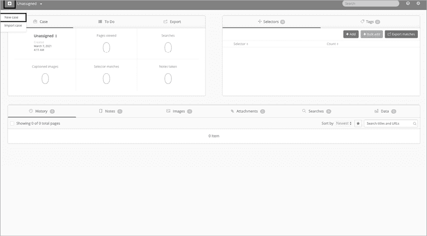

图 5-16：创建新案件

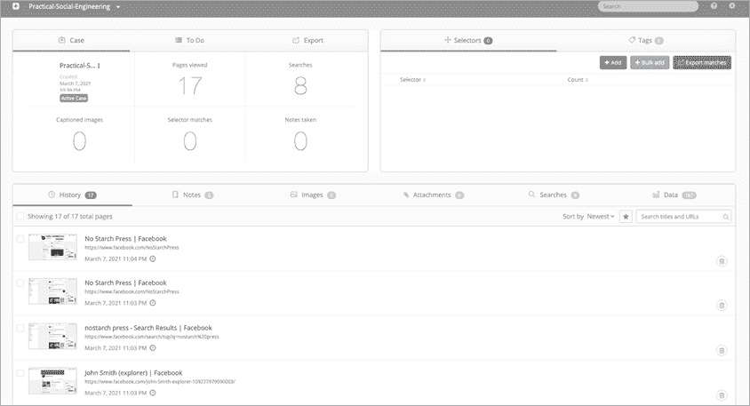

图 5-17：带有工件的 Hunchly 仪表盘

如果你选择一个特定的文物，你可以查看截图和相关信息，例如你搜索的内容、对应搜索的 URL 路径、你收集的日期、网站更新的日期以及截图的哈希值。如果你出于法律原因收集 OSINT 并将截图作为法庭证据，这些信息至关重要。

## 偷窃 SEC 表格

美国的上市公司必须提交各种文档和表格以保持合规。这些文件向 SEC 证明所有报告的信息是真实的，并且公司没有违反任何法律。由于这些文件对公众开放，因此它们是一个很好的 OSINT 来源。

要查找一家公司的 SEC 表格，请浏览 SEC EDGAR 网站（[`www.sec.gov/edgar/searchedgar/companysearch.html`](https://www.sec.gov/edgar/searchedgar/companysearch.html)）。你可以在 Investopedia 上了解更多关于各种 SEC 表格的信息，[`www.investopedia.com/articles/fundamental-analysis/08/sec-forms.asp`](https://www.investopedia.com/articles/fundamental-analysis/08/sec-forms.asp)。

一个特别有用的表格是 SEC 表格 10-K，这是公司年度报告。它提供了公司财务状况的概述，包括执行团队、董事会、过去一年遇到的问题以及他们关心的风险。SEC 要求公司在财政年度结束后的 90 天内提交这些表格，因此发布日期可能会有所不同。

通过使用沃尔玛 2018 年的 10-K 表格和年度报告，让我们来检查一些 OSINT 评估的重点。例如，沃尔玛 2018 年的年度报告中写道：

> 我们正在为我们的员工提供更好的信息、工具和培训，帮助他们获得成功。在商店里，这意味着我们的员工将更多时间用于推动销售，而较少时间从事重复性的任务。我们已经开设了培训学院，以进一步提升员工的零售技能，并部署了新技术和应用，帮助他们提高库存水平和更好地管理价格变化。

这让我们知道了两件事：公司称其员工为*员工*并且开设了培训学院，这些信息可以用来建立联系。在撰写钓鱼攻击的邮件时，你甚至可以直接引用这样的报告（参见第七章中的这一策略示例）。

10-K 表格首先会说明财政年度何时结束，这让我们了解相对于财政季度的紧迫程度。在表格稍下方，我们可以看到公司注册地、总部地址、邮政编码和主电话号码，以及其雇主识别号（EIN）。

在沃尔玛 2018 年的 10-K 表格中，你可以找到以下有用的信息：

**关于将公司名称从*沃尔玛商店公司*更改为*沃尔玛公司*的声明**

1.  这在与员工和供应商互动时可能会有用。

**名为“影响我们业务的风险因素和不确定性”的一节**

1.  这是一个极好的参考资料，帮助攻击者理解公司的商业模式以及它如何看待威胁。

**沃尔玛用于在互联网上开展业务的网站列表**

1.  在这里，我们还看到了沃尔玛认为的竞争对手。例如，在关于其仓储会员制商店 Sam's Club 的部分中，它提到了 Costco。

**关键人物名单**

1.  这份高层员工名单可以用于虚假电话和钓鱼攻击。我们还可以看到员工的角色和年龄，这可能有助于我们监控他们的社交媒体。

**沃尔玛如何使用技术的讨论**

1.  这使我们能够看到沃尔玛如何减轻和看待与其信息技术基础设施相关的威胁。

**关于沃尔玛法律活动的见解**

1.  这可以为我们提供更多关于公司运作的背景，或者帮助我们锁定法律部门的某个人。

**执行独立第三方审计的审计公司信息**

1.  这为我们的借口提供了更多的背景信息。

**董事会成员的介绍及其背景**

1.  这为我们提供了更多有关沃尔玛如何开展业务的信息。同时，也提供了我们可以用来构建可信的借口，针对其员工进行攻击的信息。

你还应该寻找其他表格，如 8-K（重大状态变动）和 10-Q（季度报告）。8-K 通常涉及股票的授予或出售。10-Q 是 10-K 的增量版本，每季度发布，但详细程度较低。

## 结论

本章节说明了社交媒体和其他公开资源的有用性（以及危险）。在本章节收集到的信息是构建社交工程攻击的良好基础。虽然我们应该仅武器化我们所需要的信息，但讨论那些我们发现但没有在报告中使用的信息同样重要，因为我们发送给客户的报告是为了帮助他们变得更加安全。毕竟，我们不是仅仅为了获得访问权限、炫耀一下然后下次重复同样的操作。

OSINT 不仅仅是收集关于某一目标的所有信息。OSINT 的一部分是分析数据并找到利用它的方法。对一些人来说，OSINT 既是一种思维方式，也是一项技术能力。你不需要成为一个顶级黑客（从技术角度来说），也能在 OSINT 中表现得很好，甚至达到精英水平。社交工程也是如此。
