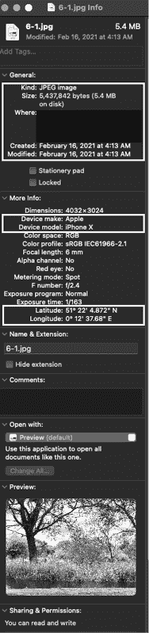

# 第六章：收集关于个人的 OSINT


虽然前几章重点讨论了收集关于企业的 OSINT，本章则集中于使用一系列工具收集关于个人的 OSINT。你将学习如何通过寻找个人的兴趣爱好、不喜欢的事物、社交关系和密码重置问题等信息来锁定目标。我们还将继续利用目标对抗企业，收集他们在工作场所拍摄的照片、简历、投诉或抱怨、工作炫耀以及旅行等信息，仅举几例。

## 使用 OSINT 工具分析电子邮件地址

通常，当你开始进行攻击时，手头只有一个电子邮件地址。虽然这足以进行钓鱼攻击，但你可能需要更多关于目标的信息，以执行其他任务。在这些情况下，你可以利用电子邮件地址收集更多关于目标的信息，如用户名、照片、社交媒体账户和物理位置。以下工具允许你仅通过电子邮件地址搜索与个人相关的 OSINT。

所有这些信息都会通过我所称的*OSINT 心跳*进行传递。OSINT 心跳是指扩展和收缩你收集到的信息——使你能够在微观层面专注于目标，然后再向外扩展，关注邻近的人、账户和关联，在宏观层面进行拓展。OSINT 心跳的最重要方面是辨别哪些信息具有情报背景，哪些则没有。这个过程对于避免过于专注目标而导致的视野狭窄非常重要，这种狭隘的视角会让你错过其他重要数据点。

### 通过 Have I Been Pwned 查找用户是否被泄露

Recon-ng 中的`hipb_breach`和`hibp_paste`模块搜索 Troy Hunt 的 Have I Been Pwned (HIBP)网站([`haveibeenpwned.com/`](https://haveibeenpwned.com/))及相关数据库，以确定输入的电子邮件地址是否涉及任何数据泄露事件。

我经常使用这些模块来构建关于目标公司员工如何使用工作邮箱的档案。这是衡量公司安全项目成熟度的一个良好指标。例如，一些人，如管理社交媒体账户的人，可能需要将 Facebook 或 LinkedIn 账户与工作邮箱关联。然而，清洁工或初级技术支持人员可能就不需要这样做。

要在 Recon-ng 中使用 HIBP 模块，只需加载模块，将`SOURCE`字段设置为你要搜索的电子邮件地址或列表，然后输入`run`命令：

```
[recon-ng][book] > **modules search hibp**
[*] Searching installed modules for 'hibp'...
  Recon
    recon/contacts-credentials/hibp_breach
    recon/contacts-credentials/hibp_paste
[recon-ng][default][hibp_breach] > **run**
[*] bill@nostarch.com => Breach found! Seen in the Adapt breach that occurred on 2018-11-05.
[*] bill@nostarch.com => Breach found! Seen in the AndroidForums breach that occurred on 2011-10-30.
[*] bill@nostarch.com => Breach found! Seen in the AntiPublic breach that occurred on 2016-12-16.
```

你也可以手动在 HIBP 的主网站上搜索记录。有些出现的记录是私密的，这意味着只有在你能通过自动化的邮件流程确认你拥有该邮箱，或者确认你拥有整个域名（或是该域名的授权系统管理员）时，才能查看这些记录。要检查整个域名中的每个邮箱，你必须能够证明所有权，通常通过 DNS TXT 记录来验证。Ashley Madison 交友网站被黑事件就是一个例子。

### 使用 Sherlock 枚举社交媒体账户

*Sherlock* ([`github.com/sherlock-project/sherlock/`](https://github.com/sherlock-project/sherlock/)) 是一个由 Sherlock 项目编写和维护的 Python 3 工具。它搜索各种社交媒体网站以查找用户名。Sherlock 检查的网站列表比其他工具要短，但仍然很有用。

要安装和使用 Sherlock，请按照以下步骤进行：

```
**git clone https://github.com/sherlock-project/sherlock**
**cd sherlock**
**pip3 install -r requirements.txt**
**python3 sherlock.py** `OPTIONS USERNAME`
```

Sherlock 将提供类似于 WhatsMyName 和 Recon-ng 的结果。使用你偏好的工具，但总是使用多个工具来提高你收集数据的质量或准确性。

### 使用 WhatsMyName 枚举网站账户

*WhatsMyName* ([`github.com/WebBreacher/WhatsMyName/`](https://github.com/WebBreacher/WhatsMyName/)) 是由 Micah Hoffman 编写的工具，用于枚举某个特定用户名存在的网站。这是检查用户行为和网络活动的有效方式。你也可以在 Recon-ng 中以 `profiler` 模块的形式运行 WhatsMyName。此外，Chris Poulter 在 OSINT Combine 与 Hoffman 合作，创建了一个 WhatsMyName 网站应用程序 ([`whatsmyname.app/`](https://whatsmyname.app/))。

在撰写本文时，WhatsMyName 检查了超过 250 个网站。要限制检查的网站数量或向列表中添加内容，只需按照正确的 JSON 语法编辑 *web_accounts_list.json* 文件，如下所示：

```
 {
         "name" : "YouTube",
         "check_uri" : "https://www.youtube.com/user/`account`/videos",
         "account_existence_code" : "200",
         "account_existence_string" : "name\" content=",
         "account_missing_string" : " This channel does not exist",
         "account_missing_code" : "404",
         "known_accounts" : ["test"],
         "category" : "video",
         "valid" : true
      }
```

如果你想检查一个不在 JSON 文件中的网站，你可以简单地研究该网站如何处理 HTTP 请求，包括它使用的参数和预期的 HTTP 响应码。然后，你只需将该条目复制到文件中。

使用以下命令运行 WhatsMyName：

```
**root@kali:/opt/WhatsMyName# python3 web_accounts_list_checker.py -u nostarchpress**
 -  190 sites found in file.
 -  Looking up https://500px.com/nostarchpress
 -  Looking up https://9gag.com/u/nostarchpress
`--snip--`
 -  Looking up https://api.github.com/users/nostarchpress
[+] Found user at https://api.github.com/users/nostarchpress
 -  Looking up https://gitlab.com/nostarchpress
[+] Found user at https://gitlab.com/nostarchpress
 -  Looking up https://www.goodreads.com/user/show/nostarchpress
 -  Looking up https://www.gpsies.com/mapUser.do?username=nostarchpress
```

当你执行脚本时，WhatsMyName 检测到账户的每个网站旁边应该会出现一个 `[+]` 标志。

## 使用 Pwdlogy 分析密码

*Pwdlogy*（发音为 *Password-ology*）是由 tch1001 编写的工具，它允许黑客基于目标用户经常使用的术语和对他们有意义的主题来构建单词列表。你需要做一些手动分析，然后填充一个列表。该工具随后通过添加字符并交替改变输入的字符，扩展这个列表，生成一个更长的单词列表。攻击者可以使用这个单词列表进行密码猜测攻击和相关活动。

虽然表面上看这对社交工程师似乎不是特别有用，但通过一些巧妙的方法，它可以派上用场。例如，假设你正在钓鱼一个特定用户，并且获得了使用密码重置作为借口的批准。换句话说，你可以通过向用户询问信息，可能是通过发放调查问卷或在闲聊时获取。利用这些信息，你可以在 Pwdlogy 中填充列表并用于测试。如果你要钓鱼的用户不到 10 个，你可以通过这种方式发现他们是如何创建新密码的。如果你要钓鱼的用户有成百上千个，这种方法可能就不太有效了。

要安装并使用 Pwdlogy，请输入以下命令：

```
**git clone https://github.com/tch1001/pwdlogy**
**cd pwdlogy**
**python3 pwdlogy**
```

这些命令将把 GitHub 上的代码克隆到你的系统中，然后将你移到相应的目录并用 Python 执行它。要为 Pwdlogy 创建你的列表，使用 OSINT 收集关于每个用户的以下信息：

+   配偶、兄弟姐妹、父母和孩子的名字

+   宠物的名字

+   喜爱的词语和数字

+   生日

作为防御者，你可以限制用户使用这个列表中任何变种作为密码，并要求他们选择不同的密码。这将有助于减少有人猜测用户密码的概率，但对于密码重用或由于公司外部数据泄露而导致的密码填充问题无济于事。

另外，你也可以在对话中使用这个列表，或者通过钓鱼手段来引起目标的注意。例如，询问受害者的配偶或孩子的情况，并提到名字。渗透测试人员可能会使用这些信息进行*密码喷洒*（这是一种尝试在多个用户名中使用相同密码的攻击方式，相较于传统的*密码破解*，后者是针对单一用户尝试多个可能的密码）或其他技术手段来访问账户。

## 分析目标的图片

在本章中，我展示的一些搜索结果揭示了图像，进一步分析这些图像可以为我们提供关于目标的重要信息。我在查看图片进行 OSINT 分析时，会关注四个方面。

首先，我看的是*前景*，也就是这张图片究竟要传达什么信息，无论是关于一个人、一场景，还是其他任何东西。接着，我会查看*背景*。例如，是否有俗气的酒店墙纸，可能将这张图片与特定的地点或连锁酒店联系起来？然后，我会注意图片中*缺失*的部分。这里应该有什么？我把它当作一种对比两张图片的挑战。是否有东西被 Photoshop 移除了？有东西被移出了画面？

最后，我会查看*可交换图像文件格式（EXIF）*数据。EXIF 格式是静态图像的标准，它定义了数字相机、智能手机及其他系统生成的图像、声音和其他标签。由于所有相机和智能手机都能生成此类数据，因此我们可以收集关于图片及拍摄者的不同级别的 OSINT 信息。

在本节中，我将介绍几种分析 EXIF 数据的方法。

### 手动分析 EXIF 数据

让我们分析图 6-1 中显示的图片的 EXIF 数据。


图 6-1：学生发送给我进行分析的图像

要分析 EXIF 数据，在 Mac 上右键点击图像并选择**获取信息**。在 Windows 和 Linux 上，右键点击图像并选择**属性**。这应该会打开一个可以查看 EXIF 数据的窗口（图 6-2）。

在这里，我们看到图像类型以及我下载它的时间。我们得到图像的尺寸，拍摄该图像的相机品牌和型号——在这个例子中是 iPhone X。底部显示了拍摄该图像的地点的纬度和经度，这是智能手机通常包含的信息。

### 使用 ExifTool 分析图像

*ExifTool*是一个可以自动分析 EXIF 数据并提供比手动分析更多信息的工具。这些信息对于在现场对公司进行概况分析、了解公司文化，或者针对移动设备进行利用攻击时可能尤其有用。另一个有用的应用场景是，如果你参加了 Trace Labs 的 Search Party CTF（[`www.tracelabs.org/getinvolved/ctf/`](https://www.tracelabs.org/getinvolved/ctf/)）。



图 6-2：在 MacBook 上获取 EXIF 信息

要在 Kali 中安装 ExifTool，运行以下命令：

```
**apt-get install exiftool**
```

要分析一个文件，运行以下命令：

```
**exiftool**`filename`
```

你也可以使用 Jeffrey 的图像元数据查看器（[`exif.regex.info/exif.cgi`](http://exif.regex.info/exif.cgi)），这是 ExifTool 的在线版本。如果你不想下载文件，或者仅仅在处理在线图像时，这是非常有用的。你可以向工具提供一个文件或链接，它会在屏幕上显示结果。

让我们从查看 MACB 时间开始*。* *MACB*是一个取证术语，用来描述文件的*修改*、*访问、更改*和*“诞生”*（创建）时间。在这个例子中，它显示了我从电子邮件中下载此文件的时间：

```
root@kali:~/Documents# **exiftool IMG_4438.JPG** 
ExifTool Version Number         : 11.65
File Modification Date/Time     : 2019:09:14 00:41:45-04:00
```

接下来，在文件类型之后，你会看到相机的品牌与型号，以及拍摄照片时设备的朝向，并且闪光灯没有被使用：

```
File Type                       : JPEG
JFIF Version                    : 1.01
Exif Byte Order                 : Big-endian (Motorola, MM)
Make                            : Apple
Camera Model Name               : iPhone X
`--snip--`
```

软件字段也非常重要，因为在这种情况下，它告诉我们拍摄照片的手机正在运行的 Apple iOS 版本：

```
Software                        : 12.3.1
Create Date                     : 2019:08:03 11:39:02
`--snip--`
Scene Type                      : Directly photographed
Custom Rendered                 : Portrait HDR
```

接下来，你会看到镜头的品牌与型号。这应该与相机的品牌与型号相似。在这种情况下，你可以看到使用的是 iPhone X 的后置双摄像头，并且图像拍摄地点位于北半球和东半球（基本上是欧洲或部分亚洲地区）：

```
Lens Info                       : 4-6mm f/1.8-2.4
Lens Make                       : Apple
Lens Model                      : iPhone X back dual camera 6mm f/2.4
GPS Latitude Ref                : North
GPS Longitude Ref               : East
GPS Altitude Ref                : Above Sea Level
GPS Speed Ref                   : km/h
GPS Speed                       : 0.2333080322
```

*图像方向*是摄影师所指向的方向（在 0.000 到 359.99 度之间）：

```
GPS Img Direction Ref           : True North
GPS Img Direction               : 221.1058655
`--snip--`
Digital Creation Time           : 11:39:02
Digital Creation Date           : 2019:08:03
```

在最后的分析部分，你可以看到手机离开充电器的时间、海拔高度以及纬度和经度：

```
Image Size                      : 4032x3024
Megapixels                      : 12.2
Scale Factor To 35 mm Equivalent: 8.7
Shutter Speed                   : 1/163
Create Date                     : 2019:08:03 11:39:02.291
Date/Time Original              : 2019:08:03 11:39:02.291
GPS Altitude                    : 16.6 m Above Sea Level
GPS Latitude                    : 51 deg 22' 4.87" N
GPS Longitude                   : 0 deg 12' 37.68" E
Date/Time Created               : 2019:08:03 11:39:02
Digital Creation Date/Time      : 2019:08:03 11:39:02
```

这使你能够通过使用地图应用程序确认照片拍摄地点。例如，如果这是一张放在桌子上的解锁 Windows 7 电脑的照片，你可以使用这些坐标来找出照片拍摄地点的地址，以及可能是拍摄地点所在公司的名称。

现在让我们来试试这个。获取纬度和经度，然后将其输入到谷歌地图中，生成图 6-3 所示的图像。


图 6-3：从 EXIF 数据中提取的纬度和经度的谷歌地图条目

这个场景确认了照片是在英国 Eynsford 的 Darent 河畔的 Plough Inn 附近拍摄的。

## 无工具分析社交媒体

在本节中，我将讨论社交媒体平台在 OSINT 收集中的最有用的方面。一般来说，你应该关注习惯、文化和联系。*习惯*包括用户发布内容的频率、他们使用的术语以及类似的行为。*文化*包括个人或组织遵循的规范。*联系*，或者说目标网络中的其他用户，是一个棘手的问题。我不建议通过与个人账户互动的方式进行联络，因为这些账户不是你所在公司拥有的。

### LinkedIn

在 LinkedIn 上，检查目标是否是*LinkedIn 开放网络者（LION）*，或者是否接受所有连接请求。还可以列出他们的同事，查看他们的信息，这些信息可能包括一些成就。你还可能会找到电子邮件地址或链接到他们的其他社交媒体网站。

### Instagram

在 Instagram 上，你可以看到目标最常与谁互动。你还可以确认某个人的真实样子，而不仅仅是他们的头像，从而建立一个档案，帮助你像他们花时间交往的人一样行事。人们通常不愿承认，但他们通常会和某种类型的人交往。

### Facebook

Facebook 可能会让你了解到比你想知道的更多信息，或者相反，它可能就像是从萝卜里挤出血液。有些人非常注重隐私，而 Facebook 提供了最细致的隐私控制，典型的设置包括仅自己、特定朋友、仅限朋友、朋友的朋友和公开。

如果某人在 Facebook 上公开分享，你可以了解他们的关系、旅行以及政治和宗教信仰。即使某人将隐私设置为“朋友”或更严格，你仍然可以看到他们公开发布或评论的所有内容（比如当地新闻），除非他们屏蔽了你。

### Twitter

在隐私控制方面，Twitter 只有三个选项：保护/锁定、屏蔽和默认。*保护/锁定*允许用户批准谁可以查看他们的推文。这不同于屏蔽；如果用户*屏蔽*另一个用户，但没有设置保护/锁定，屏蔽的用户仍然可以通过另一个账户查看对方的推文。如果设置了保护，那么他们必须提交请求才能获得批准。*默认*设置会将所有内容展示给所有人，除非他们被屏蔽或静音。Twitter 对于收集公众人物、技术专家、新兴技术的早期采用者、政治评论员和体育迷的信息特别有用。

## 案例研究：那顿让所有黄金都消失的晚餐

前些时候，我在一家当地的餐馆吃晚餐。我坐在两位女士旁边，从她们的对话听起来，像是老朋友在叙旧。第一位女士——我们叫她 Wanda——提问最多，而另一位女士——我们叫她 Tammy——则毫不保留地分享信息。

Wanda 问 Tammy 在哪里工作，Tammy 回答了公司名称，并解释了这个名字的由来（是老板名字的变体）。她说自己在那儿工作了五年，并解释了她为公司做的工作，透露那是一家面包店。接着，她倾诉了自己的沮丧并谈到了她的成就。

Wanda 问 Tammy 是否已经结婚了。Tammy 谈到了她的前男友 Steven 以及他们共同抚养 Leif 的事情。她还提到了 Steven 的妈妈，住在塔尔萨，并告诉 Wanda，Steven 的妈妈有点害怕 Leif。我想知道：哪位祖母会害怕自己的孙子孙女？等一下，我想，也许 Leif 不是一个人类孩子。果然，Wanda 问 Tammy 是否想要亲生孩子，Leif 是什么品种的。Tammy 则谈到了她的身体形象和一些健康问题，然后告诉她朋友 Leif 是一只一岁的杂交狗。

最后，Tammy 谈到了她的新男友 Dick 以及他作为一名喜剧演员的职业。Wanda 问 Dick 对分享 Leif 的抚养权有什么看法，Tammy 则讲述了 Dick 和 Steven 一起做了几件事，并且一起去看音乐会的故事。

这看起来可能无害，但通过这次对话，我发现了以下内容，以及我是如何得知的：

**面包店老板的名字**

1.  我搜索了面包店的名字，然后查看了 Facebook 上的评论和回复评分。

**面包店老板的女儿和员工的名字**

1.  我浏览了面包店的照片，然后在 Facebook 上找到了老板的公开关系状态。

**老板女婿的名字**

1.  同样，通过公开的关系状态记录来查找所有者的信息。

**塔米的名字**

1.  我开始发挥创意，阅读烘焙店的 Facebook 评论。通过对话得知塔米五年前开始在烘焙店工作，于是我在那个时间段内寻找评论。我发现了一条没有文字或推荐语的五星评论，并通过她的个人资料图片认出了评论者。

**迪克的身份，男朋友**

1.  我检查了塔米在 Facebook 上的照片和关系状态，并通过他 Facebook 页面上列出的关系状态和职业进一步确认了这个发现。

**史蒂文的身份，前男友**

1.  塔米有三个 Facebook 朋友叫史蒂文，但其中只有一个人的母亲住在塔尔萨。我通过查看照片并与 Leif（顺便说一句，是一只非常丑的狗）的资料交叉验证确认了这个发现。

**塔米和迪克的家庭地址，以及家中的照片**

1.  在查看了他们的 Facebook 页面上的线索后，我还检查了梅丽莎物业数据探索器中的物业记录和 Google 街景。

如果落入不法之手，这些信息可能成为身份盗窃、入室盗窃甚至更严重事件的燃料。这种情况该如何避免或预防呢？

+   我本可以选择不听。但一旦你进入了 OSINT 和社会工程学领域，就很难完全关闭这种兴趣。

+   塔米和旺达本可以少说一些，或者说得更轻声。塔米、迪克、史蒂文和旺达可以在社交媒体上使用更好的分享设置和隐私控制。所有人都可以在说话或发布内容时模糊一些，或者使用虚假信息来让社会工程师迷失方向。

## 结论

收集人物 OSINT 的目的是更好地了解员工可能给雇主带来的威胁，并在社会工程学互动中可能与他们建立联系。人物 OSINT 的来源有很多，包括照片、朋友、社交媒体，以及一些日常信息，如电子邮件地址、用户名和 IP 地址。为了以道德方式使用这些工具，应将其视为了解公司，而不是个人的手段。记住：远离与个人账户的互动。
