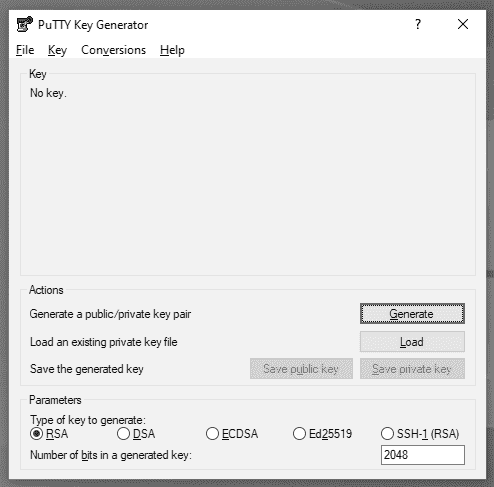
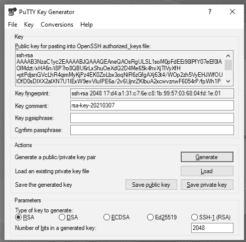
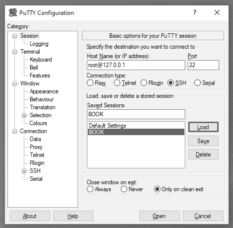
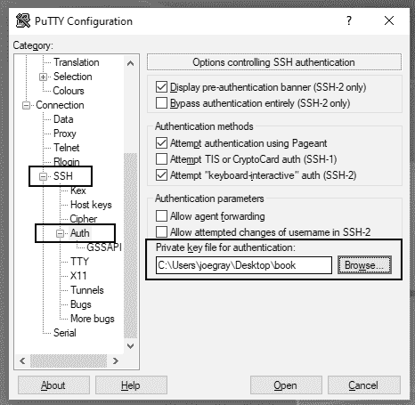
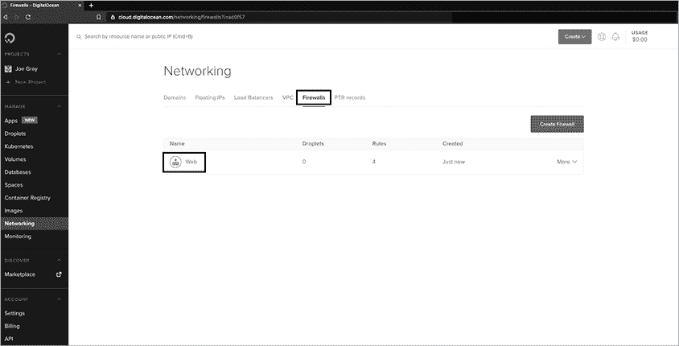
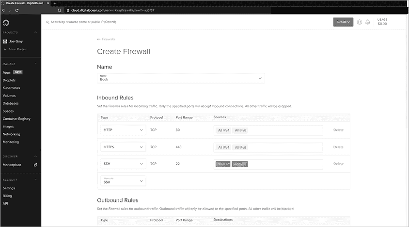
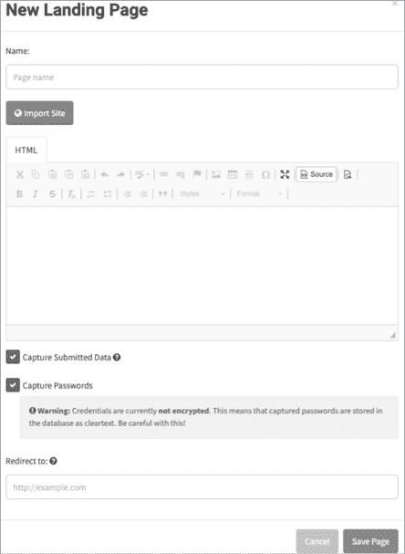
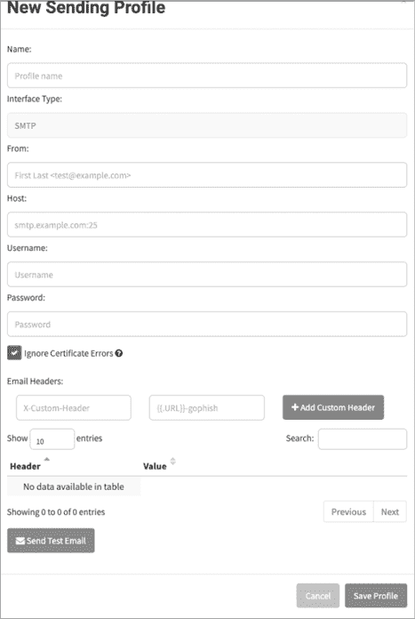
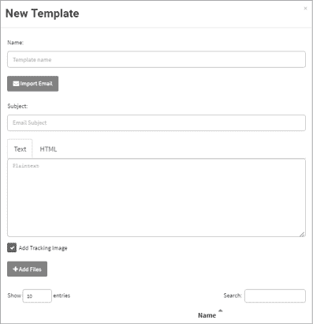
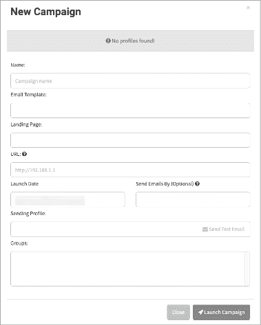

# 第七章：网络钓鱼


在本章中，你将创建一个网络钓鱼活动。我们将介绍如果你想手动创建攻击所需的基础设施，然后讨论自动化解决方案、你可以在攻击中加入的技术功能，如跟踪像素，以及在部署前需要考虑的因素，以确保活动的成功。本章应帮助任何社会工程师开始进行基于邮件的攻击，也可能为系统管理员提供复习，或为来自安全运营中心或合规角色的人提供信息性指南。

## 设置网络钓鱼攻击

网络钓鱼攻击所需的架构会有所不同。你需要的工具完全取决于任务的范围、工作说明书（SOW）、合同以及客户的需求。例如，如果客户希望你衡量有多少员工点击了邮件中的可疑链接，你只需要一个简单的 Web 服务器来捕获 HTTP GET 请求，并向用户显示 404 页面或“感谢”页面。响应将被存储在 Apache 日志中。

从这里开始，事情变得更加复杂。客户是否希望你进行伪装或蹲守？你可以*伪装*一个合法的域名，发送邮件并操控显示给接收者的信息，使其看起来像是来自合法来源，但伪装是很容易被发现的。

*蹲守*（Squatting），一种类似的技术，风险较低，且不容易被抓住。它涉及注册一个类似于目标接收者域名的域名，比如将公司*.com*的域名注册成*.co.uk*。这样，你的邮件看起来就像是来自合法的域名——至少对那些不仔细查看的人来说是这样。

接下来，你的客户是否希望你收集用户凭证或其他敏感信息，如密码重置问题？如果是这样，你的邮件将需要链接到一个网页，要求以令人信服的方式输入这些信息。或者，你的客户是否希望你发送恶意文档？如果是，你需要创建这些文档，并找到一个地方托管它们，同时避免被安全工具标记。

他们是否希望你使用自动化的网络钓鱼解决方案，比如 King Phisher 或 Gophish？如果你经常进行网络钓鱼攻击，你可能已经有了自动化的设置，但即便如此，你可能仍需要进行一些修改或输入你自己的邮件设计。最成功的社会工程师不仅理解架构的技术细节，还能把握人类因素，这使他们的攻击能够成功。

在本节中，你将设置一个复杂的网络钓鱼攻击，旨在欺骗用户并避免检测。通过设置自己的 VPS、邮件服务器和登录页面，你将能够发送看起来来自合法公司邮件地址的邮件。在邮件正文中，你会包含一个链接，引导用户访问一个网页，促使他们输入凭证。

### 为网络钓鱼登录页面设置安全的 VPS 实例

无论你在参与过程中做什么，几乎总是需要一个 VPS 实例。通过 VPS，你可以托管一个登陆页面并运行邮件服务器（如果需要），而无需将你的攻击行为与你的 IP 地址关联。

在这一节中，我将向你展示如何使用 DigitalOcean 设置一个安全的 VPS。DigitalOcean 是一家云基础设施公司，允许你在其平台上进行安全研究。**滴灌（Droplets）**是 DigitalOcean 的 VPS 实例，起始价格较低，且包含备份、快照、存储卷、DNS、CDN、负载均衡、一键应用和网络防火墙等功能。你可以选择多种 Linux 和 BSD 操作系统、容器以及预装的应用程序，如 Node.js、LAMP、WordPress、GitLab 和 Docker。

请注意，DigitalOcean 在纽约、旧金山、多伦多、班加罗尔、阿姆斯特丹、法兰克福、伦敦和新加坡设有数据中心。这些位置很重要，因为某些地区会过滤特定的内容，而一些公司则会根据国家过滤流量。此外，如果你处理的是欧洲公民的数据，你应该就欧盟 GDPR 寻求法律建议。

理想情况下，你应该在任务开始前至少两周就设置好你的 VPS、域名和 Web 服务器。这是因为一些邮件服务器安全平台会拒绝来自成立不到两周的域名的所有邮件。

#### 创建 DigitalOcean 账户和滴灌

要设置 DigitalOcean 滴灌，你需要先创建一个账户。访问 [`www.digitalocean.com/`](https://www.digitalocean.com/) 并按照页面上的注册说明操作。我建议启用账户的双重身份验证，以防他人通过破解你的密码访问你的账户。

登录后，选择 **创建**▶**滴灌（Droplet）**。选择你所需的操作系统。我推荐使用 Kali 或 Debian Linux。然后根据需要调整滴灌的配置，确定所需的处理器数量和内存大小。滴灌连接的用户越多，它所需的处理能力也会越大。如果是一个针对大约 150 个用户的小型任务，标准滴灌应该能正常运行。接下来，你可以选择使用 IPv6、私有网络、备份或你自己的 RSA 密钥。你还可以添加主机名或创建多个滴灌。

一旦创建完成，你应该能够看到滴灌的 IP 地址。DigitalOcean 会通过电子邮件发送初始的 root 凭据给你，并附上 IP 地址。如果你上传了 SSH 密钥对，按照下一节的描述，你可以使用这些信息进行登录。如果没有，DigitalOcean 会通过电子邮件发送临时的 root 密码，但在第一次登录后你会被提示更改密码。

#### 创建 SSH 密钥对以保护 VPS

拥有强身份验证方法很重要，因为这个服务器是面向互联网的。当我使用 DigitalOcean 运行*蜜罐*——故意设计成脆弱的系统，目的是被攻击，以便研究人员研究攻击者的技术和行为，或提醒管理员系统被攻击——这些主机受到了扫描器和潜在攻击者的猛烈攻击。

为了防止攻击者暴力破解你的密码，创建 SSH 密钥对。SSH 密钥对，也称为*RSA 密钥对*，是一对用于登录的私有和公有 RSA 密钥。你将私钥（默认是`id_rsa`）复制到远程系统，并将公钥（默认是`id_rsa.pub`）复制到*authorized_keys*文件中，以允许登录。SSH 密钥还可以禁用密码认证。

首先，在终端中执行以下命令：

```
**ssh-keygen -t rsa**
Enter file in which to save the key (/root/.ssh/id_rsa): 
Enter passphrase (empty for no passphrase): 
Enter same passphrase again: 
Your identification has been saved in /root/.ssh/id_rsa.
Your public key has been saved in /root/.ssh/id_rsa.pub.
cat ./.ssh/id_rsa.pub > ./.ssh/authorized_keys
```

`ssh-keygen`命令会生成密钥对。默认情况下，密钥会出现在 VPS 的*/root/.ssh*目录下。你可以通过向`ssh-keygen`命令传递`-C /path/`选项，后跟所需的文件路径，来选择将密钥写入特定位置。你可能还需要为 SSH 密钥设置一个密码短语，以创建第二重身份验证因素。在创建密钥对时，系统会提示你输入密码短语。如果你不想使用密码短语，直接按回车键继续。

你需要在用来控制 VPS 的系统上访问 VPS 密钥对。为此，可以使用安全复制协议（SCP）或 SCP 客户端。如果你使用的是 Windows 主机，可以使用*WinSCP*，它是一个终端仿真器，允许 Windows 用户通过 FTP、SSH 和 Telnet 直接连接到 Linux 主机。如果你使用的是 Mac 或 Linux 主机，可以使用类似原生终端、iTerm2、Cyberduck 或 Termius 的 SCP 客户端。这将允许你在 Droplet 之间移动 RSA 密钥。你也可以稍后使用 SCP 客户端将文件等工件在 Droplet 之间移动。

使用 WinSCP 复制文件时，使用你创建的凭据（密码或 RSA 密钥对）登录 VPS，然后在 GUI 中拖放文件即可。你需要确保文件具有正确的权限。运行命令`chmod 600``filename_of_private_key`以确保你设置了正确的权限。

#### 设置 Windows 远程访问 VPS

一旦你将 RSA 密钥移动到工作站，安装一个客户端来为你提供 VPS 的远程访问。你需要远程访问以便在 VPS 上设置登录页面并配置其他服务，如邮件服务器。

在 Windows 上，你可以使用 PuTTY 工具进行远程访问。从 PuTTY 官方网站下载 PuTTYgen，[`www.putty.org/`](https://www.putty.org/)。然后，通过将 RSA 私钥导入到该软件中，创建一个 PuTTY 私钥（PPK）文件，用于 PuTTY 和 WinSCP。在 PuTTY 密钥生成器窗口中，点击**生成**（图 7-1）。

将 `id_rsa` 密钥从主机导入到 PuTTYgen 中。你应该能看到以 PPK 格式生成的密钥，如图 7-2 所示。



图 7-1：PuTTYgen



图 7-2：创建 PPK

接下来，将密钥加载到 PuTTY 会话中。为此，将你的用户名或滴滴（droplet）的 IP 地址输入 **Host Name (or IP Address)** 字段中（见图 7-3）。



图 7-3：PuTTY 配置

然后从左侧窗格中选择 **Connection**▶**SSH**▶**Auth**（见图 7-4）。在 **Private key file for authentication** 字段中输入 PPK 文件的文件路径。最后，点击左侧窗格顶部的 **Session**，为实例命名并保存。要连接到主机，点击 **Open**。



图 7-4：配置 PuTTY 使用 PPK

现在你已经配置了 PuTTY 使用 SSH 密钥，输入你设置的密码短语（如果设置了的话）来登录到 VPS。更新所有包并运行任何未完成的安全更新，以保护自己免受公共互联网的攻击。

#### 设置 macOS 或 Linux 远程访问 VPS

如果你从 macOS 或 Linux 操作系统访问 VPS，你需要先将 RSA 私钥复制过去，可以通过 SCP 或复制粘贴完成。这可以通过终端来操作。执行以下命令来复制密钥（在这个例子中，我已经屏蔽了 IP 地址）：

```
root@******:**~/.ssh# scp root@***.***.***.***:/root/.ssh/id_rsa ./id_rsa**
```

如果你使用像 Termius 这样的远程访问工具，它是一个付费解决方案，允许你保存 SSH 会话，那么你不需要复制文件，但你需要将文件的内容复制并粘贴到你的钥匙链中。为此，执行以下命令：

```
root@******:**~****#cat ./.ssh/id_rsa**
```

如果使用终端通过 SSH 连接，执行以下命令来获得访问权限：

```
root@******:**~# chmod 600 id_rsa**
root@******:**~# ssh -i id_rsa root@***.***.***.*****
```

如果一切正常运行，你将在 VPS 上看到最后登录的提示，以及任何需要更新的包。如果密钥配置不正确，你将看到一个错误，指示出了问题所在。

#### 禁用基于密码的认证

既然你已经连接，接下来要采取措施确保你的 VPS 保持安全。首先，移除通过密码登录系统的能力。（这不会影响你以后安装的任何 Web 应用程序。）任何登录到此 VPS 的人都需要 RSA 私钥，这种密钥极难（如果不是不可能的话）进行暴力破解，而不像密码那样容易。

通过执行以下命令，确保 *authorized_keys* 文件包含你之前创建的公钥：

```
root@******:**~# cat id_rsa.pub >> ./.ssh/authorized_keys**
```

在文本编辑器中打开 *sshd_config* 文件，并将 `#PasswordAuthentication yes` 更改为 `PasswordAuthentication no`。

为此，执行以下命令：

```
root@******:**vi /etc/ssh/sshd_config**
```

保存文件后，重新启动 SSH。你需要在 `ssh` 命令中定义密钥以连接到 VPS：

```
root@******:**chmod 600**`key_file`
root@******:**ssh -I**`key_file``user`**@**`VPS_IP_address`
```

然后输入你创建的密码短语（如果有的话）。

#### 安装防火墙

接下来，你需要一个防火墙来限制 VPS 上某个应用程序可以访问的端口以及哪些主机可以访问 VPS。这将防止漏洞扫描机器人和攻击者连接到 VPS，避免连带损害。如果尚未安装 *Uncomplicated Firewall*（`ufw`），请安装它：

```
root@******:**apt-get install ufw**
```

现在，确保通过发出 `ufw enable` 来启用防火墙。接下来的步骤将创建新规则来控制数据进出 VPS 的流动：

```
root@******:**ufw allow from** `your_IP_address` **to any**
root@******:**ufw allow from any to** `your_IP_address`
root@******:**ufw enable**
```

你可以在特定端口上运行防火墙，而不是在所有端口上，通过将 `port` `port_number` 添加到源地址或目标地址的 IP 地址中。

要设置防火墙，请登录到 DigitalOcean 并导航到左侧面板中的**网络**菜单。接下来，选择**防火墙**。如果你已经有连接到 DigitalOcean 的防火墙，从列表中选择它，如图 7-5 所示。



图 7-5：设置 DigitalOcean 防火墙

如果你还没有防火墙，点击绿色的**创建**按钮，并从下拉菜单中选择**防火墙**。这将带你到一个页面，如图 7-6 所示，提示你创建传入规则。*传入规则*决定了 VPS 如何与进入的连接进行交互。*传出规则*则决定了 VPS 在尝试连接其他主机时的行为，有时也称为 *出口过滤*。



图 7-6：创建 DigitalOcean 防火墙

由于你可能会用这个主机进行网络钓鱼，你可能希望让 web 服务器对外公开。根据你与客户的合同，你可能希望将访问限制在客户 IP 范围内。如果你将服务器用于托管恶意脚本以便进行钓鱼，这样做也是一个好主意。这样可以防止网络爬虫和威胁情报公司抓取你的网站并发现它，这是一种迅速被列入黑名单和威胁情报源（这些源会被入侵检测系统、SIEM 程序和其他防御技术收录）的方式。

若要仅允许特定 IP 地址范围访问你的服务器，请为 HTTP（TCP 端口 80）和 HTTPS（TCP 端口 443）创建一个入站规则，接受来自**所有 IPv4**和**所有 IPv6**的入站连接，除非满足前述条件。确保创建一个入站规则，允许你从任何你个人使用的 IP 地址通过 SSH 连接到主机。

你的 VPS 提供商提供的系统镜像可能没有完全更新。要更新 Linux 系统，执行以下命令：

```
**apt-get update -y; apt-get upgrade -y; apt-get dist-upgrade** 
```

`apt-get update`命令会列出已更新的包，`apt-get upgrade`执行更新，`apt-get dist-upgrade`更新内核以及软件依赖项。`-y`开关会默认对你可能收到的大多数提示回答“是”。

### 选择电子邮件平台

既然你已经有了 VPS，现在需要选择实际用于发送电子邮件的服务。虽然你可以使用 Yahoo!或 Gmail 的免费电子邮件账户，但如果你假装是权威人士，这可能会引起怀疑。免费电子邮件账户在某些攻击中可能有效，例如针对人力资源的攻击，在这种攻击中你假装是求职者。然而，在大多数情况下，使用非免费的域名更好，因此你需要搭建一个电子邮件服务器。

可用的服务使用多种协议发送邮件，每种协议都有其优缺点。关于选择协议，John Carl Villanueva 的博客文章《管理文件传输与网络解决方案》（[`jscape.com/blog/smtp-vs-imap-vs-pop3-difference/`](https://jscape.com/blog/smtp-vs-imap-vs-pop3-difference/)）是一个全面的资源。电子邮件协议包括以下几种：

**简单邮件传输协议（SMTP）**

1.  在 RFC 5321 中定义。默认使用 25 端口，也可以使用 587 端口和 465 端口。

**互联网邮件访问协议（IMAP）**

1.  在 RFC 3501 中定义。使用 143 端口（或者对于 SSL/TLS 连接使用 993 端口）。

**邮局协议 v3（POP3）**

1.  在 RFC 1939 中定义。使用 110 端口（或对于 SSL/TLS 连接使用 995 端口）。

如果你计划伪造电子邮件，你必须使用 SMTP。POP3 和 IMAP4 不支持伪造，但可以用于占位。如果你有自主权决定使用哪个电子邮件服务器，你可以选择以下几个选项：

**Dovecot**

1.  一个适用于 Linux/Unix 类系统的开源 IMAP 和 POP3 邮件服务器。它体积轻巧，意味着它占用很少的内存，并且不需要大量的处理能力。像任何软件一样，你必须保持安全的配置，并及时更新系统，以保持安全。如果你进行的是偶尔、低量的钓鱼攻击，这种维护可能不值得花费时间和精力，尽管软件是免费的。如果你从大量域名中进行钓鱼，或每天发送多封邮件，这可能是一个更经济的解决方案。由于 Dovecot 不支持 SMTP，它不支持伪造身份。你可以使用 Dovecot 进行域名劫持攻击。

**Sendmail**

1983 年首次发布的原始互联网邮件客户端之一。它实现了 SMTP，目前由 Sendmail 联盟和 Proofpoint（一家钓鱼意识与预防公司）维护。与 Dovecot 相同的考虑因素同样适用于 Sendmail。尽管 Sendmail 是开源软件，但其维护者试图防止钓鱼攻击，这可能会让一些社交工程师感到不安。由于 Sendmail 使用 SMTP，你可以使用它进行伪造身份或域名劫持攻击。

**云邮件**

1.  Microsoft 365 是微软的基于云的电子邮件服务，Google Workspace 是谷歌的基于云的企业邮件服务。两项服务按用户、按月或按年收费，并且可以通过任何有互联网连接的设备访问。两者都支持 SMTP、POP3 和 IMAP4，虽然默认使用 IMAP。你可以将 Microsoft 365 或 Google Workspace 绑定到你拥有的任何域名，因此它们适用于域名劫持攻击，但不适用于身份伪造。

**谷歌邮件（Gmail）**

1.  根据我的经验，Google 不允许你通过电子邮件或 Google Drive 发送恶意软件（即使是宏启用的 Office 文档）。然而，如果你进行钓鱼攻击，Google 不会关闭你的账户。撰写本文时，你可以通过 Namecheap、Bluehost、SiteGround 或 GoDaddy 等服务为你的域名获取 Google Workspace，费用大约是每位用户每月 $6。大多数钓鱼域名采用短期使用方式，即每个客户只使用一次。如果你是唯一进行钓鱼攻击的人，你只需要为一个用户付费。如果是这种情况，你每个钓鱼活动的费用可能不超过每个客户 $6。

在选择这些选项时，需牢记以下几点。首先，伪造邮件很容易被捕获，许多邮件系统都有检测伪造的逻辑。此外，许多与邮件系统独立的应用程序，如 Exchange、Proofpoint 和 Mimecast，能够验证电子邮件并阻止伪造攻击。另一方面，即使目标实施了像发送者策略框架（SPF）、域密钥识别邮件（DKIM）或基于域的邮件身份验证、报告和一致性（DMARC）等反钓鱼工具，你仍然可以成功进行拼写错误和域名抢注。SPF、DKIM 和 DMARC 是旨在防止伪造的技术解决方案。实际上，如果这些工具被实施，它们会防止其他方伪造你的域名，因此值得为你的声誉实施，但它们对防止伪造你的组织作用有限。

攻击者通过**Squatting**（域名抢注）也可以绕过像 Mimecast 这样的技术，它们试图通过查看电子邮件中的统计数据、邮件发送域名的年龄和信誉来拦截钓鱼邮件。如果发送域名没有不良声誉或使用与钓鱼一致的语言，除非管理员设置了特定规则，否则应该能够通过这些过滤器。即便目标启用了 SPF 或其他解决方案，使用 Google Mail（适用于域名）和 Microsoft 365 等云服务发送邮件通常会绕过这些过滤器，因为 Google 和 Microsoft 的邮件服务器几乎是普遍信任的。

第三，自动化钓鱼解决方案有几种方法可以与 Dovecot、Sendmail 或云服务提供商的电子邮件服务集成。然而，自动化解决方案可能会在邮件中添加代码、水印或签名，这些内容会被邮件过滤器和其他防御技术检测到。

在配置邮件服务器之前，你需要为其创建 DigitalOcean 的防火墙规则，并更新你 Droplet 上的 UFW，提供你所使用的协议（SMTP、IMAP 或 POP3）的信息，以允许通信。使用接下来的步骤“设置钓鱼和基础设施 Web 服务器”来为你选择的邮件服务器创建防火墙规则。

### 购买发送和着陆页域名

接下来，你需要购买两个域名：一个用于托管*着陆页*，这是你将把点击你邮件中的链接的受害者引导到的页面，另一个用于托管你发送钓鱼邮件的网站。着陆页的域名可以选择便宜的域名，比如 88 美分的*.tech*或*.info*域名。你将为链接申请一个长子域名，这样使其看起来合法性不那么重要。

用来发送电子邮件的域名应该是更为知名的顶级域名之一，如 *.com*、*.net*、*.org*、*.io* 或 *.us*。我的主要建议是确保购买一个启用了域名隐私的域名，而 *.us* 域名不允许这样做。*域名隐私* 是域名注册商提供的一项服务，允许你将匿名化的个人数据作为域名的 WHOIS 联系信息。这样，别人就无法将你与你的域名关联起来。如果发生任何需要通知的情况，注册商将充当你和发件人之间的中介。你不希望你的名字或你雇主的名字与钓鱼域名关联，否则威胁情报专家将会不懈追查并列举出你所有的域名和网站。

一旦你获得了钓鱼用的域名，将其附加到你选择的邮件平台，并按照提示进行操作，以获取对其的访问权限。如果你进行的是更高级的钓鱼活动，考虑在你的域名上实施技术邮件控制（如 SPF、DKIM 或 DMARC），因为你将进行域名劫持而非伪造。

### 设置钓鱼和基础设施 Web 服务器

现在你已经拥有了 VPS 实例和电子邮件服务，你必须设置一个能够接收传入连接、收集凭证、托管恶意脚本并执行你特定攻击所需操作的 web 服务器。在本节中，我将向你展示如何使用 Apache，这是一款免费且开源的 web 服务器软件包。Apache 文档丰富，且相对简单易用。

要安装 Apache，请执行以下命令：

```
root@********:**~# apt-get update -y**
root@********:**~****# apt-get install apache2 -y**
```

安装完成后，通过输入以下命令验证 Apache 是否已在 UFW 允许的进程/服务列表中：

```
**ufw app list**
```

现在，你需要最小化能够访问 Apache 实例的 IP 地址范围，以防止第三方访问你的服务器。我建议只允许从你将连接到 VPS 的 IP 地址、任何测试或质量保证的 IP 地址，以及目标组织的 IP 范围（理想情况下，应该由安全联系人在合同中书面提供）。要将服务器限制在此范围内，请执行以下命令：

```
**ufw allow from** `IP_address or CIDR`**to any port**`web_port; 80 or 443`
**ufw enable**
```

使用 `ufw status` 命令验证状态：

```
root@********:**~# ufw status**
Status: active
To                         Action      From
--                         ------      ----
Anywhere                   ALLOW       ***.***.***.*** 
***.***.***.***            ALLOW       Anywhere 
22                         ALLOW       ***.***.***.***
```

安装完成后，暂时使用以下命令关闭 Apache：

```
root@********:**~# service apache2 stop**
root@********:**~# systemctl stop apache2**
```

即使没有运行 Apache，你仍然可以进行配置更改、绑定域名以及执行其他管理任务。关闭 Apache 可以最大程度地减少服务器被安全扫描或蜘蛛爬取的可能性。

在第八章中，你将克隆一个逼真的登陆页面，并将其托管在该服务器上。

## 钓鱼的附加步骤

本节讨论的步骤对于成功的钓鱼攻击并非必需，但它们提供了一些客户可能会偶尔请求的服务。

### 使用追踪像素来衡量电子邮件被打开的频率

如果你正在进行一个非自动化的测试，比如本章到目前为止描述的那种，你可能需要一种方法来查看有多少人打开了你的电子邮件。你可以轻松实现这一点，使用*跟踪像素*，它们通常是 1x1 像素的图像，每个用户都是唯一的，并且从你拥有的远程站点呈现。然后，你可以查看访问日志，查看每个 ID 连接到服务器的实例。

在电子邮件中添加以下 HTML 代码片段，以设置跟踪像素：

```

```

创建用于监控跟踪像素的文件，*tracker.php*。它应该类似于这样：

```
<?php
  // Create an image, 1x1 pixel in size
  $im=imagecreate(1,1);
  // Set the background color
  $white=imagecolorallocate($im,255,255,255);
  // Allocate the background color
  imagesetpixel($im,1,1,$white);
  // Set the image type
  header("content-type:image/jpg");
  // Create a JPEG file from the image
  imagejpeg($im);
  // Free memory associated with the image
  imagedestroy($im);
?>
```

跟踪像素通常用于营销和销售。在钓鱼攻击中，它们会给攻击者带来麻烦并浪费时间。自动化解决方案会内置这些像素。打开电子邮件的数量在钓鱼攻击中是一个被过度强调的指标。让受害者报告他们收到钓鱼邮件或采取了行动，比统计有多少人打开邮件要重要得多。

### 使用 Gophish 自动化钓鱼攻击

*自动化钓鱼解决方案* 是一种服务，允许你开发钓鱼邮件并通过自动化系统（如内建的邮件接口）发送。该解决方案通常会监控信息，如钓鱼邮件被打开的次数和打开者，受害者点击邮件中链接的次数，以及每个事件发生的时间。这些服务使用起来很方便，有时它们也是最经济的选择。然而，由于它们是众所周知的，通过这些服务发送的钓鱼邮件很可能会被捕捉并关闭。

在本节中，我将向你展示如何使用 Gophish 发送钓鱼邮件。Gophish 是一个用 Go 语言编写的自动化钓鱼工具。要使用它，你需要一个 SMTP 服务器来发送邮件，并需要一个 Web 服务器让受害者访问。虽然你可以在 Gophish 中创建这两个组件，但这样做可能会增加被检测的机会。我建议设置以下三个防火墙规则，以防止被检测或造成附带损害：

1.  只允许从你的网络访问端口 3333/TCP（Gophish Web 管理界面的端口）和端口 22（SSH 端口）。

1.  只允许从你的网络和受害者 IP 范围访问端口 80/TCP（你的登录页面的默认端口，尽管你可以使用带 SSL/TLS 证书的端口 443 来增加真实性）。

1.  只允许出站方向访问端口 25/TCP（SMTP 流量的端口）。

要在 UFW 中设置这些规则，请执行以下命令：

```
**ufw allow from** `your_IP_address` **to any port 3333**
**ufw allow from** `your_IP_address, QA_IP_address, and/or target_IP_range/CIDR` **to any port 80 (443 if using HTTPS)** 
**ufw allow from any port 25 to any**
**ufw enable**
```

现在，让我们安装 Gophish：

```
**cd /opt/**
**git clone https://github.com/gophish/gophish**
**cd gophish**
**apt-get install golang -y**
**go get github.com/gophish/gophish**
**go build**
```

配置 Gophish 监听你将用来连接的公共或私有 IP 地址：

```
root@********:**/opt/gophish# vi config.json**
```

在 *config.json* 文件中，将 `admin_server listen_url` 更改为你管理钓鱼攻击的 VPS 的 IP 地址。然后，将 `phish_server listen_url` 更改为你发送钓鱼邮件给受害者的 IP 地址或域名：

```
 "admin_server": {
                "listen_url": **"127.0.0.1:3333"**,
                "use_tls": true,
                "cert_path": "gophish_admin.crt",
                "key_path": "gophish_admin.key"
        },
        "phish_server": {
                "listen_url": **"0.0.0.0:80"**,
                "use_tls": false,
                "cert_path": "example.crt",
                "key_path": "example.key"
        },
        "db_name": "sqlite3",
 "db_path": "gophish.db",
        "migrations_prefix": "db/db_",
        "contact_address": "",
        "logging": {
                "filename": ""
        }
}
```

登录后，请务必更改管理员密码。Gophish 的默认凭据如下：

```
Username: admin
Password: gophish
```

我建议你立即前往左侧面板的**设置**菜单，并更改你的密码。即使只有你一个人在使用 Gophish，也应该创建一个新用户。如果有多人将登录此账户，你必须创建不同的用户。为此，点击**用户**标签，选择**新用户**，然后填写页面上的表单。

接下来，你需要一个地方来发送受害者。你可以通过**登录页面**标签下的**新登录页面**来创建（图 7-7）。



图 7-7：在 Gophish 中设置新的登录页面

你可以从头开始构建登录页面，也可以将另一页面的 HTML 复制并粘贴到这里。

接下来，你需要知道在发送钓鱼邮件时，你假装成谁，并且需要哪个邮件服务器（以 `ip_address:port` 格式）来发送邮件。你可以在**发送配置文件**标签下的**新发送配置文件**中进行配置（图 7-8）。



图 7-8：在 Gophish 中设置新的发送配置文件

现在你知道了是谁在发送电子邮件，邮件是如何到达目的地的，以及你希望它执行什么操作，接下来是创建实际的电子邮件。一种方法是导入现有的电子邮件——比如说，HR 部门的 Erica 两周前收到的邮件——并将其作为模板。Gophish 会使用你导入的电子邮件的格式、样式和语言。你可以在**电子邮件模板**标签下的**新模板**中进行配置（图 7-9）。



图 7-9：在 Gophish 中设置新的电子邮件模板

你已经拥有了所需的一切。让我们将它组织成一个*活动*，将你所做的所有部分集合起来，发送给客户。你可以在**活动**标签下的**新活动**中进行配置（图 7-10）。



图 7-10：在 Gophish 中设置一个活动

填写完这个表单后，你所需要做的就是启动活动，等待结果。

### 为钓鱼登录页面添加 HTTPS 支持

一些用户会寻找带有绿色锁形图标的 HTTPS 网站，作为判断网站是否为钓鱼攻击的一种标志。攻击者注意到了这一点，并开始在他们的网站中使用 HTTPS。通过使用 Let's Encrypt，我们也可以免费做到这一点，并为客户提供更真实的体验。

Let's Encrypt 是一个免费的自动化开放证书授权机构（CA），旨在为公众提供服务。它是互联网安全研究小组（ISRG）提供的服务，是实现 HTTPS（免费！）的绝佳方法。让我们为 Gophish 安装 Let's Encrypt：

```
root@***********:~# cd /opt/**
root@***********:~# wget https://dl.eff.org/certbot-auto**
root@***********:~# chmod a+x certbot-auto**
root@***********:~# ./certbot-auto certonly -d** `your_domain` **--manual --preferred-challenges dns**
```

安装完成后，按照屏幕上的提示完成 DNS 验证并完成设置。

如果你手动设置钓鱼攻击，过程类似。（请注意，设置不会自动续期。如果你长时间不进行操作，每三个月你需要执行脚本来续期。）

```
root@**********:~# apt-get install git**
root@**********:~# git clone https://github.com/letsencrypt/letsencrypt /opt/letsencrypt**
root@**********:~# cd /opt/letsencrypt**
root@**********:~# sudo -H ./letsencrypt-auto certonly --standalone -d example.com -d www.example.com**
```

在输入完这些命令后，系统会提示你输入一些信息。所有验证完成后，运行此命令来验证安装：

```
**sudo ls /etc/letsencrypt/live**
```

### 在钓鱼攻击中使用 URL 缩短工具

URL 缩短工具（如 *Bitly*）可以使目标页面不那么容易被识别。当决定是否使用它们时，考虑钓鱼攻击的难度和目标组织的成熟度。有些组织会尝试过滤电子邮件中的缩短 URL，其他组织则会训练用户避免点击这些链接。是否使用缩短工具，应该与您的安全联系人讨论。如果选择使用，请理解这些链接可能会被从电子邮件中剥离。

### 使用 SpoofCard 进行呼叫伪造

对于语音钓鱼攻击，你只需要一个呼叫伪造平台，如果目标地区允许，还需要一个记录通话的工具。

*SpoofCard* 是一个移动应用程序，它允许你伪造号码、拨打电话、录音，甚至在通话中注入背景噪音。该应用程序本身是免费的，但你需要购买积分才能使用它。

## 时间和交付考虑

现在你已经设置好了攻击，接下来需要实际执行它。在执行之前，你应当考虑两个与时间相关的因素。

第一点是你在准备架构和实际执行操作之间有多少时间。你投入到项目中的时间将决定你被检测到使用技术控制手段（如电子邮件过滤器或威胁情报源）的可能性。一个匆忙完成的项目很可能容易被发现，但如果客户需要更高级的方案，你需要有时间进行适当的研究，了解公司用语、文化以及他们使用的技术，这样当你发送活动时，你才能看起来像是一个拥有授权访问的内部人员。底线是什么？如果不必要的话，不要急于完成。有时候，客户需要你迅速行动，但这应该是例外，而不是常态。

第二，谨慎选择执行渗透测试的日期和时间。选择合适的时机需要进行研究。例如，如果你是在进行电话钓鱼攻击（vishing），你可以屏蔽自己的号码并静音线路，然后在接下来的几周里，每周的同一天同一时间进行拨打，看看谁会接听。此外，还要注意你是否在工作时间内执行渗透测试。如果你假扮成一名员工，不管你是伪装还是蹲点，那个员工的工作时间安排是什么？如果在进行钓鱼攻击时，你假扮成一个从早上 6 点到下午 5 点，星期一到星期四工作 10 小时的员工，在下午 5 点 45 分发送邮件——更糟的是，星期五发送——可能不是一个好主意。

## 案例研究：25 美元的高级持续钓鱼攻击

这是我如何以一种创意十足且相对低廉的方式钓鱼一个组织的故事。在这个过程中，我成功地发送了一个高质量的钓鱼邮件，绕过了该组织的技术防御，并进入了毫无防备的员工邮箱。

在这次渗透测试的范围电话会议中，我的目标公司联系人提到，CEO 将在两周内退休，COO 将接替他的职位。基于这些信息，我制定了一个计划。当我与联系人分享我的想法时，他称我为一个狡猾的疯子，并批准了这个计划。是时候开始实施这个计划了！

为了设置我的钓鱼攻击，我遵循了本章中描述的过程。首先，我创建了一个 DigitalOcean 的 droplet。因为这是一个涉及 150 个目标的短期渗透测试，我不需要一个空间或处理能力特别大的 droplet，所以我注册了一个 5 美元的 droplet。由于 DigitalOcean 按小时计费，费用在月末支付，到目前为止我没有花费任何费用。*总费用：0 美元*。

这个攻击的时间安排并没有给我太多时间使用第五章和第六章中讨论的方法来收集 OSINT（开放源情报）。相反，我将精力集中在列举目标公司的域名、记录相关员工的姓名，并在公司网站、行业期刊以及新闻稿中查找 CEO 和 COO 的直接引用。

下一步是购买发送和登录页面的域名。目标域名是一个*.com*顶级域名，所以我购买了相应的*.us*域名。这个花费了大约 12 美元，因为我有一个 Namecheap 域名注册公司的促销代码。接下来，我购买了一个类似*surveysofsatisfaction.life*的网页域名。这个便宜的域名花费了我 88 美分。我还为电子邮件域名订阅了 Google 应用，每月花费 5 美元。*总费用：17.88 美元*。

我将网页域名配置为解析到我的 droplet 的 IP 地址。然后，我为该域名免费安装了 Let’s Encrypt TLS/HTTPS 证书。我使用 HTTrack 获取了 SurveyMonkey 的完美克隆（正如你将在第八章中做的那样），然后从目标公司网站上获取了一个高分辨率的 logo 并添加到页面中。

我将着陆页配置为指向 https://<目标公司名称>.surveysofsatisfaction.life，使其看起来像是目标公司在调查网站上拥有自己的子域名。我再次使用了 SurveyMonkey 和目标公司的标志。我还添加了提示，要求用户提交他们的电子邮件地址和密码，然后将这些凭据通过 HTTP GET 请求传递给 Apache 日志。

在第二页，我设置了常见的密码重置问题：母亲的娘家姓、第一所学校、蜜月地点以及小学的名称。我将这些信息以相同的方式传递给了日志。

最后，我创建了第三页，上面写着“抱歉，调查已关闭”，并启动了一个无限循环。这个循环最初是一个编码错误，但我选择将其保留，作为给目标员工的提示，表明这不是一个合法的调查。

接下来，我编写了电子邮件，引用了首席执行官和首席运营官的直接引语。我还发现了公司用来称呼其员工的特定术语*Owner-Associates*，所以我也使用了这个术语。我选择以首席运营官的身份发送这封钓鱼邮件。我通过一个随机账户发送了邮件，并从他的自动回复中获得了他的电子邮件签名。

电子邮件的内容大致如下：

> 亲爱的 Owner-Associates：
> 
> 正如你们所知，我将在下周接替史蒂夫担任首席执行官，结束他 37 年来无私奉献的服务。这是一个巨大的责任，但我会尽最大努力。<在此插入首席运营官的直接引用>。
> 
> 多年来，我们经历了起伏，并致力于做得更好。我计划在<新闻稿中提到的要点>方面进行改进。正如史蒂夫所说，<来自即将退休的首席执行官媒体采访中的直接引用>。
> 
> 正如你们中的一些人所知，我致力于不断改进为客户、合作伙伴、供应商，最重要的是，Owner-Associates 的服务。这就是为什么我与人力资源部合作，设置了一个 SurveyMonkey 调查，以改善<公司名称>的各个方面。请使用以下链接，在周五营业结束前完成此调查。
> 
> <Bitly 链接到网站域名>
> 
> <从自动回复中盗取的签名>

我与我的联系人确认了这封钓鱼邮件的可接受性，并获得了绿灯可以继续操作。我将邮件从谷歌应用程序中分批发送，每次发送 10 到 20 封，每隔 5 到 10 分钟发送一次，以避免触发潜在的警报。尽管我的邮件最终被封锁，但我成功发送了足够多的邮件，收到了来自目标 IP 地址的大量调查反馈。

我将网站保持在线一周，然后在接下来的星期一验证信息，发现我收到了更多员工的反馈。一名员工多次输入了信息并且更改了密码。我与联系人协调，结束了这次行动。我保留了滴灌服务器一周，以防他需要更多信息。我收集了度量数据，控制了外出回复和未发送的邮件（我们将在第九章讨论如何收集度量数据）。根据合同，我不得提供输入的密码，只能提供输入密码的员工姓名。我对网页和 Apache 日志进行了备份并保存，然后删除了滴灌服务器。整个过程持续了两周。*总成本：22.88 美元。*

在订阅的第 29 天，我登录了我用来发送钓鱼邮件的电子邮件账户，确认没有重要信息后取消了该服务。一名员工将该电子邮件地址添加到了多个高度敏感的邮件和邮件列表中。*无价。*我立即告知了我的联系人并将邮件转发给他。我写了报告，然后结束了这次行动。

如果我是一个真正的坏分子，这次钓鱼攻击可能会导致灾难，而这次攻击的成本却不到 25 美元。

基于我提供的信息，这次攻击本可以如何被缓解或防止？

+   公司本应对所有用户进行如何评估可疑邮件内容的培训。教导他们在有疑问时向安全部门寻求帮助，特别是当涉及到缩短的 URL 时。

+   公司本应实施 Proofpoint 或类似的解决方案，将*【外部】*添加到电子邮件主题行的开头。

+   公司本应训练员工评估他们访问的页面 URL。

+   安全团队和网络团队之间本可以有更好的协调。更好的沟通本可以避免网络负责人向公司发送关于该电子邮件的邮件，从而引起对该电子邮件的注意，而不是在电子邮件到达之前悄悄将其从收件箱队列中移除。

+   应该有一个更好的社会工程攻击应急响应计划。

## 结论

成功的社会工程攻击需要充分的计划和技术配置。本章介绍了如何设置一个钓鱼攻击，收集用户凭据而不被发现。首先，你需要设置一个 DigitalOcean 的滴灌服务器，确保服务器的安全，并配置服务器的防火墙。然后，你学习了如何搭建一个真实的邮件服务器。

在钓鱼攻击的过程中，你将不得不做出许多决策。我们讨论了如何选择一个适合的域名用于你的电子邮件账户，以及如何选择你将引导用户访问的着陆页面。我们还讨论了如跟踪像素、自动化钓鱼服务、HTTPS 支持和 URL 缩短工具等附加功能。我们同样讨论了非技术方面的内容，比如攻击的时机。

在下一章中，你将搭建一个合法网站的真实克隆，你可以利用它来收集用户凭证和敏感信息——或者用于其他一些阴险的目的。
