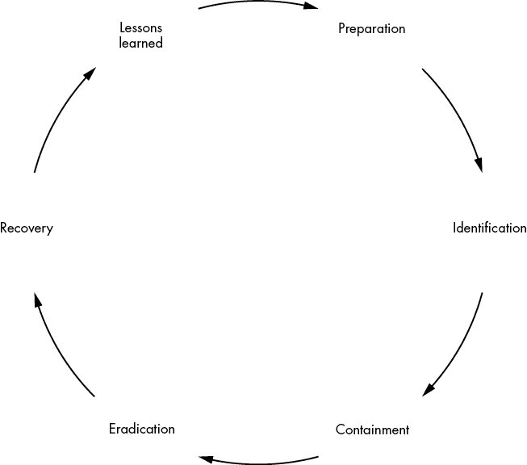

# 10

主动防御技术

> 你只要讲真话，就不必记住任何东西。
> 
> —马克·吐温

现在我们已经讲解了社会工程学和开源情报收集的基础知识，是时候讨论一个组织如何尽量减少这些攻击的影响，甚至完全防止它们了。虽然你很少能够阻止所有攻击，但你可以采取措施来降低攻击的成功率，并在攻击成功时减轻其造成的损害。

本章介绍了三种技术：意识提升计划、声誉监控和事件响应。我们将讨论成功的意识提升计划的要素，解释如何实施开源情报监控和技术邮件控制，提供与事件响应的集成，最后，生成威胁情报。

## 意识提升计划

*意识提升计划*是公司为用户提供指导的计划，帮助用户在遇到——或者不幸成为受害者——社会工程学攻击时作出反应。这些计划至关重要，因为它们能够让用户了解攻击者可能使用的策略，尽管这些用户可能已经在接收钓鱼邮件，但却不会遭遇潜在的负面后果。

进行这些培训的一种方法是向用户讲解安全行业中的常见趋势。提供这种类型的普遍建议通常是不够的。希望本书前几章已经帮助你理解，传统的安全指南——例如在浏览器地址栏中寻找绿色小锁，注意电子邮件中的拼写和语法错误，检查链接地址——已经不足以防止钓鱼攻击。当然，一些攻击者仍然会犯这些错误。但那些能够对组织造成灾难性伤害的高级攻击者可不会犯这些错误。

更好的方法是让用户了解组织因为钓鱼攻击所面临的具体问题。例如，如果组织正遭遇类似尼日利亚王子邮件的激增，或者一场伪装成首席财务官的攻击性商务邮件妥协活动，让用户了解这些细节将更有助于他们抵御这些攻击。用户很可能会遇到其中某种具体攻击，因此他们应该知道如何留意这些攻击。

### 如何以及何时进行培训

虽然培训应该经常进行，以保持用户对当前趋势的意识，但你也不应该让培训干扰他们的日常工作。提供足够频繁的意识提升活动，让用户能够牢记教训而又不至于造成困扰，这是一项微妙的平衡。我建议至少每季度进行一次培训。虽然每月一次的培训能提供更多的安全保障，但它们可能会给用户和管理人员带来不便。

在此周期性教育活动中，您应该提供自上次培训以来，组织收到的钓鱼邮件示例。如果您的组织进行了任何测试，您还可以分发类似于第九章中讨论的统计数据。最重要的是，您应该告诉用户，如果他们收到钓鱼邮件，应该采取哪些步骤，如果他们成为受害者，又该如何处理。

在讨论钓鱼邮件示例时，指出任何表明邮件是假冒的线索。从逻辑、语言和技术角度进行分析。特别注意任何违反标准操作程序或常理的请求。例如，可以提出这样一个问题：为什么正在泰国度假的首席财务官需要您释放 4500 万美元，将其发送到 PayPal 账户，然后再发送短信到伯利兹的某个号码？指出其中的语法错误，包括缺失关键短语、不同的拼写习惯（例如美国使用*organize*而其他地区使用*organise*），或员工称呼的不当（沃尔玛使用*associate*，迪士尼使用*cast member*）。教导用户将鼠标悬停在链接上，查看邮件试图引导他们访问的页面。鼓励他们将可疑邮件转发给安全团队。并且不鼓励他们在没有与安全团队沟通之前转发链式邮件或回复可疑邮件。

在一种成功的项目类型中，名为“本月安全思考”培训，安全团队每次讨论一个与社会工程学相关的概念，或任何与安全相关的话题。这些概念可以与之前或即将进行的工作交叉，也可以补充当前事件。例如，在美国，雇主在 1 月为员工提供税表，以便他们能够在 4 月 15 日的报税截止日期前完成申报。巧合的是，许多成功的 W-2 钓鱼攻击发生在 1 月的前几周。同样，9 月或 10 月通常是讨论身份盗窃和电子商务的最佳时机，因为这正好在假日购物季节之前。

### 非惩罚性政策

人们未能报告自己成为钓鱼邮件受害者的主要原因之一，无论是点击、下载还是填写网页表单的信息，是因为他们感到尴尬或担心自己的工作。但如果成功的钓鱼攻击未被报告，可能会导致显著的停机时间，或者如果组织成为勒索病毒的受害者，还可能需要购买比特币或苹果礼品卡来解锁。

员工应该知道，报告自己成为社会工程攻击受害者是可以接受的。尽管这可能意味着他们需要完成额外的培训，但他们不应该因此而更新简历。许多社会工程公司在与客户签订的合同中设有条款，防止员工因测试而被解雇。（据我所知，这种条款尚未在法院审理过。）我个人并未参与过关于这种条款的诉讼，也不太了解任何与此相关的案件。在尝试在合同中实施此类条款之前，请咨询你的法律顾问。

在少数情况下，如果员工无法理解安全意识的概念，可能需要解雇他们。这种情况发生在员工成为比资产更大的负担时。然而，解雇员工应该是最后的手段。首先，应该尽力训练员工，包括超出典型安全意识项目的培训。同时，还可以尝试实施额外的技术控制措施。

### 对良好行为的奖励

虽然惩罚他人的错误不符合你的利益，但加强良好行为的反馈是有帮助的。然而，正确地做到这一点是一个微妙的平衡。之所以微妙，是因为有时人们会试图利用系统漏洞。

为了举一个激励措施可能出错的例子，可以参考 2016 年富国银行的事件。在 2009 年到 2015 年间，富国银行为员工设定了不切实际的销售目标。银行后来发现，这些目标激励了 5300 名员工创建虚假的富国银行账户，有些是为家人和朋友创建的，但也有些是为陌生人创建的。管理层在发现这些陌生人开始产生费用时才意识到这一问题。

为了防止员工利用系统漏洞，避免提供针对报告*最多*钓鱼尝试的奖励。这类激励会促使员工将自己的电子邮件添加到钓鱼邮件列表中，从而增加安全团队的工作量。相反，你可以激励员工报告*巧妙*或*独特*的钓鱼邮件，报告通过所有钓鱼模拟的邮件，或者采取类似的措施。核心思路是奖励报告行为，特别是巧妙或独特的钓鱼尝试，而不是奖励报告的数量。如果一个组织根据报告的数量来奖励，而员工故意让自己的邮件出现在钓鱼邮件列表中，最终可能会有一封看似真实的邮件出现，用户会成为受害者；与此同时，安全团队则忙于分析他们转发的其他邮件。

这里有一些你可以提供的免费或低成本奖励：

+   因报告独特或广泛传播的钓鱼邮件而获得 15 分钟的休息时间

+   一张价值 10 美元的亚马逊或星巴克礼品卡

+   一周的停车位

+   参加大奖抽奖

+   一周的免费午餐

为员工提供任何被认为有价值的奖励，以表扬他们做得好的表现，有助于强化您希望看到的良好行为。这本身就是一种社会工程，但它旨在为员工和组织带来积极的成果。

### 进行钓鱼攻击演练

尽管有争议，将钓鱼攻击演练作为培训的一部分可以可靠地让员工接触到真实的钓鱼攻击尝试，并允许您测试整个组织的反应。

在决定模拟钓鱼攻击演练后，您应该做出的第一个决定是是否在内部进行，还是聘请第三方来执行此任务。为了选择最适合您公司的选项，请问问自己您计划多频繁地进行此类演练以及预算是多少。如果是外包，钓鱼攻击演练可能需要每次演练 4 到 24 小时的计费工作，具体取决于工作范围、要求和复杂度。如果您更愿意在内部进行测试，您需要弄清楚谁将负责执行演练，他们的其他职责是什么，以及他们离开岗位将对您的安全态势产生什么影响。如果您有预算购买像 Proofpoint、Cofense 或 KnowBe4 等非咨询公司的钓鱼模拟服务，您也可以选择这种方式。

## 声誉和开放源信息（OSINT）监控

积极的开放源信息监控和积极的社会工程同样至关重要。*开放源信息监控*，即定期对自己或客户进行开放源信息的监测，有时也被称为*品牌和声誉*监控或*暗网监控*。无论哪种形式，开放源信息监控的好处在于它允许组织看到潜在攻击者可以看到的信息。这使得组织能够在攻击发生之前采取适当的措施，无论是尽可能删除数据、增加监控，还是实施虚假信息或欺骗。

由于开放源信息（OSINT）主要是被动的，您无法通过模拟来训练用户，防止攻击者收集 OSINT。检测的机会很少。在许多情况下，OSINT 可能来自用户账户，组织无法强制用户删除社交媒体上的内容，除非这些内容通过《数字千年版权法》（DMCA）或其他法律标准侵犯了知识产权。

### 实施监控计划

在实施开放源信息监控计划时，重点应该放在查找可能对业务构成风险的信息上。不要将其作为监视或侵犯员工个人生活的手段。确保您的测试保持道德的一个简单方法是将开放源信息监控外包（下文将讨论“外包”）。

如果你的组织决定实施自己的 OSINT 和声誉监控计划，它需要决定在何种参数范围内操作。在此过程中，它必须定义要测试的内容、测试的时间和测试的方式。由于员工可以随时发布任何内容，进行月度或季度测试是一个不错的做法。否则，设置网络钓鱼攻击时需要考虑的许多因素同样适用于此。测试将是自动化还是手动的？预算是多少？期望的参与深度如何？范围是什么？你将如何确保尊重员工的隐私以及他们在社交媒体上的发帖自由？

确定需要进行多少手动测试将直接影响预算的讨论。让某人主动搜索有关某个组织的开放源情报（OSINT）需要支付调查员的费用（并可能还需要支付调查员雇主的费用）。自动化代码则不需要这样做，但代码的拥有者可能会收取使用该服务的费用。

定义一个类似于社会工程学参与中使用的范围。这对于避免侵犯员工隐私至关重要。虽然组织应该关注供应商、员工、承包商、访客和合作伙伴公开发布的内容，但要避免寻找私下或朋友之间共享的内容。不要强迫员工与你建立社交媒体联系或通过假账号尝试加入他们的好友列表。

### 外包

根据我的经验，通常最好让第三方处理 OSINT 和声誉监控。当第三方收集关于员工的 OSINT 时，你可以缓解组织监视员工的担忧。它还可以将组织的安全团队与其他员工的个人账户隔离开，减少骚扰或跟踪指控的可能性。最后，它可以防止以安全名义发生实际的滥用行为。

除了避免骚扰投诉外，委托第三方进行 OSINT 监控可以让调查员以最小的偏见进行操作。他们更有可能像筛子一样过滤信息，而不是像泵一样吸取信息，这意味着他们会过滤掉与安全无关的多余信息，通常通过使用自动化的网络扫描工具，几乎没有恶意意图，并仅提供与组织相关的信息。

## 事件响应

*事件响应*是组织在不利事件满足某些条件后，会采取的预定义行动。准备的一部分是思考如果社会工程学攻击成功会发生什么。其余部分则是研究你的系统如何交互，以便采取措施防止广泛或灾难性的影响。正如本书前面所说，决定采取哪些行动的时机并不是在进行中的社会工程学攻击时。

### SANS 事件响应流程

*SANS Institute*（一个从事安全研究和教育的组织）定义了一个完整的事件响应过程，包含以下步骤：准备、识别、遏制、根除、恢复和经验教训（图 10-1）。该事件响应标准也被称为*PICERL*，考虑了事件的整个生命周期，从事件分类前开始，到事件解决后结束。在每个阶段，你都需要定义必要的步骤，以最小化攻击的影响，尽快恢复服务，并修复事件的根本原因。

在*准备*阶段——通常是从事件后的*经验教训*阶段衍生出来——你通过开展意识提升项目、执行钓鱼模拟和监控你的开放源信息（OSINT）来预测未来的事件。

*识别*阶段从组织意识到事件并将其分类为事件的那一刻开始。在社交工程的背景下，以下情况可能触发此阶段：用户自我报告点击了钓鱼邮件；用户自我报告通过电话向来电者提供了信息或访问权限；来自恶意软件防护工具的勒索软件警报；服务器日志显示蜘蛛爬行、异常高访问量或下载公共文件；任何通过蜜罐电子邮件地址接收到的电子邮件（该地址的唯一目的是被蜘蛛工具发现）；来自邮件过滤软件如 Proofpoint 或 Mimecast 的可疑邮件警报；或基于内部和外部威胁情报的自定义警报。

图 10-1：SANS 事件响应过程

一旦你识别并分类了一个事件，你就进入了*遏制*阶段，在这一阶段，你采取措施确保威胁不会进一步蔓延。在社交工程的情况下，遏制措施可能包括将域名定向到“黑洞”，或从邮件服务器和队列中删除电子邮件。你还可以直接阻止域名、IP 地址或电子邮件地址无法从组织的网络和系统中访问。最后，你可能会将计算机系统与网络隔离，或将其放入沙箱环境，强制用户重置密码，甚至停用受影响的用户账户。一旦采取了这些行动，你应该向用户发送群发邮件，防止他们成为受害者。

在*根除*阶段，你需要解决问题。移除所有已安装的恶意软件。你需要分析事件的根本原因，并开始确定有助于恢复的措施。除非涉及恶意软件，否则这一阶段通常非常短暂。

在*恢复*阶段，你需要采取一切必要措施，完全恢复事件后续的操作。这可能意味着重新启用用户账户、更改网络配置以移除因恶意活动实施的沙盒或其他隔离措施，并恢复恶意行为者所做的更改。

一切恢复正常后，*经验教训*阶段是分析事件根本原因的时刻，确定你在知识和执行方面的现有漏洞。你将随后在准备阶段修补这些漏洞。这是一个反思的过程，决定有哪些地方可以做得更好。

### 响应钓鱼邮件（Phishing）

现在你已经了解了事件响应的基本知识，你需要定义用户在成为各种社会工程攻击的受害者时应该做什么。我们先从钓鱼攻击开始。包含链接或文件的钓鱼邮件可能允许攻击者访问你的系统。因此，你的目标应该是加快封锁和清除攻击的速度。

提供快速响应的一个小贴士是，为所有网络电缆选择一种非黑色的颜色。这将允许你指示员工将该颜色的电缆从电脑或墙壁后面拔掉。记住，系统可能仍然通过无线网络连接，你也应该定义断开无线设备连接的行为。

请要求用户报告事件发生的大致时间。这一细节有助于安全团队定位他们需要审查的日志，而不是让他们在没有任何线索的情况下不知道从哪里查起。成为攻击的受害者后，用户应该退出登录、锁屏、关机、断开网络连接，或使系统进入休眠状态。用户应该采取的行动取决于组织的能力及其对特定事件的响应。例如，如果不进行取证分析，就没有必要让系统进入休眠状态。相反，如果组织打算从已知的、良好的媒体重新构建系统，那么在收集到必要的证据后，正确的行动可能是关闭系统。

用户还应报告钓鱼邮件的发件人地址或钓鱼网站，任何打开的窗口和应用程序，以及屏幕上是否发生了任何异常。

你应该打印出这些指南，给它们做上塑封，并放在每个用户的工作空间中。任何时候，用户都应该能够参考这些指南并采取必要的行动。

### 响应钓鱼电话（Vishing）

虽然类似于网络钓鱼（phishing），但语音钓鱼（vishing）带来了独特的挑战。在无法监控所有电话的情况下，识别和应对语音钓鱼电话的能力依赖于员工的报告，以及事先了解应采取的措施。没有广泛或准确的入侵检测系统（IDS）或安全信息事件管理系统（SEIM）可以涵盖电话内容。公司可以监控连接到公司 Wi-Fi 网络的任何手机的互联网流量，但无法监控普通电话或其背景信息。幸运的是，攻击者不能（立即）通过电话登录并接管网络。即使语音钓鱼者获取了信息，技术控制也可能防止他们造成进一步的危害。无论如何，你必须定义应对语音钓鱼尝试的行动。

首先，在发现自己遭遇语音钓鱼攻击时，用户应挂断电话、要求回拨、尝试从来电者那里获取信息，或者通过撒谎来迷惑来电者。组织内的安全管理人员需要决定训练员工执行哪些操作。鼓励用户索取信息或撒谎存在一定风险；用户可能无意中透露有价值且准确的信息。随后，用户应联系信息安全部门，提供事件发生的大致时间、所采取的任何行动、来电号码、被询问信息以及提供的信息。他们还应提供有关来电者的其他信息，如口音、方言、语气或情绪，或背景噪音的存在。

### 响应 OSINT 收集

检测 OSINT 收集很困难，因为像 Shodan、Censys 和 Have I Been Pwned 这样的平台并不会自动允许你对查询设置警报，尽管你可以编写自己的代码，设置警报，监控组织资产是否出现在这些平台上。Have I Been Pwned 允许能够证明拥有某个域名的组织设置这样的警报，但不会共享该域名下账户的任何被泄露的凭据。但由于 OSINT 收集通常发生在道德黑客参与的侦察阶段，因此通常会与扫描和枚举同时发生，而这些活动是可检测的。

第一层检测位于如 Cloudflare 或 Amazon CloudFront 等内容分发网络（CDN）中（如果使用的话）。下一层检测存在于 web 服务器日志或 web 应用程序的应用日志中。这些来源将帮助组织了解谁在扫描以及扫描的内容。通常，这些信息缺乏区分大规模网页扫描和实际攻击者尝试收集 OSINT 或通过扫描和枚举工作的上下文。

决定应该阻止哪些行为。例如，可以包括在通过爬虫导致一定次数的 404 错误后阻止用户；阻止或限速爬虫的请求频率；阻止下载一定数量公共文件的用户，或使用特定浏览器或脚本的用户代理字符串的用户；以及阻止访问蜜罐页面的用户。

### 处理媒体关注

根据攻击的严重性、媒体关注度以及新闻周期中的其他事件，媒体可能会在事件发生期间寻求与组织中的人员交谈。虽然这不应该是你的首要任务，但如果没有回应媒体的询问，可能会传达出比直接承认你目前无法了解所有细节更糟的消息。尽管媒体应该联系组织的公关团队，但有些媒体可能会试图联系并采访任何员工。

为了控制传达给公众的信息，除非在你的事件响应计划中有所定义，否则对所有员工执行媒体封锁。为未经授权的员工提供处理此类查询的模板回应。这可以是一个简单的声明，例如“我没有授权讨论您请求主题的详细信息”，或是转发至公司指定的媒体代表。

被授权与媒体沟通的人员必须了解如何采取恰当的语气、如何拒绝回答问题，以及应与谁沟通，以便了解他们将与记者分享的事实。同时，还需要指定一个人或委员会来审查和批准公关人员提供给媒体的任何信息。

我还强烈建议咨询你所在组织的内部公关团队以及任何外部公关顾问。他们能够针对你组织的具体政策和程序提供指导，而我所说的更多是一般性建议。

### 用户应如何报告事件

如果你没有告诉用户如何报告可疑事件，他们可能会不断打扰没有解决问题权限的门卫。一种策略是设置一个 *phishing@organization.com* 的邮箱地址，用于收集用户收到的钓鱼邮件。你也可以设置 *cyber@organization.com* 或 *incidents@organization.com* 作为汇总地址，将邮件转发给相关方。

当用户成为网络钓鱼攻击的受害者，并可能将恶意软件引入环境时，通过电子邮件报告可能不是最好的方式。因为整个电子邮件系统可能已被攻破，攻击者能够读取、拦截或篡改邮件。根据组织的规模以及用户是否在现场或远程，你可以指导用户通过面对面的方式报告事件，拨打电话，或使用私人聊天或像 Signal、Wickr、Wire 等安全短信平台发送消息。

### 技术控制与事件隔离

当识别到钓鱼邮件时，安全团队应收集该邮件及相关信息，并遵循组织的政策和程序。这将在生成威胁情报时带来回报，具体是否需要生成威胁情报取决于组织所在的行业，以及是否属于任何信息共享与分析中心（ISAC）。

从邮件本身，您应收集源邮件地址、是否存在邮件地址伪造的详细信息（如第十二章所讨论），以及源 IP 地址。您还应阻止源地址，并检查日志，看是否有其他用户或主机与源地址通信。要进一步分析攻击，请使用第十二章中讨论的工具。

如果钓鱼攻击涉及恶意文件，您可以将其上传到恶意软件检测网站 VirusTotal，以便快速获取该文件内容的答案，前提是它已知是恶意软件。此外，提取文件的加密哈希值，并检查网络中的系统是否有生成相同哈希值的文件。同时，调整 SEIM 设置，以便在接收到该文件时发出警报。

对与钓鱼邮件相关的 IP 地址或 URL 进行“黑洞”处理，将用户引导至一个无害的页面，并在工作站上设置警报，以监控试图访问恶意网站的用户。一旦邮件被“黑洞”处理，安全团队可以通知所有用户，建议他们避免打开该邮件。一旦事件进入恢复阶段，转移收集到的信息到威胁情报，并根据组织的指导进行发布和分发。

## 结论

保持组织安全的一部分是让用户保持知情、意识到潜在威胁并保持警觉。通过实施一种非惩罚性政策，并结合对积极行为的奖励来强化期望的行动，您可以显著提升组织的安全态势，同时鼓励员工做出正确的决策。一旦用户接受过培训，知道应该关注什么，并理解在成为社交工程攻击的受害者时应该如何处理，就可以通过内部或外部的测试人员来评估他们对组织指导方针的遵守情况。

即使在对用户进行培训之后，仍然需要通过钓鱼模拟和开源情报（OSINT）监控来测试他们。人们有时会公开分享一些场合，比如促销活动、工作最后一天或第一天——正如第五章所讨论的，他们并未考虑照片中包含的其他信息。同样，人们也希望分享他们的工作经历，以便向招聘经理展示他们的能力，但这会使简历中列出的技术细节变得可搜索。

将培训与事件响应过程结合起来，是防御社交工程攻击的一个关键方面。意识提升项目帮助组织避免首先引发事件响应，但它们也应当帮助在用户成为受害者时，使事件响应过程更加顺利。

明确告知用户如果他们成为社交工程攻击的受害者应该怎么做，这也会显著提升组织的安全防护水平。如果没有技术背景的人员被要求在没有指导的情况下执行技术操作，他们很可能会忽视问题或试图掩盖它。为用户和安全团队定义应对措施，在问题发生时采取相应步骤，将为组织省去许多麻烦，并让其能够专注于恢复。
