# 12

生成威胁情报


所以你的组织成功防御了钓鱼攻击，恭喜！那么，如何在面对未来的攻击时重复这种结果呢？你的组织是否希望与其他组织共享这些情报？你的组织是否会捕获并存储关于此次攻击的数据，以防止进一步的尝试？你是否会记录在钓鱼邮件中发现的任何恶意软件投放器代码，最终传播勒索软件的？

当发生安全事件时，应该有三件有用的事情发生。首先，组织应该通过使用软件自动化响应，软件要么主动阻止攻击，要么运行脚本来停止正在进行的事件。其次，组织可以收集每次攻击的信息，以减少未来的检测和响应时间。最后，组织可以将部分信息共享给其他组织，让大家共同减少检测和响应时间。

尽管一些威胁情报源可能是空头支票，但许多情报源确实是有用的产品。然而，单靠他人提供情报来帮助你的组织防御其所建设并负责的环境，显得过于天真。虽然采纳那些具有趋势和行动者洞察力的专家的意见是一个明智之举，但这不应该是唯一的选择。

在本章中，我们将通过使用一个免费的情报共享平台：AT&T Alien Labs OTX（有时仍被称为 AlienVault OTX），来创建有关钓鱼邮件的威胁情报。我们还将重用你在本书前面学到的许多 OSINT 技术，这一次的目的是验证一个 URL 或邮件是否具有恶意。

在你跟着操作之前，我建议先设置一个虚拟机。这样，你可以避免打开任何附带的文件，从而防止可能的恶意软件感染你的工作站。

## 使用 Alien Labs OTX

一些威胁情报供应商会向组织收费以获取情报，而其他供应商则向组织收费以生成情报。但有一家供应商是完全免费的，并允许任何人贡献情报，那就是 AT&T Cybersecurity。前身为 AlienVault，这家公司运营着 Alien Labs Open Threat Exchange（OTX）平台，允许你订阅情报源并发布你自己的信息。

不可否认，它的主要优点（即免费）也是其主要缺点，但一个积极的方面是，你不必仅仅因为情报出现在平台上就消费它；你必须选择你希望订阅的情报源（免费）。

如果组织使用 AT&T Cybersecurity 的统一安全监控（USM）或开源 SEIM（OSSIM）作为其 SEIM，组织可以通过将 SEIM 与 OTX API 同步，直接将你订阅的脉冲输入到 USM 中。如果组织没有使用 USM，它可以将 OTX 直接与 Suricata、Bro 和受信任的自动化指标信息交换（TAXII）连接；否则，它可以使用 Java、Python 或 Go API。

一旦组织拥有所需格式的指标，它可以立即使用其选择的方法进行搜索——自定义脚本、YARA、STIX、TAXII 或类似的工具。这将使组织能够识别并应对已知的威胁。

## 在 OTX 中分析钓鱼邮件

那些只有你所在的组织观察到的威胁怎么办？你的组织如何更好地检测未来的攻击，并可能帮助其他组织避免今后遇到相同的问题？这里有一个简单的答案：生成威胁情报。

知道从哪里开始是进入的一个重大障碍。由于这只是一本关于社会工程学和 OSINT 的书中的一章，我将省略关于生成威胁情报的哲学性辩护。相反，让我们一起完成一个练习。

首先，你需要一些数据来生成威胁情报。这可以是电子邮件、网站或文件。为了涵盖这三方面，假设组织收到一封电子邮件，指示用户访问一个网站，网站提示他们输入凭证，并在用户提交凭证后下载并尝试执行一个文件。你可以使用 GitHub 仓库中的名为*invoice.eml*的文件，访问地址为[`cti.seosint.xyz/`](https://cti.seosint.xyz/)。

### 创建脉冲

登录到 OTX 并在 OTX 仪表板上选择**创建脉冲**，这是你每次登录后会进入的页面（图 12-1）。在 OTX 中，*脉冲*是特定攻击的妥协指标集。

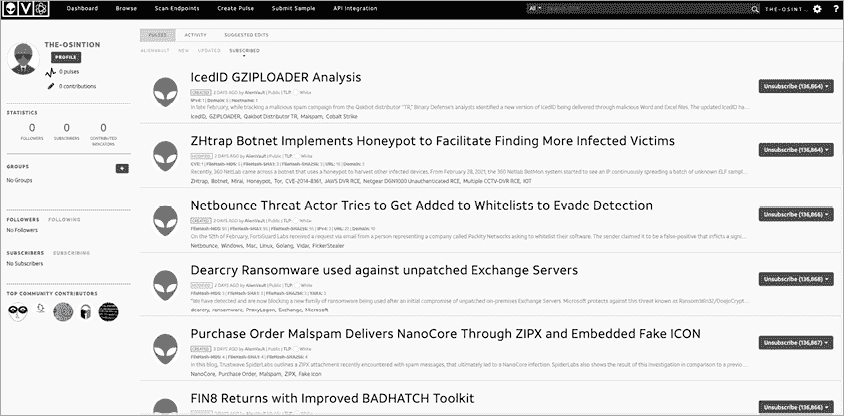

图 12-1：OTX 仪表板

你将看到一些选项来创建脉冲（图 12-2）。你可以导入文本或网站，或者手动输入指标。


图 12-2：在 OTX 中创建脉冲

让我们从复制并粘贴电子邮件的完整源代码开始。

### 分析电子邮件源代码

我喜欢使用 Thunderbird 查看电子邮件源代码。这是一个由 Mozilla 维护的免费开源邮件客户端。安装并运行 Thunderbird 后，你可以将任何保存的 *.eml* 格式电子邮件导入到 OTX 并开始分析。在 Thunderbird 中，首先打开电子邮件。然后在右上角，选择 **更多**▶**查看源代码** (图 12-3)。

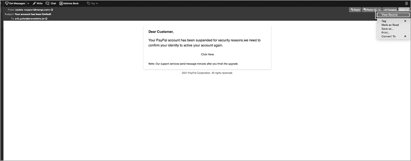

图 12-3：在 Thunderbird 中查看电子邮件源代码

一旦电子邮件以源代码形式打开，你应该能看到类似 图 12-4 中的摘录。这是发送电子邮件时传输的底层数据轨迹，包括执行的所有检查和电子邮件的源地址与目标地址。你可以通过这种方式查看任何可下载的电子邮件，有时甚至在邮件客户端本身中。例如，在 Gmail 中，你可以点击电子邮件右上角的三个点，然后选择“显示原始邮件”。

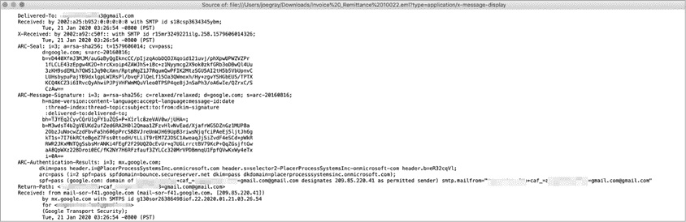

图 12-4：钓鱼电子邮件的来源

查看电子邮件的源代码非常重要。这样你可以看到电子邮件真正来自哪里，而不是依赖于可能被伪造的源地址。你将看到真实的电子邮件地址和伪造的电子邮件地址，以及发件人的 IP 地址。

当将此电子邮件复制并粘贴到脉冲中时，要小心不要包含你邮件服务器的 IP 地址或任何其他来自信誉良好的邮件供应商的地址。如果你添加了这些并开始搜索，你将收到大量的误报，如果没有调优，这些误报将导致自满。

### 输入指标

现在你已经从源代码中获得信息，准备好导入一些指标了。*指标*是与正在捕捉的脉冲活动相关的数据点。表 12-1 列出了 OTX 接受的指标。

表 12-1：OTX 接受的指标

| **指标类型** | **描述** |
| --- | --- |
| IPv4 | 托管钓鱼或恶意软件的源电子邮件服务器或网站的 IPv4 地址。 |
| IPv6 | 托管钓鱼或恶意软件的源电子邮件服务器或网站的 IPv6 地址。 |
| 域名 | 源电子邮件服务器或托管钓鱼或恶意软件的网站的域名。 |
| 主机名 | 托管钓鱼或恶意软件的源电子邮件服务器或网站的主机名或子域名。 |
| 电子邮件 | 源电子邮件地址。 |
| URL | 托管钓鱼或恶意软件的网站的统一资源定位符（URL）。 |
| URI | 托管钓鱼或恶意软件的网站的精确位置的统一资源标识符（URI）。 |

| 文件哈希 | 对钓鱼邮件中包含的恶意文件进行的一种单向加密表示。可以通过多种格式完成，包括以下几种： |

+   MD5：使用消息摘要 5 算法（MD5）对文件进行的 128 位加密表示。 |

+   SHA-1：使用安全哈希算法（SHA-1）对文件进行的 160 位加密表示。 |

+   SHA-256：使用安全哈希算法 256 位（SHA-256）对文件进行的 256 位加密表示。 |

|

| PEHASH | 可移植可执行哈希（peHash）是一种模糊哈希方法，与其对整个文件进行哈希不同，它通过提取可执行文件中的多个变量并对其逐字节哈希来完成。 |
| --- | --- |
| IMPASH | 导入哈希（IMPASH）；类似于 peHash，但跟踪代码导入的 DLL 和其他文件。 |
| CIDR | 无类域间路由（CIDR）是一个网络 IP 地址范围的地址，表示域拥有的基础 IP 和可能的子网数量。格式通常为 *xxx.xxx.xxx.xxx*/*yy*，其中 *xxx.xxx.xxx.xxx* 是基础 IPv4 地址，*yy* 是一个介于 1 和 32 之间的数字，表示该块内可能的子网和主机数量。你通常会看到该范围内的数字在 24 到 32 之间。 |
| 文件路径 | 工作站中发现恶意文件的唯一位置。此路径显示了统一行为，可能是通过脚本实现的。 |
| MUTEX | 互斥对象（MUTEX）是程序中的一个对象，旨在允许多个线程共享资源（如文件访问），但不能同时共享。 |
| CVE | 公共漏洞与暴露（CVE）是负责任地披露的漏洞。将 CVE 包括在脉冲中，可以让其他人在订阅信息流时搜索该 CVE。这在钓鱼邮件试图基于现有漏洞进行某种程度的技术利用时尤其有用。 |
| YARA | YARA 是“又一个递归缩写”或“又一个正则表达式（REGEX）分析器”的缩写。这是一种匹配文件中的模式并在环境中迭代的方式，通常使用 SEIM 或自定义的 YARA 工具，支持 Windows、macOS 和 Linux。 |

将整个电子邮件源复制并粘贴到图像中的左侧框中，然后选择 **提取指示器**（图 12-5）。这会自动进行解析，但你仍然需要检查这些指示器并确保它们的准确性。 |

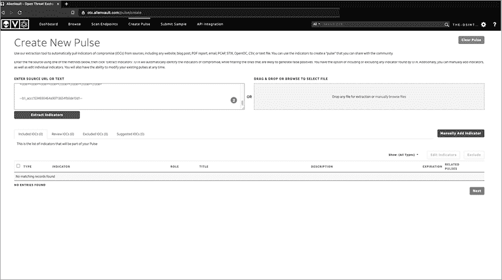

图 12-5：OTX 指示器提取 |

如你在图 12-6 中看到的，解析器从你粘贴的电子邮件中提取了三个指示器。 |

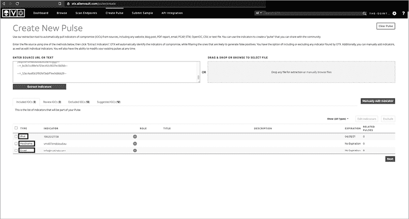

图 12-6：包含的指示器 |

你需要验证这些指标是否属于该脉冲。由于你通过检查邮件源知道列出的邮件是发件人的，你不需要再次检查它。但你需要检查这些域名和 IP 地址。为了完成这一点，我们做一点 OSINT（开放源情报收集）。

你需要确定以下内容：每个域名和 IP 地址的所有者是谁？该域名和 IP 地址是否有合法用途？域名所有者是否控制其服务中传递的数据？这些 IP 地址是否属于邮件提供商？或者我们是否拥有该域名或 IP 地址？

图 12-7 中的可能 IOC 并不是有价值的威胁情报，因此如果 OTX 没有排除它们，你将需要将它们排除。你将在后续过程进行排除，以避免重复分析这些指标。

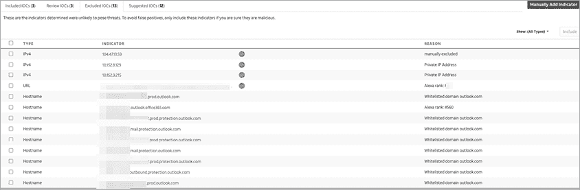

图 12-7：排除的指标

现在，你转到*排除的 IOC* 列表。你对每个排除的 IOC 项目，重复你对已包含 IOC 所采用的相同过程。一开始，你就能看出这些项目中有些并不属于指标列表。

从这个提取结果中，继续移除以下内容：三个明显的微软地址（*by5pr19mb3713.namprd19.prod.outlook.com*、*by5pr19mb3970.namprd19.prod.outlook.com* 和 *nam12-mw2-obe.outbound.protection.outlook.com*）；两个明显的谷歌地址（*mail-sor-f41.google.com* 和 *mx.google.com*）；一系列 GoDaddy 地址（*p3plibsmtp01-08.prod.phx3.secureserver.net*、*p3plsmtp21-01-26.prod.phx3.secureserver.net* 和 *p3plsmtp21-01.prod.phx3.secureserver.net*）；以及 10.186.134.206，这是一个 A 类私有、不可路由的内部 IP 地址。

### 在 Burp 中测试潜在恶意域名

OTX 声称 *docsend.com* 是一个被列入白名单的域名，但它确实允许用户上传文件。这意味着，最好继续检查发送者试图迫使受害者打开的内容。在数字取证和恶意软件领域，这被称为*引爆*。如果你在一个没有保护的系统上进行引爆，可能会受到感染，所以我建议使用专门的系统，或者至少使用专用的虚拟机来处理此类操作。

除了虚拟机外，我建议确保安装了恶意软件防护（如果适用），启用主机和网络级别的防火墙，使用 VPN，并且（如果你对它感到舒服的话）使用 Tor 浏览器（或 Brave 浏览器——它提供类似的功能），不过你需要选择“使用 Tor 打开新隐私窗口”。你可能会遇到一些麻烦的东西，而你可不希望在进行合法的安全研究时，自己掉进法律的陷阱。

打开您的虚拟机，确保它与您的主网络处于不同的系统和网络段，并且在该系统与其他家庭实验室和网络之间运行防火墙和安全设备。根据您计划执行的分析级别，您可以选择使用 Linux 虚拟机或 Windows 虚拟机。如果您希望更好地理解攻击的运作方式，可能想使用一个易受攻击的 Windows 系统。

在您的主机上安装 Burp Suite。*Burp* 是一个网页代理，允许您拦截和更改在您和网站之间传输的数据。它使您能够查看系统向网站发出的请求及其响应。您还可以控制任何弹出窗口和许多意外的动作，比如重定向到恶意网站。要安装 Burp，下载免费版社区版的副本，网址为[`portswigger.net/burp/communitydownload/`](https://portswigger.net/burp/communitydownload/)。这将包含一个类似于 `burpsuite_community_linux_v<#>_#_##.sh` 的脚本。输入最新版本到这里显示的命令中：

```
chmod 744 burpsuite_community_linux_v<#>_#_##.sh
./burpsuite_community_linux_v<#>_#_##.sh
```

安装完成后，您可以通过点击 Burp 图标或在操作系统菜单中输入*Burp*来使用图形界面打开 Burp。Burp 会提示您创建一个项目。点击**下一步**，接着您将被提示接受 Burp 默认配置或加载配置文件。保持默认设置应该没有问题。

接下来，您需要将浏览器的流量通过 Burp 路由。为此，打开 Firefox，点击菜单图标，然后滚动到页面底部。点击**网络设置**。您应该会被提示输入代理信息，如图 12-8 所示。选择**手动代理配置**，然后输入 IP 地址`127.0.0.1`作为 HTTP 代理和端口`8080`。选择使用此代理服务器进行所有协议的选项。

现在您已安装 Burp 并配置 Firefox 通过 Burp 路由流量，打开 Burp 并确保它已配置为拦截流量。为此，选择**Proxy**标签页，然后点击**Intercept**。最后，确保 Intercept 已开启。

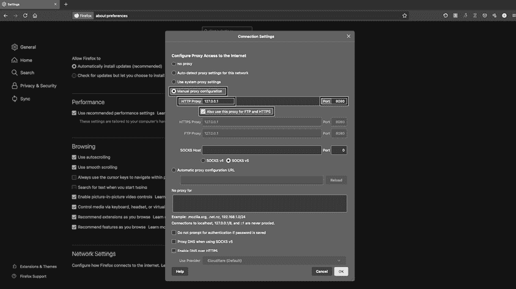

图 12-8：在 Firefox 中配置网络代理

一旦确认 Burp 已正确配置，您可以使用它来拦截浏览器的流量（参见图 12-9）。只要 Intercept 开启，您需要选择是转发还是丢弃每个网页请求*.* 这意味着您可以丢弃恶意（或合法）流量，而不是将其发送到浏览器。

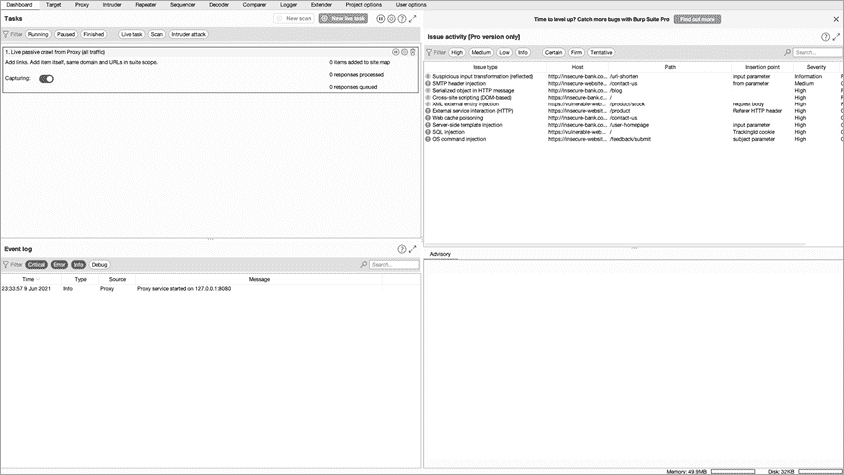

图 12-9：使用 Burp 截取流量

现在，让我们访问电子邮件中找到的网站。当你使用 Burp 转发它时，会加载一个网站。这看起来像是一个 PayPal 网站，但在图 12-10 中，你可以很容易地发现它并不合法：注意 URL 中没有 *PayPal* 字样，而且使用的是 *.es* 顶级域名。此外，URL 末尾的 *code=US&id=8799879&country=United States* 表示正在使用某种追踪手段。

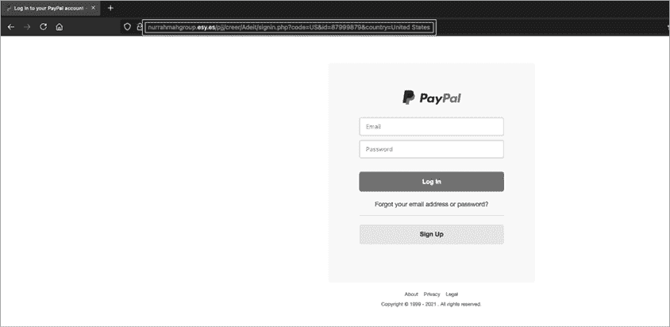

图 12-10：示例钓鱼登陆页面

URL 中完全没有 *PayPal* 字样可能是最大的警示信号。如果你尝试在沙箱系统（本章前面提到的隔离系统或虚拟机）中打开该链接，主机应该是未知的。而且，如你在图 12-11 中看到的，Burp 显示我们输入信息并点击链接后没有任何反应——很可能是一次 *凭证盗取* 失败的尝试。

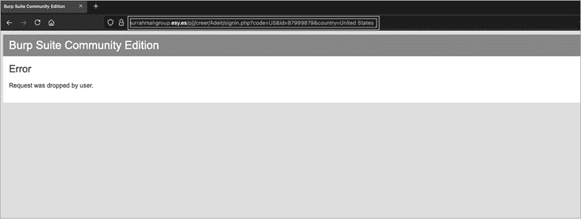

图 12-11：断开的钓鱼重定向

该网站什么都不做，可能表明 PayPal 或其他供应商已采取了行动，可能利用了 DMCA。也可能表明攻击者缺乏扩展其攻击的技术能力。然而，重要的是不要忽视与凭证盗取相关的威胁。如反复所述，很多人仍然在多个平台上使用相同的密码，包括个人和工作账户。许多网站要么不强制，要么不支持多因素认证，从而加剧了这一威胁。

尽管链接失效，你仍然应该将其添加到 OTX pulse 中。在继续之前，通过勾选我们标识出的四个无关的 IP 地址旁边的框，并点击 **排除**，将它们添加到排除指标中。

### 分析可下载文件

这个钓鱼攻击活动没有包括任何可下载的文件。但如果有呢？我们来简要讨论一下如何分析这些文件。首先，你需要获取这些文件的加密哈希值。拥有文件的加密哈希值可以让你将已知状态的文件与其他版本进行对比，看看是否发生了变化。当一个文件被创建（或者在恶意软件的情况下被观察到）时，你会对文件进行加密哈希处理，帮助你更快地搜索它。你可以将系统中的文件哈希与已知的恶意文件哈希进行对比，并在发现匹配时发出警报。在某些情况下，文件会自行变化，因此哈希值可能不再相同。我们称之为 *变种恶意软件*，这是另一本书的话题。

你可以使用多种工具来生成文件的哈希值。像以下这些工具，Linux 上通常已经预装。有时候输入多个哈希类型是值得的，因为某些系统只会使用单一算法来检查文件。

要生成文件的 MD5 哈希值，请输入以下命令：

```
**md5sum** `filename` 
```

要生成文件的 SHA-1 哈希值，请输入以下命令：

```
**sha1sum** `filename` 
```

要生成文件的 SHA-256 哈希值，请输入以下命令：

```
**sha256sum** `filename` 
```

要生成文件的 SHA-512 哈希值，请输入以下命令：

```
**sha512sum** `filename` 
```

然后将每个哈希值添加到 OTX。如果你选择编写此事件并发布报告，你可以从 URL 导入脉冲数据并将该 URL 列为资源。

在接下来的章节中，我们将进一步分析*esy.es*域名。

## 进行威胁情报的 OSINT 分析

OTX 并不是唯一可以用来分析恶意链接或电子邮件的资源。在本节中，我们将探索其他一些工具和资源。你可能会在本书的 OSINT 章节中认出一些这些工具和技术。在这里，你将使用这些资源来判断一个网站是否有害。

### 在 VirusTotal 中搜索

一个由 Chronicle Security 公司拥有的网站，[`www.virustotal.com/`](https://www.virustotal.com/)，允许研究人员和威胁情报专家分析一个文件是否在超过 60 个杀毒平台上被列为恶意文件，而无需购买所有这些平台。它还允许你检查任何 URL 的状态。VirusTotal 还提供了 API 进行脚本化分析。它的基于 Web 的 GUI 搜索功能支持以下输入类型：实际上传的文件、URL、IP 地址、域名或文件哈希值。

### 通过 WHOIS 识别恶意网站

当你收集 OSINT 时，你运行了 WHOIS 命令。但在使用 WHOIS 分析恶意软件时，你需要寻找额外的信息。特别是，除了常规的 WHOIS 信息外，你还需要查看域名注册的国家和其自治系统号码（ASN）。ASN 将在你使用 PhishTank 分析网络钓鱼邮件来源系统时发挥作用。图 12-12 展示了看似可疑的域名*esy.es*的 WHOIS 记录。

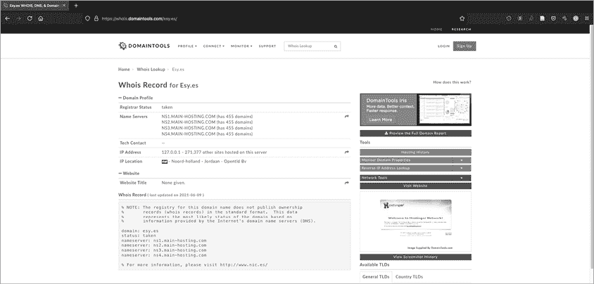

图 12-12：*esy.es*的 WHOIS 记录

你可以看到，该域名注册在荷兰一个叫做 Jordaan 的地区，并且最后更新于 2021 年 6 月 9 日，使用的是通过 main-hosting.com 托管的名称服务器。进一步进行 main-hosting.com 的 WHOIS 查询显示，它托管在 godaddy.com 上，而一家信誉良好的公司通常会在内部托管该域名。你还应该对最近注册的域名保持警惕。年轻的域名需要审慎分析，因为很多都是恶意的。一个注册仅 8 天的域名和一个 43 天的名称服务器并不意味着它们一定是有问题的，但它们确实需要额外的调查。在这种情况下，你应该将这两个域名和任何相关的 IP 地址包含在你的 OTX 脉冲中。

合法网站的 WHOIS 记录会显示什么？为了比较，图 12-13 是*nostarch.com*的 WHOIS 输出。

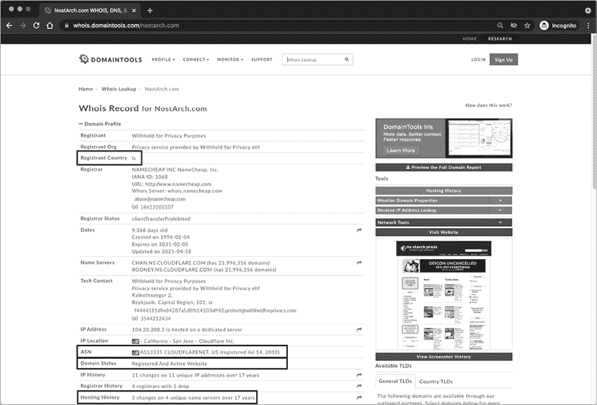

图 12-13：NoStarch 的 WHOIS 记录

首先注意到注册人国家为冰岛。当组织使用 WhoisGuard 或域名隐私等服务来隐藏其位置时，这是常见的情况，这并不意味着需要立即警惕或进一步分析。如果你查看日期，你会看到该域名创建于 1996 年，并且包括一个注册并活跃的网站。

其次，ASN 列出了 Cloudflare。使用 Cloudflare 表明该网站很可能不是恶意的，因为内容分发网络通常会删除它们验证为有害的任何内容。我们还看到这个域名在 17 年里经历了四个不同的名称服务器的三次更改。这是正常的，通常表示更换了服务提供商。自 1996 年以来，技术发生了很大变化，因此更换服务商和记录以实现新技术是合乎逻辑的。

### 使用 PhishTank 发现钓鱼网站

PhishTank ([`phishtank.com/`](https://phishtank.com/)) 是由 OpenDNS 运营的一个免费的钓鱼验证平台。它允许你按域名、URL 或 ASN 进行搜索。根据我的经验，按 ASN 搜索最为高效。但由于你没有*nurrahmahgroup.esy.es*域名的 ASN，你需要按域名和 URL 进行搜索。图 12-14 显示了这一搜索结果。

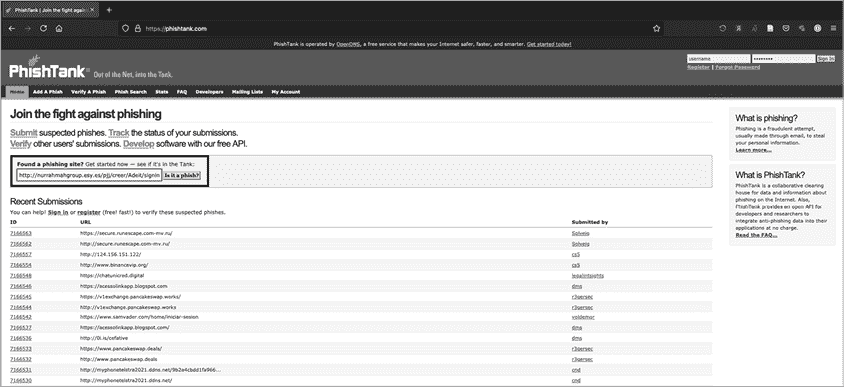

图 12-14：PhishTank 搜索*nurrahmahgroup.esy.es*钓鱼网站

正如你在图 12-15 中看到的，搜索结果为空。这并不意味着它不是钓鱼尝试——只是目前没有人报告过。

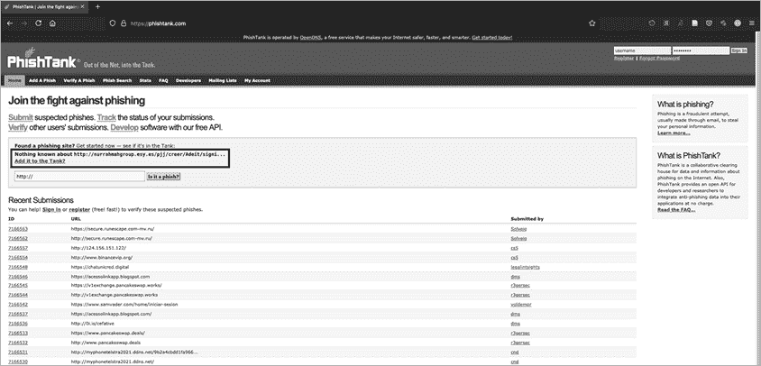

图 12-15：*PhishTank.com* 上的有效钓鱼

由于该站点已关闭，我将演示如何报告，但不会提交报告。首先，点击声明“没有已知信息”下方的**将其添加到 Tank 中？**链接。接下来，输入钓鱼网站的 URL。在这种情况下，你需要将电子邮件的正文粘贴到三个报告中提交给 Tank（如果你要提交的话），以便关联使用的所有三个域名。你还需要选择电子邮件中提到的组织 Microsoft，因为它声称来自 Office 365。一旦完成，点击**提交**。

图 12-16 是将与钓鱼相关的信息输入到 PhishTank 中，以便将其纳入数据库的实例。

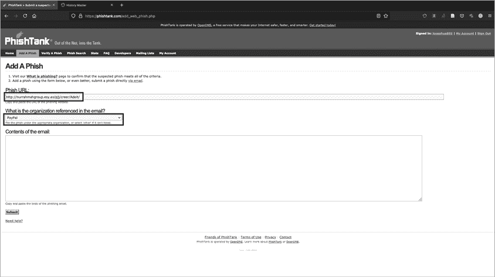

图 12-16：向 PhishTank 提交钓鱼样本

### 浏览 ThreatCrowd

作为 AT&T 网络安全的一部分，ThreatCrowd ([`www.threatcrowd.org/`](https://www.threatcrowd.org/)) 提供关于域名、IP 地址以及其他细节（如哈希）的合法性可视化。与 OTX 及其他平台一样，你可以独立访问它，也可以通过 ThreatMiner 中的链接访问它（将在下一部分讨论）。图 12-17 显示了 *nurrahmahgroup.esy.es* 域名的可视化。

在这个可视化中，你可以看到各种系统、哈希、域名和其他特征如何与我们的关注系统互动。当构建网络威胁情报程序或深入分析潜在对手时，这非常有用。图形输出也能作为写报告时的出色素材。

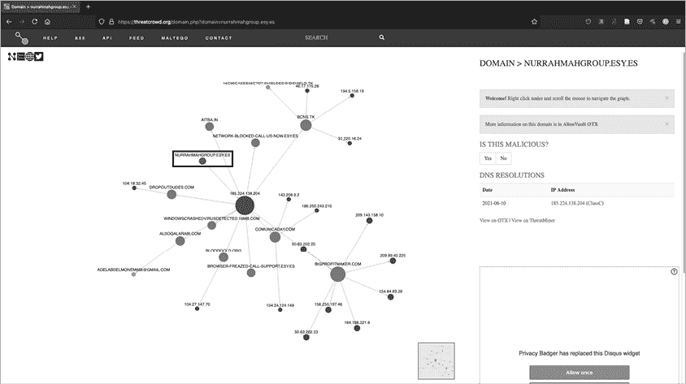

图 12-17：*nurrahmahgroup.esy.es* 的 ThreatCrowd 可视化

### 在 ThreatMiner 中整合信息

ThreatMiner ([`www.threatminer.org/`](https://www.threatminer.org/)) 接收输入并从多个其他威胁情报来源拉取信息，提供一个单一视图，展示其他平台的看法。ThreatMiner 让你能迅速了解恶意的可能性。像其他任何工具一样，它不是完美的解决方案，但它是其中最好的之一，尤其是因为它是免费的。

ThreatMiner 网站允许你搜索指示符或 APT 笔记。*APT 笔记* 是一个包含公开可用论文和博客的资料库，按年份排序，涉及与供应商定义的高级持续威胁（APT）组或工具集相关的恶意活动、攻击或软件。由于你已经有一些指示符，先让我们搜索这些。与 OTX 类似，ThreatMiner 可以处理多种类型的指示符，其中一些与 OTX 的有所不同。它们包括域名、IP 地址、哈希（MD5、SHA-1 和 SHA-256）、电子邮件地址、APT 笔记、SSL/TLS 证书、用户代理、杀毒软件名称、文件名、URI、注册表项和互斥体。

这是 ThreatMiner 的独特功能之一：它在屏幕左侧打开一个窗格，显示可能相关的 Google 搜索结果。在那里，你应该能看到与提交的指示符相关的 WHOIS 数据（如果适用）。在屏幕下方，你还会看到其他资源的链接，如 RiskIQ、PassiveTotal、VirusTotal、DomainTools、ThreatCrowd、OTX、SecurityTrails 和 Robtex。

图 12-18 显示了对 *nurrahmahgroup.esy.es* 的搜索。

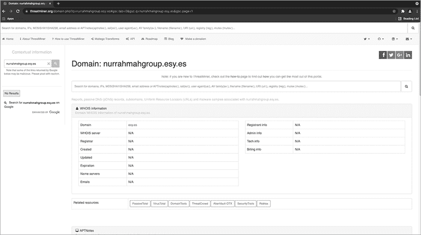

图 12-18：*nurrahmahgroup.esy.es* 的 ThreatMiner 结果

在相关资源下方，你会注意到该域名没有 APT 笔记。也没有相关的被动 DNS、子域名、关联 URL、Robtex 或恶意软件样本。考虑到你分析的钓鱼邮件比较旧，而且该域名是最近注册的，这很有道理。对于一个更加成熟的指示符，或者尚未被撤下的域名，预计会在这里看到更多信息。

现在，如果 ThreatMiner 为你搜索所有这些网站，为什么我等到最后才展示它的功能？是为了帮助你理解如何自己进行分析。当我在进行钓鱼邮件的威胁情报分析时，我通常会同时打开两个窗口：OTX 和 ThreatMiner。要使用 ThreatMiner 识别的相关信息，只需点击链接。

## 结论

威胁情报不仅仅是花言巧语，也不仅仅是消费供应商的情报源。它让你能够分析自己的经验，并收集可操作的信息，这些信息不仅能帮助你，还能帮助你的客户、合作伙伴以及整个社区。在本章中，你通过使用 OTX 消耗和生成了威胁情报，然后通过 WHOIS、ThreatCrowd、ThreatMiner、VirusTotal 等工具过渡到防御性应用。这只是你威胁情报工作的开始，但它为你能够看清供应商炒作之外的真相，并制作高质量的材料来增强组织的安全性奠定了坚实的基础。
