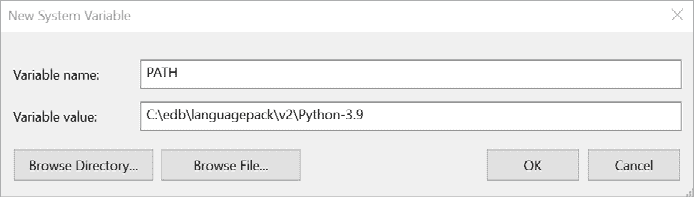
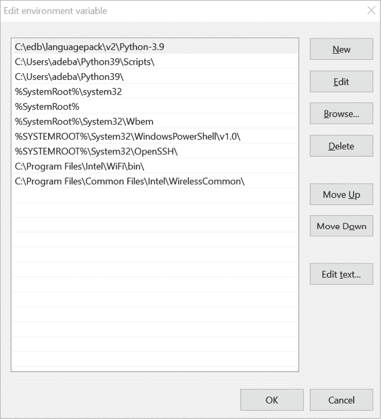
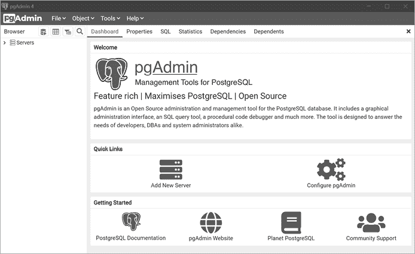
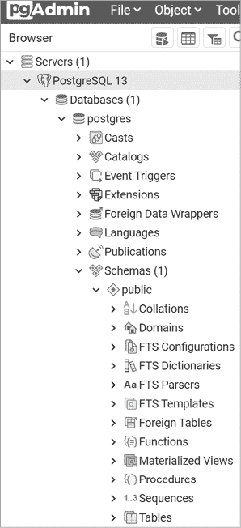
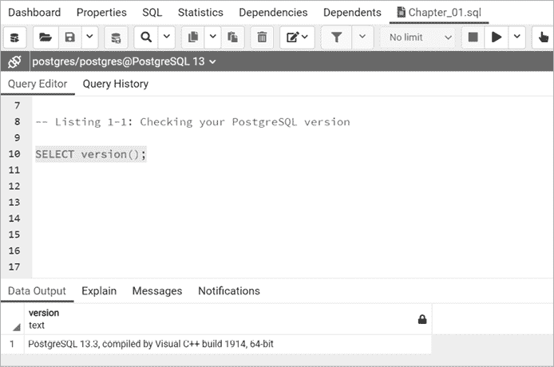

# 第一章：设置你的编码环境


让我们从安装完成本书练习所需的资源开始。在本章中，你将安装一个文本编辑器，下载示例代码和数据，然后安装 PostgreSQL 数据库系统及其伴随的图形用户界面 pgAdmin。我还将告诉你如何在需要时获取帮助。当你完成这些步骤时，你的计算机将拥有一个强大的环境，帮助你学习如何使用 SQL 分析数据。

别急着跳到下一章。我的高中老师（显然是押头韵的爱好者）常告诉我们：“适当的计划可以避免糟糕的表现。” 如果你遵循本章中的所有步骤，之后就能避免麻烦。

我们的第一项任务是设置一个适合处理数据的文本编辑器。

## 安装文本编辑器

你将添加到 SQL 数据库中的源数据通常存储在多个*文本文件*中，通常是以*逗号分隔值（CSV）*的格式存储。你将在第五章的“处理分隔文本文件”部分中深入了解 CSV 格式，但现在让我们确保你有一个文本编辑器，可以让你打开这些文件而不会无意中损坏数据。

常见的商业应用程序——文字处理器和电子表格程序——通常会在文件中引入样式或隐藏字符，且不会征求你的同意，这使得它们在数据工作中的使用变得有问题，因为数据软件期望数据以精确的格式呈现。例如，如果你用 Microsoft Excel 打开一个 CSV 文件，程序会自动修改一些数据，以便更符合人类可读性；它会假设，例如，`3-09` 是一个日期，并将其格式化为 `9-Mar`。文本编辑器仅处理纯文本，不会添加任何如格式化之类的修饰，因此程序员使用它们来编辑包含源代码、数据和软件配置的文件——这些都是你希望文本仅被视为文本，没有其他任何处理的情况。

任何文本编辑器都可以满足本书的需求，所以如果你有喜欢的编辑器，尽管使用。以下是我使用过并推荐的一些编辑器。除非另有说明，它们都是免费的，并且适用于 macOS、Windows 和 Linux。

+   微软的 Visual Studio Code：[`code.visualstudio.com/`](https://code.visualstudio.com/)

+   GitHub 提供的 Atom：[`atom.io/`](https://atom.io/)

+   Sublime Text 由 Sublime HQ 提供（可以免费评估，但继续使用需要购买）：[`www.sublimetext.com/`](https://www.sublimetext.com/)

+   作者 Don Ho 开发的 Notepad++（仅限 Windows）：[`notepad-plus-plus.org/`](https://notepad-plus-plus.org/)（注意，这是一个与 Windows 自带的 *Notepad.exe* 不同的应用程序）

更高级的用户，如果偏好在命令行中工作，可能会想使用这两款默认安装在 macOS 和 Linux 中的文本编辑器：

+   作者 Bram Moolenaar 和开源社区开发的 `vim`：[`www.vim.org/`](https://www.vim.org/)

+   由作者 Chris Allegretta 和开源社区开发的 GNU `nano`： [`www.nano-editor.org/`](https://www.nano-editor.org/)

如果你没有文本编辑器，下载并安装一个，并熟悉打开文件夹和操作文件的基础知识。

接下来，让我们获取书中的示例代码和数据。

## 从 GitHub 下载代码和数据

你在进行书中的练习时所需的所有代码和数据都可以下载。按照以下步骤获取它：

1.  访问这本书在 No Starch Press 网站上的页面：[`nostarch.com/practical-sql-2nd-edition/`](https://nostarch.com/practical-sql-2nd-edition/)。

1.  在页面上，点击**从 GitHub 下载代码**，访问存放材料的[`github.com/`](https://github.com/)上的仓库。

1.  在 GitHub 上的《Practical SQL 2nd Edition》页面，你应该会看到一个**代码**按钮。点击它，然后选择**下载 ZIP**将 ZIP 文件保存到你的电脑。将其放置在你可以轻松找到的位置，比如桌面。（如果你是 GitHub 用户，你也可以克隆或分叉该仓库。）

1.  解压文件后，你应该会看到一个名为*practical-sql-2-master*的文件夹，其中包含书中的各种文件和子文件夹。同样，将此文件夹放在你可以轻松找到的位置。

在*practical-sql-2-master*文件夹内，每个章节你会找到一个名为*Chapter_XX*（*XX*是章节号）的子文件夹。在每个包含代码示例的章节文件夹中，还会有一个名为*Chapter_XX*的文件，文件扩展名为*.sql*。这是一个 SQL 代码文件，你可以使用文本编辑器或稍后在本章安装的 PostgreSQL 管理工具打开。请注意，为了节省空间，书中的一些代码示例已被截断，但你需要从*.sql*文件中获取完整的代码来完成练习。当你看到`--snip--`时，说明该示例已经被截断。

章节文件夹中还包含了你在练习中使用的公共数据，这些数据存储在 CSV 和其他基于文本的文件中。如前所述，可以使用真正的文本编辑器查看 CSV 文件，但不要使用 Excel 或文字处理软件打开这些文件。

现在，完成了先决条件，让我们加载数据库软件。

## 安装 PostgreSQL 和 pgAdmin

在这一部分，你将安装 PostgreSQL 数据库系统和一个辅助的图形管理工具 pgAdmin。你可以把 pgAdmin 看作是一个帮助你管理 PostgreSQL 数据库的可视化工作空间。它的界面让你能够查看数据库对象、管理设置、导入和导出数据，以及编写查询，这些查询是用来从数据库中检索数据的代码。

使用 PostgreSQL 的一个好处是开源社区提供了优秀的指南，使得 PostgreSQL 易于安装和运行。以下部分概述了截至目前为止在 Windows、macOS 和 Linux 上的安装步骤，但随着新版本软件或操作系统的发布，步骤可能会有所变化。请查看每个部分中提到的文档，以及包含本书资源的 GitHub 仓库；我会在其中维护更新文件，并回答常见问题。

### Windows 安装

对于 Windows，我建议使用由 EDB（原 EnterpriseDB）公司提供的安装程序，该公司为 PostgreSQL 用户提供支持和服务。当你从 EDB 下载 PostgreSQL 包时，你还会获得 pgAdmin 和 Stack Builder，这些工具将在本书中以及整个 SQL 职业生涯中使用。

获取软件，请访问 [`www.postgresql.org/download/windows/`](https://www.postgresql.org/download/windows/)，并在 EDB 部分点击 **下载安装程序**。这将引导你到 EDB 网站的下载页面。除非你使用的是较老的 32 位 Windows 电脑，否则请选择最新的 64 位 Windows 版本 PostgreSQL。

下载完安装程序后，按照以下步骤安装 PostgreSQL、pgAdmin 和附加组件：

1.  右键点击安装程序，选择 **以管理员身份运行**。对于允许该程序对你的计算机进行更改的提示，选择 **是**。程序将执行一个设置任务，然后呈现初始欢迎屏幕。点击进入。

1.  选择你的安装目录，接受默认设置。

1.  在选择组件的屏幕上，勾选安装 PostgreSQL 服务器、pgAdmin 工具、Stack Builder 和命令行工具的框。

1.  选择存储数据的位置。你可以选择默认位置，它位于 PostgreSQL 目录中的 *data* 子目录下。

1.  选择一个密码。PostgreSQL 在安全性和权限方面非常强大。这个密码用于默认的初始数据库超级用户账户，该账户名为 `postgres`。

1.  选择服务器监听的默认端口号。如果没有其他数据库或应用程序正在使用此端口，使用默认端口 `5432`。如果你已经有应用程序使用了默认端口，可以选择 `5433` 或其他端口号。

1.  选择你的地区语言。使用默认设置即可。然后点击摘要屏幕，开始安装，过程将持续几分钟。

1.  安装完成后，系统会询问你是否要启动 EnterpriseDB 的 Stack Builder 来获取附加包。确保勾选该选项并点击 **完成**。

1.  当 Stack Builder 启动时，从下拉菜单中选择 PostgreSQL 安装项，然后点击 **下一步**。应该会下载一系列附加应用程序。

1.  展开空间扩展菜单，选择适合您安装的 PostgreSQL 版本的 PostGIS 包。您可能会看到多个版本，选择最新的一个。另外，展开**附加组件、工具和实用程序**菜单，选择**EDB 语言包**，该包安装了包括 Python 在内的编程语言支持。多次点击直到安装程序下载附加组件。

1.  当安装文件下载完成后，点击**下一步**来安装语言和 PostGIS 组件。对于 PostGIS，您需要同意许可协议；点击直到出现选择组件界面。确保选择了 PostGIS 和创建空间数据库。点击**下一步**，接受默认的安装位置，然后再次点击**下一步**。

1.  在提示时输入数据库密码，并按照提示继续安装 PostGIS。

1.  当系统询问是否注册 `PROJ_LIB` 和 `GDAL_DATA` 环境变量时，选择**是**。对于设置 `POSTGIS_ENABLED_DRIVERS` 和启用 `POSTGIS_ENABLE_OUTDB_RASTERS` 环境变量的问题，也选择**是**。最后，点击完成步骤以完成安装并退出安装程序。根据版本不同，系统可能会提示你重启电脑。

安装完成后，您的 Windows 开始菜单中应出现两个新文件夹：一个是 PostgreSQL，另一个是 PostGIS。

如果您想立即开始，可以跳过并直接进入“与 pgAdmin 一起工作”部分。否则，请继续下一部分，设置环境变量以支持可选的 Python 语言支持。我们将在第十七章中讨论如何使用 Python 与 PostgreSQL 配合使用；如果您希望现在就继续，可以等到那时再设置 Python。

#### 配置 Python 语言支持

在第十七章中，您将学习如何将 Python 编程语言与 PostgreSQL 一起使用。在上一部分中，您已经安装了 EDB 语言包，它提供了 Python 支持。按照以下步骤将语言包文件的位置添加到 Windows 系统的环境变量中：

1.  通过点击 Windows 任务栏上的**搜索**图标，输入**控制面板**，然后点击**控制面板**图标，打开 Windows 控制面板。

1.  在控制面板应用中，在搜索框中输入**环境**。在显示的搜索结果列表中，点击**编辑系统环境变量**。系统属性对话框将会出现。

1.  在系统属性对话框中，点击高级选项卡，点击**环境变量**。打开的对话框分为两部分：用户变量和系统变量。在系统变量部分，如果没有 `PATH` 变量，继续执行步骤 a 创建一个新的变量。如果已经存在 `PATH` 变量，继续执行步骤 b 进行修改。

    1.  如果在系统变量部分没有看到 `PATH`，点击**新建**以打开新建系统变量对话框，如图 1-1 所示。

        图 1-1：在 Windows 10 中创建新的 `PATH` 环境变量

        在变量名框中输入 **PATH**。在变量值框中输入 **C:\edb\languagepack\v2\Python-3.9**。（你也可以点击 **浏览目录**，然后在浏览文件夹对话框中导航到该目录。）当你手动输入路径或浏览到路径时，点击对话框中的 **确定** 以关闭对话框。

    1.  如果你在系统变量部分看到了现有的 `PATH` 变量，选中它并点击 **编辑**。在显示的变量列表中，点击 **新建** 并输入 **C:\edb\languagepack\v2\Python-3.9**。（你也可以点击浏览目录，然后在浏览文件夹对话框中导航到该目录。）

        在你添加了语言包路径后，选中它并点击 **向上移动**，直到该路径出现在变量列表的顶部。这样，PostgreSQL 就能找到正确的 Python 版本，尤其是在你有多个 Python 安装时。

        结果应类似于 图 1-2 中的高亮行。点击 **确定** 关闭对话框。

        

        图 1-2：编辑 Windows 10 中现有的 `PATH` 环境变量

1.  最后，在系统变量部分点击 **新建**。在新建系统变量对话框中，在变量名框中输入 **PYTHONHOME**。在变量值框中输入 **C:\edb\languagepack\v2\Python-3.9**。完成后，点击所有对话框中的 **确定** 以关闭它们。注意，这些 Python 路径设置将在你下次重新启动系统时生效。

如果你在 PostgreSQL 安装过程中遇到任何问题，请查看本书的资源，在那里我会记录随着软件开发而发生的变化，并可以解答问题。如果你无法通过 Stack Builder 安装 PostGIS，尝试从 PostGIS 网站下载一个单独的安装程序，网址为 [`postgis.net/windows_downloads/`](https://postgis.net/windows_downloads/)，并查阅 [`postgis.net/documentation/`](https://postgis.net/documentation/) 上的指南。

现在，你可以继续进行“使用 pgAdmin”部分。

### macOS 安装

对于 macOS 用户，我推荐获取 Postgres.app，这是一款开源的 macOS 应用程序，包含 PostgreSQL 以及 PostGIS 扩展和一些其他工具。你还需要单独安装 pgAdmin 图形界面和 Python 语言，以便在函数中使用。

#### 安装 Postgres.app 和 pgAdmin

按照以下步骤操作：

1.  访问 [`postgresapp.com/`](https://postgresapp.com/) 并下载该应用的最新版本。下载的文件将是一个以 *.dmg* 结尾的磁盘映像文件。

1.  双击 *.dmg* 文件以打开它，然后将应用程序图标拖放到你的 *应用程序* 文件夹中。

1.  在你的*应用程序*文件夹中，双击应用图标以启动 Postgres.app。（如果看到一个对话框显示应用无法打开，因为开发者无法验证，请点击**取消**。然后右键点击应用图标并选择**打开**。）当 Postgres.app 打开时，点击**初始化**来创建并启动 PostgreSQL 数据库服务器。

一个小象图标将出现在你的菜单栏中，表示你现在有一个数据库在运行。为了设置包含的 PostgreSQL 命令行工具，以便你以后能够使用它们，打开终端应用程序并在提示符下运行以下单行代码（你可以从 Postgres.app 网站复制该代码，作为一行代码：[`postgresapp.com/documentation/install.html`](https://postgresapp.com/documentation/install.html)）：

```
**sudo mkdir -p /etc/paths.d &&**
**echo /Applications/Postgres.app/Contents/Versions/latest/bin | sudo tee /etc/paths.d/postgresapp**
```

你可能会被提示输入登录 Mac 时使用的密码。请输入密码。命令应在不输出任何内容的情况下执行。

接下来，由于 Postgres.app 不包含 pgAdmin，请按照以下步骤安装 pgAdmin：

1.  访问 pgAdmin 网站的 macOS 下载页面 [`www.pgadmin.org/download/pgadmin-4-macos/`](https://www.pgadmin.org/download/pgadmin-4-macos/)。

1.  选择最新版本并下载安装程序（寻找一个以 *.dmg* 结尾的磁盘映像文件）。

1.  双击 *.dmg* 文件，点击通过提示接受条款，然后将 pgAdmin 的象形应用图标拖到你的*应用程序*文件夹中。

在 macOS 上的安装相对简单，但如果遇到任何问题，请查看 Postgres.app 的文档 [`postgresapp.com/documentation/`](https://postgresapp.com/documentation/) 和 pgAdmin 的文档 [`www.pgadmin.org/docs/`](https://www.pgadmin.org/docs/)。

#### 安装 Python

在第十七章中，你将学习如何使用 Python 编程语言与 PostgreSQL 配合使用。为了在 Postgres.app 中使用 Python，你必须安装一个特定版本的 Python，尽管 macOS 自带 Python（而且你可能已经设置了额外的 Python 环境）。为了启用 Postgres.app 的可选 Python 语言支持，请按照以下步骤操作：

1.  访问官方 Python 网站 [`www.python.org/`](https://www.python.org/)，然后点击**下载**菜单。

1.  在发布列表中，找到并下载最新版本的 Python 3.9。选择适合你 Mac 处理器的安装程序——老款 Mac 使用 Intel 芯片，新款 Mac 使用 Apple Silicon。下载的文件是一个以 *.pkg* 结尾的 Apple 软件包文件。

1.  双击安装包文件来安装 Python，按照提示点击同意许可协议。安装完成后关闭安装程序。

Postgres.app 的 Python 需求可能会随时间变化。请检查其 Python 文档 [`postgresapp.com/documentation/plpython.html`](https://postgresapp.com/documentation/plpython.html) 以及本书中的资源，获取最新的更新。

现在你已经准备好进入“使用 pgAdmin”章节。

### Linux 安装

如果你是 Linux 用户，安装 PostgreSQL 既简单又复杂，这种体验正是 Linux 世界的一大特色。大多数时候，你可以通过几个命令完成安装，但找到这些命令需要一定的网络搜索技巧。幸运的是，大多数流行的 Linux 发行版——包括 Ubuntu、Debian 和 CentOS——都会将 PostgreSQL 捆绑在其标准软件包中。然而，有些发行版对更新的支持更加及时，因此你下载的 PostgreSQL 可能不是最新版本。最佳做法是查阅你发行版的文档，了解如何安装 PostgreSQL（如果它尚未包含在内）或如何升级到较新的版本。

或者，PostgreSQL 项目维护着适用于 Red Hat 系列、Debian 和 Ubuntu 的最新软件包仓库。请访问[`yum.postgresql.org/`](https://yum.postgresql.org/)和[`wiki.postgresql.org/wiki/Apt`](https://wiki.postgresql.org/wiki/Apt)获取详细信息。你需要安装的包包括 PostgreSQL 的客户端和服务器、pgAdmin（如果有的话）、PostGIS 和 PL/Python。这些包的具体名称会根据你的 Linux 发行版有所不同。你可能还需要手动启动 PostgreSQL 数据库服务器。

pgAdmin 应用程序通常不包含在 Linux 发行版中。要安装它，请参考 pgAdmin 网站上的[`www.pgadmin.org/download/`](https://www.pgadmin.org/download/)以获取最新的安装说明，并查看是否支持您的平台。如果你喜欢挑战，也可以在[`www.pgadmin.org/download/pgadmin-4-source-code/`](https://www.pgadmin.org/download/pgadmin-4-source-code/)找到从源代码构建应用程序的说明。完成后，可以继续阅读“使用 pgAdmin”部分。

#### Ubuntu 安装示例

为了让你了解 PostgreSQL 在 Linux 上的安装过程，以下是我在 Ubuntu 21.04（代号 Hirsute Hippo）上加载 PostgreSQL、pgAdmin、PostGIS 和 PL/Python 的步骤。这些步骤结合了[`wiki.postgresql.org/wiki/Apt`](https://wiki.postgresql.org/wiki/Apt)上的说明和[`help.ubuntu.com/community/PostgreSQL/`](https://help.ubuntu.com/community/PostgreSQL/)中的“基本服务器设置”部分。如果你使用的是 Ubuntu，可以跟着操作。

按下 ctrl-alt-T 打开终端。然后，在提示符下输入以下命令来导入 PostgreSQL APT 仓库的密钥：

```
**sudo apt-get install curl ca-certificates gnupg**
**curl https://www.postgresql.org/media/keys/ACCC4CF8.asc | sudo apt-key add -**
```

接下来，运行以下命令创建文件 */etc/apt/sources.list.d/pgdg.list*：

```
**sudo sh -c 'echo "deb https://apt.postgresql.org/pub/repos/apt $(lsb_release -cs)-pgdg main" > /etc/apt/sources.list.d/pgdg.list'**
```

完成后，更新软件包列表，并使用接下来的两行命令安装 PostgreSQL 和 pgAdmin。在这里，我安装了 PostgreSQL 13；如果有较新版本，你可以选择安装它。

```
**sudo apt-get update**
**sudo apt-get install postgresql-13**
```

现在，你应该已经启动了 PostgreSQL。在终端中，输入下一行命令，这可以让你登录到服务器，并使用 `psql` 交互式终端以默认的 `postgres` 用户身份连接到 `postgres` 数据库，我们将在第十八章详细介绍：

```
**sudo -u postgres psql postgres**
```

当 `psql` 启动时，它会显示版本信息以及一个 `postgres=#` 提示符。在提示符下输入以下命令来设置密码：

```
`postgres=#` **\password postgres**
```

我还喜欢创建一个用户名与我的 Ubuntu 用户名匹配的用户账户。为此，在 `postgres=#` 提示符下，输入以下命令，并将 `anthony` 替换为你的 Ubuntu 用户名：

```
`postgres=#` **CREATE USER** **anthony SUPERUSER;**
```

输入 `\q` 退出 `psql`，你应该会回到终端提示符。

要安装 pgAdmin，首先导入仓库的密钥：

```
**curl https://www.pgadmin.org/static/packages_pgadmin_org.pub | sudo apt-key add**
```

接下来，运行以下命令来创建文件 */etc/apt/sources.list.d/pgadmin4.list* 并更新软件包列表：

```
**sudo sh -c 'echo "deb https://ftp.postgresql.org/pub/pgadmin/pgadmin4/apt/$(lsb_release -cs) pgadmin4 main" > /etc/apt/sources.list.d/pgadmin4.list && apt update'**
```

然后，你可以安装 pgAdmin 4：

```
**sudo apt-get install pgadmin4-desktop**
```

最后，为了安装 PostGIS 和 PL/Python 扩展，在终端中运行以下命令（根据你的 PostgreSQL 版本替换版本号）：

```
**sudo apt install** **postgresql-13-postgis-3**
**sudo apt install** **postgresql-plpython3-13**
```

查看官方的 Ubuntu 和 PostgreSQL 文档以获取更新。如果遇到任何错误，通常在 Linux 系统中进行在线搜索会获得有用的提示。

## 使用 pgAdmin

设置的最后一步是熟悉 pgAdmin，这是一个用于 PostgreSQL 的管理工具。pgAdmin 软件是免费的，但不要低估它的性能；它是一个功能齐全的工具，功能与 Microsoft 的 SQL Server Management Studio 等付费工具一样强大。使用 pgAdmin，你可以获得一个图形界面，配置 PostgreSQL 服务器和数据库的多个方面，并且——最适合本书的内容——使用 SQL 查询工具来编写、运行和保存查询。

### 启动 pgAdmin 并设置主密码

假设你之前按照本章中的操作系统安装步骤完成了安装，接下来是如何启动 pgAdmin：

+   **Windows**：进入开始菜单，找到你安装的 PostgreSQL 版本文件夹，点击它，然后选择 **pgAdmin4**。

+   **macOS**：点击 *应用程序* 文件夹中的 **pgAdmin** 图标，确保你已经启动了 Postgres.app。

+   **Linux**：启动方式可能会根据你的 Linux 发行版有所不同。通常，在终端提示符下输入 `pgadmin4` 并按回车。在 Ubuntu 中，pgAdmin 会作为一个应用程序出现在活动概览中。

你应该会看到 pgAdmin 欢迎界面，随后应用程序会打开，如 图 1-3 所示。如果这是你第一次启动 pgAdmin，你还会收到提示设置主密码。这个密码与安装 PostgreSQL 时设置的密码无关。设置主密码并点击 **OK**。



图 1-3：在 Windows 10 上运行的 pgAdmin 应用程序

pgAdmin 布局包括一个显示对象浏览器的左侧垂直窗格，你可以在其中查看可用的服务器、数据库、用户及其他对象。屏幕顶部是一组菜单项，下面是标签页，用于显示数据库对象和性能的不同方面。接下来，让我们连接到你的数据库。

### 连接到默认的 postgres 数据库

PostgreSQL 是一个*数据库管理系统*，意味着它是一个允许你定义、管理和查询数据库的软件。当你安装 PostgreSQL 时，它创建了一个*数据库服务器*——一个在你的计算机上运行的应用程序实例——其中包含一个名为 `postgres` 的默认数据库。数据库是一个对象集合，包含表格、函数等更多内容，实际数据就存储在这里。我们使用 SQL 语言（以及 pgAdmin）来管理存储在数据库中的对象和数据。

在下一章中，你将在 PostgreSQL 服务器上创建自己的数据库，以组织你的工作。现在，我们先连接到默认的 `postgres` 数据库来探索 pgAdmin。请按照以下步骤操作：

1.  在对象浏览器中，点击位于“服务器”节点左侧的向下箭头，显示默认服务器。根据你的操作系统，默认服务器名称可能是 *localhost* 或 *PostgreSQL x*，其中 *x* 是 Postgres 版本号。

1.  双击服务器名称。如果提示，输入你在安装过程中选择的数据库密码（你可以选择保存密码，以便以后不再需要输入）。在 pgAdmin 建立连接时，会显示一个简短的消息。当连接成功时，服务器名称下应该会显示多个新对象项。

1.  展开数据库，然后展开默认数据库 `postgres`。

1.  在 `postgres` 下，展开 Schemas 对象，然后展开 public。

你的对象浏览器窗格应类似于图 1-4。



图 1-4：pgAdmin 对象浏览器

这一对象集合定义了你的数据库服务器的每个功能，包括表格，我们在其中存储数据。要查看表格结构或使用 pgAdmin 对其执行操作，你可以在此访问表格。在第二章中，你将使用此浏览器创建一个新数据库，并保持默认的 `postgres` 不变。

### 探索查询工具

pgAdmin 应用程序包含一个*查询工具*，在这里你可以编写和执行代码。要打开查询工具，在 pgAdmin 的对象浏览器中，首先单击任意数据库以将其高亮显示。例如，点击 `postgres` 数据库，然后选择 **工具** ▶ **查询工具**。你将看到三个窗格：一个查询编辑器，一个用于存放代码片段的临时编辑区，以及一个显示查询结果的数据输出窗格。你可以打开多个标签页，连接并为不同的数据库编写查询，或者仅仅以你喜欢的方式组织代码。要打开另一个标签页，只需在对象浏览器中点击一个数据库，再通过菜单打开查询工具。

让我们运行一个简单的查询并查看其输出，使用清单 1-1 中的语句，它返回你安装的 PostgreSQL 版本。此代码以及本书中的所有示例均可以通过点击[`nostarch.com/practical-sql-2nd-edition/`](https://nostarch.com/practical-sql-2nd-edition/)网站上的**Download the code from GitHub**链接进行下载。

```
SELECT version();
```

清单 1-1：检查你的 PostgreSQL 版本

将代码输入查询编辑器，或者如果你从 GitHub 下载了本书的代码，点击 pgAdmin 工具栏上的**打开文件**图标，导航到保存代码的文件夹，打开*Chapter_01*文件夹中的*Chapter_01.sql*文件。要执行语句，选择以`SELECT`开头的行并点击工具栏上的**执行/刷新**图标（它的形状像一个播放按钮）。PostgreSQL 应当在 pgAdmin 数据输出面板中返回服务器的版本，如图 1-5 所示（你可能需要通过点击数据输出面板右边缘并向右拖动，来展开列以查看完整的结果）。

你将在本书后续章节中学到更多关于查询的内容，但现在你只需要知道的是，这个查询使用了一个 PostgreSQL 特有的*函数*，它叫做`version()`，用来检索服务器的版本信息。在我的例子中，输出显示我运行的是 PostgreSQL 13.3，并且提供了软件构建的额外信息。



图 1-5：pgAdmin 查询工具显示查询结果

### 自定义 pgAdmin

从 pgAdmin 菜单中选择**文件**▶**首选项**会打开一个对话框，在该对话框中你可以自定义 pgAdmin 的外观和选项。以下是你现在可能想要访问的三项设置：

+   **杂项**▶**主题**允许你在标准的浅色 pgAdmin 主题和深色主题之间进行选择。

+   **查询工具**▶**结果网格**允许你设置查询结果中的最大列宽。在该对话框中，选择**列数据**，并在**最大列宽**中输入**300**。

+   **浏览器**部分让你配置 pgAdmin 布局并设置键盘快捷键。

若要获取 pgAdmin 选项的帮助，请从菜单中选择**帮助**▶**在线帮助**。在继续之前，随时可以进一步探索首选项。

## pgAdmin 的替代方案

虽然 pgAdmin 非常适合初学者，但你并不需要在这些练习中使用它。如果你更喜欢使用其他可以与 PostgreSQL 配合的管理工具，随时可以使用。如果你希望在本书的所有练习中使用系统的命令行，18 章提供了如何在命令行中使用 PostgreSQL 交互式终端`psql`的说明。（附录列出了你可以探索的 PostgreSQL 资源，以寻找更多的管理工具。）

## 总结

现在你已经通过代码、文本编辑器、PostgreSQL 和 pgAdmin 设置好了环境，你可以开始学习 SQL 并使用它来发现数据中的宝贵见解！

在第二章，你将学习如何创建一个数据库和一个表格，然后加载一些数据来探索其内容。让我们开始吧！
