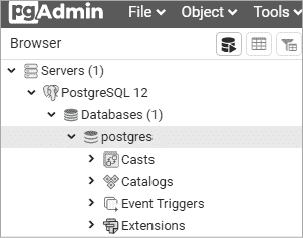
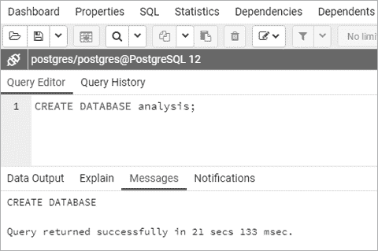
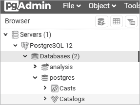
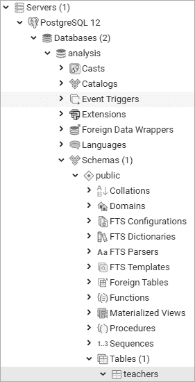
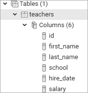
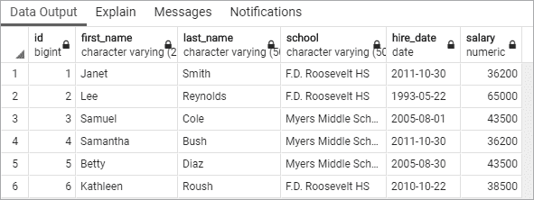

# 第二章：创建你的第一个数据库和表格


SQL 不仅仅是从数据中提取知识的手段。它还是一种*定义*存储数据的结构的语言，使我们能够组织数据中的*关系*。其中最重要的结构就是表格。

表格是一个由行和列组成的数据网格。每一行包含一组列，每一列包含一种指定类型的数据：最常见的是数字、字符和日期。我们使用 SQL 来定义表格的结构，以及每个表格如何与数据库中的其他表格相关联。我们还使用 SQL 从表格中提取或*查询*数据。

在本章中，你将创建你的第一个数据库，添加一个表格，然后使用 SQL 在 pgAdmin 界面中插入几行数据。接着，你将使用 pgAdmin 来查看结果。让我们先从表格开始。

## 理解表格

了解你的表格是理解数据库中数据的基础。每当我开始使用一个新的数据库时，我做的第一件事就是查看其中的表格。我通过表格名称和列结构寻找线索。表格是包含文本、数字还是两者兼有？每个表格有多少行？

接下来，我会看看数据库中有多少个表。最简单的数据库可能只有一个表。一个处理客户数据或追踪航空旅行的完整应用程序可能包含几十个或上百个表。表的数量不仅告诉我需要分析多少数据，还暗示着我应该探索各表之间的数据关系。

在你深入研究 SQL 之前，让我们看一个表格内容的示例。我们将使用一个假设的数据库来管理学校的班级注册；在这个数据库中，有几个表格用来追踪学生和他们的课程。第一个表格叫做 `student_enrollment`，显示了每个班级部分注册的学生：

```
student_id    class_id      class_section    semester
----------    ----------    -------------    ---------
CHRISPA004    COMPSCI101    3                Fall 2023
DAVISHE010    COMPSCI101    3                Fall 2023
ABRILDA002    ENG101        40               Fall 2023
DAVISHE010    ENG101        40               Fall 2023
RILEYPH002    ENG101        40               Fall 2023
```

该表显示了有两个学生注册了 `COMPSCI101` 课程，三个学生注册了 `ENG101` 课程。但是，关于每个学生和每门课程的详细信息在哪里呢？在这个例子中，这些细节存储在名为 `students` 和 `classes` 的单独表格中，而这些表格与当前表格相关联。这就是*关系型数据库*开始展现其强大功能的地方。

`students` 表的前几行包括以下内容：

```
student_id    first_name    last_name    dob
----------    ----------    ---------    ----------
ABRILDA002    Abril         Davis        2005-01-10
CHRISPA004    Chris         Park         1999-04-10
DAVISHE010    Davis         Hernandez    2006-09-14
RILEYPH002    Riley         Phelps       2005-06-15
```

`students` 表格包含了每个学生的详细信息，使用 `student_id` 列中的值来标识每个学生。该值充当一个唯一的*键*，将两个表格连接起来，使你能够创建如下所示的行，包含 `student_enrollment` 表中的 `class_id` 列以及 `students` 表中的 `first_name` 和 `last_name` 列：

```
class_id      first_name    last_name
----------    ----------    ---------
COMPSCI101    Davis         Hernandez
COMPSCI101    Chris         Park
ENG101        Abril         Davis
ENG101        Davis         Hernandez
ENG101        Riley         Phelps
```

`classes` 表的工作方式也类似，包含一个 `class_id` 列和几个关于课程的详细信息列。数据库开发者喜欢使用单独的表来组织数据，每个表管理数据库中的一个主要 *实体*，以减少冗余数据。在这个示例中，我们只存储每个学生的姓名和出生日期一次。即使学生报名参加了多门课程——就像 Davis Hernandez 一样——我们也不会在 `student_enrollment` 表中每一门课程旁边重复输入他的名字，而是只包含他的学生 ID。

鉴于表是每个数据库的核心构建块，本章你将通过在新数据库中创建表开始你的 SQL 编程冒险。然后，你将向表中加载数据并查看完成的表。

## 创建数据库

你在第一章安装的 PostgreSQL 程序是一个 *数据库管理系统*，一个软件包，允许你定义、管理和查询存储在数据库中的数据。数据库是一个包含表、函数等的对象集合。当你安装 PostgreSQL 时，它创建了一个 *数据库服务器*——运行在你计算机上的应用实例——并包括一个名为 `postgres` 的默认数据库。

根据 PostgreSQL 文档，默认的 `postgres` 数据库是“供用户、工具和第三方应用程序使用的”（参见 [`www.postgresql.org/docs/current/app-initdb.html`](https://www.postgresql.org/docs/current/app-initdb.html)）。我们将创建一个新的数据库来用于本书中的示例，而不是使用默认数据库，这样我们可以将与特定主题或应用程序相关的对象组织在一起。这是一个好习惯：它有助于避免在单一数据库中堆积没有关系的表，并确保如果你的数据将被用于支持应用程序，比如移动应用程序，那么应用程序的数据库只会包含相关信息。

要创建一个数据库，你只需要一行 SQL，如 清单 2-1 所示，我们稍后将使用 pgAdmin 运行这行代码。你可以在通过 [`www.nostarch.com/practical-sql-2nd-edition/`](https://www.nostarch.com/practical-sql-2nd-edition/) 链接下载的 GitHub 文件中找到这段代码以及本书中的所有示例。

```
CREATE DATABASE analysis;
```

清单 2-1：创建名为 `analysis` 的数据库

这个语句使用默认的 PostgreSQL 设置在你的服务器上创建一个名为 `analysis` 的数据库。请注意，代码由两个关键字组成——`CREATE` 和 `DATABASE`——后面跟着新数据库的名称。你以分号结束该语句，表示命令的结束。你必须用分号结束所有 PostgreSQL 语句，这是 ANSI SQL 标准的一部分。在某些情况下，即使你省略分号，查询也能正常工作，但并非总是如此，所以养成使用分号的好习惯是明智的。

### 在 pgAdmin 中执行 SQL

在第一章中，你安装了图形化管理工具 pgAdmin（如果没有，请现在安装）。在我们的大部分工作中，你将使用 pgAdmin 来执行你编写的 SQL 语句，称为*执行*代码。在本书的第十八章，我将向你展示如何使用 PostgreSQL 命令行程序`psql`在终端窗口中执行 SQL 语句，但通过图形界面开始更为简单。

我们将使用 pgAdmin 来执行清单 2-1 中创建数据库的 SQL 语句。然后，我们将连接到新数据库并创建表。请按照以下步骤操作：

1.  运行 PostgreSQL。如果你使用的是 Windows，安装程序会将 PostgreSQL 设置为每次启动时自动启动。在 macOS 上，你必须双击应用程序文件夹中的*Postgres.app*（如果你在菜单栏中看到大象图标，那么它已经在运行了）。

1.  启动 pgAdmin。系统会提示你输入首次启动应用程序时设置的 pgAdmin 主密码。

1.  正如你在第一章中所做的，在左侧垂直窗格（对象浏览器）中，点击服务器节点左侧的箭头，显示默认服务器。根据你安装 PostgreSQL 的方式，默认服务器可能命名为*localhost*或*PostgreSQL x*，其中*x*是应用程序的版本。你可能会收到另一个密码提示。这个提示是针对 PostgreSQL 的，而不是 pgAdmin 的，所以请输入你在安装 PostgreSQL 时设置的密码。你应该会看到 pgAdmin 正在建立连接的简短信息。

1.  在 pgAdmin 的对象浏览器中，展开**Databases**，点击一次`postgres`以突出显示它，如图 2-1 所示。

    图 2-1：默认的`postgres`数据库

1.  通过选择**工具**▶**查询工具**来打开查询工具。

1.  在查询编辑器窗格（顶部水平窗格）中，输入清单 2-1 中的代码。

1.  点击**执行/刷新**图标（形状像右箭头）来执行语句。PostgreSQL 将创建数据库，在查询工具的输出窗格中的消息部分，你会看到一条表示查询成功执行的通知，如图 2-2 所示。

    图 2-2：创建一个名为`analysis`的数据库

1.  要查看你的新数据库，在对象浏览器中右键点击**Databases**。从弹出菜单中选择**刷新**，然后`analysis`数据库将出现在列表中，如图 2-3 所示。



图 2-3：在对象浏览器中显示的`analysis`数据库

干得不错！你现在拥有一个名为`analysis`的数据库，你可以使用它来进行本书中的大多数练习。在你自己的工作中，通常的最佳实践是为每个项目创建一个新的数据库，以便将相关数据的表格放在一起。

### 连接到 analysis 数据库

在创建表之前，你必须确保 pgAdmin 连接的是`analysis`数据库，而不是默认的`postgres`数据库。

要做到这一点，请按照以下步骤操作：

1.  通过点击工具面板最右侧的**X**关闭查询工具。出现提示时，无需保存文件。

1.  在对象浏览器中，点击**分析**一次。

1.  通过选择**工具**▶**查询工具**，打开一个新的查询工具窗口，并连接到`analysis`数据库。

1.  现在，你应该能在查询工具窗口顶部看到`analysis/postgres@localhost`的标签。（再次提醒，可能你的版本显示的不是`localhost`，而是`PostgreSQL`。）

现在，任何你执行的代码都将应用于`analysis`数据库。

## 创建表格

如我所提到的，表格是数据存储和定义关系的地方。当你创建一个表格时，你需要为每个*列*（有时称为*字段*或*属性*）指定一个名称，并为每列指定一个*数据类型*。这些数据类型定义了该列可以接受的值——例如文本、整数、小数和日期——并且数据类型的定义是 SQL 用来确保数据完整性的一种方式。例如，定义为`date`的列只能接受某几种标准格式的数据，如`YYYY-MM-DD`。如果你尝试输入不符合日期格式的字符，比如单词`peach`，系统会报错。

存储在表格中的数据可以通过 SQL 语句进行访问和分析，或者查询。你可以对数据进行排序、编辑和查看，并且如果需求发生变化，之后也可以轻松地修改表格。

让我们在`analysis`数据库中创建一个表格。

### 使用 CREATE TABLE 语句

在这个练习中，我们将使用一个常常讨论的数据：教师薪资。列表 2-2 展示了创建一个名为`teachers`的表格的 SQL 语句。在你将代码输入 pgAdmin 并执行之前，我们先来回顾一下这段代码。

```
1 CREATE TABLE teachers (
  2 id bigserial,
  3 first_name varchar(25),
    last_name varchar(50),
    school varchar(50),
  4 hire_date date,
  5 salary numeric
6 );
```

列表 2-2：创建一个名为`teachers`的表格，包含六个列

这个表格定义远不完整。例如，它缺少了几个*约束*，这些约束能够确保必须填写的列确实包含数据，或者确保我们不会无意中输入重复的值。关于约束的详细内容，我将在第八章中讲解，但在这些早期章节中，我将它们省略，以便专注于帮助你开始探索数据。

代码以两个 SQL 关键字`CREATE`和`TABLE`开始，1 这两个关键字与名称`teachers`一起，告诉 PostgreSQL 接下来的代码描述的是要添加到数据库中的表格。在开括号后，语句包括一系列列名称及其数据类型，列名称和数据类型之间用逗号分隔。为了更好的可读性，每行新代码单独占一行并缩进四个空格，虽然这不是必需的，但它使代码更容易阅读。

每个列名代表一个由数据类型定义的独立数据元素。`id` 列的类型为 `bigserial`，这是一个特殊的自增整数类型，每当你向表中添加一行时，它会自动递增。第一行在 `id` 列的值为 `1`，第二行为 `2`，以此类推。`bigserial` 数据类型以及其他序列类型是 PostgreSQL 特有的实现，但大多数数据库系统都有类似的功能。

接下来，我们为教师的名字、姓氏以及他们所教学校创建列。每列的类型为 `varchar`，这是一种文本列，最大长度由括号中的数字指定。我们假设数据库中的每个姓氏都不会超过 50 个字符。尽管这是一个安全的假设，但你会发现随着时间的推移，例外总是会让你吃惊。

教师表的 `hire_date` 列的类型设置为 `date`，`salary` 列的类型为 `numeric`。数据类型的详细介绍将在第四章中讲解，但此表展示了一些常见的数据类型示例。代码块以闭合括号和分号结束。

现在你已经对 SQL 有了一些了解，让我们在 pgAdmin 中运行这段代码。

### 创建教师表

你已经有了代码，并且连接到了数据库，所以可以使用与创建数据库时相同的步骤来创建表：

1.  打开 pgAdmin 查询工具（如果没有打开，点击 pgAdmin 对象浏览器中的 `analysis`，然后选择 **Tools**▶**Query Tool**）。

1.  将 Listing 2-2 中的 `CREATE TABLE` 脚本复制到 SQL 编辑器中（或者，如果你选择使用查询工具打开 GitHub 上的 *Chapter_02.sql* 文件，直接高亮列出该内容）。

1.  点击 **Execute/Refresh** 图标（右箭头形状）执行脚本。

如果一切顺利，你将在 pgAdmin 查询工具的底部输出窗格中看到一条消息，内容为 `Query returned successfully with no result in 84 msec`。当然，毫秒数会根据你的系统有所不同。

现在，找到你创建的表。返回到主 pgAdmin 窗口，在对象浏览器中右击 **analysis** 并选择 **Refresh**。选择 **Schemas**▶**public**▶**Tables** 查看你的新表，如图 2-4 所示。



图 2-4：对象浏览器中的 `teachers` 表

点击 `teachers` 表名称左侧的箭头展开该表节点。这将显示更多关于该表的详细信息，包括列名称，如图 2-5 所示。还会显示其他信息，如索引、触发器和约束，但这些内容将在后续章节中讲解。点击表名称后，在 pgAdmin 工作区选择 **SQL** 菜单，将显示用于重新创建 `teachers` 表的 SQL 语句（注意，这些显示包括在创建表时隐式添加的额外默认标记）。



图 2-5：`teachers` 表的详细信息

恭喜！到目前为止，你已经构建了一个数据库并向其中添加了一个表。下一步是向表中添加数据，以便你可以编写第一个查询。

## 向表中插入行

你可以通过多种方式将数据添加到 PostgreSQL 表中。通常，你会处理大量的行，因此最简单的方法是从文本文件或其他数据库直接将数据导入表中。但是，为了开始，我们将使用 `INSERT INTO ... VALUES` 语句添加几行数据，该语句指定了目标列和数据值。接下来，我们将查看数据在新位置的表现。

### 使用 INSERT 语句

要向表中插入数据，首先需要删除你刚刚运行的 `CREATE TABLE` 语句。然后，按照你创建数据库和表时的相同步骤，将 列表 2-3 中的代码复制到你的 pgAdmin 查询工具中（或者，如果你在查询工具中打开了 *Chapter_02.sql* 文件，可以选中这个列表）。

```
1 INSERT INTO teachers (first_name, last_name, school, hire_date, salary)
2 VALUES ('Janet', 'Smith', 'F.D. Roosevelt HS', '2011-10-30', 36200),
       ('Lee', 'Reynolds', 'F.D. Roosevelt HS', '1993-05-22', 65000),
       ('Samuel', 'Cole', 'Myers Middle School', '2005-08-01', 43500),
       ('Samantha', 'Bush', 'Myers Middle School', '2011-10-30', 36200),
       ('Betty', 'Diaz', 'Myers Middle School', '2005-08-30', 43500),
       ('Kathleen', 'Roush', 'F.D. Roosevelt HS', '2010-10-22', 38500);3
```

列表 2-3：将数据插入 `teachers` 表

这段代码插入了六个教师的姓名和数据。这里，PostgreSQL 语法遵循 ANSI SQL 标准：在 `INSERT INTO` 关键字之后是表的名称，括号内是要填充的列 1。在下一行是 `VALUES` 关键字以及每一行每个列的插入数据 2。你需要将每一行的数据用一对括号括起来，并在括号内使用逗号分隔每个列值。数据的顺序也必须与表名后指定的列的顺序相匹配。每行数据以逗号结尾，除了最后一行，它以分号结尾，结束整个语句 3。

注意到我们插入的某些值被单引号括起来，但有些则没有。这是 SQL 的标准要求。文本和日期需要使用引号；数字，包括整数和小数，则不需要引号。我会在示例中突出显示这一要求。另外，请注意我们使用的日期格式：四位数的年份后跟月份和日期，每个部分之间用连字符连接。这是国际标准的日期格式；使用它可以帮助你避免混淆。（为什么最好使用 `YYYY-MM-DD` 格式？可以查看 [`xkcd.com/1179/`](https://xkcd.com/1179/) 了解更多相关漫画。）PostgreSQL 支持许多额外的日期格式，我会在示例中使用几种。

你可能会对 `id` 列感到好奇，它是表中的第一列。当你创建表时，你的脚本指定了该列为 `bigserial` 数据类型。因此，当 PostgreSQL 插入每一行时，它会自动用自增的整数填充 `id` 列。这个问题我将在第四章详细讨论，当时我会讲解数据类型。

现在，运行代码。这时，查询工具的消息区域应该显示如下内容：

```
INSERT 0 6
Query returned successfully in 150 msec.
```

`INSERT`关键字后面的两个数字中的最后一个表示插入的行数：`6`。第一个数字是一个未使用的遗留 PostgreSQL 值，仅为保持网络协议而返回；你可以安全地忽略它。

### 查看数据

你可以通过 pgAdmin 快速查看刚刚加载到`teachers`表中的数据。在对象浏览器中，找到该表并右击。在弹出菜单中，选择**查看/编辑数据**▶**所有行**。正如图 2-6 所示，你会看到表中六行数据，每列都由 SQL 语句中的值填充。



图 2-6：直接在 pgAdmin 中查看表数据

注意，尽管你没有为`id`列插入值，但每个教师都有分配的 ID 号码。此外，每个列标题会显示你在创建表时定义的数据类型。（注意，在这个例子中，PostgreSQL 中完全展开的`varchar`是`character varying`。）在查看结果时看到数据类型会帮助你在后续编写查询时，依照数据类型来处理数据。

你可以通过 pgAdmin 界面以几种方式查看数据，但我们将重点介绍编写 SQL 来处理这些任务。

## 代码出错时寻求帮助

也许有一个宇宙，代码总是能正常工作，但不幸的是，我们还没有发明出能够把我们带到那个地方的机器。错误是不可避免的。无论是打错字还是搞错了运算顺序，计算机语言在语法方面非常苛刻。例如，如果你忘记了在列表 2-3 中的代码中加逗号，PostgreSQL 会返回一个错误：

```
ERROR:  syntax error at or near "("
LINE 4:     ('Samuel', 'Cole', 'Myers Middle School', '2005-08-01', 43...
            ^
```

幸运的是，错误信息给出了问题的提示和位置：我们在第 4 行的左括号附近犯了一个语法错误。但有时，错误信息可能更为晦涩。在这种情况下，你可以像最优秀的程序员一样：快速在互联网上搜索错误信息。很可能其他人也遇到过同样的问题，并且可能知道答案。我发现，通过在搜索引擎中逐字输入错误信息，并指定我的数据库管理工具名称，再将结果限制为更新的项目，能获得最佳的搜索结果，从而避免使用过时的信息。

## 为了可读性而格式化 SQL

SQL 执行时不需要特殊格式化，因此你可以随意使用大写、小写和随机缩进的迷幻风格。但当别人需要与你的代码合作时（迟早会有这种情况），这种风格可不会为你赢得朋友。为了可读性并成为一个好程序员，以下是几条普遍接受的约定：

+   使用大写字母编写 SQL 关键字，如`SELECT`。有些 SQL 程序员也将数据类型的名称写成大写，如`TEXT`和`INTEGER`。在本书中，我使用小写字母来表示数据类型，以便与你脑海中的关键字区分开来，但如果你喜欢，也可以将它们写成大写字母。

+   避免使用驼峰命名法，而应使用`lowercase_and_underscores`来命名对象，例如表和列名（关于大小写的更多细节将在第八章中介绍）。

+   为了提高可读性，使用两个或四个空格缩进子句和代码块。一些程序员偏好使用制表符而非空格；你可以根据自己的需要或你所在组织的规范来选择使用哪种方式。

在本书中，我们将探索其他 SQL 编码约定，但这些是基础知识。

## 总结

在本章中，你完成了相当多的内容：你创建了一个数据库和一个表，并将数据加载到其中。你已经开始将 SQL 添加到数据分析工具包中了！在下一章中，你将使用这组教师数据来学习如何使用`SELECT`查询表的基本知识。
