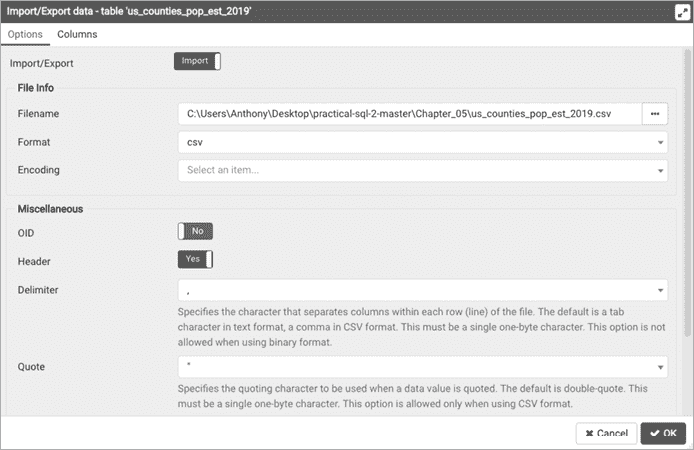

# 第五章：数据的导入与导出


到目前为止，你已经学会了如何通过 SQL `INSERT` 语句向表中添加几行数据。逐行插入适用于快速创建测试表或向现有表中添加少量数据。但更常见的是，你可能需要加载数百、数千甚至数百万行数据，而在这种情况下，没人愿意写出一条条的 `INSERT` 语句。幸运的是，你不需要这样做。

如果你的数据存在于一个*分隔*文本文件中，每行文本表示一个表的行，每列值由逗号或其他字符分隔，PostgreSQL 可以通过 `COPY` 命令批量导入数据。这个命令是 PostgreSQL 特有的实现，具有包括或排除列以及处理不同分隔文本类型的选项。

在相反的方向上，`COPY` 也可以从 PostgreSQL 表中或查询结果中*导出*数据到分隔文本文件。当你想与同事共享数据或将数据转移到其他格式（如 Excel 文件）时，这个技术非常方便。

我在第四章的“理解字符”部分简要提到了 `COPY` 导出，但在这一章，我将更深入地讨论导入和导出。对于导入部分，我将以我最喜欢的数据集之一为例：美国按县划分的年度人口普查估算数据。

三个步骤构成了你将执行的大多数导入操作的概述：

1.  获取源数据，格式为分隔文本文件。

1.  创建一个表来存储数据。

1.  编写一个 `COPY` 语句来执行导入。

导入完成后，我们将检查数据并探讨更多的导入和导出选项。

分隔文本文件是最常见的文件格式，具有良好的跨专有系统和开源系统的可移植性，因此我们将重点关注这种文件类型。如果你想将其他数据库程序的专有格式的数据直接传输到 PostgreSQL——例如，从 Microsoft Access 或 MySQL——你将需要使用第三方工具。请访问 PostgreSQL 的维基页面 [`wiki.postgresql.org/wiki/`](https://wiki.postgresql.org/wiki/)，搜索“从其他数据库转换到 PostgreSQL”，获取工具和选项的列表。

如果你在使用 SQL 与其他数据库管理系统，查看该数据库的文档，了解它如何处理批量导入。例如，MySQL 数据库有 `LOAD DATA INFILE` 语句，微软的 SQL Server 也有自己的 `BULK INSERT` 命令。

## 使用分隔文本文件

许多软件应用程序以独特的格式存储数据，将一种数据格式转换为另一种格式就像是尝试在只懂英语的情况下阅读西里尔字母一样困难。幸运的是，大多数软件都可以导入和导出分隔文本文件，这是一种常见的数据格式，起到了中介的作用。

分隔文本文件包含多行数据，每一行表示表中的一行数据。在每一行中，每个数据列由特定字符分隔或界定。我见过许多不同的字符作为分隔符，从&符号到管道符号都有，但逗号是最常用的；因此，您常常会看到的文件类型名称是*逗号分隔值（CSV）*。术语*CSV*和*逗号分隔*可以互换使用。

下面是您可能在逗号分隔文件中看到的典型数据行：

```
John,Doe,123 Main St.,Hyde Park,NY,845-555-1212
```

请注意，每一项数据—名字、姓氏、街道、城市、州和电话—之间都用逗号分隔，没有空格。逗号告诉软件将每一项作为单独的列处理，无论是导入还是导出。很简单。

### 处理标题行

你常常会在分隔文本文件中找到一个*标题行*。顾名思义，它是文件顶部，或者说*头部*的单行，用于列出每个数据列的名称。通常，在数据从数据库或电子表格导出时，会添加标题行。以下是我一直在使用的带有分隔符行的示例。标题行中的每一项都对应其相应的列：

```
FIRSTNAME,LASTNAME,STREET,CITY,STATE,PHONE
John,Doe,123 Main St.,Hyde Park,NY,845-555-1212
```

标题行有几个作用。首先，标题行中的值标识了每列的数据，这在解读文件内容时特别有用。其次，一些数据库管理系统（虽然 PostgreSQL 不使用）会用标题行将分隔文件中的列映射到导入表中的正确列。PostgreSQL 不使用标题行，因此我们不希望将该行导入到表中。我们使用`HEADER`选项在`COPY`命令中排除它。在下一节中，我将介绍所有`COPY`选项。

### 引用包含分隔符的列

使用逗号作为列分隔符会导致一个潜在的难题：如果列中的值包含逗号怎么办？例如，有时人们会将公寓号与街道地址结合在一起，如 123 Main St., Apartment 200\。除非分隔符系统能够考虑到这个额外的逗号，否则在导入时，行会被认为有额外的列，导致导入失败。

为了处理这种情况，分隔符文件使用一种称为*文本限定符*的任意字符，将包含分隔符字符的列括起来。这就像一个信号，告诉程序忽略该分隔符，并将文本限定符之间的内容视为单一列。在逗号分隔文件中，常用的文本限定符是双引号。以下是再次提供的示例数据，但街道名称列被双引号括起来：

```
FIRSTNAME,LASTNAME,STREET,CITY,STATE,PHONE
John,Doe,"123 Main St., Apartment 200",Hyde Park,NY,845-555-1212
```

在导入时，数据库将识别双引号无论是否包含分隔符，都会表示为一列。当导入 CSV 文件时，PostgreSQL 默认会忽略双引号列中的分隔符，但如果导入需要，您可以指定不同的文本限定符。（并且鉴于 IT 专业人员有时会做出奇怪的选择，您可能确实需要使用不同的字符。）

最后，在 CSV 模式下，如果 PostgreSQL 在双引号列中发现两个连续的文本限定符，它会去掉一个。例如，假设 PostgreSQL 发现了如下内容：

```
"123 Main St."" Apartment 200"
```

如果是这样，它将在导入时将该文本视为单一列，只保留一个限定符：

```
123 Main St." Apartment 200
```

类似的情况可能表明你的 CSV 文件格式存在错误，这也是为什么，正如你稍后会看到的，导入后检查数据总是一个好主意。

## 使用 COPY 导入数据

要将数据从外部文件导入到我们的数据库中，首先需要在数据库中创建一个与源文件中的列和数据类型匹配的表。完成后，导入的 `COPY` 语句就是 清单 5-1 中的三行代码。

```
1 COPY `table_name`
2 FROM '`C:\YourDirectory\your_file.csv`'
3 WITH (FORMAT CSV, HEADER);
```

清单 5-1：使用 `COPY` 进行数据导入

我们用 `COPY` 关键字 1 开始代码块，后跟目标表的名称，该表必须已经在数据库中存在。可以把这个语法理解为“将数据复制到名为 `table_name` 的表中”。

`FROM` 关键字 2 确定源文件的完整路径，我们用单引号将路径括起来。如何指定路径取决于你的操作系统。对于 Windows，从驱动器字母、冒号、反斜杠和目录名称开始。例如，要导入位于 Windows 桌面的文件，`FROM` 行会如下所示：

```
FROM 'C:\Users\Anthony\Desktop\`my_file.csv`'
```

在 macOS 或 Linux 上，从系统根目录开始并使用正斜杠，然后从那里继续。以下是当我从 macOS 桌面导入文件时，`FROM` 行可能的样子：

```
FROM '/Users/anthony/Desktop/`my_file.csv`'
```

在书中的示例中，我使用 Windows 风格的路径 `C:\YourDirectory\` 作为占位符。请将其替换为你从 GitHub 下载的 CSV 文件存储的路径。

`WITH` 关键字 3 让你指定选项，这些选项被括在圆括号中，用于定制你的输入或输出文件。在这里，我们指定外部文件应使用逗号分隔，并且在导入时应排除文件的表头行。值得查看官方 PostgreSQL 文档中的所有选项，链接是 [`www.postgresql.org/docs/current/sql-copy.html`](https://www.postgresql.org/docs/current/sql-copy.html)，但这里列出了你常用的一些选项：

**输入和输出文件格式**

1.  使用 `FORMAT` `format_name` 选项来指定你正在读取或写入的文件类型。格式名称有 `CSV`、`TEXT` 或 `BINARY`。除非你深入构建技术系统，否则很少会遇到需要处理 `BINARY` 格式的情况，因为数据是以字节序列存储的。更常见的是，你将使用标准的 CSV 文件。在 `TEXT` 格式中，默认的分隔符是 *制表符*（尽管你可以指定其他字符），而像 `\r` 这样的反斜杠字符会被识别为其 ASCII 等效值——在这种情况下是回车符。`TEXT` 格式主要由 PostgreSQL 内置的备份程序使用。

**表头行的存在**

1.  在导入时，使用`HEADER`来指定源文件包含一个你希望排除的标题行。数据库将从文件的第二行开始导入，这样标题行中的列名就不会成为表格中的数据部分。（务必检查源 CSV 文件，确保这是你想要的；并非每个 CSV 文件都有标题行！）在导出时，使用`HEADER`告诉数据库将列名作为输出文件中的标题行包含进去，这有助于用户理解文件的内容。

**分隔符**

1.  `DELIMITER` `'``character``'`选项允许你指定导入或导出文件使用的分隔符字符。分隔符必须是单一字符，不能是回车符。如果你使用`FORMAT CSV`，默认的分隔符是逗号。这里包括`DELIMITER`是为了说明，如果数据采用了其他分隔符，你也可以选择不同的分隔符。例如，如果你收到了管道符分隔的数据，可以按如下方式设置：`DELIMITER '|'`。

**引号字符**

1.  之前，你学习过在 CSV 文件中，如果一个单独列的值中包含逗号，会导致导入混乱，除非该列的值被某个字符包围，这个字符作为文本限定符，告诉数据库将该值作为一个完整的列处理。默认情况下，PostgreSQL 使用双引号，但如果你导入的 CSV 文件使用了其他字符作为文本限定符，可以通过`QUOTE` `'``quote_character``'`选项指定该字符。

现在，你对分隔文件有了更好的理解，可以开始导入了。

## 导入描述县的数据

在这个导入练习中，你将使用的数据集比第二章中创建的`teachers`表要大得多。它包含美国每个县的普查人口估算，共有 3142 行，16 列宽。（普查中的县包括一些其他名称的地理区域：路易斯安那州的教区、阿拉斯加州的区和普查区，以及特别是在弗吉尼亚州的城市。）

为了理解数据，了解一点美国普查局的情况会有所帮助。普查局是一个联邦机构，负责追踪全国人口统计数据。它最著名的项目是每十年进行一次的全国人口普查，最近一次是在 2020 年进行的。这些数据列出了每个国家的人口年龄、性别、种族和民族信息，用于确定每个州在 435 个席位的美国众议院中应有多少代表。近年来，像德克萨斯州和佛罗里达州这样的快速增长州获得了更多席位，而像纽约州和俄亥俄州这样增长缓慢的州则失去了代表席位。

我们将使用的数据是人口普查的年度人口估算。这些估算使用最近一次的十年人口普查数据作为基础，并且考虑了出生、死亡以及国内外迁移，以每年为国家、州、县和其他地理区域估算人口。由于缺乏年度的实地人口统计数据，它是获取美国各地人口更新数据的最佳方式。对于这个练习，我将从 2019 年美国人口普查的县级人口估算数据中选取了几列（以及来自人口普查地理数据的几列描述性列），并将它们编译成一个名为*us_counties_pop_est_2019.csv*的文件。如果你按照第一章中“从 GitHub 下载代码和数据”部分的说明操作，你应该在电脑上有这个文件。如果没有，现在去下载它。

使用文本编辑器打开文件。你应该会看到一行标题，包含以下列：

```
state_fips,county_fips,region,state_name,county_name, `--snip--`
```

让我们通过检查创建导入表的代码来探索这些列。

### 创建`us_counties_pop_est_2019`表

列表 5-2 中的代码展示了`CREATE TABLE`脚本。在 pgAdmin 中点击你在第二章创建的`analysis`数据库。（最好将本书中的数据存储在`analysis`中，因为我们将在后续章节中重用其中的一部分。）在 pgAdmin 的菜单栏中，选择**工具**▶**查询工具**。你可以将代码输入到工具中，或者从你从 GitHub 下载的文件中复制并粘贴。将脚本放入窗口后，运行它。

```
CREATE TABLE us_counties_pop_est_2019 (
    1 state_fips text,
    county_fips text,
    2 region smallint,
    3 state_name text,
 county_name text,
    4 area_land bigint,
    area_water bigint,
    5 internal_point_lat numeric(10,7),
    internal_point_lon numeric(10,7),
    6 pop_est_2018 integer,
    pop_est_2019 integer,
    births_2019 integer,
    deaths_2019 integer,
    international_migr_2019 integer,
    domestic_migr_2019 integer,
    residual_2019 integer,
    7 CONSTRAINT counties_2019_key PRIMARY KEY (state_fips, county_fips)
);
```

列表 5-2：人口普查县级人口估算的`CREATE TABLE`语句

返回到 pgAdmin 的主窗口，在对象浏览器中，右键点击并刷新`analysis`数据库。选择**架构**▶**public**▶**表**以查看新创建的表。虽然它为空，但你可以通过在 pgAdmin 查询工具中运行基本的`SELECT`查询来查看其结构：

```
SELECT * FROM us_counties_pop_est_2019;
```

当你运行`SELECT`查询时，你会看到你创建的表格的列出现在 pgAdmin 的数据输出窗格中。目前还没有数据行，我们需要导入它们。

### 理解人口普查的列和数据类型

在将 CSV 文件导入到表格之前，让我们先通过清单 5-2 中的几个列和我所选择的数据类型进行说明。作为指南，我使用了两个官方的人口普查数据字典：一个是用于估算数据的，链接为[`www2.census.gov/programs-surveys/popest/technical-documentation/file-layouts/2010-2019/co-est2019-alldata.pdf`](https://www2.census.gov/programs-surveys/popest/technical-documentation/file-layouts/2010-2019/co-est2019-alldata.pdf)，另一个是包含地理列的十年一次的普查计数，链接为[`www.census.gov/prod/cen2010/doc/pl94-171.pdf`](http://www.census.gov/prod/cen2010/doc/pl94-171.pdf)。在表格定义中，我给一些列起了更易读的名称。尽可能依赖数据字典是一个好习惯，因为它可以帮助你避免错误配置列或可能丢失数据。始终询问是否有数据字典可用，或者如果数据是公开的，进行在线搜索。

在这一组人口普查数据中，以及你刚刚创建的表格中，每一行都显示了某个县的年度变化（出生、死亡和迁移）的估算人口和组成部分。前两列是县的`state_fips` 1 和 `county_fips`，这是这些实体的标准联邦代码。我们使用`text`类型来存储这两个字段，因为这些代码可能包含前导零，如果我们将其存储为整数类型，前导零会丢失。例如，阿拉斯加的`state_fips`是`02`。如果我们使用整数类型，这个前导的`0`在导入时会被去除，留下`2`，这就不是阿拉斯加的正确代码了。此外，我们不会对这个值进行任何数学运算，所以不需要使用整数类型。区分代码和数字非常重要；这些州和县的值实际上是标签，而不是用于计算的数字。

`region` 2 中的数字从 1 到 4 代表了美国县的大致位置：东北、中西部、南部或西部。没有数字大于 4，因此我们定义这些列的类型为`smallint`。`state_name` 3 和 `county_name`列包含州和县的完整名称，存储为`text`类型。

县的土地和水域的平方米数分别记录在`area_land` 4 和 `area_water`中。两者合起来构成县的总面积。在某些地方——比如阿拉斯加，那里有大量的土地与积雪——一些数值很容易超出`integer`类型的最大值 2,147,483,647。因此，我们使用了`bigint`类型，它能够轻松处理如育空-科尤库克人口普查区的 377,038,836,685 平方米的土地面积。

一个接近县中心的点的纬度和经度，被称为*内部点*，分别在`internal_point_lat`和`internal_point_lon`中指定。人口普查局—以及许多映射系统—使用*十进制度*系统表示纬度和经度坐标。*纬度*表示地球上的南北位置，赤道为 0 度，北极为 90 度，南极为-90 度。

*经度*表示东西位置，经过伦敦格林威治的*本初子午线*为 0 度经度。从那里开始，东经和西经都逐渐增大（东经为正数，西经为负数），直到它们在地球的另一侧相遇于 180 度。那里的位置，被称为*反子午线*，是*国际日期变更线*的基础。

在报告内部点时，人口普查局使用最多七位小数。由于小数点左边最多可达 180，我们需要最多 10 个数字。因此，我们使用了`numeric`类型，精度为`10`，小数位为`7`。

接下来，我们进入了一系列包含县人口估算和变化成分的列 6。表 5-1 列出了它们的定义。

表 5-1：人口普查人口估算列

| **列名** | **描述** |
| --- | --- |
| `pop_est_2018` | 2018 年 7 月 1 日的估算人口 |
| `pop_est_2019` | 2019 年 7 月 1 日的估算人口 |
| `births_2019` | 2018 年 7 月 1 日至 2019 年 6 月 30 日的出生人数 |
| `deaths_2019` | 2018 年 7 月 1 日至 2019 年 6 月 30 日的死亡人数 |
| `international_migr_2019` | 2018 年 7 月 1 日至 2019 年 6 月 30 日的国际迁移净值 |
| `domestic_migr_2019` | 2018 年 7 月 1 日至 2019 年 6 月 30 日的国内迁移净值 |
| `residual_2019` | 用于调整估算值的一项数值，确保一致性 |

最后，`CREATE TABLE`语句以`CONSTRAINT`子句 7 结束，指定`state_fips`和`county_fips`列将作为表的主键。这意味着这两列的组合在表中的每一行都是唯一的，这是我们将在第八章详细讨论的概念。现在，运行导入操作吧。

### 使用 COPY 执行人口普查导入

现在你准备好将人口普查数据导入表格了。运行列表 5-3 中的代码，记得更改文件路径以匹配计算机上数据的位置。

```
COPY us_counties_pop_est_2019
FROM '`C:\YourDirectory\`us_counties_pop_est_2019.csv'
WITH (FORMAT CSV, HEADER);
```

列表 5-3：使用`COPY`导入人口普查数据

当代码执行时，你应该在 pgAdmin 中看到以下消息：

```
COPY 3142
Query returned successfully in 75 msec.
```

这是个好消息：导入的 CSV 文件行数相同。如果源 CSV 文件或导入语句有问题，数据库会抛出错误。例如，如果 CSV 中的某一行列数多于目标表中的列数，你将在 pgAdmin 的“数据输出”窗格中看到错误信息，并提供修复的提示：

```
ERROR: extra data after last expected column
Context: COPY us_counties_pop_est_2019, line 2: "01,001,3,Alabama, ..."
```

即使没有报告任何错误，最好还是视觉检查一下你刚刚导入的数据，确保一切看起来如预期。

### 检查导入数据

从一个 `SELECT` 查询开始，查询所有列和行：

```
SELECT * FROM us_counties_pop_est_2019;
```

在 pgAdmin 中应该显示 3,142 行数据，当你在结果集中左右滚动时，每一列应该都有预期的值。让我们回顾一下我们特别注意用适当数据类型定义的一些列。例如，运行以下查询，显示 `area_land` 值最大的县。我们将使用 `LIMIT` 子句，这将导致查询仅返回我们想要的行数；在这里，我们要求返回三行：

```
SELECT county_name, state_name, area_land
FROM us_counties_pop_est_2019
ORDER BY area_land DESC
LIMIT 3;
```

这个查询将县级地理数据从最大土地面积排序到最小，单位为平方米。我们将 `area_land` 定义为 `bigint`，因为该字段中的最大值超过了普通 `integer` 类型的上限。正如你所料，阿拉斯加的大型地理区域排在最前面：

```
county_name                  state_name    area_land
-------------------------    ----------    ------------
Yukon-Koyukuk Census Area    Alaska        377038836685
North Slope Borough          Alaska        230054247231
Bethel Census Area           Alaska        105232821617
```

接下来，让我们检查一下 `internal_point_lat` 和 `internal_point_lon` 列，我们已经用 `numeric(10,7)` 定义了它们。此代码根据经度将县按从大到小排序。这次，我们将使用 `LIMIT` 来获取五行数据：

```
SELECT county_name, state_name, internal_point_lat, internal_point_lon
FROM us_counties_pop_est_2019
ORDER BY internal_point_lon DESC
LIMIT 5;
```

经度测量的是东西方向的位置，位于英格兰本初子午线以西的位置表示为负数，从 -1、-2、-3 开始，越往西数值越小。我们按降序排序，因此我们期望美国东部的县会出现在查询结果的顶部。但结果却让人惊讶！——最上面的是一条孤立的阿拉斯加地理数据：

```
 county_name          state_name  internal_point_lat  internal_point_lon
-------------------------- ----------  ------------------  ------------------
Aleutians West Census Area Alaska              51.9489640         179.6211882
Washington County          Maine               44.9670088         -67.6093542
Hancock County             Maine               44.5649063         -68.3707034
Aroostook County           Maine               46.7091929         -68.6124095
Penobscot County           Maine               45.4092843         -68.6666160
```

原因如下：阿拉斯加阿留申群岛延伸得如此遥远（比夏威夷还要远），以至于它们穿越了 180 度经线（反经线）。一旦越过反经线，经度就会变为正值，回到 0。幸运的是，这并不是数据的错误；不过，这是一个你可以记住，用于下一次竞赛的趣味知识。

恭喜你！你已经在数据库中拥有了一套有效的政府人口统计数据。我将在本章稍后演示如何使用 `COPY` 导出数据，然后你将使用它来学习第六章中的数学函数。在继续导出数据之前，让我们再看看几种额外的导入技巧。

## 使用 `COPY` 导入部分列

如果 CSV 文件没有包含目标数据库表中所有列的数据，你仍然可以通过指定数据中存在的列来导入已有的数据。考虑这种情况：你正在研究你所在州所有镇镇长的薪资，以便分析按地理区域划分的政府支出趋势。首先，你创建一个名为 `supervisor_salaries` 的表，使用 Listing 5-4 中的代码。

```
CREATE TABLE supervisor_salaries (
    id integer GENERATED ALWAYS AS IDENTITY PRIMARY KEY,
    town text,
    county text,
    supervisor text,
    start_date date,
    salary numeric(10,2),
    benefits numeric(10,2)
);
```

Listing 5-4：创建一个表来跟踪镇长薪资

你需要包含城镇和县的列、主管的名字、他们开始的日期、以及薪资和福利（假设你只关心当前的水平）。你还将添加一个自增的`id`列作为主键。然而，你联系的第一个县书记员说：“抱歉，我们只有城镇、主管和薪资这几个数据。其他信息你需要从别处获取。”你告诉他们还是发送 CSV 文件过来，你会导入能获取的数据。

我已经包含了一个示例 CSV 文件，你可以通过书中的资源下载，网址是[`www.nostarch.com/practical-sql-2nd-edition/`](https://www.nostarch.com/practical-sql-2nd-edition/)，文件名为*supervisor_salaries.csv*。如果你用文本编辑器查看该文件，你应该能看到文件顶部的这两行：

```
town,supervisor,salary
Anytown,Jones,67000
```

你可以尝试使用这个基本的`COPY`语法来导入数据：

```
COPY supervisor_salaries
FROM '`C:\YourDirectory\`supervisor_salaries.csv'
WITH (FORMAT CSV, HEADER);
```

但是如果你这样做，PostgreSQL 会返回一个错误：

```
ERROR: invalid input syntax for type integer: "Anytown"
Context: COPY supervisor_salaries, line 2, column id: "Anytown"
SQL state: 22P04
```

问题在于你的表的第一列是自增的`id`，而你的 CSV 文件从文本列`town`开始。即使你的 CSV 文件在第一列中包含整数，`GENERATED ALWAYS AS IDENTITY`关键字也会阻止你向`id`列添加值。解决这个问题的方法是告诉数据库表中哪些列在 CSV 中存在，如示例 5-5 所示。

```
COPY supervisor_salaries 1 (town, supervisor, salary)
FROM '`C:\YourDirectory\`supervisor_salaries.csv'
WITH (FORMAT CSV, HEADER);
```

示例 5-5：从 CSV 导入薪资数据到三个表列

通过在表名后面括号中标注 1，我们告诉 PostgreSQL 只查找那些数据来填充这些列，尤其是当它读取 CSV 时。现在，如果你从表中选择前几行，你会看到这些列已经填充了相应的值：

```
id     town      county    supervisor    start_date     salary       benefits
--   --------    ------    ----------    ----------    ----------    --------
1    Anytown               Jones                       67000.00
2    Bumblyburg            Larry                       74999.00
```

## 使用 COPY 导入部分行

从 PostgreSQL 版本 12 开始，你可以在`COPY`语句中添加`WHERE`子句，以过滤从源 CSV 中导入的行。你可以通过主管薪资数据查看这个功能是如何工作的。

从清空你已导入的所有`supervisor_salaries`数据开始，使用`DELETE`查询。

```
DELETE FROM supervisor_salaries;
```

这将从表中删除数据，但不会重置`id`列的`IDENTITY`序列。我们将在第八章讨论表设计时讲解如何做这个操作。当这个查询完成后，运行示例 5-6 中的`COPY`语句，加入一个`WHERE`子句，过滤导入的数据，只包括那些`town`列值为 New Brillig 的行。

```
COPY supervisor_salaries (town, supervisor, salary)
FROM '*C:\YourDirectory\*supervisor_salaries.csv'
WITH (FORMAT CSV, HEADER)
WHERE town = 'New Brillig';
```

示例 5-6：使用`WHERE`导入部分行

接下来，运行`SELECT * FROM supervisor_salaries;`来查看表中的内容。你应该只看到一行数据：

```
id    town     county supervisor start_date  salary   benefits
-- ----------- ------ ---------- ---------- --------- --------
10 New Brillig        Carroll               102690.00
```

这是一个便捷的快捷方式。现在，让我们看看如何使用临时表在导入过程中进行更多的数据处理。

## 在导入过程中为列添加值

如果你知道“米尔斯（Mills）”是应该在导入时添加到`county`列中的名称，尽管该值在 CSV 文件中缺失呢？一种修改导入以包含该名称的方法是将 CSV 加载到*临时表*中，然后再添加到`supervisors_salary`。临时表只会存在到数据库会话结束为止。当你重新打开数据库（或失去连接）时，这些表会消失。它们在数据处理管道中执行中间操作时非常有用；我们将用一个临时表来在导入 CSV 时为`supervisor_salaries`表添加县名。

再次使用`DELETE`查询清除你导入到`supervisor_salaries`中的数据。完成后，运行 Listing 5-7 中的代码，它将创建一个临时表并导入你的 CSV。然后，我们将从该表中查询数据，并在插入`supervisor_salaries`表时包含县名。

```
1 CREATE TEMPORARY TABLE supervisor_salaries_temp
    (LIKE supervisor_salaries INCLUDING ALL);

2 COPY supervisor_salaries_temp (town, supervisor, salary)
FROM '`C:\YourDirectory\`supervisor_salaries.csv'
WITH (FORMAT CSV, HEADER);

3 INSERT INTO supervisor_salaries (town, county, supervisor, salary)
SELECT town, 'Mills', supervisor, salary
FROM supervisor_salaries_temp;

4 DROP TABLE supervisor_salaries_temp;
```

Listing 5-7：使用临时表在导入时为列添加默认值

这个脚本执行四个任务。首先，我们通过传递`LIKE`关键字和源表名作为参数，基于原始的`supervisor_salaries`表创建一个名为`supervisor_salaries_temp` 1 的临时表。`INCLUDING ALL`关键字告诉 PostgreSQL 不仅要复制表的行和列，还要复制如索引和`IDENTITY`设置等组件。接着，我们使用熟悉的`COPY`语法将*supervisor_salaries.csv*文件 2 导入到临时表中。

接下来，我们使用`INSERT`语句 3 填充工资表。我们不直接指定值，而是使用`SELECT`语句查询临时表。该查询将`Mills`指定为第二列的值，而不是列名，而是作为单引号中的字符串。

最后，我们使用`DROP TABLE`删除临时表 4，因为我们已经完成了这次导入。当你断开与 PostgreSQL 会话的连接时，临时表会自动消失，但现在先删除它，以防我们想做另一次导入并使用一个新的临时表来处理另一个 CSV。

在运行查询后，执行一个`SELECT`语句查看前几行的效果：

```
id     town      county      supervisor   start_date    salary    benefits
--   --------    ---------   ----------   ----------   ---------  --------
11   Anytown     Mills       Jones                     67000.00
12   Bumblyburg  Mills       Larry                     74999.00
```

即使你的源 CSV 文件没有该值，你也已经在`county`字段中填入了一个值。这个导入过程看起来可能有点繁琐，但通过这一过程可以看到，数据处理有时需要多个步骤才能获得期望的结果。好消息是，这个临时表的示范恰好展示了 SQL 在数据处理中的灵活性。

## 使用 COPY 导出数据

在使用`COPY`导出数据时，与其使用`FROM`来标识源数据，不如使用`TO`来指定输出文件的路径和名称。你可以控制导出多少数据——整个表、仅部分列或查询结果。

让我们来看三个快速示例。

### 导出所有数据

最简单的导出将表中的所有数据发送到文件。之前，你创建了包含 16 列和 3,142 行人口普查数据的`us_counties_pop_est_2019`表。清单 5-8 中的 SQL 语句将所有数据导出到名为*us_counties_export.txt*的文本文件中。为了演示你在选择输出选项时的灵活性，`WITH`关键字告诉 PostgreSQL 包括一个标题行，并使用管道符号而不是逗号作为分隔符。我在这里使用了*.txt*文件扩展名，原因有两个。首先，它演示了你可以将文件命名为*.csv*以外的扩展名；其次，我们使用的是管道符作为分隔符，而不是逗号，因此除非文件确实使用逗号分隔，否则我不想将文件命名为*.csv*。

记得将输出目录更改为你首选的保存位置。

```
COPY us_counties_pop_est_2019
TO '`C:\YourDirectory\`us_counties_export.txt'
WITH (FORMAT CSV, HEADER, DELIMITER '|');
```

清单 5-8：使用`COPY`导出整个表

使用文本编辑器查看导出文件，查看数据以此格式（我已截断结果）：

```
state_fips|county_fips|region|state_name|county_name| `--snip--`
01|001|3|Alabama|Autauga County `--snip--`
```

文件包含一个带有列名的标题行，所有列由管道分隔符分开。

### 导出特定列

你不总是需要（或想要）导出所有数据：你可能有敏感信息，例如社会保障号码或出生日期，需要保密。或者，在人口普查县数据的情况下，也许你正在使用一个映射程序，只需要县名和其地理坐标来绘制位置。我们可以通过在表名后列出这三列来只导出它们，如清单 5-9 所示。当然，必须精确输入这些列名，以便 PostgreSQL 能识别它们。

```
COPY us_counties_pop_est_2019
    (county_name, internal_point_lat, internal_point_lon)
TO '`C:\YourDirectory\`us_counties_latlon_export.txt'
WITH (FORMAT CSV, HEADER, DELIMITER '|');
```

清单 5-9：使用`COPY`导出选择的列

### 导出查询结果

此外，你可以向`COPY`添加查询来微调输出。在清单 5-10 中，我们只导出那些名称包含字母`mill`的县的名称和州信息，使用不区分大小写的`ILIKE`和我们在第三章“在 WHERE 中使用 LIKE 和 ILIKE”中介绍的`%`通配符字符，无论是大写还是小写。此外，请注意，在这个例子中，我已从`WITH`子句中删除了`DELIMITER`关键字。因此，输出将默认为逗号分隔的值。

```
COPY (
    SELECT county_name, state_name
    FROM us_counties_pop_est_2019
    WHERE county_name ILIKE '%mill%'
     )
TO '`C:\YourDirectory\`us_counties_mill_export.csv'
WITH (FORMAT CSV, HEADER);
```

清单 5-10：使用`COPY`导出查询结果

运行代码后，你的输出文件应该包含九行县名称，包括 Miller、Roger Mills 和 Vermillion：

```
county_name,state_name
Miller County,Arkansas
Miller County,Georgia
Vermillion County,Indiana
`--snip--`
```

## 通过 pgAdmin 进行导入和导出

有时，SQL 的 `COPY` 命令无法处理某些导入和导出操作。这通常发生在你连接到运行在其他计算机上的 PostgreSQL 实例时。像亚马逊云服务（AWS）中的机器就是一个很好的例子。在这种情况下，PostgreSQL 的 `COPY` 命令会查找该远程机器上的文件和文件路径；它无法找到你本地计算机上的文件。要使用 `COPY`，你需要将数据传输到远程服务器，但你可能并不总是有权限这么做。

一个解决方法是使用 pgAdmin 内置的导入/导出向导。在 pgAdmin 的对象浏览器（左侧垂直窗格）中，选择 **Databases**▶**analysis**▶**Schemas**▶**public**▶**Tables**，定位到你 `analysis` 数据库中的表列表。

接下来，右键单击你想要导入或导出的表，然后选择 **Import/Export**。会弹出一个对话框，让你选择是从该表导入还是导出，如 图 5-1 所示。



图 5-1：pgAdmin 导入/导出对话框

要导入，将导入/导出滑块移动到 **Import**。然后点击 **Filename** 框右侧的三个点，定位到你的 CSV 文件。在格式下拉列表中，选择 **csv**。然后根据需要调整标题、分隔符、引号和其他选项。点击 **OK** 以导入数据。

若要导出，使用相同的对话框并遵循类似的步骤。

在第十八章中，当我们讨论如何从计算机的命令行使用 PostgreSQL 时，我们将探索另一种方法，通过名为`psql`的工具及其`\copy`命令来实现。pgAdmin 的导入/导出向导实际上在后台使用`\copy`，但它提供了一个更友好的界面。

## 总结

现在你已经学会了如何将外部数据导入到数据库中，你可以开始深入研究各种数据集，无论是探索成千上万的公开数据集，还是与自己的职业或学习相关的数据。大量数据以 CSV 格式或易于转换为 CSV 格式的形式提供。查找数据字典以帮助你理解数据，并为每个字段选择正确的数据类型。

你在本章练习中导入的人口普查数据将在下一章发挥重要作用，在那一章我们将探索使用 SQL 的数学函数。
