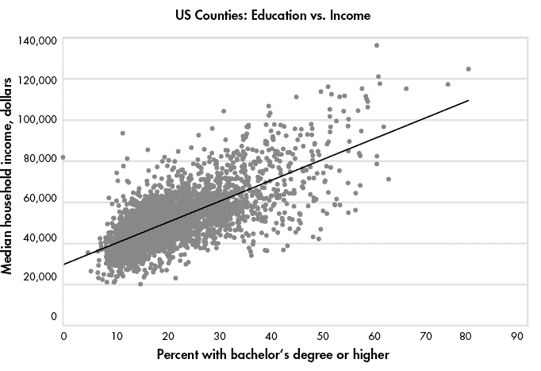
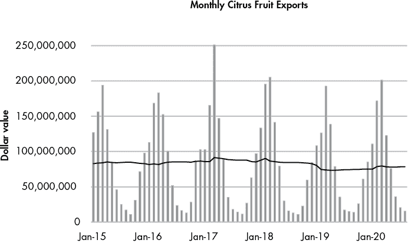

# 第十一章：SQL 中的统计函数


在本章中，我们将探索 SQL 统计函数以及使用它们的指南。当数据分析师需要做的不仅仅是计算总和和平均值时，SQL 数据库通常不是他们的首选工具。通常，首选的软件是功能齐全的统计软件包，如 SPSS 或 SAS，编程语言 R 或 Python，甚至是 Excel。但你不必忽视你的数据库。标准的 ANSI SQL，包括 PostgreSQL 的实现，提供了强大的统计函数和功能，可以在不需要将数据集导出到其他程序的情况下，揭示数据的许多信息。

统计学是一个广泛的学科，值得拥有一本自己的书，因此我们这里只是略微触及表面。不过，你将学会如何应用高级统计概念，通过使用来自美国人口普查局的新数据集，帮助你从数据中提取有意义的信息。你还将学会使用 SQL 创建排名，利用有关商业企业的数据计算比率，并通过滚动平均和总和平滑时间序列数据。

## 创建人口普查统计表

让我们回到我最喜欢的数据源之一——美国人口普查局。这次，你将使用来自 2014-2018 年美国社区调查（ACS）5 年估算的县级数据，这是该局的另一个产品。

使用 Listing 11-1 中的代码创建 `acs_2014_2018_stats` 表格，并导入 *acs_2014_2018_stats.csv* CSV 文件。代码和数据可以通过[`nostarch.com/practical-sql-2nd-edition/`](https://nostarch.com/practical-sql-2nd-edition/)获得，所有书籍资源都可以在该网站上找到。记得将 `C:\YourDirectory\` 更改为 CSV 文件的位置。

```
CREATE TABLE acs_2014_2018_stats (
  1 geoid text CONSTRAINT geoid_key PRIMARY KEY,
    county text NOT NULL,
    st text NOT NULL,
  2 pct_travel_60_min numeric(5,2),
    pct_bachelors_higher numeric(5,2),
    pct_masters_higher numeric(5,2),
    median_hh_income integer,
  3 CHECK (pct_masters_higher <= pct_bachelors_higher)
);

COPY acs_2014_2018_stats
FROM '`C:\YourDirectory\`acs_2014_2018_stats.csv'
WITH (FORMAT CSV, HEADER);

4 SELECT * FROM acs_2014_2018_stats;
```

Listing 11-1：创建 2014-2018 年 ACS 5 年估算表并导入数据

`acs_2014_2018_stats` 表格有七列。前三列包括一个唯一的 `geoid`，作为主键，`county`（县）名称，以及 `st`（州）名称。`county` 和 `st` 都带有 `NOT NULL` 约束，因为每行应该包含一个值。接下来的四列显示我从 ACS 发布的估算数据中为每个县导出的某些百分比数据，还有一个经济指标：

**`pct_travel_60_min`**

1.  16 岁及以上的工人中，通勤时间超过 60 分钟的百分比。

**`pct_bachelors_higher`**

1.  25 岁及以上人群中，教育水平为学士学位及以上的百分比。（在美国，学士学位通常是在完成四年制大学教育后授予的。）

**`pct_masters_higher`**

1.  25 岁及以上人群中，教育水平为硕士及以上的百分比。（在美国，硕士学位是在完成本科学位后获得的第一个高级学位。）

**`median_hh_income`**

1.  该县 2018 年通货膨胀调整后的家庭收入中位数。如第六章所述，中位数是一个有序数字集合中的中点，半数值大于中点，半数值小于中点。由于平均值可能会受到少数极大或极小值的影响，政府在报告经济数据（如收入）时通常使用中位数。

我们包括了一个`CHECK`约束 3，确保学士学位的数值等于或高于硕士学位的数值，因为在美国，学士学位通常是在硕士学位之前或与硕士学位同时获得。显示相反情况的县可能表明数据导入不正确或列标签错误。我们的数据经过检查：导入时，未发现任何违反`CHECK`约束的错误。

我们使用`SELECT`语句 4 来查看所有导入的 3,142 行数据，每一行都对应于本次人口普查发布中调查的一个县。

接下来，我们将使用 SQL 中的统计函数来更好地理解百分比之间的关系。

### 使用 corr(Y, X)测量相关性

*相关性*描述了两个变量之间的统计关系，衡量其中一个变量变化与另一个变量变化之间的关联程度。在本节中，我们将使用 SQL 中的`corr(``Y``,` `X``)`函数来衡量县中获得学士学位的百分比与该县家庭收入中位数之间是否存在关系。如果存在，我们还将确定根据数据，受过更好教育的人口是否通常意味着更高的收入，并且如果是，关系的强度如何。

首先，提供一些背景信息。*皮尔逊相关系数*（通常表示为*r*）衡量两个变量之间*线性关系*的强度和方向。具有强线性关系的变量在散点图上绘制时会聚集在一条直线上。*r*的皮尔逊值介于−1 和 1 之间；范围的任一端表示完全相关，而接近零的值则表示几乎没有相关性，数据呈现随机分布。正的*r*值表示*正相关*关系：当一个变量增加时，另一个变量也增加。绘制时，代表每对值的数据点会从左到右呈上升趋势。负的*r*值表示*反向* *关系*：当一个变量增加时，另一个变量减少。反向关系的点会在散点图上从左到右呈下降趋势。

表格 11-1 提供了关于正负*r*值的一般解释指南，尽管不同的统计学家可能会提供不同的解释。

表格 11-1：解读相关系数

| **相关系数 (+/−)** | **它可能意味着什么** |
| --- | --- |
| 0 | 无关系 |
| .01 到.29 | 弱关系 |
| .3 到.59 | 中等关系 |
| .6 到 .99 | 强关系到几乎完美关系 |
| 1 | 完美关系 |

在标准的 ANSI SQL 和 PostgreSQL 中，我们通过 `corr(``Y``,` `X``)` 来计算 Pearson 相关系数。这是 SQL 中几种 *二元聚合函数* 之一，之所以如此命名，是因为这些函数接受两个输入。输入 `Y` 是 *因变量*，其变化依赖于另一个变量的值，而 `X` 是 *自变量*，其值不依赖于其他变量。

我们将使用 `corr(``Y``,` `X``)` ``` to discover the relationship between education level and income, with income as our dependent variable and education as our independent variable. Enter the code in Listing 11-2 to use `corr(``Y``,` `X``)` ``with `median_hh_income` and `pct_bachelors_higher` as inputs.`` ```

```````` ``````` ``` SELECT corr(median_hh_income, pct_bachelors_higher)      AS bachelors_income_r  FROM acs_2014_2018_stats; ```    Listing 11-2: Using `corr(``Y``,` `X``)` to measure the relationship between education and income    Run the query; your result should be an *r* value of just below 0.70 given as the floating-point `double precision` data type:    ``` bachelors_income_r  ------------------  0.6999086502599159 ```    This positive *r* value indicates that as a county’s educational attainment increases, household income tends to increase. The relationship isn’t perfect, but the *r* value shows the relationship is fairly strong. We can visualize this pattern by plotting the variables on a scatterplot using Excel, as shown in Figure 11-1. Each data point represents one US county; the data point’s position on the x-axis shows the percentage of the population ages 25 and older that has a bachelor’s degree or higher. The data point’s position on the y-axis represents the county’s median household income.      Figure 11-1: A scatterplot showing the relationship between education and income      Notice that although most of the data points are grouped together in the bottom-left corner of the graph, they do generally slope upward from left to right. Also, the points spread out rather than strictly follow a straight line. If they were in a straight line sloping up from left to right, the *r* value would be 1, indicating a perfect positive linear relationship.    ### Checking Additional Correlations    Now let’s calculate the correlation coefficients for the remaining variable pairs using the code in Listing 11-3.    ``` SELECT    1 round(        corr(median_hh_income, pct_bachelors_higher)::numeric, 2        ) AS bachelors_income_r,      round(        corr(pct_travel_60_min, median_hh_income)::numeric, 2        ) AS income_travel_r,      round(        corr(pct_travel_60_min, pct_bachelors_higher)::numeric, 2        ) AS bachelors_travel_r  FROM acs_2014_2018_stats; ```    Listing 11-3: Using `corr(``Y``,` `X``)` on additional variables    This time we’ll round off the decimal values to make the output more readable by wrapping the `corr(``Y``,` `X``)` function inside SQL’s `round()` function 1, which takes two inputs: the `numeric` value to be rounded and an `integer` value indicating the number of decimal places to round the first value. If the second parameter is omitted, the value is rounded to the nearest whole integer. Because `corr(``Y``,` `X``)` ``returns a floating-point value by default, we cast it to the `numeric` type using the `::` notation you learned in Chapter 4. Here’s the output:``   `````` ``` bachelors_income_r    income_travel_r    bachelors_travel_r  ------------------    ---------------    ------------------                0.70               0.06                 -0.14 ```    The `bachelors_income_r` value is `0.70`, which is the same as our first run but rounded up to two decimal places. Compared to `bachelors_income_r`, the other two correlations are weak.    The `income_travel_r` value shows that the correlation between income and the percentage of those who commute more than an hour to work is practically zero. This indicates that a county’s median household income bears little connection to how long it takes people to get to work.    The `bachelors_travel_r` value shows that the correlation of bachelor’s degrees and lengthy commutes is also low at `-0.14`. The negative value indicates an inverse relationship: as education increases, the percentage of the population that travels more than an hour to work decreases. Although this is interesting, a correlation coefficient that is this close to zero indicates a weak relationship.    When testing for correlation, we need to note some caveats. The first is that even a strong correlation does not imply causality. We can’t say that a change in one variable causes a change in the other, only that the changes move together. The second is that correlations should be subject to testing to determine whether they’re statistically significant. Those tests are beyond the scope of this book but worth studying on your own.    Nevertheless, the SQL `corr(``Y``,` `X``)` `function is a handy tool for quickly checking correlations between variables.`   ````` ### Predicting Values with Regression Analysis    Researchers also want to predict values using available data. For example, let’s say 30 percent of a county’s population has a bachelor’s degree or higher. Given the trend in our data, what would we expect that county’s median household income to be? Likewise, for each percent increase in education, how much increase, on average, would we expect in income?    We can answer both questions using *linear regression*. Simply put, the regression method finds the best linear equation, or straight line, that describes the relationship between an independent variable (such as education) and a dependent variable (such as income). We can then look at points along this line to predict values where we don’t have observations. Standard ANSI SQL and PostgreSQL include functions that perform linear regression.    Figure 11-2 shows our previous scatterplot with a regression line added.      Figure 11-2: Scatterplot with least squares regression line showing the relationship between education and income      The straight line running through the middle of all the data points is called the *least squares regression line*, which approximates the “best fit” for a straight line that best describes the relationship between the variables. The equation for the regression line is like the *slope-intercept* formula you might remember from high school math but written using differently named variables: *Y* = *bX* + *a*. Here are the formula’s components:    1.  **Y** is the predicted value, which is also the value on the y-axis, or dependent variable. 2.  **b** is the slope of the line, which can be positive or negative. It measures how many units the y-axis value will increase or decrease for each unit of the x-axis value. 3.  **X** represents a value on the x-axis, or independent variable. 4.  **a** is the y-intercept, the value at which the line crosses the y-axis when the *X* value is zero.    Let’s apply this formula using SQL. Earlier, we questioned the expected median household income in a county where than 30 percent or more of the population had a bachelor’s degree. In our scatterplot, the percentage with bachelor’s degrees falls along the x-axis, represented by *X* in the calculation. Let’s plug that value into the regression line formula in place of *X*:    *Y* = *b*(30) + *a*    To calculate *Y*, which represents the predicted median household income, we need the line’s slope, *b*, and the y-intercept, *a*. To get these values, we’ll use the SQL functions `regr_slope(``Y``,` `X``)` and `regr_intercept(``Y``,` `X``)`, as shown in Listing 11-4.    ``` SELECT      round(          regr_slope(median_hh_income, pct_bachelors_higher)::numeric, 2          ) AS slope,      round(          regr_intercept(median_hh_income, pct_bachelors_higher)::numeric, 2          ) AS y_intercept  FROM acs_2014_2018_stats; ```    Listing 11-4: Regression slope and intercept functions    Using the `median_hh_income` and `pct_bachelors_higher` variables as inputs for both functions, we’ll set the resulting value of the `regr_slope(``Y``,` `X``)` function as `slope` and the output for the `regr_intercept(``Y``,` `X``)` function as `y_intercept`.    Run the query; the result should show the following:    ``` slope      y_intercept  -------    -----------  1016.55       29651.42 ```    The `slope` value shows that for every one-unit increase in bachelor’s degree percentage, we can expect a county’s median household income will increase by $1,016.55\. The `y_intercept` value shows that when the regression line crosses the y-axis, where the percentage with bachelor’s degrees is at 0, the y-axis value is 29,651.42\. Now let’s plug both values into the equation to get our predicted value *Y*:    *Y* = 1016.55(30) + 29651.42    *Y* = 60147.92    Based on our calculation, in a county in which 30 percent of people age 25 and older have a bachelor’s degree or higher, we can expect a median household income to be about $60,148\. Of course, our data includes counties whose median income falls above and below that predicted value, but we expect this to be the case because our data points in the scatterplot don’t line up perfectly along the regression line. Recall that the correlation coefficient we calculated was 0.70, indicating a strong but not perfect relationship between education and income. Other factors likely contributed to variations in income, such as the types of jobs available in each county.    ### Finding the Effect of an Independent Variable with r-Squared    Beyond determining the direction and strength of the relationship between two variables, we can also calculate the extent that the variation in the *x* (independent) variable explains the variation in the *y* (dependent) variable. To do this we square the *r* value to find the *coefficient of determination*, better known as *r-squared*. An *r*-squared indicates the percentage of the variation that is explained by the independent variable, and is a value between zero and one. For example, if *r*-squared equals 0.1, we would say that the independent variable explains 10 percent of the variation in the dependent variable, or not much at all.    To find *r*-squared, we use the `regr_r2(``Y``,` `X``)` function in SQL. Let’s apply it to our education and income variables using the code in Listing 11-5.    ``` SELECT round(          regr_r2(median_hh_income, pct_bachelors_higher)::numeric, 3          ) AS r_squared  FROM acs_2014_2018_stats; ```    Listing 11-5: Calculating the coefficient of determination, or *r*-squared    This time we’ll round off the output to the nearest thousandth place and alias the result to `r_squared`. The query should return the following result:    ``` r_squared  ---------      0.490 ```    The *r*-squared value of `0.490` indicates that about 49 percent of the variation in median household income among counties can be explained by the percentage of people with a bachelor’s degree or higher in that county. Any number of factors could explain the other 51 percent, and statisticians will typically test numerous combinations of variables to determine what they are.    Before you use these numbers in a headline or presentation, it’s worth revisiting the following points:    *   Correlation doesn’t prove causality. For verification, do a Google search on “correlation and causality.” Many variables correlate well but have no meaning. (See [`www.tylervigen.com/spurious-correlations`](https://www.tylervigen.com/spurious-correlations) for examples of correlations that don’t prove causality, including the correlation between divorce rate in Maine and margarine consumption.) Statisticians usually perform *significance testing* on the results to make sure values are not simply the result of randomness. *   Statisticians also apply additional tests to data before accepting the results of a regression analysis, including whether the variables follow the standard bell curve distribution and meet other criteria for a valid result.    Let’s explore two additional concepts before wrapping up our look at statistical functions.    ### Finding Variance and Standard Deviation    *Variance* and *standard deviation* describe the degree to which a set of values varies from the average of those values. Variance, often used in finance, is the average of each number’s squared distance from the average. The more dispersion in a set of values, the greater the variance. A stock market trader can use variance to measure the volatility of a particular stock—how much its daily closing values tend to vary from the average. That could indicate how risky an investment the stock might be.    Standard deviation is the square root of the variance and is most useful for assessing data whose values form a normal distribution, usually visualized as a symmetrical *bell curve*. In a *normal distribution*, about two-thirds of values fall within one standard deviation of the average; 95 percent are within two standard deviations. The standard deviation of a set of values, therefore, helps us understand how close most of our values are to the average. For example, consider a study that found the average height of adult US women is about 65.5 inches with a standard deviation of 2.5 inches. Given that heights are normally distributed, that means about two-thirds of women are within 2.5 inches of the average, or 63 inches to 68 inches tall.    When calculating variance and standard deviation, note that they report different units. Standard deviation is expressed in the same units as the values, while variance is not—it reports a number that is larger than the units, on a scale of its own.    These are the functions for calculating variance:    1.  `var_pop(numeric)` Calculates the population variance of the input values. In this context, *population* refers to a dataset that contains all possible values, as opposed to a sample that just contains a portion of all possible values. 2.  `var_samp(numeric)` Calculates the sample variance of the input values. Use this with data that is sampled from a population, as in a random sample survey.    For calculating standard deviation, we use these:    1.  `stddev_pop(numeric)` Calculates the population standard deviation. 2.  `stddev_samp(numeric)` `Calculates the sample standard deviation.`    ````With functions covering correlation, regression, and other descriptive statistics, you have a basic toolkit for obtaining a preliminary survey of your data before doing more rigorous analysis. All these topics are worth in-depth study to better understand when you might use them and what they measure. A classic, easy-to-understand resource I recommend is the book *Statistics* by David Freedman, Robert Pisani, and Roger Purves.    ## Creating Rankings with SQL    Rankings make the news often. You’ll see them used anywhere from weekend box-office charts to sports teams’ league standings. With SQL you can create numbered rankings in your query results, which are useful for tasks such as tracking changes over several years. You can also simply use a ranking as a fact on its own in a report. Let’s explore how to create rankings using SQL.    ### Ranking with rank() and dense_rank()    Standard ANSI SQL includes several ranking functions, but we’ll just focus on two: `rank()` and `dense_rank()`. Both are *window functions*, which are defined as functions that perform calculations across a set of rows relative to the current row. Unlike aggregate functions, which combine rows to calculate values, with window functions the query first generates a set of rows, and then the window function runs across the result set to calculate the value it will return.    The difference between `rank()` and `dense_rank()` is the way they handle the next rank value after a tie: `rank()` includes a gap in the rank order, but `dense_rank()` does not. This concept is easier to understand in action, so let’s look at an example. Consider a Wall Street analyst who covers the highly competitive widget manufacturing market. The analyst wants to rank companies by their annual output. The SQL statements in Listing 11-6 create and fill a table with this data and then rank the companies by widget output.    ``` CREATE TABLE widget_companies (      id integer PRIMARY KEY GENERATED ALWAYS AS IDENTITY,      company text NOT NULL,      widget_output integer NOT NULL  );    INSERT INTO widget_companies (company, widget_output)  VALUES      ('Dom Widgets', 125000),      ('Ariadne Widget Masters', 143000),      ('Saito Widget Co.', 201000),      ('Mal Inc.', 133000),      ('Dream Widget Inc.', 196000),      ('Miles Amalgamated', 620000),      ('Arthur Industries', 244000),      ('Fischer Worldwide', 201000);    SELECT      company,      widget_output,    1 rank() OVER (ORDER BY widget_output DESC),    2 dense_rank() OVER (ORDER BY widget_output DESC)  FROM widget_companies  ORDER BY widget_output DESC; ```    Listing 11-6: Using the `rank()` and `dense_rank()` window functions    Notice the syntax in the `SELECT` statement that includes `rank()` 1 and `dense_rank()` 2. After the function names, we use the `OVER` clause and in parentheses place an expression that specifies the “window” of rows the function should operate on. The *window* is the set of rows relative to the current row, and in this case, we want both functions to work on all rows of the `widget_output` column, sorted in descending order. Here’s the output:    ``` company                       widget_output    rank    dense_rank  --------------------------    -------------    ----    ----------  Miles Amalgamated                 620000         1          1  Arthur Industries                 244000         2          2  Fischer Worldwide                 201000         3          3  Saito Widget Co.                  201000         3          3  Dream Widget Inc.                 196000         5          4  Ariadne Widget Masters            143000         6          5  Mal Inc.                          133000         7          6  Dom Widgets                       125000         8          7 ```    The columns produced by `rank()` and `dense_rank()` show each company’s ranking based on the `widget_output` value from highest to lowest, with Miles Amalgamated at number one. To see how `rank()` and `dense_rank()` differ, check the fifth-row listing, Dream Widget Inc.    With `rank()`, Dream Widget Inc. is the fifth-highest-ranking company. Because `rank()` allows a gap in the order when a tie occurs, Dream placing fifth tells us there are four companies with more output. In contrast, `dense_rank()` doesn’t allow a gap in the rank order so it places Dream Widget Inc. in fourth place. This reflects the fact that Dream has the fourth-highest widget output regardless of how many companies produced more.    Both ways of handling ties have merit, but in practice `rank()` is used most often. It’s also what I recommend using, because it more accurately reflects the total number of companies ranked, shown by the fact that Dream Widget Inc. has four companies ahead of it in total output, not three.    Let’s look at a more complex ranking example.    ### Ranking Within Subgroups with PARTITION BY    The ranking we just did was a simple overall ranking based on widget output. But sometimes you’ll want to produce ranks within groups of rows in a table. For example, you might want to rank government employees by salary within each department or rank movies by box-office earnings within each genre.    To use window functions in this way, we’ll add `PARTITION BY` to the `OVER` clause. A `PARTITION BY` clause divides table rows according to values in a column we specify.    Here’s an example using made-up data about grocery stores. Enter the code in Listing 11-7 to fill a table called `store_sales`.    ``` CREATE TABLE store_sales (      store text NOT NULL,      category text NOT NULL,      unit_sales bigint NOT NULL,      CONSTRAINT store_category_key PRIMARY KEY (store, category)  );    INSERT INTO store_sales (store, category, unit_sales)  VALUES      ('Broders', 'Cereal', 1104),      ('Wallace', 'Ice Cream', 1863),      ('Broders', 'Ice Cream', 2517),      ('Cramers', 'Ice Cream', 2112),      ('Broders', 'Beer', 641),      ('Cramers', 'Cereal', 1003),      ('Cramers', 'Beer', 640),      ('Wallace', 'Cereal', 980),      ('Wallace', 'Beer', 988);    SELECT      category,      store,      unit_sales,    1 rank() OVER (PARTITION BY category ORDER BY unit_sales DESC)  FROM store_sales  2 ORDER BY category, rank() OVER (PARTITION BY category          ORDER BY unit_sales DESC); ```    Listing 11-7: Applying `rank()` within groups using `PARTITION BY`    In the table, each row includes a store’s product category and sales for that category. The final `SELECT` statement creates a result set showing how each store’s sales ranks within each category. The new element is the addition of `PARTITION BY` in the `OVER` clause 1. In effect, the clause tells the program to create rankings one category at a time, using the store’s unit sales in descending order.    To display the results by category and rank, we add an `ORDER BY` clause 2 that includes the `category` column and the same `rank()` function syntax. Here’s the output:    ``` category     store      unit_sales    rank  ---------    -------    ----------    ----  Beer         Wallace           988       1  Beer         Broders           641       2  Beer         Cramers           640       3  Cereal       Broders          1104       1  Cereal       Cramers          1003       2  Cereal       Wallace           980       3  Ice Cream    Broders          2517       1  Ice Cream    Cramers          2112       2  Ice Cream    Wallace          1863       3 ```    Rows for each category are ordered by category unit sales with the `rank` column displaying the ranking.    Using this table, we can see at a glance how each store ranks in a food category. For instance, Broders tops sales for cereal and ice cream, but Wallace wins in the beer category. You can apply this concept to many other scenarios: for each auto manufacturer, finding the vehicle with the most consumer complaints; figuring out which month had the most rainfall in each of the last 20 years; finding the team with the most wins against left-handed pitchers; and so on.    ## Calculating Rates for Meaningful Comparisons    Rankings based on raw counts aren’t always meaningful; in fact, they can be misleading. Consider birth statistics: the US National Center for Health Statistics (NCHS) reported that in 2019, there were 377,599 babies born in the state of Texas and 46,826 born in the state of Utah. So, women in Texas are more likely to have babies, right? Not so fast. In 2019, Texas’ estimated population was nine times as much as Utah’s. Given that context, comparing the plain number of births in the two states isn’t very meaningful.    A more accurate way to compare these numbers is to convert them to rates. Analysts often calculate a rate per 1,000 people, or some multiple of that number, to allow an apples-to-apples comparison. For example, the fertility rate—the number of births per 1,000 women ages 15 to 44—was 62.5 for Texas in 2019 and 66.7 for Utah, according to the NCHS. So, despite the smaller number of births, on a per-1,000 rate, women in Utah actually had more children.    The math behind this is simple. Let’s say your town had 115 births and a population of 2,200 women ages 15 to 44\. You can find the per-1,000 rate as follows:    (115 / 2,200) × 1,000 = 52.3    In your town, there were 52.3 births per 1,000 women ages 15 to 44, which you can now compare to other places regardless of their size.    ### Finding Rates of Tourism-Related Businesses    Let’s try calculating rates using SQL and census data. We’ll join two tables: the census population estimates you imported in Chapter 5 plus data I compiled about tourism-related businesses from the census’ County Business Patterns program. (You can read about the program methodology at [`www.census.gov/programs-surveys/cbp/about.html`](https://www.census.gov/programs-surveys/cbp/about.html).)    Listing 11-8 contains the code to create and fill the business patterns table. Remember to point the script to the location in which you’ve saved the CSV file *cbp_naics_72_establishments.csv*, which you can download from GitHub via the link at [`nostarch.com/practical-sql-2nd-edition/`](https://nostarch.com/practical-sql-2nd-edition/).    ``` CREATE TABLE cbp_naics_72_establishments (      state_fips text,      county_fips text,      county text NOT NULL,      st text NOT NULL,      naics_2017 text NOT NULL,      naics_2017_label text NOT NULL,      year smallint NOT NULL,      establishments integer NOT NULL,      CONSTRAINT cbp_fips_key PRIMARY KEY (state_fips, county_fips)  );    COPY cbp_naics_72_establishments  FROM '`C:\YourDirectory\`cbp_naics_72_establishments.csv'  WITH (FORMAT CSV, HEADER);    SELECT *  FROM cbp_naics_72_establishments  ORDER BY state_fips, county_fips  LIMIT 5; ```    Listing 11-8: Creating and filling a table for census county business pattern data    Once you’ve imported the data, run the final `SELECT` statement to view the first few rows of the table. Each row contains descriptive information about a county along with the number of business establishments that fall under code 72 of the North American Industry Classification System (NAICS). Code 72 covers “Accommodation and Food Services” establishments, mainly hotels, inns, bars, and restaurants. The number of those businesses in a county is a good proxy for the amount of tourist and recreation activity in the area.    Let’s find out which counties have the highest concentration of such businesses per 1,000 population, using the code in Listing 11-9.    ``` SELECT      cbp.county,      cbp.st,      cbp.establishments,      pop.pop_est_2018,    1 round( (cbp.establishments::numeric / pop.pop_est_2018) * 1000, 1 )          AS estabs_per_1000  FROM cbp_naics_72_establishments cbp JOIN us_counties_pop_est_2019 pop      ON cbp.state_fips = pop.state_fips      AND cbp.county_fips = pop.county_fips  2 WHERE pop.pop_est_2018 >= 50000  ORDER BY cbp.establishments::numeric / pop.pop_est_2018 DESC; ```    Listing 11-9: Finding business rates per thousand population in counties with 50,000 or more people    Overall, this syntax should look familiar. In Chapter 5, you learned that when dividing an integer by an integer, one of the values must be a `numeric` or `decimal` for the result to include decimal places. We do that in the rate calculation 1 with PostgreSQL’s double-colon shorthand. Because we don’t need many decimal places, we wrap the statement in the `round()` function to round off the output to the nearest tenth. Then we give the calculated column an alias of `estabs_per_1000` for easy reference.    Also, we use a `WHERE` clause 2 to limit our results to counties with 50,000 or more people. That’s an arbitrary value that lets us see how rates compare within a group of more-populous, better-known counties. Here’s a portion of the results, sorted with highest rates at top:    ```  county             st      establishments  pop_est_2018  estabs_per_1000  ------------------ ----------- --------------- ------------- ---------------  Cape May County    New Jersey              925         92446            10.0  Worcester County   Maryland                453         51960             8.7  Monroe County      Florida                 540         74757             7.2  Warren County      New York                427         64215             6.6  New York County    New York              10428       1629055             6.4  Hancock County     Maine                   337         54734             6.2  Sevier County      Tennessee               570         97895             5.8  Eagle County       Colorado                309         54943             5.6  `--snip--` ```    The counties that have the highest rates make sense. Cape May County, New Jersey, is home to numerous beach resort towns on the Atlantic Ocean and Delaware Bay. Worcester County, Maryland, contains Ocean City and other beach attractions. And Monroe County, Florida, is best known for its vacation hotspot, the Florida Keys. Sense a pattern?    ## Smoothing Uneven Data    A *rolling average* is an average calculated for each time period in a dataset, using a moving window of rows as input each time. Think of a hardware store: it might sell 20 hammers on Monday, 15 hammers on Tuesday, and just a few the rest of the week. The next week, hammer sales might spike on Friday. To find the big-picture story in such uneven data, we can smooth numbers by calculating the rolling average, sometimes called a *moving average*.    Here are two weeks of hammer sales at that hypothetical hardware store:    ``` Date        Hammer sales  Seven-day average  ----------  ------------  -----------------  2022-05-01       0  2022-05-02      20  2022-05-03      15  2022-05-04       3  2022-05-05       6  2022-05-06       1  1 2022-05-07       1             6.6  2 2022-05-08       2             6.9  2022-05-09      18             6.6  2022-05-10      13             6.3  2022-05-11       2             6.1  2022-05-12       4             5.9  2022-05-13      12             7.4  2022-05-14       2             7.6 ```    Let’s say that for every day we want to know the average sales over the last seven days (we can choose any period, but a week is an intuitive unit). Once we have seven days of data 1, we calculate the average of sales over the seven-day period that includes the current day. The average of hammer sales from May 1 to May 7, 2022, is `6.6` per day.    The next day 2, we again average sales over the most recent seven days, from May 2 to May 8, 2022\. The result is `6.9` per day. As we continue each day, despite the ups and downs in the daily sales, the seven-day average remains fairly steady. Over a long period of time, we’ll be able to better discern a trend.    Let’s use the window function syntax again to perform this calculation using the code in Listing 11-10. The code and data are available with all the book’s resources in GitHub, available via [`nostarch.com/practical-sql-2nd-edition/`](https://nostarch.com/practical-sql-2nd-edition/). Remember to change `C:\YourDirectory\` to the location of the CSV file.    ``` 1 CREATE TABLE us_exports (      year smallint,      month smallint,      citrus_export_value bigint,      soybeans_export_value bigint  );    2 COPY us_exports  FROM '`C:\YourDirectory\`us_exports.csv'  WITH (FORMAT CSV, HEADER);    3 SELECT year, month, citrus_export_value  FROM us_exports  ORDER BY year, month;    4 SELECT year, month, citrus_export_value,      round(         5 avg(citrus_export_value)              6 OVER(ORDER BY year, month                   7 ROWS BETWEEN 11 PRECEDING AND CURRENT ROW), 0)            AS twelve_month_avg  FROM us_exports  ORDER BY year, month; ```    Listing 11-10: Creating a rolling average for export data    We create a table 1 and use `COPY` 2 to insert data from *us_exports.csv*. This file contains data showing the monthly dollar value of US exports of citrus fruit and soybeans, two commodities whose sales are tied to the growing season. The data comes from the US Census Bureau’s international trade division at [`usatrade.census.gov/`](https://usatrade.census.gov/).    The first `SELECT` statement 3 lets you view the monthly citrus export data, which covers every month from 2002 through summer 2020\. The last dozen rows should look like this:    ``` year month citrus_export_value  ---- ----- -------------------  `--snip--`  2019     9            14012305  2019    10            26308151  2019    11            60885676  2019    12            84873954  2020     1           110924836  2020     2           171767821  2020     3           201231998  2020     4           122708243  2020     5            75644260  2020     6            36090558  2020     7            20561815  2020     8            15510692 ```    Notice the pattern: the value of citrus fruit exports is highest in winter months, when the growing season is paused in the northern hemisphere and countries need imports to meet demand. We’ll use the second `SELECT` statement 4 to compute a 12-month rolling average so we can see, for each month, the annual trend in exports.    In the `SELECT` values list, we place an `avg()` 5 function to calculate the average of the values in the `citrus_export_value` column. We follow the function with an `OVER` clause 6 that has two elements in parentheses: an `ORDER BY` clause that sorts the data for the period we plan to average, and the number of rows to average, using the keywords `ROWS BETWEEN 11 PRECEDING AND CURRENT ROW` 7. This tells PostgreSQL to limit the window to the current row and the 11 rows before it—12 total.    We wrap the entire statement, from the `avg()` function through the `OVER` clause, in a `round()` function to limit the output to whole numbers. The last dozen rows of your query result should be as follows:    ``` year month citrus_export_value twelve_month_avg  ---- ----- ------------------- ----------------  `--snip--`  2019     9            14012305         74465440  2019    10            26308151         74756757  2019    11            60885676         74853312  2019    12            84873954         74871644  2020     1           110924836         75099275  2020     2           171767821         78874520  2020     3           201231998         79593712  2020     4           122708243         78278945  2020     5            75644260         77999174  2020     6            36090558         78045059  2020     7            20561815         78343206  2020     8            15510692         78376692 ```    Notice the 12-month average is far more consistent. If we want to see the trend, it’s helpful to graph the results using Excel or a stats program. Figure 11-3 shows the monthly totals from 2015 through August 2020 in bars, with the 12-month average as a line.      Figure 11-3: Monthly citrus fruit exports with 12-month rolling average      Based on the rolling average, citrus fruit exports were generally steady until 2019 and then trended down before recovering slightly in 2020\. It’s difficult to discern that movement from the monthly data, but the rolling average makes it apparent.    The window function syntax offers multiple options for analysis. For example, instead of calculating a rolling average, you could substitute the `sum()` function to find the rolling total over a time period. If you calculated a seven-day rolling sum, you’d know the weekly total ending on any day in your dataset.    SQL offers additional window functions. Check the official PostgreSQL documentation at [`www.postgresql.org/docs/current/tutorial-window.html`](https://www.postgresql.org/docs/current/tutorial-window.html) for an overview of window functions, and check [`www.postgresql.org/docs/current/functions-window.html`](https://www.postgresql.org/docs/current/functions-window.html) for a listing of window functions.    ## Wrapping Up    Now your SQL analysis toolkit includes ways to find relationships among variables using statistical functions, create rankings from ordered data, smooth spiky data to find trends, and properly compare raw numbers by turning them into rates. That toolkit is starting to look impressive!    Next, we’ll dive deeper into date and time data, using SQL functions to extract the information we need.```` ````` `````` ``````` ````````
