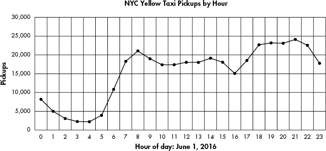

# 第十二章：处理日期和时间


填充了日期和时间的列可以表示事件发生的*时间*或*持续时间*，这可以引导出一些有趣的探究方向。时间轴上的时刻存在哪些模式？哪些事件持续时间最短或最长？某项活动与发生的时间段或季节之间有什么关系？

在本章中，我们将使用 SQL 日期和时间的数据类型及其相关函数来探索这些问题。我们将从更详细地了解与日期和时间相关的数据类型和函数开始。接着，我们将探讨一个纽约市出租车出行数据集，寻找模式并尝试发现数据讲述的故事（如果有的话）。我们还将使用 Amtrak 的数据探索时区，计算美国境内火车旅行的持续时间。

## 理解日期和时间的数据类型及函数

第四章探讨了主要的 SQL 数据类型，下面是与日期和时间相关的四种数据类型，供复习：

1.  `timestamp` 记录日期和时间。你几乎总是希望添加关键字`with time zone`，以确保存储的时间包含时区信息。否则，全球范围内记录的时间将无法进行比较。`timestamp with time zone`格式是 SQL 标准的一部分；在 PostgreSQL 中，你可以使用`timestamptz`来指定相同的数据类型。你可以通过三种不同的格式指定时区：UTC 偏移量、区域/位置标识符，或标准缩写。如果你向`timestamptz`列提供没有时区的时间，数据库将根据服务器的默认设置自动添加时区信息。

1.  `date` ``仅记录日期，是 SQL 标准的一部分。PostgreSQL 支持多种日期格式。例如，表示 2022 年 9 月 21 日有效的格式有`September 21, 2022`或`9/21/2022`。我推荐使用`YYYY-MM-DD`（或`2022-09-21`），这是一种 ISO 8601 国际标准格式，也是 PostgreSQL 的默认日期输出格式。使用 ISO 格式有助于避免在国际分享数据时产生混淆。``

`````` *   `time` ``Records only the time and is part of the SQL standard. Adding `with time zone` makes the column time zone aware, but without a date the time zone will be meaningless. Given that, using `time with time zone` and its PostgreSQL shortcut `timetz` is strongly discouraged. The ISO 8601 format is `HH:MM:SS`, where `HH` represents the hour, `MM` the minutes, and `SS` the seconds.````` *   `interval` ``Holds a value that represents a unit of time expressed in the format `quantity unit`. It doesn’t record the start or end of a period, only its duration. Examples include `12 days` or `8 hours`. It’s also part of the SQL standard, although PostgreSQL-specific syntax offers more options.`` ``` ``````

``````` `````` The first three data types, `date`, `time`, and `timestamp with time zone` (or `timestamptz`), are known as *datetime types* whose values are called *datetimes*. The `interval` value is an *interval type* whose values are *intervals*. All four data types can track the system clock and the nuances of the calendar. For example, `date` and `timestamp with time zone` recognize that June has 30 days. If you try to use June 31, PostgreSQL will display an error: `date/time field value out of range`. Likewise, the date February 29 is valid only in a leap year, such as 2024.    ## Manipulating Dates and Times    We can use SQL functions to perform calculations on dates and times or extract their components. For example, we can retrieve the day of the week from a timestamp or extract just the month from a date. ANSI SQL outlines a handful of functions for this purpose, but many database managers (including MySQL and Microsoft SQL Server) deviate from the standard to implement their own date and time data types, syntax, and function names. If you’re using a database other than PostgreSQL, check its documentation.    Let’s review how to manipulate dates and times using PostgreSQL functions.    ### Extracting the Components of a timestamp Value    It’s not unusual to need just one piece of a date or time value for analysis, particularly when you’re aggregating results by month, year, or even minute. We can extract these components using the PostgreSQL `date_part()` function. Its format looks like this:    ``` date_part(`text`, `value`) ```    The function takes two inputs. The first is a string in `text` format that represents the part of the date or time to extract, such as `hour`, `minute`, or `week`. The second is the `date`, `time`, or `timestamp` value. To see the `date_part()` function in action, we’ll execute it multiple times on the same value using the code in Listing 12-1.    ``` SELECT    date_part('year', '2022-12-01 18:37:12 EST'::timestamptz) AS year,    date_part('month', '2022-12-01 18:37:12 EST'::timestamptz) AS month,    date_part('day', '2022-12-01 18:37:12 EST'::timestamptz) AS day,    date_part('hour', '2022-12-01 18:37:12 EST'::timestamptz) AS hour,    date_part('minute', '2022-12-01 18:37:12 EST'::timestamptz) AS minute,    date_part('seconds', '2022-12-01 18:37:12 EST'::timestamptz) AS seconds,    date_part('timezone_hour', '2022-12-01 18:37:12 EST'::timestamptz) AS tz,    date_part('week', '2022-12-01 18:37:12 EST'::timestamptz) AS week,    date_part('quarter', '2022-12-01 18:37:12 EST'::timestamptz) AS quarter,    date_part('epoch', '2022-12-01 18:37:12 EST'::timestamptz) AS epoch; ```    Listing 12-1: Extracting components of a `timestamp` value using `date_part()`    Each column statement in this `SELECT` query first uses a string to name the component we want to extract: `year`, `month`, `day`, and so on. The second input uses the string `2022-12-01 18:37:12 EST` cast as a `timestamp with time zone` with the PostgreSQL double-colon syntax and the `timestamptz` shorthand. We specify that this timestamp occurs in the Eastern time zone using the Eastern Standard Time (EST) designation.    Here’s the output as shown on my computer. The database converts the values to reflect your PostgreSQL time zone setting, so your output might be different; for example, if it’s set to the US Pacific time zone, the hour will show as `15`:    ``` year    month    day    hour    minute    seconds    tz    week    quarter    epoch  ----    -----    ---    ----    ------    -------    --    ----    -------    ----------  2022       12      1      18        37         12    -5      48          4    1669937832 ```    Each column contains a single component of the timestamp that represents 6:37:12 pm on December 1, 2022\. The first six values are easy to recognize from the original timestamp, but the last four deserve an explanation.    In the `tz` column, PostgreSQL reports back the hours difference, or *offset*, from Coordinated Universal Time (UTC), the time standard for the world. The value of UTC is +/− 00:00, so `-5` specifies a time zone five hours behind UTC. From November through early March, UTC -5 represents the Eastern time zone. In March, when the Eastern time zone moves to daylight saving time and clocks “spring forward” an hour, its UTC offset changes to -4\. (For a map of UTC time zones, see [`en.wikipedia.org/wiki/Coordinated_Universal_Time#/media/File:Standard_World_Time_Zones.tif`](https://en.wikipedia.org/wiki/Coordinated_Universal_Time#/media/File:Standard_World_Time_Zones.tif).)    The `week` column shows that December 1, 2022, falls in the 48th week of the year. This number is determined by ISO 8601 standards, which start each week on a Monday. A week at the end of a year can extend from December into January of the following year.    The `quarter` column shows that our test date is part of the fourth quarter of the year. The `epoch` column shows a measurement, which is used in computer systems and programming languages, that represents the number of seconds elapsed before or after 12 am, January 1, 1970, at UTC 0\. A positive value designates a time since that point; a negative value designates a time before it. In this example, 1,669,937,832 seconds elapsed between January 1, 1970, and the timestamp. Epoch can be useful for comparing two timestamps mathematically on an absolute scale.    PostgreSQL also supports the SQL-standard `extract()` function, which parses datetimes in the same way as the `date_part()` function. I’ve featured `date_part()` here instead for two reasons. First, its name helpfully reminds us what it does. Second, `extract()` isn’t widely supported by other database managers. Most notably, it’s absent in Microsoft’s SQL Server. Nevertheless, if you need to use `extract()`, the syntax takes this form:    ``` extract(`text` from `value`) ```    To replicate the first `date_part()` example in Listing 12-1 where we pull the year from the timestamp, we’d set up `extract()` like this (note that we don’t need single quotes around the time unit, in this case `year`):    ``` extract(year from '2022-12-01 18:37:12 EST'::timestamptz) ```    PostgreSQL provides additional components you can extract or calculate from dates and times. For the full list of functions, see the documentation at [`www.postgresql.org/docs/current/functions-datetime.html`](https://www.postgresql.org/docs/current/functions-datetime.html).    ### Creating Datetime Values from timestamp Components    It’s not unusual to come across a dataset in which the year, month, and day exist in separate columns, and you might want to create a datetime value from these components. To perform calculations on a date, it’s helpful to combine and format those pieces correctly into one column.    You can use the following PostgreSQL functions to make datetime objects:    1.  `make_date(year, month, day)` ``Returns a value of type `date`.`` ````` *   `make_time(hour, minute, seconds)` ``Returns a value of type `time` without time zone.````*   `make_timestamptz(year, month, day, hour, minute, second, time zone)` Returns a timestamp with time zone.`` `````   ````` ````The variables for these three functions take `integer` types as input, with two exceptions: seconds are of the type `double precision` because you can supply fractions of seconds, and time zones must be specified with a `text` string that names the time zone.    Listing 12-2 shows examples of the three functions in action using components of February 22, 2022, for the date, and 6:04:30.3 pm in Lisbon, Portugal for the time.    ``` SELECT make_date(2022, 2, 22);  SELECT make_time(18, 4, 30.3);  SELECT make_timestamptz(2022, 2, 22, 18, 4, 30.3, 'Europe/Lisbon'); ```    Listing 12-2: Three functions for making datetimes from components    When I run each query in order, the output on my computer is as follows. Again, yours may differ depending on your PostgreSQL time zone setting:    ``` 2022-02-22  18:04:30.3  2022-02-22 13:04:30.3-05 ```    Notice that on my computer the timestamp in the third line shows `13:04:30.3`, which is five hours behind the time input to the function: `18:04:30.3`. That output is appropriate because Lisbon’s time zone is at UTC 0, and my PostgreSQL is set to the Eastern time zone, which is UTC –5 in winter months. We’ll explore working with time zones in more detail, and you’ll learn to adjust its display, in the “Working with Time Zones” section.    ### Retrieving the Current Date and Time    If you need to record the current date or time as part of a query—when updating a row, for example—standard SQL provides functions for that too. The following functions record the time as of the start of the query:    1.  `current_timestamp`Returns the current timestamp with time zone. A shorthand PostgreSQL-specific version is `now()`. 2.  `localtimestamp`Returns the current timestamp without time zone. Avoid using `localtimestamp`, as a timestamp without a time zone can’t be placed in a global location and is thus meaningless. 3.  `current_``date`Returns the date. 4.  `current_time`Returns the current time with time zone. Remember, though, without a date, the time alone with a time zone is useless. 5.  `localtime` Returns the current time without time zone.    Because these functions record the time at the start of the query (or a collection of queries grouped under a *transaction*—see Chapter 10), they’ll provide that same time throughout the execution of a query regardless of how long the query runs. So, if your query updates 100,000 rows and takes 15 seconds to run, any timestamp recorded at the start of the query will be applied to each row, and so each row will receive the same timestamp.    If, instead, you want the date and time to reflect how the clock changes during the execution of the query, you can use the PostgreSQL-specific `clock_timestamp()` function to record the current time as it elapses. That way, if you’re updating 100,000 rows and inserting a timestamp each time, each row gets the time the row updated rather than the time at the start of the query. Note that `clock_timestamp()` can slow large queries and may be subject to system limitations.    Listing 12-3 shows `current_timestamp` and `clock_timestamp()` in action when inserting a row in a table.    ``` CREATE TABLE current_time_example (      time_id integer GENERATED ALWAYS AS IDENTITY,    1 current_timestamp_col timestamptz,    2 clock_timestamp_col timestamptz  );    INSERT INTO current_time_example              (current_timestamp_col, clock_timestamp_col)    3 (SELECT current_timestamp,              clock_timestamp()       FROM generate_series(1,1000));    SELECT * FROM current_time_example; ```    Listing 12-3: Comparing `current_timestamp` and `clock_timestamp()` during row insert    The code creates a table that includes two `timestamptz` columns (the PostgreSQL shorthand for `timestamp with time zone`). The first holds the result of the `current_timestamp` function 1, which records the time at the start of the `INSERT` statement that adds 1,000 rows to the table. To do that, we use the `generate_series()` function, which returns a set of integers starting with 1 and ending with 1,000\. The second column holds the result of the `clock_timestamp()` function 2, which records the time of insertion of each row. You call both functions as part of the `INSERT` statement 3. Run the query, and the result from the final `SELECT` statement should show that the time in the `current_timestamp_col` is the same for all rows, whereas the time in `clock_timestamp_col` increases with each row inserted.    ## Working with Time Zones    Recording a timestamp is most useful when you know where on the globe that time occurred—whether in Asia, Eastern Europe, or one of the 12 time zones of Antarctica.    Sometimes, however, datasets contain no time zone data in their datetime columns. This isn’t always a deal-breaker in terms of analyzing the data. If you know that every event happened in the same location—for example, readings from a temperature sensor in Bar Harbor, Maine—you can factor that into your analysis. Better, though, during import is to set your session time zone to represent the time zone of the data and load the datetimes into a `timestamptz` column. That strategy helps ward off dangerous misinterpretation of the data later.    Let’s look at some strategies for managing how we work with time zones.    ### Finding Your Time Zone Setting    When working with timestamps that contain time zones, it’s important to know your current time zone setting. If you installed PostgreSQL on your own computer, the server’s default will be your local time zone. If you’re connecting to a PostgreSQL database elsewhere, perhaps on a cloud provider such as Amazon Web Services, its time zone setting may be different than your own. To help avoid confusion, database administrators often set a shared server’s time zone to UTC.    Listing 12-4 shows two ways to view your current time zone setting: the `SHOW` command with `timezone` keyword and the `current_setting()` function with a `timezone` argument.    ``` SHOW timezone;  SELECT current_setting('timezone'); ```    Listing 12-4: Viewing your current time zone setting    Running either statement will display your time zone setting, which will vary according to your operating system and locale. Entering the statements in Listing 12-4 into pgAdmin and running both my macOS and Linux computers returns `America/New_York`, one of several location names that falls into the Eastern time zone, which encompasses eastern Canada and the United States, the Caribbean, and parts of Mexico. On my Windows machine, the setting shows as `US/Eastern`.    Though both statements provide the same information, you may find `current_setting()` extra handy as an input to another function such as `make_timestamptz()`:    ```  SELECT make_timestamptz(2022, 2, 22, 18, 4, 30.3, current_setting('timezone')); ```    Listing 12-5 shows how to retrieve all time zone names, abbreviations, and their UTC offsets.    ``` SELECT * FROM pg_timezone_abbrevs ORDER BY abbrev;  SELECT * FROM pg_timezone_names ORDER BY name; ```    Listing 12-5: Showing time zone abbreviations and names    You can easily filter either of these `SELECT` statements with a `WHERE` clause to look up specific location names or time zones:    ``` SELECT * FROM pg_timezone_names  WHERE name LIKE 'Europe%'  ORDER BY name; ```    This code should return a table listing that includes the time zone name, abbreviation, UTC offset, and a `boolean` column `is_dst` that notes whether the time zone is currently observing daylight saving time:    ``` name                abbrev    utc_offset    is_dst  ----------------    ------    ----------    ------  Europe/Amsterdam    CEST      02:00:00      true  Europe/Andorra      CEST      02:00:00      true  Europe/Astrakhan    +04       04:00:00      false  Europe/Athens       EEST      03:00:00      true  Europe/Belfast      BST       01:00:00      true  `--snip--` ```    This is a faster way of looking up time zones than using Wikipedia. Now let’s look at how to set the time zone to a particular value.    ### Setting the Time Zone    When you installed PostgreSQL, the server’s default time zone was set as a parameter in *postgresql.conf*, a file that contains dozens of values read by PostgreSQL each time it starts. The location of *postgresql.conf* in your file system varies depending on your operating system and sometimes on the way you installed PostgreSQL. To make permanent changes to *postgresql.conf*, such as changing your time zone, you need to edit the file and restart the server, which might be impossible if you’re not the owner of the machine. Changes to configurations might also have unintended consequences for other users or applications. Instead, we’ll look at setting the time zone on a per-session basis, which should last as long as you’re connected to the server, and then I’ll cover working with *postgresql.conf* in more depth in Chapter 19. This solution is handy when you want to specify how you view a particular table or handle timestamps in a query.    To set the time zone for the current session while using pgAdmin, we use the command `SET TIME ZONE`, as shown in Listing 12-6.    ``` 1 SET TIME ZONE 'US/Pacific';    2 CREATE TABLE time_zone_test (      test_date timestamptz  );  3 INSERT INTO time_zone_test VALUES ('2023-01-01 4:00');    4 SELECT test_date  FROM time_zone_test;    5 SET TIME ZONE 'US/Eastern';    6 SELECT test_date  FROM time_zone_test;    7 SELECT test_date AT TIME ZONE 'Asia/Seoul'  FROM time_zone_test; ```    Listing 12-6: Setting the time zone for a client session    First, we set the time zone to `US/Pacific` 1, which designates the Pacific time zone that covers western Canada and the United States along with Baja California in Mexico. The syntax `SET TIME ZONE` is part of the ANSI SQL standard. PostgreSQL also supports the nonstandard syntax `SET timezone TO`.    Second, we create a one-column table 2 with a data type of `timestamptz` and insert a single row to display a test result. Notice that the value inserted, `2023-01-01 4:00`, is a timestamp with no time zone 3. You’ll encounter timestamps with no time zone often, particularly when you acquire datasets restricted to a specific location.    When executed, the first `SELECT` statement 4 returns `2023-01-01 4:00` as a timestamp that now contains time zone data:    ``` test_date  ----------------------  2023-01-01 04:00:00-08 ```    Here, the `-08` shows that the Pacific time zone is eight hours behind UTC in January, when standard time is in effect. Because we set the pgAdmin client’s time zone to `US/Pacific` for this session, any value without a time zone entered into a column that is time zone-aware will be set to Pacific time. If we had entered a date that falls during daylight saving time, the UTC offset would be `-07`.    Now comes some fun. We change the time zone for this session to the Eastern time zone using the `SET` command 5 and the `US/Eastern` designation. Then, when we execute the `SELECT` statement 6 again, the result should be as follows:    ``` test_date  ----------------------  2023-01-01 07:00:00-05 ```    In this example, two components of the timestamp have changed: the time is now `07:00`, and the UTC offset is `-05` because we’re viewing the timestamp from the perspective of the Eastern time zone: 4 am Pacific is 7 am Eastern. The database converts the original Pacific time value to whatever time zone we set at 5.    Even more convenient is that we can view a timestamp through the lens of any time zone without changing the session setting. The final `SELECT` statement uses the `AT TIME ZONE` keywords 7 to display the timestamp in our session as the Korea standard time (KST) zone by specifying `Asia/Seoul`:    ``` timezone  -------------------  2023-01-01 21:00:00 ```    Now we know that the value of 4 am in `US/Pacific` on January 1, 2023, is equivalent to 9 pm that same day in `Asia/Seoul`. Again, this syntax changes the output data, but the data on the server remains unchanged. When using the `AT TIME ZONE` keywords, also note this quirk: if the original value is a `timestamp with time zone`, the output is a `timestamp` with no time zone. If the original value has no time zone, the output is `timestamp with time zone`.    The ability of databases to track time zones is extremely important for accurate calculations of intervals, as you’ll see next.    ## Performing Calculations with Dates and Times    We can perform simple arithmetic on datetime and interval types the same way we can on numbers. Addition, subtraction, multiplication, and division are all possible in PostgreSQL using the math operators `+`, `-`, `*`, and `/`. For example, you can subtract one date from another date to get an integer that represents the difference in days between the two dates. The following code returns an integer of `3`:    ``` SELECT '1929-09-30'::date - '1929-09-27'::date; ```    The result indicates that these two dates are exactly three days apart.    Likewise, you can use the following code to add a time interval to a date to return a new date:    ``` SELECT '1929-09-30'::date + '5 years'::interval; ```    This code adds five years to the date `1929-09-30` to return a timestamp value of `1934-09-30`.    More examples of math functions you can use with dates and times are available in the PostgreSQL documentation at [`www.postgresql.org/docs/current/functions-datetime.html`](https://www.postgresql.org/docs/current/functions-datetime.html). Let’s explore some more practical examples using actual transportation data.    ### Finding Patterns in New York City Taxi Data    When I visit New York City, I usually take at least one ride in one of the thousands of iconic yellow cars that ferry hundreds of thousands of people across the city’s five boroughs each day. The New York City Taxi and Limousine Commission releases data on monthly yellow taxi trips plus other for-hire vehicles. We’ll use this large, rich dataset to put date functions to practical use.    The *nyc_yellow_taxi_trips.csv* file available from the book’s resources on GitHub (via the link at [`nostarch.com/practical-sql-2nd-edition/`](https://nostarch.com/practical-sql-2nd-edition/)) holds one day of yellow taxi trip records from June 1, 2016\. Save the file to your computer and execute the code in Listing 12-7 to build the `nyc_yellow_taxi_trips` table. Remember to change the file path in the `COPY` command to the location where you’ve saved the file and adjust the path format to reflect whether you’re using Windows, macOS, or Linux.    ``` 1 CREATE TABLE nyc_yellow_taxi_trips (      trip_id bigint GENERATED ALWAYS AS IDENTITY PRIMARY KEY,      vendor_id text NOT NULL,      tpep_pickup_datetime timestamptz NOT NULL,      tpep_dropoff_datetime timestamptz NOT NULL,      passenger_count integer NOT NULL,      trip_distance numeric(8,2) NOT NULL,      pickup_longitude numeric(18,15) NOT NULL,      pickup_latitude numeric(18,15) NOT NULL,      rate_code_id text NOT NULL,      store_and_fwd_flag text NOT NULL,      dropoff_longitude numeric(18,15) NOT NULL,      dropoff_latitude numeric(18,15) NOT NULL,      payment_type text NOT NULL,      fare_amount numeric(9,2) NOT NULL,      extra numeric(9,2) NOT NULL,      mta_tax numeric(5,2) NOT NULL,      tip_amount numeric(9,2) NOT NULL,      tolls_amount numeric(9,2) NOT NULL,      improvement_surcharge numeric(9,2) NOT NULL,      total_amount numeric(9,2) NOT NULL  );    2 COPY nyc_yellow_taxi_trips (      vendor_id,      tpep_pickup_datetime,      tpep_dropoff_datetime,      passenger_count,      trip_distance,      pickup_longitude,      pickup_latitude,      rate_code_id,      store_and_fwd_flag,      dropoff_longitude,      dropoff_latitude,      payment_type,      fare_amount,      extra,      mta_tax,      tip_amount,      tolls_amount,      improvement_surcharge,      total_amount     )  FROM '`C:\YourDirectory\`nyc_yellow_taxi_trips.csv'  WITH (FORMAT CSV, HEADER);    3 CREATE INDEX tpep_pickup_idx  ON nyc_yellow_taxi_trips (tpep_pickup_datetime); ```    Listing 12-7: Creating a table and importing NYC yellow taxi data    The code in Listing 12-7 builds the table 1, imports the rows 2, and creates an index 3. In the `COPY` statement, we provide the names of columns because the input CSV file doesn’t include the `trip_id` column that exists in the target table. That column is of type `bigint` and set as an auto-incrementing surrogate primary key. After your import is complete, you should have 368,774 rows, one for each yellow cab ride on June 1, 2016\. You can count the rows in your table using the following code:    ``` SELECT count(*) FROM nyc_yellow_taxi_trips; ```    Each row includes data on the number of passengers, the location of pickup and drop-off in latitude and longitude, and the fare and tips in US dollars. The data dictionary that describes all columns and codes is available at [`www1.nyc.gov/assets/tlc/downloads/pdf/data_dictionary_trip_records_yellow.pdf`](https://www1.nyc.gov/assets/tlc/downloads/pdf/data_dictionary_trip_records_yellow.pdf). For these exercises, we’re most interested in the timestamp columns `tpep_pickup_datetime` and `tpep_dropoff_datetime`, which represent the start and end times of the ride. (The Technology Passenger Enhancements Project [TPEP] is a program that in part includes automated collection of data about taxi rides.)    The values in both timestamp columns include the time zone: `-4`. That’s the UTC offset for the Eastern time zone during summer, when daylight saving time is observed. If your PostgreSQL server isn’t set to default to Eastern time, I suggest setting your time zone using the following code so your results will match mine:    ``` SET TIME ZONE 'US/Eastern'; ```    Now let’s explore the patterns in these timestamps.    #### The Busiest Time of Day    One question you might ask of this data is when taxis provide the most rides. Is it morning or evening rush hour, or is there another time when ridership spikes? You can find the answer with a simple aggregation query that uses `date_part()`.    Listing 12-8 contains the query to count rides by hour using the pickup time as the input.    ``` SELECT     1 date_part('hour', tpep_pickup_datetime) AS trip_hour,     2 count(*)  FROM nyc_yellow_taxi_trips  GROUP BY trip_hour  ORDER BY trip_hour; ```    Listing 12-8: Counting taxi trips by hour    In the query’s first column 1, `date_part()` extracts the hour from `tpep_pickup_datetime` so we can group the number of rides by hour. Then we aggregate the number of rides in the second column via the `count()` function 2. The rest of the query follows the standard patterns for grouping and ordering the results, which should return 24 rows, one for each hour of the day:    ``` trip_hour    count  ---------    -----          0     8182          1     5003          2     3070          3     2275          4     2229          5     3925          6    10825          7    18287          8    21062          9    18975         10    17367         11    17383         12    18031         13    17998         14    19125         15    18053         16    15069         17    18513         18    22689   19    23190         20    23098         21    24106         22    22554         23    17765 ```    Eyeballing the numbers, it’s apparent that on June 1, 2016, New York City taxis had the most passengers between 6 pm and 10 pm, possibly reflecting commutes home plus the plethora of city activities on a summer evening. But to see the overall pattern, it’s best to visualize the data. Let’s do this next.    #### Exporting to CSV for Visualization in Excel    Charting data with a tool such as Microsoft Excel makes it easier to understand patterns, so I often export query results to a CSV file and work up a quick chart. Listing 12-9 uses the query from the preceding example within a `COPY ... TO` statement, similar to Listing 5-9 in Chapter 5.    ``` COPY      (SELECT          date_part('hour', tpep_pickup_datetime) AS trip_hour,          count(*)      FROM nyc_yellow_taxi_trips      GROUP BY trip_hour      ORDER BY trip_hour      )  TO '`C:\YourDirectory\`hourly_taxi_pickups.csv'  WITH (FORMAT CSV, HEADER); ```    Listing 12-9: Exporting taxi pickups per hour to a CSV file    When I load the data into Excel and build a line graph, the day’s pattern becomes more obvious and thought-provoking, as shown in Figure 12-1.      Figure 12-1: NYC yellow taxi pickups by hour      Rides bottomed out in the wee hours of the morning before rising sharply between 5 am and 8 am. Volume remained relatively steady throughout the day and increased again for evening rush hour after 5 pm. But there was a dip between 3 pm and 4 pm—why?    To answer that question, we would need to dig deeper to analyze data that spanned several days or even several months to see whether our data from June 1, 2016, is typical. We could use the `date_part()` function to compare trip volume on weekdays versus weekends by extracting the day of the week. To be even more ambitious, we could check weather reports and compare trips on rainy days versus sunny days. You can slice a dataset many ways to reach conclusions.    #### When Do Trips Take the Longest?    Let’s investigate another interesting question: at which hour did taxi trips take the longest? One way to find an answer is to calculate the median trip time for each hour. The median is the middle value in an ordered set of values; it’s often more accurate than an average for making comparisons because a few very small or very large values in the set won’t skew the results as they would with the average.    In Chapter 6, we used the `percentile_cont()` function to find medians. We use it again in Listing 12-10 to calculate median trip times.    ``` SELECT     1 date_part('hour', tpep_pickup_datetime) AS trip_hour,     2 percentile_cont(.5)        3 WITHIN GROUP (ORDER BY                tpep_dropoff_datetime - tpep_pickup_datetime) AS median_trip  FROM nyc_yellow_taxi_trips  GROUP BY trip_hour  ORDER BY trip_hour; ```    Listing 12-10: Calculating median trip time by hour    We’re aggregating data by the hour portion of the timestamp column `tpep_pickup_datetime` again, which we extract using `date_part()` 1. For the input to the `percentile_cont()` function 2, we subtract the pickup time from the drop-off time in the `WITHIN GROUP` clause 3. The results show that the 1 pm hour has the highest median trip time of 15 minutes:    ``` date_part    median_trip  ---------    -----------          0    00:10:04          1    00:09:27          2    00:08:59          3    00:09:57          4    00:10:06          5    00:07:37          6    00:07:54          7    00:10:23   8    00:12:28          9    00:13:11         10    00:13:46         11    00:14:20         12    00:14:49         13    00:15:00         14    00:14:35         15    00:14:43         16    00:14:42         17    00:14:15         18    00:13:19         19    00:12:25         20    00:11:46         21    00:11:54         22    00:11:37         23    00:11:14 ```    As we would expect, trip times are shortest in the early morning. This makes sense because less traffic early in the day means passengers are more likely to get to their destinations faster.    Now that we’ve explored ways to extract portions of the timestamp for analysis, let’s dig deeper into analysis that involves intervals.    ### Finding Patterns in Amtrak Data    Amtrak, the nationwide rail service in America, offers several packaged trips across the United States. The All American, for example, is a train that departs from Chicago and stops in New York, New Orleans, Los Angeles, San Francisco, and Denver before returning to Chicago. Using data from the Amtrak website ([`www.amtrak.com/`](https://www.amtrak.com/)), we’ll build a table with information for each segment of the trip. The trip spans four time zones, so we’ll track the time zone with each arrival and departure. Then we’ll calculate the duration of the journey at each segment and figure out the length of the entire trip.    #### Calculating the Duration of Train Trips    Using Listing 12-11, let’s create a table that tracks the six segments of the All American route.    ``` CREATE TABLE train_rides (      trip_id bigint GENERATED ALWAYS AS IDENTITY PRIMARY KEY,      segment text NOT NULL,      departure timestamptz NOT NULL, 1      arrival timestamptz NOT NULL  );    INSERT INTO train_rides (segment, departure, arrival) 2  VALUES      ('Chicago to New York', '2020-11-13 21:30 CST', '2020-11-14 18:23 EST'),      ('New York to New Orleans', '2020-11-15 14:15 EST', '2020-11-16 19:32 CST'),      ('New Orleans to Los Angeles', '2020-11-17 13:45 CST', '2020-11-18 9:00 PST'),      ('Los Angeles to San Francisco', '2020-11-19 10:10 PST', '2020-11-19 21:24 PST'),   ('San Francisco to Denver', '2020-11-20 9:10 PST', '2020-11-21 18:38 MST'),      ('Denver to Chicago', '2020-11-22 19:10 MST', '2020-11-23 14:50 CST');    SET TIME ZONE 'US/Central'; 3    SELECT * FROM train_rides; ```    Listing 12-11: Creating a table to hold train trip data    First, we use the standard `CREATE TABLE` statement. Note that columns for departure and arrival times are set to `timestamptz` 1. Next, we insert rows that represent the six legs of the trip 2. Each timestamp input reflects the time zone of the city of departure or arrival. Specifying the city’s time zone is the key to getting an accurate calculation of trip duration and accounting for time zone changes. It also accounts for annual changes to and from daylight saving time if they were to occur during the time span you’re examining.    Next, we set the session to the Central time zone, the value for Chicago, using the `US/Central` designator 3. We’ll use Central time as our reference when viewing the timestamps so that regardless of your and my machine’s default time zones, we’ll share the same view of the data.    The final `SELECT` statement should return the contents of the table like this:    ``` trip_id  segment                         departure                 arrival  -------  ----------------------------    ----------------------    ----------------------        1  Chicago to New York             2020-11-13 21:30:00-06    2020-11-14 17:23:00-06        2  New York to New Orleans         2020-11-15 13:15:00-06    2020-11-16 19:32:00-06        3  New Orleans to Los Angeles      2020-11-17 13:45:00-06    2020-11-18 11:00:00-06        4  Los Angeles to San Francisco    2020-11-19 12:10:00-06    2020-11-19 23:24:00-06        5  San Francisco to Denver         2020-11-20 11:10:00-06    2020-11-21 19:38:00-06        6  Denver to Chicago               2020-11-22 20:10:00-06    2020-11-23 14:50:00-06 ```    All timestamps should now carry a UTC offset of `-06`, reflecting the Central time zone in the United States during November, when standard time is in effect. All time values display in their Central time equivalents.    Now that we’ve created segments corresponding to each leg of the trip, we’ll use Listing 12-12 to calculate the duration of each segment.    ``` SELECT segment,       1 to_char(departure, 'YYYY-MM-DD HH12:MI a.m. TZ') AS departure,       2 arrival - departure AS segment_duration  FROM train_rides; ```    Listing 12-12: Calculating the length of each trip segment    This query lists the trip segment, the departure time, and the duration of the segment journey. Before we look at the calculation, notice the additional code around the `departure` column 1. These are PostgreSQL-specific formatting functions that specify how to format different components of the timestamp. In this case, the `to_char()` function turns the `departure` timestamp column into a string of characters formatted as `YYYY-MM-DD HH12:MI a.m. TZ`. The `YYYY-MM-DD` portion specifies the ISO format for the date, and the `HH12:MI a.m.` portion presents the time in hours and minutes. The `HH12` portion specifies the use of a 12-hour clock rather than 24-hour military time. The `a.m.` portion specifies that we want to show morning or night times using lowercase characters separated by periods, and the `TZ` portion denotes the time zone.    For a complete list of formatting functions, check out the PostgreSQL documentation at [`www.postgresql.org/docs/current/functions-formatting.html`](https://www.postgresql.org/docs/current/functions-formatting.html).    Last, we subtract `departure` from `arrival` to determine the `segment_duration` 2. When you run the query, the output should look like this:    ``` segment                         departure                    segment_duration  ----------------------------    -------------------------    ----------------  Chicago to New York             2020-11-13 09:30 p.m. CST    19:53:00  New York to New Orleans         2020-11-15 01:15 p.m. CST    1 day 06:17:00  New Orleans to Los Angeles      2020-11-17 01:45 p.m. CST    21:15:00  Los Angeles to San Francisco    2020-11-19 12:10 p.m. CST    11:14:00  San Francisco to Denver         2020-11-20 11:10 a.m. CST    1 day 08:28:00  Denver to Chicago               2020-11-22 08:10 p.m. CST    18:40:00 ```    Subtracting one timestamp from another produces an `interval` data type, which was introduced in Chapter 4. As long as the value is less than 24 hours, PostgreSQL presents the interval in the `HH:MM:SS` format. For values greater than 24 hours, it returns the format `1 day 08:28:00`, as shown in the San Francisco to Denver segment.    In each calculation, PostgreSQL accounts for the changes in time zones so we don’t inadvertently add or lose hours when subtracting. If we used a `timestamp without time zone` data type, we would end up with an incorrect trip length if a segment spanned multiple time zones.    #### Calculating Cumulative Trip Time    As it turns out, San Francisco to Denver is the longest leg of the All American train trip. But how long does the entire trip take? To answer this question, we’ll revisit window functions, which you first learned about in “Ranking with rank() and dense_rank()” in Chapter 11.    Our prior query produced an interval, which we labeled `segment_duration`. The next natural next step would be to write a query to add those values, creating a cumulative interval after each segment. And indeed, we can use `sum()` as a window function, combined with the `OVER` clause used in Chapter 11, to create running totals. But when we do, the resulting values are odd. To see what I mean, run the code in Listing 12-13.    ``` SELECT segment,         arrival - departure AS segment_duration,         sum(arrival - departure) OVER (ORDER BY trip_id) AS cume_duration  FROM train_rides; ```    Listing 12-13: Calculating cumulative intervals using `OVER`    In the third column, we sum the intervals generated when we subtract `departure` from `arrival`. The resulting running total in the `cume_duration` column is accurate but formatted in an unhelpful way:    ``` segment                         segment_duration   cume_duration  ----------------------------    ----------------  ---------------  Chicago to New York             19:53:00          19:53:00  New York to New Orleans         1 day 06:17:00    1 day 26:10:00  New Orleans to Los Angeles      21:15:00          1 day 47:25:00  Los Angeles to San Francisco    11:14:00          1 day 58:39:00  San Francisco to Denver         1 day 08:28:00    2 days 67:07:00  Denver to Chicago               18:40:00          2 days 85:47:00 ```    PostgreSQL creates one sum for the day portion of the interval and another for the hours and minutes. So, instead of a more understandable cumulative time of `5 days 13:47:00`, the database reports `2 days 85:47:00`. Both results amount to the same length of time, but `2 days 85:47:00` is harder to decipher. This is an unfortunate limitation of summing the database intervals using this syntax.    To get around the limitation, we’ll wrap the window function calculation for the cumulative duration inside the `justify_interval()` function, shown in Listing 12-14.    ``` SELECT segment,         arrival - departure AS segment_duration,       1 justify_interval(sum(arrival - departure)                          OVER (ORDER BY trip_id)) AS cume_duration  FROM train_rides; ```    Listing 12-14: Using `justify_interval()` to better format cumulative trip duration    The `justify_interval()` function 1 standardizes output of interval calculations so that groups of 24 hours are rolled up to days, and groups of 30 days are rolled up to months. So, instead of returning a cumulative duration of `2 days 85:47:00`, as in the previous listing, `justify_interval()` converts 72 of those 85 hours to three days and adds them to the `days` value. The output is easier to understand:    ```  segment            segment_duration  cume_duration  ---------------------------- ---------------- --------------  Chicago to New York          19:53:00         19:53:00  New York to New Orleans      1 day 06:17:00   2 days 02:10:00  New Orleans to Los Angeles   21:15:00         2 days 23:25:00  Los Angeles to San Francisco 11:14:00         3 days 10:39:00  San Francisco to Denver      1 day 08:28:00   4 days 19:07:00  Denver to Chicago            18:40:00         5 days 13:47:00 ```    The final `cume_duration` adds all the segments to return the total trip duration of `5 days 13:47:00`. That’s a long time to spend on a train, but I’m sure the scenery is well worth the ride.    ## Wrapping Up    Handling times and dates in SQL databases adds an intriguing dimension to your analysis, letting you answer questions about when an event occurred along with other temporal concerns in your data. With a solid grasp of time and date formats, time zones, and functions to dissect the components of a timestamp, you can analyze just about any dataset you come across.    Next, we’ll look at advanced query techniques that help answer more complex questions.```` ````` `````` ```````
