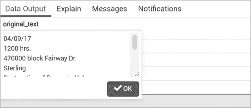
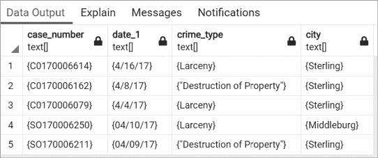

# 第十四章：挖掘文本以找到有意义的数据


接下来，您将学习如何使用 SQL 来转换、搜索和分析文本。您将从简单的文本整理，包括字符串格式化和模式匹配开始，然后转向更高级的分析。我们将使用两个数据集：华盛顿 DC 附近一个警长部门的少量犯罪报告和美国总统发表的演讲集。

文本提供了丰富的分析可能性。您可以从 *非结构化* *数据* —— 演讲、报告、新闻稿和其他文档中的段落 —— 中提取意义，通过将其转换为 *结构化数据* —— 在表格中的行和列中。或者，您可以使用高级文本分析功能，例如 PostgreSQL 的全文搜索。借助这些技术，普通文本可以揭示否则可能隐藏的事实或趋势。

## 使用字符串函数格式化文本

PostgreSQL 具有超过 50 个内置的字符串函数，用于处理常规但必要的任务，例如大写字母、组合字符串和删除不需要的空格。其中一些是 ANSI SQL 标准的一部分，而其他一些是特定于 PostgreSQL 的。您可以在 [`www.postgresql.org/docs/current/functions-string.html`](https://www.postgresql.org/docs/current/functions-string.html) 找到完整的字符串函数列表，但在本节中，我们将介绍您可能经常使用的几个函数。

您可以在简单查询中尝试每个函数，将函数放在 `SELECT` 后面，就像这样： `SELECT upper('hello');`。本章节中所有列表的示例和代码均可在 [`nostarch.com/practical-sql-2nd-edition/`](https://nostarch.com/practical-sql-2nd-edition/) 查看。

### 大小写格式化

大写函数会格式化文本的大小写。 `upper(``string``)` 函数将传递给它的字符串的所有字母字符大写。非字母字符（如数字）保持不变。例如， `upper('Neal7')` 返回 `NEAL7`。 `lower(``string``)` 函数将所有字母字符转换为小写，同时保持非字母字符不变。例如， `lower('Randy')` 返回 `randy`。

`initcap(``string``)` 函数会将每个单词的首字母大写。例如， `initcap('at the end of the day')` 返回 `At The End Of The Day`。此函数在格式化书籍或电影标题时很有用，但由于不识别缩写，因此并非始终完美。例如， `initcap('Practical SQL')` 返回 `Practical Sql`，因为它无法识别 SQL 作为缩写。

`upper()` 和 `lower()` 函数是 ANSI SQL 标准命令，但 `initcap()` 是特定于 PostgreSQL 的。这三个函数为您提供了足够的选项，可以将文本列重新格式化为您喜欢的大小写。请注意，大小写格式化不适用于所有语言或区域设置。

### 字符信息

几个函数返回关于字符串的数据，它们单独使用或与其他函数结合使用都很有帮助。`char_length(``string``)`函数返回字符串中字符的数量，包括任何空格。例如，`char_length(' Pat ')`返回值为`5`，因为`Pat`中的三个字母加上两边的空格总共是五个字符。你还可以使用非 ANSI SQL 函数`length(``string``)`来计算字符串的长度，这个函数有一个变体可以计算二进制字符串的长度。

`position(``substring` `in` `string``)`函数返回字符串中子字符串的位置。例如，`position(', ' in 'Tan, Bella')`返回`4`，因为逗号和空格字符（`,` ）作为第一个参数传递的子字符串从主字符串`Tan, Bella`的第四个索引位置开始。

`char_length()`和`position()`都是 ANSI SQL 标准中的函数。

### 移除字符

`trim(``characters` `from` `string``)`函数从字符串的开头和结尾移除字符。要指定要移除的一个或多个字符，请将它们添加到函数中，并在之后添加关键字`from`和要更改的字符串。移除`leading`字符（在字符串前端）、`trailing`字符（在字符串末端）或`both`使得该函数非常灵活。

例如，`trim('s' from 'socks')`移除开头和结尾的`s`字符，返回`ock`。要仅移除字符串结尾的`s`，请在要修剪的字符前添加`trailing`关键字：`trim(trailing 's' from 'socks')`返回`sock`。

如果你没有指定要移除的字符，`trim()`默认移除字符串两端的空格。例如，`trim(' Pat ')`返回`Pat`，去除了前后的空格。为了确认修剪后字符串的长度，我们可以像这样将`trim()`嵌套在`char_length()`内部使用：

```
SELECT char_length(trim(' Pat '));
```

这个查询应该返回`3`，即`Pat`中字母的数量，这是`trim(' Pat ')`的结果。

`ltrim(``string``,` `characters``)`和`rtrim(``string``,` `characters``)`函数是 PostgreSQL 特定的`trim()`函数变体。它们从字符串的左端或右端移除字符。例如，`rtrim('socks', 's')`通过只移除字符串右端的`s`返回`sock`。

### 提取和替换字符

`left(``string``,` `number``)`和`right(``string``,` `number``)`函数，都是 ANSI SQL 标准中的，从字符串中提取并返回选定的字符。例如，从电话号码`703-555-1212`中提取`703`区号，可以使用`left('703-555-1212', 3)`指定从左边起第一个字符开始的前三个字符。同样，`right('703-555-1212', 8)`返回从右边起的八个字符：`555-1212`。

要在字符串中替换字符，可以使用 `replace(``string``,` `from``,` `to``)` 函数。例如，要将 `bat` 改为 `cat`，可以使用 `replace('bat', 'b', 'c')` 来指定将 `bat` 中的 `b` 替换为 `c`。

现在你已经掌握了字符串操作的基本函数，接下来我们来看看如何在文本中匹配更复杂的模式，并将这些模式转化为可以分析的数据。

## 匹配文本模式与正则表达式

*正则表达式*（或 *regex*）是一种描述文本模式的符号语言。如果你有一个明显的字符串模式（例如，四个数字后跟一个连字符，再后面是两个数字），你可以编写一个正则表达式来匹配这个模式。然后，你可以在 `WHERE` 子句中使用该表示法来按模式筛选行，或者使用正则表达式函数提取和处理包含相同模式的文本。

正则表达式对于初学者来说可能显得难以理解；它们需要练习才能掌握，因为它们使用的单字符符号并不直观。让表达式匹配一个模式可能需要反复尝试，而且每种编程语言在处理正则表达式时都有细微的差别。尽管如此，学习正则表达式仍然是一个值得的投资，因为你将获得类似超能力的能力，可以在许多编程语言、文本编辑器和其他应用程序中搜索文本。

在这一部分，我将提供足够的正则表达式基础，帮助你完成练习。如果想了解更多内容，推荐使用交互式在线代码测试工具，如 [`regexr.com/`](https://regexr.com/) 或 [`www.regexpal.com/`](https://www.regexpal.com/)，它们提供了表示法参考。

### 正则表达式表示法

使用正则表达式表示法匹配字母和数字是直接的，因为字母、数字（和某些符号）是文字，它们表示相同的字符。例如，`Al` 匹配 `Alicia` 中的前两个字符。

对于更复杂的模式，你将使用正则表达式元素的组合，如表格 14-1 中所示。

表格 14-1：正则表达式表示法基础

| **表达式** | **描述** |
| --- | --- |
| `.` | 点号是一个通配符，匹配除了换行符以外的任何字符。 |
| `[FGz]` | 方括号中的任何字符。这里是 *F*、*G* 或 *z*。 |
| `[a-z]` | 字符范围。这里是小写的 *a* 到 *z*。 |
| `[^a-z]` | 插入符号（^）表示匹配的否定。这里，表示不匹配小写的 *a* 到 *z*。 |
| `\w` | 任何单词字符或下划线。等同于 `[A-Za-z0-9_]`。 |
| `\d` | 任何数字。 |
| `\s` | 空格字符。 |
| `\t` | 制表符字符。 |
| `\n` | 换行字符。 |
| `\r` | 回车字符。 |
| `^` | 匹配字符串的开头。 |
| `$` | 匹配字符串的结尾。 |
| `?` | 获取前一个匹配项零次或一次。 |
| `*` | 获取前一个匹配项零次或多次。 |
| `+` | 获取前一个匹配项一到多次。 |
| `{``m``}` | 获取前一个匹配项恰好 `m` 次。 |
| `{``m``,``n``}` | 获取前一个匹配项，匹配次数介于 `m` 和 `n` 之间。 |
| `a``&#124;``b` | 管道符表示交替。找到 `a` 或 `b`。 |
| `( )` | 创建并报告捕获组或设置优先级。 |
| `(?: )` | 否定捕获组的报告。 |

使用这些正则表达式，你可以匹配各种字符，并指定匹配的次数和位置。例如，将字符放入方括号（`[]`）中，可以匹配任何单一字符或字符范围。因此，`[FGz]` 可以匹配单个 `F`、`G` 或 `z`，而 `[A-Za-z]` 会匹配任何大写或小写字母。

反斜杠（`\`）用于表示特殊字符的设计符号，例如制表符（`\t`）、数字（`\d`）或换行符（`\n`），后者是文本文件中的行结束字符。

有几种方法可以指定字符匹配的次数。将数字放入花括号中表示你希望匹配该次数。例如，`\d{4}` 匹配四个连续的数字，`\d{1,4}` 匹配一到四个数字。

`?`、`*` 和 `+` 字符为你提供了一个便捷的匹配次数表示法。例如，字符后面的加号（`+`）表示匹配一次或多次。因此，表达式 `a+` 会在字符串 `aardvark` 中找到 `aa` 字符。

此外，圆括号表示 *捕获组*，你可以使用它来标识整个匹配表达式中的一部分。例如，如果你在文本中寻找 `HH``:``MM``:``SS` 的时间格式，并且只想报告小时部分，可以使用诸如 `(\d{2}):\d{2}:\d{2}` 的表达式。它会寻找两个数字（`\d{2}`）表示小时，后跟冒号，再是两个数字表示分钟和冒号，最后是两位数字表示秒。通过将第一个 `\d{2}` 放入圆括号中，你可以仅提取这两个数字，尽管整个表达式匹配的是完整的时间。

表格 14-2 显示了结合正则表达式以捕获句子 “The game starts at 7 p.m. on May 2, 2024.” 中不同部分的示例。

表格 14-2：正则表达式匹配示例

| **表达式** | **匹配内容** | **结果** |
| --- | --- | --- |
| `.+` | 匹配任意字符一次或多次 | `The game starts at 7 p.m. on May 2, 2024.` |
| `\d{1,2} (?:a.m.&#124;p.m.)` | 一个或两个数字后跟空格和非捕获组中的 *a.m.* 或 *p.m.* | `7 p.m.` |
| `^\w+` | 以一个或多个单词字符开始 | `The` |
| `\w+.$` | 以一个或多个单词字符后跟任意字符结尾 | `2024.` |
| `May&#124;June` | 匹配 *May* 或 *June* 中的任意一个 | `May` |
| `\d{4}` | 四个数字 | `2024` |
| `May \d, \d{4}` | *May* 后跟一个空格、数字、逗号、空格和四个数字 | `May 2, 2024` |

这些结果展示了正则表达式在匹配我们感兴趣的字符串部分时的实用性。例如，为了查找时间，我们使用表达式 `\d{1,2} (?:a.m.|p.m.)` 来查找一个或两个数字，因为时间可能是一个或两个数字，后面跟着一个空格。然后我们查找 `a.m.` 或 `p.m.`；管道符号分隔这两个术语表示“或者”的条件，括号将它们与表达式的其余部分分开。我们需要 `?:` 符号来表示我们不希望将括号中的术语作为捕获组处理，这样只会返回 `a.m.` 或 `p.m.`。`?:` 确保返回完整的匹配项。

你可以通过将文本和正则表达式放入 `substring(``string` `from` `pattern``)` 函数中来使用这些正则表达式，以返回匹配的文本。例如，要查找四位数的年份，可以使用以下查询：

```
SELECT substring('The game starts at 7 p.m. on May 2, 2024.' from '\d{4}');
```

这个查询应该返回 `2024`，因为我们指定了模式应查找连续的四个数字，而 `2024` 是该字符串中唯一符合这些条件的部分。你可以查看本书代码资源中表格 14-2 的所有示例 `substring()` 查询，网址为 [`nostarch.com/practical-sql-2nd-edition/`](https://nostarch.com/practical-sql-2nd-edition/)。

### 在 WHERE 中使用正则表达式

你已经在 `WHERE` 子句中使用过 `LIKE` 和 `ILIKE` 进行查询过滤。在本节中，你将学习如何在 `WHERE` 子句中使用正则表达式，从而进行更复杂的匹配。

我们使用波浪号（`~`）对正则表达式进行区分大小写的匹配，使用波浪号星号（`~*`）进行不区分大小写的匹配。你可以通过在前面加上感叹号来取反这两种表达式。例如，`!~*` 表示 *不* 匹配不区分大小写的正则表达式。清单 14-1 显示了如何使用之前练习中的 2019 年美国人口普查估算数据表 `us_counties_pop_est_2019` 来演示这个过程。

```
SELECT county_name
FROM us_counties_pop_est_2019
1 WHERE county_name ~* '(lade|lare)'
ORDER BY county_name;

SELECT county_name
FROM us_counties_pop_est_2019
2 WHERE county_name ~* 'ash' AND county_name !~ 'Wash'
ORDER BY county_name;
```

清单 14-1：在 `WHERE` 子句中使用正则表达式

第一个 `WHERE` 子句 1 使用波浪号星号（`~*`）对正则表达式 `(lade|lare)` 进行不区分大小写的匹配，以查找包含 `lade` 或 `lare` 的县名。结果应该显示八行：

```
county_name
-------------------
Bladen County
Clare County
Clarendon County
Glades County
Langlade County
Philadelphia County
Talladega County
Tulare County
```

如你所见，每个县名都包含字母 `lade` 或 `lare`。

第二个 `WHERE` 子句 2 使用波浪号星号（`~*`）以及取反的波浪号（`!~`）来查找包含字母 `ash` 但不包含 `Wash` 的县名。这个查询应该返回以下结果：

```
county_name
--------------
Ashe County
Ashland County
Ashland County
Ashley County
Ashtabula County
Nash County
Wabash County
Wabash County
Wabasha County
```

这个输出中的九个县名都包含字母 `ash`，但没有一个包含 `Wash`。

这些是相对简单的示例，但你可以使用正则表达式进行更复杂的匹配，这是仅使用 `LIKE` 和 `ILIKE` 的通配符无法完成的。

### 正则表达式函数用于替换或拆分文本

示例 14-2 展示了三个替换和拆分文本的正则表达式函数。

```
1 SELECT regexp_replace('05/12/2024', '\d{4}', '2023');

2 SELECT regexp_split_to_table('Four,score,and,seven,years,ago', ',');

3 SELECT regexp_split_to_array('Phil Mike Tony Steve', ' ');
```

示例 14-2：用于替换和拆分文本的正则表达式函数

`regexp_replace(``string``,` `pattern``,` `replacement text``)` 函数允许你用替代文本替换匹配的模式。在示例 1 中，我们使用 `\d{4}` 在日期字符串 `05/12/2024` 中查找任何连续的四个数字。找到后，我们将它们替换为替代文本 `2023`。该查询的结果是返回文本 `05/12/2023`。

`regexp_split_to_table(``string``,` `pattern``)` 函数将分隔的文本拆分成行。示例 14-2 使用此函数按逗号拆分字符串 `'Four,score,and,seven,years,ago'`，结果是生成一个行集，每行包含一个单词：

```
regexp_split_to_table
---------------------
Four
score
and
seven
years
ago
```

在完成本章末尾的“自己动手试试”练习时，记得牢记这个函数。

`regexp_split_to_array(``string``,` `pattern``)` 函数将分隔的文本拆分成一个数组。示例将字符串 `Phil Mike Tony Steve` 按照空格拆分成 3 部分，返回的文本数组在 pgAdmin 中应如下所示：

```
regexp_split_to_array
----------------------
{Phil,Mike,Tony,Steve}
```

pgAdmin 的列标题中的 `text[]` 符号和结果周围的花括号确认这确实是一个数组类型，这为进一步分析提供了另一种方式。例如，你可以使用 `array_length()` 函数来计算单词的数量，如示例 14-3 所示。

```
SELECT array_length(regexp_split_to_array('Phil Mike Tony Steve', ' '), 1 1);
```

示例 14-3：查找数组长度

`regexp_split_to_array()` 生成的数组是一维的；也就是说，结果包含一个名称列表。数组可以有更多的维度——例如，二维数组可以表示一个包含行和列的矩阵。因此，我们将 `1` 作为第二个参数传递给 `array_length()`，表示我们希望获得数组第一维（也是唯一维度）的长度。查询应返回 `4`，因为该数组有四个元素。你可以在 [`www.postgresql.org/docs/current/functions-array.html`](https://www.postgresql.org/docs/current/functions-array.html) 中阅读更多关于 `array_length()` 和其他数组函数的信息。

如果你能在文本中识别出模式，可以使用正则表达式符号的组合来定位它。当文本中存在重复模式时，这种技术特别有用，特别是当你想将其转换为一组数据进行分析时。让我们通过一个实际例子来练习如何使用正则表达式函数。

### 使用正则表达式函数将文本转换为数据

华盛顿特区某郊区的一个警长部门发布每日报告，详细说明该部门调查的事件的日期、时间、地点和描述。这些报告本可以很好地进行分析，但它们将信息发布在保存为 PDF 文件的 Microsoft Word 文档中，这种格式并不适合导入到数据库中。

如果我将 PDF 中的事件复制并粘贴到文本编辑器中，结果将是类似清单 14-4 的文本块。

```
1 4/16/17-4/17/17
2 2100-0900 hrs.
3 46000 Block Ashmere Sq.
4 Sterling
5 Larceny: 6 The victim reported that a
bicycle was stolen from their opened
garage door during the overnight hours.
7 C0170006614

04/10/17
1605 hrs.
21800 block Newlin Mill Rd.
Middleburg
Larceny: A license plate was reported
stolen from a vehicle.
SO170006250
```

清单 14-4：犯罪报告文本

每段文本包括日期 1、时间 2、街道地址 3、城市或城镇 4、犯罪类型 5 和事件描述 6。最后一项信息是一个代码 7，可能是事件的唯一标识符，尽管我们需要向警长办公室确认才能确保。存在一些小的不一致。例如，第一段文本有两个日期（`4/16/17-4/17/17`）和两个时间段（`2100-0900 hrs.`），这意味着事件的具体时间不确定，很可能发生在这个时间段内。第二段则只有一个日期和时间。

如果您定期汇编这些报告，您可以期望找到一些有价值的见解，帮助回答一些重要问题：犯罪通常发生在哪里？哪些犯罪类型最常发生？它们是更多发生在周末还是工作日？在您开始回答这些问题之前，您需要使用正则表达式将文本提取到表格列中。

#### 创建犯罪报告表

我已经将五个犯罪事件收集到一个名为*crime_reports.csv*的文件中，您可以通过本书资源链接[`nostarch.com/practical-sql-2nd-edition/`](https://nostarch.com/practical-sql-2nd-edition/)下载该文件并保存在您的计算机上。下载文件后，使用清单 14-5 中的代码构建一个表格，其中每一列用于解析文本中的数据元素，使用正则表达式进行解析。

```
CREATE TABLE crime_reports (
    crime_id integer PRIMARY KEY GENERATED ALWAYS AS IDENTITY,
    case_number text,
    date_1 timestamptz,
    date_2 timestamptz,
    street text,
    city text,
    crime_type text,
    description text,
    original_text text NOT NULL
);

COPY crime_reports (original_text)
FROM '`C:\YourDirectory\`crime_reports.csv'
WITH (FORMAT CSV, HEADER OFF, QUOTE '"');
```

清单 14-5：创建并加载`crime_reports`表

运行清单 14-5 中的`CREATE TABLE`语句，然后使用`COPY`将文本加载到`original_text`列中。其余的列将为`NULL`，直到我们填写它们。

当您在 pgAdmin 中运行`SELECT original_text FROM crime_reports;`时，结果网格应显示五行数据，并展示每份报告的前几个单词。当您双击任何单元格时，pgAdmin 会显示该行的所有文本，如图 14-1 所示。



图 14-1：在 pgAdmin 结果网格中显示额外文本

现在，您已经加载了要解析的文本，让我们使用 PostgreSQL 的正则表达式函数来探索这些数据。

#### 匹配犯罪报告日期模式

我们想从`original_text`中提取的第一项数据是犯罪的日期或日期。大多数报告只有一个日期，尽管有一个报告有两个日期。这些报告还包括相关的时间，我们将把提取的日期和时间组合成一个时间戳。我们将把`date_1`填充为每份报告的第一个（或唯一）日期和时间。如果存在第二个日期或第二个时间，我们将把它添加到`date_2`中。

我们将使用`regexp_match(``string``,` `pattern``)`函数，它与`substring()`类似，但有几个例外。其中一个例外是它将每个匹配项作为数组中的文本返回。此外，如果没有匹配项，它将返回`NULL`。正如您可能从第六章中回忆的那样，您可以使用数组将值列表传递给`percentile_cont()`函数来计算四分位数。在我们解析犯罪报告时，我将向您展示如何处理返回为数组的结果。

要开始，请使用`regexp_match()`在每个五起事件中查找日期。用于匹配的一般模式是`MM``/``DD``/``YY`，尽管月份和日期都可能有一到两位数字。下面是匹配此模式的正则表达式：

```
\d{1,2}\/\d{1,2}\/\d{2}
```

在此表达式中，第一个`\d{1,2}`表示月份。花括号中的数字指定您希望至少有一个数字，最多有两个数字。接下来，您要查找一个正斜杠(`/`)，但由于正斜杠在正则表达式中具有特殊含义，您必须*转义*该字符，方法是在其前面加上反斜杠(`\`)，如`\/`所示。在这种上下文中转义字符的意思是我们希望将其视为字面值，而不是让其具有特殊含义。因此，反斜杠和正斜杠的组合(`\/`)表示您希望一个正斜杠。

另一个`\d{1,2}`后跟一个单或双位数的月份。表达式以第二个转义的正斜杠和`\d{2}`结尾，表示两位数年份。让我们将表达式`\d{1,2}\/\d{1,2}\/\d{2}`传递给`regexp_match()`，如图示 14-6 所示。

```
SELECT crime_id,
       regexp_match(original_text, '\d{1,2}\/\d{1,2}\/\d{2}')
FROM crime_reports
ORDER BY crime_id;
```

图示 14-6：使用`regexp_match()`查找第一个日期

在 pgAdmin 中运行该代码，结果应如下所示：

```
crime_id    regexp_match
--------    ------------
       1    {4/16/17}
       2    {4/8/17}
       3    {4/4/17}
       4    {04/10/17}
       5    {04/09/17}
```

请注意，每行显示了事件的第一个列出日期，因为`regexp_match()`默认返回它找到的第一个匹配项。还请注意，每个日期都用花括号括起来。这是 PostgreSQL 指示`regexp_match()`将每个结果返回为数组类型或元素列表。稍后在“从`regexp_match()`结果中提取文本”部分，我将向您展示如何访问数组中的元素。您还可以在[`www.postgresql.org/docs/current/arrays.html`](https://www.postgresql.org/docs/current/arrays.html)上阅读有关 PostgreSQL 数组的更多信息。

#### 当存在第二个日期时进行匹配

我们已成功匹配了每份报告中的第一个日期。但请记住，五起事件中有一起还有第二个日期。要查找并显示文本中的所有日期，您必须使用相关的`regexp_matches()`函数，并传递一个选项，形式为标志`g`，如图示 14-7 所示。

```
SELECT crime_id,
       regexp_matches(original_text, '\d{1,2}\/\d{1,2}\/\d{2}', 'g'1)
FROM crime_reports
ORDER BY crime_id;
```

图示 14-7：使用带`g`标志的`regexp_matches()`函数

`regexp_matches()`函数在提供`g`标志 1 时，与`regexp_match()`不同，它会将表达式找到的每个匹配项作为结果的行返回，而不仅仅是第一个匹配项。

再次运行代码并进行此修订；现在你应该能看到犯罪编号为`1`的事件有两个日期，像这样：

```
crime_id    regexp_matches
--------    --------------
       1    {4/16/17}
       1    {4/17/17}
       2    {4/8/17}
       3    {4/4/17}
       4    {04/10/17}
       5    {04/09/17}
```

每当犯罪报告中有第二个日期时，我们希望将其及相关的时间加载到`date_2`列中。尽管添加`g`标志可以显示所有日期，但为了提取报告中的第二个日期，我们可以使用两日期存在时常见的模式。在列表 14-4 中，第一段文本显示了两个通过连字符分隔的日期，像这样：

```
4/16/17-4/17/17
```

这意味着你可以切换回`regexp_match()`，编写一个正则表达式来查找一个连字符后跟日期，如列表 14-8 所示。

```
SELECT crime_id,
       regexp_match(original_text, '-\d{1,2}\/\d{1,2}\/\d{2}')
FROM crime_reports
ORDER BY crime_id;
```

列表 14-8：使用`regexp_match()`查找第二个日期

尽管此查询找到第一个项中的第二个日期（并对其余项返回`NULL`），但它也有一个意外的后果：它会显示连字符。

```
crime_id    regexp_match
--------    ------------
       1    {-4/17/17}
       2
       3
       4
       5
```

你不想包括连字符，因为它是`timestamp`数据类型的无效格式。幸运的是，你可以通过在正则表达式的目标部分周围加上括号来指定确切的返回部分，从而创建一个捕获组，像这样：

```
-(\d{1,2}/\d{1,2}/\d{1,2})
```

这个符号仅返回正则表达式中你想要的部分。运行修改后的查询，在列表 14-9 中仅报告括号内的数据。

```
SELECT crime_id,
       regexp_match(original_text, '-(\d{1,2}\/\d{1,2}\/\d{2})')
FROM crime_reports
ORDER BY crime_id;
```

列表 14-9：使用捕获组仅返回日期

在列表 14-9 中的查询应该仅返回第二个日期，而不带前导的连字符，如下所示：

```
crime_id    regexp_match
--------    ------------
       1    {4/17/17}
       2
       3
       4
       5
```

你刚刚完成的过程是典型的。你从要分析的文本开始，然后编写和优化正则表达式，直到它找到你想要的数据。到目前为止，我们已经创建了正则表达式，用于匹配第一个日期和第二个日期（如果存在）。现在，让我们使用正则表达式提取更多的数据元素。

#### 匹配附加的犯罪报告元素

在这一部分中，我们将从犯罪报告中提取时间、地址、犯罪类型、描述和案件编号。以下是用于捕获这些信息的表达式：

**第一个小时 `\/\d{2}\n(\d{4})`**

1.  第一个小时，即犯罪发生的时间或时间范围的开始，始终跟在每个犯罪报告中的日期后面，像这样：

```
4/16/17-4/17/17
2100-0900 hrs.
```

1.  为了找到第一个小时，我们从一个转义的正斜杠和`\d{2}`开始，`\d{2}`代表第一个日期前的两位数年份（`17`）。`\n`字符表示换行符，因为小时总是从新的一行开始，`\d{4}`表示四位数字的小时（`2100`）。由于我们只想返回四个数字，我们将`\d{4}`放入括号中作为捕获组。

**第二小时 `\/\d{2}\n\d{4}-(\d{4})`**

1.  如果第二小时存在，它将跟在连字符后面，因此我们在刚刚为第一个小时创建的表达式中添加了一个连字符和另一个`\d{4}`。再次强调，第二个`\d{4}`放入捕获组中，因为我们只希望返回`0900`这个小时。

**街道 `hrs.\n(\d+ .+(?:Sq.|Plz.|Dr.|Ter.|Rd.))`**

1.  在这些数据中，街道总是跟随时间的`hrs.`标识符，并在换行符（`\n`）之后，如下所示：

```
04/10/17
1605 hrs.
21800 block Newlin Mill Rd.
```

1.  街道地址总是以某个长度不等的数字开头，并以某种缩写后缀结尾。为了描述这个模式，我们使用`\d+`来匹配出现一次或多次的任何数字。然后我们指定一个空格，使用点通配符和加号（`.+`）符号来查找任何字符，出现一次或多次。表达式以一系列由交替管道符号分隔的术语结尾，格式如下：`(?:Sq.|Plz.|Dr.|Ter.|Rd.)`。这些术语被括号括起来，因此表达式会匹配这些术语中的任何一个。当我们像这样分组术语时，如果我们不希望括号作为捕获组，我们需要在括号前加上`?:`来消除这一效果。

**城市 `(?:Sq.|Plz.|Dr.|Ter.|Rd.)\n(\w+ \w+|\w+)\n`**

1.  因为城市总是跟随街道后缀，我们会重用之前为街道创建的由交替符号分隔的术语。接着，我们添加一个换行符（`\n`），然后使用捕获组查找两个单词或一个单词`(\w+ \w+|\w+)`，之后是一个最终的换行符，因为一个城镇或城市名称可能不止一个单词。

**犯罪类型 `\n(?:\w+ \w+|\w+)\n(.*):`**

1.  犯罪类型总是位于冒号前（每个报告中唯一使用冒号的地方），并可能由一个或多个单词组成，如下所示：

```
`--snip--`
Middleburg
Larceny: A license plate was reported
stolen from a vehicle.
SO170006250
`--snip--`
```

1.  要创建一个匹配此模式的表达式，我们在换行符后添加一个非报告捕获组，查找一个或两个单词的城市名称。然后我们再添加一个换行符，并匹配冒号前的任何字符，使用`(.*):`。

**描述 `:\s(.+)(?:C0|SO)`**

1.  犯罪描述总是位于犯罪类型和案件编号之间的冒号后面。该表达式从冒号开始，接着是一个空格字符（`\s`），然后是一个捕获组，用于查找出现一次或多次的任何字符，使用`.+`符号。非报告捕获组`(?:C0|SO)`告诉程序当遇到`C0`或`SO`时停止查找，这两个字符对是每个案件编号的开头（*C*后跟零，*S*后跟大写字母*O*）。我们必须这样做，因为描述中可能有一个或多个换行符。

**案件编号 `(?:C0|SO)[0-9]+`**

1.  案件编号以`C0`或`SO`开头，后跟一组数字。为了匹配这个模式，表达式首先在一个非报告捕获组中查找`C0`或`SO`，然后查找任意数字（0 到 9 之间）出现一次或多次，使用`[0-9]`范围符号。

现在让我们将这些正则表达式传递给`regexp_match()`，看看它们的实际效果。Listing 14-10 展示了一个示例`regexp_match()`查询，用于检索案件编号、日期、犯罪类型和城市。

```
SELECT
    regexp_match(original_text, '(?:C0|SO)[0-9]+') AS case_number,
    regexp_match(original_text, '\d{1,2}\/\d{1,2}\/\d{2}') AS date_1,
    regexp_match(original_text, '\n(?:\w+ \w+|\w+)\n(.*):') AS crime_type,
    regexp_match(original_text, '(?:Sq.|Plz.|Dr.|Ter.|Rd.)\n(\w+ \w+|\w+)\n')
 AS city
FROM crime_reports
ORDER BY crime_id;
```

Listing 14-10：匹配案件编号、日期、犯罪类型和城市

运行代码，结果应如下所示：

```
 case_number     date_1        crime_type                   city
-------------    ----------    -------------------------    ------------
{C0170006614}    {4/16/17}     {Larceny}                    {Sterling}
{C0170006162}    {4/8/17}      {"Destruction of Property"}  {Sterling}
{C0170006079}    {4/4/17}      {Larceny}                    {Sterling}
{SO170006250}    {04/10/17}    {Larceny}                    {Middleburg}
{SO170006211}    {04/09/17}    {"Destruction of Property"}  {Sterling}
```

经过所有这些处理后，我们已将文本转化为更适合分析的结构。当然，您需要包含更多的事件，以便按城市计算犯罪类型的频率，或按月计算犯罪数量，以识别任何趋势。

为了将每个解析的元素加载到表的列中，我们将创建一个 `UPDATE` 查询。但是，在您能够将文本插入列之前，您需要学习如何从 `regexp_match()` 返回的数组中提取文本。

#### 从 `regexp_match()` 结果中提取文本

在“匹配犯罪报告日期模式”中，我提到过 `regexp_match()` 返回的数据是一个包含文本的数组类型。两个线索表明这些是数组类型。第一个线索是列头的数据类型标识显示为 `text[]` 而不是 `text`。第二个线索是每个结果都被大括号括起来。图 14-2 显示了 pgAdmin 如何展示列表 14-10 中的查询结果。



图 14-2：pgAdmin 结果网格中的数组值

我们想要更新的 `crime_reports` 列不是数组类型，因此我们需要先从数组中提取值，而不是直接传递 `regexp_match()` 返回的数组值。我们通过使用数组表示法来做到这一点，如列表 14-11 所示。

```
SELECT
    crime_id,
  1 (regexp_match(original_text, '(?:C0|SO)[0-9]+'))[1] 2
        AS case_number
FROM crime_reports
ORDER BY crime_id;
```

列表 14-11：从数组中检索值

首先，我们将 `regexp_match()` 函数 1 用括号括起来。然后，在最后，我们提供一个值 `1`，表示数组中的第一个元素，并用方括号 2 括起来。查询应产生以下结果：

```
crime_id    case_number
--------    -----------
       1    C0170006614
       2    C0170006162
       3    C0170006079
       4    SO170006250
       5    SO170006211
```

现在，pgAdmin 列头中的数据类型标识应该显示为 `text`，而不是 `text[]`，并且这些值不再被大括号括起来。我们现在可以使用 `UPDATE` 查询将这些值插入到 `crime_reports` 中。

#### 更新 `crime_reports` 表中的提取数据

要开始更新 `crime_reports` 中的列，列表 14-12 将提取的第一个日期和时间合并成一个单一的 `timestamp` 值，用于 `date_1` 列。

```
UPDATE crime_reports
1 SET date_1 =
(
  2 (regexp_match(original_text, '\d{1,2}\/\d{1,2}\/\d{2}'))[1]
      3 || ' ' ||
  4 (regexp_match(original_text, '\/\d{2}\n(\d{4})'))[1]
      5 ||' US/Eastern'
6 )::timestamptz
RETURNING crime_id, date_1, original_text;
```

列表 14-12：更新 `crime_reports` 中的 `date_1` 列

因为`date_1`列是`timestamp`类型，我们必须提供该数据类型的输入。为此，我们将使用 PostgreSQL 的双管道符号（`||`）连接操作符，将提取的日期和时间组合成`timestamp with time zone`类型输入可接受的格式。在`SET`子句 1 中，我们从匹配第一个日期的正则表达式模式开始 2。接下来，我们使用两个单引号 3 将日期与空格连接，并重复连接操作符。这一步将日期与空格结合，然后再将其与匹配时间的正则表达式模式连接 4。然后，我们通过在字符串末尾使用`US/Eastern`时区标识符来包含华盛顿特区的时区 5。连接这些元素后，我们得到一个格式为`MM``/``DD``/``YY``HH:MM``TIMEZONE`的字符串，这是一个可接受的`timestamp`输入格式。我们使用 PostgreSQL 的双冒号简写和`timestamptz`缩写将该字符串转换为`timestamp with time zone`数据类型 6。

当你运行`UPDATE`语句时，`RETURNING`子句将显示我们指定的已更新行中的列，包括现在已填充的`date_1`列，以及`original_text`列的一部分，类似这样：

```
crime_id         date_1                        original_text
-------- ---------------------- --------------------------------------------
    1    2017-04-16 21:00:00-04  4/16/17-4/17/17                           
                                 2100-0900 hrs.                            
                                 46000 Block Ashmere Sq.                   
                                 Sterling                                  
                                 Larceny: The victim reported that a       
                                 bicycle was stolen from their opened      
                                 garage door during the overnight hours.   
                                 C0170006614
    2    2017-04-08 16:00:00-04  4/8/17                                    
                                 1600 hrs.                                 
                                 46000 Block Potomac Run Plz.              
                                 Sterling                                  
                                 Destruction of Property: The victim       
                                 reported that their vehicle was spray     
                                 painted and the trim was ripped off while 
                                 it was parked at this location.           
                                 C0170006162
*--snip--*
```

一眼看去，你可以看到`date_1`准确地捕捉到原始文本中出现的第一个日期和时间，并将其转换为我们可以分析的格式——例如，量化一天中犯罪最常发生的时间。请注意，如果你不在东部时区，时间戳将反映你 pgAdmin 客户端的时区。另外，在 pgAdmin 中，你可能需要双击`original_text`列中的单元格才能查看完整的文本。

#### 使用 CASE 处理特殊情况

你可以为每个剩余的数据元素写一个`UPDATE`语句，但将这些语句合并成一个会更高效。清单 14-13 使用单个语句更新所有`crime_reports`列，同时处理数据中的不一致值。

```
UPDATE crime_reports
SET date_11 =
    (
      (regexp_match(original_text, '\d{1,2}\/\d{1,2}\/\d{2}'))[1]
 || ' ' ||
      (regexp_match(original_text, '\/\d{2}\n(\d{4})'))[1]
          ||' US/Eastern'
    )::timestamptz,

    date_22 =
    CASE3
        WHEN4 (SELECT regexp_match(original_text, '-(\d{1,2}\/\d{1,2}\/\d{2})') IS NULL5)
                AND (SELECT regexp_match(original_text, '\/\d{2}\n\d{4}-(\d{4})') IS NOT NULL6)
        THEN7
          ((regexp_match(original_text, '\d{1,2}\/\d{1,2}\/\d{2}'))[1]
              || ' ' ||
          (regexp_match(original_text, '\/\d{2}\n\d{4}-(\d{4})'))[1]
              ||' US/Eastern'
          )::timestamptz

        WHEN8 (SELECT regexp_match(original_text, '-(\d{1,2}\/\d{1,2}\/\d{2})') IS NOT NULL)
                AND (SELECT regexp_match(original_text, '\/\d{2}\n\d{4}-(\d{4})') IS NOT NULL)
        THEN
          ((regexp_match(original_text, '-(\d{1,2}\/\d{1,2}\/\d{1,2})'))[1]
              || ' ' ||
          (regexp_match(original_text, '\/\d{2}\n\d{4}-(\d{4})'))[1]
              ||' US/Eastern'
          )::timestamptz
    END,
    street = (regexp_match(original_text, 'hrs.\n(\d+ .+(?:Sq.|Plz.|Dr.|Ter.|Rd.))'))[1],
    city = (regexp_match(original_text,
                           '(?:Sq.|Plz.|Dr.|Ter.|Rd.)\n(\w+ \w+|\w+)\n'))[1],
    crime_type = (regexp_match(original_text, '\n(?:\w+ \w+|\w+)\n(.*):'))[1],
    description = (regexp_match(original_text, ':\s(.+)(?:C0|SO)'))[1],
    case_number = (regexp_match(original_text, '(?:C0|SO)[0-9]+'))[1];
```

清单 14-13：更新所有`crime_reports`列

这个`UPDATE`语句看起来可能令人畏惧，但如果我们按列分解，它并不会那么复杂。首先，我们使用清单 14-9 中的相同代码来更新`date_1`列 1。但要更新`date_2`列 2，我们需要考虑第二个日期和时间的不一致性。在我们有限的数据集中，存在三种可能性：

1.  存在第二个小时，但没有第二个日期。当报告涵盖同一日期的多个小时范围时，就会发生这种情况。

1.  存在第二个日期和第二个小时。当报告涵盖多个日期时，会发生这种情况。

1.  既没有第二个日期，也没有第二个小时。

为了在每种情况下插入正确的`date_2`值，我们使用`CASE`语句来测试每一种可能性。在`CASE`关键字 3 后，我们使用一系列`WHEN ... THEN`语句来检查前两个条件并提供插入的值；如果没有符合条件的情况，`CASE`语句默认返回`NULL`。

第一个 `WHEN` 语句 4 检查 `regexp_match()` 是否返回第二个日期的 `NULL` 5，以及第二个小时的值（使用 `IS NOT NULL` 6）。如果该条件为 `true`，则 `THEN` 语句 7 会将第一个日期与第二个小时拼接，创建更新时间戳。

第二个 `WHEN` 语句 8 检查 `regexp_match()` 是否返回第二个小时和第二个日期的值。如果为 `true`，那么 `THEN` 语句会将第二个日期与第二个小时拼接，生成时间戳。

如果两个 `WHEN` 语句都没有返回 `true`，那么 `CASE` 语句将返回 `NULL`，因为只有第一个日期和第一个时间。

当我们在清单 14-13 中运行完整查询时，PostgreSQL 应该会报告 `UPDATE 5`。成功！现在，我们已经更新了所有列，并且在考虑到有附加数据的元素时，我们可以检查表的所有列，找到从 `original_text` 中解析出的元素。清单 14-14 查询了其中的四列。

```
SELECT date_1,
       street,
       city,
       crime_type
FROM crime_reports
ORDER BY crime_id;
```

清单 14-14：查看选定的犯罪数据

查询结果应该显示一个组织良好的数据集，类似于以下内容：

```
date_1                  street                             city          crime_type
----------------------  ---------------------------------  ----------    ------------------
2017-04-16 21:00:00-04  46000 Block Ashmere Sq.            Sterling      Larceny
2017-04-08 16:00:00-04  46000 Block Potomac Run Plz.       Sterling      Destruction of ...
2017-04-04 14:00:00-04  24000 Block Hawthorn Thicket Ter.  Sterling      Larceny
2017-04-10 16:05:00-04  21800 block Newlin Mill Rd.        Middleburg    Larceny
2017-04-09 12:00:00-04  470000 block Fairway Dr.           Sterling      Destruction of ...
```

你已经成功地将原始文本转化为一个可以回答问题并揭示该地区犯罪故事的表。

#### 过程的价值

编写正则表达式和编写更新表的查询可能需要时间，但通过这种方式识别和收集数据是有价值的。事实上，您遇到的一些最好的数据集正是您自己构建的。每个人都可以下载相同的数据集，但您构建的数据集是您独有的。您可以成为第一个发现并讲述数据背后故事的人。

此外，在设置好数据库和查询后，您可以反复使用它们。在这个示例中，您可以每天收集犯罪报告（无论是手动收集还是通过使用如 Python 等编程语言自动下载），以便获取一个可以不断挖掘趋势的持续数据集。

在下一部分，我们将继续探索文本，通过使用 PostgreSQL 实现一个搜索引擎。

## PostgreSQL 中的全文搜索

PostgreSQL 提供了一个强大的全文搜索引擎，能够处理大量文本的搜索，类似于在线搜索工具和技术，支持像 Factiva 这样的研究数据库的搜索。让我们通过一个简单的示例来演示如何设置一个用于文本搜索的表和相关的搜索功能。

在这个例子中，我收集了自二战以来的 79 篇美国总统演讲。这些演讲大多数来自国情咨文，这些公开的文本可以通过互联网档案馆（[`archive.org/`](https://archive.org/)）和加利福尼亚大学的美国总统项目（[`www.presidency.ucsb.edu/`](https://www.presidency.ucsb.edu/)）访问。你可以在*president_speeches.csv*文件中找到数据，以及本书的相关资源，地址为[`nostarch.com/practical-sql-2nd-edition/`](https://nostarch.com/practical-sql-2nd-edition/)。

让我们从全文搜索特有的数据类型开始。

### 文本搜索数据类型

PostgreSQL 的全文搜索实现包含两种数据类型。`tsvector`数据类型表示要搜索的文本，并将其存储为标准化的形式。`tsquery`数据类型表示搜索查询词和操作符。我们来详细看看这两种类型。

#### 使用 tsvector 存储文本为词元

`tsvector`数据类型将文本简化为一个排序的*词元*列表，词元是某种语言中的语言单位。将词元看作是没有后缀变化的词根是很有帮助的。例如，`tsvector`类型的列会将*洗涤*、*已洗*和*正在洗*存储为词元*wash*，同时标注每个单词在原始文本中的位置。将文本转换为`tsvector`还会去除那些通常在搜索中不起作用的小*停用词*，如*the*或*it*。

为了查看这种数据类型的工作方式，让我们将一个字符串转换为`tsvector`格式。示例 14-15 使用了 PostgreSQL 搜索功能`to_tsvector()`，该函数将文本“I am walking across the sitting room to sit with you”使用`english`语言搜索配置标准化为词元（lexemes）。

```
SELECT to_tsvector('english', 'I am walking across the sitting room to sit with you.');
```

示例 14-15：将文本转换为`tsvector`数据

执行代码后，它应该返回以下`tsvector`数据类型的输出：

```
'across':4 'room':7 'sit':6,9 'walk':3
```

`to_tsvector()`函数将单词数量从十一减少到四，去除了诸如*I*、*am*和*the*等无助于搜索的词。该函数还去除了词尾变化，将*walking*转为*walk*，将*sitting*转为*sit*。它按字母顺序排列单词，冒号后面的数字表示它在原始字符串中的位置，并考虑了停用词。请注意，*sit*被识别为出现在两个位置，一个对应*sitting*，一个对应*sit*。

#### 使用 tsquery 创建搜索词

`tsquery`数据类型表示全文搜索查询，同样优化为词元。它还提供用于控制搜索的操作符。操作符示例包括用于 AND 的与号（`&`）、用于 OR 的管道符号（`|`）和用于 NOT 的感叹号（`!`）。`<->`后跟操作符可以让你搜索相邻的单词或一定距离内的单词。

示例 14-16 展示了`to_tsquery()`函数如何将搜索词转换为`tsquery`数据类型。

```
SELECT to_tsquery('english', 'walking & sitting');
```

示例 14-16：将搜索词转换为`tsquery`数据

运行代码后，您应该会看到生成的`tsquery`数据类型已将术语标准化为词元，这与要搜索的数据格式相匹配：

```
'walk' & 'sit'
```

现在，您可以使用作为`tsquery`存储的术语来搜索已优化为`tsvector`的文本。

#### 使用@@匹配操作符进行搜索

将文本和搜索词转换为全文搜索数据类型后，您可以使用双@符号（`@@`）匹配操作符来检查查询是否与文本匹配。清单 14-17 中的第一个查询使用`to_tsquery()`来评估文本是否同时包含*walking*和*sitting*，我们通过`&`操作符将它们结合起来。由于`to_tsvector()`转换的文本中包含*walking*和*sitting*的词元，因此返回布尔值`true`。

```
SELECT to_tsvector('english', 'I am walking across the sitting room') @@
       to_tsquery('english', 'walking & sitting');

SELECT to_tsvector('english', 'I am walking across the sitting room') @@
       to_tsquery('english', 'walking & running');
```

清单 14-17：使用`tsquery`查询`tsvector`类型

然而，第二个查询返回`false`，因为*walking*和*running*都不在文本中。现在让我们为搜索演讲创建一个表。

### 创建全文搜索的表

清单 14-18 中的代码创建并填充`president_speeches`，该表包含一个原始文本列和一个`tsvector`类型的列。导入后，我们将把演讲文本转换为`tsvector`数据类型。请注意，为了适应我设置 CSV 文件的方式，`COPY`中的`WITH`子句有一组与我们通常使用的参数不同的参数。它是管道分隔的，并且使用&符号进行引用。

```
CREATE TABLE president_speeches (
    president text NOT NULL,
    title text NOT NULL,
    speech_date date NOT NULL,
    speech_text text NOT NULL,
    search_speech_text tsvector,
    CONSTRAINT speech_key PRIMARY KEY (president, speech_date)
);

COPY president_speeches (president, title, speech_date, speech_text)
FROM '`C:\YourDirectory\`president_speeches.csv'
WITH (FORMAT CSV, DELIMITER '|', HEADER OFF, QUOTE '@');
```

清单 14-18：创建并填充`president_speeches`表

执行查询后，运行`SELECT * FROM president_speeches;`以查看数据。在 pgAdmin 中，双击任何单元格以查看结果网格中不可见的额外单词。您应该会看到`speech_text`列中的每一行都有大量文本。

接下来，我们使用清单 14-19 中的`UPDATE`查询，将`speech_text`的内容复制到`tsvector`列`search_speech_text`中，并同时将其转换为该数据类型：

```
UPDATE president_speeches
1 SET search_speech_text = to_tsvector('english', speech_text);
```

清单 14-19：将演讲转换为`tsvector`并存储在`search_speech_text`列中

`SET`子句 1 使用`to_tsvector()`的输出填充`search_speech_text`。该函数的第一个参数指定了用于解析词元的语言。我们在这里使用`english`，但您也可以替换为`spanish`、`german`、`french`等其他语言（某些语言可能需要您查找并安装额外的词典）。将语言设置为`simple`将删除停用词，但不会将单词还原为词元。第二个参数是输入列的名称。运行代码以填充该列。

最后，我们需要对`search_speech_text`列进行索引，以加速搜索。你在第八章学习了索引，内容集中在 PostgreSQL 的默认索引类型——B 树。对于全文搜索，PostgreSQL 文档推荐使用*广义倒排索引*（*GIN*）。根据文档，GIN 索引包含“每个单词（词素）的索引条目，以及匹配位置的压缩列表”。有关详细信息，请参见[`www.postgresql.org/docs/current/textsearch-indexes.html`](https://www.postgresql.org/docs/current/textsearch-indexes.html)。

你可以在列表 14-20 中使用`CREATE INDEX`添加 GIN 索引。

```
CREATE INDEX search_idx ON president_speeches USING gin(search_speech_text);
```

列表 14-20：为文本搜索创建 GIN 索引

现在你已经准备好使用搜索功能了。

### 搜索演讲文本

近 80 年的总统演讲是探索历史的沃土。例如，列表 14-21 中的查询列出了总统讨论越南问题的演讲。

```
SELECT president, speech_date
FROM president_speeches
1 WHERE search_speech_text @@ to_tsquery('english', 'Vietnam')
ORDER BY speech_date;
```

列表 14-21：查找包含*Vietnam*（越南）一词的演讲

在`WHERE`子句中，查询使用双@符号（`@@`）匹配运算符，将`search_speech_text`列（数据类型为`tsvector`）和查询词*Vietnam*进行匹配，`to_tsquery()`函数将其转换为`tsquery`数据。结果应该列出 19 个演讲，显示越南首次出现在 1961 年约翰·F·肯尼迪的国会特别报告中，并且从 1966 年起成为美国越南战争升级后反复提及的话题。

```
president            speech_date
-----------------    -----------
John F. Kennedy      1961-05-25
Lyndon B. Johnson    1966-01-12
Lyndon B. Johnson    1967-01-10
Lyndon B. Johnson    1968-01-17
Lyndon B. Johnson    1969-01-14
Richard M. Nixon     1970-01-22
Richard M. Nixon     1972-01-20
Richard M. Nixon     1973-02-02
Gerald R. Ford       1975-01-15
*--snip--*
```

在我们尝试更多搜索之前，让我们添加一个方法来显示搜索词在文本中的位置。

#### 显示搜索结果位置

要查看我们的搜索词在文本中出现的位置，可以使用`ts_headline()`函数。该函数显示一个或多个高亮的搜索词，并用相邻的单词围绕，提供格式化显示选项、显示匹配搜索词周围的单词数以及每行文本显示多少个匹配结果。列表 14-22 展示了如何使用`ts_headline()`显示特定实例的*tax*（税收）一词的搜索结果。

```
SELECT president,
       speech_date,
     1 ts_headline(speech_text, to_tsquery('english', 'tax'),
                 2 'StartSel = <,
                    StopSel = >,
                    MinWords=5,
                    MaxWords=7,
                    MaxFragments=1')
FROM president_speeches
WHERE search_speech_text @@ to_tsquery('english', 'tax')
ORDER BY speech_date;
```

列表 14-22：使用`ts_headline()`显示搜索结果

为了声明`ts_headline()`，我们将原始的`speech_text`列传递给它，而不是我们在搜索函数中使用的`tsvector`列作为第一个参数。然后，作为第二个参数，我们传递一个`to_tsquery()`函数，用来指定要高亮的单词。接着，我们传递第三个参数，列出由逗号分隔的可选格式化参数。这里，我们指定了标识匹配搜索词的开始和结束字符（`StartSel`和`StopSel`）。我们还设置了显示的最小和最大总单词数（包括匹配的单词）（`MinWords`和`MaxWords`），以及使用`MaxFragments`显示的最大匹配片段数（或匹配实例）。这些设置是可选的，你可以根据需要调整它们。

这个查询的结果应该显示每篇演讲中最多七个单词，突出显示以*tax*为词根的单词：

```
 president       speech_date                        ts_headline
-------------------- ----------- ---------------------------------------------------------
Harry S. Truman      1946-01-21  price controls, increased <taxes>, savings bond campaigns
Harry S. Truman      1947-01-06  excise <tax> rates which, under the present
Harry S. Truman      1948-01-07  increased-after <taxes>-by more than
Harry S. Truman      1949-01-05  Congress enact new <tax> legislation to bring
Harry S. Truman      1950-01-04  considered <tax> reduction of the 80th Congress
Harry S. Truman      1951-01-08  major increase in <taxes> to meet
Harry S. Truman      1952-01-09  This means high <taxes> over the next
Dwight D. Eisenhower 1953-02-02  reduction of the <tax> burden;
Dwight D. Eisenhower 1954-01-07  brought under control. <Taxes> have begun
Dwight D. Eisenhower 1955-01-06  prices and materials. <Tax> revisions encouraged increased
*--snip--*
```

现在，我们可以快速看到我们搜索的术语的上下文。你也可以使用此功能为网页应用程序提供灵活的搜索展示选项。还要注意，我们不仅仅找到了精确匹配。搜索引擎识别了`tax`以及`taxes`、`Tax`和`Taxes`——这些词都是以*tax*为词根，不管大小写。

让我们继续尝试不同的搜索形式。

#### 使用多个搜索条件

另一个例子是，我们可以查找总统提到*transportation*但没有讨论*roads*的演讲。我们可能希望这样做，是为了找到关注更广泛政策而非具体道路项目的演讲。为此，我们可以使用列表 14-23 中的语法。

```
SELECT president,
       speech_date,
     1 ts_headline(speech_text,
                   to_tsquery('english', 'transportation & !roads'),
                   'StartSel = <,
                    StopSel = >,
                    MinWords=5,
                    MaxWords=7,
                    MaxFragments=1')
FROM president_speeches
2 WHERE search_speech_text @@
      to_tsquery('english', 'transportation & !roads')
ORDER BY speech_date;
```

列表 14-23：查找包含*transportation*但不包含*roads*的演讲

我们再次使用`ts_headline()`1 来突出显示我们搜索到的术语。在`WHERE`子句 2 中的`to_tsquery()`函数里，我们传递了`transportation`和`roads`，并用`&`运算符将它们组合在一起。我们在`roads`前面使用了感叹号（`!`），表示我们希望查找不包含这个词的演讲。这个查询应该能找到 15 篇符合条件的演讲。以下是前四行：

```
president         speech_date ts_headline
----------------- ----------- -----------------------------------------------------------
Harry S. Truman   1947-01-06  such industries as <transportation>, coal, oil, steel
Harry S. Truman   1949-01-05  field of <transportation>.
John F. Kennedy   1961-01-30  Obtaining additional air <transport> mobility--and obtaining
Lyndon B. Johnson 1964-01-08  reformed our tangled <transportation> and transit policies
`--snip--`
```

请注意，`ts_headline`列中突出显示的单词包括`transportation`和`transport`。同样，`to_tsquery()`将`transportation`转换为词形`transport`作为搜索条件。这种数据库行为对于帮助查找相关的相关词非常有用。

#### 查找相邻单词

最后，我们将使用距离（`<->`）运算符，它由小于号和大于号之间的连字符组成，用来查找相邻的单词。或者，你可以在符号之间放置一个数字，来查找相隔多个单词的术语。例如，列表 14-24 搜索任何包含*military*紧接着*defense*的演讲。

```
SELECT president,
       speech_date,
       ts_headline(speech_text,
                   to_tsquery('english', 'military <-> defense'),
                   'StartSel = <,
                    StopSel = >,
                    MinWords=5,
                    MaxWords=7,
                    MaxFragments=1')
FROM president_speeches
WHERE search_speech_text @@
      to_tsquery('english', 'military <-> defense')
ORDER BY speech_date;
```

列表 14-24：查找*defense*紧跟在*military*后面的演讲

这个查询应该能找到五篇演讲，因为`to_tsquery()`将搜索条件转换为词形，演讲中识别的单词应该包括复数形式，例如*military defenses*。以下显示了包含相邻术语的演讲：

```
president               speech_date    ts_headline
--------------------    -----------    ---------------------------------------------------
Dwight D. Eisenhower    1956-01-05     system our <military> <defenses> are designed
Dwight D. Eisenhower    1958-01-09     direct <military> <defense> efforts, but likewise
Dwight D. Eisenhower    1959-01-09     survival--the <military> <defense> of national life
Richard M. Nixon        1972-01-20     <defense> spending. Strong <military> <defenses>
Jimmy Carter            1979-01-23     secure. Our <military> <defenses> are strong
```

如果你将查询条件更改为`military <2> defense`，数据库将返回两个词之间正好相隔两个单词的匹配项，例如短语“我们的军事和防务承诺”。

### 按相关性排名查询结果

你还可以使用 PostgreSQL 的两种全文搜索功能来按相关性对搜索结果进行排名。当你想了解哪段文字或演讲与你的搜索条件最相关时，这些功能会非常有帮助。

一个函数`ts_rank()`根据你所搜索的词汇在文本中出现的频率生成一个排名值（以可变精度的`real`数据类型返回）。另一个函数`ts_rank_cd()`则考虑了搜索词汇彼此之间的接近度。两个函数都可以接受可选参数来考虑文档长度和其他因素。它们生成的排名值是一个任意的小数，虽然有助于排序，但没有内在的意义。例如，在一次查询中生成的`0.375`的值，不能直接与在另一查询中生成的相同值进行比较。

例如，示例 14-25 使用`ts_rank()`对包含所有词汇*战争*、*安全*、*威胁*和*敌人*的演讲进行排名。

```
SELECT president,
       speech_date,
     1 ts_rank(search_speech_text,
               to_tsquery('english', 'war & security & threat & enemy'))
               AS score
FROM president_speeches
2 WHERE search_speech_text @@
      to_tsquery('english', 'war & security & threat & enemy')
ORDER BY score DESC
LIMIT 5;
```

示例 14-25：使用`ts_rank()`进行相关性评分

在此查询中，`ts_rank()`函数 1 接收两个参数：`search_speech_text`列和一个包含搜索词的`to_tsquery()`函数的输出。该函数的输出被赋予别名`score`。在`WHERE`子句 2 中，我们筛选出仅包含指定搜索词的演讲。然后，我们按`score`的降序排列结果，并仅返回排名前五的演讲。结果应该如下所示：

```
 president      speech_date   score
------------------ ----------- ----------
William J. Clinton 1997-02-04  0.35810584
George W. Bush     2004-01-20  0.29587495
George W. Bush     2003-01-28  0.28381455
Harry S. Truman    1946-01-21  0.25752166
William J. Clinton 2000-01-27  0.22214262
```

比尔·克林顿 1997 年的国情咨文中，*战争*、*安全*、*威胁*和*敌人*这些词出现的频率比其他演讲更高，因为他讨论了冷战和其他话题。然而，这也是表中较长的演讲之一（你可以通过使用`char_length()`来确定这一点，如本章前面所述）。演讲的长度会影响这些排名，因为`ts_rank()`会考虑给定文本中匹配词汇的数量。乔治·W·布什的两场演讲，分别发生在伊拉克战争前后，排名紧随其后。

理想情况下，我们可以比较相同长度演讲中的词频，以获得更准确的排名，但这并不总是可行的。然而，我们可以通过将标准化代码作为`ts_rank()`函数的第三个参数来考虑每个演讲的长度，如示例 14-26 所示。

```
SELECT president,
       speech_date,
       ts_rank(search_speech_text,
               to_tsquery('english', 'war & security & threat & enemy'), 21)::numeric
               AS score
FROM president_speeches
WHERE search_speech_text @@
      to_tsquery('english', 'war & security & threat & enemy')
ORDER BY score DESC
LIMIT 5;
```

示例 14-26：按演讲长度标准化`ts_rank()`

添加可选代码`2` 1 指示该函数将`score`除以`search_speech_text`列中数据的长度。这个商值随后代表一个按文档长度标准化的分数，使得各个演讲之间可以进行公平比较。[PostgreSQL 文档](https://www.postgresql.org/docs/current/textsearch-controls.html)列出了所有可用于文本搜索的选项，包括使用文档长度和除以唯一词汇的数量。

在运行示例 14-26 中的代码后，排名应该发生变化：

```
 president      speech_date   score
------------------ ----------- ----------
George W. Bush     2004-01-20  0.0001028060
William J. Clinton 1997-02-04  0.0000982188
George W. Bush     2003-01-28  0.0000957216
Jimmy Carter       1979-01-23  0.0000898701
Lyndon B. Johnson  1968-01-17  0.0000728288
```

与清单 14-25 中的排名结果相比，乔治·W·布什 2004 年的演讲现在位居榜首，而杜鲁门 1946 年的演讲则不再进入前五名。这可能是一个比第一个示例输出更有意义的排名，因为我们通过长度对其进行了标准化。但在两个排名结果中，五个排名最高的演讲中有三个是相同的，你可以合理地确信，这三篇演讲都值得更深入的研究，以便更好地理解包含战争术语的总统演讲。

## 总结

文本不仅不乏味，反而为数据分析提供了丰富的机会。在本章中，你已经学到了将普通文本转化为可以提取、量化、搜索和排序的数据的技术。在你的工作或学习中，要留意那些将事实埋藏在文本块中的日常报告。你可以使用正则表达式将它们挖掘出来，转化为结构化数据，并进行分析以发现趋势。你还可以使用搜索功能来分析文本。

在下一章，你将学习如何使用 PostgreSQL 来分析地理信息。
