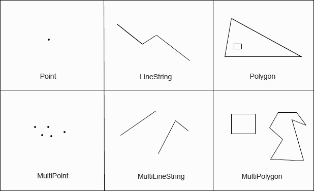
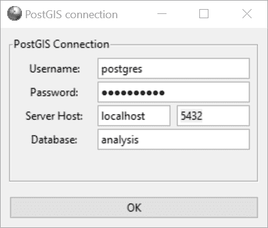

# 第十五章：使用 PostGIS 分析空间数据


现在我们来探讨 *空间数据*，它是指关于物体位置、形状和属性的信息——例如点、线或多边形——在地理空间中的表示。本章中，你将学习如何使用 SQL 构建和查询空间数据，并将介绍 PostgreSQL 的 PostGIS 扩展，它支持空间数据类型和功能。

空间数据已经成为我们世界数据生态系统中的一个关键组成部分。一个手机应用可以通过查询空间数据库，找到附近的咖啡店，它请求数据库返回距离你当前位置一定范围内的商店列表。政府使用空间数据来跟踪住宅和商业地块的足迹；流行病学家则用它来可视化疾病的传播。

在我们的练习中，我们将分析美国各地农贸市场的位置，以及新墨西哥州圣达菲的道路和水道。你将学习如何构建和查询空间数据类型，并结合地图投影和网格系统。你将获得从空间数据中提取信息的工具，类似于你以前分析数字和文本的方式。

我们将首先设置 PostGIS。本书练习的所有代码和数据可以通过书籍资源获取，网址为 [`nostarch.com/practical-sql-2nd-edition/`](https://nostarch.com/practical-sql-2nd-edition/)。

## 启用 PostGIS 和创建空间数据库

PostGIS 是一个免费、开源的项目，由加拿大地理空间公司 Refractions Research 创建，并由国际开发团队在开放源代码地理空间基金会（OSGeo）下维护。其名称中的 GIS 部分指的是 *地理信息系统*，即一个允许存储、编辑、分析和显示空间数据的系统。你可以在 [`postgis.net/`](https://postgis.net/) 查找文档和更新。

如果你按照第一章中的步骤在 Windows、macOS 或 Ubuntu 版本的 Linux 上安装了 PostgreSQL，那么 PostGIS 应该已经安装在你的机器上。如果你以其他方式在 Windows 或 macOS 上安装了 PostgreSQL，或者你使用的是其他 Linux 发行版，可以按照 [`postgis.net/install/`](https://postgis.net/install/) 上的安装说明进行操作。

要在你的 `analysis` 数据库中启用 PostGIS，请打开 pgAdmin 的查询工具并运行 列表 15-1 中的语句。

```
CREATE EXTENSION postgis;
```

列表 15-1：加载 PostGIS 扩展

你将看到信息 `CREATE EXTENSION`，表示你的数据库已更新，包含了空间数据类型和分析功能。运行 `SELECT postgis_full_version();` 以显示 PostGIS 的版本号及其已安装组件的版本。这个版本号不会与你安装的 PostgreSQL 版本匹配，但这没问题。

## 理解空间数据的基本构成

在学习如何查询空间数据之前，让我们先看看它在 GIS 和相关数据格式中的描述方式。这是一个重要的背景知识，但如果你想直接跳到查询部分，你可以稍后跳到本章的“理解 PostGIS 数据类型”并在之后再返回这里。

网格上的一个点是空间数据的最小构建单元。网格可能通过 x 轴和 y 轴标记，或者如果我们使用地图，则通过经纬度标记。网格可以是平面的二维网格，也可以描述三维空间，如立方体。在一些数据格式中，如基于 JavaScript 的*GeoJSON*，一个点除了位置外，可能还包含其他属性。我们可以通过包含经纬度的点来描述一家杂货店，此外还可以添加商店名称和营业时间等属性。

## 理解二维几何图形

开放地理空间联盟（OGC）和国际标准化组织（ISO）创建了一个*简单特征访问*模型，用于描述构建和查询二维及三维形状的标准，这些形状有时被称为*几何图形*。PostGIS 支持该标准。

以下是一些更常见的特征，从点开始，逐步增加复杂度：

**点（Point）**

1.  二维或三维平面中的一个位置。在地图上，点通常是标记经纬度的一个小点。

**线状对象（LineString）**

1.  两个或更多点，每个点通过直线连接。一个线状对象可以表示诸如道路、自行车道或溪流等特征。

**多边形（Polygon）**

1.  一个具有三条或更多直边的二维形状，每条边由一个线状对象构成。在地图上，多边形表示像国家、州、建筑物和水体这样的对象。一个多边形可以包含一个或多个内部多边形，这些内部多边形作为大多边形内部的孔。

**多点对象（MultiPoint）**

1.  一组点。一个单一的多点对象（MultiPoint）可以表示零售商的多个位置，每个位置的经纬度信息。

**多线状对象（MultiLineString）**

1.  一组线状对象。一个例子是一个由多个不连续段组成的道路。

**多面对象（MultiPolygon）**

1.  一组多边形。一个被道路分隔的土地 parcel 可以在一个多面对象（MultiPolygon）中进行分组，而不是多个单独的多边形。

图 15-1 展示了每种特征的示例。PostGIS 提供了构建、编辑和分析这些对象的功能。这些功能根据用途接受各种输入，包括经纬度、专用的文本和二进制格式以及简单特征。有些功能还接受一个可选的*空间参考系统标识符（SRID）*，该标识符指定了放置对象的网格。



图 15-1：几何图形的可视化示例

我稍后会解释 SRID，但首先，让我们来看一下 PostGIS 函数使用的一种输入示例，称为*知名文本（WKT）*——这是一种基于文本的格式，用于表示几何图形。

### 知名文本格式

OGC 标准的 WKT 格式在一个或多个括号内指定几何类型及其坐标。坐标和括号的数量根据几何类型的不同而有所不同。表 15-1 展示了常用的几何类型及其 WKT 格式的示例。坐标以经纬度对的形式展示，但你可能会遇到使用其他度量系统的网格系统。

表 15-1: 几何形状的著名文本格式

| **几何** | **格式** | **备注** |
| --- | --- | --- |
| 点 | `POINT (-74.9 42.7)` | 一个坐标对，标记一个位于 −74.9 经度和 42.7 纬度的点。 |
| 线串 | `LINESTRING (-74.9 42.7, -75.1 42.7)` | 由两个坐标对标记的直线，表示线段的端点。 |
| 多边形 | `POLYGON ((-74.9 42.7, -75.1 42.7, -75.1 42.6, -74.9 42.7))` | 由三个不同的坐标对勾画出的三角形。虽然列出了两次，但第一对和最后一对是相同的坐标，表示我们关闭了这个形状。 |
| 多点 | `MULTIPOINT (-74.9 42.7, -75.1 42.7)` | 两个点，每个坐标对对应一个点。 |
| 多线串 | `MULTILINESTRING ((-76.27 43.1, -76.06 43.08), (-76.2 43.3, -76.2 43.4, -76.4 43.1))` | 两条线串。第一条有两个点；第二条有三个点。 |
| 多边形 | `MULTIPOLYGON (((-74.92 42.7, -75.06 42.71, -75.07 42.64, -74.92 42.7), (-75.0 42.66, -75.0 42.64, -74.98 42.64, -74.98 42.66, -75.0 42.66)))` | 两个多边形。第一个是三角形，第二个是矩形。 |

这些示例创建了简单的形状，正如你将在本章后面使用 PostGIS 构建它们时所看到的那样。实际上，复杂的几何形状将包含成千上万个坐标。

### 投影和坐标系

在二维地图上表示地球的球面并非易事。想象一下，把地球的外层从地球仪上剥离下来，试图把它摊开在桌子上，同时保持所有大陆和海洋的连接。不可避免地，你需要拉伸地图的某些部分。这就是制图师在创建地图*投影*及其自己的*投影坐标系统*时所发生的情况。投影就是地球的一个扁平化表示，具有自己的二维坐标系统。

一些投影表示整个世界；另一些则是针对特定区域或目的。*墨卡托投影*具有对导航有用的特性；Google 地图和其他在线地图使用一种变体，称为*Web 墨卡托投影*。其转换背后的数学原理使得接近南北极的陆地面积发生了变形，导致它们看起来比实际要大得多。美国人口普查局使用*阿尔伯斯投影*，它最小化了失真，这是你在美国选举之夜看到的电视画面，选票在实时统计时就是使用这种投影的。

投影是从*地理坐标系统*派生的，地理坐标系统定义了地球上任意一点的纬度、经度和高度的网格，同时还包括地球形状等因素。每当您获取地理数据时，了解其所引用的坐标系统至关重要，这样您在编写查询时才能提供正确的信息。通常，用户文档会命名坐标系统。接下来，我们来看看如何在 PostGIS 中指定坐标系统。

### 空间参考系统标识符

在使用 PostGIS（以及许多 GIS 应用程序）时，您通过其唯一的 SRID 来指定坐标系统。当您在本章开始时启用了 PostGIS 扩展时，系统会创建一个表``spatial_ref_sys``，该表以 SRID 作为主键。该表还包含列`srtext`，其中包含空间参考系统的 WKT 表示及其他元数据。 

````` In this chapter, we’ll frequently use SRID `4326`, the ID for the geographic coordinate system WGS 84\. That’s the most recent World Geodetic System (WGS) standard used by GPS, and you’ll encounter it often in spatial data. You can see the WKT representation for WGS 84 by running the code in Listing 15-2 that looks for its SRID, `4326`:    ``` SELECT srtext  FROM spatial_ref_sys  WHERE srid = 4326; ```    Listing 15-2: Retrieving the WKT for SRID `4326`    Run the query and you should get the following result, indented for readability:    ``` GEOGCS["WGS 84",      DATUM["WGS_1984",          SPHEROID["WGS 84",6378137,298.257223563,              AUTHORITY["EPSG","7030"]],          AUTHORITY["EPSG","6326"]],      PRIMEM["Greenwich",0,          AUTHORITY["EPSG","8901"]],      UNIT["degree",0.0174532925199433,          AUTHORITY["EPSG","9122"]],      AUTHORITY["EPSG","4326"]] ```    You don’t need to use this information for any of this chapter’s exercises, but it’s helpful to know some of the variables and how they define the projection. The `GEOGCS` keyword provides the geographic coordinate system in use. Keyword `PRIMEM` specifies the location of the *prime meridian*, or longitude 0\. To see definitions of all the variables, check the reference at [`docs.geotools.org/stable/javadocs/org/opengis/referencing/doc-files/WKT.html`](https://docs.geotools.org/stable/javadocs/org/opengis/referencing/doc-files/WKT.html).    Conversely, if you ever need to find the SRID associated with a coordinate system, you can query the `srtext` column in `spatial_ref_sys` to find it.    ## Understanding PostGIS Data Types    Installing PostGIS adds several data types to your database. We’ll use two: `geography` and `geometry`. Both types can store spatial data, such as the points, lines, polygons, and SRIDs you just learned about, but they have important distinctions:    1.  `geography`A data type based on a sphere, using the round-Earth coordinate system (longitude and latitude). All calculations occur on the globe, taking its curvature into account. This makes the math complex and limits the number of functions available to work with the `geography` type. But because Earth’s curvature is factored in, calculations for distance are more precise; you should use the `geography` data type when handling data that spans large areas. The results from calculations on the `geography` type will be expressed in meters. 2.  `geometry` A data type based on a plane, using the Euclidean coordinate system. Calculations occur on straight lines as opposed to along the curvature of a sphere, making calculations for geographical distance less precise than with the `geography` data type; the results of calculations are expressed in units of whichever coordinate system you’ve designated.    The PostGIS documentation at [`postgis.net/docs/using_postgis_dbmanagement.html`](https://postgis.net/docs/using_postgis_dbmanagement.html) offers guidance on when to use one or the other type. In short, if you’re working strictly with longitude/latitude data or if your data covers a large area, such as a continent or the globe, use the `geography` type, even though it limits the functions you can use. If your data covers a smaller area, the `geometry` type provides more functions and better performance. You can also convert one type to the other using `CAST`.    With the background you have now, we can start working with spatial objects.    ## Creating Spatial Objects with PostGIS Functions    PostGIS has more than three dozen constructor functions that build spatial objects using WKT or coordinates. You can find a list at [`postgis.net/docs/reference.html#Geometry_Constructors`](https://postgis.net/docs/reference.html#Geometry_Constructors), but the following sections explain several that you’ll use in the exercises. Most PostGIS functions begin with the letters *ST*, which is an ISO naming standard that means *spatial type*.    ### Creating a Geometry Type from Well-Known Text    The `ST_GeomFromText(``WKT``,` `SRID``)` function creates a `geometry` data type from an input of a WKT string and an optional SRID. Listing 15-3 shows simple `SELECT` statements that generate `geometry` data types for each of the simple features described in Table 15-1.    ``` SELECT ST_GeomFromText(1'POINT(-74.9233606 42.699992)', 24326);    SELECT ST_GeomFromText('LINESTRING(-74.9 42.7, -75.1 42.7)', 4326);    SELECT ST_GeomFromText('POLYGON((-74.9 42.7, -75.1 42.7,                                   -75.1 42.6, -74.9 42.7))', 4326);    SELECT ST_GeomFromText('MULTIPOINT (-74.9 42.7, -75.1 42.7)', 4326);    SELECT ST_GeomFromText('MULTILINESTRING((-76.27 43.1, -76.06 43.08),                                          (-76.2 43.3, -76.2 43.4,                                           -76.4 43.1))', 4326);    SELECT ST_GeomFromText('MULTIPOLYGON3((                                         (-74.92 42.7, -75.06 42.71,   -75.07 42.64, -74.92 42.7)4,                                         (-75.0 42.66, -75.0 42.64,                                          -74.98 42.64, -74.98 42.66,                                          -75.0 42.66)))', 4326); ```    Listing 15-3: Using `ST_GeomFromText()` to create spatial objects    For each example, we give a WKT string as the first input and the SRID `4326` as the second. In the first example, we create a Point by inserting the WKT `POINT` string 1 as the first argument to `ST_GeomFromText()` with the SRID 2 as the optional second argument. We use the same format in the rest of the examples. Note that we don’t have to indent the coordinates. I do so here only to make the coordinate pairs more readable.    Be sure to mind the number of parentheses that segregate objects, particularly in complex structures such as the MultiPolygon. For example, we need to use two opening parentheses 3 and enclose each polygon’s coordinates within another set of parentheses 4.    If you run each statement separately in pgAdmin, you can view both its data output and visual representation. Upon execution, each statement should return a single column of the `geometry` data type displayed as a string of characters that looks something like this truncated example:    ``` 0101000020E61000008EDA0E5718BB52C017BB7D5699594540 ... ```    The string is of the format *extended well-known binary (EWKB)*, which you typically won’t need to interpret directly. Instead, you’ll use columns of geometry (or geography) data as inputs to other functions. To see the visual representation, click the eye icon in the pgAdmin result column header. That should open a Geometry Viewer pane in pgAdmin that displays the geometry atop a map that uses OpenStreetMap as the base layer. For example, the `MULTIPOLYGON` example in Listing 15-3 should look like Figure 15-2, with a triangle and a rectangle.      Figure 15-2: Viewing geometries in pgAdmin      Try viewing each example in Listing 15-3 to get to know the differences between objects.    ### Creating a Geography Type from Well-Known Text    To create a `geography` data type, you can use `ST_GeogFromText(``WKT``)` to convert a WKT or `ST_GeogFromText(``EWKT``)` to convert a PostGIS-specific variation called *extended WKT* that includes the SRID. Listing 15-4 shows how to pass in the SRID as part of the extended WKT string to create a MultiPoint `geography` object with three points.    ``` SELECT  ST_GeogFromText('SRID=4326;MULTIPOINT(-74.9 42.7, -75.1 42.7, -74.924 42.6)') ```    Listing 15-4: Using `ST_GeogFromText()` to create spatial objects    Again, you can view the Points on a map by clicking the eye icon in the geography column in the pgAdmin results grid.    Along with the all-purpose `ST_GeomFromText()` and `ST_GeogFromText()` functions, PostGIS includes several that are specific to creating certain spatial objects. I’ll cover those briefly next.    ### Using Point Functions    The `ST_PointFromText()` and `ST_MakePoint()` functions will turn a WKT `POINT` or a collection of coordinates, respectively, into a `geometry` data type. Points mark coordinates, such as longitude and latitude, which you would use to identify locations or use as building blocks of other objects, such as LineStrings.    Listing 15-5 shows how these functions work.    ``` SELECT 1ST_PointFromText('POINT(-74.9233606 42.699992)', 4326);    SELECT 2ST_MakePoint(-74.9233606, 42.699992);  SELECT 3ST_SetSRID(ST_MakePoint(-74.9233606, 42.699992), 4326); ```    Listing 15-5: Functions specific to making Points    The `ST_PointFromText(``WKT``,` `SRID``)` 1 function creates a point `geometry` type from a WKT `POINT` and an optional SRID as the second input. The PostGIS docs note that the function includes validation of coordinates that makes it slower than the `ST_GeomFromText()` function.    The `ST_MakePoint(``x``,` `y``,` `z``,` `m``)` 2 function creates a point `geometry` type on a two-, three-, and four-dimensional grid. The first two parameters, `x` and `y` in the example, represent longitude and latitude coordinates. You can use the optional `z` to represent altitude and `m` to represent a measure. That would allow you, for example, to mark a water fountain on a bike trail at a certain altitude and certain distance from the start of the trail. The `ST_MakePoint()` function is faster than `ST_GeomFromText()` and `ST_PointFromText()`, but if you want to specify an SRID, you’ll need to designate one by wrapping it inside the `ST_SetSRID()` 3 function.    ### Using LineString Functions    Now let’s examine some functions we use specifically for creating LineString `geometry` data types. Listing 15-6 shows how they work.    ``` SELECT 1ST_LineFromText('LINESTRING(-105.90 35.67,-105.91 35.67)', 4326);  SELECT 2ST_MakeLine(ST_MakePoint(-74.9, 42.7), ST_MakePoint(-74.1, 42.4)); ```    Listing 15-6: Functions specific to making LineStrings    The `ST_LineFromText(``WKT``,` `SRID``)` 1 function creates a LineString from a WKT `LINESTRING` and an optional SRID as its second input. Like `ST_PointFromText()` earlier, this function includes validation of coordinates that makes it slower than `ST_GeomFromText()`.    The `ST_MakeLine(``geom``,` `geom``)` 2 function creates a LineString from inputs that must be of the `geometry` data type. In Listing 15-6, the example uses two `ST_MakePoint()` functions as inputs to create the start and endpoint of the line. You can also pass in an `ARRAY` object with multiple points, perhaps generated by a subquery, to generate a more complex line.    ### Using Polygon Functions    Let’s look at three Polygon functions: `ST_PolygonFromText()`, `ST_MakePolygon()`, and `ST_MPolyFromText()`. All create `geometry` data types. Listing 15-7 shows how you can create Polygons with each.    ``` SELECT 1ST_PolygonFromText('POLYGON((-74.9 42.7, -75.1 42.7,                                        -75.1 42.6, -74.9 42.7))', 4326);    SELECT 2ST_MakePolygon(               ST_GeomFromText('LINESTRING(-74.92 42.7, -75.06 42.71,                                           -75.07 42.64, -74.92 42.7)', 4326));    SELECT 3ST_MPolyFromText('MULTIPOLYGON((                                           (-74.92 42.7, -75.06 42.71,                                            -75.07 42.64, -74.92 42.7),                                           (-75.0 42.66, -75.0 42.64,                                            -74.98 42.64, -74.98 42.66,                                            -75.0 42.66)                                          ))', 4326); ```    Listing 15-7: Functions specific to making Polygons    The `ST_PolygonFromText(``WKT``,` `SRID``)` 1 function creates a Polygon from a WKT `POLYGON` and an optional SRID. As with the similarly named functions for creating points and lines, it includes a validation step that makes it slower than `ST_GeomFromText()`.    The `ST_MakePolygon(``linestring``)` 2 function creates a Polygon from a LineString that must open and close with the same coordinates, ensuring the object is closed. This example uses `ST_GeomFromText()` to create the LineString geometry using a WKT `LINESTRING`.    The `ST_MPolyFromText(``WKT``,` `SRID``)` 3 function creates a MultiPolygon from a WKT and an optional SRID.    Now you have the building blocks to analyze spatial data. Next, we’ll use them to explore a set of data.    ## Analyzing Farmers’ Markets Data    The National Farmers’ Market Directory from the US Department of Agriculture catalogs the location and offerings of more than 8,600 “markets that feature two or more farm vendors selling agricultural products directly to customers at a common, recurrent physical location,” according to the update page linked from the main directory site at [`www.ams.usda.gov/local-food-directories/farmersmarkets/`](https://www.ams.usda.gov/local-food-directories/farmersmarkets/). Attending these markets is a fun weekend activity, so let’s use SQL spatial queries to find the closest markets.    The *farmers_markets.csv* file contains a portion of the USDA data on each market, and it’s available along with the book’s resources at [`nostarch.com/practical-sql-2nd-edition/`](https://nostarch.com/practical-sql-2nd-edition/). Save the file to your computer and run the code in Listing 15-8 to create and load a `farmers_markets` table.    ``` CREATE TABLE farmers_markets (      fmid bigint PRIMARY KEY,      market_name text NOT NULL,      street text,      city text,      county text,      st text NOT NULL,      zip text,      longitude numeric(10,7),      latitude numeric(10,7),      organic text NOT NULL  );    COPY farmers_markets  FROM '`C:\YourDirectory\`farmers_markets.csv'  WITH (FORMAT CSV, HEADER); ```    Listing 15-8: Creating and loading the `farmers_markets` table    The table contains routine address data plus the `longitude` and `latitude` for most markets. Twenty-nine of the markets were missing those values when I downloaded the file from the USDA. An `organic` column indicates whether the market offers organic products; a hyphen (`-`) in that column indicates an unknown value. After you import the data, count the rows using `SELECT count(*) FROM farmers_markets;`. If everything imported correctly, you should have 8,681 rows.    ### Creating and Filling a Geography Column    To perform spatial queries on the markets’ longitude and latitude, we need to convert those coordinates into a single column with a spatial data type. Because we’re working with locations spanning the entire United States and an accurate measurement of a large spherical distance is important, we’ll use the `geography` type. After creating the column, we can update it using Points derived from the coordinates and then apply an index to speed up queries. Listing 15-9 contains the statements for doing these tasks.    ``` ALTER TABLE farmers_markets ADD COLUMN geog_point geography(POINT,4326); 1    UPDATE farmers_markets  SET geog_point =     2 ST_SetSRID(               3 ST_MakePoint(longitude,latitude)4::geography,4326                );    CREATE INDEX market_pts_idx ON farmers_markets USING GIST (geog_point); 5    SELECT longitude,         latitude,         geog_point,       6 ST_AsEWKT(geog_point)  FROM farmers_markets  WHERE longitude IS NOT NULL  LIMIT 5; ```    Listing 15-9: Creating and indexing a `geography` column    The `ALTER TABLE` statement 1 you learned in Chapter 10 with the `ADD COLUMN` option creates a column of the `geography` type called `geog_point` that will hold points and reference the WGS 84 coordinate system, which we denote using SRID `4326`.    Next, we run a standard `UPDATE` statement to fill the `geog_point` column. Nested inside an `ST_SetSRID()` 2 function, the `ST_MakePoint()` 3 function takes as input the `longitude` and `latitude` columns from the table. The output, which is the `geometry` type by default, must be cast to `geography` to match the `geog_point` column type. To do this, we add the PostgreSQL-specific double-colon syntax (`::`) 4 to the output of `ST_MakePoint()`.    ### Adding a Spatial Index    Before you start analysis, it’s wise to add an index to the new column to speed up queries. In Chapter 8, you learned about PostgreSQL’s default index, the B-tree. A B-tree index is useful for data that you can order and search using equality and range operators, but it’s less useful for spatial objects. The reason is that you cannot easily sort GIS data along one axis. For example, the application has no way to determine which of these coordinate pairs is greatest: (0,0), (0,1), or (1,0).    Instead, the makers of PostGIS include support for an index designed for spatial data called *R-tree*. In an R-tree index, each spatial item is represented in the index as a rectangle that surrounds its boundaries, and the index itself is a hierarchy of rectangles. (Find a good overview at [`postgis.net/workshops/postgis-intro/indexing.html`](https://postgis.net/workshops/postgis-intro/indexing.html).)    We add a spatial index to the `geog_point` column by including the keywords `USING GIST` in the `CREATE INDEX` statement 5 in Listing 15-9. `GIST` refers to a generalized search tree (GiST), an interface to facilitate incorporating specialized indexes to the database. PostgreSQL core team member Bruce Momjian describes GiST as “a general indexing framework designed to allow indexing of complex data types.”    With the index in place, we use the `SELECT` statement to view the geography data to show the newly encoded `geog_points` column. To view the extended WKT version of `geog_point`, we wrap it in a `ST_AsEWKT()` function 6 to show the extended well-known text coordinates and SRID. The results should look similar to this, with `geog_point` truncated for brevity:    ```  longitude    latitude   geog_point           st_asewkt  ------------ ---------- ------------ -----------------------------------  -105.5890000 47.4154000 01010000...  SRID=4326;POINT(-105.589 47.4154)   -98.9530000 40.4998000 01010000...  SRID=4326;POINT(-98.953 40.4998)  -119.4280000 35.7610000 01010000...  SRID=4326;POINT(-119.428 35.761)   -92.3063000 42.1718000 01010000...  SRID=4326;POINT(-92.3063 42.1718)   -70.6868160 44.1129600 01010000...  SRID=4326;POINT(-70.686816 44.11296)) ```    Now we’re ready to perform calculations on the points.    ### Finding Geographies Within a Given Distance    Several years ago, while reporting a story on farming in Iowa, I visited the massive Downtown Farmers’ Market in Des Moines. With hundreds of vendors, the market spanned several city blocks in the Iowa capital. Farming is big business there, and even though the downtown market is huge, it’s not the only one in the area. Let’s use PostGIS to find more farmers’ markets near downtown Des Moines.    The PostGIS function `ST_DWithin()` returns a Boolean value of `true` if one spatial object is within a specified distance of another object. If you’re working with the `geography` data type, as we are here, you need to use meters as the distance unit. If you’re using the `geometry` type, use the distance unit specified by the SRID.    Listing 15-10 uses the `ST_DWithin()` function to filter `farmers_markets` to show markets within 10 kilometers of the Downtown Farmers’ Market in Des Moines.    ``` SELECT market_name,         city,         st,         geog_point  FROM farmers_markets  WHERE ST_DWithin(1 geog_point,                   2 ST_GeogFromText('POINT(-93.6204386 41.5853202)'),                   3 10000)  ORDER BY market_name; ```    Listing 15-10: Using `ST_DWithin()` to locate farmers’ markets within 10 km of a point    The first input for `ST_DWithin()` is `geog_point` 1, which holds the location of each row’s market in the `geography` data type. The second input is the `ST_GeogFromText()` function 2 that returns a Point geography from WKT. The coordinates `-93.6204386` and `41.5853202` represent the longitude and latitude of the Downtown Farmers’ Market. The final input is `10000` 3, which is the number of meters in 10 kilometers. The database calculates the distance between each market in the table and the downtown market. If a market is within 10 kilometers, it is included in the results.    We’re using Points here, but this function works with any geography or geometry type. If you’re working with objects such as polygons, you can use the related `ST_DFullyWithin()` function to find objects that are completely within a specified distance.    Run the query; it should return nine rows (I’ve omitted the `geog_point` column for brevity):    ``` market_name                                city               st  ---------------------------------------    ---------------    ----  Beaverdale Farmers Market                  Des Moines         Iowa  Capitol Hill Farmers Market                Des Moines         Iowa  Downtown Farmers' Market - Des Moines      Des Moines         Iowa  Drake Neighborhood Farmers Market          Des Moines         Iowa  Eastside Farmers Market                    Des Moines         Iowa  Highland Park Farmers Market               Des Moines         Iowa  Historic Valley Junction Farmers Market    West Des Moines    Iowa  LSI Global Greens Farmers' Market          Des Moines         Iowa  Valley Junction Farmers Market             West Des Moines    Iowa ```    One of these nine markets is the Downtown Farmers’ Market in Des Moines, which makes sense because its location is at the point used for comparison. The rest are other markets in Des Moines or in nearby West Des Moines.    To see these points on a map, in pgAdmin’s results grid, click the eye icon in the `geog_point` column header. The geography viewer should display a map as shown in Figure 15-3.      Figure 15-3: Farmers’ markets near downtown Des Moines, Iowa      This operation should be familiar: it’s a standard feature on many online maps and product apps that let you locate stores or points of interest near you.    Although this list of nearby markets is helpful, it would be even better to know the exact distance of markets from downtown. We’ll use another function to report that.    ### Finding the Distance Between Geographies    The `ST_Distance()` function returns the minimum distance between two geometries, providing meters for geographies and SRID units for geometries. For example, Listing 15-11 finds the distance in miles from Yankee Stadium in New York City’s Bronx borough to Citi Field in Queens, home of the New York Mets.    ``` SELECT ST_Distance(                     ST_GeogFromText('POINT(-73.9283685 40.8296466)'),                     ST_GeogFromText('POINT(-73.8480153 40.7570917)')                     ) / 1609.344 AS mets_to_yanks; ```    Listing 15-11: Using `ST_Distance()` to calculate the miles between Yankee Stadium and Citi Field    To convert the distance units from meters to miles, we divide the result of `ST_Distance()` by 1609.344 (the number of meters in a mile) The result is about 6.5 miles.    ``` mets_to_yanks  -----------------  6.543861827875209 ```    Let’s apply this technique to the farmers’ market data using the code in Listing 15-12. We’ll again find all farmers’ markets within 10 kilometers of the Downtown Farmers’ Market in Des Moines and show the distance in miles.    ``` SELECT market_name,         city,       1 round(              (ST_Distance(geog_point,                           ST_GeogFromText('POINT(-93.6204386 41.5853202)')                           ) / 1609.344)2::numeric, 2              ) AS miles_from_dt  FROM farmers_markets  WHERE3 ST_DWithin(geog_point,                   ST_GeogFromText('POINT(-93.6204386 41.5853202)'),                   10000)  ORDER BY miles_from_dt ASC; ```    Listing 15-12: Using `ST_Distance()` for each row in `farmers_markets`    The query is similar to Listing 15-10, which used `ST_DWithin()` to find markets 10 kilometers or closer to downtown, but adds the `ST_Distance()` function as a column to calculate and display the distance from downtown. I’ve wrapped the function inside `round()` 1 to trim the output.    We provide `ST_Distance()` with the same two inputs we gave `ST_DWithin()` in Listing 15-10: `geog_point` and the `ST_GeogFromText()` function. The `ST_Distance()` function then calculates the distance between the points specified by both inputs, returning the result in meters. To convert to miles, we divide by `1609.344` 2, the approximate number of meters in a mile. Then, to provide the `round()` function with the correct input data type, we cast the column result to type `numeric`.    The `WHERE` clause 3 uses the same `ST_DWithin()` function and inputs as in Listing 15-10. You should see the following results, ordered by distance in ascending order:    ``` market_name                             city               miles_from_dt  -------------------------------------   ---------------    -------------  Downtown Farmers' Market - Des Moines   Des Moines                  0.00  Capitol Hill Farmers Market             Des Moines                  1.15  Drake Neighborhood Farmers Market       Des Moines                  1.70  LSI Global Greens Farmers' Market       Des Moines                  2.30  Highland Park Farmers Market            Des Moines                  2.93  Eastside Farmers Market                 Des Moines                  3.40  Beaverdale Farmers Market               Des Moines                  3.74  Historic Valley Junction Farmers Market West Des Moines             4.68  Valley Junction Farmers Market          West Des Moines             4.70 ```    Again, you see this type of result often when you’re searching online for a store or address. You might also find the technique helpful for other analysis scenarios, such as finding all the schools within a certain distance of a known source of pollution or all the homes within five miles of an airport.    ### Finding the Nearest Geographies    Sometimes it’s helpful to have the database simply return the spatial objects that are in closest proximity to another object without specifying some arbitrary distance in which to search. For example, we may want to find the closest farmers’ market regardless of whether it’s 10 kilometers away or 100\. To do that, we can instruct PostGIS to implement a *K-nearest neighbors* search algorithm by using the `<->` distance operator in the `ORDER BY` clause of a query. Nearest neighbors algorithms solve a range of classification problems by identifying similar items—text recognition is an example. In this case, PostGIS will identify some number of spatial objects, represented by `K`, nearest to an object we specify.    For example, let’s say we’re planning to visit the vacation spot of Bar Harbor, Maine, and want to find the three farmer’s markets closest to town. We can use the code in Listing 15-13.    ``` SELECT market_name,         city,         st,         round(             (ST_Distance(geog_point,                          ST_GeogFromText('POINT(-68.2041607 44.3876414)')   ) / 1609.344)::numeric, 2              ) AS miles_from_bh  FROM farmers_markets  ORDER BY geog_point <->1 ST_GeogFromText('POINT(-68.2041607 44.3876414)')  LIMIT 3; ```    Listing 15-13: Using the `<->` distance operator for a nearest neighbors search    The query is similar to Listing 15-12, but instead of using a `WHERE` clause with `ST_DWithin()`, we provide an `ORDER BY` clause that contains the `<->` 1 distance operator. To the left of the operator, we place the `geog_point` column; to the right we supply the WKT for the Point locating downtown Bar Harbor inside `ST_GeogFromText()`. In effect, this syntax says, “Order the results by the distance from the geography to the Point.”    Adding `LIMIT 3` restricts the results to the three closest markets (the three nearest neighbors):    ```  market_name                   city         st   miles_from_bh  --------------------------------  ----------------  ----- -------------  Bar Harbor Eden Farmers' Market   Bar Harbor        Maine          0.32  Northeast Harbor Farmers' Market  Northeast Harbor  Maine          7.65  Southwest Harbor Farmers' Market  Southwest Harbor  Maine          9.56 ```    You can, of course, change the number in the `LIMIT` clause to return more or fewer results. Using `LIMIT 1`, for example, will return only the closest market.    So far, you’ve learned how to work with spatial objects constructed from WKT. Next, I’ll show you a common data format used in GIS called the *shapefile* and how to bring it into PostGIS for analysis.    ## Working with Census Shapefiles    A *shapefile* is a GIS data file format developed by Esri, a US company known for its ArcGIS mapping visualization and analysis platform. Shapefiles are a standard file format for GIS platforms—such as ArcGIS and the open source QGIS—and are used by governments, corporations, nonprofits, and technical organizations to display, analyze, and distribute data with geographic features.    Shapefiles hold information describing the shape of a feature (such as a county, a road, or a lake) plus a database with each feature’s attributes. Those attributes might include their name and other demographic descriptors. A single shapefile can contain only one type of shape, such as polygons or points, and when you load a shapefile into a GIS platform that supports visualization, you can view the shapes and query their attributes. PostgreSQL, with the PostGIS extension, lets you query the spatial data in the shapefile, which we’ll do in “Exploring the Census 2019 Counties Shapefile” and “Performing Spatial Joins” later in the chapter.    First, let’s examine the structure and contents of shapefiles.    ### Understanding the Contents of a Shapefile    A shapefile comprises a collection of files with different extensions, each with a different purpose. Often, when you download a shapefile, it comes in a compressed archive, such as *.zip*. You’ll need to unzip it to access the individual files.    Per ArcGIS documentation, these are the most common extensions you’ll encounter:    1.  `.shp` Main file that stores the feature geometry. 2.  `.shx` Index file that stores the index of the feature geometry. 3.  `.dbf` Database table (in dBASE format) that stores the attribute information of features. 4.  `.xml` XML-format file that stores metadata about the shapefile. 5.  `.prj` Projection file that stores the coordinate system information. You can open this file with a text editor to view the geographic coordinate system and projection.    According to the documentation, files with the first three extensions include necessary data required for working with a shapefile. The other file types are optional. You can load a shapefile into PostGIS to access its spatial objects and the attributes for each. Let’s do that next and explore some additional analysis functions.    I’ve included several shapefiles with the resources for this chapter at [`nostarch.com/practical-sql-2nd-edition/`](https://nostarch.com/practical-sql-2nd-edition/). We’ll start with TIGER/Line Shapefiles from the US Census that contain the boundaries for each county or county equivalent, such as parish or borough, as of 2019\. You can learn more about this series of shapefiles at [`www.census.gov/geographies/mapping-files/time-series/geo/tiger-line-file.html`](https://www.census.gov/geographies/mapping-files/time-series/geo/tiger-line-file.html).    Save *tl_2019_us_county.zip* from the book’s resources for this chapter to your computer and unzip it; the archive should contain files including those with the extensions I listed earlier.    ### Loading Shapefiles    If you’re using Windows, the PostGIS suite includes a Shapefile Import/Export Manager with a simple *graphical user interface (GUI)*. In recent years, builds of that GUI have become harder to find on macOS and Linux distributions, so for those operating systems we’ll instead use the command line application `shp2pgsql`.    We’ll start with the Windows GUI. If you’re on macOS or Linux, skip ahead to “Importing Shapefiles Using shp2pgsql.”    #### Windows Shapefile Importer/Exporter    On Windows, if you followed the installation steps in Chapter 1, you should find the Shapefile Import/Export Manager by selecting **Start**▶**PostGIS Bundle** `x.y` **for PostgreSQL x64** `x.y`▶ **PostGIS Bundle** `x.y` **for PostgreSQL x64** `x.y` **Shapefile and DBF Loader Exporter**.    Whatever you see in place of `x.y` should match your PostgreSQL and PostGIS versions. Click to launch the application.    To establish a connection between the app and your `analysis` database, follow these steps:    1.  Click **View connection details**. 2.  In the dialog that opens, enter **postgres** for the username, and enter a password if you added one for the server during initial setup. 3.  Ensure that Server Host has `localhost` and `5432` by default. Leave those as is unless you’re connecting to a different server or port. 4.  Enter **analysis** `for the database name. Figure 15-4 shows a screenshot of what the connection should look like.    Figure 15-4: Establishing the PostGIS connection in the shapefile loader`  ``*   Click **OK**. You should see the message `Connection Succeeded` in the log window. Now that you’ve successfully established the PostGIS connection, you can load your shapefile.*   Under Options, change `DBF file character encoding` to **Latin1**—we do this because the shapefile attributes include county names with characters that require this encoding. Keep the default checked boxes, including the one to create an index on the spatial column. Click **OK**.*   Click **Add File** and select *tl_2019_us_county.shp* from the location you saved it. Click **Open**. The file should appear in the Shapefile list in the loader, as shown in Figure 15-5.                    Figure 15-5: Specifying upload details in the shapefile loader *   In the Table column, double-click to select the table name. Replace it with **us_counties_2019_shp**. Press ENTER to accept the value.*   In the SRID column, double-click and enter **4269**. That’s the ID for the North American Datum 1983 coordinate system, which is often used by US federal agencies including the US Census Bureau. Again, press ENTER to accept the value.*   Click **Import**.``   ````In the log window, you should see a message that ends with the following message:    ``` Shapefile type: Polygon  PostGIS type: MULTIPOLYGON[2]  Shapefile import completed. ```    Switch to pgAdmin, and in the object browser, expand the `analysis` node and continue expanding by selecting **Schemas**▶**public**▶**Tables**. Refresh your tables by right-clicking **Tables** and selecting **Refresh** from the pop-up menu. You should see `us_counties_2019_shp` listed. Congrats! You’ve loaded your shapefile into a table. As part of the import, the shapefile loader also indexed the `geom` column. You can move ahead to the section “Exploring the Census 2019 Counties Shapefile.”    #### Importing Shapefiles using shp2pgsql    The Shapefile Import/Export Manager isn’t available on all PostGIS distributions for macOS and Linux. For that reason, I’ll show you how to import shapefiles using the PostGIS command line tool `shp2pgsql`, which lets you accomplish the same thing using a single text command.    On macOS and Linux, you execute command line tools in the Terminal application. If you’re not familiar with working on the command line, you may want to pause here and read Chapter 18, “Using PostgreSQL from the Command Line,” to get set up. Otherwise, on macOS launch Terminal from your Applications folder (under Utilities); on Linux, open your distribution’s terminal.    At the command line, you use the following syntax to import a shapefile into a new table; the italicized code here are placeholders:    ``` shp2pgsql -I -s `SRID` -W `encoding shapefile_name` `table_name` | psql -d `database` -U `user` ```    A lot’s happening here. Let’s look at each argument following the command:    1.  `-I` adds an index on the new table’s geometry column using GiST. 2.  `-s` lets you specify an SRID for the geometric data. 3.  `-W` lets you specify file encoding, if necessary. 4.  `shapefile_name` is the name (including full path) of the file ending with the *.shp* extension. 5.  `table_name` indicates the new table you want the shapefile imported to.    Following these arguments, you place a pipe symbol (`|`) to direct the output of `shp2pgsql` to `psql`, the PostgreSQL command line utility. That’s followed by arguments for naming the database and user. For example, to load the *tl_2019_us_county.shp* shapefile from the book’s resources into a `us_counties_2019_shp` table in the `analysis` database, in your terminal you would move to the directory containing the shapefile and run the following command (all on one line):    ``` shp2pgsql -I -s 4269 -W LATIN1 tl_2019_us_county.shp us_counties_2019_shp | psql -d analysis -U postgres ```    The server should respond with a number of SQL `INSERT` statements before creating the index and returning you to the command line. It might take some time to construct the entire set of arguments the first time around. But after you’ve done one, subsequent imports should take less time because you can simply substitute file and table names into the syntax you already wrote.    Load your shapefile, and then you’ll be ready to explore the data with queries.    ### Exploring the Census 2019 Counties Shapefile    Your new `us_counties_2019_shp` table contains columns including each county’s name as well as the *Federal Information Processing Standards (FIPS)* codes uniquely assigned to each state and county. The `geom` column contains the spatial data for each county’s boundary. To start, let’s check what kind of spatial object `geom` contains using the `ST_AsText()` function. Use the code in Listing 15-14 to show the WKT representation of the first `geom` value in the table.    ``` SELECT ST_AsText(geom)  FROM us_counties_2019_shp  ORDER BY gid  LIMIT 1; ```    Listing 15-14: Checking the `geom` column’s WKT representation    The result is a MultiPolygon with hundreds of coordinate pairs. Here’s a portion of the output:    ``` MULTIPOLYGON(((-97.019516 42.004097,-97.019519 42.004933,-97.019527 42.007501,-97.019529 42.009755,-97.019529 42.009776,-97.019529 42.009939,-97.019529 42.010163,-97.019538 42.013931,-97.01955 42.014546,-97.01955 42.014565,-97.019551 42.014608,-97.019551 42.014632,-97.01958 42.016158,-97.019622 42.018384,-97.019629 42.018545,-97.01963 42.019475,-97.01963 42.019553,-97.019644 42.020927, `--snip--` ))) ```    Each coordinate pair marks a Point on the boundary of the county, and remember that a `MULTIPOLYGON` object can contain a set of polygons. In the case of US counties, that will enable storage of counties whose boundaries contain more than one distinct, separated area. Now, you’re ready to analyze the data.    #### Finding the Largest Counties in Square Miles    Which county can claim the title of largest in area? To find the answer, Listing 15-15 uses the `ST_Area()` function, which returns the area of a Polygon or MultiPolygon object. If you’re working with a `geography` data type, `ST_Area()` returns the result in square meters. With a `geometry` data type—as used with this shapefile—the function returns the area in SRID units. Typically, those units are not useful for practical analysis, so we’ll cast the `geometry` type to `geography` to obtain square meters. It’s an intensive calculation, so expect extra time for this query to complete.    ``` SELECT name,         statefp AS st,         round(               ( ST_Area(1geom::geography) / 22589988.110336 )::numeric, 2              )  AS 3square_miles  FROM us_counties_2019_shp  ORDER BY square_miles 4DESC  LIMIT 5; ```    Listing 15-15: Finding the largest counties by area using `ST_Area()`    The `geom` column is data type `geometry`, so to find the area in square meters, we cast the `geom` column to a `geography` data type using the double-colon syntax 1. Then, to get square miles, we divide the area by 2589988.110336, which is the number of square meters in a square mile 2. To make the result easier to read, I’ve wrapped it in a `round()` function and named the resulting column `square_miles` 3. Finally, we list the results in descending order from the largest area to the smallest 4 and use `LIMIT 5` to show the first five results, which should look like this:    ``` name                st    square_miles  ----------------    --    ------------  Yukon-Koyukuk       02       147871.00  North Slope         02        94827.92  Bethel              02        45559.08  Northwest Arctic    02        40619.78  Valdez-Cordova      02        40305.54 ```    Congratulations to Alaska, where the boroughs (the name for county equivalents up there) are big. The five largest are all in Alaska, denoted by the state FIPS code `02`. Yukon-Koyukuk, located in the heart of Alaska, is more than 147,800 square miles. (Keep that information in mind for the “Try It Yourself” exercise at the end of the chapter.)    Note that the shapefile doesn’t include a state name, just its FIPS code. Because the spatial data resides in a table, in the next section we’ll join to another census table to obtain the state name.    #### Finding a County by Longitude and Latitude    If you’ve ever wondered how spammy online ads seem to know where you live (“This one trick helped a Boston man fix his old shoes!”), it’s thanks to *geolocation services* that use various means, such as your phone’s GPS, to find your longitude and latitude. Given your coordinates, a spatial query can then determine which geography (a city or town, for example) that point falls into.    You can replicate this technique using your census shapefile and the `ST_Within()` function, which returns `true` if one geometry is inside another on the coordinate grid. Listing 15-16 shows an example using the longitude and latitude of downtown Hollywood, California.    ``` SELECT sh.name,         c.state_name  FROM us_counties_2019_shp sh JOIN us_counties_pop_est_2019 c      ON sh.statefp = c.state_fips AND sh.countyfp = c.county_fips  WHERE 1ST_Within(           'SRID=4269;POINT(-118.3419063 34.0977076)'::geometry, geom  ); ```    Listing 15-16: Using `ST_Within()` to find the county belonging to a pair of coordinates    The `ST_Within()` function 1 inside the `WHERE` clause requires two `geometry` inputs and evaluates whether the first is inside the second. For the function to work properly, both `geometry` inputs must have the same SRID. In this example, the first input is an extended WKT representation of a Point that includes the SRID `4269` (same as the census data), which is cast as a `geometry` type. The `ST_Within()` function doesn’t accept a separate SRID input, so to set it for the supplied WKT, you must prefix it to the string like this: `'SRID=4269;POINT(-118.3419063 34.0977076)'`. The second input is the `geom` column from the table.    Run the query; you should see the following result:    ``` name           state_name  -----------    -----------  Los Angeles    California ```    It shows that the Point you supplied is within Los Angeles county in California. We also see how this technique can gain value (or raise privacy concerns) by relating a Point to data about its surrounding area—as we did here by joining to county population estimates. Suddenly, we can tell a lot about someone based on data describing where they spend time.    Try supplying other longitude and latitude pairs to see which US county they fall in. If you provide coordinates outside the United States, the query should return no results because the shapefile contains only US areas.    ### Examining Demographics Within a Distance    A fundamental metric for planners trying to locate a new school, business, or other community amenity is the number of people who live within a certain distance of it. Will there be enough people nearby to make construction worthwhile? To find the answer, we can use spatial and demographics data to estimate the population contained in the geographies within a certain distance of the planned location.    Say we’re considering building a restaurant in downtown Lincoln, Nebraska, and we want to understand how many people live within 50 miles of the potential location. The code in Listing 15-17 uses the `ST_DWithin()` function to find counties that have any portion of their boundary within 50 miles of downtown Lincoln and sum their estimated 2019 population.    ``` SELECT sum(c.pop_est_2019) AS pop_est_2019  FROM us_counties_2019_shp sh JOIN us_counties_pop_est_2019 c      ON sh.statefp = c.state_fips AND sh.countyfp = c.county_fips  WHERE ST_DWithin(sh.geom::geography,            ST_GeogFromText('SRID=4269;POINT(-96.699656 40.811567)'),            80467); ```    Listing 15-17: Using `ST_DWithin()` to count people near Lincoln, Nebraska    In Listing 15-10, we used `ST_DWithin()` to find farmers’ markets close to Des Moines, Iowa. Here, we apply the same technique. We pass three arguments to `ST_DWithin()`: the census shapefile’s `geom` column cast to the `geography` type; a point representing downtown Lincoln; and the distance of 50 miles using its equivalent in meters, 80,467.    The query should return a sum of 1,470,295, using the data from the joined census estimates table’s `pop_est_2019` column.    Say we want to list the county names and visualize their borders in pgAdmin; we can modify our query, as in Listing 15-18.    ``` SELECT sh.name,         c.state_name,         c.pop_est_2019,       1 ST_Transform(sh.geom, 4326) AS geom  FROM us_counties_2019_shp sh JOIN us_counties_pop_est_2019 c      ON sh.statefp = c.state_fips AND sh.countyfp = c.county_fips  WHERE ST_DWithin(geom::geography,            ST_GeogFromText('SRID=4269;POINT(-96.699656 40.811567)'),            80467); ```    Listing 15-18: Displaying counties near Lincoln, Nebraska    This query should return 25 rows with the county name and its population. If you click the eye icon in the header of the `geom` column, you should see the counties displayed on a map in pgAdmin’s Geometry Viewer, as in Figure 15-6.      Figure 15-6: Counties that have a portion of their boundaries within 50 miles of Lincoln      These queries show counties that have any portion of their boundaries within 50 miles of Lincoln. Because counties tend to be large in area, they’re a bit crude for determining an exact number of people within the distance of the point. For a more precise count, we could use smaller census geographies such as tracts or block groups, both of which are subcomponents of counties.    Finally, note that the pgAdmin Geometry Viewer’s base map is the free OpenStreetMap, which uses the WGS 84 coordinate system. Our census shapefiles use a different coordinate system: North American Datum 83\. For our data to display properly against the base map, we must use the `ST_Transform()` function 1 to convert the census geometry to the SRID of 4326\. If we omit that function, the geographies will display on a blank canvas in the viewer because the coordinate systems don’t match.    ## Performing Spatial Joins    Joining tables with spatial data opens up interesting opportunities for analysis. For example, you could join a table of coffee shops (which includes their longitude and latitude) to the counties table to find out how many shops exist in each county based on their location. In this section, we’ll explore spatial joins with a detailed look at roads and waterways using census data.    ### Exploring Roads and Waterways Data    Much of the year, the Santa Fe River, which cuts through the New Mexico state capital, is a dry riverbed better described as an *intermittent stream*. According to the Santa Fe city website, the river is susceptible to flash flooding and was named the nation’s most endangered river in 2007\. If you were an urban planner, it would help to know where the river intersects roadways so you could plan for emergency response when it floods.    You can find these locations using another set of US Census TIGER/Line shapefiles that has details on roads and waterways in Santa Fe County. These shapefiles are also included with the book’s resources. Download and unzip *tl_2019_35049_linearwater.zip* and *tl_2019_35049_roads.zip*, and then import both using the same steps from earlier in the chapter. Name the water table `santafe_linearwater_2019` and the roads table `santafe_roads_2019`.    Next, refresh your database and run a quick `SELECT * FROM` query on both tables to view the data. You should have 11,655 rows in the roads table and 1,148 in the linear water table.    As with the counties shapefile, both tables have an indexed `geom` column of type `geometry`. It’s helpful to check the type of spatial object in the column so you know the type of spatial feature you’re querying. You can do that using the `ST_AsText()` function or `ST_GeometryType()`, as shown in Listing 15-19.    ``` SELECT ST_GeometryType(geom)  FROM santafe_linearwater_2019  LIMIT 1;    SELECT ST_GeometryType(geom)  FROM santafe_roads_2019  LIMIT 1; ```    Listing 15-19: Using `ST_GeometryType()` to determine geometry    Both queries should return one row with the same value: `ST_MultiLineString`. That tell us that waterways and roads are stored as MultiLineString objects, a set of LineStrings that can be noncontinuous.    ### Joining the Census Roads and Water Tables    To find all the roads in Santa Fe that intersect the Santa Fe River, we’ll join the roads and waterway tables with a query that tells us where the objects touch. We’ll do this using the `ST_Intersects()` function, which returns a Boolean `true` if two spatial objects contact each other. Inputs can be either `geometry` or `geography` types. Listing 15-20 joins the tables.    ``` SELECT water.fullname AS waterway, 1         roads.rttyp,         roads.fullname AS road  FROM santafe_linearwater_2019 water JOIN santafe_roads_2019 roads 2       3 ON ST_Intersects(water.geom, roads.geom)  WHERE water.fullname = 4'Santa Fe Riv'        AND roads.fullname IS NOT NULL  ORDER BY roads.fullname; ```    Listing 15-20: Spatial join with `ST_Intersects()` to find roads crossing the Santa Fe River    The `SELECT` column list 1 includes the `fullname` column from the `santafe_linearwater_2019` table, which gets `water` as its alias in the `FROM` 2 clause. The column list includes the `rttyp` code, which represents the route type, and `fullname` columns from the `santafe_roads_2019` table, aliased as `roads`.    In the `ON` portion 3 of the `JOIN` construct, we use the `ST_Intersects()` function with the `geom` columns from both tables as inputs. Here, the expression evaluates as `true` if the geometries intersect. We use `fullname` to filter the results to show only those that have the full string `'Santa Fe Riv'` 4, which is how the Santa Fe River is listed in the water table. We also eliminate instances where road names are `NULL`. The query should return 37 rows; here are the first five:    ``` waterway        rttyp    road  ------------    -----    ----------------  Santa Fe Riv       M     Baca Ranch Ln  Santa Fe Riv       M     Baca Ranch Ln  Santa Fe Riv       M     Caja del Oro Grant Rd  Santa Fe Riv       M     Caja del Oro Grant Rd  Santa Fe Riv       M     Cam Carlos Rael  `--snip--` ```    Each road in the results intersects with a portion of the Santa Fe River. The route type code for each of the first results is `M`, which indicates that the road name shown is its *common* name as opposed to a county or state recognized name, for example. Other road names in the complete results carry route types of `C`, `S`, or `U` (for unknown). The full route type code list is available at [`www.census.gov/library/reference/code-lists/route-type-codes.html`](https://www.census.gov/library/reference/code-lists/route-type-codes.html).    ### Finding the Location Where Objects Intersect    We successfully identified roads that intersect the Santa Fe River. That’s good, but it would really help to know the precise location of each intersection. We can modify the query to include the `ST_Intersection()` function, which returns the location of the place where objects touch. I’ve added it as a column in Listing 15-21.    ``` SELECT water.fullname AS waterway,         roads.rttyp,         roads.fullname AS road,       1 ST_AsText(ST_Intersection(2water.geom, roads.geom))  FROM santafe_linearwater_2019 water JOIN santafe_roads_2019 roads      ON ST_Intersects(water.geom, roads.geom)  WHERE water.fullname = 'Santa Fe Riv'        AND roads.fullname IS NOT NULL  ORDER BY roads.fullname; ```    Listing 15-21: Using `ST_Intersection()` to show where roads cross the river    The function returns a geometry object, so to view its WKT representation, we must wrap it in `ST_AsText()` 1. The `ST_Intersection()` function takes two inputs: the `geom` columns 2 from both the `water` and `roads` tables. Run the query, and the results should now include the exact coordinate location, or locations, where the river crosses the roads (I’ve rounded the Point coordinates for brevity).    ``` waterway       rttyp   road                  st_astext  ------------   -----   ----------------      ----------------------------  Santa Fe Riv     M     Baca Ranch Ln         POINT(-106.049802 35.642638)  Santa Fe Riv     M     Baca Ranch Ln         POINT(-106.049743 35.643126)  Santa Fe Riv     M     Caja del Oro Grant Rd POINT(-106.024674 35.657624)  Santa Fe Riv     M     Caja del Oro Grant Rd POINT(-106.024692 35.657644)  Santa Fe Riv     M     Cam Carlos Rael       POINT(-105.986934 35.672342)  `--snip--` ```    Much better than poring over a map with a pencil, and this might prompt more ideas for analyzing spatial data. For example, if you have a shapefile of building footprints, you could find buildings near the river and in danger of flooding during heavy rains. Governments and private organizations regularly use these techniques as part of their planning process.    ## Wrapping Up    Mapping is a powerful analysis tool, and the techniques you learned in this chapter give you a strong start toward exploring more with PostGIS. You may indeed want to visualize this data, and that’s entirely possible with a GIS application such as Esri’s ArcGIS ([`www.esri.com/`](https://www.esri.com/)) or the free open source QGIS ([`qgis.org/`](https://qgis.org/)). Both can use a PostGIS-enabled PostgreSQL database as a data source, allowing you to visualize shapefile data in your tables or the results of queries.    You’ve now added working with geographic data to your analysis skills. Next, we’ll explore another widely used data type called JavaScript Object Notation (JSON) and how PostgreSQL enables storing and querying it.```` `````
