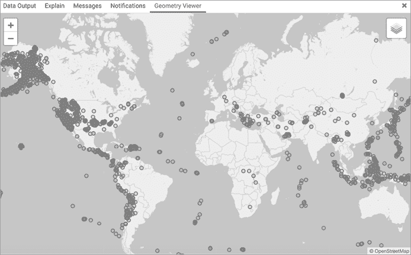
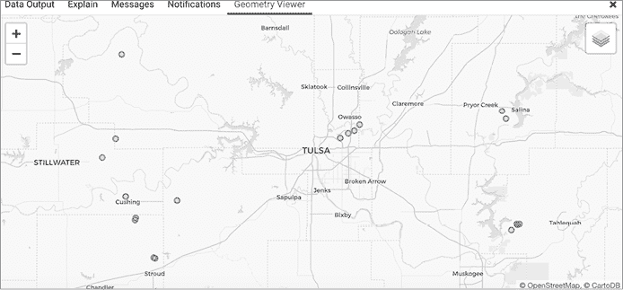

# 第十六章：操作 JSON 数据


*JavaScript 对象表示法 (JSON)* 是一种广泛使用的文本格式，用于以平台无关的方式存储数据，以便在计算机系统之间共享。在本章中，你将学习 JSON 的结构，以及如何在 PostgreSQL 中存储和查询 JSON 数据类型。在我们探讨 PostgreSQL 的 JSON 查询操作符后，我们将分析一个月的地震数据。

美国国家标准协会（ANSI）SQL 标准在 2016 年增加了 JSON 的语法定义，并指定了用于创建和访问 JSON 对象的函数。近年来，主要的数据库系统也增加了对 JSON 的支持，尽管实现方式有所不同。例如，PostgreSQL 支持部分 ANSI 标准，同时实现了一些非标准操作符。在我们进行练习时，我会指出 PostgreSQL 对 JSON 的支持哪些是标准 SQL 的一部分。

## 理解 JSON 结构

JSON 数据主要由两种结构组成：*对象*，它是一个无序的键值对集合；和*数组*，它是一个有序的值集合。如果你使用过 JavaScript、Python 或 C# 等编程语言，这些 JSON 的特性应该很熟悉。

在一个对象内部，我们使用键值对作为存储和引用单个数据项的结构。整个对象被花括号包围，每个名称（通常称为*键*）都用双引号括起来，后跟冒号及其对应的值。该对象可以包含多个键值对，键值对之间用逗号分隔。以下是一个使用电影信息的示例：

```
{"title": "The Incredibles", "year": 2004}
```

键是 `title` 和 `year`，它们的值分别是 `"The Incredibles"` 和 `2004`。如果值是字符串，它放在双引号中。如果是数字、布尔值或 `null`，我们则省略引号。如果你熟悉 Python 语言，你会把这种结构认作是*字典*。

数组是一个有序的值列表，用方括号括起来。我们用逗号分隔数组中的每个值。例如，我们可能会这样列出电影类型：

```
["animation", "action"]
```

数组在编程语言中是常见的，我们已经在 SQL 查询中使用过它们。在 Python 中，这种结构被称为*列表*。

我们可以创建这些结构的多种排列方式，包括将对象和数组相互嵌套。例如，我们可以创建一个对象数组，或使用数组作为键的值。我们可以添加或省略键值对，或创建额外的对象数组，而不会违反预设的模式。这种灵活性——与 SQL 表的严格定义相比——是使用 JSON 作为数据存储的吸引力之一，也是处理 JSON 数据的最大难点之一。

作为示例，示例 16-1 展示了以 JSON 存储的我最喜欢的两部电影的信息。最外层结构是一个包含两个元素的数组——每个电影一个对象。我们知道最外层结构是一个数组，因为整个 JSON 以方括号开头和结尾。

```
[{1
    "title": "The Incredibles",
    "year": 2004,
  2"rating": {
        "MPAA": "PG"
    },
  3"characters": [{
        "name": "Mr. Incredible",
        "actor": "Craig T. Nelson"
 }, {
        "name": "Elastigirl",
        "actor": "Holly Hunter"
    }, {
        "name": "Frozone",
        "actor": "Samuel L. Jackson"
    }],
  4"genre": ["animation", "action", "sci-fi"]
}, {
    "title": "Cinema Paradiso",
    "year": 1988,
    "characters": [{
        "name": "Salvatore",
        "actor": "Salvatore Cascio"
    }, {
        "name": "Alfredo",
        "actor": "Philippe Noiret"
    }],
    "genre": ["romance", "drama"]
}]
```

示例 16-1：包含两部电影信息的 JSON

在最外层数组内，每个电影对象都被花括号包围。位于 1 的打开花括号开始了第一部电影*超人总动员*的对象。对于两部电影，我们将`title`和`year`作为键/值对存储，它们分别具有字符串和整数值。第三个键`rating` 2，其值是一个 JSON 对象。该对象包含一个键/值对，显示了该电影来自美国电影协会的评分。

在这里，我们可以看到 JSON 作为存储介质所赋予我们的灵活性。首先，如果以后想为电影添加另一个国家的评分，我们可以轻松地向`rating`值对象中添加第二个键/值对。其次，我们并不要求在每个电影对象中都包括`rating`—或任何键/值对。事实上，我在*天堂电影院*中省略了`rating`。如果某个特定的数据不可用（例如评分），一些生成 JSON 的系统可能会简单地省略该对。其他系统可能会包括`rating`，但其值为`null`。这两种做法都是有效的，而这种灵活性正是 JSON 的优势之一：它的数据定义或*模式*可以根据需要进行调整。

最后的两个键/值对展示了 JSON 的其他结构方式。对于`characters` 3，值是一个对象数组，每个对象都被花括号包围，并且用逗号分隔。`genre` 4 的值是一个字符串数组。

## 考虑何时在 SQL 中使用 JSON

使用*NoSQL*或*文档*数据库（将数据存储在 JSON 或其他基于文本的数据格式中）相较于使用 SQL 的关系表有其优势。文档数据库在数据定义方面具有灵活性。如果需要，您可以随时重新定义数据结构。文档数据库通常也用于高流量应用，因为可以通过增加服务器来扩展它们。但另一方面，您可能会放弃 SQL 的某些优势，例如能够轻松添加约束以确保数据完整性以及对事务的支持。

SQL 对 JSON 的支持使得通过在关系表中添加 JSON 数据作为列，享受两者的优势成为可能。决定使用 SQL 还是 NoSQL 数据库应该是多方面的。相较于 NoSQL，PostgreSQL 在速度上表现优异，但我们还必须考虑存储的数据种类和数量、所服务的应用程序等因素。

也就是说，一些可能希望在 SQL 中利用 JSON 的情况包括以下几种：

+   当用户或应用程序需要任意创建键/值对时。例如，在标记一组医学研究论文时，一个用户可能想添加一个用于跟踪化学名称的键，而另一个用户可能想要一个用于跟踪食物名称的键。

+   当将相关数据存储在 JSON 列中而不是单独的表中时。例如，员工表可能包含通常的姓名和联系信息列，再加上一列 JSON 数据，存储灵活的键/值对集合，其中可能包含不适用于每个员工的额外属性，如公司奖励或绩效指标。

+   当通过分析从其他系统获取的 JSON 数据来节省时间，而无需首先将其解析为一组表格时。

请记住，在 PostgreSQL 或其他 SQL 数据库中使用 JSON 也可能带来一些挑战。对于常规 SQL 表格中容易设置的约束，JSON 数据中的约束可能更难设置和强制执行。随着键名在文本中反复出现，以及定义结构的引号、逗号和大括号，JSON 数据可能会占用更多的空间。最后，JSON 的灵活性可能会对与其交互的代码（无论是 SQL 还是其他语言）造成问题，如果键名意外消失或某个值的数据类型发生变化。

记住这些内容后，让我们来回顾一下 PostgreSQL 的两种 JSON 数据类型，并将一些 JSON 数据加载到表中。

## 使用 json 和 jsonb 数据类型

PostgreSQL 提供了两种数据类型来存储 JSON。这两种类型只允许插入有效的 JSON——即符合 JSON 规范的文本，包括环绕对象的大括号、分隔对象的逗号以及键的正确引用。如果你尝试插入无效的 JSON，数据库将生成错误。

两者之间的主要区别在于，一种将 JSON 存储为文本，另一种将其存储为二进制数据。二进制实现是 PostgreSQL 新增的功能，通常更受偏好，因为它在查询时更快并且支持索引功能。

这两种类型如下：

****json****

1.  以文本形式存储 JSON，保留空白并保持键的顺序。如果一个 JSON 对象包含某个特定的键多次（这是有效的），`json` 类型将保留每个重复的键/值对。最后，每次数据库函数处理存储在 `json` 中的文本时，都必须解析该对象以解释其结构。这可能使得从数据库读取数据的速度比 `jsonb` 类型慢。索引不受支持。通常，当应用程序具有重复键或需要保留键的顺序时，`json` 类型更为有用。

****jsonb****

1.  以二进制格式存储 JSON，去除空白并不保留键的顺序。如果一个 JSON 对象包含某个特定的键多次，`jsonb` 类型将只保留最后一个键/值对。二进制格式会增加写入数据到表格的开销，但处理速度更快。支持索引。

`json`和`jsonb`都不是 ANSI SQL 标准的一部分，ANSI SQL 标准并未指定 JSON 数据类型，如何实现支持则留给数据库厂商决定。PostgreSQL 文档中[`www.postgresql.org/docs/current/datatype-json.html`](https://www.postgresql.org/docs/current/datatype-json.html)推荐使用`jsonb`，除非有必要保持键/值对的顺序。

在本章余下部分，我们将专门使用`jsonb`，不仅因为它的速度考虑，还因为 PostgreSQL 的许多 JSON 函数在`json`和`jsonb`上都能以相同的方式工作——并且`jsonb`有更多可用的函数。接下来，我们将把 Listing 16-1 中的电影 JSON 数据添加到表中，并探索 JSON 查询语法。

## 导入并为 JSON 数据建立索引

书籍资源中第十六章文件夹里的*films.json*文件位于[`nostarch.com/practical-sql-2nd-edition/`](https://nostarch.com/practical-sql-2nd-edition/)，包含了 Listing 16-1 中 JSON 的修改版。用文本编辑器查看该文件，你会看到每个电影的 JSON 对象被放置在一行上，元素之间没有换行。我还去除了最外层的方括号以及分隔两个电影对象的逗号。每个对象仍然是有效的 JSON 对象：

```
{"title": "The Incredibles", "year": 2004, `--snip--` }
{"title": "Cinema Paradiso", "year": 1988, `--snip--` }
```

我这样设置文件是为了让 PostgreSQL 的`COPY`命令在导入时将每个电影的 JSON 对象解释为一行，就像导入 CSV 文件时那样。Listing 16-2 中的代码创建了一个简单的`films`表，具有替代主键和名为`film`的`jsonb`列。

```
CREATE TABLE films (
    id integer GENERATED ALWAYS AS IDENTITY PRIMARY KEY,
    film jsonb NOT NULL
);

COPY films (film)
1 FROM `C:\YourDirectory`\films.json';

2 CREATE INDEX idx_film ON films USING GIN (film);
```

Listing 16-2：创建用于存储 JSON 数据的表并添加索引

请注意，`COPY`语句以`FROM`子句 1 结尾，而不是像之前的示例那样继续包含`WITH`语句。我们不再需要`WITH`语句（之前我们用它来指定文件头和 CSV 格式选项），因为这个文件没有头部，并且没有分隔符。我们只希望数据库读取每一行并处理它。

导入后，我们使用 GIN 索引类型为`jsonb`列添加索引 2。我们在第十四章中讨论了用于全文搜索的广义倒排索引（GIN）。GIN 在文本中索引单词或键值的位置的实现，特别适用于 JSON 数据。请注意，因为索引条目指向表中的行，所以`jsonb`列的索引在每行包含相对较小的 JSON 片段时效果最佳——而不是一个表中有一行包含一个巨大 JSON 值且重复的键。

执行命令来创建并填充表格，添加索引。运行`SELECT * FROM films;`，你应该能看到两行，分别包含自动生成的`id`和 JSON 对象文本。现在你准备好使用 PostgreSQL 的 JSON 操作符来查询数据了。

## 使用 json 和 jsonb 提取操作符

为了从存储的 JSON 中提取值，我们可以使用 PostgreSQL 特定的*提取运算符*，这些运算符返回一个 JSON 对象、数组的元素，或我们指定路径中存在的元素。表 16-1 展示了这些运算符及其功能，具体功能会根据输入的数据类型有所不同。每个运算符都可以与`json`和`jsonb`数据类型一起使用。

表 16-1：`json`和`jsonb`提取运算符

| **运算符，语法** | **功能** | **返回类型** |
| --- | --- | --- |
| `json` `->` `text` `jsonb` `->` `text` | 提取键值，作为文本指定 | `json`或`jsonb`（与输入类型匹配） |
| `json` `->>` `text` `jsonb` `->>` `text` | 提取键值，作为文本指定 | `text` |
| `json` `->` `integer` `jsonb` `->` `integer` | 提取数组元素，指定一个整数表示其在数组中的位置 | `json`或`jsonb`（与输入类型匹配） |
| `json` `->>` `integer` `jsonb` `->>` `integer` | 提取数组元素，指定一个整数表示其在数组中的位置 | `text` |
| `json` `#>` `text array` `jsonb` `#>` `text array` | 提取指定路径处的 JSON 对象 | `json`或`jsonb`（与输入类型匹配） |
| `json` `#>>` `text array` `jsonb` `#>>` `text array` | 提取指定路径处的 JSON 对象 | `text` |

让我们尝试使用这些运算符与我们的电影 JSON，进一步了解它们在功能上的差异。

### 键值提取

在列表 16-3 中，我们使用`->`和`->>`运算符，后面跟上文本来指定要提取的键值。在这种情况下，这些运算符被称为*字段提取运算符*，因为它们从 JSON 中提取一个字段或键值。两者的区别在于，`->`将键值作为 JSON 以与存储时相同的类型返回，而`->>`将键值作为文本返回。

```
SELECT id, film ->1 'title' AS title
FROM films
ORDER BY id;

SELECT id, film ->>2 'title' AS title
FROM films
ORDER BY id;

SELECT id, film ->3 'genre' AS genre
FROM films
ORDER BY id;
```

列表 16-3：使用字段提取运算符提取 JSON 键值

在`SELECT`列表中，我们指定我们的 JSON 列名，后面跟上运算符和用单引号括起来的键名。在第一个示例中，语法`->` `'title'` 1 返回`title`键的值，数据类型与存储时相同，都是`jsonb`。运行第一个查询，你应该看到如下输出：

```
id       title
-- -----------------
 1 "The Incredibles"
 2 "Cinema Paradiso"
```

在 pgAdmin 中，`title`列头中列出的数据类型应指示为`jsonb`，并且电影标题保持用引号括起来，就像它们在 JSON 对象中一样。

将字段提取运算符更改为`->>` 2 时，将电影标题作为文本返回：

```
id       title
-- ---------------
 1 The Incredibles
 2 Cinema Paradiso
```

最后，我们将返回一个数组。在我们的电影 JSON 中，`genre`键的值是一个值的数组。使用字段提取运算符`->` 3 可以将数组作为`jsonb`返回：

```
id          genre
-- ---------------------------------
 1 ["animation", "action", "sci-fi"]
 2 ["romance", "drama"]
```

如果我们在这里使用`->>`，我们将返回数组的文本表示。接下来，我们来看一下如何从数组中提取元素。

### 数组元素提取

要从数组中检索特定值，我们使用`->`和`->>`操作符，后跟指定值在数组中的位置或*索引*。我们称这些为*元素提取操作符*，因为它们从 JSON 数组中提取元素。与字段提取一样，`->`返回与存储类型相同的 JSON 值，而`->>`则返回文本格式的值。

Listing 16-4 显示了四个使用`"genre"`数组值的示例。

```
SELECT id, film -> 'genre' -> 01  AS genres
FROM films
ORDER BY id;

SELECT id, film -> 'genre' -> -12 AS genres
FROM films
ORDER BY id;

SELECT id, film -> 'genre' -> 23 AS genres
FROM films
ORDER BY id;

SELECT id, film -> 'genre' ->> 04 AS genres
FROM films
ORDER BY id;
```

Listing 16-4: 使用元素提取操作符获取 JSON 数组值

我们必须先从键中提取数组值作为 JSON，然后从数组中提取所需的元素。在第一个示例中，我们指定 JSON 列`film`，接着使用字段提取操作符`->`和单引号括起来的`genre`键名。这将返回`genre`值，类型为`jsonb`。然后我们跟随键名使用`->`和整数`0` 1 来获取第一个元素。

为什么不使用`1`来表示数组中的第一个值呢？在许多语言中，包括 Python 和 JavaScript，索引值从零开始，在使用 SQL 访问 JSON 数组时也遵循这一规则。

运行第一个查询时，结果应该像这样，显示每部电影的`genre`数组中的第一个元素，返回类型为`jsonb`：

```
id   genres
-- -----------
 1 "animation"
 2 "romance"
```

我们还可以访问数组的最后一个元素，即使我们不确定它的索引，因为每部电影的类型数量可能会不同。我们使用负数索引从列表的末尾倒数。提供`-1` 2 会告诉`->`从列表末尾获取第一个元素：

```
id  genres
-- --------
 1 "sci-fi"
 2 "drama"
```

如果我们需要，还可以继续往回数——`-2`的索引将获取倒数第二个元素。

请注意，如果在指定的索引位置没有元素，PostgreSQL 不会返回错误，它只会返回该行的`NULL`。例如，如果我们为索引提供`2` 3，则会看到一部电影的结果，另一部电影则显示`NULL`：

```
id  genres
-- --------
 1 "sci-fi"
 2
```

对于*Cinema Paradiso*，我们得到`NULL`，因为它的`genre`值数组只有两个元素，索引`2`（从零开始计数）表示第三个元素。稍后我们将在本章中学习如何计算数组长度。

最后，将元素提取操作符改为`->>` 4 可以返回所需的元素，数据类型为`text`，而非 JSON：

```
id  genres
-- ---------
 1 animation
 2 romance
```

这与我们在提取键值时看到的模式相同：`->`返回 JSON 数据类型，`->>`返回文本。

### 路径提取

`#>`和`#>>`都是*路径提取操作符*，用于返回位于 JSON 路径中的对象。路径是由一系列键或数组索引组成，用于定位值的位置。在我们的示例 JSON 中，如果我们想要电影的名称，路径可能仅是`title`键。或者，路径可能更复杂，例如`characters`键，后跟索引值`1`，再后面是`actor`键；这样可以提供指向索引`1`处演员姓名的路径。`#>`路径提取操作符返回与存储数据匹配的 JSON 数据类型，而`#>>`返回文本。

考虑电影 *超人总动员* 的 MPAA 评级，在我们的 JSON 中显示如下：

```
"rating": {
    "MPAA": "PG"
}
```

该结构是一个名为 `rating` 的键，其值是一个对象；在该对象内有一个键/值对，`MPAA` 为键名。因此，电影的 MPAA 评级的路径从 `rating` 键开始，到 `MPAA` 键结束。为了表示路径的元素，我们使用 PostgreSQL 数组的字符串语法，创建一个以逗号分隔的列表，放在花括号和单引号中。然后，我们将该字符串传递给路径提取操作符。列表 16-5 展示了设置路径的三个示例。

```
SELECT id, film #> '{rating, MPAA}'1 AS mpaa_rating
FROM films
ORDER BY id;

SELECT id, film #> '{characters, 0, name}'2 AS name
FROM films
ORDER BY id;

SELECT id, film #>> '{characters, 0, name}'3 AS name
FROM films
ORDER BY id;
```

列表 16-5: 使用路径提取操作符获取 JSON 键值

为了获取每部电影的 MPAA 评级，我们在数组中指定路径：`{rating, MPAA}` 1，每个项由逗号分隔。运行查询后，你应该看到以下结果：

```
id mpaa_rating
-- -----------
 1 "PG"
 2
```

查询返回 *超人总动员* 的 PG 评级和 *天堂电影院* 的 `NULL`，因为在我们的数据中，后者没有 MPAA 评级。

第二个示例适用于 `characters` 数组，在我们的 JSON 中看起来是这样的：

```
"characters": [{
    "name": "Salvatore",
    "actor": "Salvatore Cascio"
}, {
    "name": "Alfredo",
    "actor": "Philippe Noiret"
}]
```

显示的 `characters` 数组是第二部电影的内容，但两部电影的结构相似。数组对象分别表示一个角色，以及扮演该角色的演员的名字。为了查找数组中第一个角色的名字，我们指定一个路径 2，从 `characters` 键开始，使用索引 `0` 访问数组的第一个元素，并以 `name` 键结束。查询结果应该像这样：

```
id       name
-- ----------------
 1 "Mr. Incredible"
 2 "Salvatore"
```

`#>` 操作符将结果返回为 JSON 数据类型，在我们的例子中是 `jsonb`。如果我们希望以文本格式返回结果，我们使用 `#>>` 3，路径相同。

### 包含性和存在性

我们将探讨的最后一组操作符执行两种类型的评估。第一种涉及 *包含性*，检查指定的 JSON 值是否包含第二个指定的 JSON 值。第二种检查 *存在性*：测试 JSON 对象中的文本字符串是否作为顶级键（或作为嵌套在更深层对象中的数组元素）存在。这两种操作符都返回布尔值，这意味着我们可以在 `WHERE` 子句中使用它们来筛选查询结果。

这组操作符仅适用于 `jsonb` 数据类型——这也是我们偏好 `jsonb` 而非 `json` 的另一个好理由——并且可以利用我们的 GIN 索引进行高效搜索。表 16-2 列出了这些操作符的语法和功能。

表 16-2: `jsonb` 包含和存在操作符

| **操作符，语法** | **功能** | **返回值** |
| --- | --- | --- |
| `jsonb` `@>` `jsonb` | 测试第一个 JSON 值是否包含第二个 JSON 值 | `boolean` |
| `jsonb` `<@` `jsonb` | 测试第二个 JSON 值是否包含第一个 JSON 值 | `boolean` |
| `jsonb` `?` `text` | 测试文本是否作为顶级（非嵌套）键或数组值存在 | `boolean` |
| `jsonb` `?&#124;` `text array` | 测试数组中的任何文本元素是否存在为顶层（非嵌套）键或数组值 | `boolean` |
| `jsonb` `?&` `text array` | 测试数组中的所有文本元素是否存在为顶层（非嵌套）键或数组值 | `boolean` |

#### 使用包含操作符

在列表 16-6 中，我们使用 `@>` 来评估一个 JSON 值是否包含第二个 JSON 值。

```
SELECT id, film ->> 'title' AS title,
       film @>1 '{"title": "The Incredibles"}'::jsonb AS is_incredible
FROM films
ORDER BY id;
```

列表 16-6：演示 `@>` 包含操作符

在我们的 `SELECT` 列表中，我们检查每一行中存储在 `film` 列中的 JSON 是否包含 *超人总动员* 的键值对。我们在表达式中使用了 `@>` 包含操作符 1，如果 `film` 包含 `"title": "The Incredibles"`，则生成一个布尔结果 `true` 的列。我们给出了我们的 JSON 列 `film`，然后是 `@>` 操作符，再是一个字符串（强制转换为 `jsonb`），指定键值对。在我们的 `SELECT` 列表中，我们还将电影标题的文本作为一列返回。运行查询应该得到如下结果：

```
id      title      is_incredible
-- --------------- -------------
 1 The Incredibles  true
 2 Cinema Paradiso  false
```

正如预期的那样，表达式对 *超人总动员* 评估为 `true`，对 *天堂电影院* 评估为 `false`。

因为该表达式评估为布尔结果，所以我们可以将其用于查询的 `WHERE` 2 子句，如列表 16-7 所示。

```
SELECT film ->> 'title' AS title,
       film ->> 'year' AS year
FROM films
2 WHERE film @> '{"title": "The Incredibles"}'::jsonb;
```

列表 16-7：在 `WHERE` 子句中使用包含操作符

这里我们再次检查 `film` 列中的 JSON 是否包含 *超人总动员* 的标题键值对。通过将评估放在 `WHERE` 子句中，查询应该只返回表达式返回 `true` 的那一行：

```
 title      year
--------------- ----
The Incredibles 2004
```

最后，在列表 16-8 中，我们翻转了评估顺序，以检查指定的键值对是否包含在 `film` 列中。

```
SELECT film ->> 'title' AS title,
       film ->> 'year' AS year
FROM films
WHERE '{"title": "The Incredibles"}'::jsonb <@3 film;
```

列表 16-8：演示 `<@` 包含操作符

在这里，我们使用 `<@` 操作符 3 替代 `@>` 来翻转评估顺序。这个表达式也会评估为 `true`，返回与之前查询相同的结果。

#### 使用存在性操作符

接下来，在列表 16-9 中，我们探讨了三个存在性操作符。它们检查我们提供的文本是否存在为顶层键或数组元素。所有操作符都返回布尔值。

```
SELECT film ->> 'title' AS title
FROM films
WHERE film ?1 'rating';

SELECT film ->> 'title' AS title,
       film ->> 'rating' AS rating,
       film ->> 'genre' AS genre
FROM films
WHERE film ?|2 '{rating, genre}';

SELECT film ->> 'title' AS title,
       film ->> 'rating' AS rating,
       film ->> 'genre' AS genre
FROM films
WHERE film ?&3 '{rating, genre}';
```

列表 16-9：演示存在性操作符

`?` 操作符检查单个键或数组元素的存在。在第一个查询的 `WHERE` 子句中，我们给出了 `film` 列、`?` 操作符 1，然后是字符串 `rating`。这个语法表示：“在每一行中，`rating` 是否存在为 `film` 列中的 JSON 键？”当我们运行查询时，结果显示了唯一拥有 `rating` 键的电影 *超人总动员*。

`?|` 和 `?&` 操作符分别作为 `or` 和 `and` 使用。例如，使用 `?|` 2 会测试是否存在`rating`或`genre`作为顶级键。运行第二个查询返回两个影片，因为它们至少有其中一个键。然而，使用 `?&` 3 会测试是否同时存在`rating`和`genre`键，这对*超人总动员*来说是成立的。

所有这些操作符提供了细致调整 JSON 数据探索的选项。现在，让我们在一个更大的数据集上使用其中的一些操作符。

## 分析地震数据

在本节中，我们将分析由美国地质调查局（US Geological Survey）编制的地震 JSON 数据。美国地质调查局是美国内政部的一个机构，监测包括火山、滑坡和水质在内的自然现象。美国地质调查局利用一网络的地震仪来记录地球的震动，编制每个地震事件的地点和强度数据。小型地震在全球每天发生多次；而大型地震则较为少见，但可能会造成灾难性后果。

对于我们的练习，我从美国地质调查局（USGS）的*应用程序编程接口*（API）中提取了一个月的 JSON 格式地震数据。*API*是计算机之间传输数据和命令的资源，而 JSON 常用于 API 中。你可以在本书资源的本章文件夹中找到名为*earthquakes.json*的文件。

### 探索并加载地震数据

清单 16-10 显示了文件中每个地震记录的数据结构，以及它的部分键值对（你的*Chapter_16.sql*文件有未截断的版本）。

```
{
    "type": "Feature", 1
    "properties":2 {
        "mag": 1.44,
        "place": "134 km W of Adak, Alaska",
        "time": 1612051063470,
        "updated": 1612139465880,
        "tz": null,
        `--snip--`
        "felt": null,
        "cdi": null,
        "mmi": null,
        "alert": null,
        "status": "reviewed",
        "tsunami": 0,
        "sig": 32,
        "net": "av",
        "code": "91018173",
        "ids": ",av91018173,",
        "sources": ",av,",
        "types": ",origin,phase-data,",
 "nst": 10,
        "dmin": null,
        "rms": 0.15,
        "gap": 174,
        "magType": "ml",
        "type": "earthquake",
        "title": "M 1.4 - 134 km W of Adak, Alaska"
    },
    "geometry":3 {
        "type": "Point",
        "coordinates": [-178.581, 51.8418333333333, 22.48]
    },
    "id": "av91018173"
}
```

清单 16-10：包含一个地震数据的 JSON

这些数据采用*GeoJSON*格式，这是一个基于 JSON 的空间数据规范。GeoJSON 将包含一个或多个`Feature`对象，通过包含键值对`"type": "Feature"`来表示 1。每个`Feature`描述一个空间对象，并在`properties`下包含描述性属性（例如事件时间或相关代码）2，以及包含空间对象坐标的`geometry` 3 键。在我们的数据中，每个`geometry`都是一个点（Point），这是一个简单的特征，包含一个地震的经度、纬度和深度（单位：千米）坐标。我们在第十五章使用 PostGIS 时讨论了点和简单特征；GeoJSON 将其与其他空间简单特征结合使用。你可以在[`geojson.org/`](https://geojson.org/)阅读更多关于 GeoJSON 规范的内容，并在 USGS 文档中查看键的定义，网址为[`earthquake.usgs.gov/data/comcat/data-eventterms.php/`](https://earthquake.usgs.gov/data/comcat/data-eventterms.php/)。

让我们使用清单 16-11 中的代码，将数据加载到名为`earthquakes`的表中。

```
CREATE TABLE earthquakes (
    id integer GENERATED ALWAYS AS IDENTITY PRIMARY KEY,
    earthquake jsonb1 NOT NULL
);

COPY earthquakes (earthquake)
FROM `C:\YourDirectory`\earthquakes.json';

2 CREATE INDEX idx_earthquakes ON earthquakes USING GIN (earthquake);
```

清单 16-11：创建并加载地震数据表

与我们的`films`表类似，我们使用`COPY`将数据复制到一个单独的`jsonb`列中，并添加一个 GIN 索引。运行`SELECT * FROM earthquakes;`应返回 12,899 行数据。现在让我们看看我们可以从数据中学到什么。

### 处理地震时间

`time`键/值对表示地震发生的时刻。在列表 16-12 中，我们使用路径提取运算符检索`time`的值。

```
SELECT id, earthquake #>> '{properties, time}'1 AS time
FROM earthquakes
ORDER BY id LIMIT 5;
```

列表 16-12：检索地震时间

在`SELECT`列表中，我们给出`earthquake`列，后跟`#>>`路径提取运算符和路径 1，用来获取数组中表示时间值的`#>>`运算符将我们的值作为文本返回。运行查询应返回五行：

```
id     time
-- -------------
 1 1612137592990
 2 1612137479762
 3 1612136740672
 4 1612136207600
 5 1612135893550
```

如果这些值看起来不像时间，这并不奇怪。默认情况下，USGS 将时间表示为从 1970 年 1 月 1 日 00:00 UTC 起的毫秒数。这是我们在第十二章介绍的标准时代的一个变体，该时代以秒计量。我们可以使用`to_timestamp()`和一点数学来将 USGS 的`time`值转换为可理解的形式，如列表 16-13 所示。

```
SELECT id, earthquake #>> '{properties, time}' as time,
     1 to_timestamp(
           (earthquake #>> '{properties, time}')::bigint / 10002
                   ) AS time_formatted
FROM earthquakes
ORDER BY id LIMIT 5;
```

列表 16-13：将`time`值转换为时间戳

在`to_timestamp()`函数的括号内，我们重复代码以提取`time`值。`to_timestamp()`函数需要表示秒数的数字，但提取的值是文本且以毫秒为单位，因此我们还将提取的文本转换为`bigint`并除以 1000 以将其转换为秒。

在我的机器上，查询生成以下结果，显示提取的`time`值及其转换后的时间戳（根据您的 PostgreSQL 服务器时区设置不同，您的值将有所不同，因此`time_formatted`将显示地震发生时的服务器时区时间）。

```
id     time          time_formatted
-- ------------- ----------------------
 1 1612137592990 2021-01-31 18:59:52-05
 2 1612137479762 2021-01-31 18:57:59-05
 3 1612136740672 2021-01-31 18:45:40-05
 4 1612136207600 2021-01-31 18:36:47-05
 5 1612135893550 2021-01-31 18:31:33-05
```

现在我们有了一个可理解的时间戳，让我们使用`min()`和`max()`聚合函数在列表 16-14 中找到最旧和最新的地震时间。

```
SELECT min1(to_timestamp(
              (earthquake #>> '{properties, time}')::bigint / 1000
                          )) AT TIME ZONE 'UTC'2 AS min_timestamp,
       max3(to_timestamp(
              (earthquake #>> '{properties, time}')::bigint / 1000
                          )) AT TIME ZONE 'UTC' AS max_timestamp
FROM earthquakes;
```

列表 16-14：查找最小和最大的地震时间

我们在`SELECT`列表中的`min()`和`max()`函数内部放置`to_timestamp()`和我们的毫秒转秒转换。这一次，在两个函数之后添加关键字`AT TIME ZONE 'UTC'`，无论我们的服务器时区设置如何，结果都将以 UTC 显示，正如 USGS 记录的那样。您的结果应该如下所示：

```
 min_timestamp       max_timestamp
------------------- -------------------
2021-01-01 00:01:39 2021-01-31 23:59:52
```

这组地震跨越了一个月——从 2021 年 1 月 1 日凌晨到 1 月 31 日结束。这是我们继续挖掘可用信息时的有用背景。

### 查找最大和最多报告的地震

接下来，我们将看两个数据点，即地震的大小和市民报告感觉程度，并应用 JSON 提取技术对结果进行简单排序。

#### 按震级提取

美国地质调查局（USGS）报告每个地震的震级，位于`mag`键下，位于`properties`之下。根据 USGS 的定义，震级是表示地震源大小的一个数字。它的尺度是对数的：一个震级为 4 的地震，其地震波的振幅约是震级为 3 的地震的 10 倍。了解了这一背景后，我们来使用清单 16-15 中的代码，查找我们数据中五个最大的地震。

```
SELECT earthquake #>> '{properties, place}'1 AS place,
       to_timestamp((earthquake #>> '{properties, time}')::bigint / 1000)
           AT TIME ZONE 'UTC' AS time,
       (earthquake #>> '{properties, mag}')::numeric AS magnitude
FROM earthquakes
2 ORDER BY (earthquake #>> '{properties, mag}')::numeric3 DESC NULLS LAST
LIMIT 5;
```

清单 16-15：查找五个震级最大的地震

我们再次使用路径提取操作符来获取我们所需的元素，包括`place` 1 和`mag`的值。为了在结果中显示最大的五个，我们在`ORDER BY`子句 2 中添加了`mag`。我们在此处和`SELECT`中将值强制转换为数值类型 3，因为我们希望将其作为数字而不是文本进行显示和排序。我们还添加了`DESC NULLS LAST`关键字，这样可以将结果按降序排列，并将`NULL`值（有两个）放在最后。你的结果应该如下所示：

```
 place                        time         magnitude
------------------------------------- ------------------- ---------
211 km SE of Pondaguitan, Philippines 2021-01-21 12:23:04         7
South Shetland Islands                2021-01-23 23:36:50       6.9
30 km SSW of Turt, Mongolia           2021-01-11 21:32:59       6.7
28 km SW of Pocito, Argentina         2021-01-19 02:46:21       6.4
Kermadec Islands, New Zealand         2021-01-08 00:28:50       6.3
```

最大的一次震级为 7，发生在菲律宾小城市 Pondaguitan 东南的海洋下。第二次地震发生在南极的南设得兰群岛附近。

#### 基于市民报告的提取

美国地质调查局（USGS）运营着一个“你感觉到地震了吗？”网站，地址是[`earthquake.usgs.gov/data/dyfi/`](https://earthquake.usgs.gov/data/dyfi/)，人们可以在此报告他们的地震体验。我们的 JSON 数据中包含每个地震的报告数量，这些数据位于`felt`键下，位于`properties`之下。我们将使用清单 16-16 中的代码来查看我们的数据中哪些地震产生了最多的报告。

```
SELECT earthquake #>> '{properties, place}' AS place,
       to_timestamp((earthquake #>> '{properties, time}')::bigint / 1000)
           AT TIME ZONE 'UTC' AS time,
       (earthquake #>> '{properties, mag}')::numeric AS magnitude,
       (earthquake #>> '{properties, felt}')::integer1 AS felt
FROM earthquakes
ORDER BY (earthquake #>> '{properties, felt}')::integer2 DESC NULLS LAST
LIMIT 5;
```

清单 16-16：查找拥有最多“你感觉到地震了吗？”报告的地震

结构上，这个查询类似于清单 16-15，用于查找最大规模的地震。我们为`felt`键添加了路径提取操作符，将返回的文本值强制转换为`integer`类型。我们将其强制转换为`integer`，是因为提取的文本将作为数字进行排序和显示。最后，我们将提取代码放在`ORDER BY` 2 中，使用`NULLS LAST`，因为有许多地震没有报告，我们希望这些地震出现在列表的最后。你应该看到以下结果：

```
 place                  time         magnitude felt
------------------------- ------------------- --------- -----
4km SE of Aromas, CA      2021-01-17 04:01:27       4.2 19907
2km W of Concord, CA      2021-01-14 19:18:10      3.63  5101
10km NW of Pinnacles, CA  2021-01-02 14:42:23      4.32  3076
2km W of Willowbrook, CA  2021-01-20 16:31:58      3.52  2086
3km NNW of Santa Rosa, CA 2021-01-19 04:22:20      2.68  1765
```

排名前五的地震都发生在加利福尼亚，这很有道理。“你感觉到地震了吗？”是美国政府运营的系统，因此我们会预期更多的美国报告，尤其是在易发生地震的加利福尼亚。此外，我们数据中一些最大的地震发生在海洋下或偏远地区。那次拥有超过 19,900 份报告的地震震级适中，但由于它靠近城市，人们更容易注意到它。

### 将地震 JSON 转换为空间数据

我们的 JSON 数据包含了每次地震的经度和纬度值，这意味着我们可以使用第十五章讨论的 GIS 技术进行空间分析。例如，我们将使用 PostGIS 距离函数来定位发生在距离某城市 50 英里以内的地震。但是，首先我们必须将存储在 JSON 中的坐标转换为 PostGIS 数据类型。

经度和纬度值位于 `geometry` 下的 `coordinates` 键的数组中。以下是一个例子：

```
 "geometry": {
        "type": "Point",
        "coordinates": [-178.581, 51.8418333333333, 22.48]
    }
```

数组中的第一个坐标（位置 `0`）表示经度；第二个坐标（位置 `1`）表示纬度。第三个值表示深度（单位为千米），我们暂时不使用。要将这些元素提取为文本，我们使用 `#>>` 路径操作符，如 列表 16-17 所示。

```
SELECT id,
       earthquake #>> '{geometry, coordinates}' AS coordinates,
       earthquake #>> '{geometry, coordinates, 0}' AS longitude,
       earthquake #>> '{geometry, coordinates, 1}' AS latitude
FROM earthquakes
ORDER BY id
LIMIT 5;
```

列表 16-17：提取地震的位置信息

查询应返回五行数据：

```
id           coordinates             longitude    latitude
-- -------------------------------- ------------ ----------
 1 [-122.852, 38.8228333, 2.48]     -122.852     38.8228333
 2 [-148.3859, 64.2762, 16.2]       -148.3859    64.2762
 3 [-152.489, 59.0143, 73]          -152.489     59.0143
 4 [-115.82, 32.7493333, 9.85]      -115.82      32.7493333
 5 [-115.6446667, 33.1711667, 5.89] -115.6446667 33.1711667
```

通过快速对比我们的结果与 JSON 中的 `longitude` 和 `latitude` 值，我们可以确认提取的值是正确的。接下来，我们将使用 PostGIS 函数将这些值转换为 `geography` 数据类型中的点。

列表 16-18 为每次地震生成一个 `geography` 类型的点，我们可以将其用作 PostGIS 空间函数的输入。

```
SELECT ST_SetSRID(
         ST_MakePoint1(
            (earthquake #>> '{geometry, coordinates, 0}')::numeric,
            (earthquake #>> '{geometry, coordinates, 1}')::numeric
         ),
             43262)::geography AS earthquake_point
FROM earthquakes
ORDER BY id;
```

列表 16-18：将 JSON 位置信息转换为 PostGIS 地理数据

在 `ST_MakePoint()` 内，我们放入提取经度和纬度的代码，将这两个值强制转换为 `numeric` 类型，以符合该函数的要求。我们将该函数嵌套在 `ST_SetSRID()` 中，以设置结果点的空间参考系统标识符（SRID）。在第十五章中，你学到 SRID 用于指定绘制空间对象的坐标网格。SRID 值 `4326` 表示常用的 WGS 84 坐标系统。最后，我们将整个输出转换为 `geography` 类型。前几行数据应该如下所示：

```
 earthquake_point
--------------------------------------------------
0101000020E61000004A0C022B87B65EC0A6C7009A52694340
0101000020E6100000D8F0F44A598C62C0EFC9C342AD115040
0101000020E6100000CFF753E3A50F63C0992A1895D4814D40
`--snip--`
```

我们无法直接解释那些由数字和字母组成的字符串，但可以使用 pgAdmin 的几何图形查看器来查看地图上的地震点。在 pgAdmin 数据输出窗格中显示查询结果后，点击 `earthquake_point` 结果头部的眼睛图标。你应该能看到在地图上绘制的地震位置，地图使用 OpenStreetMap 作为底图，如 图 16-1 所示。

即使只有一个月的数据，也很容易看出地震集中在太平洋边缘的环太平洋地震带（即“火环”）区域，这里是构造板块碰撞和火山活动较为活跃的地方。



图 16-1：在 pgAdmin 中查看地震位置

#### 查找指定距离内的地震

接下来，让我们将研究范围缩小到发生在俄克拉荷马州塔尔萨附近的地震——根据美国地质调查局（USGS）的数据，这个地区自 2009 年以来，由于石油和天然气加工活动，地震活动有所增加。

为了执行像这样的复杂 GIS 任务，如果我们将 JSON 坐标永久转换为`earthquakes`表中的`geography`类型列，事情会更容易。这样可以避免在每个查询中添加转换代码的混乱。

示例 16-19 向`earthquakes`表中添加了一个名为`earthquake_point`的列，并将 JSON 坐标转换为`geography`类型填充到新列中。

```
1 ALTER TABLE earthquakes ADD COLUMN earthquake_point geography(POINT, 4326);

2 UPDATE earthquakes
SET earthquake_point =
        ST_SetSRID(
            ST_MakePoint(
                (earthquake #>> '{geometry, coordinates, 0}')::numeric,
                (earthquake #>> '{geometry, coordinates, 1}')::numeric
             ),
                 4326)::geography;

3 CREATE INDEX quake_pt_idx ON earthquakes USING GIST (earthquake_point);
```

示例 16-19：将 JSON 坐标转换为 PostGIS 几何列

我们使用`ALTER TABLE` 1 来添加一个类型为`geography`的列`earthquake_point`，并指定该列将包含具有 SRID `4326`的点。接下来，我们使用 2 中的`UPDATE`语句更新表格，使用与示例 16-18 中相同的语法设置`earthquake_point`列，并对新列添加空间索引，使用 GIST 3。

完成后，我们可以使用示例 16-20 来查找位于塔尔萨 50 英里范围内的地震。

```
SELECT earthquake #>> '{properties, place}' AS place,
       to_timestamp((earthquake -> 'properties' ->> 'time')::bigint / 1000)
           AT TIME ZONE 'UTC' AS time,
       (earthquake #>> '{properties, mag}')::numeric AS magnitude,
       earthquake_point
FROM earthquakes
1 WHERE ST_DWithin(earthquake_point,
               2 ST_GeogFromText('POINT(-95.989505 36.155007)'),
                 80468)
ORDER BY time;
```

示例 16-20：查找位于塔尔萨市中心 50 英里范围内的地震

在`WHERE`子句 1 中，我们使用了`ST_DWithin()`函数，该函数如果一个空间对象在另一个对象的指定距离内，则返回布尔值`true`。在这里，我们想要评估每个地震点，以检查它是否位于塔尔萨市中心 50 英里范围内。我们在`ST_GeogFromText()` 2 中指定了该城市的坐标，并使用其米制等价值`80468`作为输入值，因为米是必需的输入单位。查询应该返回 19 行（我省略了`earthquake_point`列并截断了结果以便简洁）：

```
 place                 time         magnitude
------------------------------ ------------------- ---------
4 km SE of Owasso, Oklahoma    2021-01-04 19:46:58      1.53
6 km SSE of Cushing, Oklahoma  2021-01-05 08:04:42      0.91
2 km SW of Hulbert, Oklahoma   2021-01-05 21:08:28      1.95
`--snip--`
```

在 pgAdmin 中点击`earthquake_point`列上方的眼睛图标来查看地震位置。你应该会看到塔尔萨市周围的 19 个点，如图 16-2 所示（你还可以通过点击右上角的图层图标来调整底图样式）。

要实现这些结果，需要进行一些编码技巧，如果数据是以 Shapefile 或典型的 SQL 表格形式到达，原本是无需做这些的。然而，借助 PostgreSQL 对 JSON 格式的支持，依然可以从 JSON 数据中提取有意义的见解。在本章的最后部分，我们将介绍一些有用的 PostgreSQL 函数，用于生成和操作 JSON。



图 16-2：在 pgAdmin 中查看塔尔萨附近的地震

## 生成和操作 JSON

我们可以使用 PostgreSQL 函数从 SQL 表中的现有行创建 JSON，或修改存储在表中的 JSON，以添加、删除或更改键和值。PostgreSQL 文档中列出了几打与 JSON 相关的函数，网址为[`www.postgresql.org/docs/current/functions-json.html`](https://www.postgresql.org/docs/current/functions-json.html)—我们将学习其中一些你可能会用到的函数。

### 将查询结果转换为 JSON

由于 JSON 主要是一种用于共享数据的格式，因此能够快速将 SQL 查询的结果转换为 JSON，以便传递给其他计算机系统是非常有用的。清单 16-21 使用 PostgreSQL 特定的 `to_json()` 函数，将你在第七章中创建的 `employees` 表的行转换为 JSON 格式。

```
1 SELECT to_json(employees) AS json_rows
FROM employees;
```

清单 16-21：使用 `to_json()` 将查询结果转换为 JSON

`to_json()` 函数执行它所描述的操作：将提供的 SQL 值转换为 JSON。为了将 `employees` 表中每一行的所有值转换为 JSON，我们在 `SELECT` 语句中使用 `to_json()` 并将表名作为该函数的参数；这样会将每一行作为一个 JSON 对象返回，列名作为键：

```
 json_rows
--------------------------------------------------------------------------------------
{"emp_id":1,"first_name":"Julia","last_name":"Reyes","salary":115300.00,"dept_id":1}
{"emp_id":2,"first_name":"Janet","last_name":"King","salary":98000.00,"dept_id":1}
{"emp_id":3,"first_name":"Arthur","last_name":"Pappas","salary":72700.00,"dept_id":2}
{"emp_id":4,"first_name":"Michael","last_name":"Taylor","salary":89500.00,"dept_id":2}
```

我们可以通过几种方式修改查询，以限制要包含在结果中的列。在清单 16-22 中，我们使用 `row()` 构造函数作为 `to_json()` 的参数。

```
SELECT to_json(row(emp_id, last_name))1 AS json_rows
FROM employees;
```

清单 16-22：指定要转换为 JSON 的列

`row()` 构造函数（符合 ANSI SQL 标准）根据传递给它的参数构建一个行值。在此例中，我们提供了列名 `emp_id` 和 `last_name` 1，并将 `row()` 放在 `to_json()` 内部。此语法将只返回 JSON 结果中的这些列：

```
 json_rows
----------------------
{"f1":1,"f2":"Reyes"}
{"f1":2,"f2":"King"}
{"f1":3,"f2":"Pappas"}
{"f1":4,"f2":"Taylor"}
```

然而，请注意，键名是 `f1` 和 `f2`，而不是它们的源列名。这是 `row()` 的副作用，`row()` 在构建行记录时不会保留列名。我们可以设置键名，通常这样做是为了简化名称并减少 JSON 文件的大小，从而提高传输速度。清单 16-23 展示了通过子查询来实现这一点。

```
SELECT to_json(employees) AS json_rows
FROM (
    1 SELECT emp_id, last_name AS ln2 FROM employees
) AS employees;
```

清单 16-23：通过子查询生成键名

我们编写一个子查询 1 来获取我们需要的列，并将结果别名为 `employees`。在此过程中，我们将列名 2 别名为一个简短的名称，以便在 JSON 中作为键使用。

结果应如下所示：

```
 json_rows
--------------------------
{"emp_id":1,"ln":"Reyes"}
{"emp_id":2,"ln":"King"}
{"emp_id":3,"ln":"Pappas"}
{"emp_id":4,"ln":"Taylor"}
```

最后，清单 16-24 展示了如何将所有 JSON 行编译成一个包含对象的数组。如果你需要将这些数据提供给其他应用程序，供其迭代处理对象数组以执行任务（如计算）或在设备上呈现数据时，可能会需要这样做。

```
1 SELECT json_agg(to_json(employees)) AS json
FROM (
    SELECT emp_id, last_name AS ln FROM employees
) AS employees;
```

清单 16-24：聚合行并转换为 JSON

我们将 `to_json()` 包裹在 PostgreSQL 特定的 `json_agg()` 1 函数中，该函数将包括 `NULL` 在内的值聚合成一个 JSON 数组。其输出应如下所示：

```
 json
--------------------------------------------------------------------------------------------
[{"emp_id":1,"ln":"Reyes"}, {"emp_id":2,"ln":"King"}, {"emp_id":3,"ln":"Pappas"}, `--snip--` ]
```

这些是简单的示例，但你可以使用子查询构建更复杂的 JSON 结构，从而生成嵌套对象。我们将在本章结尾的“动手实践”练习中考虑一种实现方法。

### 添加、更新和删除键值对

我们可以通过连接和 PostgreSQL 特定的函数来添加、更新和删除 JSON 中的内容。让我们通过一些示例来进行操作。

#### 添加或更新顶级键值对

在清单 16-25 中，我们回到`films`表，并使用两种不同的技术为电影*The Incredibles*添加顶级键/值对`"studio": "Pixar"`：

```
UPDATE films
SET film = film ||1 '{"studio": "Pixar"}'::jsonb
WHERE film @> '{"title": "The Incredibles"}'::jsonb;

UPDATE films
SET film = film || jsonb_build_object('studio', 'Pixar')2
WHERE film @> '{"title": "The Incredibles"}'::jsonb;
```

清单 16-25：通过拼接添加顶级键/值对

两个示例都使用`UPDATE`语句来为`jsonb`列`film`设置新值。在第一个示例中，我们使用 PostgreSQL 的拼接运算符`||` 1 将现有的电影 JSON 与我们转换为`jsonb`的新键值对拼接在一起。在第二个示例中，我们再次使用拼接，但这次使用`jsonb_build_object()`。这个函数接受一系列的键和值作为参数，并返回一个`jsonb`对象，这样我们如果需要的话，可以一次性拼接多个键/值对。

如果键在正在拼接的 JSON 中不存在，两条语句都会插入新的键/值对；如果键已经存在，它会覆盖该键。两者之间没有功能上的差异，所以你可以根据个人喜好选择使用其中任何一种。请注意，这种行为是`jsonb`特有的，它不允许重复的键名。

如果你执行`SELECT * FROM films;`并双击`film`列中的更新数据，你应该能看到新的键/值对：

```
`--snip--`
    "rating": {
        "MPAA": "PG"
    },
    "studio": "Pixar",
    "characters": [
`--snip--`
```

#### 在路径上更新值

目前，*Cinema Paradiso*的`genre`键有两个条目：

```
"genre": ["romance", "drama"]
```

要向数组中添加第三个条目，我们使用`jsonb_set()`函数，该函数允许我们在特定的 JSON 路径上指定要更新的值。在清单 16-26 中，我们使用`UPDATE`语句和`jsonb_set()`来添加`World War II`这一类别。

```
UPDATE films
SET film = jsonb_set(film, 1
                 '{genre}', 2
                  film #> '{genre}' || '["World War II"]', 3
                  true4)
WHERE film @> '{"title": "Cinema Paradiso"}'::jsonb;
```

清单 16-26：使用`jsonb_set()`在路径上添加数组值

在`UPDATE`中，我们将`film`的值设置为`jsonb_set()`的结果，并使用`WHERE`限制更新只作用于*Cinema Paradiso*这一行。该函数的第一个参数 1 是我们想要修改的目标 JSON，这里是`film`。第二个参数是指向数组值的路径 2——`genre`键。第三个参数是我们为`genre`指定的新值，这个新值是当前的`genre`值与一个包含单一值`"World War II"`的数组 3 拼接起来的。这个拼接会生成一个包含三个元素的数组。最后一个参数是一个可选的布尔值 4，决定`jsonb_set()`在值不存在时是否创建该值。由于`genre`已经存在，所以这里是多余的；我展示它是为了参考。

执行查询后，再快速执行一次`SELECT`以检查更新后的 JSON。你应该能看到`genre`数组包含三个值：`["romance", "drama", "World War II"]`。

#### 删除值

我们可以通过配对两个运算符来从 JSON 对象中删除键和值。清单 16-27 展示了两个`UPDATE`示例。

```
UPDATE films
SET film = film -1 'studio'
WHERE film @> '{"title": "The Incredibles"}'::jsonb;

UPDATE films
SET film = film #-2 '{genre, 2}'
WHERE film @> '{"title": "Cinema Paradiso"}'::jsonb;
```

清单 16-27：从 JSON 中删除值

减号 1 作为*删除操作符*，删除了我们之前为*《超人总动员》*添加的`studio`键及其值。在减号后提供一个文本字符串表示我们要删除一个键及其值；提供一个整数则表示删除该索引处的元素。

`#-` 2 符号是一个*路径删除操作符*，它会删除我们指定路径上的 JSON 元素。语法与路径提取操作符`#>`和`#>>`相似。在这里，我们使用`{genre, 2}`来表示 `genre` 数组中的第三个元素（记住，JSON 数组的索引从零开始）。这将删除我们之前添加到*《天堂电影院》*中的`World War II`。

运行这两个语句后，使用`SELECT`查看修改后的电影 JSON。你应该看到这两个元素已被删除。

## 使用 JSON 处理函数

为了完成我们的 JSON 学习，我们将回顾一些专门用于处理 JSON 数据的 PostgreSQL 函数，包括将数组值展开为表格行和格式化输出。你可以在 PostgreSQL 文档中找到完整的函数列表，网址是[`www.postgresql.org/docs/current/functions-json.html`](https://www.postgresql.org/docs/current/functions-json.html)。

### 查找数组的长度

计算数组中元素的数量是一个常见的编程和分析任务。例如，我们可能想知道每部电影的演员在 JSON 中存储了多少。为此，我们可以使用`jsonb_array_length()`函数，在清单 16-28 中查看。

```
SELECT id,
       film ->> 'title' AS title,
     1 jsonb_array_length(film -> 'characters') AS num_characters
FROM films
ORDER BY id;
```

清单 16-28：查找数组的长度

作为唯一参数，函数 1 接受一个表达式，该表达式提取`film`中`character`键的值。运行查询应生成以下结果：

```
id      title      num_characters
-- --------------- --------------
 1 The Incredibles              3
 2 Cinema Paradiso              2
```

输出正确显示了*《超人总动员》*有三个角色，*《天堂电影院》*有两个角色。注意，对于 `json` 类型有一个类似的`json_array_length()`函数。

### 返回数组元素作为行

`jsonb_array_elements()`和`jsonb_array_elements_text()`函数将数组元素转换为行，每个元素一行。这是数据处理的一个有用工具。例如，要将 JSON 转换为结构化的 SQL 数据，我们可以使用该函数生成可以插入表格的行，或者生成可以通过分组和计数来聚合的行。

清单 16-29 使用这两个函数将`genre`键的数组值转换为行。每个函数都接受一个`jsonb`数组作为参数。它们之间的区别在于，`jsonb_array_elements()`将数组元素作为`jsonb`值的行返回，而`jsonb_array_elements_text()`则将元素返回为`text`。

```
SELECT id,
       jsonb_array_elements(film -> 'genre') AS genre_jsonb,
       jsonb_array_elements_text(film -> 'genre') AS genre_text
FROM films
ORDER BY id;
```

清单 16-29：返回数组元素作为行

运行代码应生成以下结果：

```
id genre_jsonb genre_text
-- ----------- ----------
 1 "animation" animation
 1 "action"    action
 1 "sci-fi"    sci-fi
 2 "romance"   romance
 2 "drama"     drama
```

对于一个包含简单值列表的数组，处理起来非常简单，但如果数组包含包含自己键值对的 JSON 对象集合，比如我们 `film` JSON 中的 `character`，我们就需要额外的处理步骤，先将值解包。列表 16-30 详细说明了这一过程。

```
SELECT id,
       jsonb_array_elements(film -> 'characters') 1
FROM films
ORDER BY id;

2 WITH characters (id, json) AS (
    SELECT id,
           jsonb_array_elements(film -> 'characters')
    FROM films
)
3 SELECT id,
       json ->> 'name' AS name,
       json ->> 'actor' AS actor
FROM characters
ORDER BY id;
```

列表 16-30：从数组中的每个项返回键值

我们使用 `jsonb_array_elements()` 来返回 `characters` 1 数组的元素，这应该会将数组中的每个 JSON 对象作为一行返回：

```
id                  jsonb_array_elements
-- ------------------------------------------------------
 1 {"name": "Mr. Incredible", "actor": "Craig T. Nelson"}
 1 {"name": "Elastigirl", "actor": "Holly Hunter"}
 1 {"name": "Frozone", "actor": "Samuel L. Jackson"}
 2 {"name": "Salvatore", "actor": "Salvatore Cascio"}
 2 {"name": "Alfredo", "actor": "Philippe Noiret"}
```

为了将 `name` 和 `actor` 的值转化为列，我们使用了一个常见的表表达式（CTE），如第十三章所述。我们的 CTE 2 使用 `jsonb_array_elements()` 来生成一个临时的 `characters` 表，包含两列：电影的 `id` 和解包后的数组值，存储在名为 `json` 的列中。接下来是一个 `SELECT` 语句 3，它查询该临时表，从 `json` 列中提取 `name` 和 `actor` 的值：

```
id      name            actor
-- -------------- -----------------
 1 Mr. Incredible Craig T. Nelson
 1 Elastigirl     Holly Hunter
 1 Frozone        Samuel L. Jackson
 2 Salvatore      Cascio
 2 Alfredo        Philippe Noiret
```

这些值被整齐地解析为标准 SQL 结构，适合进一步使用标准 SQL 进行分析。

## 总结

JSON 是一种非常普及的格式，分析数据的过程中你很可能会经常遇到它。你已经了解到 PostgreSQL 能轻松处理 JSON 的加载、索引和解析，但 JSON 有时需要额外的处理步骤，这些步骤在使用标准 SQL 约定处理数据时并不需要。和许多编码领域一样，是否使用 JSON 取决于你的具体情况。现在，你已经掌握了理解上下文所需的知识。

JSON 本身是一个标准，但本章中的数据类型以及大部分函数和语法是 PostgreSQL 特有的。这是因为 ANSI SQL 标准将大多数 JSON 支持的实现留给了数据库供应商。如果你的工作涉及使用 Microsoft SQL Server、MySQL、SQLite 或其他系统，请查阅它们的文档。即使函数名称不同，你会发现它们在能力上有很多相似之处。
