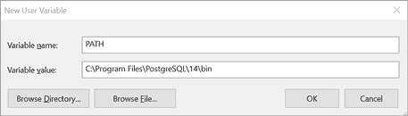
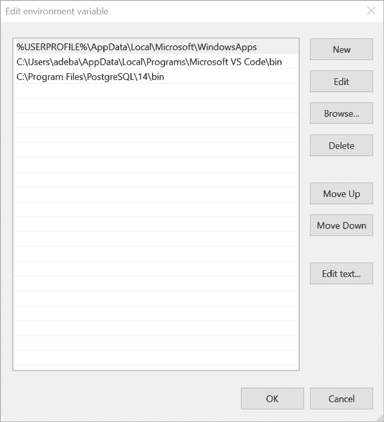
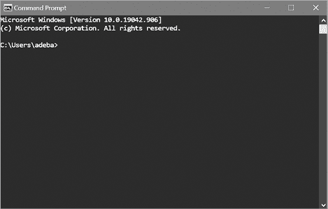
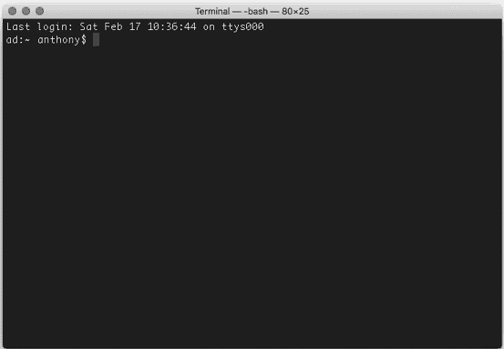

# 第十八章：从命令行使用 PostgreSQL


在本章中，您将学习如何从*命令行*操作 PostgreSQL，这是一个文本界面，您可以输入程序名称或其他命令来执行任务，例如编辑文件或列出文件目录的内容。

命令行——也称为*命令行界面*、*控制台*、*shell*或*终端*——在计算机拥有图形用户界面（GUI）之前就已存在，GUI 包含菜单、图标和按钮，供用户点击导航。在大学时代，要编辑文件，我必须在连接到 IBM 大型机的终端中输入命令。那种工作方式让人感觉神秘，仿佛获得了新的力量——事实上也确实如此！今天，即使在 GUI 世界中，熟悉命令行对于那些希望成为专家级技能的程序员至关重要。也许这就是为什么电影中想要表达角色真正了解如何操作计算机时，会展示他们输入神秘的、纯文本的命令。

当我们学习这个纯文本世界时，请注意掌握命令行工作而不是 GUI（如 pgAdmin）的这些优点：

+   您可以通过输入短命令而不是点击多层菜单项来提高工作效率。

+   您可以获得只有命令行才能提供的功能。

+   如果您只能使用命令行访问（例如连接到远程计算机时），您仍然可以完成工作。

我们将使用 `psql`，这是随 PostgreSQL 一起提供的命令行工具，允许您运行查询、管理数据库对象，并通过文本命令与计算机操作系统进行交互。您将学习如何设置和访问计算机的命令行，然后启动 `psql`。在此过程中，我们将涵盖一般命令行语法以及用于数据库任务的额外命令。耐心十分重要：即使是有经验的专家也经常需要查阅文档以回忆可用的命令行选项。

## 设置 psql 命令行

要开始，我们将访问操作系统上的命令行，并在需要时设置一个名为 `PATH` 的环境变量，该变量告诉系统在哪里找到 `psql`。*环境变量*保存指定系统或应用程序配置的参数，例如临时文件存储位置；它们还允许您启用或禁用选项。`PATH` 环境变量存储一个或多个包含可执行程序的目录名称，在这种情况下，它告诉命令行界面 `psql` 的位置，避免每次启动时输入其完整目录路径的麻烦。

### Windows psql 设置

在 Windows 上，您将在*命令提示符*中运行 `psql`，这是该系统提供的命令行界面应用程序。在执行此操作之前，我们需要告诉命令提示符在哪里找到*psql.exe*——Windows 上 `psql` 应用程序的完整名称。

#### 将 psql 和实用程序添加到 Windows PATH

以下步骤假设你按照第一章中的“Windows 安装”部分描述的说明安装了 PostgreSQL。（如果你是通过其他方式安装 PostgreSQL，可以使用 Windows 文件资源管理器搜索 C:驱动器，找到包含*psql.exe*的目录，并将以下步骤中的*C:\Program Files\PostgreSQL\*x*\bin*替换为你自己的路径。）

1.  通过点击 Windows 任务栏上的**搜索**图标，输入**控制面板**，然后点击**控制面板**图标，打开 Windows 控制面板。

1.  在控制面板应用中，在搜索框中输入**环境**。在显示的搜索结果列表中，点击**编辑系统环境变量**。系统属性对话框应该会出现。

1.  在系统属性对话框中，点击“高级”标签，然后点击**环境变量**。打开的对话框应该有两个部分：用户变量和系统变量。如果在用户变量部分没有看到`PATH`变量，请继续执行步骤 a 以创建一个新的。如果看到了现有的`PATH`变量，请继续执行步骤 b 以修改它。

    1.  如果在用户变量部分没有看到`PATH`，点击**新建**以打开一个新的用户变量对话框，如图 18-1 所示。

        图 18-1：在 Windows 10 中创建新的`PATH`环境变量

        在变量名框中，输入**PATH**。在变量值框中，输入**C:\Program Files\PostgreSQL\*****x*****\bin**，其中*x*是你使用的 PostgreSQL 版本。（你可以点击**浏览目录**，在“浏览文件夹”对话框中导航到该目录，而不是手动输入。）输入路径后，或者浏览到路径后，点击所有对话框中的**确定**以关闭它们。

    1.  如果在用户变量部分看到了现有的`PATH`变量，选中它并点击**编辑**。在显示的变量列表中，点击**新建**并输入**C:\Program Files\PostgreSQL\*****x*****\bin**，其中*x*是你使用的 PostgreSQL 版本。（你可以点击**浏览目录**，在“浏览文件夹”对话框中导航到该目录，而不是手动输入。）结果应类似于图 18-2 中的高亮部分。完成后，点击所有对话框中的**确定**以关闭它们。

现在，当你启动命令提示符时，`PATH`应该包含该目录。请注意，每次你修改`PATH`时，必须关闭并重新打开命令提示符，以使更改生效。接下来，让我们设置命令提示符。



图 18-2：在 Windows 10 中编辑现有的`PATH`环境变量

#### 启动并配置 Windows 命令提示符

命令提示符是一个名为*cmd.exe*的可执行文件。要启动它，请选择**开始**▶**Windows 系统**▶**命令提示符**或在搜索栏中输入**cmd**。当应用程序打开时，您应该看到一个具有黑色背景的窗口，显示版本和版权信息，以及显示您当前目录的提示符。在我的 Windows 10 系统中，命令提示符打开到默认用户目录，并显示`C:\Users\adeba>`，如图图 18-3 所示。

这一行被称为*提示符*，它显示当前的工作目录。对我来说，这是我的 C:驱动器，通常是 Windows 系统上的主硬盘，以及该驱动器上的`\Users\adeba`目录。大于号`>`表示您输入命令的区域。



图 18-3：我的 Windows 10 命令提示符

您可以通过点击命令提示符窗口栏左侧的图标并从菜单中选择**属性**来自定义字体和颜色以及访问其他设置。为了使命令提示符更适合查询输出，我建议将窗口大小（在布局选项卡上）设置为至少宽度为 80，高度为 25。对于字体，官方的 PostgreSQL 文档建议使用 Lucida Console 以正确显示所有字符。

#### 在 Windows 命令提示符上输入指令

现在您可以在命令提示符中输入指令了。在提示符处输入**help**，然后按键盘上的回车键，以查看可用的 Windows 系统命令列表。您可以通过在`help`后面包含其名称来查看有关命令的信息。例如，输入`help time`以显示关于使用`time`命令设置或查看系统时间的信息。

探索命令提示符的全部工作是一个超出本书范围的巨大主题；但是，我鼓励您尝试一些在表 18-1 中包含的有用且经常使用的命令，尽管这些命令实际上对本章的练习并不是必需的。

表 18-1：有用的 Windows 命令

| **命令** | **功能** | **示例** | **操作** |
| --- | --- | --- | --- |
| `cd` | 更改目录 | `cd C:\my-stuff` | 切换到 C:驱动器上的*my-stuff*目录 |
| `copy` | 复制文件 | `copy C:\my-stuff\song.mp3 C:\Music\song_favorite.mp3` | 将*song.mp3*文件从*my-stuff*复制到*Music*目录中并命名为*song_favorite.mp3* |
| `del` | 删除 | `del *.jpg` | 删除当前目录中所有扩展名为*.jpg*的文件（星号通配符） |
| `dir` | 列出目录内容 | `dir /p` | 按屏幕一次显示目录内容（使用`/p`选项） |
| `findstr` | 在文本文件中查找匹配正则表达式的字符串 | `findstr "peach" *.txt` | 在当前目录中所有*.txt*文件中搜索文本*peach* |
| `mkdir` | 创建新目录 | `makedir C:\my-stuff\Salad` | 在*my-stuff*目录中创建一个*Salad*目录 |
| `move` | 移动文件 | `move C:\my-stuff\song.mp3 C:\Music\` | 将文件 *song.mp3* 移动到 *C:\Music* 目录 |

在打开并配置好命令提示符后，你就可以开始操作了。可以跳到“使用 psql”这一部分。

### macOS psql 配置

在 macOS 上，你将在终端中运行 `psql`，终端是一个通过几种 *shell* 程序（如 `bash` 或 `zsh`）访问系统命令行的应用程序。Unix 或 Linux 系统上的 shell 程序，包括 macOS，不仅提供了用户输入指令的命令提示符，还提供了自己的编程语言用于自动化任务。例如，你可以使用 `bash` 命令编写程序，登录到远程计算机、传输文件并登出。

如果你按照第一章中的 Postgres.app macOS 安装说明进行设置——包括在终端中运行命令——你不需要额外的配置来使用 `psql` 及相关命令。接下来，我们将继续启动终端。

#### 启动和配置 macOS 终端

通过导航至 **应用程序**▶**实用工具**▶**终端**来启动终端。打开后，你应该能看到一个窗口，显示上次登录的日期和时间，随后是一个提示符，包含你的计算机名、当前工作目录和用户名。在我的 Mac 上，它设置为 `bash` shell，提示符显示为 `ad:~ anthony$`，并以美元符号（`$`）结束，如图 18-4 所示。

波浪号（`~`）代表系统的主目录，即 `/Users/anthony`。终端不会显示完整的目录路径，但你可以随时通过输入 `pwd` 命令（代表 *print working directory*）并按下回车键来查看这些信息。美元符号后面的区域就是你输入命令的地方。

如果你的 Mac 设置了其他的 shell，比如 `zsh`，你的提示符可能看起来有所不同。例如，使用 `zsh` 时，提示符以百分号结束。你使用的具体 shell 对于这些练习来说没有影响。



图 18-4：macOS 终端命令行

如果你从未使用过终端，它默认的黑白色调可能看起来有些单调。你可以通过选择**终端**▶**偏好设置**来更改字体、颜色和其他设置。为了让终端界面更大，更适合显示查询输出，我建议将窗口大小（在配置文件下的窗口标签页中）设置为至少 80 列宽和 25 行高。我的首选字体（在文本标签页中）是 Monaco 14，但可以尝试不同的字体，找到你喜欢的。

探索终端及相关命令的完整功能是一个庞大的话题，超出了本书的范围，但还是建议你花些时间尝试几个命令。表 18-2 列出了一些常用且实用的命令，这些命令实际上并不是本章练习所必需的。输入`man`（即*manual*的缩写）后跟命令名称，即可获得该命令的帮助。例如，使用`man ls`可以了解如何使用`ls`命令列出目录内容。

表 18-2：实用终端命令

| **命令** | **功能** | **示例** | **操作** |
| --- | --- | --- | --- |
| `cd` | 切换目录 | `cd /Users/pparker/my-stuff/`  | 切换到*my-stuff*目录 |
| `cp` | 复制文件 | `cp song.mp3 song_backup.mp3` | 将文件*song.mp3*复制为*song_backup.mp3*，并保存在当前目录 |
| `grep` | 查找匹配正则表达式的文本字符串 | `grep 'us_counties_2010' *.sql` | 查找所有扩展名为*.sql*的文件中包含*us_counties_2010*文本的行 |
| `ls` | 列出目录内容 | `ls -al` | 以“长格式”列出所有文件和目录（包括隐藏文件） |
| `mkdir` | 创建一个新目录 | `mkdir resumes` | 在当前工作目录下创建一个名为*resumes*的目录 |
| `mv` | 移动文件 | `mv song.mp3 /Users/pparker/songs` | 将文件*song.mp3*从当前目录移动到用户目录下的*/songs*目录 |
| `rm` | 删除文件 | `rm *.jpg` | 删除当前目录下所有扩展名为*.jpg*的文件（使用星号通配符） |

打开并配置好终端后，你已经准备好开始了。直接跳到“使用 psql”部分。

### Linux psql 设置

回顾第一章中的“Linux 安装”部分，安装 PostgreSQL 的方法因 Linux 发行版不同而有所差异。尽管如此，`psql`是标准 PostgreSQL 安装的一部分，你可能已经通过你的发行版命令行终端应用程序在安装过程中运行过`psql`命令。即使没有，标准的 Linux PostgreSQL 安装会自动将`psql`添加到`PATH`中，因此你应该能够访问它。

启动终端应用程序并继续下一部分，“使用 psql”。在某些发行版（如 Ubuntu）中，你可以通过按 ctrl-alt-T 打开终端。另外，请注意，表 18-2 中的 Mac 终端命令同样适用于 Linux，并可能对你有所帮助。

## 使用 psql

现在，你已经识别出命令行界面并设置好路径来识别`psql`，接下来我们启动`psql`并连接到本地安装的 PostgreSQL 数据库。然后，我们将探索执行查询和用于检索数据库信息的特殊命令。

### 启动 psql 并连接到数据库

无论您使用的操作系统是什么，启动 `psql` 的方式都是相同的。打开您的命令行界面（在 Windows 上是命令提示符，在 macOS 或 Linux 上是终端）。要启动 `psql` 并连接到数据库，您可以在命令提示符中使用以下模式：

```
psql -d `database_name` -U `user_name`
```

在 `psql` 应用程序名称后，我们通过 `-d` 数据库参数指定数据库名称，通过 `-U` 用户名参数指定用户名。

对于数据库名称，我们将使用 `analysis`，这是我们为本书练习创建表格和其他对象的地方。对于用户名，我们将使用 `postgres`，这是安装过程中创建的默认用户。因此，要连接到本地服务器上的 `analysis` 数据库，在命令行中输入以下内容：

```
psql -d analysis -U postgres
```

请注意，您可以通过指定 `–h` 参数后跟主机名来连接到远程服务器上的数据库。例如，如果您要连接到名为 `analysis` 的数据库，且该数据库位于名为 `example.com` 的服务器上，可以使用以下命令：

```
psql -d analysis -U postgres -h example.com
```

无论如何，如果您在安装过程中设置了密码，在启动 `psql` 时应该会看到密码提示。如果是这样，请输入您的密码。连接到数据库后，您应该会看到类似下面的提示符：

```
psql (13.3)
Type "help" for help.

analysis=#
```

在这里，第一行列出了 `psql` 的版本号以及您连接的服务器。您的版本会根据您安装 PostgreSQL 的时间有所不同。您将输入命令的提示符是 `analysis=#`，它表示数据库的名称，后面跟着等号（`=`）和井号（`#`）。井号表示您以 *超级用户* 权限登录，超级用户权限允许您无限制地访问和创建对象，并设置账户和安全性。如果您以非超级用户身份登录，提示符的最后一个字符将是大于号（`>`）。如您所见，您登录的用户账户（`postgres`）是超级用户。

最后，在 Windows 系统上，启动 `psql` 后，可能会看到一条警告消息，提示控制台代码页与 Windows 代码页不同。这与命令提示符与 Windows 系统其余部分之间的字符集不匹配有关。对于本书中的练习，您可以安全地忽略该警告。如果您愿意，您可以在每次会话启动前通过在 Windows 命令提示符中输入命令 `cmd.exe /c chcp 1252` 来消除该警告。

#### 获取帮助或退出

在 `psql` 提示符下，您可以通过一组 *元命令* 获取 `psql` 和通用 SQL 的帮助，详细内容见 表 18-3。元命令以反斜杠（`\`）开头，除了提供帮助之外，还可以提供有关数据库的信息、调整设置或处理数据。

表 18-3：`psql` 内的帮助命令

| **命令** | **显示内容** |
| --- | --- |
| `\?` | `psql` 中可用的命令，例如 `\dt` 用于列出表格。 |
| `\? options` | `psql` 命令的选项，例如 `-U` 用于指定用户名。 |
| `\? variables` | 用于 `psql` 的变量，例如当前 `psql` 版本的 `VERSION`。 |
| `\h` | SQL 命令列表。添加命令名称以查看详细帮助（例如，` \h INSERT`）。 |

即使是经验丰富的用户，通常也需要刷新命令和选项，因此在 `psql` 应用程序中查看详细信息非常方便。要退出 `psql`，请使用元命令 `\q`（用于 *quit*）。

#### 更改数据库连接

在使用 SQL 时，通常需要处理多个数据库，因此您需要一种在数据库之间切换的方法。您可以在 `psql` 提示符下使用 `\c` 元命令轻松完成此操作。

例如，在连接到您的 `analysis` 数据库时，在 `psql` 提示符下输入以下命令以创建名为 `test` 的数据库：

```
analysis=# **CREATE DATABASE test;**
```

然后，要连接到您刚刚创建的 `test` 数据库，在 `psql` 提示符下输入 `\c`，后跟数据库名称（如果提示，提供您的 PostgreSQL 密码）：

```
analysis=# **\c test**
```

应用程序应以以下消息作出响应：

```
You are now connected to database "test" as user "postgres".
test=#
```

提示符将显示您当前连接的数据库。要以不同的用户身份登录——例如，使用 macOS 安装创建的用户名——您可以在数据库名称后添加该用户名。在我的 Mac 上，语法如下所示：

```
analysis-# **\c test anthony**
```

响应将如下所示：

```
You are now connected to database "test" as user "anthony".
test=#
```

为了减少杂乱，您可以删除您创建的 `test` 数据库。首先，使用 `\c` 断开与 `test` 的连接，并连接到 `analysis` 数据库（只有在没有人连接到它时，我们才能删除数据库）。一旦连接到 `analysis`，在 `psql` 提示符下输入 `DROP DATABASE test;`。

#### 设置密码文件

如果您不希望在启动 `psql` 时看到密码提示，您可以设置一个文件来存储包含服务器名称、用户名和密码的数据库连接信息。启动时，`psql` 将读取该文件，并在文件中包含与数据库连接和用户名匹配的条目时跳过密码提示。

在 Windows 10 上，文件必须命名为 *pgpass.conf*，并且必须位于以下目录中：C:\Users\YourUsername*\AppData\Roaming\postgresql\*。您可能需要创建 `postgresql` 目录。在 macOS 和 Linux 上，文件必须命名为 *.pgpass*，并且必须位于您的用户主目录中。文档 [`www.postgresql.org/docs/current/libpq-pgpass.html`](https://www.postgresql.org/docs/current/libpq-pgpass.html) 中指出，在 macOS 和 Linux 上，创建文件后，您可能需要通过在命令行运行 `chmod 0600 ~/.pgpass` 来设置文件权限。

使用文本编辑器创建文件，并保存为适合您系统的正确名称和位置。在文件中，您需要为每个数据库连接添加一行，格式如下：

```
`hostname`:`port`:`database`:`username`:`password`
```

例如，要为 `analysis` 数据库和 `postgres` 用户名设置连接，请输入此行，并替换您的密码：

```
localhost:5432:analysis:postgres:`password`
```

你可以在前四个参数中的任何一个位置用星号替代，作为通配符。例如，为了为任何本地数据库提供密码，使用 `postgres` 用户名时，可以用星号代替数据库名称：

```
localhost:5432:*:postgres:`password`
```

保存你的密码可以减少一些输入，但要注意遵循安全最佳实践。始终使用强密码和/或物理安全密钥保护你的电脑，并且不要在任何公共或共享的系统上创建密码文件。

### 在 psql 中运行 SQL 查询

我们已经配置了 `psql` 并连接到了数据库，现在让我们运行一些 SQL 查询。我们将从单行查询开始，然后运行多行查询。

你可以直接在 `psql` 提示符下输入 SQL。例如，为了查看我们在整本书中使用的 2019 年人口普查表的几行数据，可以在提示符下输入查询，如列表 18-1 所示。

```
analysis=# **SELECT county_name FROM us_counties_pop_est_2019 ORDER BY county_name LIMIT 3;**
```

列表 18-1：在 `psql` 中输入单行查询

按下回车键执行查询，`psql` 应该会在终端中显示包括返回行数在内的以下结果：

```
 county_name
------------------
 Abbeville County
 Acadia Parish
 Accomack County
(3 rows)

analysis=#
```

在结果下方，你可以看到 `analysis=#` 提示符再次出现，准备接受进一步的输入。你可以使用键盘上的上下箭头来滚动查看最近的查询，并按回车键重新执行它们，这样就无需重新输入。

#### 输入多行查询

你并不局限于单行查询。如果你的查询跨越多行，你可以一次输入一行，每输入一行按下回车键，`psql` 会知道直到你提供分号后才执行查询。让我们在列表 18-1 中的查询基础上重新输入，分成多行展示在列表 18-2 中。

```
analysis=# SELECT county_name
analysis-# FROM us_counties_pop_est_2019
analysis-# ORDER BY county_name
analysis-# LIMIT 3;
```

列表 18-2：在 `psql` 中输入多行查询

注意，当你的查询超过一行时，数据库名称和井号之间的符号会从等号变为连字符。这个多行查询只有在你按下最后一行并以分号结尾后才会执行。

#### 在 psql 提示符中检查是否有开放的括号

`psql` 的另一个有用功能是，当你没有关闭一对括号时，它会提醒你。列表 18-3 展示了这一功能。

```
analysis=# CREATE TABLE wineries (
analysis(# id bigint,
analysis(# winery_name text
analysis(# );
CREATE TABLE
```

列表 18-3：在 `psql` 提示符中显示开放的括号

在这里，你创建了一个简单的表 `wineries`，它有两列。在输入 `CREATE TABLE` 语句的第一行和左括号（`(`）后，提示符会从 `analysis=#` 变为 `analysis(#`，以包括一个左括号。这提醒你左括号需要配对关闭。提示符会保持这种配置，直到你添加右括号为止。

#### 编辑查询

要修改你在 `psql` 中执行的最新查询，可以使用 `\e` 或 `\edit` 元命令进行编辑。输入 `\e` 打开最后执行的查询，在文本编辑器中进行修改。`psql` 默认使用的编辑器取决于你的操作系统。

在 Windows 上，`psql`将打开记事本，这是一个简单的图形界面文本编辑器。编辑查询后，通过选择**文件**▶**保存**保存文件，然后使用**文件**▶**退出**退出记事本。当记事本关闭时，`psql`应该会执行你修改过的查询。

在 macOS 和 Linux 上，`psql`使用一个名为`vim`的命令行应用程序，这是程序员们最喜欢的工具之一，但对于初学者来说可能显得难以理解。可以查看一个有用的`vim`备忘单，地址是[`vim.rtorr.com/`](https://vim.rtorr.com/)。目前，你可以按照以下步骤进行简单的编辑：

1.  当`vim`在终端中打开查询时，按 I 激活插入模式。

1.  对查询进行编辑。

1.  按 esc 键，然后按 SHIFT-:，在`vim`屏幕左下角显示冒号命令提示符，这是你输入命令以控制`vim`的地方。

1.  输入`wq`（表示*写入*，*退出*），然后按回车键保存更改。

现在，当`vim`退出时，`psql`提示符应该会执行你修改过的查询。按上箭头键可以查看修改后的文本。

### 导航和格式化结果

你在列表 18-1 和 18-2 中运行的查询只返回了一列和几行，因此它的输出很容易适应命令行界面。但对于返回更多列或更多行的查询，输出可能会填满多个屏幕，使得浏览变得困难。幸运的是，你可以使用`\pset`元命令通过几种方式自定义输出的显示样式。

#### 设置结果的分页

调整输出格式的一种方法是指定`psql`如何处理长查询结果的滚动，这被称为*分页*。默认情况下，如果查询结果的行数超过屏幕所能显示的行数，`psql`会显示第一屏的行，然后让你滚动查看剩余的内容。例如，列表 18-4 显示了当我们从列表 18-1 中的查询中移除`LIMIT`子句时，在`psql`提示符下发生的情况。

```
analysis=# **SELECT county_name FROM us_counties_pop_est_2019 ORDER BY county_name;**

            county_name
-----------------------------------
 Abbeville County
 Acadia Parish
 Accomack County
 Ada County
 Adair County
 Adair County
 Adair County
 Adair County
 Adams County
 Adams County
 Adams County
 Adams County
-- More --
```

列表 18-4：带有滚动结果的查询

请记住，这张表有 3,142 行。列表 18-4 仅显示当前屏幕上的前 12 行（可见行数取决于你的终端配置）。在 Windows 上，指示符`-- More --`表示有更多结果，按回车键可以滚动查看它们。在 macOS 和 Linux 上，指示符将是一个冒号。滚动浏览几千行会需要一些时间。按 q 退出结果并返回到`psql`提示符。

要绕过手动滚动并立即显示所有结果，你可以通过`\pset pager`元命令更改`pager`设置。在`psql`提示符下运行该命令，它应该返回消息`Pager usage is off`。现在，当你在列表 18-3 中重新运行查询并关闭`pager`设置时，你应该能看到类似这样的结果：

```
 `--snip--`
 York County
 York County
 York County
 York County
 Young County
 Yuba County
 Yukon-Koyukuk Census Area
 Yuma County
 Yuma County
 Zapata County
 Zavala County
 Ziebach County
(3142 rows)

analysis=#
```

你会立即跳到结果的末尾，而无需滚动。要重新开启分页，再次运行`\pset pager`命令。

#### 格式化结果网格

你还可以使用`\pset`结合以下选项来格式化结果：

**边框 int**

1.  使用此选项指定结果网格是否没有边框（`0`）、是否有内部行分隔列（`1`）或是否在所有单元格周围有线条（`2`）。例如，`\pset border 2`会在所有单元格周围设置线条。

**格式未对齐**

1.  使用选项`\pset format unaligned`可以让结果按分隔符分隔的行来显示，而不是按列显示，这类似于 CSV 文件的显示方式。分隔符默认为管道符号（`|`）。你可以使用`fieldsep`命令设置不同的分隔符。例如，要设置逗号作为分隔符，可以运行`\pset fieldsep ','`。要恢复为列视图，可以运行`\pset format aligned`。你可以使用`psql`元命令`\a`在对齐和非对齐视图之间切换。

**页脚**

1.  使用此选项切换结果页脚的显示与隐藏，页脚会显示结果的行数。

**null**

1.  使用此选项设置`psql`如何显示`NULL`值。默认情况下，它们会显示为空白。你可以运行`\pset null '(null)'`，当列值为`NULL`时，空白将被替换为`(null)`。

你可以在 PostgreSQL 文档中探索更多选项，网址为[`www.postgresql.org/docs/current/app-psql.html`](https://www.postgresql.org/docs/current/app-psql.html)。此外，你可以在 macOS 或 Linux 上设置*.psqlrc*文件，或在 Windows 上设置*psqlrc.conf*文件，来保存你的配置偏好，并在每次`psql`启动时加载它们。一个很好的示例可以参考[`www.citusdata.com/blog/2017/07/16/customizing-my-postgres-shell-using-psqlrc/`](https://www.citusdata.com/blog/2017/07/16/customizing-my-postgres-shell-using-psqlrc/)。

#### 查看扩展结果

有时候，将结果以垂直列表的方式显示比传统的行列式表格显示更为有用，尤其当列的数量太多，无法在屏幕上以常规的水平网格显示时，或者你需要逐行扫描列中的值时。在`psql`中，你可以使用`\x`（表示*扩展*）元命令切换到垂直列表视图。理解正常显示和扩展视图之间的差异的最好方法是查看一个示例。Listing 18-5 显示的是你在第十七章中查询`grades`表时看到的正常显示。

```
analysis=# SELECT * FROM grades ORDER BY student_id, course_id;
 student_id | course_id |      course       | grade
------------+-----------+-------------------+-------
          1 |         1 | Biology 2         | C
          1 |         2 | English 11B       | D
          1 |         3 | World History 11B | C
          1 |         4 | Trig 2            | B
(4 rows)
```

Listing 18-5: `grades`表查询的正常显示

要切换到扩展视图，在`psql`提示符下输入`\x`，此时应显示消息`Expanded display is on`。然后，当你再次运行相同的查询时，你应该能看到扩展后的结果，如 Listing 18-6 所示。

```
analysis=# SELECT * FROM grades ORDER BY student_id, course_id;
-[ RECORD 1 ]-----------------
student_id | 1
course_id  | 1
course     | Biology 2
grade      | C
-[ RECORD 2 ]-----------------
student_id | 1
course_id  | 2
course     | English 11B
grade      | D
-[ RECORD 3 ]-----------------
student_id | 1
course_id  | 3
course     | World History 11B
grade      | C
-[ RECORD 4 ]-----------------
student_id | 1
course_id  | 4
course     | Trig 2
grade      | B
```

Listing 18-6: `grades`表查询的扩展显示

结果以垂直块的形式显示，每个块之间用记录号分隔。根据你的需求和处理的数据类型，这种格式可能更容易阅读。你可以通过在`psql`提示符下再次输入`\x`来恢复列显示。另外，设置`\x auto`会根据输出的大小自动让 PostgreSQL 选择以表格或扩展视图显示结果。

接下来，让我们探讨如何使用`psql`来挖掘数据库信息。

### 数据库信息的元命令

你可以通过一组特定的元命令，让`psql`显示有关数据库、表格和其他对象的详细信息。为了演示这些命令的使用，我们将探索一个显示数据库中表格的元命令，包括如何在命令后添加加号（`+`）来扩展输出，以及如何添加一个可选的模式来过滤输出。

要查看表格列表，你可以在`psql`提示符下输入`\dt`。以下是我系统上输出的一个片段：

```` ```  List of relations   Schema |                  Name                  | Type  |   Owner  --------+----------------------------------------+-------+-----------   public | acs_2014_2018_stats                    | table | anthony   public | cbp_naics_72_establishments            | table | anthony   public | char_data_types                        | table | anthony   public | check_constraint_example               | table | anthony   public | crime_reports                          | table | anthony   `--snip--` ```    This result lists all tables in the current database alphabetically.    You can filter the output by adding a pattern the database object name must match. For example, use `\dt us*` to show only tables whose names begin with `us` (the asterisk acts as a wildcard). The results should look like this:    ```  List of relations   Schema |           Name           | Type  |   Owner  --------+--------------------------+-------+-----------   public | us_counties_2019_shp     | table | anthony   public | us_counties_2019_top10   | table | anthony   public | us_counties_pop_est_2010 | table | anthony   public | us_counties_pop_est_2019 | table | anthony   public | us_exports               | table | anthony ```    Table 18-4 shows several additional commands you might find helpful, including `\l`, which lists the databases on your server. Adding a plus sign to each command, as in `\dt+`, adds more information to the output, including object sizes.      Table 18-4: Example of `psql` `\d` Commands       | **Command** | **Displays** | | --- | --- | | `\d [pattern]` | Columns, data types, plus other information on objects | | `\di [pattern]` | Indexes and their associated tables | | `\dt [pattern]` | Tables and the account that owns them | | `\du [pattern]` | User accounts and their attributes | | `\dv [pattern]` | Views and the account that owns them | | `\dx [pattern]` | Installed extensions | | `\l [pattern]` | Databases |    The entire list of commands is available in the PostgreSQL documentation at [`www.postgresql.org/docs/current/app-psql.html`](https://www.postgresql.org/docs/current/app-psql.html), or you can see details by using the `\?` command noted earlier.    ### Importing, Exporting, and Using Files    In this section, we’ll explore how to use `psql` to import and export data from the command line, which can be necessary when you’re connected to remote servers, such as Amazon Web Services instances of PostgreSQL. We’ll also use `psql` to read and execute SQL commands stored in a file and learn the syntax for sending `psql` output to a file.    #### Using \copy for Import and Export    In Chapter 5, you learned how to use the PostgreSQL `COPY` command to import and export data. It’s a straightforward process, but it has one significant limitation: the file you’re importing or exporting must be on the same machine as the PostgreSQL server. That’s fine if you’re working on your local machine, as you’ve been doing with these exercises. But if you’re connecting to a database on a remote computer, you might not have access to its file system. You can get around this restriction by using the `\copy` meta-command in `psql`.    The `\copy` meta-command works just like the PostgreSQL `COPY`, except when you execute it at the `psql` prompt, it will route data from your machine to the server you’re connected to, whether local or remote. We won’t actually connect to a remote server to try this since it’s rare to find a public remote server we could connect to, but you can still learn the syntax by using the commands on our local `analysis` database.    In Listing 18-7, at the `psql` prompt we use a `DELETE` statement to remove all the rows from the small `state_regions` table you created in Chapter 10 and then import data using `\copy`. You’ll need to change the file path to match the location of the file on your computer.    ``` analysis=# DELETE FROM state_regions;  DELETE 56  analysis=# \copy state_regions FROM '`C:\YourDirectory\`state_regions.csv' WITH (FORMAT CSV, HEADER);  COPY 56 ```    Listing 18-7: Importing data using `\copy`    Next, to import the data, we use `\copy` with the same syntax used with PostgreSQL `COPY`, including a `FROM` clause with the file path on your machine, and a `WITH` clause that specifies the file is a CSV and has a header row. When you execute the statement, the server should respond with `COPY 56`, letting you know the rows have been successfully imported.    If you’re connected to a remote server via `psql`, you would use the same `\copy` syntax, and the command would route your local file to the remote server for importing. In this example, we used `\copy FROM` to import a file. We could also use `\copy TO` for exporting. Let’s look at an alternate way to import or export data (or run other SQL commands) via `psql`.    #### Passing SQL Commands to psql    By placing a command in quotes after the `-c` argument, we can send it to our connected server, local or remote. The command can be a single SQL statement, multiple SQL statements separated by semicolons, or a meta-command. This can allow us to run `psql`, connect to a server, and execute a command in a single command line statement—handy if we want to incorporate `psql` statements into shell scripts to automate tasks.    For example, we can import data to the `state_regions` table with the statement in Listing 18-8, which must be entered on one line at your command prompt (and not inside `psql`).    ``` psql -d analysis -U postgres -c1 'COPY state_regions FROM STDIN2 WITH (FORMAT CSV, HEADER);' <3 `C:\YourDirectory\`state_regions.csv ```    Listing 18-8: Importing data using `psql` with `COPY`    To try it, you’ll need to first run `DELETE FROM state_regions;` inside `psql` to clear the table. Then exit `psql` by typing the meta-command `\q`.    At your command prompt, enter the statement in Listing 18-8. We first use `psql` and the `-d` and `-U` commands to connect to your `analysis` database. Then comes the `-c` command 1, which we follow with the PostgreSQL statement for importing the data. The statement is similar to `COPY` statements we’ve used with one exception: after `FROM`, we use the keyword `STDIN` 2 instead of the complete file path and filename. `STDIN` means “standard input,” which is a stream of input data that can come from a device, a keyboard, or in this case the file *state_regions.csv*, which we direct 3 to `psql` using the less-than (`<`) symbol. You’ll need to supply the full path to the file.    Running this entire command at your command prompt should import the CSV file and generate the message `COPY 56`.    #### Saving Query Output to a File    It’s sometimes helpful to save the query results and messages generated during a `psql` session to a file, such as to keep a history of your work or to use the output in a spreadsheet or other application. To send query output to a file, you can use the `\o` meta-command along with the full path and name of an output file that `psql` will create.    For example, in Listing 18-9 we change the `psql` format style from a table to CSV and then output query results directly to a file.    ``` 1 analysis=# \pset format csv  Output format is csv.    analysis=# SELECT * FROM grades ORDER BY student_id, course_id;  2 student_id,course_id,course,grade  1,1,Biology 2,F  1,2,English 11B,D  1,3,World History 11B,C  1,4,Trig 2,B    3 analysis=# \o '`C:/YourDirectory/`query_output.csv'    analysis=# SELECT * FROM grades ORDER BY student_id, course_id;  4 analysis=# ```    Listing 18-9: Saving query output to a file    First, we set the output format 1 using the meta-command `\pset format csv`. When you run a simple `SELECT` on the `grades` table, the output 2 should return as values separated by commas. Next, to send that data to a file the next time you run the query, use the `\o` meta-command and then provide a complete path to a file called `query_output.csv` 3. When you run the `SELECT` query again, there should be no output to the screen 4. Instead, you’ll find a file with the contents of the query in the directory specified at 3.    Note that every time you run a query from this point, the output is appended to the same file specified after the `\o` (for *output*) command. To stop saving output to that file, you can either specify a new file or enter `\o` with no filename to resume having results output to the screen.    #### Reading and Executing SQL Stored in a File    To run SQL stored in a text file, you execute `psql` on the command line and supply the filename after an `-f` (for file) argument. This syntax lets you quickly run a query or table update from the command line or in conjunction with a system scheduler to run a job at regular intervals.    Let’s say you saved the `SELECT` query from Listing 18-9 in a file called *display-grades.sql*. To run the saved query, use the following `psql` syntax at your command line:    ``` psql -d analysis -U postgres -f `C:\YourDirectory\`display-grades.sql ```    When you press enter, `psql` should launch, run the stored query in the file, display the results, and exit. For repetitive tasks, this workflow can save considerable time because you avoid launching pgAdmin or rewriting a query. You also can stack multiple queries in the file so they run in succession, which, for example, you might do if you want to run several updates on your database.    ## Additional Command Line Utilities to Expedite Tasks    PostgreSQL also has its own set of command line utilities that you can enter in your command line interface without launching `psql`. A listing is available at [`www.postgresql.org/docs/current/reference-client.html`](https://www.postgresql.org/docs/current/reference-client.html), and I’ll explain several in Chapter 19 that are specific to database maintenance. Here I’ll cover two that are particularly useful: creating a database at the command line with the `createdb` utility and loading shapefiles into a PostGIS database via the `shp2pgsql` utility.    ### Adding a Database with createdb    Earlier in the chapter, you used `CREATE DATABASE` to add the database `test` to your PostgreSQL server. We can achieve the same thing using `createdb` at the command line. For example, to create a new database on your server named `box_office`, run the following at your command line:    ``` createdb -U postgres -e box_office ```    The `-U` argument tells the command to connect to the PostgreSQL server using the `postgres` account. The `-e` argument (for *echo*) prints the commands generated by `createdb` as output. Running this command creates the database and prints output to the screen ending with `CREATE DATABASE box_office;`. You can then connect to the new database via `psql` using the following line:    ``` psql -d box_office -U postgres ```    The `createdb` command accepts arguments to connect to a remote server (just like `psql` does) and to set options for the new database. A full list of arguments is available at[`www.postgresql.org/docs/current/app-createdb.html`](https://www.postgresql.org/docs/current/app-createdb.html). Again, the `createdb` command is a time-saver that comes in handy when you don’t have access to a GUI.    ### Loading Shapefiles with shp2pgsql    In Chapter 15, you learned about shapefiles, which contain data describing spatial objects. On Windows and some Linux distributions, you can import shapefiles into a PostGIS-enabled database using the Shapefile Import/Export Manager GUI tool (generally) included with PostGIS. However, the Shapefile Import/Export Manager is not always included with PostGIS on macOS or some flavors of Linux. In those cases (or if you’d rather work at the command line), you can import a shapefile using the PostGIS command line tool `shp2pgsql`.    To import a shapefile into a new table from the command line, use the following syntax:    ``` shp2pgsql -I -s `SRID` -W `encoding shapefile_name` `table_name` | psql -d `database` -U `user` ```    A lot is happening in this single line. Here’s a breakdown of the arguments (if you skipped Chapter 15, you might need to review it now):    1.  `-I` Uses GiST to add an index on the new table’s geometry column. 2.  `-s` Lets you specify an SRID for the geometric data. 3.  `-W` Lets you specify encoding. (Recall that we used `Latin1` for census shapefiles.) 4.  `shapefile_name` The name (including full path) of the file ending with the *.shp* extension. 5.  `table_name` The name of the table the shapefile is imported to.    Following these arguments, you place a pipe symbol (`|`) to direct the output of `shp2pgsql` to `psql`, which has the arguments for naming the database and user. For example, to load the *tl_2019_us_county.shp* shapefile into a `us_counties_2019_shp` table in the `analysis` database, you can run the following command. Note that although this command wraps onto two lines here, it should be entered as one line in the command line:    ``` shp2pgsql -I -s 4269 -W Latin1 tl_2019_us_county.shp us_counties_2019_shp | psql -d analysis -U postgres ```    The server should respond with a number of SQL `INSERT` statements before creating the index and returning you to the command line. It might take some time to construct the entire set of arguments the first time around, but after you’ve done one, subsequent imports should take less time. You can simply substitute file and table names into the syntax you already wrote.    ## Wrapping Up    Feeling mysterious and powerful yet? Indeed, when you delve into a command line interface and make the computer do your bidding using text commands, you enter a world of computing that resembles a sci-fi movie sequence. Not only does working from the command line save you time, it also helps you overcome barriers you might hit when working in environments that don’t support graphical tools. In this chapter, you learned the basics of working with the command line plus PostgreSQL specifics. You discovered your operating system’s command line application and set it up to work with `psql`. Then you connected `psql` to a database and learned how to run SQL queries via the command line. Many experienced computer users prefer to use the command line for its simplicity and speed once they become familiar with using it. You might, too.    In Chapter 19, we’ll review common database maintenance tasks including backing up data, changing server settings, and managing the growth of your database. These tasks will give you more control over your working environment and help you better manage your data analysis projects. ````
