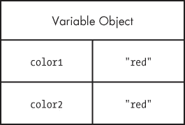
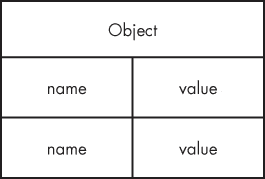
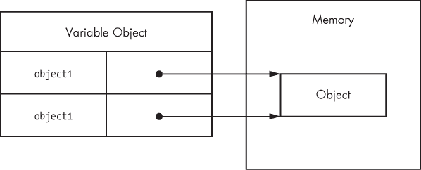

## 第一章 原始类型和引用类型

大多数开发者通过使用基于类的语言（如 Java 或 C#）来学习面向对象编程。当这些开发者开始学习 JavaScript 时，由于 JavaScript 并不正式支持类的概念，他们会感到迷茫。与其从一开始就定义类，在 JavaScript 中，你可以根据需要编写代码并创建数据结构。由于缺乏类，JavaScript 也没有像包这样的类分组。与 Java 中的语言不同，在 Java 中，包和类名定义了你使用的对象类型以及项目中文件和文件夹的布局，而 JavaScript 编程就像从一张白纸开始：你可以随意组织事物。有些开发者选择模仿其他语言的结构，而另一些开发者则利用 JavaScript 的灵活性创造出完全新的东西。对于不了解的人来说，这种自由选择可能会让人不知所措，但一旦适应了，你会发现 JavaScript 是一种极其灵活的语言，能够轻松适应你的偏好。

为了让开发者更容易从传统的面向对象语言过渡，JavaScript 将对象作为语言的核心部分。几乎所有的 JavaScript 数据要么是对象，要么通过对象访问。实际上，即使是函数（传统语言需要你费劲力气才能获得引用的东西）在 JavaScript 中也是作为对象来表示的，这使得它们成为*一等函数*。

理解和使用对象是理解 JavaScript 整体的关键。你可以随时创建对象，并根据需要添加或删除其属性。此外，JavaScript 对象具有极高的灵活性，拥有其他语言无法实现的独特功能和有趣的模式。

本章的重点是如何识别和处理两种主要的 JavaScript 数据类型：原始类型和引用类型。虽然它们都是通过对象访问的，但它们的行为方式不同，这一点很重要。

## 什么是类型？

尽管 JavaScript 没有类的概念，但它仍然使用两种*类型*：原始类型和引用类型。*原始类型*作为简单的数据类型存储。*引用类型*则作为对象存储，实际上只是指向内存位置的引用。

麻烦的是，JavaScript 允许你将原始类型当作引用类型来处理，以使语言对于开发者更加一致。

尽管其他编程语言通过将原始类型存储在栈上，而引用类型存储在堆上来区分原始类型和引用类型，JavaScript 完全没有这个概念：它通过 *变量对象* 来追踪特定作用域的变量。原始值直接存储在变量对象中，而引用值作为指针存储在变量对象中，指向内存中存储对象的位置。然而，正如本章后面会讨论的，尽管原始值和引用值最初看起来相同，但它们的行为实际上是截然不同的。

当然，原始类型和引用类型之间还有其他区别。

## 原始类型

原始类型表示简单的数据片段，这些数据按原样存储，例如 `true` 和 25。JavaScript 中有五种原始类型：

| **布尔值** | `true` 或 `false` |
| --- | --- |
| **数字** | 任意整数或浮点数值 |
| **字符串** | 由单引号或双引号限定的字符或字符序列（JavaScript 没有单独的字符类型） |
| **空值** | 只有一个值 `null` 的原始类型 |
| **未定义** | 只有一个值 `undefined` 的原始类型（`undefined` 是赋给未初始化变量的值） |

前三种类型（布尔值、数字和字符串）表现类似，而最后两种（空值和未定义）则有所不同，本章将进一步讨论。所有原始类型都有其值的字面量表示。*字面量* 表示未存储在变量中的值，例如硬编码的名称或价格。以下是每种类型使用其字面量形式的示例：

```
`// strings`
`var` name `=` `"Nicholas"`;
`var` selection `=` `"a"`;

`// numbers`
`var` count `=` `25`;
`var` cost `=` `1.51`;

`// boolean`
`var` found `=` `true`;

`// null`
`var` object `=` `null`;

`// undefined`
`var` flag `=` `undefined`;
`var` ref;    `// assigned undefined automatically`
```

在 JavaScript 中，和许多其他语言一样，持有原始值的变量直接包含原始值（而不是指向对象的指针）。当你将一个原始值赋给变量时，值会被复制到该变量中。这意味着，如果你将一个变量赋值给另一个变量，每个变量都会得到该数据的副本。例如：

```
`var` color1 `=` `"red"`;
`var` color2 `=` color1;
```

在这里，`color1` 被赋值为 `"red"`。然后，`color2` 被赋值为 `color1`，即将 `"red"` 存储在 `color2` 中。尽管 `color1` 和 `color2` 存储相同的值，它们却是完全独立的，你可以在不影响 `color2` 的情况下更改 `color1` 的值，反之亦然。这是因为每个变量有两个不同的存储位置。图 1-1 展示了这段代码的变量对象。

图 1-1. 变量对象

因为每个包含原始值的变量都有自己的存储空间，所以一个变量的变化不会影响到另一个变量。例如：

```
`var` color1 `=` `"red"`;
`var` color2 `=` color1;

console.log(color1);    `// "red"`
console.log(color2);    `// "red"`

color1 `=` `"blue"`;

console.log(color1);    `// "blue"`
console.log(color2);    `// "red"`
```

在这段代码中，`color1` 被更改为 `"blue"`，而 `color2` 保留其原始值 `"red"`。

### 识别原始类型

确定原始类型的最佳方法是使用 `typeof` 操作符，它可以作用于任何变量，并返回一个表示数据类型的字符串。`typeof` 操作符适用于字符串、数字、布尔值和 `undefined`。以下展示了使用 `typeof` 对不同原始值进行操作时的输出：

```
console.log(`typeof` `"Nicholas"`);     `// "string"`
console.log(`typeof` `10`);             `// "number"`
console.log(`typeof` `5.1`);            `// "number"`
console.log(`typeof` `true`);           `// "boolean"`
console.log(`typeof` `undefined`);      `// "undefined"`
```

正如你所预期的，当值为字符串时，`typeof` 返回 `"string"`；当值为数字时，返回 `"number"`（无论是整数还是浮点数）；当值为布尔值时，返回 `"boolean"`；当值为 `undefined` 时，返回 `"undefined"`。

难点在于 `null`。

你并不是第一个被这行代码的结果弄困惑的开发者：

```
console.log(`typeof` `null`);        `// "object"`
```

当你运行 `typeof null` 时，结果是 `"object"`。但为什么类型是 `null` 时返回的是对象呢？（事实上，这被 TC39（负责设计和维护 JavaScript 的委员会）视为一个错误。你可以推测 `null` 是一个空对象指针，因此 `"object"` 是一个合乎逻辑的返回值，但这仍然令人困惑。）

确定一个值是否为 `null` 的最佳方法是直接将其与 `null` 进行比较，如下所示：

```
console.log(value `===` `null`);        `// true or false`
```

无强制转换的比较

注意，这段代码使用了三等号操作符（`===`）而不是双等号操作符。原因是三等号在进行比较时不会强制转换变量类型。为了理解为什么这很重要，考虑以下几点：

```
console.log(`"5"` `==` `5`);              `// true`
console.log(`"5"` `===` `5`);             `// false`

console.log(`undefined` `==` `null`);     `// true`
console.log(`undefined` `===` `null`);    `// false`
```

当你使用双等号时，字符串 `"5"` 和数字 `5` 被认为是相等的，因为双等号在比较前会将字符串转换为数字。三等号操作符不会认为这两个值相等，因为它们是两种不同的类型。同样，当你比较 `undefined` 和 `null` 时，双等号会认为它们是等价的，而三等号则认为它们不相等。当你试图识别 `null` 时，使用三等号以便能够正确识别类型。

### 原始方法

尽管它们是原始类型，字符串、数字和布尔值实际上都有方法。（`null` 和 `undefined` 类型没有方法。）特别是字符串，拥有许多方法来帮助你处理它们。例如：

```
`var` name `=` `"Nicholas"`;
`var` lowercaseName `=` name.toLowerCase();     `// convert to lowercase`
`var` firstLetter `=` name.charAt(`0`);           `// get first character`
`var` middleOfName `=` name.substring(`2`, `5`);    `// get characters 2-4`

`var` count `=` `10`;
`var` fixedCount `=` count.toFixed(`2`);          `// convert to "10.00"`
`var` hexCount `=` count.toString(`16`);          `// convert to "a"`

`var` flag `=` `true`;
`var` stringFlag `=` flag.toString();           `// convert to "true"`
```

### 注意

*尽管原始值本身具有方法，但它们并不是对象。JavaScript 让它们看起来像对象，以提供一致的语言体验，正如你将在本章后面看到的那样。*

## 引用类型

引用类型表示 JavaScript 中的对象，是语言中最接近类的存在。引用值是引用类型的*实例*，并且与对象同义（本章后面将引用值简单地称为*对象*）。一个对象是一个无序的*属性*列表，属性由名称（始终是字符串）和值组成。当属性的值是函数时，它被称为*方法*。函数本身实际上是 JavaScript 中的引用值，因此包含数组的属性与包含函数的属性几乎没有区别，除了函数可以被执行。

当然，你必须在开始使用对象之前创建它们。

### 创建对象

有时，将 JavaScript 对象看作只是哈希表会有所帮助，如图 1-2 所示。

图 1-2. 对象的结构

创建或*实例化*对象有几种方式。第一种是使用`new`运算符与*构造函数*。 （构造函数就是使用`new`来创建对象的函数——任何函数都可以是构造函数。）按照约定，JavaScript 中的构造函数以大写字母开头，以便与非构造函数区分开来。例如，这段代码实例化了一个通用对象并将引用存储在`object`中：

```
`var` object `=` `new` `Object`();
```

引用类型并不会将对象直接存储到被赋值的变量中，因此在这个例子中，`object`变量实际上并不包含对象实例。相反，它保存的是一个指针（或引用），指向内存中对象所在的位置。这是对象与原始值之间的主要区别，因为原始值是直接存储在变量中的。

当你将一个对象赋值给一个变量时，实际上你是在赋值一个指针。这意味着如果你将一个变量赋值给另一个变量，每个变量都会得到指针的副本，且两者仍然引用内存中同一个对象。例如：

```
`var` object1 `=` `new` `Object`();
`var` object2 `=` object1;
```

这段代码首先创建了一个对象（使用`new`）并将引用存储在`object1`中。接着，`object2`被赋值为`object1`的值。仍然只有在第一行创建的那一个对象实例，但现在两个变量都指向该对象，如图 1-3 所示。

图 1-3. 两个变量指向一个对象

### 解引用对象

JavaScript 是一个垃圾回收语言，因此在使用引用类型时，你实际上不需要担心内存分配。然而，最好是*解除引用*不再需要的对象，这样垃圾回收器才能释放内存。实现这一点的最佳方式是将对象变量设置为`null`。

```
`var` object1 `=` `new` `Object`();

`// do something`

object1 `=` `null`;     `// dereference`
```

在这里，`object1`在使用前被创建，并最终被设为`null`。当内存中不再有对某个对象的引用时，垃圾回收器可以将这部分内存用于其他用途。（在使用数百万个对象的大型应用程序中，解除引用对象尤为重要。）

### 添加或删除属性

JavaScript 中另一个有趣的方面是，你可以随时添加和删除属性。例如：

```
`var` object1 `=` `new` `Object`();
`var` object2 `=` object1;

object1.myCustomProperty `=` `"Awesome!"`;
console.log(object2.myCustomProperty);      `// "Awesome!"`
```

在这里，`myCustomProperty`被添加到`object1`，其值为`"Awesome!"`。由于`object1`和`object2`指向同一个对象，所以该属性也可以通过`object2`访问。

### 注意

*这个示例展示了 JavaScript 一个特别独特的方面：你可以随时修改对象，即使你一开始没有定义它们。而且，后面你将学习到一些方法可以防止这种修改。*

除了通用的对象引用类型，JavaScript 还提供了几种其他内建类型供你使用。

## 实例化内建类型

你已经了解了如何创建并操作通过`new Object()`创建的通用对象。`Object`类型只是 JavaScript 提供的众多内建引用类型之一。其他内建类型在用途上更为专用，可以随时实例化。

内建类型包括：

| **`Array`** | 一个按数字索引排序的值的列表 |
| --- | --- |
| **`Date`** | 一个日期和时间 |
| **`Error`** | 一个运行时错误（还有几个更具体的错误子类型） |
| **`Function`** | 一个函数 |
| **`Object`** | 一个通用对象 |
| **`RegExp`** | 一个正则表达式 |

你可以使用`new`实例化每个内建的引用类型，如下所示：

```
`var` items `=` `new` `Array`();
`var` now `=` `new` `Date`();
`var` error `=` `new` `Error`(`"Something bad happened."`);
`var` func `=` `new` `Function`(`"console.log('Hi');"`);
`var` object `=` `new` `Object`();
`var` re `=` `new` `RegExp`(`"\\d+"`);
```

### 字面量形式

一些内建的引用类型具有字面量形式。*字面量*是一种语法，允许你定义一个引用值，而不需要显式地使用`new`运算符和对象的构造函数创建对象。（在本章前面，你已经看到了一些原始字面量的例子，包括字符串字面量、数字字面量、布尔字面量、`null`字面量和`undefined`字面量。）

### 对象和数组字面量

要使用*对象字面量*语法创建对象，你可以在大括号内定义新对象的属性。属性由标识符或字符串、冒号和值组成，多个属性之间用逗号分隔。例如：

```
`var` book `=` {
    name: `"The Principles of Object-Oriented JavaScript"`,
    year: `2014`
};
```

你还可以使用字符串字面量作为属性名，这在你希望属性名包含空格或其他特殊字符时非常有用：

```
`var` book `=` {
    `"name"``:` `"The Principles of Object-Oriented JavaScript"`,
    `"year"``:` `2014`
};
```

尽管语法不同，但这个示例与前一个示例是等价的。两个示例在逻辑上也等价于以下内容：

```
`var` book `=` `new` `Object`();
book.name `=` `"The Principles of Object-Oriented JavaScript"`;
book.year `=` `2014`;
```

之前三个示例的结果是相同的：一个具有两个属性的对象。选择哪种模式由你决定，因为功能本质上是相同的。

### 注意

*使用对象字面量实际上并不会调用 new Object()。相反，JavaScript 引擎会按照使用 new Object() 时的步骤进行处理，但并不实际调用构造函数。这对所有引用类型字面量都适用。*

你可以通过将任意数量的用逗号分隔的值包含在方括号中来定义一个*数组字面量*。例如：

```
`var` colors `=` [ `"red"`, `"blue"`, `"green"` ];
console.log(colors[`0`]);     `// "red"`
```

这段代码等价于以下代码：

```
`var` colors `=` `new` `Array`(`"red"`, `"blue"`, `"green"`)
console.log(colors[`0`]);     `// "red"`
```

### 函数字面量

你几乎总是使用字面量形式来定义函数。事实上，通常不推荐使用 `Function` 构造函数，因为与实际代码相比，维护、阅读和调试字符串代码会更具挑战性，因此你很少会在代码中看到它。

使用字面量形式创建函数更加简单且不容易出错。例如：

```
`function` reflect(value) {
    `return` value;
}

`// is the same as`

`var` reflect `=` `new` `Function`(`"value"`, `"return value;"`);
```

这段代码定义了 `reflect()` 函数，该函数返回传入的任何值。即使是这样一个简单的函数，字面量形式也比构造函数形式更容易编写和理解。此外，没有好的方法来调试通过构造函数形式创建的函数：这些函数无法被 JavaScript 调试器识别，因此在你的应用程序中表现为黑盒。

### 正则表达式字面量

JavaScript 还有*正则表达式字面量*，允许你在不使用 `RegExp` 构造函数的情况下定义正则表达式。正则表达式字面量看起来与 Perl 中的正则表达式非常相似：模式位于两个斜杠之间，任何附加选项都是紧跟第二个斜杠后的单个字符。例如：

```
`var` numbers `=` `/\d+/g`;

`// is the same as`

`var` numbers `=` `new` `RegExp`(`"\\d+"`, `"g"`);
```

JavaScript 中正则表达式的字面量形式比构造函数形式更容易处理，因为你不需要担心字符串中的字符转义问题。使用 `RegExp` 构造函数时，你需要将模式作为字符串传入，因此必须转义反斜杠。（这也是为什么在字面量中使用 `\d` 而在构造函数中使用 `\\d` 的原因。）除非正则表达式是从一个或多个字符串动态构造的，否则在 JavaScript 中更推荐使用正则表达式字面量，而非构造函数形式。

也就是说，除了 `Function` 之外，实际上没有任何一种方式是正确或错误的来实例化内置类型。许多开发者偏好字面量，而有些开发者则偏好构造函数。选择你觉得更舒适的方式。

## 属性访问

属性是存储在对象上的名称/值对。点符号表示法是 JavaScript 中访问属性的最常见方式（就像许多面向对象的语言一样），但你也可以通过使用方括号表示法并配合字符串来访问 JavaScript 对象的属性。

例如，你可以编写这段代码，使用点符号表示法：

```
`var` array `=` [];
array.push(`12345`);
```

使用方括号表示法时，方法名现在包含在用方括号括起来的字符串中，如下例所示：

```
`var` array `=` [];
array`"push"`;
```

当你想动态决定访问哪个属性时，这种语法非常有用。例如，在这里，括号符号允许你使用变量而不是字符串字面量来指定要访问的属性。

```
`var` array `=` [];
`var` method `=` `"push"`;
arraymethod;
```

在这个例子中，变量 `method` 的值为 `"push"`，因此在数组上调用了 `push()` 方法。这种能力非常有用，正如你将在本书中看到的那样。需要记住的一点是，除了语法之外，点符号和括号符号的唯一区别——无论是性能还是其他方面——是括号符号允许你在属性名中使用特殊字符。开发者通常发现点符号更容易阅读，因此你会看到它比括号符号使用得更频繁。

## 识别引用类型

函数是最容易识别的引用类型，因为当你对一个函数使用 `typeof` 操作符时，操作符应该返回 `"function"`：

```
`function` reflect(value) {
    `return` value;
}

console.log(`typeof` reflect);    `// "function"`
```

其他引用类型更难识别，因为对于除函数之外的所有引用类型，`typeof` 返回 `"object"`。在处理许多不同类型时，这并不是很有帮助。为了更容易地识别引用类型，你可以使用 JavaScript 的 `instanceof` 操作符。

`instanceof` 操作符接受一个对象和一个构造函数作为参数。当该值是构造函数指定的类型的实例时，`instanceof` 返回 `true`；否则，返回 `false`，如下面所示：

```
`var` items `=` [];
`var` object `=` {};

`function` reflect(value) {
    `return` value;
}

console.log(items `instanceof` `Array`);       `// true`
console.log(object `instanceof` `Object`);     `// true`
console.log(reflect `instanceof` `Function`);  `// true`
```

在这个例子中，使用 `instanceof` 和构造函数测试了多个值。通过使用 `instanceof` 和表示其真实类型的构造函数，每个引用类型都被正确识别（即使在创建变量时并未使用构造函数）。

`instanceof` 操作符可以识别继承类型。这意味着每个对象实际上都是 `Object` 的一个实例，因为每个引用类型都继承自 `Object`。

为了演示，以下代码列出了之前用 `instanceof` 创建的三个引用：

```
`var` items `=` [];
`var` object `=` {};

`function` reflect(value) {
    `return` value;
}

console.log(items `instanceof` `Array`);        `// true`
console.log(items `instanceof` `Object`);       `// true`
console.log(object `instanceof` `Object`);      `// true`
console.log(object `instanceof` `Array`);       `// false`
console.log(reflect `instanceof` `Function`);   `// true`
console.log(reflect `instanceof` `Object`);     `// true`
```

每个引用类型都被正确识别为 `Object` 的实例，而所有引用类型都继承自 `Object`。

## 识别数组

尽管 `instanceof` 可以识别数组，但有一个例外影响到网页开发者：JavaScript 值可以在同一网页的不同框架之间来回传递。这个问题只在你尝试识别引用值的类型时出现，因为每个网页都有自己的全局上下文——自己的 `Object`、`Array` 和所有其他内建类型的版本。因此，当你将数组从一个框架传递到另一个框架时，`instanceof` 无法工作，因为该数组实际上是来自另一个框架的 `Array` 的实例。

为了解决这个问题，ECMAScript 5 引入了 `Array.isArray()`，它可以明确地将值识别为 `Array` 的实例，无论该值的来源是什么。当该方法接收到来自任何上下文的本地数组值时，应该返回 `true`。如果你的环境支持 ECMAScript 5，`Array.isArray()` 是识别数组的最佳方式：

```
`var` items `=` [];

console.log(`Array`.isArray(items));      `// true`
```

`Array.isArray()` 方法在大多数环境中都得到支持，包括浏览器和 Node.js。但在 Internet Explorer 8 及更早版本中不支持此方法。

## 原始包装类型

也许 JavaScript 中最让人困惑的部分之一就是 *原始包装类型* 的概念。原始包装类型有三种（`String`、`Number` 和 `Boolean`）。这些特殊的引用类型存在的目的是让处理原始值像处理对象一样简单。（如果你需要使用不同的语法或切换到过程式编程风格才能提取文本子字符串，那将非常令人困惑。）

原始包装类型是引用类型，每当读取字符串、数字或布尔值时，都会自动在幕后创建。例如，在此列出的第一行中，原始字符串值被赋值给 `name`。第二行将 `name` 当作对象处理，并使用点符号调用 `charAt(0)`。

```
`var` name `=` `"Nicholas"`;
`var` firstChar `=` name.charAt(`0`);
console.log(firstChar);                 `// "N"`
```

这就是幕后发生的事情：

```
`// what the JavaScript engine does`
`var` name `=` `"Nicholas"`;
`var` temp `=` `new` `String`(name);
`var` firstChar `=` temp.charAt(`0`);
temp `=` `null`;
console.log(firstChar);                 `// "N"`
```

由于第二行将一个字符串（原始类型）像对象一样使用，JavaScript 引擎会创建一个 `String` 实例，以便 `charAt(0)` 可以正常工作。`String` 对象仅在一条语句中存在，然后就被销毁（这个过程叫做 *自动装箱*）。要测试这一点，试着像对待普通对象一样给字符串添加一个属性：

```
`var` name `=` `"Nicholas"`;
name.last `=` `"Zakas"`;

console.log(name.last);                 `// undefined`
```

这段代码尝试将属性 `last` 添加到字符串 `name` 上。代码本身没有问题，问题在于该属性消失了。发生了什么？在处理常规对象时，你可以随时添加属性，并且它们会保留下来，直到你手动移除它们。而对于原始包装类型，属性似乎会消失，因为分配属性的对象会在稍后立即被销毁。

下面是 JavaScript 引擎实际发生的事情：

```
`// what the JavaScript engine does`
`var` name `=` `"Nicholas"`;
`var` temp `=` `new` `String`(name);
temp.last `=` `"Zakas"`;
temp `=` `null`;                           `// temporary object destroyed`

`var` temp `=` `new` `String`(name);
console.log(temp.last);                `// undefined`
temp `=` `null`;
```

代码并没有将新属性分配给字符串，而是实际上在一个临时对象上创建了一个新属性，该对象随后被销毁。当你稍后尝试访问该属性时，会临时创建一个不同的对象，并且该新属性在其中不存在。尽管为原始值自动创建了引用值，但当使用 `instanceof` 检查这些类型的值时，结果是 `false`：

```
`var` name `=` `"Nicholas"`;
`var` count `=` `10`;
`var` found `=` `false`;

console.log(name instanceof String);    `// false`
console.log(count instanceof Number);   `// false`
console.log(found instanceof Boolean);  `// false`
```

`instanceof` 操作符返回 `false`，因为只有在读取值时才会创建临时对象。由于 `instanceof` 实际上并没有读取任何内容，因此没有创建临时对象，它告诉我们这些值不是原始包装类型的实例。你可以手动创建原始包装类型，但会有某些副作用：

```
`var` name `=` `new` `String`(`"Nicholas"`);
`var` count `=` `new` `Number`(`10`);
`var` found `=` `new` `Boolean`(`false`);

console.log(`typeof` name);           `// "object"`
console.log(`typeof` count);          `// "object"`
console.log(`typeof` found);          `// "object"`
```

如你所见，创建一个原始包装类型的实例只是创建另一个对象，这意味着`typeof`无法识别你打算存储的数据类型。

此外，你不能像使用原始值那样使用`String`、`Number`和`Boolean`对象。例如，以下代码使用了一个`Boolean`对象。该`Boolean`对象的值是`false`，但`console.log("Found")`仍然执行，因为在条件语句中，任何对象总是被视为`true`。对象是否代表`false`并不重要；它是一个对象，因此它被评估为`true`。

```
`var` found `=` `new` `Boolean`(`false`);

`if` (found) {
    console.log("F`ound``"``);`       `// this executes`
}
```

手动实例化原始包装类型在其他方面也可能造成困惑，因此除非你遇到一个特殊情况，确实有意义这么做，否则你应该避免使用它。大多数时候，使用原始包装对象而不是原始类型只会导致错误。

## 总结

虽然 JavaScript 没有类，但它有类型。每个变量或数据片段都与特定的原始类型或引用类型相关联。五种原始类型（字符串、数字、布尔值、`null`和`undefined`）表示存储在变量对象中的简单值。你可以使用`typeof`来识别原始类型，除了`null`，它必须直接与特殊值`null`进行比较。

引用类型是 JavaScript 中最接近类的东西，而对象是引用类型的实例。你可以使用`new`操作符或引用字面量来创建新对象。你主要通过点符号访问属性和方法，但也可以使用括号符号。函数在 JavaScript 中是对象，你可以用`typeof`操作符来识别它们。你应该使用`instanceof`与构造函数一起使用，来识别任何其他引用类型的对象。

为了让原始值看起来更像引用类型，JavaScript 有三种原始包装类型：`String`、`Number`和`Boolean`。JavaScript 在幕后创建这些对象，使你能够像处理常规对象一样处理原始值，但这些临时对象会在使用它们的语句完成后被销毁。尽管你可以创建自己的原始包装实例，但最好不要这么做，因为这会造成混淆。
