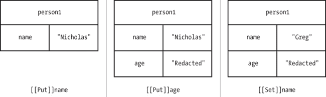

## 第三章. 理解对象

尽管 JavaScript 中有许多内建的引用类型，但你很可能会频繁创建自己的对象。在此过程中，请记住，JavaScript 中的对象是动态的，这意味着它们可以在代码执行的任何时刻发生变化。与基于类的语言根据类定义锁定对象不同，JavaScript 对象没有这样的限制。

JavaScript 编程的一个重要部分就是管理这些对象，这也是为什么理解对象如何工作的关键是理解整个 JavaScript 的原因。后续章节中会更详细地讨论这一点。

## 定义属性

回想一下第一章，你可以通过两种基本方式来创建自己的对象：使用`Object`构造函数和使用对象字面量。例如：

```
  `var` person1 `=` {
      name: `"Nicholas"`
  };

  `var` person2 `=` `new` `Object`();
  person2.name `=` `"Nicholas"`;

❶ person1.age `=` `"Redacted"`;
  person2.age `=` `"Redacted"`;

❷ person1.name `=` `"Greg"`;
  person2.name = `"Michael"`;
```

`person1`和`person2`都是具有`name`属性的对象。在示例的后续部分，两个对象都被赋予了`age`属性 ❶。你可以在对象定义后立即这样做，也可以在更后面进行修改。除非特别指定，否则你创建的对象始终可以随时修改（有关这一点的更多内容，请参见防止对象修改）。这个示例的最后一部分修改了每个对象的`name`值 ❷；属性值也可以随时更改。

当一个属性首次添加到对象时，JavaScript 会在该对象上使用一个名为`[[Put]]`的内部方法。`[[Put]]`方法在对象中创建一个位置来存储该属性。你可以将其比作第一次向哈希表中添加一个键。此操作不仅指定了初始值，还指定了属性的一些特性。因此，在前面的示例中，当`name`和`age`属性首次在每个对象上定义时，都会调用`[[Put]]`方法。

调用`[[Put]]`的结果是在对象上创建一个*自有属性*。自有属性仅仅表示该对象的特定实例拥有该属性。属性直接存储在实例中，所有对该属性的操作都必须通过该对象进行。

### 注意

*自有属性不同于* 原型属性，*后者在第四章中讨论。*

当新值被赋给现有属性时，会发生一个单独的操作，称为`[[Set]]`。此操作将属性的当前值替换为新值。在前面的示例中，将`name`设置为第二个值会导致调用`[[Set]]`。有关`person1`在幕后如何改变其`name`和`age`属性的详细步骤，请参见图 3-1。

图 3-1. 添加和更改对象的属性

在图表的第一部分，使用对象字面量创建了`person1`对象。这为`name`属性执行了隐式的`[[Put]]`操作。给`person1.age`赋值时会执行`[[Put]]`操作来为`age`属性赋值。然而，将`person1.name`设置为一个新值（`"Greg"`）时会对`name`属性执行`[[Set]]`操作，覆盖现有的属性值。

## 检测属性

因为属性可以随时添加，所以有时需要检查某个属性是否存在于对象中。新手 JavaScript 开发者常常错误地使用类似下面的模式来检测属性是否存在：

```
`// unreliable`
`if` (person1.age) {
    `// do something with age`
}
```

这种模式的问题在于 JavaScript 的类型强制转换如何影响结果。如果值是*真值*（一个对象、非空字符串、非零数字或`true`），`if`条件会评估为`true`；如果值是*假值*（`null`、`undefined`、`0`、`false`、`NaN` 或空字符串），`if`条件会评估为`false`。因为对象的属性可能包含这些假值中的一个，所以下面的代码可能会产生假阴性。例如，如果`person1.age`是`0`，那么即使该属性存在，`if`条件也不会成立。一个更可靠的检查属性是否存在的方式是使用`in`运算符。

`in`运算符会检查特定对象中是否存在具有给定名称的属性，如果找到该属性，则返回`true`。实际上，`in`运算符会检查给定的键是否存在于哈希表中。例如，下面是使用`in`检查`person1`对象中的某些属性时的情况：

```
console.log(`"name"` `in` person1);     `// true`
console.log(`"age"` `in` person1);      `// true`
console.log(`"title"` `in` person1);    `// false`
```

请记住，方法只是引用函数的属性，因此你可以用相同的方式检查方法是否存在。下面的代码为`person1`添加了一个新函数`sayName()`，并使用`in`来确认该函数是否存在。

```
`var` person1 `=` {
    name: `"Nicholas"`,
    sayName: `function`() {
        console.log(`this`.name);
    }
};

console.log(`"sayName"` `in` person1);   `// true`
```

在大多数情况下，`in`运算符是判断属性是否存在于对象中的最佳方式。它的附加好处是不会评估属性的值，这在评估可能会导致性能问题或错误的情况下非常重要。

然而，在某些情况下，你可能只想检查属性是否存在且它是一个自有属性。`in`运算符会检查自有属性和原型属性，因此你需要采取不同的方法。此时使用`hasOwnProperty()`方法，它在所有对象上都有，并且只有在给定属性存在且是自有属性时，才会返回`true`。例如，下面的代码比较了在`person1`对象上使用`in`和`hasOwnProperty()`检查不同属性的结果：

```
  `var` person1 `=` {
      name: `"Nicholas"`,
      sayName: `function`() {
          console.log(`this`.name);
      }
  };

  console.log(`"name"` `in` person1);                     `// true`
  console.log(person1.hasOwnProperty(`"name"`));        `// true`

  console.log(`"toString"` `in` person1);                 `// true`
❶ console.log(person1.hasOwnProperty(`"toString"`));    `// false`
```

在这个例子中，`name`是`person1`的自有属性，因此`in`运算符和`hasOwnProperty()`都返回`true`。然而，`toString()`方法是所有对象上都存在的原型属性。`in`运算符对`toString()`返回`true`，但`hasOwnProperty()`返回`false` ❶。这是一个重要的区别，在第四章中进一步讨论。

## 移除属性

就像可以随时向对象添加属性一样，它们也可以被移除。简单地将属性设置为`null`并不会完全从对象中删除该属性。这样的操作调用`[[Set]]`并赋值为`null`，正如你在本章前面看到的，它仅仅是替换了属性的值。你需要使用`delete`运算符来完全从对象中删除一个属性。

`delete`运算符作用在单个对象属性上，并调用一个名为`[[Delete]]`的内部操作。你可以把这个操作看作是从哈希表中删除一个键/值对。当`delete`运算符成功时，它返回`true`。（有些属性是不能被移除的，这会在本章后面详细讨论。）例如，下面的示例展示了`delete`运算符的工作方式：

```
  `var` person1 `=` {
      name: `"Nicholas"`
  };

  console.log(`"name"` `in` person1);    `// true`

  `delete` person1.name;               `// true - not output`
  console.log(`"name"` `in` person1);    `// false`
❶ console.log(person1.name);         `// undefined`
```

在这个例子中，`name`属性从`person1`中被删除。操作完成后，`in`运算符返回`false`。同时，请注意，尝试访问一个不存在的属性会返回`undefined` ❶。图 3-2 展示了`delete`如何影响一个对象。

图 3-2. 当你`delete`名字属性时，它从`person1`完全消失。

## 枚举

默认情况下，你向对象添加的所有属性都是*可枚举*的，这意味着你可以使用`for-in`循环对它们进行迭代。可枚举属性具有内部的`[[Enumerable]]`属性设置为`true`。`for-in`循环枚举对象上的所有可枚举属性，将属性名赋给一个变量。例如，下面的循环输出对象的属性名和值：

```
`var` property;

`for` (property in object) {
    console.log(`"Name: "` `+` property);
    console.log(`"Value: "` `+` object[property]);
}
```

每次通过`for-in`循环时，`property`变量都会填充对象上的下一个可枚举属性，直到所有这些属性都被使用完为止。在那时，循环结束，代码继续执行。本例中使用方括号表示法检索对象属性的值并将其输出到控制台，这是 JavaScript 中方括号表示法的主要用例之一。

如果你只需要一个对象属性的列表以便稍后在程序中使用，ECMAScript 5 引入了`Object.keys()`方法来检索一个包含可枚举属性名的数组，如下所示：

```
❶ `var` properties `=` `Object`.keys(object);

  `// if you want to mimic for-in behavior`
  `var` i, len;

  `for` (i`=``0`, len=properties.length; i `<` len; i`++`){
      console.log(`"Name: "` `+` properties[i]);
      console.log(`"Value: "` `+` object[properties[i]]);
  }
```

本示例使用`Object.keys()`来获取对象的可枚举属性❶。然后使用`for`循环遍历这些属性，并输出属性的名称和值。通常，在你想对属性名数组进行操作时，会使用`Object.keys()`，而在你不需要数组时，则使用`for-in`。

### 注意

*在`for-in`循环中返回的可枚举属性和通过`Object.keys()`返回的属性是有区别的。`for-in`循环还会枚举原型属性，而`Object.keys()`只返回对象自身的（实例）属性。原型属性和自身属性的区别在第四章中有讨论。*

请记住，并非所有的属性都是可枚举的。实际上，大多数对象上的原生方法的`[[Enumerable]]`属性都被设置为`false`。你可以使用`propertyIsEnumerable()`方法来检查一个属性是否可枚举，该方法存在于每个对象上：

```
  `var` person1 `=` {
      name: `"Nicholas"`
  };

  console.log(`"name"` `in` person1);                          `// true`
❶ console.log(person1.propertyIsEnumerable(`"name"`));       `// true`

  `var` properties `=` `Object`.keys(person1);

  console.log(`"length"` `in` properties);                     `// true`
❷ console.log(properties.propertyIsEnumerable(`"length"`));  `// false`
```

在这里，`name`属性是可枚举的，因为它是定义在`person1`上的自定义属性❶。另一方面，`properties`数组的`length`属性不可枚举❷，因为它是`Array.prototype`上的内置属性。你会发现许多原生属性默认是不可枚举的。

## 属性的类型

属性有两种不同的类型：数据属性和访问器属性。*数据属性*包含一个值，就像本章前面示例中的`name`属性一样。`[[Put]]`方法的默认行为是创建一个数据属性，本章到目前为止的每个示例都使用了数据属性。*访问器属性*不包含值，而是定义了一个在读取属性时调用的函数（称为*getter*），以及一个在写入属性时调用的函数（称为*setter*）。访问器属性只需要一个 getter 或一个 setter，但也可以同时拥有两者。

使用对象字面量定义访问器属性有一种特殊的语法：

```
  `var` person1 `=` {
❶     _name: `"Nicholas"`,

❷     get name() {
          console.log(`"Reading name"`);
          `return` `this`._name;
      },

❸     set name(value) {
          console.log(`"Setting name to %s"`, value);
          `this`._name `=` value;
      }
  };

  console.log(person1.name);    `// "Reading name" then "Nicholas"`

  person1.name = `"Greg"`;
  console.log(person1.name);    `// "Setting name to Greg" then "Greg"`
```

本示例定义了一个名为`name`的访问器属性。还有一个数据属性`_name`，它包含该属性的实际值❶。（前导的下划线是常见的约定，表示该属性被视为私有，尽管实际上它仍然是公共的。）定义`name`的 getter❷和 setter❸的语法看起来像函数，但没有使用`function`关键字。在访问器属性名之前使用了特殊关键字`get`和`set`，后面跟着括号和函数体。getter 预计返回一个值，而 setter 接收被分配给属性的值作为参数。

尽管这个示例使用`_name`来存储属性数据，你完全可以将数据存储在一个变量中，甚至存储在另一个对象中。这个示例只是为属性的行为添加了日志记录；如果你只是将数据存储在另一个属性中，通常没有必要使用访问器属性——直接使用该属性即可。当你希望赋值操作触发某种行为，或者当读取一个值时需要计算所需的返回值时，访问器属性最为有用。

### 注意

*你不需要同时定义 getter 和 setter；你可以选择其中一个或两个。如果你只定义了 getter，那么该属性就变为只读，尝试写入该属性会在非严格模式下默默失败，在严格模式下抛出错误。如果你只定义了 setter，那么该属性就变为只写，尝试读取其值在严格模式和非严格模式下都会默默失败。*

## 属性属性

在 ECMAScript 5 之前，无法指定一个属性是否应该是可枚举的。实际上，根本无法访问属性的内部属性。ECMAScript 5 通过引入多种直接与属性属性交互的方法，并引入新属性以支持更多功能，改变了这一点。现在可以创建表现得像内建 JavaScript 属性一样的属性。本节将详细介绍数据属性和访问器属性的属性，从它们的共同属性开始。

### 常见属性

数据属性和访问器属性之间有两个共享的属性。一个是`[[Enumerable]]`，决定是否可以遍历该属性。另一个是`[[Configurable]]`，决定该属性是否可以更改。你可以使用`delete`删除一个可配置的属性，并且可以随时更改其属性。（这也意味着可配置属性可以从数据属性更改为访问器属性，反之亦然。）默认情况下，你在对象上声明的所有属性都是可枚举且可配置的。

如果你想更改属性的属性，可以使用`Object.defineProperty()`方法。该方法接受三个参数：拥有该属性的对象、属性名和一个包含要设置的属性的*属性描述符*对象。描述符的属性名称与内部属性相同，但没有方括号。因此，你可以使用`enumerable`来设置`[[Enumerable]]`，使用`configurable`来设置`[[Configurable]]`。例如，假设你想将一个对象属性设置为不可枚举且不可配置：

```
  `var` person1 `=` {
❶     name: `"Nicholas"`
  };

  `Object`.defineProperty(person1, `"name"`, {
❷     enumerable: `false`
  });

  console.log(`"name"` `in` person1);                      `// true`
❸ console.log(person1.propertyIsEnumerable(`"name"`));   `// false`

  `var` properties `=` `Object`.keys(person1);
  console.log(properties.length);                      `// 0`

  `Object`.defineProperty(person1, `"name"`, {
❹     configurable: `false`
  });

  `// try to delete the Property`
  `delete` person1.name;
❺ console.log(`"name"` `in` person1);                      `// true`
  console.log(person1.name);                           `// "Nicholas"`

❻ `Object`.defineProperty(person1, `"name"`, {             `// error!!!`
      configurable: `true`
  });
```

`name`属性如常规定义 ❶，但随后被修改，将其`[[Enumerable]]`特性设置为`false` ❷。现在，`propertyIsEnumerable()`方法返回`false` ❸，因为它引用了`[[Enumerable]]`的新值。之后，`name`被修改为不可配置 ❹。从此以后，删除`name`的尝试会失败，因为该属性无法更改，所以`name`仍然存在于`person1`上 ❺。再次调用`Object.defineProperty()`在`name`上也不会进一步更改该属性。实际上，`name`已被锁定为`person1`上的一个属性。

代码的最后一部分尝试重新定义`name`为可配置属性 ❻。然而，这会抛出一个错误，因为你不能将一个不可配置的属性重新配置为可配置的。在这种情况下，尝试将数据属性转换为访问器属性，或反之亦然，也应该抛出一个错误。

### 注意

*当 JavaScript 在严格模式下运行时，尝试删除一个不可配置的属性会导致错误。在非严格模式下，该操作会悄悄失败。*

### 数据属性特性

数据属性具有访问器没有的两个附加特性。第一个是`[[Value]]`，它存储属性的值。创建对象上的属性时，这个特性会自动填充。所有属性值都存储在`[[Value]]`中，即使这个值是一个函数。

第二个特性是`[[Writable]]`，它是一个布尔值，表示该属性是否可以被写入。默认情况下，所有属性都是可写的，除非你特别指定为不可写。

使用这两个附加特性，你可以完全定义一个数据属性，即使该属性尚不存在。考虑以下代码：

```
`var` person1 `=` {
    name: `"Nicholas"`
};
```

你在本章中多次看到了这一段代码；它将`name`属性添加到`person1`上，并设置了它的值。你可以使用以下（更加冗长的）代码实现相同的结果：

```
`var` person1 `=` {};

`Object`.defineProperty(person1, `"name"`, {
    value: `"Nicholas"`,
    enumerable: `true`,
    configurable: `true`,
    writable: `true`
});
```

当调用`Object.defineProperty()`时，它首先检查属性是否存在。如果属性不存在，则会按照描述符中指定的特性添加一个新的属性。在这种情况下，`name`并不是`person1`的一个属性，所以它会被创建。

当你使用`Object.defineProperty()`定义新属性时，重要的是要指定所有特性，因为布尔特性默认会自动设为`false`。例如，以下代码创建了一个`name`属性，该属性是不可枚举的、不可配置的和不可写的，因为在调用`Object.defineProperty()`时没有显式地将这些特性设置为`true`。

```
`var` person1 `=` {};

`Object`.defineProperty(person1, `"name"`, {
    value: `"Nicholas"`
});

console.log(`"name"` `in` person1);                      `// true`
console.log(person1.propertyIsEnumerable(`"name"`));   `// false`

`delete` person1.name;
console.log(`"name"` `in` person1);                      `// true`

person1.name `=` `"Greg"`;
console.log(person1.name);                           `// "Nicholas"`
```

在这段代码中，除了读取值外，你不能对`name`属性进行任何其他操作；所有其他操作都被锁定。如果你正在更改一个已有属性，请记住，只有你指定的特性会发生变化。

### 注意

*不可写属性在严格模式下尝试修改值时会抛出错误。在非严格模式下，该操作会悄悄失败。*

### 访问器属性特性

访问器属性还有两个额外的属性。因为访问器属性没有存储值，所以不需要`[[Value]]`或`[[Writable]]`。相反，访问器属性有`[[Get]]`和`[[Set]]`，它们分别包含 getter 和 setter 函数。与对象字面量形式的 getter 和 setter 类似，你只需要定义其中一个属性即可创建该属性。

### 注意

*如果你尝试创建一个同时具有数据属性和访问器属性的属性，会导致错误。*

使用访问器属性属性而不是对象字面量符号来定义访问器属性的优点是，你还可以在现有对象上定义这些属性。如果你想使用对象字面量符号，必须在创建对象时就定义访问器属性。

与数据属性类似，你也可以指定访问器属性是否是可配置的或可枚举的。考虑下面这个之前的例子：

```
`var` person1 `=` {
    _name: `"Nicholas"`,

    get name() {
        console.log(`"Reading name"`);
        `return` `this`._name;
    },

    set name(value) {
        console.log(`"Setting name to %s"``,` `valu`e);
        `this`._name `=` value;
    }
};
```

这段代码也可以写成如下：

```
`var` person1 = {
    _name: `"Nicholas"`
};

`Object`.defineProperty(person1, `"name"`, {
    get: `function`() {
        console.log(`"Reading name"`);
        `return` `this`._name;
    },
    set: `function`(value) {
        console.log(`"Setting name to %s"`, value);
        `this`._name `=` value;
    },
    enumerable: `true`,
    configurable: `true`
});
```

请注意，传递给`Object.defineProperty()`的对象中的`get`和`set`键是包含函数的数据属性。在这里，你不能使用对象字面量访问器格式。

设置其他属性（`[[Enumerable]]`和`[[Configurable]]`）可以改变访问器属性的行为。例如，你可以像这样创建一个不可配置、不可枚举、不可写的属性：

```
  `var` person1 `=` {
      _name: `"Nicholas"`
  };
  `Object`.defineProperty(person1, `"name"`, {
      get: `function`() {
          console.log(`"Reading name"`);
❶         `return` `this`._name;
      }
  });

  console.log(`"name"` `in` person1);                      `// true`
  console.log(person1.propertyIsEnumerable("name"));   `// false`
  `delete` person1.name;
  console.log(`"name"` `in` person1);                      `// true`

  person1.name `=` `"Greg"`;
  console.log(person1.name);                           `// "Nicholas"`
```

在这段代码中，`name`属性是一个只有 getter 的访问器属性❶。没有 setter 或任何其他属性被显式设置为`true`，因此值可以读取但不能修改。

### 注意

*与通过对象字面量符号定义的访问器属性一样，如果访问器属性没有 setter，在严格模式下尝试更改值时会抛出错误。在非严格模式下，操作会悄悄失败。尝试读取仅定义了 setter 的访问器属性时，始终返回`undefined`。*

### 定义多个属性

如果你使用`Object.defineProperties()`而不是`Object.defineProperty()`，也可以同时在一个对象上定义多个属性。这个方法接受两个参数：要操作的对象和一个包含所有属性信息的对象。第二个参数的键是属性名，值是描述符对象，定义这些属性的属性。例如，以下代码定义了两个属性：

```
  `var` person1 `=` {};

  `Object`.defineProperties(person1, {

❶     `// data property to store data`
      _name: {
          value: `"Nicholas"`,
          enumerable: `true`,
          configurable: `true`,
          writable: `true`
      },
❷     `// accessor property`
      name: {
          get: `function`() {
              console.log(`"Reading name"`);
              `return` `this`._name;
          },
          set: `function`(value) {
              console.log(`"Setting name to %s"`, value);
              `this`._name `=` value;
          },
          enumerable: `true`,
          configurable: `true`
      }
  });
```

这个例子将`_name`定义为数据属性来存储信息❶，而将`name`定义为访问器属性❷。你可以使用`Object.defineProperties()`定义任意数量的属性；你甚至可以在同一时间修改现有属性或创建新属性。其效果与多次调用`Object.defineProperty()`相同。

### 获取属性属性

如果你需要获取属性的特性，可以通过 JavaScript 中的`Object.getOwnPropertyDescriptor()`来实现。顾名思义，这个方法仅适用于对象的自有属性。此方法接受两个参数：要操作的对象和要获取的属性名。如果属性存在，你将收到一个描述符对象，其中包含四个属性：`configurable`、`enumerable`和两个适用于该属性类型的其他属性。即使你没有特别设置某个属性，仍然会收到一个包含该属性适当值的对象。例如，这段代码创建了一个属性并检查了它的特性：

```
`var` person1 `=` {
    name: `"Nicholas"`
};

`var` descriptor `=` `Object`.getOwnPropertyDescriptor(person1, `"name"`);

console.log(descriptor.enumerable);     `// true`
console.log(descriptor.configurable);   `// true`
console.log(descriptor.writable);       `// true`
console.log(descriptor.value);          `// "Nicholas"`
```

在这里，一个名为`name`的属性被定义为对象字面量的一部分。对`Object.getOwnPropertyDescriptor()`的调用返回一个包含`enumerable`、`configurable`、`writable`和`value`的对象，即使这些属性没有通过`Object.defineProperty()`显式定义。

## 防止对象修改

对象就像属性一样，具有内部属性来控制它们的行为。其中一个属性是`[[Extensible]]`，它是一个布尔值，表示对象是否可以修改。你创建的所有对象默认都是*可扩展*的，这意味着可以随时向对象添加新属性。在本章中你已经看到过这种情况。通过将`[[Extensible]]`设置为`false`，你可以防止向对象添加新属性。有三种不同的方法可以实现这一点。

### 防止扩展

创建不可扩展对象的一种方法是使用`Object.preventExtensions()`。此方法接受一个参数，即你希望设置为不可扩展的对象。一旦你在一个对象上使用了这个方法，就无法再向它添加任何新属性。你可以通过`Object.isExtensible()`来检查`[[Extensible]]`的值。以下代码展示了两种方法的实际操作。

```
  `var` person1 `=` {
      name: `"Nicholas"`
  };

❶ console.log(`Object`.isExtensible(person1));     `// true`

❷ `Object`.preventExtensions(person1);
  console.log(`Object`.isExtensible(person1));     `// false`

❸ person1.sayName `=` `function`() {
      console.log(`this`.name);
  };

  console.log(`"sayName"` `in` person1);             `// false`
```

创建`person1`后，本示例首先检查对象的`[[Extensible]]`属性❶，然后将其设置为不可变❷。现在，`person1`是不可扩展的，`sayName()`方法❸将不会被添加到它上面。

### 注意

*在严格模式下，尝试向一个不可扩展的对象添加属性会抛出错误。在非严格模式下，操作会悄无声息地失败。你应该始终在不可扩展的对象上使用严格模式，以便在不小心使用不可扩展对象时能及时察觉。*

### 密封对象

创建不可扩展对象的第二种方法是对对象进行*密封*。一个密封的对象是不可扩展的，并且它的所有属性都是不可配置的。这意味着不仅不能向对象添加新属性，还不能删除属性或更改其类型（从数据类型到访问器类型，或反之）。如果一个对象被密封，你只能读写其属性。

你可以使用`Object.seal()`方法来密封一个对象。当对象被密封时，`[[Extensible]]`属性会被设置为`false`，所有属性的`[[Configurable]]`属性也会被设置为`false`。你可以通过`Object.isSealed()`来检查一个对象是否已密封，如下所示：

```
  `var` person1 `=` {
      name: `"Nicholas"`
  };

  console.log(`Object`.isExtensible(person1));      `// true`
  console.log(`Object`.isSealed(person1));          `// false`

❶ `Object`.seal(person1);
❷ console.log(`Object`.isExtensible(person1));      `// false`
  console.log(`Object`.isSealed(person1));          `// true`

❸ person1.sayName `=` `function`() {
      console.log(`this`.name);
  };

  console.log(`"sayName"` `in` person1);              `// false`

❹ person1.name `=` `"Greg"`;
  console.log(person1.name);                      `// "Greg"`

❺ `delete` person1.name;
  console.log(`"name"`      `in` person1);            `// true`
  console.log(person1.name);                      `// "Greg"`

  `var` descriptor `=` `Object`.getOwnPropertyDescriptor(person1, `"name"`);
  console.log(descriptor.configurable);           `// false`
```

这段代码密封了`person1` ❶，因此你无法添加或删除属性。由于所有密封对象都是不可扩展的，`Object.isExtensible()`在`person1`上使用时返回`false` ❷，而尝试添加一个名为`sayName()`的方法 ❸会静默失败。此外，尽管`person1.name`成功更改为一个新值 ❹，但是删除它的尝试 ❺会失败。

如果你熟悉 Java 或 C++，那么密封对象应该也比较熟悉。当你基于这些语言中的类创建一个新的对象实例时，你无法向该对象添加任何新属性。然而，如果某个属性包含一个对象，你可以修改这个对象。实际上，密封对象是 JavaScript 提供的一种控制机制，它无需使用类便能实现类似的功能。

### 注意

*确保在使用密封对象时启用严格模式，这样当有人错误地使用该对象时，您会收到错误提示。*

### 冻结对象

创建不可扩展对象的最后一种方法是*冻结*它。如果一个对象被冻结，你无法添加或删除属性，无法更改属性类型，也不能向任何数据属性写入数据。实质上，冻结对象是一个密封对象，其中的数据属性也是只读的。冻结对象无法解除冻结，因此它们将保持在被冻结时的状态。你可以通过使用`Object.freeze()`来冻结一个对象，并通过`Object.isFrozen()`来检查对象是否被冻结。例如：

```
  `var` person1 `=` {
      name: `"Nicholas"`
  };

  console.log(`Object`.isExtensible(person1));     `// true`
  console.log(`Object`.isSealed(person1));         `// false`
  console.log(`Object`.isFrozen(person1));         `// false`

❶ `Object`.freeze(person1);
❷ console.log(`Object`.isExtensible(person1));     `// false`
❸ console.log(`Object`.isSealed(person1));         `// true`
  console.log(`Object`.isFrozen(person1));         `// true`

  person1.sayName `=` `function`() {
      console.log(`this`.name);
  };

  console.log(`"sayName"` `in` person1);             `// false`

❹ person1.name `=` `"Greg"`;
  console.log(person1.name);                     `// "Nicholas"`

  `delete` person1.name;
  console.log(`"name"` `in` person1);                `// true`
  console.log(person1.name);                     `// "Nicholas"`

  `var` descriptor = `Object`.getOwnPropertyDescriptor(person1, `"name"`);
  console.log(descriptor.configurable);           `// false`
  console.log(descriptor.writable);               `// false`
```

在这个例子中，`person1`被冻结 ❶。冻结对象也被认为是不可扩展和密封的，因此`Object.isExtensible()`返回`false` ❷，而`Object.isSealed()`返回`true` ❸。`name`属性不能更改，所以即使它被赋值为`"Greg"`，操作也会失败 ❹，后续检查`name`时仍然会返回`"Nicholas"`。

### 注意

*冻结对象仅仅是在某一时刻对对象的快照。它们的用途有限，应当尽量少用。和所有不可扩展的对象一样，使用冻结对象时，应该启用严格模式。*

## 总结

把 JavaScript 对象想象成哈希映射，其中属性就是键/值对，这样有助于理解。你可以通过点表示法或使用带有字符串标识符的括号表示法来访问对象属性。你可以随时通过给属性赋值来添加属性，也可以随时使用`delete`操作符删除属性。你可以通过在属性名和对象上使用`in`操作符来检查一个属性是否存在。如果该属性是自身属性，你还可以使用`hasOwnProperty()`，该方法在每个对象上都可以使用。所有对象属性默认都是可枚举的，这意味着它们会出现在`for-in`循环中，或者通过`Object.keys()`来获取。

有两种类型的属性：数据属性和访问器属性。数据属性是值的占位符，你可以从中读取并写入数据。当数据属性持有一个函数值时，该属性被视为对象的方法。与数据属性不同，访问器属性本身不存储值；它们使用 getter 和 setter 的组合来执行特定操作。你可以直接使用对象字面量表示法来创建数据属性和访问器属性。

所有属性都有几个相关的属性，这些属性定义了属性的行为。数据属性和访问器属性都有 `[[Enumerable]]` 和 `[[Configurable]]` 属性。数据属性还具有 `[[Writable]]` 和 `[[Value]]` 属性，而访问器属性则具有 `[[Get]]` 和 `[[Set]]` 属性。默认情况下，所有属性的 `[[Enumerable]]` 和 `[[Configurable]]` 都被设置为 `true`，数据属性的 `[[Writable]]` 默认设置为 `true`。你可以通过使用 `Object.defineProperty()` 或 `Object.defineProperties()` 来更改这些属性。也可以使用 `Object.getOwnPropertyDescriptor()` 来获取这些属性。

当你想要以某种方式锁定对象的属性时，有三种不同的方式可以做到这一点。如果你使用 `Object.preventExtensions()`，对象将不再允许添加新的属性。你还可以使用 `Object.seal()` 方法创建一个密封对象，这会使对象不可扩展，并使其属性不可配置。`Object.freeze()` 方法创建一个冻结对象，这是一个密封对象，且其数据属性不可写。对于不可扩展的对象要小心，并且始终使用严格模式，以确保尝试不正确访问对象时会抛出错误。
