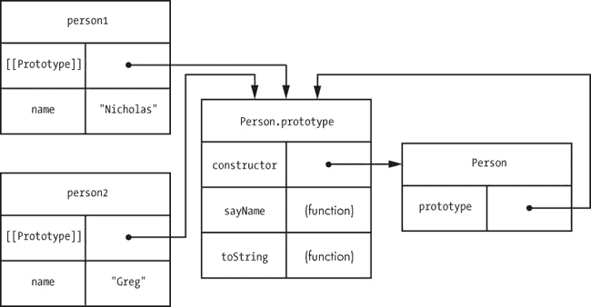

## 第四章 构造函数与原型

你可能在不理解构造函数和原型的情况下，在 JavaScript 中走得相当远，但如果没有对它们的良好理解，你就无法真正理解这门语言。因为 JavaScript 缺乏类，它依赖构造函数和原型来为对象提供类似的结构。但仅仅因为一些模式类似于类，并不意味着它们的行为相同。在本章中，你将详细探讨构造函数和原型，了解 JavaScript 如何利用它们创建对象。

## 构造函数

*构造函数* 只是一个与 `new` 一起使用来创建对象的函数。到目前为止，你已经见过几个内建的 JavaScript 构造函数，例如 `Object`、`Array` 和 `Function`。构造函数的优点在于，通过相同构造函数创建的对象包含相同的属性和方法。如果你想创建多个相似的对象，你可以创建自己的构造函数，从而创建自己的引用类型。

因为构造函数只是一个函数，所以你可以用相同的方式来定义它。唯一的区别是，构造函数的名称应以大写字母开头，以便与其他函数区分开来。例如，看看下面这个空的 `Person` 函数：

```
`function` Person() {
    `// intentionally empty`
}
```

这个函数是一个构造函数，但它与其他任何函数在语法上没有区别。`Person` 是构造函数的线索就在于它的名称——第一个字母大写。

在构造函数定义后，你可以开始创建实例，如下面这两个 `Person` 对象：

```
`var` person1 `=` `new` Person();
`var` person2 `=` `new` Person();
```

当你的构造函数没有参数需要传入时，甚至可以省略括号：

```
`var` person1 `=` `new` Person;
`var` person2 `=` `new` Person;
```

即使 `Person` 构造函数没有显式地返回任何东西，`person1` 和 `person2` 仍然被认为是新 `Person` 类型的实例。`new` 操作符会自动创建给定类型的对象并返回它。这也意味着你可以使用 `instanceof` 操作符推断对象的类型。以下代码展示了 `instanceof` 在新创建的对象上的应用：

```
console.log(person1 `instanceof` Person);     `// true`
console.log(person2 `instanceof` Person);     `// true`
```

因为 `person1` 和 `person2` 是通过 `Person` 构造函数创建的，所以当检查这些对象是否是 `Person` 类型的实例时，`instanceof` 返回 `true`。

你还可以使用 `constructor` 属性来检查实例的类型。每个对象实例都会自动创建一个 `constructor` 属性，其中包含一个指向创建该实例的构造函数的引用。对于 *通用* 对象（通过对象字面量或 `Object` 构造函数创建的对象），`constructor` 设置为 `Object`；对于使用自定义构造函数创建的对象，`constructor` 指向那个构造函数。例如，`Person` 是 `person1` 和 `person2` 的 `constructor` 属性：

```
console.log(person1.constructor `===` Person);     `// true`
console.log(person2.constructor `===` Person);     `// true`
```

`console.log` 函数在两种情况下都会输出`true`，因为这两个对象都是使用`Person`构造函数创建的。

即使实例与其构造函数之间存在这种关系，仍然建议使用 `instanceof` 来检查实例的类型。这是因为 `constructor` 属性可以被覆盖，因此可能并不完全准确。

当然，一个空的构造函数并不太有用。构造函数的主要目的是让你能够轻松创建具有相同属性和方法的多个对象。为此，只需在构造函数内部将任何你想要的属性添加到 `this` 中，如下例所示：

```
  `function` Person(name) {
❶     `this`.name `=` name;
❷     `this`.sayName `=` `function`() {
          console.log(`this`.name);
      };
  }
```

这个版本的 `Person` 构造函数接受一个名为 `name` 的单一参数，并将其分配给 `this` 对象的 `name` 属性 ❶。构造函数还为对象添加了一个 `sayName()` 方法 ❷。当你调用构造函数时，`this` 对象会由 `new` 自动创建，它是构造函数类型的一个实例（在此情况下，`this` 是 `Person` 的一个实例）。由于 `new` 运算符会生成返回值，因此不需要从函数中返回值。

现在，你可以使用 `Person` 构造函数创建具有初始化 `name` 属性的对象：

```
`var` person1 `=` `new` Person(`"Nicholas"`);
`var` person2 `=` `new` Person(`"Greg"`);

console.log(person1.name);            `// "Nicholas"`
console.log(person2.name);            `// "Greg"`

person1.sayName();                    `// outputs "Nicholas"`
person2.sayName();                    `// outputs "Greg"`
```

每个对象都有自己的 `name` 属性，因此 `sayName()` 方法应该根据调用它的对象返回不同的值。

### 注意

*你也可以在构造函数内部显式地调用 return。如果返回值是一个对象，它将被返回，而不是新创建的对象实例。如果返回值是一个原始值，则会使用新创建的对象，返回值会被忽略。*

构造函数允许你以一致的方式初始化一个类型的实例，执行所有必要的属性设置，以便对象可以被使用。例如，你也可以在构造函数内部使用 `Object.defineProperty()` 来帮助初始化实例：

```
`function` Person(name) {

    `Object`.defineProperty(`this`, `"name"`, {
        get: `function`() {
            `return` name;
        },
        set: `function`(newName) {
            name `=` newName;
        },
        enumerable: `true`,
        configurable: `true`
    });

    `this`.sayName `=` `function`() {
        console.log(`this`.name);
    };
}
```

在这个版本的 `Person` 构造函数中，`name` 属性是一个访问器属性，它使用 `name` 参数来存储实际的名称。这是可能的，因为命名参数像局部变量一样起作用。

确保始终使用 `new` 来调用构造函数；否则，你可能会更改全局对象，而不是新创建的对象。考虑以下代码中的情况：

```
`var` person1 `=` Person(`"Nicholas"`);            `// note: missing "new"`

console.log(person1 `instanceof` Person);      `// false`
console.log(`typeof` person1);                 `// "undefined"`
console.log(name);                           `// "Nicholas"`
```

当 `Person` 作为函数被调用且没有使用 `new` 时，构造函数内部的 `this` 值将等于全局的 `this` 对象。变量 `person1` 不包含任何值，因为 `Person` 构造函数依赖 `new` 来提供返回值。如果没有 `new`，`Person` 就只是一个没有 `return` 语句的函数。对 `this.name` 的赋值实际上会创建一个全局变量 `name`，其中存储了传递给 `Person` 的名称。第六章 介绍了针对这个问题以及更复杂的对象组合模式的解决方案。

### 注意

*如果在严格模式下调用 Person 构造函数而不使用 new，则会发生错误。这是因为严格模式不会将 this 分配给全局对象，而是保持 this 为 undefined，每当你尝试在 undefined 上创建属性时，就会发生错误。*

构造函数允许你为对象实例配置相同的属性，但单靠构造函数并不能消除代码冗余。在到目前为止的示例代码中，每个实例都有自己的`sayName()`方法，尽管`sayName()`方法没有变化。这意味着如果你有 100 个对象实例，那么就会有 100 个做完全相同事情的函数副本，只是使用不同的数据。

如果所有实例共享一个方法，并且该方法可以使用`this.name`来获取适当的数据，那么效率会更高。这就是原型的作用。

## 原型

你可以把*原型*看作是一个对象的“食谱”。几乎每个函数（除了某些内置函数）都有一个`prototype`属性，它在创建新实例时会被使用。这个原型在所有对象实例之间共享，且这些实例可以访问原型的属性。例如，`hasOwnProperty()`方法是在通用的`Object`原型上定义的，但它可以像访问自身属性一样从任何对象访问，就像这个例子所示：

```
`var` book = {
    title: `"The Principles of Object-Oriented JavaScript"`
};

console.log(`"title"` `in` book);                                    `// true`
console.log(book.hasOwnProperty(`"title"`));                       `// true`
console.log(`"hasOwnProperty"` `in` book);                           `// true`
console.log(book.hasOwnProperty(`"hasOwnProperty"`));              `// false`
console.log(`Object`.prototype.hasOwnProperty(`"hasOwnProperty"`));  `// true`
```

即使`book`上没有定义`hasOwnProperty()`，该方法仍然可以通过`book.hasOwnProperty()`访问，因为这个定义确实存在于`Object.prototype`上。记住，`in`运算符对于原型属性*和*自身属性都会返回`true`。

识别原型属性

你可以通过使用一个函数来判断一个属性是否在原型上，例如：

```
`function` hasPrototypeProperty(object, name) {
    `return` name `in` object `&&` !object.hasOwnProperty(name);
}

console.log(hasPrototypeProperty(book, `"title"`));            `// false`
console.log(hasPrototypeProperty(book, `"hasOwnProperty"`));   `// true`
```

如果一个属性位于一个对象的`in`中，但`hasOwnProperty()`返回`false`，那么这个属性就在原型上。

### [[Prototype]]属性

一个实例通过一个名为`[[Prototype]]`的内部属性来跟踪它的原型。这个属性是指向该实例所使用的原型对象的指针。当你使用`new`创建一个新对象时，构造函数的`prototype`属性会被分配给新对象的`[[Prototype]]`属性。图 4-1 展示了`[[Prototype]]`属性如何让多个对象实例指向相同的原型，从而减少代码重复。

![person1 和 person2 的[[Prototype]]属性指向相同的原型。](figs/web/oojs04_01.png)图 4-1. `person1`和`person2`的`[[Prototype]]`属性指向相同的原型。

你可以通过在对象上使用`Object.getPrototypeOf()`方法来读取`[[Prototype]]`属性的值。例如，以下代码检查一个通用空对象的`[[Prototype]]`。

```
❶ `var` object `=` {};
  `var` prototype `=` `Object`.getPrototypeOf(object);

  console.log(prototype `===` `Object`.prototype);          `// true`
```

对于像这个这样的通用对象❶，`[[Prototype]]`总是指向`Object.prototype`。

### 注意

*一些 JavaScript 引擎还支持在所有对象上使用一个名为 __proto__ 的属性。这个属性允许你既可以读取，也可以写入`[[Prototype]]`属性。Firefox、Safari、Chrome 和 Node.js 都支持这个属性，__proto__ 正在朝着 ECMAScript 6 标准化的方向发展。*

你也可以通过使用`isPrototypeOf()`方法来测试一个对象是否是另一个对象的原型，这个方法在所有对象上都可以使用：

```
`var` object `=` {};

console.log(`Object`.prototype.isPrototypeOf(object));    `// true`
```

因为`object`只是一个通用对象，它的原型应该是`Object.prototype`，这意味着`isPrototypeOf()`应该返回`true`。

当读取一个对象的属性时，JavaScript 引擎首先会查找该名称的自有属性。如果引擎找到了一个名称正确的自有属性，它会返回该值。如果目标对象上没有该名称的自有属性，JavaScript 会搜索`[[Prototype]]`对象。如果原型属性存在，它会返回该属性的值。如果搜索结束后没有找到正确名称的属性，则返回`undefined`。

请考虑以下示例，其中对象首先被创建时没有任何自有属性：

```
  `var` object `=` {};

❶ console.log(object.toString());    `// "[object Object]"`

  object.toString `=` `function`() {
      `return` `"[object Custom]"`;
  };

❷ console.log(object.toString());    `// "[object Custom]"`

  `// delete own property`
  `delete` object.toString;

❸ console.log(object.toString());    `// "[object Object]"`

  `// no effect - delete only works on own properties`
  `delete` object.toString;
  console.log(object.toString());    `// "[object Object]"`
```

在这个示例中，`toString()`方法来自原型，并且默认返回`"[object Object]"` ❶。如果你定义了一个名为`toString()`的自有属性，那么每次调用`toString()`时都会使用这个自有属性 ❷。自有属性*覆盖*了原型属性，因此同名的原型属性不再被使用。只有在删除了自有属性之后，原型属性才会再次被使用 ❸。（请记住，你不能从实例中删除原型属性，因为`delete`操作符仅对自有属性起作用。）图 4-2`属性（中间）会替换原型属性，直到你删除它（下方）。")显示了这个示例中的具体情况。

这个示例还突出了一个重要的概念：你不能通过实例给原型属性赋值。如图 4-2`属性（中间）会替换原型属性，直到你删除它（下方）。")的中间部分所示，给`toString`赋值会在实例上创建一个新的自有属性，原型上的属性保持不变。

图 4-2. 没有自有属性的对象（顶部）只有原型的方法。向对象添加 `toString()` 属性（中间）会替换原型属性，直到你删除它（底部）。

### 使用构造函数中的原型

原型的共享特性使其非常适合为给定类型的所有对象一次性定义方法。因为方法通常对所有实例执行相同的操作，所以没有必要为每个实例定义一组单独的方法。

将方法放在原型上，然后使用 `this` 访问当前实例，要高效得多。例如，考虑以下新的 `Person` 构造函数：

```
  `function` Person(name) {
      `this`.name `=` name;
  }

❶ Person.prototype.sayName `=` `function`() {
      console.log(`this`.name);
  };

  `var` person1 `=` `new` Person(`"Nicholas"`);
  `var` person2 `=` `new` Person(`"Greg"`);

  console.log(person1.name);          `// "Nicholas"`
  console.log(person2.name);          `// "Greg"`

  person1.sayName();                  `// outputs "Nicholas"`
  person2.sayName();                  `// outputs "Greg"`
```

在这个版本的 `Person` 构造函数中，`sayName()` 被定义在原型上 ❶，而不是在构造函数中。尽管 `sayName()` 现在是一个原型属性，而不是自有属性，两个对象实例的行为和本章早些时候的例子完全相同。因为 `person1` 和 `person2` 是它们各自调用 `sayName()` 的基本引用，`this` 值分别被分配给 `person1` 和 `person2`。

你也可以在原型上存储其他类型的数据，但在使用引用值时要小心。因为这些值是跨实例共享的，你可能没有预料到一个实例可以更改另一个实例访问的值。这个例子展示了当你没有注意引用值的指向时可能发生的情况：

```
  `function` Person(name) {
      `this`.name `=` name;
  }

  Person.prototype.sayName `=` `function`() {
      console.log(`this`.name);
};
❶ Person.prototype.favorites `=` [];

  `var` person1 `=` `new` Person(`"Nicholas"`);
  `var` person2 `=` `new` Person(`"Greg"`);

  person1.favorites.push(`"pizza"`);
  person2.favorites.push(`"quinoa"`);

  console.log(person1.favorites);     `// "pizza,quinoa"`
  console.log(person2.favorites);     `// "pizza,quinoa"`
```

`favorites` 属性 ❶ 定义在原型上，这意味着 `person1.favorites` 和 `person2.favorites` 指向*相同的数组*。你添加到任一人的 `favorites` 中的值，将会成为原型上该数组的元素。这可能不是你想要的行为，因此在定义原型上的内容时，必须非常小心。

即使你可以逐个添加属性到原型，许多开发者使用一种更简洁的模式，即用对象字面量替换原型：

```
  `function` Person(name) {
      `this`.name `=` name;
  }

  Person.prototype `=` {
❶     sayName: `function`() {
          console.log(`this`.name);
      },

❷     toString: `function`() {
          `return` `"[Person "` `+` `this`.name + `"]"`;
      }
  };
```

这段代码在原型上定义了两个方法，`sayName()` ❶ 和 `toString()` ❷。这个模式变得非常流行，因为它避免了多次输入 `Person.prototype`。然而，需要注意的是，有一个副作用：

```
  `var` person1 `=` `new` Person(`"Nicholas"`);

  console.log(person1 `instanceof` Person);        `// true`
  console.log(person1.constructor `===` Person);   `// false`
❶ console.log(person1.constructor `===` `Object`);   `// true`
```

使用对象字面量语法覆盖原型更改了 `constructor` 属性，使其现在指向 `Object` ❶ 而不是 `Person`。之所以会发生这种情况，是因为 `constructor` 属性存在于原型上，而不是对象实例上。当创建一个函数时，它的 `prototype` 属性会创建一个 `constructor` 属性，值等于该函数。这种模式完全覆盖了原型对象，意味着 `constructor` 将来自于新创建的（通用的）对象，这个对象被分配给 `Person.prototype`。为避免这种情况，在覆盖原型时，应恢复 `constructor` 属性为正确的值：

```
  `function` Person(name) {
      `this`.name `=` name;
  }

  Person.prototype `=` {
❶     constructor: Person,

      sayName: `function`() {
          console.log(`this`.name);
      },

      toString: `function`() {
          `return` `"[Person "` + `this`.name + `"]"`;
      }
  };

  `var` person1 `=` `new` Person(`"Nicholas"`);
  `var` person2 `=` `new` Person(`"Greg"`);

  console.log(person1 `instanceof` Person);         `// true`
  console.log(person1.constructor `===` Person);    `// true`
  console.log(person1.constructor `===` `Object`);    `// false`

  console.log(person2 `instanceof` Person);         `// true`
  console.log(person2.constructor `===` Person);    `// true`
  console.log(person2.constructor `===` `Object`);    `// false`
```

在这个例子中，`constructor` 属性被专门分配到原型上 ❶。将其作为原型上的第一个属性是一个好习惯，这样就不会忘记包括它。

构造函数、原型和实例之间关系中最有趣的方面之一是，实例与构造函数之间没有直接链接。然而，实例与原型之间以及原型与构造函数之间有直接的链接。图 4-3 展示了这种关系。

图 4-3：实例和它的构造函数通过原型相连接。

这种关系的特点意味着，实例与原型之间的任何中断，也会导致实例与构造函数之间的中断。

### 更改原型

由于所有特定类型的实例都引用一个共享的原型，你可以在任何时候一起增强这些对象。记住，`[[Prototype]]` 属性仅包含指向原型的指针，对原型的任何更改会立即在所有引用它的实例中生效。这意味着，你可以在任何时候向原型中添加新的成员，并且这些更改会在现有实例中反映出来，正如下面这个例子所示：

```
  `function` Person(name) {
      `this`.name `=` name;
  }

  Person.prototype `=` {
      constructor: Person,

❶     sayName: `function`() {
          console.log(`this`.name);
      },

❷     toString: `function`() {
          `return` `"[Person "` + `this`.name + `"]"`;
      }
  };
❸ `var` person1 `=` `new` Person(`"Nicholas"`);
  `var` person2 `=` `new` Person(`"Greg"`);

  console.log(`"sayHi"` `in` person1);         `// false`
  console.log(`"sayHi"` `in` person2);         `// false`

  `// add a new method`
❹ Person.prototype.sayHi `=` `function`() {
      console.log("H`i``"``);`
  };

❺ person1.sayHi();                         `// outputs "Hi"`
  person2.sayHi();                         `// outputs "Hi"`
```

在这段代码中，`Person` 类型最初只有两个方法，`sayName()` ❶ 和 `toString()` ❷。创建了两个 `Person` 实例 ❸，然后将 `sayHi()` ❹ 方法添加到原型上。此后，两个实例都可以访问 `sayHi()` ❺ 方法。每次访问属性时，都会进行属性查找，因此体验是无缝的。

在任何时候都能修改原型，这对密封和冻结的对象有一些有趣的影响。当你在对象上使用 `Object.seal()` 或 `Object.freeze()` 时，你只是在操作对象实例和它的自有属性。你不能在冻结的对象上添加新的自有属性或修改现有的自有属性，但你当然仍然可以在原型上添加属性，并继续扩展这些对象，正如下面的代码示例所示。

```
  `var` person1 `=` `new` Person(`"Nicholas"`);
  `var` person2 `=` `new` Person(`"Greg"`);

❶ `Object`.freeze(person1);

❷ Person.prototype.sayHi `=` `function`() {
   console.log(`"Hi"`);
  };

person1.sayHi();                            `// outputs "Hi"`
person2.sayHi();                            `// outputs "Hi"`
```

在这个示例中，有两个 `Person` 实例。第一个（`person1`）是被冻结的❶，而第二个是普通对象。当你将 `sayHi()` 添加到原型❷时，`person1` 和 `person2` 都获得了这个新方法，似乎与 `person1` 被冻结的状态相矛盾。`[[Prototype]]` 属性被视为实例的自身属性，虽然该属性本身被冻结，但其值（一个对象）并未被冻结。

### 注意

*实际上，在开发 JavaScript 时，你可能并不会经常以这种方式使用原型。然而，理解对象与其原型之间的关系是很重要的，像这样的奇特示例有助于阐明这些概念。*

### 内建对象原型

到这个点，你可能会想，原型是否也允许你修改 JavaScript 引擎中标准自带的内建对象。答案是肯定的。所有内建对象都有构造函数，因此它们有原型，你可以修改。例如，想要为所有数组添加一个新方法，只需修改 `Array.prototype`。

```
`Array`.prototype.sum `=` `function`() {
    `return` `this`.reduce(`function`(previous, current) {
        `return` previous `+` current;
    });
};

`var` numbers `=` [ `1`, `2`, `3`, `4`, `5`, `6` ];
`var` result `=` numbers.sum();

console.log(result);                `// 21`
```

这个示例在 `Array.prototype` 上创建了一个名为 `sum()` 的方法，它会将数组中的所有项加起来并返回结果。`numbers` 数组通过原型自动获得了该方法。在 `sum()` 内部，`this` 指向的是 `numbers`，它是 `Array` 的一个实例，因此该方法可以自由使用其他数组方法，如 `reduce()`。

你可能还记得，字符串、数字和布尔值都有内建的原始包装类型，这些类型用于像操作对象一样访问原始值。如果你修改原始包装类型原型，如本示例所示，你实际上可以为这些原始值添加更多功能：

```
`String`.prototype.capitalize `=` `function`() {
    `return` `this`.charAt(`0`).toUpperCase() `+` `this`.substring(`1`);
};

`var` message `=` `"hello world!"`;
console.log(message.capitalize());  `// "Hello world!"`
```

这段代码为字符串创建了一个名为 `capitalize()` 的新方法。`String` 类型是字符串的原始包装类型，修改其原型意味着所有字符串都会自动应用这些更改。

### 注意

*虽然修改内建对象以实验功能可能既有趣又令人兴奋，但在生产环境中这样做并不是一个好主意。开发者期望内建对象表现出某种特定方式并具备某些方法。故意修改内建对象会违反这些期望，且会让其他开发者不确定这些对象应该如何工作。*

## 总结

构造函数只是正常的函数，通过 `new` 操作符调用时使用。你可以随时定义自己的构造函数，用来创建多个具有相同属性的对象。你可以通过 `instanceof` 或直接访问它们的 `constructor` 属性来识别由构造函数创建的对象。

每个函数都有一个`prototype`属性，用来定义通过特定构造函数创建的对象共享的属性。共享的方法和原始值属性通常在原型上定义，而所有其他属性则在构造函数内部定义。`constructor`属性实际上是在原型上定义的，因为它是所有对象实例共享的。

对象的原型存储在`[[Prototype]]`属性中。这个属性是一个引用，而不是副本。如果在任何时刻更改原型，这些更改会影响所有实例，因为 JavaScript 查找属性的方式。当你尝试访问对象上的一个属性时，会在该对象上查找是否有你指定名称的自有属性。如果没有找到自有属性，则会继续查找原型。这个查找机制意味着原型可以继续变化，而引用该原型的对象实例会立即反映这些变化。

内建对象也有可以修改的原型。虽然不建议在生产环境中进行此操作，但它对于实验和验证新功能的概念证明非常有帮助。
