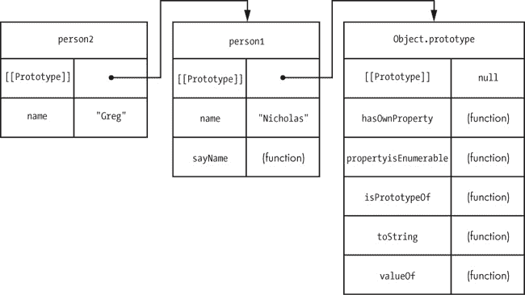
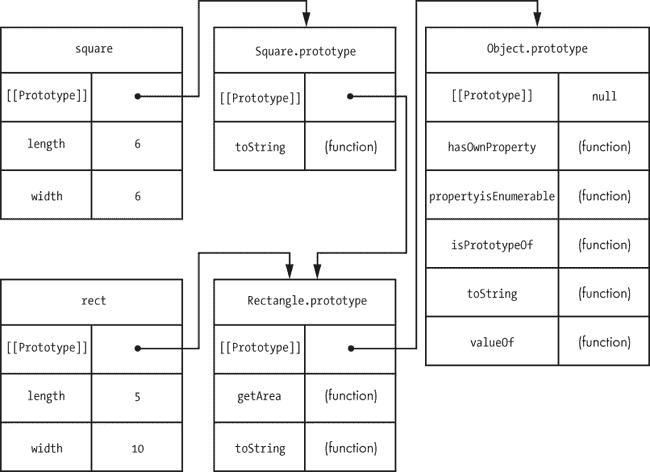

## 第五章：继承

学习如何创建对象是理解面向对象编程的第一步。第二步是理解继承。在传统的面向对象语言中，类从其他类继承属性。

然而，在 JavaScript 中，继承可以发生在没有类结构来定义关系的对象之间。实现这种继承的机制是你已经熟悉的：原型。

## 原型链和`Object.prototype`

JavaScript 的内置继承方式叫做*原型链*，或者*原型继承*。正如你在第四章中学到的，原型属性会自动在对象实例上可用，这是一种继承形式。对象实例从原型中继承属性。因为原型本身也是一个对象，它有自己的原型，并从那个原型中继承属性。这就是*原型链*：一个对象从它的原型继承，而那个原型又从它的原型继承，以此类推。

所有对象，包括你自己定义的对象，默认都继承自`Object`，除非你另行指定（稍后在本章讨论）。更具体地说，所有对象都继承自`Object.prototype`。通过对象字面量定义的任何对象，其`[[Prototype]]`会被设置为`Object.prototype`，这意味着它继承自`Object.prototype`的属性，就像这个示例中的`book`一样：

```
`var` book `=` {
    title: `"The Principles of Object-Oriented JavaScript"`
};

`var` prototype `=` `Object`.getPrototypeOf(book);

console.log(prototype `===` `Object`.prototype);        `// true`
```

在这里，`book`的原型等于`Object.prototype`。为了实现这一点，并不需要额外的代码，因为这是创建新对象时的默认行为。这种关系意味着`book`自动从`Object.prototype`继承方法。

### 从`Object.prototype`继承的方法

在过去几章中使用的几个方法实际上是在`Object.prototype`上定义的，因此被所有其他对象继承。这些方法包括：

+   ****`hasOwnProperty()`****。确定给定名称的自有属性是否存在

+   ****`propertyIsEnumerable()`****。确定自有属性是否可枚举

+   ****`isPrototypeOf()`****。确定对象是否是另一个对象的原型

+   ****`valueOf()`****。返回对象的值表示

+   ****`toString()`****。返回对象的字符串表示

这五个方法通过继承出现在所有对象上。最后两个方法在需要使对象在 JavaScript 中始终如一地工作时很重要，有时你可能想要自己定义这些方法。

#### valueOf()

`valueOf()` 方法会在对对象使用操作符时被调用。默认情况下，`valueOf()` 仅返回对象实例。原始包装类型会重写 `valueOf()`，使其分别返回 `String` 的字符串、`Boolean` 的布尔值和 `Number` 的数字。同样，`Date` 对象的 `valueOf()` 方法返回纪元时间的毫秒数（就像 `Date.prototype.getTime()` 所做的那样）。这使得你能够编写比较日期的代码，例如：

```
  `var` now `=` `new` `Date`();
  `var` earlier `=` `new` `Date`(`2010`, `1`, `1`);

❶ console.log(now `>` earlier);        `// true`
```

在这个例子中，`now` 是表示当前时间的 `Date` 对象，`earlier` 是过去某个固定的日期。当使用大于操作符（`>`）时❶，会在进行比较前分别对两个对象调用 `valueOf()` 方法。你甚至可以将一个日期从另一个日期中减去，得到纪元时间的差值，因为 `valueOf()` 的存在。

如果你的对象需要与操作符一起使用，你可以随时定义你自己的 `valueOf()` 方法。如果你定义了 `valueOf()` 方法，请记住，你并没有改变操作符的工作方式，而只是改变了操作符默认行为时所使用的值。

#### toString()

当 `valueOf()` 返回引用值而不是原始值时，`toString()` 方法会作为备用方法被调用。当 JavaScript 期望字符串时，它也会隐式调用原始值的 `toString()` 方法。例如，当字符串作为加法操作符的一个操作数时，另一个操作数会自动转换为字符串。如果另一个操作数是原始值，它会被转换为字符串表示（例如，`true` 变为 `"true"`），但如果它是引用值，则会调用 `valueOf()`。如果 `valueOf()` 返回引用值，则会调用 `toString()`，并使用返回的值。例如：

```
`var` book `=` {
    title: `"The Principles of Object-Oriented JavaScript"`
};

`var` message `=` `"Book = "` `+` book;
console.log(message);                `// "Book = [object Object]"`
```

这段代码通过将 `"Book = "` 与 `book` 结合来构造字符串。由于 `book` 是一个对象，它的 `toString()` 方法会被调用。这个方法是从 `Object.prototype` 继承来的，并且在大多数 JavaScript 引擎中会返回默认值 `"[object Object]"`。如果你对这个值感到满意，就无需更改对象的 `toString()` 方法。然而，有时定义你自己的 `toString()` 方法是有用的，这样字符串转换时返回的值可以提供更多信息。例如，假设你希望前面的脚本输出书籍的标题：

```
  `var` book `=` {
      title: `"The Principles of Object-Oriented JavaScript"`,
      toString: `function`() {
          `return` `"[Book "` `+` `this`.title + `"]"`
      }
  };

  `var` message `=` `"Book = "` + book;

  `// "Book = [Book The Principles of Object-Oriented JavaScript]"`
❶ console.log(message);
```

这段代码为 `book` 定义了一个自定义的 `toString()` 方法，返回一个比继承版本更有用的值❶。你通常不需要担心定义自定义的 `toString()` 方法，但知道如果需要的话可以这么做还是挺好的。

### 修改 Object.prototype

所有对象默认都继承自 `Object.prototype`，因此对 `Object.prototype` 的修改会影响所有对象。这是一个非常危险的情况。你在第四章中被建议不要修改内建对象的原型，而这个建议对于 `Object.prototype` 来说尤为重要。看看会发生什么：

```
`Object`.prototype.add `=` `function`(value) {
    `return` `this` `+` value;
};

`var` book `=` {
    title: `"The Principles of Object-Oriented JavaScript"`
};

console.log(book.add(`5`));           `// "[object Object]5"`
console.log`(``"title"`.add(`"end"`));    `// "titleend"`

`// in a web browser`
console.log(`document`.add(`true`));    `// "[object HTMLDocument]true"`
console.log(`window`.add(`5`));         `// "[object Window]true"`
```

添加`Object.prototype.add()`会导致所有对象都有一个`add()`方法，无论它是否真正有意义。这个问题不仅对开发者来说是一个难题，也对参与 JavaScript 语言标准化的委员会构成挑战：他们不得不将新方法放置在不同的位置，因为向`Object.prototype`添加方法可能会带来无法预见的后果。

这个问题的另一个方面涉及向`Object.prototype`添加可枚举属性。在之前的示例中，`Object.prototype.add()`是一个可枚举属性，这意味着它会在使用`for-in`循环时出现，如下所示：

```
`var` empty `=` {};

`for` (`var` property `in` empty) {
    console.log(property);
}
```

这里，一个空对象仍然会输出`"add"`作为属性，因为它存在于原型中并且是可枚举的。考虑到在 JavaScript 中`for-in`语法的使用频率，修改`Object.prototype`并添加可枚举属性可能会影响大量代码。因此，道格拉斯·克罗克福德建议在`for-in`循环中始终使用`hasOwnProperty()`，例如：

```
`var` empty `=` {};

`for` (`var` property `in` empty) {
    if (empty.hasOwnProperty(property)) {
        console.log(property);
    }
}
```

尽管这种方法有效地避免了不必要的原型属性，但它也将`for-in`的使用限制为仅限对象的自有属性，这可能并非你所希望的。为了获得最大的灵活性，最好的做法是不要修改`Object.prototype`。

## 对象继承

最简单的继承类型是在对象之间。你需要做的就是指定哪个对象应该作为新对象的`[[Prototype]]`。对象字面量默认将`Object.prototype`设置为其`[[Prototype]]`，但你也可以通过`Object.create()`方法显式指定`[[Prototype]]`。

`Object.create()`方法接受两个参数。第一个参数是新对象的`[[Prototype]]`所使用的对象。可选的第二个参数是一个属性描述符对象，格式与`Object.defineProperties()`中使用的相同（请参见第三章）。请考虑以下示例：

```
`var` book `=` {
    title: `"The Principles of Object-Oriented JavaScript"`
};

`// is the same as`

`var` book `=` `Object`.create(`Object`.prototype, {
                title: {
                    configurable: `true`,
                    enumerable: `true`,
                    value: `"The Principles of Object-Oriented JavaScript"`,
                    writable: `true`
                }
            });
```

这段代码中的两个声明实际上是相同的。第一个声明使用对象字面量定义一个具有单一属性`title`的对象。该对象自动继承自`Object.prototype`，并且默认情况下该属性是可配置的、可枚举的和可写的。第二个声明采取相同的步骤，但使用`Object.create()`显式完成。每个声明所得到的`book`对象行为完全相同。但你可能永远不会编写直接从`Object.prototype`继承的代码，因为默认情况下你已经获得了它。从其他对象继承才更有趣：

```
`var` person1 `=` {
    name: `"Nicholas"`,
    sayName: `function`() {
        console.log(`this`.name);
    }
};

`var` person2 `=` `Object`.create(person1, {
    name: {
        configurable: `true`,
        enumerable: `true`,
        value: `"Greg"`,
        writable: `true`
    }
});

person1.sayName();                                  `// outputs "Nicholas"`
person2.sayName();                                  `// outputs "Greg"`
console.log(person1.hasOwnProperty(`"sayName"`));     `// true`
console.log(person1.isPrototypeOf(person2));        `// true`
console.log(person2.hasOwnProperty(`"sayName"`));     `// false`
```

这段代码创建了一个对象`person1`，它有一个`name`属性和一个`sayName()`方法。`person2`对象继承自`person1`，因此它继承了`name`和`sayName()`。然而，`person2`是通过`Object.create()`定义的，这也为`person2`定义了一个自己的`name`属性。这个自己的属性遮蔽了同名的原型属性，并被用作替代。所以，`person1.sayName()`输出`"Nicholas"`，而`person2.sayName()`输出`"Greg"`。请记住，`sayName()`仍然只存在于`person1`上，并由`person2`继承。

在这个示例中，`person2`的继承链比`person1`更长。`person2`对象继承自`person1`对象，而`person1`对象继承自`Object.prototype`。参见图 5-1。

图 5-1：`person2`的原型链包括`person1`和`Object.prototype`。

当访问对象的属性时，JavaScript 引擎会进行搜索。如果属性在实例上找到（即它是一个自己的属性），则使用该属性的值。如果在实例上找不到该属性，搜索将继续在`[[Prototype]]`上进行。如果仍然没有找到属性，搜索会继续到该对象的`[[Prototype]]`，以此类推，直到链条的末端。通常，这条链会以`Object.prototype`结束，而它的`[[Prototype]]`被设置为`null`。

你还可以通过`Object.create()`创建一个`null [[Prototype]]`的对象，例如：

```
`var` nakedObject `=` `Object`.create(`null`);

console.log(`"toString"` `in` nakedObject);    `// false`
console.log(`"valueOf"` `in` nakedObject);     `// false`
```

这个示例中的`nakedObject`是一个没有原型链的对象。这意味着像`toString()`和`valueOf()`这样的内建方法不再该对象上。实际上，这个对象是一个完全空白的模板，没有任何预定义的属性，因此它非常适合用来创建查找哈希表，而不会与继承的属性名称发生潜在的命名冲突。这样的对象用途并不多，而且你不能将其当作是继承自`Object.prototype`来使用。例如，每当你对`nakedObject`使用操作符时，你只会收到类似“无法将对象转换为原始值”的错误信息。不过，这是 JavaScript 语言中的一个有趣特点，你可以创建一个没有原型的对象。

## 构造函数继承

JavaScript 中的对象继承也是构造函数继承的基础。回顾第四章，几乎每个函数都有一个可以修改或替换的`prototype`属性。该`prototype`属性会自动被赋值为一个新的通用对象，这个对象继承自`Object.prototype`，并有一个名为`constructor`的自身属性。实际上，JavaScript 引擎为你做了以下操作：

```
`// you write this`
`function` YourConstructor() {
    `// initialization`
}

`// JavaScript engine does this for you behind the scenes`
YourConstructor.prototype `=` `Object`.create(`Object`.prototype, {
                                constructor: {
                                    configurable: `true`,
                                    enumerable: `true`,
                                    value: YourConstructor
                                    writable: `true`
                                }
                            });
```

所以，在不做任何额外操作的情况下，这段代码将构造函数的 `prototype` 属性设置为一个从 `Object.prototype` 继承的对象，这意味着任何 `YourConstructor` 的实例也会继承自 `Object.prototype`。`YourConstructor` 是 `Object` 的*子类型*，而 `Object` 是 `YourConstructor` 的*超类型*。

由于 `prototype` 属性是可写的，你可以通过覆盖它来改变原型链。请考虑以下示例：

```
❶ `function` Rectangle(length, width) {
      `this`.length `=` length;
      `this`.width `=` width;
  }

  Rectangle.prototype.getArea `=` `function`() {
      `return` `this`.length `*` `this`.width;
  };

  Rectangle.prototype.toString `=` `function`() {
      `return` `"[Rectangle "` `+` `this`.length `+` `"x"` `+` `this`.width `+` `"]"`;
  };

  `// inherits from Rectangle`
❷ `function` Square(size) {
      `this`.length `=` size;
      `this`.width `=` size;
  }

  Square.prototype `=` `new` Rectangle();
  Square.prototype.constructor `=` Square;

  Square.prototype.toString `=` `function`() {
      `return` `"[Square "` `+` `this`.length `+` `"x"` `+` `this`.width `+` `"]"`;
  };

  `var` rect `=` `new` Rectangle(`5`, `10`);
  `var` square `=` `new` Square(`6`);

  console.log(rect.getArea());        `// 50`
  console.log(square.getArea());      `// 36`

  console.log(rect.toString());       `// "[Rectangle 5x10]"`
  console.log(square.toString());     `// "[Square 6x6]"`

  console.log(rect `instanceof` Rectangle);     `// true`
  console.log(rect `instanceof` `Object`);        `// true`

  console.log(square `instanceof` Square);      `// true`
  console.log(square `instanceof` Rectangle);   `// true`
  console.log(square `instanceof` `Object`);      `// true`
```

在这段代码中，有两个构造函数：`Rectangle` ❶ 和 `Square` ❷。`Square` 构造函数的 `prototype` 属性被覆盖为 `Rectangle` 的一个实例。在这一点上，`Rectangle` 并没有传入任何参数，因为这些参数不需要使用，如果传入参数，所有 `Square` 的实例将共享相同的维度。为了以这种方式改变原型链，你需要确保构造函数在没有传入参数时不会抛出错误（许多构造函数包含可能需要参数的初始化逻辑），并且构造函数不会修改任何全局状态，比如跟踪已创建的实例数量。在原始值被覆盖后，`constructor` 属性会被恢复到 `Square.prototype` 上。

之后，`rect` 被创建为 `Rectangle` 的一个实例，`square` 被创建为 `Square` 的一个实例。两个对象都有 `getArea()` 方法，因为它是从 `Rectangle.prototype` 继承来的。`square` 变量被视为 `Square`、`Rectangle` 和 `Object` 的实例，因为 `instanceof` 使用原型链来确定对象类型。参见 图 5-2。

图 5-2. `square` 和 `rect` 的原型链显示它们都继承自 `Rectangle.prototype` 和 `Object.prototype`，但只有 `square` 继承自 `Square.prototype`。

事实上，`Square.prototype` 并不需要用一个 `Rectangle` 对象来覆盖；`Rectangle` 构造函数并没有做任何 `Square` 所需要的事情。实际上，唯一相关的部分是，`Square.prototype` 需要以某种方式链接到 `Rectangle.prototype`，以便发生继承。这意味着你可以通过再次使用 `Object.create()` 来简化这个示例。

```
`// inherits from Rectangle`
`function` Square(size) {
    `this`.length `=` size;
    `this`.width `=` size;
}

Square.prototype `=` `Object`.create(Rectangle.prototype, {
                        constructor: {
                            configurable: `true`,
                            enumerable: `true`,
                            value: Square,
                            writable: `true`
                        }
                   });
Square.prototype.toString `=` `function`() {
    `return` `"[Square "` `+` `this`.length `+` `"x"` `+` `this`.width `+` `"]"`;
};
```

在这个版本的代码中，`Square.prototype` 被一个新的对象覆盖，该对象继承自 `Rectangle.prototype`，并且 `Rectangle` 构造函数从未被调用。这意味着你不需要再担心因为没有参数调用构造函数而导致错误。否则，这段代码的行为与之前的代码完全相同。原型链保持完整，因此所有 `Square` 的实例都继承自 `Rectangle.prototype`，且构造函数在同一步骤中被恢复。

### 注意

*请始终确保在*添加属性之前*覆盖原型，否则当覆盖发生时，你将丢失已添加的方法。*

## 构造函数偷窃

由于 JavaScript 中的继承是通过原型链实现的，你不需要调用对象的超类构造函数。如果你确实希望从子类构造函数中调用超类构造函数，那么你需要利用 JavaScript 函数的工作原理。

在第二章中，你学习了 `call()` 和 `apply()` 方法，它们允许函数使用不同的 `this` 值被调用。这正是*构造函数偷窃*的实现方式。你只需要使用 `call()` 或 `apply()` 来从子类构造函数中调用超类构造函数，并传入新创建的对象。实际上，你是在为自己的对象偷用超类构造函数，就像这个例子一样：

```
  `function` Rectangle(length, width) {
      `this`.length `=` length;
      `this`.width `=` width;
  }

  Rectangle.prototype.getArea `=` `function`() {
      `return` `this`.length `*` `this`.width;
  };

  Rectangle.prototype.toString `=` `function`() {
      `return` `"[Rectangle "` `+` `this`.length `+` `"x"` `+` `this`.width `+` `"]"`;
  };

  `// inherits from Rectangle`
❶ `function` Square(size) {
      Rectangle.call(`this`, size, size);

      `// optional: add new properties or override existing ones here`
  }

  Square.prototype `=` `Object`.create(Rectangle.prototype, {
                          constructor: {
                              configurable: `true`,
                              enumerable: `true`,
                              value: Square,
                              writable: `true`
                          }
                      });

  Square.prototype.toString `=` `function`() {
      `return` `"[Square "` `+` `this`.length `+` `"x"` + `this`.width `+` `"]"`;
  };

  `var` square `=` `new` Square(`6`);

  console.log(square.length);        `// 6`
  console.log(square.width);         `// 6`
  console.log(square.getArea());     `// 36`
```

`Square` 构造函数调用了 `Rectangle` 构造函数，并将 `this` 以及 `size` 两次传入（一次用于 `length`，一次用于 `width`）。这样做会在新对象上创建 `length` 和 `width` 属性，并将它们的值设为 `size`。这是避免重新定义继承自父类构造函数的属性的一种方式。在调用超类构造函数后，你可以添加新的属性或覆盖现有的属性。

这个两步过程在你需要实现自定义类型之间的继承时非常有用。你总是需要修改构造函数的原型，并且可能还需要从子类构造函数内部调用超类构造函数。通常，你会修改原型以进行方法继承，并使用构造函数偷窃来继承属性。这个方法通常被称为*伪经典继承*，因为它模仿了基于类的语言中的经典继承方式。

## 访问超类方法

在之前的例子中，`Square` 类型有自己的 `toString()` 方法，这会覆盖原型上的 `toString()`。在子类中用新功能覆盖超类方法是比较常见的做法，但如果你仍然想访问超类方法怎么办呢？在其他语言中，你可能可以使用 `super.toString()`，但 JavaScript 没有类似的东西。相反，你可以直接访问超类原型上的方法，并使用 `call()` 或 `apply()` 在子类对象上执行该方法。例如：

```
  `function` Rectangle(length, width) {
      `this`.length `=` length;
      `this`.width `=` width;
  }

  Rectangle.prototype.getArea `=` `function`() {
      `return` `this`.length `*` `this`.width;
  };

  Rectangle.prototype.toString `=` `function`() {
      `return` `"[Rectangle "` `+` `this`.length `+` `"x"` `+` `this`.height `+` `"]"`;
  };

  `// inherits from Rectangle`
  `function` Square(size) {
      Rectangle.call(`this`, size, size);
  }

  Square.prototype `=` `Object`.create(Rectangle.prototype, {
                          constructor: {
                              configurable: `true`,
                              enumerable: `true`,
                              value: Square,
                              writable: `true`
                          }
                      });
  `// call the supertype method`
❶ Square.prototype.toString `=` `function`() {
      `var` text `=` Rectangle.prototype.toString.call(`this``);`
      `return` text.replace(`"Rectangle"`, `"Square"`);
  };
```

在此版本的代码中，❶ `Square.prototype.toString()` 通过使用 `call()` 调用 `Rectangle.prototype.toString()`。该方法只需在返回结果文本之前将 `"Rectangle"` 替换为 `"Square"`。对于这样一个简单的操作，这种方法可能看起来有点冗长，但它是访问超类型方法的唯一方式。

## 总结

JavaScript 通过原型链支持继承。当一个对象的`[[Prototype]]`被设置为另一个对象时，会在对象之间创建原型链。所有通用对象自动继承自`Object.prototype`。如果你想创建一个继承自其他对象的对象，可以使用`Object.create()`来指定新对象的`[[Prototype]]`值。

你通过在构造函数上创建原型链来实现自定义类型之间的继承。通过将构造函数的`prototype`属性设置为另一个值，你在自定义类型的实例与该另一个值的原型之间创建了继承关系。该构造函数的所有实例共享相同的原型，因此它们都从同一个对象继承。这种技术非常适合从其他对象继承方法，但你不能通过原型继承自身的属性。

要正确继承自身属性，可以使用构造函数窃取技术，即使用`call()`或`apply()`调用构造函数，这样可以确保任何初始化都在子类型对象上进行。结合构造函数窃取和原型链是实现 JavaScript 中自定义类型之间继承的最常见方法。这种组合通常被称为伪经典继承，因为它类似于基于类的语言中的继承。

你可以通过直接访问超类型的原型来访问超类型的方法。在这样做时，必须使用`call()`或`apply()`在子类型对象上执行超类型方法。

* * *

^([1]) 参见 Douglas Crockford 的《JavaScript 编程语言代码规范》 (*[`javascript.crockford.com/code.html`](http://javascript.crockford.com/code.html)*).
