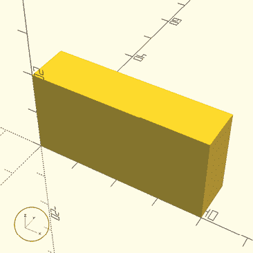
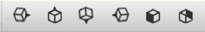

# 前言

*OpenSCAD 编程：3D 可打印物体的初学者指南* 介绍了功能强大的基于文本的 OpenSCAD 3D CAD 软件。本书指导读者通过使用算术、变量、循环、模块和决策来设计一系列越来越复杂的 3D 设计，这些设计都适合 3D 打印。

## 什么是 OpenSCAD？

*OpenSCAD*（发音为*Open-S-CAD*）是一个基于文本的软件，用于创建实体 3D 模型。它允许你通过编写代码来设计这些模型，这使得你（作为设计师）可以完全控制建模过程，并能够在整个过程中轻松修改设计的任何部分。OpenSCAD 还使得创建由可配置参数定义的设计变得容易，这意味着你可以在设计时考虑到未来的变化。

OpenSCAD 是一种*描述性编程语言*：其编码语句*描述*了你整体设计中每个组件的形状、大小和组合。OpenSCAD 提供了两种主要的 3D 建模技术：你可以通过组合简单的形状（称为*构造实体几何*）来创建复杂的物体，或者将 2D *.dxf* 或 *.svg* 轮廓挤压成 3D 形状。与大多数其他用于创建 3D 模型的免费软件（如 Blender）不同，OpenSCAD 更专注于 3D 设计的机械方面，而非艺术方面。因此，当你计划创建可 3D 打印的模型时，OpenSCAD 是合适的工具，但如果你更感兴趣的是制作计算机动画电影，它可能不是你所寻找的工具。

OpenSCAD 是一款免费的开源软件，可供 Windows、macOS 和 Linux 等系统下载。具体的系统要求可以在 [`openscad.org/downloads`](https://openscad.org/downloads) 查看。本书覆盖的是 OpenSCAD 2021.01，这是写作时的最新版本。

## 本书适合的人群

本书适合那些初次接触编程、3D 设计或 OpenSCAD 的初学者。虽然阅读本书所涉及的内容并不要求你具备编程或 3D 设计的背景，但拥有一些初级代数经验会有所帮助。无需掌握基本的数学知识（加法、减法、乘法和除法）。然而，如果你对在简单方程中使用变量有所了解，或者有一些在 xy 平面上绘制点的经验，将会是一个有用的起点。

本书旨在面向初学者，因此我们故意选择专注于 OpenSCAD 的一个子集。我们的目标是以一种易于理解的方式介绍其最有用的元素。在某些情况下，这意味着我们在本书较早的部分简要介绍某个主题，然后在后续章节中更深入地讲解。这样的螺旋式学习方式旨在帮助你在增加更多细节之前，先打下坚实的基础。我们的示例和项目经过精心挑选，既能提供最大限度的创意实用性，又能让编程新手能够轻松理解。

## 为什么要通过 OpenSCAD 学习编程？

虽然学习编程可能既有趣又令人兴奋，但对于初学者来说，弄清楚编程项目中不可避免的错误的*出错原因*和*错误所在*，也可能是一个挑战。与其他基于文本的编程语言（这些语言往往难以看清幕后发生了什么）相比，OpenSCAD 的可视化特性能立即为用户提供有关特定方法正确性的反馈。

编写基于文本的代码来创建 3D 物体是一种强大而有效的学习方式，可以帮助你学习如何组织长序列的编码语句。与更为熟悉的命令式编程语言（如 JavaScript、Python 等）类似，OpenSCAD 包括变量和常见的控制结构（如`if`语句和循环），并支持创建程序员定义的模块和库。此外，OpenSCAD 使用常见的语法元素，如使用花括号（{ }）和分号（;）来组织语句，以及熟悉的算术运算符和约定。OpenSCAD 不仅开启了基于文本的 3D 设计世界，还教授了可转移到许多其他流行编程语言的技能。

使用 OpenSCAD 学习编程也提供了独特的优势，有助于培养*计算思维*。这种计算机特定的方法利用分解、抽象、模式和算法来解决问题，使计算机能够轻松执行解决方案。对于其他编程语言的初学者来说，培养计算思维的直觉可能比较困难，但 OpenSCAD 通过字面上成形的算法和代码语句，使其变得简单。应用抽象和模式意味着在设计中可视化地识别出重复和可预测的元素；分解则是将一个复杂的设计拆分成定义明确的较小部分，而算法自然地从创建一系列步骤开始，这些步骤需要按顺序进行，以创建一个设计。从将 OpenSCAD 设计转化为实际 3D 打印物体中获得的触觉反馈，为学习编程增添了全新的维度。

*STEM*（科学、技术、工程、数学）和*STEAM*（在其中加入艺术）是最近流行的两个缩写，描述的是这些传统上被分隔的学科之间交集处的学习活动。使用 OpenSCAD 学习编程就像是采取一种全面的、基于 STEAM 的编程学习方法。OpenSCAD 编程项目要求将视觉形状转换为简洁的文字描述，反之亦然。从手绘草图开始的设计被转换为数学坐标表示，特征通过比例估算进行设计。使用 OpenSCAD 代码进行设计需要在 3D 物体的正交视图和透视视图之间进行导航，并在二维的阴影形式下思考 3D 形状。3D 打印 OpenSCAD 设计通过要求考虑物理公差和调整机器设置来培养工程技能。按照真正的 STEAM 方法，本书要求你在学习 OpenSCAD 编程的过程中，同时发展、结合并练习通常归属于技术、工程、艺术和数学的独立学科的技能。

使用 OpenSCAD 学习编程有许多优点：

+   OpenSCAD 是流行的、免费的开源软件。

+   OpenSCAD 易于学习，使用常见且可转移的文本基础语法，与其他流行编程语言共享。

+   使用 OpenSCAD 设计 3D 物体保留了可发现的设计历史。与其他 3D 设计软件不同，在这些软件中，点击“撤销”会删除一步操作，但在 OpenSCAD 中，你可以轻松地修改设计过程中的早期步骤，而不会抹去后面的步骤。

+   基于文本的 OpenSCAD 文件（*.scad*）紧凑的大小使得共享、存储和修改 OpenSCAD 模型比使用典型的 3D 建模文件格式更快、更高效。

+   OpenSCAD 有一个易于找到的控制台窗口，可以提供即时且便捷的调试反馈。

+   OpenSCAD 编程项目是可 3D 打印的。

+   OpenSCAD 是视觉学习者的有效第一编程语言选择。

+   使用 OpenSCAD 学习编程在跨学科的、基于 STEAM 的背景下，不仅建立了计算思维的基础，还强化了空间和数学推理能力。

## 3D 打印与 OpenSCAD

大多数人使用 OpenSCAD 来创建 3D 打印设计。从本质上讲，*3D 打印*是将虚拟模型转化为实际物理对象的工具。在创建用于 3D 打印的零件时，OpenSCAD 是一个非常好的软件选择。然而，拥有 3D 打印机并不是本书学习或使用 OpenSCAD 的前提条件。我们当然理解看到和触摸自己 3D 设计的吸引力，因此在本书中，我们穿插了一些 3D 打印小贴士，预期许多读者会希望在现实世界中与自己的虚拟设计进行互动。

3D 打印技术被应用于越来越多的领域：机械工程、产品设计、动画、建筑、雕塑、医学、地质学、火箭学等等。3D 打印最初因其在快速原型制作中的应用而流行，设计师能够比以往更快地创建物理模型并获得现实世界的反馈。然而，除了原型设计，3D 打印技术已经发展到可以直接制造各种材料的产品。设计师现在可以使用 3D 打印技术，利用多种塑料、玻璃、金属、磁铁、水泥、瓷器、生物材料，甚至是可食用的食品来构建设计的最终版本！事实上，机械工程师 3D 打印金属火箭发动机部件、牙医 3D 打印瓷质牙科植入物、建筑师 3D 打印水泥住宅，或者雕塑家和珠宝设计师 3D 打印失蜡铸造的蜡模已不再是什么新鲜事。

尽管存在许多类型的 3D 打印技术，但*熔融沉积建模*仍然是最便宜且最容易获得的技术。本书中的大多数 3D 打印技巧最适合熔融沉积建模，该技术通过将一层层塑料熔化并依次叠加来构建 3D 形状。

## 本书内容

本书分为三个部分：

+   第 1 到第三章介绍如何绘制和组合基本的 3D 和 2D 形状。

+   第 4 到第六章介绍循环、模块和决策，以便你可以为设计过程添加新的效率层次。

+   第七章作为案例研究，强化之前的主题并介绍与计算思维紧密配合的更高阶设计技能。

本书的前六章伴随着一系列设计时间挑战。这些练习提供了快速复制的设计，适合每章内容的范围。每章最后都有一小部分大项目。这些项目需要比设计时间活动更多的时间和精力，故意选择这些项目以呈现一个渐进式的挑战。

设计时间和大项目部分的设计没有绝对坐标，因为它们旨在激发你构建一个大致相似的模型，而不需要过多关注细节。在这些练习中，像比例性和形状组合这样的主要细节比其他任何事情都重要。所有的设计时间和大项目练习都非常适合 3D 打印。

以下列表列出了每章中介绍的主题：

**第一章：使用 OpenSCAD 进行 3D 绘图**

介绍了 OpenSCAD 的界面，并教你绘制和放置一些 OpenSCAD 的基本 3D 形状：长方体、球体、圆柱体和圆锥体。OpenSCAD 还可以导入其他应用程序生成的 3D 形状，本章也将介绍这一点。另一个重要的概念是如何通过几种方式组合多个形状。最后，你将学习如何将 OpenSCAD 的 3D 设计导出为 3D 打印文件。本章中的“大项目”旨在帮助你了解 3D 打印机准备软件中的设置。

**第二章：更多的形状变换方法**

介绍了一些可以应用于第一章中介绍的 3D 形状的附加变换操作。你将学习如何旋转、镜像以及调整 3D 形状的比例。你还将学习更复杂的形状组合方法，包括如何在两个形状之间包裹外壳，以及如何使用`minkowski`操作将一个形状的属性沿另一个形状的边缘扩展。本章中的 3D 打印技巧介绍了填充和外壳的概念。本章的“大项目”要求你结合第一章和第二章的多个主题，制作你可能实际使用的物品：一个游戏骰子和一个桌面整理器。

**第三章：2D 形状**

讨论了一种替代的 3D 设计方法——从 2D *阴影*构建 3D 形状。你将学习如何使用基本的 OpenSCAD 2D 形状绘制图形，包括圆形、矩形、多边形和文本（包括表情符号）。你还将学习如何通过使用第二章中研究的大多数相同操作来组合这些 2D 形状，以及一种新的 2D 操作叫做*偏移*。最后，你将看到如何通过沿 z 轴扩展 2D 形状，将它们带入 3D 世界，并使用多种新的操作。章节中的 3D 打印技巧讨论了如何调整 3D 模型的尺寸以适应打印，包括如何将一个大模型拆分成多个部分，从而使你的 3D 打印超出 3D 打印机的构建平台的限制。本章的“大项目”包括讲故事的骰子、一个骰子架和一个由 2D 轮廓构建的 3D 奖杯。

**第四章：使用循环和变量**

介绍了一个新的计算思维工具：`for` 循环。你将学习如何使用变量和 `for` 循环来重复绘制形状。最棒的是，你将学会如何在循环绘制形状时，改变形状的特性（例如大小、位置或旋转）。本章还介绍了注释和控制台打印，这些是规划和调试设计的有用工具。本章中的 3D 打印技巧涉及到一些可能会让你吃惊的小问题，尤其是当你试图从 OpenSCAD 设计中创建 3D 打印对象时：小尺寸特征的局限性、重新配置设计以避免本应分开的部分融合在一起，以及将设计拆分成不同的 *.stl* 文件以便使用不同颜色的打印线材打印不同的部分。本章的大项目包括一个细节测试、汉诺塔游戏和井字游戏。

**第五章：模块**

介绍了另一个计算思维工具：将设计分解为多个模块。你将学习如何使用 OpenSCAD 模块创建自己的形状，并使用单独的文件将这些新形状组织成一个可重用（且可共享）的库。你还将创建并使用参数来控制形状的特性，并在模块中定义变量，使得更新新形状的设计变得快速而简便。本章中的大项目包括一个摩天大楼模块和一组新的 LEGO 积木设计库。

**第六章：使用 if 语句进行动态设计**

介绍了 `if` 语句，它允许你根据某个条件创建动态变化的设计。你将学习如何使用布尔运算符和逻辑运算符创建各种复杂的条件，以及扩展的 `if` 语句和 `if...else` 语句。你将自动化第四章“大项目”中提出的一些设计配置，并结合随机数为你的设计增添趣味和不可预测的元素，使得重复的元素更加有机和自然。本章中的大项目包括创建一个随机森林、一个时钟面盘和一座随机的摩天大楼城市。

**第七章：设计大型项目**

展示了一个总结性项目，讲解了创建一个大型多文件设计的过程。你将通过使用迭代设计循环，运用计算思维的正式特征，强化并扩展前六章中提出的理念。你将利用 *行走框架* 方法，将比萨斜塔的简单版本逐步演变成一个与实际塔楼高度相似的 3D 模型。你可以将这个建筑 3D 打印出来，作为对自己在学习过程中所获得知识的奖杯。

如果你在本书中的任何练习中遇到困难，Design Time 和 Big Project 练习的建议解决方案（以及所有章节示例）可以在[`programmingwithopenscad.github.io/`](https://programmingwithopenscad.github.io/)找到。

## 本书中使用的术语和约定

许多关于编程和计算思维的入门书籍都有，且每位作者都会做出艰难的决策，决定需要为他们所面向的受众提供多少详细信息。由于本书面向初学者，我们选择保持较高的抽象层次，使用通用的词汇和约定。尽管以下一些术语在其他情况下有更精确的定义，但本书的理念是“不要过于纠结于小细节”。

本书中使用以下词汇：

1.  形状 任何由 OpenSCAD 创建的二维或三维图形对象。

1.  设计 一个 OpenSCAD 创建的内容（即一个 OpenSCAD *程序*），通常由多个形状的组合构成。

1.  操作 一个 OpenSCAD 命令，用于改变一个或多个形状的外观/属性。

1.  参数 指定形状、操作、模块或函数特征的任何值。

1.  预览 在屏幕上快速显示设计的过程。

1.  渲染 完整评估设计几何图形的过程（并在屏幕上显示）。一旦渲染完成，你可以导出设计。

1.  单位 OpenSCAD 中的所有维度都以 *单位* 进行指定。通常情况下，单位是毫米（根据 3D 打印行业惯例），但 OpenSCAD 本身是无单位的。所有模型应在打印前在 3D 打印准备软件中明确调整尺寸。

1.  宽度 与 x 轴相关的维度，在 3D 打印时是“左右”轴。

1.  长度 与 y 轴相关的维度，在 3D 打印时是“前后”轴。

1.  高度 与 z 轴相关的维度，在 3D 打印时是“上下”轴。

1.  2D 形状 具有宽度和长度，但没有高度的形状。

1.  3D 形状 具有宽度、长度和高度的形状。

## 简要介绍使用 OpenSCAD 进行 3D 设计

如果你从未接触过虚拟 3D 模型，通过使用 2D 计算机屏幕来操作本书中创建的 3D 设计可能会感到困惑。理解一些基本概念，尤其是如何在 2D 表面上创造 3D 空间的假象，也可以帮助你顺利过渡到 3D 建模环境。

### 理解 3D 点

3D 物体有宽度、长度和高度，因此绘制 3D 形状的表示需要使用三个独立的坐标轴：x 轴、y 轴和 z 轴（见图 1）。三个坐标轴的交点叫做*原点*，在图中表示为点 (0, 0, 0)。每个坐标轴都从原点向正负两个方向延伸。尽管宽度、长度或高度必须是正值，但物体在某一坐标轴上的位置可能会在负方向上（这是相对于原点的位置）。

图 1：3D 坐标系（笛卡尔坐标系。由 Gustavb 使用 PSTricks 创建，依据创作共用 3.0 未移植版许可证授权：[`commons.wikimedia.org/wiki/File:Cartesian_coordinates_3D.svg`](https://commons.wikimedia.org/wiki/File:Cartesian_coordinates_3D.svg)）

有时候，2D 屏幕很难准确判断所看到的 3D 点的位置。例如，在图 1 中，点 (3, 0, 5) 也可以解释为点 (0, 4, 3.5)。当不确定某个形状的大小或位置时，可以旋转设计以获得更全面的视角。当你旋转设计时，一个小型的图形图例（在图 2 中用红色圆圈标出）也会相应地旋转，帮助你跟踪每个坐标轴。

图 2：图形图例跟踪坐标轴标签。

这个图例很有用，因为 OpenSCAD 中的坐标轴没有标签。这个图形图例是一个很好的反馈工具，帮助你在旋转视角以理解设计的各个部分时，解释*宽度*、*长度*和*高度*的变化方向。

### 使用 OpenSCAD 3D 视图工具栏

OpenSCAD 使用多种视角和颜色阴影（与其他 3D CAD 软件一样），以便在 2D 计算机屏幕上表示 3D 形状。除了使用鼠标、触摸屏或触控板旋转设计外，OpenSCAD 3D 视图工具栏（见图 3）提供了多个按钮，可以快速将 3D 视图旋转到正交的 2D 视图，这有助于揭示形状的真实位置和尺寸。

图 3：3D 形状的快速 2D 正交视图

按顺序，按钮会显示以下 2D 视图：右视图、上视图、下视图、左视图、前视图和后视图。

## 从本书中获得最大收益的最终提示

OpenSCAD 拥有比本书所涉及的更多高级功能和能力。可以将这些章节视为你探索 OpenSCAD 提供的设计可能性的起点。我们还附上了后记，以提供 OpenSCAD 作为一个开源项目发展的背景，并在你读完本书后，提供进一步学习的建议。我们鼓励你查阅[`openscad.org/`](https://openscad.org/)上的文档资源，以及本书附录 A 中包含的语言参考，以便深入探索该语言提供的所有可能性。为了快速查看本书前四章涵盖的 OpenSCAD 基本功能，我们还附上了视觉参考资料（附录 B）。

要真正学会如何使用 OpenSCAD 设计和编写 3D 打印物体的代码，你需要定期放下书本。给自己一些机会，键入并修改我们的示例，以及创建你自己的设计时间和大项目练习。然后，将本书作为设计和编写你自己项目的起点。事实上，一旦你学会了新知识，尝试暂时放下书本。重新混合或扩展我们的项目和示例，或者设计一些全新的东西。尝试设计一些有用的东西，能够帮助你将新学的内容应用到你真正感兴趣的项目中。展示并分享你的设计，甚至把你的 3D 打印物品作为礼物送出去。当你真正投入到话题中时，学习新知识会变得更容易，所以最重要的是，享受乐趣！
