# 第一章：OpenSCAD 中的 3D 绘图


本章介绍了 OpenSCAD 3D 设计软件及其内置的编程语言。你将学习如何使用基于文本的命令绘制本书中所有设计的基本 3D 形状，这些形状将作为设计的构建模块。OpenSCAD 易于学习的编程语言，专为 3D 打印设计，是一种描述性语言，比传统程序更自然地描述几何形状。

## 为什么使用 OpenSCAD？

*OpenSCAD*是一个开源程序，免费提供下载。它是制造者社区中最广泛使用的 3D 设计软件之一，因此有很多在线资源可供使用。OpenSCAD 的设计目的是让非设计师也能轻松创建 3D 模型。它不像 Photoshop 那样有图形用户界面。相反，你通过基于文本的代码定义设计，这使得移动不同部分、修改设计过程中的早期步骤、与他人共享设计部分、在论坛中讨论设计问题以及通过电子邮件发送设计变得更容易。你可以在 OpenSCAD 中做类似于其他高端工具能做到的事情；然而，OpenSCAD 学习快速、使用简单、更加易于接触。

## OpenSCAD 入门

使用 OpenSCAD 创建 3D 设计是一个两步过程。首先，在编辑器窗口中，输入一条代码语句，向 OpenSCAD 提供关于显示内容的指令。图 1-1 显示了一条用于绘制一个简单 OpenSCAD 形状的代码语句，该形状被红圈标出。

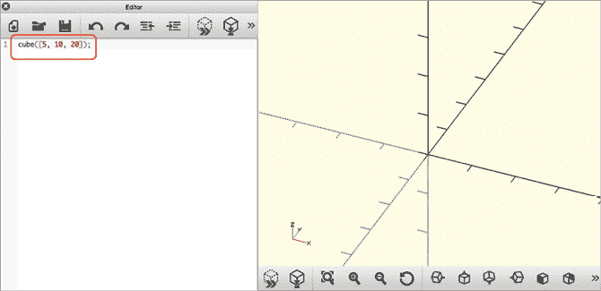

图 1-1：编辑器窗口中的立方体代码

这条 OpenSCAD 代码语句有两个部分。第一部分指定你想绘制的形状类型（在本例中是长方体）。第二部分包含所谓的*参数*，指示该形状的属性。参数允许你指定修改形状外观的值。参数总是放在括号`( )`内。

接下来，通过点击**预览**按钮（图 1-2 中的红圈所示）在预览窗口中绘制你的形状，以查看设计的快速视觉预览。

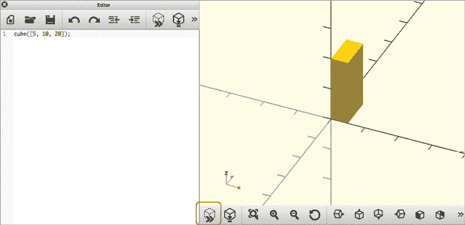

图 1-2：点击预览按钮后绘制立方体

## 绘制基本的 3D 形状

本节将教你如何编写 OpenSCAD 代码来绘制长方体（立方体或 3D 矩形）、球体和圆柱体，并学习如何从其他设计程序导入形状。

### 使用 cube 绘制长方体

使用`cube`命令来创建一个长方体（如图 1-2 所示）：

```
cube([5, 10, 20]);
```

语句的第一部分，`cube`，表示你想要绘制一个长方体。括号内的参数通过指定长方体的大小来修改`cube`命令。方括号（`[ ]`）表示一个*向量*，用于组织长方体的三个维度。向量中数字的顺序很重要：5 是长方体在 x 轴上的宽度，10 是长方体在 y 轴上的长度，20 是长方体在 z 轴上的高度。最后，用分号（`;`）标记语句的结尾。

请注意，长方体的一个角与*原点*接触：三个坐标轴交汇的点，表示为坐标(0, 0, 0)。

### 使用 sphere 绘制球体

要绘制一个球体，使用`sphere`命令，后面跟着球体半径的括号表示其大小。例如，以下语句绘制了一个半径为 10 单位的球体（见图 1-3）：

```
sphere(10);
```

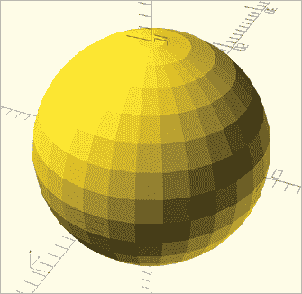

图 1-3：一个半径为 10 单位的球体

你可以通过改变球体的半径来改变球体的大小。与长方体不同，长方体可能有三个不同的尺寸：宽度、长度和高度，而球体在三个轴上的尺寸是相同的。这就是为什么基本的`sphere`命令中括号内只有一个数字。与`cube`命令一样，用分号标记代码语句的结尾。但与`cube`命令不同，OpenSCAD 会将球体围绕原点居中。

### 使用 cylinder 绘制圆柱体和圆锥体

要绘制圆柱体，使用`cylinder`命令，后面跟着包含圆柱体高度以及构成其顶部和底部的两个圆的半径长度的括号。以下语句绘制了一个两个半径相同的圆柱体（见图 1-4）：

```
cylinder(h=20, r1=5, r2=5);
```

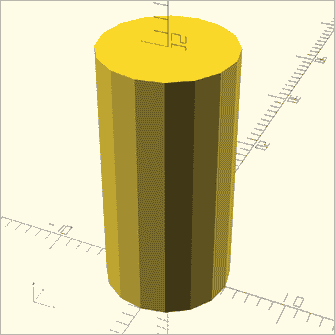

图 1-4：一个高度为 20 单位，底部半径为 5 单位，顶部半径为 5 单位的圆柱体

因为跟踪圆柱体的三个参数可能会令人困惑，OpenSCAD 允许你为每个参数标注名称，并按任意顺序包含它们。在括号内，设置以下值：`h`，表示圆柱体沿 z 轴的高度；`r1`，表示圆柱体底部的半径；`r2`，表示圆柱体顶部的半径。与`sphere`和`cube`命令一样，用分号标记语句的结尾。

圆柱体的两个半径不需要相同。当它们不同的时候，圆柱看起来更像一个顶部被切掉的圆锥（或者，根据数学家的说法，是一个截头圆锥），如图 1-5 所示：

```
cylinder(h=20, r1=5, r2=3);
```

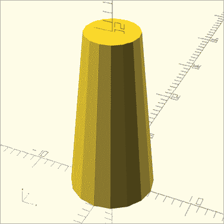

图 1-5：一个高度为 20 单位，底部半径为 5 单位，顶部半径为 3 单位的圆锥

你可以通过将其中一个半径设置为`0`来绘制一个尖顶圆锥，如图 1-6 所示：

```
cylinder(h=20, r1=0, r2=5);
```

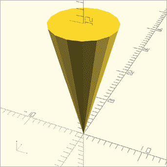

图 1-6：一个高度为 20 单位，底部半径为 0 单位，顶部半径为 5 单位的尖锥

还要注意，与通过 `sphere` 和 `cube` 命令绘制的形状不同，圆柱体是围绕 z 轴居中的，一个面接触 xy 平面。

## 使用 import 导入 3D 模型

OpenSCAD 允许你从其他 3D 设计程序中导入形状，前提是它们以 *.stl* 格式保存，这是 3D 模型的常见格式。你可以通过 `import` 命令导入这些现有的 3D 形状。例如，使用以下语句导入一个名为 *3DBenchy.stl* 的流行文件（图 1-7）：

```
import("3DBenchy.stl");
```

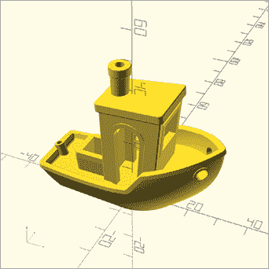

图 1-7：一个导入的 3D 模型船只，通常用于校准 3D 打印机

要导入 3D 形状，在 `import` 命令后将 *.stl* 文件的名称放在括号内。用引号（`"` `"`)将文件名括起来，表示文件名是字面文本，不应被 OpenSCAD 解释。请注意，你应该将 *.stl* 文件保存在与 OpenSCAD 程序相同的文件夹/目录中，并在生成设计预览之前保存 OpenSCAD 程序，否则 OpenSCAD 可能无法找到该文件。用分号标记语句的结尾。

## 修改基本形状

在 OpenSCAD 中修改绘制的形状的一些基本方法包括移动或平滑它们。

### 移动形状

如果你正在创建的设计有多个形状，你需要知道如何在预览窗口中移动这些形状。否则，默认情况下它们会叠加在一起，你可能无法看到不同大小的形状。例如，考虑以下设计（图 1-8）：

```
cube([20, 10, 10]);
sphere(5);
cylinder(h=30, r1=2, r2=2);
```

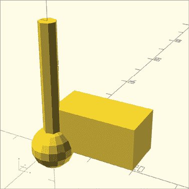

图 1-8：多个默认位置绘制的形状

#### 使用 center=true 居中形状

默认情况下，`sphere` 命令绘制一个以原点为中心的球体；`cube`、`cylinder` 和 `import` 命令则不会这样做。如果你希望绘制其他形状并使它们也围绕原点居中，可以在括号内添加 `center=true` 参数，如以下代码片段所示（图 1-9）：

```
cube([5, 10, 20], center=true);
```

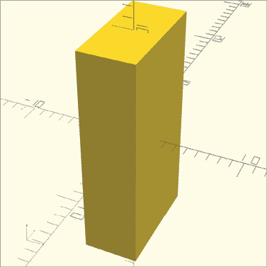

图 1-9：一个以原点为中心的长方体

现在，长方体的中心将位于 (0, 0, 0)。你还可以为圆柱体形状添加 `center=true` 参数，以便将圆柱体和圆锥体围绕原点居中。对于导入的形状，不能使用 `center=true` 进行居中。

#### 使用 translate 将形状移动到特定位置

要将形状移动到预览窗口中的特定位置，可以使用 `translate` 操作。此操作会整体修改形状，因此它会被包含在它所要修改的形状之前。

例如，以下语句绘制一个长方体，长方体相对于其默认位置在 x 轴负方向平移了 10 个单位，在 y 轴正方向平移了 20 个单位，z 轴方向平移了 0 个单位（图 1-10）：

```
translate([-10, 20, 0]) cube([20, 10, 10]);
```

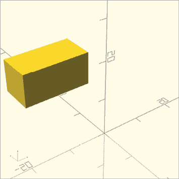

图 1-10：一个平移后的长方体，起始角落位于（–10, 20, 0）

`translate`操作使用方括号将 x、y 和 z 维度组合成一个向量。类似于指定立方体形状的尺寸，向量中数字的顺序也很重要。平移向量中的第一个数字描述沿 x 轴的移动；第二个数字描述沿 y 轴的移动；第三个数字描述沿 z 轴的移动。最后，用分号标记整个语句的结束。

你可能已经注意到，你用来修改`translate`操作的向量会移动形状的起始角落——默认情况下，起始角落是与原点相接触的。图 1-11 展示了`translate`操作如何相对于原点移动长方体（原始立方体以灰色显示）。你可以使用坐标轴图例预测在应用`translate`操作后形状的位置。

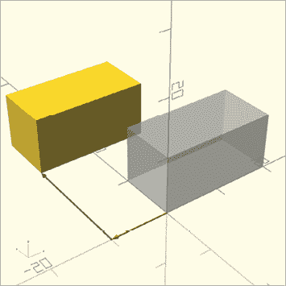

图 1-11：一个在 x 轴上平移了 10 个单位，在 y 轴上平移了 20 个单位的长方体，与位于原点的相同大小的长方体进行比较

要创建更复杂的设计，你可能需要将形状以不同的配置进行移动。在命令前使用`translate`操作可以将形状移动到不同的位置。例如，以下语句在一个预览窗口中绘制了一个长方体、一个球体和一个圆柱体（图 1-12）：

```
translate([-10, 10, 0]) cube([20, 10, 10]);
translate([20, 0, 0]) sphere(5);
translate([0, 0, -10]) cylinder(h=30, r1=2, r2=2);
```


图 1-12：三个不同的形状，从默认位置进行平移

球体和圆柱体分别根据它们各自的中心点进行移动，而立方体则相对于与原点接触的角落进行移动。注意，如果你对一个已经居中的立方体和圆柱体应用相同的平移操作，运动是不同的（图 1-13）：

```
translate([-10, 10, 0]) cube([20, 10, 10], center=true);
translate([20, 0, 0]) sphere(5);
translate([0, 0, -10]) cylinder(h=30, r1=2, r2=2, center=true);
```

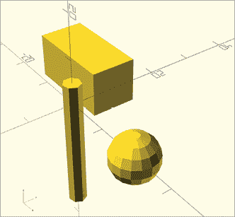

图 1-13：三个不同的形状，从中心位置进行平移

### 使用$fn 平滑曲线

你可能会想知道，为什么到目前为止你画的球体和圆柱体看起来不像是圆的，而是由一系列平面组成的。这是因为 OpenSCAD 和大多数 3D 设计软件一样，使用一组直线来近似曲线。为了节省内存并减少绘制复杂形状所需的处理时间，OpenSCAD 默认使用了相对较少的这些直线。例如，图 1-13 中展示的圆柱体，仅使用了六条线段来近似圆柱体圆形面上的曲线。

要使你的圆柱体和球体更平滑，可以通过包含 `$fn` 参数来指定用于近似曲线的线段数量。例如，将 `$fn` 设置为 10 会使圆柱体看起来更圆，因为它用 10 条线段绘制圆柱体的圆周（图 1-14）：

```
cylinder(h=20, r1=2, r2=2, $fn=10);
```

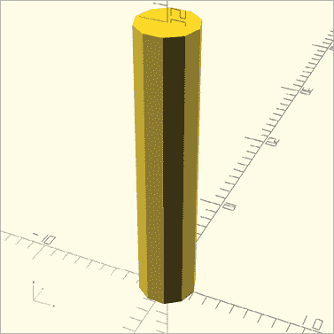

图 1-14：使用 10 条线段近似圆柱体的曲线

与其他参数一样，在命令中的括号内包含 `$fn`。

尽管 图 1-14 中的圆柱体比默认圆柱体更圆，但它仍然不够圆。增加 `$fn` 到更大的值，以使圆柱体更圆（图 1-15）：

```
cylinder(h=20, r1=2, r2=2, $fn=50);
```

使用 50 个线段时，圆柱体中的曲线看起来更平滑。然而，超过某个点后，增加 `$fn` 将不再产生明显效果。另外，请注意，OpenSCAD 在生成具有较大 `$fn` 值的形状时需要更长的时间（因为需要生成更多的细节），因此在设置 `$fn` 时需要考虑平滑度与计算开销之间的权衡。通常，`$fn=50` 会产生足够的“圆滑度”。

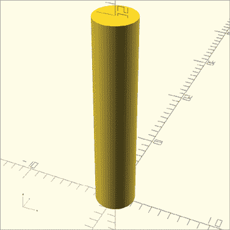

图 1-15：使用 50 条线段近似的圆柱体曲线

## 使用布尔操作组合 3D 形状

有时你可能需要创建比目前所做的基本形状更复杂的形状。OpenSCAD 中的 *布尔* 操作允许你将多个形状（如长方体、球体、圆柱体和圆锥体）组合成一个形状（图 1-16）。你可以通过使用三种操作之一：`union`、`difference` 或 `intersection` 来实现这一点。

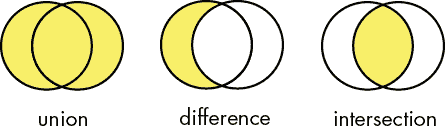

图 1-16：基本布尔操作的示意图

`union` 操作将两个形状合并，`difference` 操作从一个形状中减去另一个形状，而 `intersection` 操作只保留两个形状相交的部分。

### 使用 `difference` 减去形状

我们从使用 `difference` 操作减去形状开始（图 1-17）：

```
difference() {
    cube([10, 10, 10]);
    sphere(5);
}
```

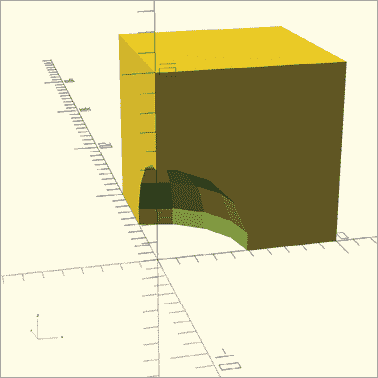

图 1-17：从长方体中减去一个球体，使用 `difference` 操作

指定一个 `difference` 操作，后跟一对括号，然后在一对大括号中输入至少两个命令。使用 `difference` 操作时顺序很重要；它只保留第一个形状，移除该形状与其他形状相交的部分。在 图 1-18 中注意，如果交换两个形状的顺序，会发生什么情况：

```
difference() {
    sphere(5);   
    cube([10, 10, 10]);
}
```

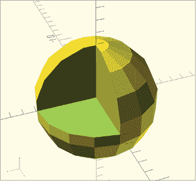

图 1-18：从球体中减去一个长方体，使用 `difference` 操作

逆转操作会创建一个缺失切片的球体，精确地在 `cube` 在原始球体上绘制长方体形状的位置。

#### 使用 # 调试差集操作

由于被减去的形状在设计中不再可见，因此很容易失去对其形状的跟踪。为了简化操作，可以在被减去的形状前加上哈希符号（`#`），以创建该形状的幽灵版本。以下代码与绘制图 1-17 的代码相同，只是它使用哈希符号将球体呈现为幽灵般的图像（图 1-19）：

```
difference() {
    cube([10, 10, 10]);
    #sphere(5);
}
```

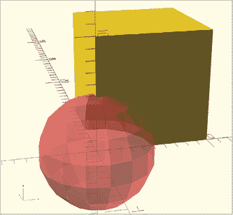

图 1-19：为帮助解决问题，减去的球体的幽灵版本

使用哈希符号帮助调试设计，然后在设计正确时，确保从代码中删除哈希符号。

#### 使用`difference`操作避免“闪烁墙壁”

当使用`difference`操作减去形状时，有时会出现类似图 1-20 中那样的“闪烁墙壁”。

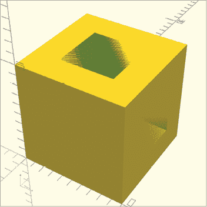

图 1-20：从较大的立方体中减去两个立方体形成闪烁墙壁

闪烁墙壁出现的原因是被减去的形状与它们所减去的形状共享一个面。这会创建一个模糊的情境：应该保留面，还是将其减去？由于这个问题，带有闪烁墙壁的模型无法进行 3D 打印。

为了解决这个问题，只需减去稍微超过外部形状大小的形状（图 1-21）。

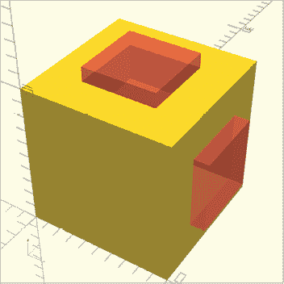

图 1-21：从外部立方体中减去两个稍微更大的立方体

一旦你删除了幽灵形状，剩余的形状应不包含任何闪烁墙壁（图 1-22）：

```
difference() {
    cube([10, 10, 10]);

    translate([-1, 2.5, 2.5]) cube([12, 5, 5]);
    translate([2.5, 2.5, -1]) cube([5, 5, 12]);
}
```

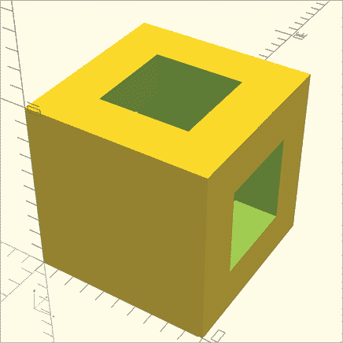

图 1-22：适合 3D 打印的减去形状

现在你应该能够 3D 打印这个设计了。

### 使用`intersection`操作雕刻重叠形状

你还可以通过使用`intersection`操作（图 1-23）雕刻出两个形状的重叠部分以外的所有部分。

```
intersection() {
    sphere(5);   
    cube([10, 10, 10]);
}
```

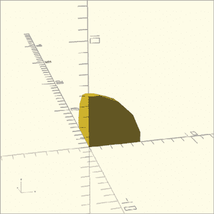

图 1-23：使用`intersection`操作绘制的重叠球体和立方体的切割图

首先，指明`intersection`操作，后跟圆括号，然后在大括号之间输入至少两个命令。与`difference`操作不同，在`intersection`中，包含形状的顺序无关紧要。

### 使用`union`操作组合形状

要将形状组合成一个实体，使用`union`操作（图 1-24）：

```
union() {
    cube([10, 10, 10]);
    sphere(5);
}
```

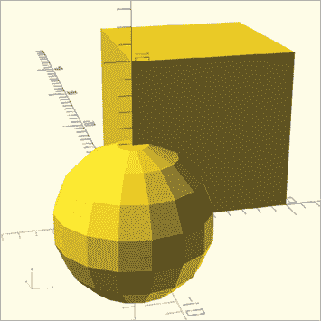

图 1-24：使用`union`操作将球体和立方体组合在一起

`union`操作将大括号内的所有形状合并为一个形状。对大括号之间的所有行进行缩进，使代码可读且易于理解。与`intersection`和`difference`类似，`union`操作无法修改，因此你永远不需要在其圆括号内添加任何信息。

尽管看起来你可以通过简单地将形状画在一起合并它们，但每个形状仍然保持独立实体。当使用 `difference` 操作时，这可能会成为问题，因为该操作仅从大括号中的第一个形状中进行减法。为避免这个问题，你可以通过使用 `union` 操作将多个形状组合成一个形状。然后，将这个组合形状作为第一个形状包含在 `difference` 中。例如，下面的程序使用 `union` 操作同时从两个形状中减去一个球体（见图 1-25）：

```
difference() {
    union() {
      cube([10, 10, 10]);
      cylinder(h=10, r1=2, r2=2);
    }
    sphere(5);
}
```

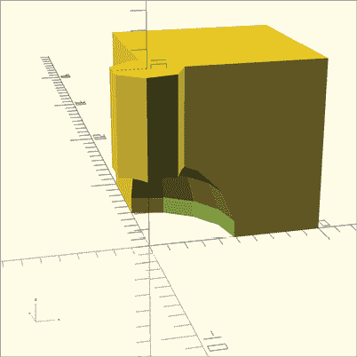

图 1-25：一个球体从圆柱体中减去并与`union`结合在一起的立方体

OpenSCAD 首先将立方体和圆柱体组合成一个形状，然后从该新形状中减去球体。如果没有 `union` 操作，OpenSCAD 将分别从立方体中减去圆柱体和球体（见图 1-26）。

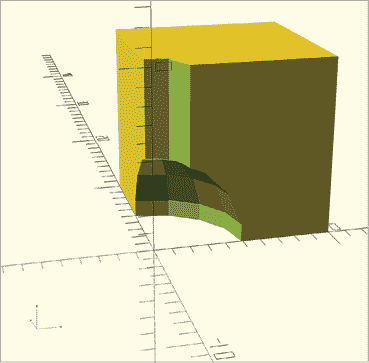

图 1-26：一个球体和一个圆柱体从立方体中减去

一旦你通过 `difference`、`intersection` 或 `union` 创建了一个复杂形状，计算机可以轻松地将其分解为几何原型，以生成你设计的准确 3D 模型。然后，你可以在 3D 打印机上打印这个复杂的 3D 模型，或者将其导入到 3D 虚拟现实程序中。

## 准备 3D 打印

当你准备将 OpenSCAD 设计发送到另一个应用程序进行 3D 打印时，你需要从 OpenSCAD 导出设计的 *.stl* 版本。然后，你可以将此文件导入到 3D 打印准备软件中，调整设置，再用 3D 打印机将其转化为物理对象。

要导出设计的 *.stl* 版本，首先通过点击**渲染**按钮（在图 1-27 中以红色圈出）渲染你的设计。而预览功能生成的是模型的快速图像，渲染则完全计算出定义模型所需的所有表面。特别复杂的设计需要更多的表面，因此渲染时间可能较慢。

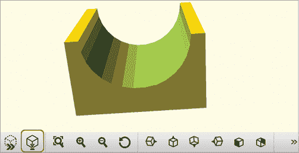

图 1-27：使用渲染按钮渲染设计

最后，选择**文件**▶**导出**▶**导出为 STL**将设计导出为 *.stl* 文件（见图 1-28）。

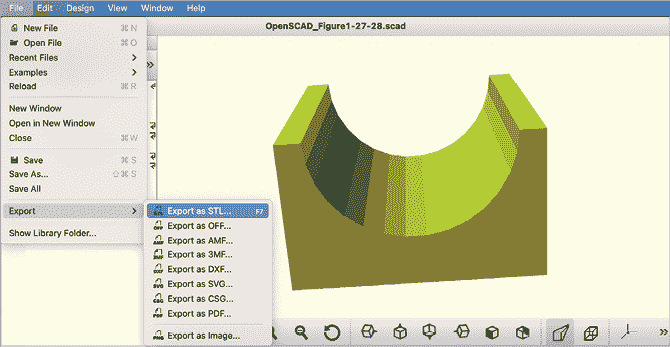

图 1-28：将设计导出为 *.stl* 文件

## 总结

恭喜！现在你应该能够创建包括立方体、球体和圆柱体在内的任何大小的设计，并将它们绘制在 OpenSCAD 的预览窗口中。你还可以导入 3D 形状、平滑曲线，并将形状移动到 x、y 和 z 轴上的任意位置。最后，你应该知道如何通过分组、减法和切割重叠的形状来创建由基本形状构成的复杂设计。

这里有一些需要记住的重要事项：

+   OpenSCAD 命令的名称描述了你希望绘制的形状类型。

+   命令后跟括号。括号`( )`内的信息修改命令。括号内的值被称为*参数*。你可以把参数看作是描述形状特征的形容词。

+   分号（`;`）标志着大多数语句的结束。语句可以包含命令和操作。

+   使用`translate`操作来移动预览窗口中的形状。通过改变`translate`操作的向量参数来指示移动的数量和方向。

+   方括号（`[ ]`）将数字组合在一起形成一个向量。向量内数字的顺序很重要。

+   布尔操作使用花括号（`{ }`）将多个形状组合在一起。这些花括号也构成一个完整的 OpenSCAD 语句，并且不需要使用分号来结束语句。

+   括号、方括号和花括号总是成对出现。

+   `$fn`可以作为参数来改变单个形状的平滑度。你也可以在代码的开始处将`$fn`设置为一个高值，以便为设计中的每个形状生成平滑曲线。较高的`$fn`值可能会导致渲染时间变慢。

+   使用缩进来帮助使你的代码更具可读性和易于理解。

+   设计必须在导出为*.stl*文件之前先进行*渲染*。
