# 第二章：更多的形状变换方式


本章介绍了一系列变换操作，帮助你在创建复杂形状时拥有更多控制权。你将学习如何旋转、反射和缩放形状；如何将它们与共享的外壳结合；以及如何圆化它们的边缘。这些变换操作将扩展你的建模工具箱，使你能够创造出更加复杂的设计。

## OpenSCAD 形状变换

首先，你将学习如何使用三种变换操作：`rotate`、`mirror` 和 `resize`。*变换操作*是一段紧接在形状之前的代码，用来改变形状的位置、大小或方向。为了说明目的，在本章的示例中，我们包括了一个透明的灰色轮廓，以指示原始的、未变换的形状应该出现的位置。

### 使用 rotate 旋转形状

默认情况下，OpenSCAD 绘制的形状都是按某种特定方式定向的。例如，它绘制的球形是以 (0, 0, 0) 为中心，立方体的一个角落位于 (0, 0, 0)。但是有时，你可能希望你的形状有不同的方向。

改变形状的默认位置的一种方法是*旋转*它。要旋转形状，需要指定围绕三个轴的旋转角度，并且这些旋转角度可以是正数也可以是负数，单位是度。

以下代码片段将一个长方体围绕 x 轴旋转 90 度（图 2-1）：

```
rotate([90, 0, 0]) cube([30, 20, 10]);
```

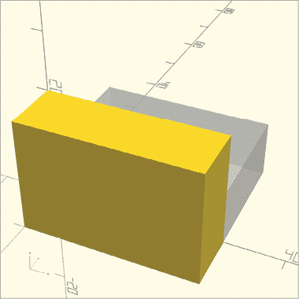

图 2-1：一个围绕 x 轴旋转 90 度的长方体

首先，写下变换的名称，然后在括号内，给 `rotate` 提供一个用方括号（`[ ]`）括起来的向量，以将三个旋转轴组合在一起。向量中的第一个元素是围绕 x 轴的旋转角度，第二个是围绕 y 轴的旋转角度，第三个是围绕 z 轴的旋转角度。接着，编写你想要旋转的形状的代码。像往常一样，使用分号（`;`）结束整个语句。

因为你将形状围绕 x 轴旋转了 90 度，所以其在 x 轴上的位置保持不变，而它在 yz 平面上的位置发生了变化。

以下代码片段将相同的长方体围绕 y 轴旋转（图 2-2）：

```
rotate([0, 180, 0]) cube([30, 20, 10]);
```

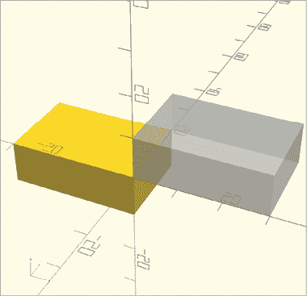

图 2-2：一个围绕 y 轴旋转 180 度的长方体

在这种情况下，形状相对于 y 轴的位置保持不变，它在 xz 平面上的位置旋转了 180 度。

你也可以通过一个操作围绕两个轴旋转形状，如下示例所示（图 2-3）：

```
rotate([-90, 0, -90]) cube([30, 20, 10]);
```

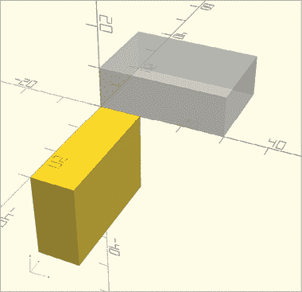

图 2-3：一个围绕 x 轴旋转 90 度，围绕 z 轴旋转 90 度的长方体

这个长方体绕 x 轴和 z 轴进行了旋转。你可以更容易地将这个操作想象成两个独立的变换：一个是绕 x 轴旋转，另一个是绕 z 轴旋转。要使形状在两个方向上逆时针旋转 90 度，设置这两个轴的旋转角度为–90\。

尽管通过只应用一次旋转操作可以实现绕多个轴的旋转，但最好将不同的旋转分成单独的、重复的变换。这是因为有时很难预测哪个旋转会首先应用。考虑一下，当绕 z 轴的旋转在绕 x 轴旋转之前应用时，长方体的位置差异（图 2-4）：

```
rotate([-90, 0, 0]) rotate([0, 0, -90]) cube([30, 20, 10]);
```

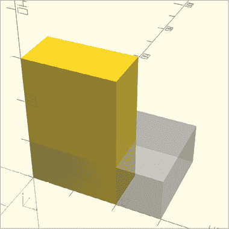

图 2-4：一个绕 z 轴旋转–90 度，然后绕 x 轴旋转–90 度的长方体

按照预期顺序显式地应用多个旋转操作，将导致形状在旋转应用后精确地出现在你想要的位置。

### 使用镜面反射形状

改变形状的默认位置的另一种方式是通过`mirror`变换将其*反射*到一个虚拟的二维平面上。正如你从操作名称中可以预期的那样，`mirror`会创建一个形状的镜像反射。以下语句将在 yz 平面上反射一个截头圆锥（图 2-5）：

```
mirror([10, 0, 0])
  translate([0, 10, 0]) rotate([0, 90, 0]) cylinder(h=10, r1=5, r2=2); 
```

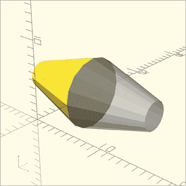

图 2-5：通过向量[10, 0, 0]在 yz 平面上反射的截头圆锥

你传递给`mirror`的向量包含了定义一个虚拟点的 x、y、z 坐标。OpenSCAD 然后从原点画一条到该点的虚拟线，并使用与该线在原点处垂直的 2D 平面作为*镜面*或反射平面。

为了更清楚地说明，图 2-6 将“镜面”显示为半透明的平面。

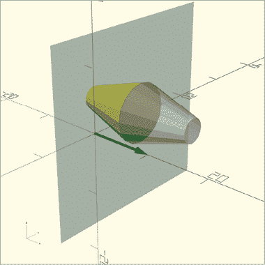

图 2-6：通过向量[10, 0, 0]在 yz 平面上反射的截头圆锥

“镜面”与向量垂直，如绿色所示，连接从(0, 0, 0)到(10, 0, 0)的线。注意，创建这个镜面时并不需要使用 10 作为 x 轴的值；任何非零的 x 轴值都能使镜面操作表现相同，因为你的目标只是指定一个与镜面垂直的向量。*镜面平面*始终包含原点(0, 0, 0)。实际上，`mirror`操作的向量参数描述了镜面是如何旋转的。

下一条语句将圆柱体通过 xy 平面反射（图 2-7）：

```
mirror([0, 0, 10]) cylinder(h=10, r1=2, r2=5);
```

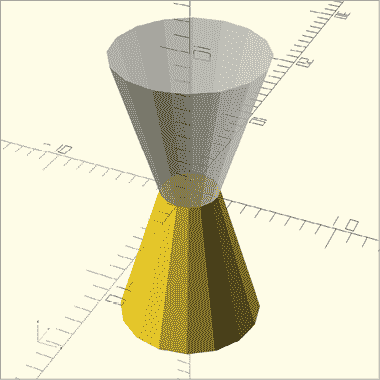

图 2-7：通过向量[0, 0, 10]在 xy 平面上反射的圆锥体

这个示例定义了一个位于(0, 0, 10)的点，从定义的点到原点的直线垂直于 xy 平面。`mirror`操作特别适用于快速创建涉及对称的复杂形状。在这种情况下使用`mirror`操作可能会节省时间，因为你只需要设计对象的一半，然后使用`mirror`创建第二半。

请注意，`mirror`操作并不会复制形状；它将形状移动到镜像位置。如果你想要一个完全对称的形状，首先创建形状，然后在它前面使用`mirror`操作重复它。

### 使用`resize`缩放形状

`resize`操作允许你拉伸或缩小单个形状的特定维度。当你调整形状的大小时，你可以指定每个轴上的确切尺寸。例如，通过将球体沿单一轴方向拉伸，你可以将它变成一个椭球体（一个被拉长的球体）。

以下代码片段使用`resize`将一个半径为 1 的球体缩放成椭球体（图 2-8）：

```
resize([10, 10, 20]) sphere(1, $fn=100);
```

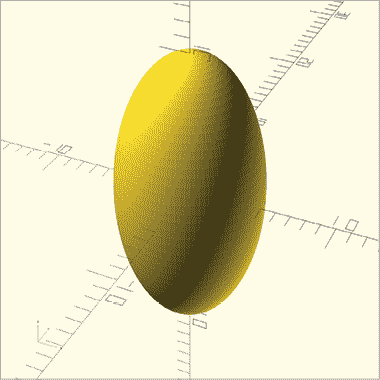

图 2-8：一个被调整尺寸的球体

在编写形状命令之前，将一个向量传递给`resize`操作，将球体在 x、y 和 z 轴上的新维度组合起来。与所有变换一样，使用分号结束整个语句。

新的椭球体沿 x 轴、y 轴和 z 轴两侧分别拉伸 5 单位、5 单位和 10 单位。

你也可以使用`resize`来转换一个基本圆柱体（图 2-9）：

```
resize([10, 5, 20]) cylinder(h=5, r1=5, r2=5);
```

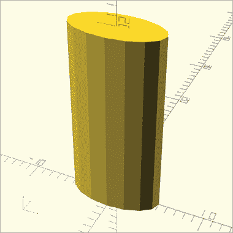

图 2-9：一个调整尺寸的圆柱体

该语句调整了一个基本圆柱体的尺寸，圆柱体的高度和两个半径为 5 单位，使得变换后的圆柱体沿 x 轴（通过原点）拉伸 10 单位，沿 y 轴（同样通过原点）拉伸 5 单位，沿 z 轴（从原点开始）拉伸 20 单位。

## 更多合并 3D 形状的方法

在第一章中，你学习了三种布尔操作，它们允许你合并多个 3D 形状：`union`、`difference`和`intersection`。你也可以使用`hull`和`minkowski`操作将两个形状合并成一个。

### 使用`hull`合并形状

`hull`操作会在两个形状周围创建一个凸包（或外壳）。为了理解这一点，可以想象将气球紧紧地包围住两个或更多的形状，形成一个单一的形状。例如，以下代码创建了一个包围球体和立方体的气球（图 2-10）：

```
hull() {
    translate([10, 0, 0]) sphere(8);
    translate([-10, 0, 0]) cube([4, 4, 4], center=true);
}
```

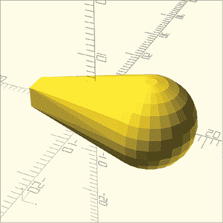

图 2-10：一个包围小立方体和大球体的凸包

`hull`操作与第一章中描述的布尔操作语法相同。它可以合并两个或更多的形状，与`union`操作一样，形状的顺序并不重要。

### 使用 Minkowski 合并形状

`minkowski`操作创建了一种*Minkowski 和*，即它将一个形状的边缘与第二个形状的特征相结合。以下示例将一个球体包裹在圆柱体的边缘，以创建圆角（图 2-11）：

```
$fn=50;
minkowski() {
    cylinder(h=15, r1=5, r2=5);
    sphere(4);
}
```

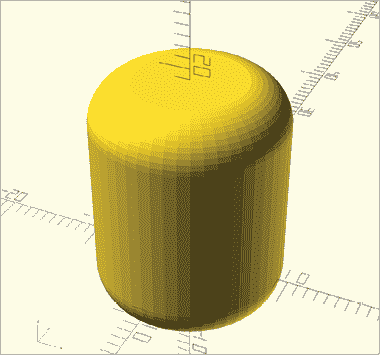

图 2-11：用球体平滑圆柱体的角落

`minkowski`操作的语法与第一章描述的布尔操作相同。在这个例子中，由于较小的球体已经沿着圆柱体的边缘进行了浮雕处理，圆柱体的边缘变成了圆角。需要注意的是，`minkowski`操作会生成比原始圆柱体更大的形状，因为将球体包裹在原始圆柱体周围会增加体积。

## 组合变换

您可以通过将一个操作写在另一个操作前面来组合变换操作。例如，以下代码片段在三个圆柱体上分别先应用`rotate`操作，再应用`translate`操作（图 2-12）：

```
translate([5, 0, 0]) rotate([90, 0, 0]) cylinder(h=10, r1=4, r2=4);
translate([5, 0, 0]) rotate([0, 90, 0]) cylinder(h=10, r1=4, r2=4);
translate([5, 0, 0]) rotate([0, 0, 90]) cylinder(h=10, r1=4, r2=4);
```

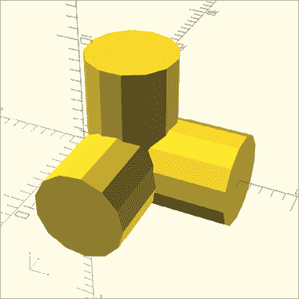

图 2-12：三个圆柱体，先旋转后平移

OpenSCAD 首先执行最内层的变换（直接位于形状左侧的操作），然后应用最外层的变换。如果您按相反顺序应用变换，结果将不同。以下代码片段在`rotate`操作之前应用了`translate`操作（图 2-13）：

```
rotate([90, 0, 0]) translate([5, 0, 0]) cylinder(h=10, r1=4, r2=4);
rotate([0, 90, 0]) translate([5, 0, 0]) cylinder(h=10, r1=4, r2=4);
rotate([0, 0, 90]) translate([5, 0, 0]) cylinder(h=10, r1=4, r2=4);
```

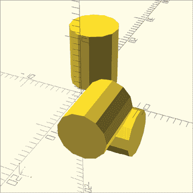

图 2-13：三个圆柱体，先平移后旋转

由于 OpenSCAD 按照顺序执行操作，从最接近形状的变换操作开始，您会得到不同的结果。

## 总结

本章介绍了几种用于变换形状的重要操作。现在，您可以移动、旋转、反射和调整形状的大小。您还可以通过围绕两个形状形成外壳或通过用另一个形状平滑一个形状的角落来组合两个形状。

以下是一些需要记住的重要点：

+   您可以对单个形状和组合形状应用变换操作。

+   使用`union`操作组合形状可以减少您在复杂设计中需要应用的变换操作次数。

+   应用一系列`rotate`操作通常比将多个旋转合并为一个`rotate`操作更容易管理。

+   使用`mirror`反射组合形状可以节省时间，特别是在构建对称设计时。

+   在应用多个变换操作时，顺序很重要。

+   最接近形状的变换操作会首先被应用。

在下一章中，您将学习如何将 2D 形状转换为 3D 形状，如何对 2D 形状应用变换操作，以及通过组合和操作基本的 2D 形状创建出令人惊讶的复杂 3D 形状。
