# 第三章：二维图形


你现在已经熟悉了一些基本的 OpenSCAD 指令，用于建模简单的三维图形，并且你已经见识过一些可以将这些基本图形转化为更复杂设计的操作。本章将教你如何创建和组合二维图形，以便构建更加复杂的三维设计。

我们将从向你展示如何绘制基本的二维图形开始，然后描述如何在这些基本二维图形的基础上构建复杂的三维设计。使用二维图形将使你能够创建一些使用你目前学到的三维图形和操作无法实现的设计。此外，了解如何创建二维图形在你为其他数字制造技术（如激光切割）设计时也很有用，尽管这超出了本书的范围。

## 绘制基本二维图形

和三维图形一样，你可以基于一些内置的二维基本图形（称为` circle`、` square`和` polygon`）来构建复杂的二维图形。

### 使用` circle`命令绘制圆形

` circle`命令允许你通过指定半径来绘制二维圆形，类似于第一章中的` sphere`命令。例如，以下语句绘制一个半径为 20 单位的圆形（图 3-1）：

```
circle(20);
```

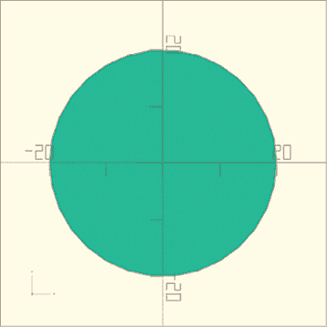

图 3-1：渲染的半径为 20 单位的圆形

点击**预览**按钮将渲染出一个略有深度的圆形（图 3-2）。

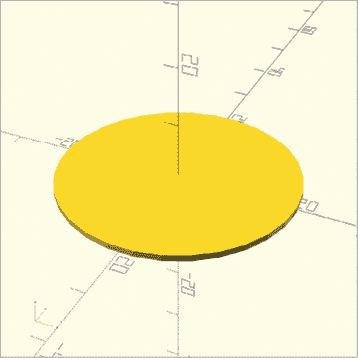

图 3-2：预览的半径为 20 单位的圆形

然而，二维图形没有深度。它们只存在于 xy 平面中。要以没有深度的真实形式查看二维图形，请使用**渲染**按钮。（请注意，在渲染模式下不可能将二维和三维图形混合使用。）由于二维图形没有深度，因此最容易使用工具栏上的顶视图图标来创建二维设计（图 3-3）。

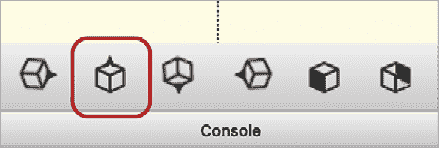

图 3-3：顶视图图标

### 使用` square`绘制矩形

二维` square`命令，用于绘制矩形，指定 x 和 y 维度作为一个向量参数。以下语句绘制一个矩形，矩形沿 x 轴延伸 25 个单位，沿 y 轴延伸 10 个单位（图 3-4）：

```
square([25, 10]);
```

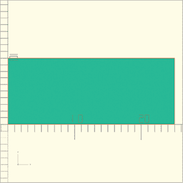

图 3-4：宽度为 25，高度为 10 单位的矩形

使用` square`命令表示你想绘制一个矩形，后面跟着一对圆括号。在圆括号内放入方括号，然后在方括号内输入矩形的尺寸，尺寸之间用逗号隔开。这个二维向量只需要 x 和 y 维度，而不像三维向量（x, y, z）那样需要三维立方体的尺寸。向量中的第一个数字表示矩形沿 x 轴的宽度，第二个数字表示矩形沿 y 轴的长度。

记得你需要点击**渲染**按钮才能将矩形显示为二维图形。

### 使用` polygon`命令绘制多边形

如果你想创建一个 OpenSCAD 中没有内置的二维形状，你可以使用`polygon`命令来创建你自己的二维形状。

以下语句使用`polygon`命令绘制一个三角形，顶点分别为[0, 0]，[10, 0]和[10, 10]（图 3-5）：

```
polygon([ [0, 0], [10, 0], [10, 10] ]);
```

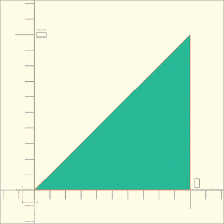

图 3-5：一个具有三个顶点的三角形

多边形由一组形状的角点（*顶点*）定义。列表中的每个顶点都是一个包含多边形角点坐标的向量。将每个顶点作为一个向量放在方括号中，然后再在整个顶点列表周围加上一对方括号，将所有顶点组织为向量的向量。

一定要按顺序列出顶点，就像你绕着多边形的边缘行走一样（可以是任意方向）。另外，你不需要重复指定起始点；OpenSCAD 会自动为你完成多边形的绘制。

由于多边形可以有任意数量的顶点，你可以创建越来越复杂的形状，像这样一个有八个顶点的形状，通过以下语句绘制（图 3-6）：

```
polygon([
  [ 0,  0], [20,  0],
  [20,  5], [ 5,  5],
  [ 5, 10], [20, 10],
  [20, 15], [ 0, 15]
]);
```

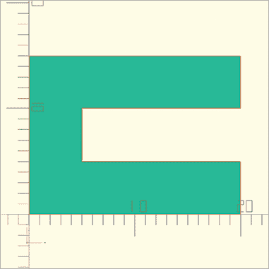

图 3-6：一个具有八个顶点的更复杂的多边形

### 使用文本绘制单词

在设计中使用二维形状的另一种方法是创建符号化的图案，例如文字。使用文本元素可以为你的设计增添个性化。你也可以使用表情符号字体来访问预先绘制的符号，或者仅仅在设计上印上版本号或序列号。

使用`text`命令在 OpenSCAD 中绘制文本形状。OpenSCAD 中的文本（和其他编程语言一样）被视为*字符串*。由于字符串的长度可以是任意的，因此使用双引号（`" "`）来表示文本串的开始和结束。文本串可以包含字母、标点符号、数字，且如果所使用的字体支持 Unicode，还可以包含表情符号字符。

这条语句创建了字符串`"Hello, OpenSCAD"`（图 3-7）：

```
text("Hello, OpenSCAD", size=10);
```

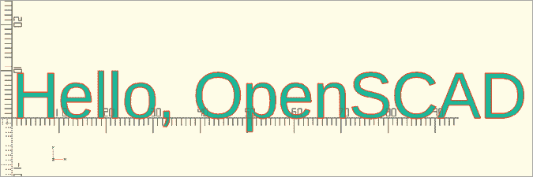

图 3-7：创建一个二维`text`形状

在`text`命令后面跟上括号，括号中包含一个字符串。字符串应该以双引号（`" "`）开始和结束。括号还可以包含一个可选的`size`参数，设置文本大小，这里设置为 10。注意在图 3-7 中，字符串中最高的字母达到了 y 轴上的第一个刻度（代表 10 单位）。

对于文本形状，`size`参数是可选的。如果省略`size`参数，默认的文本大小为 10。绘制文本形状的另一个可选参数是`font`。你还可以使用可选的`font`参数来绘制计算机上安装的任何字体的文本。以下语句绘制了一个 Courier 字体的文本串（图 3-8）：

```
text("Hello, OpenSCAD", font="Courier");
```

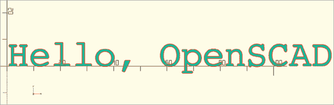

图 3-8：将`text`形状的字体更改为 Courier

支持 Unicode 字符的字体通常包含表情符号。你可以绘制该字体支持的任何字符，包括表情符号形状（图 3-9）：

```
text("♕", font="Arial Unicode MS");
```


图 3-9：使用`text`绘制王冠表情符号

也可以使用`text`命令绘制数字值。如果你想创建一个带有数字值的形状（图 3-10），请务必使用`str`函数将该值转换为字符串：

```
text(str(123), size=20);
```


图 3-10：绘制带有数字的`text`形状

不要将数字放在引号之间，而是对数字值应用`str`函数，将其转换为字符串。当数字值存储在变量中时，这尤其有用，正如我们在第四章中看到的那样。

## 对 2D 形状应用变换和布尔操作

你可以将第一章和第二章中学到的相同变换和布尔操作应用到 2D 形状上——这与应用于 3D 形状时几乎没有区别。唯一的不同是，`translate`、`mirror`和`resize`操作不再需要 3D 向量，而是需要包含 x 和 y 坐标的 2D 向量，而`rotate`操作只需要一个旋转角度（针对 z 轴）。

例如，以下设计使用`translate`、`difference`和`rotate`来绘制一个倾斜的矩形，并从中切出三个圆形（图 3-11）：

```
rotate(30) {
    difference() {
        square([120, 40]);
        translate([20, 20]) circle(15);
        translate([60, 20]) circle(15);
        translate([100, 20]) circle(15);
    }
}
```

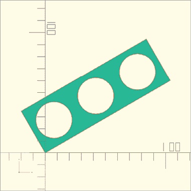

图 3-11：对 2D 形状应用变换和布尔操作

就像在 3D 形状中一样，对 2D 形状应用变换和布尔操作的顺序会影响最终形状的排列和位置。考虑从正方形中减去圆形与从圆形中减去正方形之间的区别。以下`difference`操作从正方形中减去圆形（图 3-12）：

```
difference() {
    square([5, 5]);
    circle(5, $fn=50);
}
```

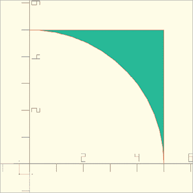

图 3-12：从正方形中减去圆形

而这个`difference`操作将一个正方形从圆形中减去（图 3-13）：

```
difference() {
    circle(5, $fn=50);
    square([5, 5]); 
}
```

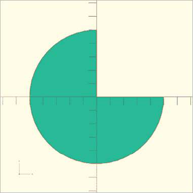

图 3-13：从圆形中减去正方形

## 使用`linear_extrude`垂直拉伸形状

你不能直接 3D 打印 2D 形状，但可以将它们作为构建 3D 形状的基本构件（这些 3D 形状随后可以被 3D 打印成物理物体）。本节描述了 OpenSCAD 用于从 2D 形状创建 3D 形状的两个强大操作。

`linear_extrude`操作将一个平面形状沿 z 轴“提升”，同时构建与形状初始边界相对应的墙壁。以下语句将字母* A *挤压成一个具有 5 个单位高度的 3D 形状（图 3-14）：

```
linear_extrude(5) text("A");
```

`linear_extrude` 操作接受一个参数，即你要创建的 3D 形状的高度，后跟你希望拉伸成 3D 的 2D 形状。和你已经知道的变换操作一样，整个语句以分号结束。

你也可以为 `linear_extrude` 操作提供可选参数 `twist`、`slices` 和 `scale` 来构建更复杂的 3D 形状。`twist` 参数指定在拉伸过程中扭转 2D 形状的角度。`slices` 参数控制扭转的平滑度——具体来说，控制完成扭转时使用多少个段落。由于拉伸会将形状向上扩展，因此每个段落都会变成一个水平的“切片”，这就是为什么该参数命名为 `slices`。如果你没有指定，OpenSCAD 会选择一个相对粗糙的值。`scale` 参数则在拉伸过程中改变 2D 形状的大小。

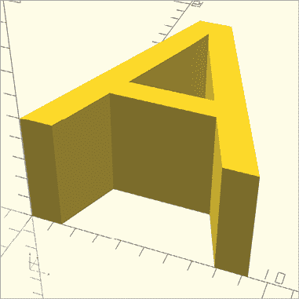

图 3-14：将 2D 形状线性拉伸成 3D 形状

使用所有这些参数，将矩形转换为在 图 3-15 中绘制的 3D 形状：

```
linear_extrude(100, twist=30, slices=25, scale=1/3) {
  square(100, center=true);
}
```

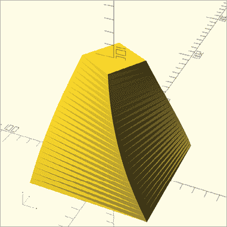

图 3-15：将 2D 形状通过 25 个水平切片扭曲、缩放并扩展为 3D 形状

`twist`、`slices` 和 `scale` 参数是可选的。尽管这个例子展示了同时使用这三个参数，但你可以选择任意组合，例如只使用 `scale` 或只使用 `twist`。

## 沿圆形路径拉伸形状，使用 `rotate_extrude`

与其沿直线路径拉伸 2D 形状，不如使用 `rotate_extrude` 操作将 2D 形状沿圆形路径移动，从而创建一个像*环形体*（图 3-16）的形状：

```
rotate_extrude() {
  translate([100, 0]) circle(40);
}
```

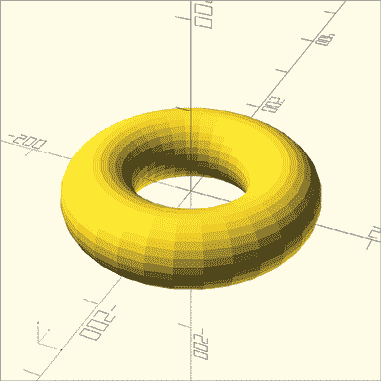

图 3-16：将 2D 圆形通过 `rotate_extrude` 操作转化为 3D 环形体

`rotate_extrude` 操作是一个两步过程，首先围绕 x 轴旋转 2D 形状 90 度，然后将 2D 形状沿 z 轴做圆形运动。如果你将结果中圆环的一部分切下来，这部分的形状会和原始的 2D 形状相似。

使用 `rotate_extrude` 时，要注意确保形状不会与自身相交。在绘制 图 3-16 的代码中，你可以通过先将形状从 z 轴上移开，确保 2D 形状的任何部分都不接触 z 轴，从而避免这种情况。

`rotate_extrude` 操作还接受一个可选的 `angle` 参数，允许你指定旋转角度。图 3-17 展示了一个在 z 轴上沿 135 度旋转拉伸的圆形。

```
rotate_extrude(angle=135) {
  translate([100, 0]) circle(40);
}
```

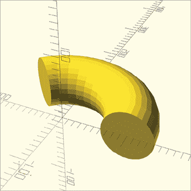

图 3-17：带有 135 度角度参数的 `rotate_extrude`

## 使用 offset 进行形状的放大和缩小

假设你想制作一个别致的十字形饼干切割器。你现在知道如何通过联合两个矩形来创建十字形，并且知道如何使用`linear_extrude`将其拉伸为三维物体。但要指定墙厚，你需要使用`offset`操作，它允许你通过特定的值来扩展或缩小一个形状。使用`offset`来通过缩小一个十字形并从较大的十字形中减去它，来空心化你的饼干切割器。

在以下设计中，给`offset`传递负值来缩小你的二维十字形（图 3-18）：

```
offset(-2) {
  union() {
    square([100, 30], center=true);
    square([30, 100], center=true);
  }
}
```

将要偏移的二维图形的代码放在大括号中，紧随`offset`操作。在括号内，指定偏移量（以毫米为单位）。正值将扩大形状，负值将缩小形状。

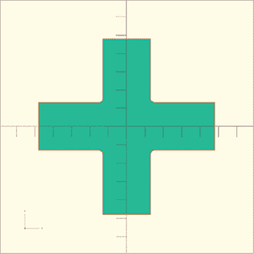

图 3-18：通过传递负值给`offset`来缩小物体

现在你可以重用该代码来构建十字形饼干切割器的墙面（图 3-19）：

```
linear_extrude(30) {
1 difference() {
  2 union() {
      square([100, 30], center=true);
      square([30, 100], center=true);
    }
  3 offset(-2) {
      square([100, 30], center=true);
      square([30, 100], center=true);
    }
  }
}
```

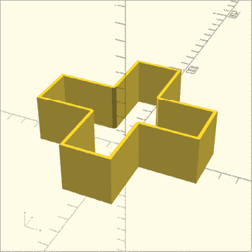

图 3-19：十字形饼干切割器

定义两个正方形，通过`union`操作创建外部十字形。接着，再定义两个正方形创建内部十字形，使用`offset`将内部十字形缩小，然后从外部十字形中减去它。这样，你就得到了一个空心的十字形。

## 导入二维图形文件

就像处理三维图形一样，你也可以从其他二维设计程序创建的文件中导入二维图形。OpenSCAD 支持导入*.dxf*和*.svg*这两种二维文件格式。这些格式通常与流行的二维矢量图形设计工具一起使用，比如 Adobe Illustrator 和 Inkscape（一个开源的 Adobe Illustrator 替代品）。OpenSCAD 只支持导入封闭的多边形形状，不能包含任何“开口”部分。此外，确保将*.dxf*文件中的所有线段转换为直线。

`import`命令的语法对于导入二维和三维图形是相同的。你只需要将文件名用引号括起来传递给`import`，并确保文件保存在与项目相同的文件夹/目录下。例如，使用以下语句导入图 3-20 中的图形：

```
import("drawing.dxf");
```

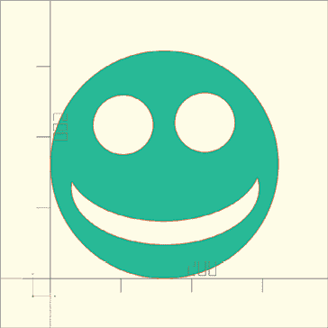

图 3-20：导入的*.dxf*矢量图形

尽管导入的文件看起来是圆形的，但它实际上由许多短线段组成，类似于你在本章早些时候学会创建的多边形。这个二维笑脸图形是使用 Inkscape 绘制的。该过程中的一个重要步骤是将形状中的所有线段转换为非常小的直线。

一旦导入了二维图形，它就像内建的图形一样，你可以对其进行变换，并与其他图形结合。以下语句首先导入图 3-20 中展示的笑脸形状，然后将其拉伸成图 3-21 中展示的形状：

```
linear_extrude(height=500, scale=3) import("drawing.dxf");
```

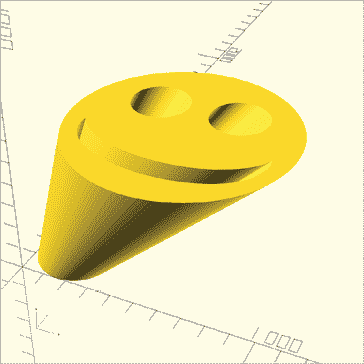

图 3-21：一个挤出并缩放后的 *.dxf* 向量图形

现在你拥有一个可以进行 3D 打印的笑脸形状，能够作为一个印章使用。

## 总结

在这一章中，你学习了如何基于 2D 形状设计并创建 3D 形状。现在你应该能够创建、组合和变换简单的 2D 形状，比如圆形、矩形、多边形和文本。你可以通过 `offset` 操作创建 2D 形状的内外轮廓，导入向量图形，并将 2D 形状转换为 3D 形状。

到现在为止，你应该能够想象出使用 OpenSCAD 的 2D 和 3D 形状可以创建的各种设计。有时候，先考虑复杂 3D 设计的 2D 投影，然后将其延伸为 3D 形状，会更容易构建。

以下是在处理 2D 形状时需要记住的一些重要事项：

+   渲染 2D 设计会显示该形状的实际 2D 视图，而设计的预览窗口则会在 z 轴上增加少量的高度。

+   3D 形状变换向量需要三个参数：[x, y, z]；而大多数 2D 形状变换向量只需要两个参数：[x, y]。

+   2D 旋转仅需要一个参数：表示 xy 平面内旋转角度的数值。

+   顶视图通常能提供设计 2D 形状时最佳的视角。

+   挤出 2D 形状和文本是将它们与 3D 形状结合的必要步骤。

+   文本字符串以双引号开始和结束。

+   你可以使用 `text` 形状通过将数值转换为字符串（使用 `str` 函数）来绘制数字值。

+   只有支持 Unicode 的字体才能用于绘制表情符号，但想想看，挤出表情符号形状会有多有趣！

+   使用 `rotate_extrude` 对 2D 形状进行变换时，2D 形状的任何部分都不能跨越 z 轴。

+   将 2D 形状看作是通过 `rotate_extrude` 操作生成的 3D 形状的“截面”。
