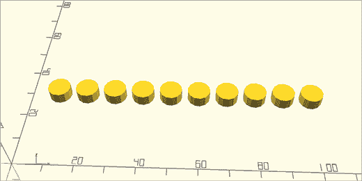
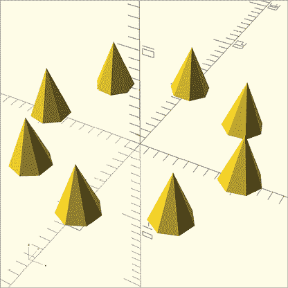
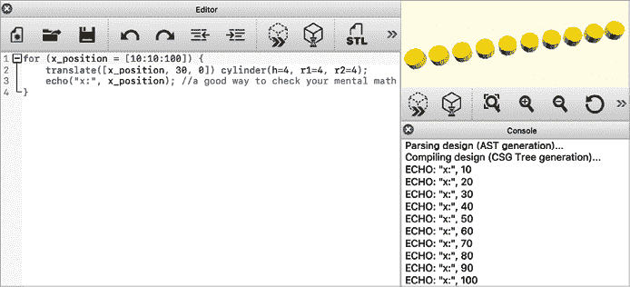
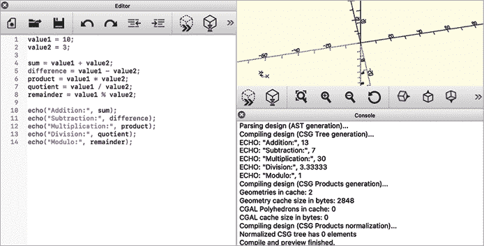
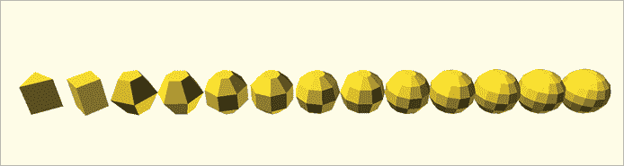
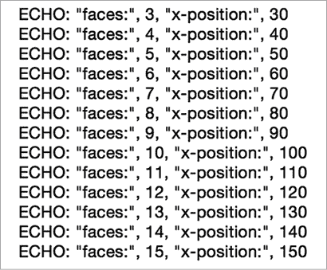
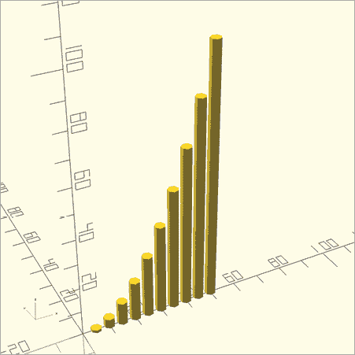
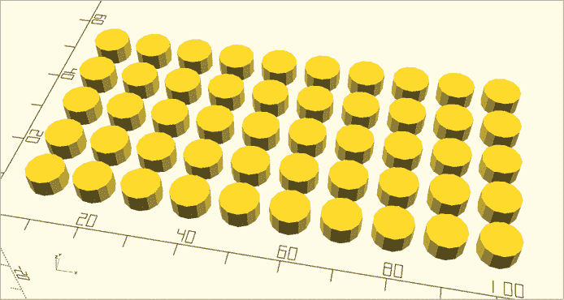
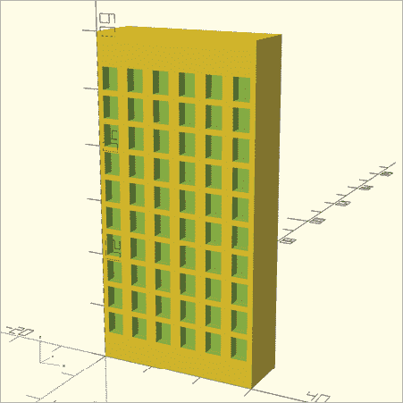
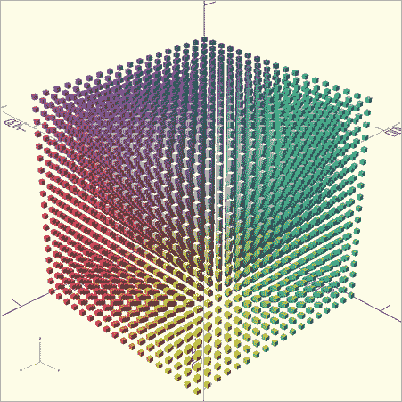

# 第四章：使用循环和变量


从本章开始，你将学习如何使用 OpenSCAD 更加智能地工作，而不是更辛苦。首先，你将学习使用一个非常有用的编程工具——*循环*。循环让你用几行代码绘制许多相似的形状。

这在你的设计中包含重复特征时尤其有用。例如，如果你正在创建帝国大厦的模型，为大厦的每个窗户单独编写一条语句将花费大量时间。使用循环，你可以沿着固定的模式重复一个窗户，这样 OpenSCAD 就能处理复制粘贴同一个窗户多次的繁琐工作。你还将学习如何使用变量来跟踪与你的设计相关的重要数据。因为这些新的 OpenSCAD 工具将允许你创建更复杂的设计，所以你还将学习如何使用注释来为自己和其他协作者留下设计备注。

## 留下带注释的备注

在本章中，设计比前几章稍微复杂一些，所以我们将在代码示例中使用注释来解释设计中的重要细节。*注释*为你提供了一种为自己和其他可能阅读代码的人留下备注的方式。OpenSCAD 会忽略注释语句，因为它们仅作为给人类阅读的备注，而不是让 OpenSCAD 绘制特定形状的指令。

### 使用`//`编写单行注释

单行注释以`//`开始，直到行末为止。它们对于留下简短的备注非常有用，以便你日后能记住当时在创建 OpenSCAD 设计时的思考过程。

### 使用`/* */`编写多行注释

多行注释以`/*`开始，以`*/`结束。OpenSCAD 会忽略多行注释中的所有内容。多行注释在你想集中精力处理特定元素时非常有用，因为它可以临时忽略设计中的某些部分。多行注释使得一次性忽略多个语句变得容易。

以下代码展示了单行注释和多行注释，结果是只绘制了一个形状（一个长方体，图 4-1），因为其他的 OpenSCAD 语句被注释掉并被忽略：

```
cube([5, 10, 20]);

//sphere(5);

/*
cylinder(h=5, r1=10, r2=10);
cube([50, 50, 50]);
*/
```


图 4-1：在一组注释中的一个单一立方体

## 使用`for`循环重复代码

本章的主要重点是让 OpenSCAD 处理繁琐且容易出错的“复制粘贴”方式，避免在绘制一系列相似形状时一遍又一遍地编写类似的语句。例如，如果你想在一条直线上绘制 10 个相同的圆柱体，你可以写 10 条语句——每条语句处理一个圆柱体——只需要改变`translate`操作中的向量参数，以避免重叠，正如以下设计所示（图 4-2）：

```
translate([10, 30, 0]) cylinder(h=4, r1=4, r2=4);
translate([20, 30, 0]) cylinder(h=4, r1=4, r2=4);
translate([30, 30, 0]) cylinder(h=4, r1=4, r2=4);
translate([40, 30, 0]) cylinder(h=4, r1=4, r2=4);
translate([50, 30, 0]) cylinder(h=4, r1=4, r2=4);
translate([60, 30, 0]) cylinder(h=4, r1=4, r2=4);
translate([70, 30, 0]) cylinder(h=4, r1=4, r2=4);
translate([80, 30, 0]) cylinder(h=4, r1=4, r2=4);
translate([90, 30, 0]) cylinder(h=4, r1=4, r2=4);
translate([100, 30, 0]) cylinder(h=4, r1=4, r2=4);
```



图 4-2：用 10 个单独语句或用单个`for`循环绘制的一排圆柱

请注意，从一个圆柱到下一个圆柱唯一的变化是沿 x 轴增加的位置：第一个圆柱的 x 位置是 10，第二个圆柱的 x 位置是 20，依此类推，直到最后一个圆柱的 x 位置为 100\。

与使用 10 个单独语句不同，你可以使用单个`for`循环来生成这一系列圆柱。你只需要编写一个循环，在 x 轴上绘制第一个圆柱 10 个单位，然后每次绘制一个新圆柱时，将 x 位置增加 10 个单位，直到绘制最后一个圆柱，位置为 100 单位。

以下伪代码展示了`for`循环的语法：

```
for (`variable` = [`start`: `increment`: `end`]) {
  // one or more statements to be repeated
}
```

`for`关键字表示你希望重复执行 OpenSCAD 语句。然后你创建一个`变量`，用于在每次重复后跟踪变化的值。`变量`具有`start`值、`increment`值和`end`值。类似于将多个形状组合在一起应用单一变换，使用大括号（`{ }`）来包含所有你想重复的语句。

以下示例使用单个`for`循环绘制 10 个圆柱，而不是使用 10 个单独语句：

```
for (1x_position = [10:10:100]) {
    translate([x_position, 30, 0]) cylinder(h=4, r1=4, r2=4); 
}
```

一个名为`x_position`的变量用于跟踪每个圆柱体的位置。该变量的初始值为 10；每次`for`循环重复时，`x_position`的值增加 10，确保下一个圆柱体沿 x 轴绘制时远离 10 个单位。一旦`x_position`等于 100，最后一个圆柱体将被绘制，循环停止。最终生成的图形与使用 10 个单独语句绘制的效果相同，如图 4-2 所示。

你可以使用循环沿多种模式重复形状。图 4-3 展示了一个围绕 z 轴旋转的圆锥重复模式，下面是相应的`for`循环：

```
for (angle=[0:45:315]) {
    1rotate([0, 0, angle]) 2translate([10, 0, 0]) 3cylinder(h=5, r1=2, r2=0);
}
```



图 4-3：围绕 z 轴旋转的十个圆锥，使用`for`循环生成

在大括号内，循环创建一个圆锥 3，沿 x 轴 2 平移 10 个单位，然后将其旋转`angle`度 1。当`angle`变量的值为 0 时，第一个圆锥被绘制，此时它没有被旋转。每次循环重复时，`angle`变量的值增加 45，旋转每个圆锥。`angle`变量的最后一个值为 315，因此最后一个由循环绘制的圆锥围绕 z 轴旋转 315 度。

## 使用 echo 调试 for 循环

有时，检查变量在 `for` 循环重复过程中的变化值是有用的。例如，如果你想检查你的心算是否正确，看到 `for` 循环生成的精确值会更容易。使用 `echo` 函数将变量的每个连续值打印到控制台窗口，并检查控制台窗口（图 4-4）来获取关于 OpenSCAD 代码执行的反馈：

```
for (x_position = [10:10:100]) {
    translate([x_position, 30, 0]) cylinder(h=4, r1=4, r2=4); 
    echo("x:", x_position); //a good way to check your mental math
}
```



图 4-4：通过 `echo` 生成的控制台输出

`echo` 函数对于调试程序非常有用。例如，你可以用它来可视化控制 `for` 循环重复次数的变量的所有值。`echo` 函数为你提供了一种有效的方式来收集关于 `for` 循环的反馈，因为它会打印出 `for` 循环生成的每个值。在控制台语句中添加字符串标签（如 `"x:"`）可以帮助整理控制台窗口的输出。在 `echo` 函数中的标签和变量应该用逗号（`,`）分隔。

## 使用变量和算术运算

变量与 `for` 循环一起使用，用来跟踪循环所创建的模式。你可以直接使用生成的值，或者对其进行算术运算，以产生更复杂的重复模式。

在本节中，你将学习变量命名的最佳实践、对变量执行的数学运算，以及变量在循环中的应用。

### 命名变量

前面 `for` 循环示例中的 `x_position` 变量和 图 4-3 中的 `angle` 变量并不是 OpenSCAD 内建的。这些名称是为了描述这些值在设计中的用途而选择的。`x_position` 变量描述的是圆柱体的 x 位置，而 `angle` 描述的是圆锥体的旋转角度。

OpenSCAD 允许你根据自己的需求命名变量，只要不包含空格或使用字母、下划线、数字以外的符号。务必选择一个有助于你记住变量用途的名称。这可以帮助你更轻松地跟踪设计中的多个变量，对于调试错误或共享设计时尤为重要。

### 对变量应用数学运算

要开始探索 OpenSCAD 如何对变量应用数学运算，假设你将值 10 和 3 赋给以下变量：

```
value1 = 10;
value2 = 3;
```

要执行像求和、差、积、商或余数这样的数学运算，OpenSCAD 允许你使用标准符号。

OpenSCAD 同样遵循你可能在数学课上熟悉的常规运算顺序。将每个算术运算的结果赋值给一个变量，能帮助你将计算语句与输出语句分开：

```
sum = value1 + value2;
difference = value1 - value2;
product = value1 * value2;
quotient = value1 / value2;
remainder = value1 % value2;
```

现在，使用`echo`函数显示每个数学运算的结果（图 4-5）。每个`echo`函数使用标签来帮助识别控制台窗口中每个数字对应的内容。

```
echo("Addition:", sum);
echo("Subtraction:", difference);
echo("Multiplication:", product);
echo("Division:", quotient);
echo("Modulo:", remainder);
```



图 4-5：五种算术运算符的控制台输出

### 在`for`循环中使用数学运算和变量

你可以在`for`循环中使用算术运算，使一个变量表示两个不同的模式。以下设计通过同一个`for`循环生成了 13 个球体（图 4-6）：

```
for (faces=[3:11:15]) {
    2 $fn = faces;
    x_position = faces*10;
    translate([3x_position, 0, 0]) sphere(r=5);
    4 echo("faces:", faces, "x-position:", x_position);
}
```



图 4-6：一系列逐渐变得更加平滑的球体

请注意，由`for`循环创建的`faces`变量同时指定了渲染球体所用的面数 2 和球体沿 x 轴的位置 3。在每次重复`for`循环时，`faces`的值增加 1，而`x_position`的值通过将`faces`的新值乘以 10 来更新。`echo`函数 4 显示了`faces`和`x_position`的变化值。图 4-7 展示了控制台输出。



图 4-7：一系列逐渐变得更加平滑的球体的控制台输出

### 使用算术运算创造独特的图案

除了利用算术运算发挥`for`循环的作用，逐步改变形状的特征外，你还可以使用算术运算来创造有趣的图案。以下代码通过使用二次模式来增加每个圆柱体的高度，从而生成一系列高度逐渐增加的圆柱体（图 4-8）：

```
for (1x=2[1:1:10]) {
    height = 3x*x;
    x_position = 45*x;
    translate([x_position, 0, 0]) cylinder(h=height, r1=2, r2=2);
}
```

上述设计使用了一个`for`循环将一个变量`x`从 1 增加到 10。`x`变量在每次循环时增加 1，因此该循环会执行 10 次。该变量同时控制一系列圆柱体的 x 轴位置和高度。通过创造性地使用算术运算，每次循环时你都会将圆柱体的 x 位置增加 5。圆柱体的高度以不同的速率增长，每次循环时通过平方`x`的值来增加，这被称为*二次增长*。



图 4-8：一系列按二次模式增加高度的圆柱体

## 使用嵌套循环绘制二维和三维网格

OpenSCAD 甚至允许你重复一个循环，你可以在一个`for`循环内放入另一个`for`循环。你可以使用一个`for`循环来创建一排形状，而在另一个`for`循环内使用`for`循环，可以重复这排形状，从而创建一个形状网格，只需几行代码。这被称为*嵌套*循环。以下设计使用了嵌套的`for`循环来绘制一个圆柱体网格（图 4-9）：

```
1 for (y_pos = [10:10:50]) { 
2 for (x_pos = [10:10:100]) {
     translate([x_pos, y_pos, 0]) cylinder(h=4, r1=4, r2=4); 
  3 echo("x:", x_pos, "y:", y_pos);
   } // x_pos loop
} // y_pos loop
```

前面的代码使用一个循环绘制了一排 10 个圆柱体 2。这个`for`循环由第一个`for`循环 1 重复，因此圆柱体的排布会重复。两个变量——即`x_pos`和`y_pos`变量——协同工作，改变重复圆柱体的 x 和 y 位置。内层循环重复 10 次，而外层循环重复 5 次。这样总共会生成 50 个圆柱体。`echo`函数用于在控制台窗口 3 中跟踪这两个变量的值变化。注意，注释用于指示哪些括号属于哪个循环。虽然注释括号并非必要，但当你有许多相邻的花括号时，这样做会很有帮助。



图 4-9：使用嵌套`for`循环绘制的圆柱体网格

现在，你知道了如何用四行代码生成 50 个圆柱体，这无疑比写一长串 50 个语句来单独生成每个圆柱体要高效得多。这正是绘制摩天大楼中众多窗户的完美技巧。

### 使用嵌套循环生成摩天大楼的窗户

列表 4-1 使用嵌套`for`循环绘制了一个有 60 个窗户的建筑（图 4-10）：

```
num_rows = 10;
num_cols = 6;

building_width = num_cols*5;
building_height = num_rows*6;

1 difference() {
2 cube([building_width, 10, building_height]);

  3 for (z = [1:1:num_rows]) {
  for (x = [0:1:num_cols-1]) {
  4 x_pos = x*5+1;
    z_pos = z*5;
    translate([x_pos, -1, z_pos]) cube([3, 3, 4]);
  } // x loop
  } // z loop
} // difference
```

列表 4-1：使用嵌套`for`循环绘制一个有 60 个窗户的摩天大楼



图 4-10：摩天大楼上的窗户网格

列表 4-1 使用变量（命名为`num_rows`和`num_cols`）来控制不仅仅是窗户的数量，还包括建筑物的宽度和高度。首先，它绘制了一个大的长方体来表示建筑物 2。接着，它使用嵌套`for`循环绘制了一个 60 个长方体的网格 3。最后，`difference`操作从较大的建筑物中减去这些长方体，形成凹陷的窗户 1。两个变量（`x_pos`和`z_pos`）用于在绘制长方体 4 之前计算每个窗户的具体 x 位置和 z 位置。

我们在列表 4-1 中的代码组织使得修改摩天大楼的特性变得容易。`num_rows`和`num_cols`变量不仅控制了两个循环的重复次数，还设置了建筑物的宽度和高度，因为`building_width`和`building_height`变量的值依赖于`num_rows`和`num_cols`的值。对`num_rows`或`num_cols`做出任何更改都会完全改变摩天大楼的外观。你将在下一章学到更多关于这种代码组织的优势。

### 三重嵌套以创建 3D 形状网格

你还可以通过添加更多的嵌套层来绘制 3D 形状网格——也就是说，将一个循环放在另一个循环里，再放进另一个循环——尽管这可能需要一些时间来渲染，因为它会生成大量的形状（图 4-11）：

```
for (r = [0:15:255]) {
  for (g = [0:15:255]) {
    for (b = [0:15:255]) {
 translate([r, g, b]) color([r/255, g/255, b/255]) cube(5);
    } // b loop
  } // g loop
} // r loop
```



图 4-11：表示 RGB 颜色空间的嵌套`for`循环

这个 *三重嵌套* 实际上使用第三个循环来重复形状的网格。前面的设计使用了三个嵌套循环来绘制一个表示 RGB（红色、绿色、蓝色）色彩空间的立方体。`color` 转换接受一个 3D 向量，表示应该在形状的颜色中展示的红色、绿色和蓝色光的百分比。由于 RGB 使用 255 作为最大值，除以 255 得到一个 0 到 1 之间的小数。`color` 转换对于调试和组织设计很有用，但对于 3D 打印来说作用不大，因为 3D 打印的颜色完全取决于所使用的材料类型。因此，`color` 转换只在预览模式下有效，在渲染模式下不会显示。

## 概述

本章介绍了循环的概念，循环允许你在不重复编写相同代码的情况下重复执行语句。通过循环，你可以让计算机代替你重复编写语句的所有工作。变量是 OpenSCAD 中循环的重要组成部分，尽管它们并不局限于循环。变量还可以帮助你跟踪重要的值。通过算术运算符，变量可以作为其他变量的起始点，这在你想改变设计时非常有用。

以下是使用循环的一些重要提示：

+   如果你发现自己在复制、粘贴并稍作修改以重复某个语句，考虑使用循环来生成这些重复操作。

+   使用算术运算基于循环创建的模式进行复杂的重复操作。

+   给变量起一个能描述其用途的名字。

+   将所有变量组织在程序顶部可以让你更容易地修改设计。

+   使用 `echo` 函数输出变量的值，随着循环的重复，这可以帮助你跟踪通过复杂算术得到的变量。

+   给所有 `echo` 函数的输出加上标签，这样在有嵌套循环时，你可以输出多个变量。

+   如果你想在 `text` 形状中使用由 `for` 循环生成的变量值，记得使用 `str` 将数字转换为字符串（如第三章所提到的）。

+   `color` 转换对于在预览模式下调试非常有用，但它不会应用于渲染模式或 3D 打印。

+   注释是程序员用来帮助解释编程选择的注解。

+   OpenSCAD 会忽略注释，但人类使用注释来帮助理解代码语句的目的。
