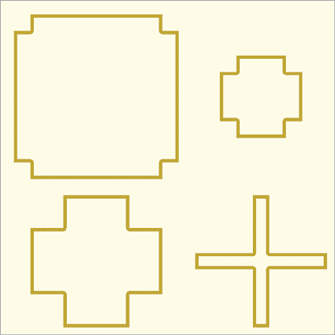
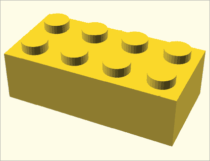
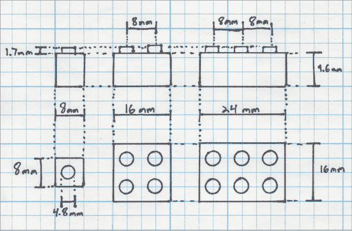
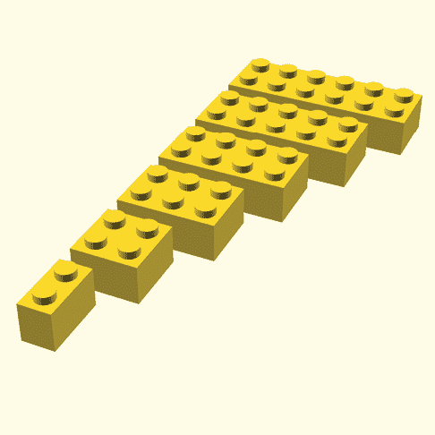
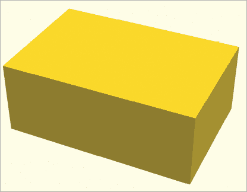
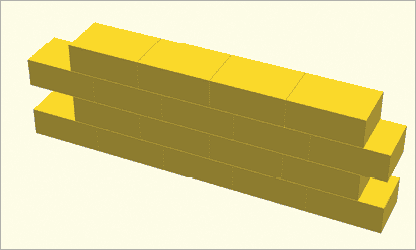
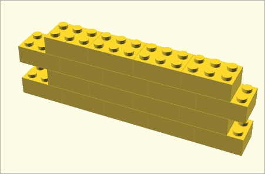

# 第五章：模块


在本章中，你将学习如何将复杂的设计转化为更易管理的组件，这些组件被称为模块。*模块*是代码的独立部分，它们组织了一系列独立的语句，特别有两个好处。如果你的代码很长且复杂，使用模块可以将代码分解成更小的子部分，有助于提高代码的可读性。如果你的设计中有重复或相似的形状，你可以使用一个模块来定义该形状，从而减少需要编写的代码量，便于创建复杂的设计。

本章还介绍了如何使用变量和参数来自定义你的模块。最后，我们将解释如何将相似的模块分组到一个单独的文件中（通常称为*库*），以便更容易地组织设计、共享设计并使用别人创建的设计。

## 简化代码与模块

为了理解使用模块如何简化你的代码，让我们再看看你在第三章中构建的十字形饼干切割器的代码（图 5-1）。


图 5-1：十字形饼干切割器

我们已将代码复制到列表 5-1 中。你能看到任何重复的代码吗？

```
linear_extrude(30) {
    difference() {
        union() {
            square([100, 30], center=true);
            square([30, 100], center=true);
        }
        offset(-2) {
            square([100, 30], center=true);
            square([30, 100], center=true);
        }
    }
}
```

列表 5-1：原始的十字形饼干切割器程序

这个饼干切割器是通过取两个十字形的差来制作的，因此`square`命令用于创建十字形的代码被重复了两次。重复的代码几乎总是会导致问题，因为你对形状的尺寸所做的任何更改都必须重复进行（或者根据代码被重复的次数）。如果你忘记修改每个实例，你将不得不花时间修复它，或者更糟糕的是，最终在设计中留下长期的错误。

为了改进这个设计，你可以使用一个模块来创建一个十字形，然后利用这个模块来创建两个十字形。以下伪代码展示了模块定义的语法：

```
module `ModuleName`() {
    // code used to define the new shape
}
```

使用`module`关键字开始定义一个新模块。然后给模块起个名字，描述你正在创建的新形状。模块名的限制与变量名相同，这意味着你只能使用小写和大写字母、下划线或数字 0 到 9。一个好的名字应该能帮助读者理解模块的功能，而不需要他们阅读定义模块的实际代码。在`ModuleName`后添加一对空的括号，接着是用大括号括起来的代码。你在大括号内写的代码与任何其他 OpenSCAD 代码没有区别。

模块定义将作为设计的一个独立部分存在。因此，定义一个模块并不会实际绘制出新的形状。它仅仅是一个描述如何创建形状的配方。要看到这个形状，你必须通过将模块名插入到你的设计中来创建它，就像创建其他任何形状一样。下面是使用模块的语法：

```
*ModuleName*();
```

模块是程序员定义的形状的示例。事实上，迄今为止你使用过的所有 OpenSCAD 命令，包括`sphere`、`cylinder`和`linear_extrude`，实际上都是内置于语言中的模块。当形状在模块内结合时，会隐式发生`union`操作，因此你可以使用你到目前为止见过的任何操作来变换和组合模块生成的形状。

通过创建一个`cross`模块来为你的饼干切割器编写一些新代码，如示例 5-2 所示。

```
module cross()1 {
    square([100, 30], center=true);
    square([30, 100], center=true);2
}

linear_extrude(30) {
    difference() {
      3 cross();
      4 offset(-2) cross();
    }
}
```

示例 5-2：使用模块改进的新十字形饼干切割器程序

使用`module`关键字开始定义新形状。给它起名为`cross` 1，以描述你正在创建的形状。在名称后面的花括号中，输入定义十字形状的代码 2。最后，使用模块名称后跟一对括号 3 4，告诉 OpenSCAD 绘制该十字形。注意，你使用了两次`cross`模块，因此你可以用`difference`操作将一个十字形从另一个中减去。

## 将设计拆分成多个文件

有时在创建新设计时，你可能想要重用先前项目中的一个组件。一个很好的组织方法是将该组件做成一个模块。将这个模块定义放到一个单独的文件中，可以让你在两个设计中轻松使用它。单独保存模块有助于你在多个项目中查找并重用新形状，也可以轻松地与他人分享它们。而且，如果你对一个由多个设计使用的文件中定义的模块进行了改进，那么这些改进将在你下次打开每个设计时自动应用。将模块定义组织成单独的文件通常被称为创建一个*库*，特别是当一个新文件中定义了多个相关模块时。

要了解如何将模块保存在单独的文件中，我们将十字形饼干切割器设计拆分为两个文件。我们将使用一个文件来定义十字形状，然后在第二个文件中使用该模块来创建饼干切割器。首先，创建两个空的 OpenSCAD 文件：*cross-module.scad*和*cookie-cutter.scad*。确保将这两个文件保存在同一个文件夹中，以便 OpenSCAD 可以找到这两个文件。此外，注意这些文件名是为了清楚地表明每个文件的用途而选择的。仔细选择文件名将有助于你在将来组织你的项目，特别是当你构建越来越多的 OpenSCAD 项目时。

在*cross-module.scad*中，复制示例 5-2 中的模块定义，包括花括号，然后将其粘贴到你刚刚创建的文件中。确保在粘贴代码后保存*cross-module.scad*，这样 OpenSCAD 就能在连接文件时使用最新版本。新的*cross-module.scad*文件应仅包含以下代码：

```
module cross() {
    square([100, 30], center=true);
    square([30, 100], center=true);
}
```

现在在*cookie-cutter.scad*中，移除模块定义并在文件顶部添加以下一行：

```
**use <cross-module.scad>**

linear_extrude(30) {
    difference() {
        cross();
        offset(-2) cross();
    }
}
```

不需要在*cookie-cutter.scad*中键入模块定义，第一行代码告诉 OpenSCAD 使用*cross-module.scad*中的代码。这提供了交叉形状的定义。

`use`关键字告诉 OpenSCAD 从另一个文件加载模块。`use`关键字的语法如下：

```
use `<path/to/filename.scad>`
```

在`use`关键字后，添加*尖括号*（`< >`），并在尖括号内指定你想使用的*.scad*文件的名称。如果你想使用的文件不在与主设计文件相同的文件夹中，指定该文件的绝对路径或相对路径。`use`语句允许你使用文件中的模块定义，但它不会立即绘制任何形状。

生成*cookie-cutter.scad*的预览现在会产生与图 5-1 中相同的形状。然而，生成*cross-module.scad*的预览不会产生任何形状。这是因为*cross-module.scad*目前只包含`cross`模块的定义。为了通过生成*cross-module.scad*的预览来查看交叉形状，你需要添加一个语句来绘制交叉形状：

```
cross();

module cross() {
    square([100, 30], center=true);
 square([30, 100], center=true);
}
```

## 向你的模块添加参数

因为形状有不同的尺寸，你可能希望你的模块允许一些变动。你已经知道，内置的 OpenSCAD 模块，比如`sphere`，可以接受一个参数，如`sphere(r=30);`，其中参数指定了球体的半径。你也可以向自己的模块添加这样的参数。

以下伪代码展示了指定模块的完整语法，包括参数：

```
module `ModuleName`(`parameterName` = `defaultValue`, ...) {
 // statements used to define the shape
}
```

不要将模块定义后的括号留空，而是添加一个`parameterName`，这是一个占位符，用于存放你在使用模块时提供的值。你还可以为每个参数提供一个`defaultValue`，这样，如果模块的使用者没有为某个参数指定值，模块将使用默认值。提供默认值使得人们在使用模块时无需指定所有参数，这在实验模块时非常有用，或者当默认值是常见选择时，它可以隐藏分散注意力的细节。要创建多个参数，指定多个参数名，用逗号分隔，并确保每个参数有不同的名称。

你可能已经注意到，参数看起来很像变量。事实上，在模块内部，参数表现得就像变量一样。最佳实践是给参数命名，以描述其用途。与变量和模块名称一样，参数名称只能包含字母、下划线或数字。

示例 5-3 展示了如何向`cross`模块添加参数：

```
module cross(width=30, length=100) {
    square([length, width], center=true);
    square([width, length], center=true);
}
```

示例 5-3：使用参数定义`cross`模块

在括号内，添加`width`和`length`参数，这些参数定义了交叉形状每个臂的宽度和长度。

要使用`cross`模块创建一个十字形，每次使用该模块时提供每个参数的具体值，如清单 5-4 所示。

```
use <cross-module.scad>

linear_extrude(30) {
    difference() {
 cross(20, 100);
        offset(-2) cross(20, 100);
    }
}
```

清单 5-4：指定 `cross` 模块的值

数字的顺序表示应解释为十字的宽度还是长度。由于`width`参数在模块定义中排在前面，括号中的第一个数字被分配给`width`参数，第二个数字分配给`length`参数。

OpenSCAD 还允许你在使用模块时显式命名参数，这在创建具有大量参数的形状时很有帮助（因为跟踪顺序会变得困难）：

```
cross(width=20, length=100);
```

当你使用模块并命名参数时，参数的顺序并不重要。交换长度和宽度参数的顺序不会影响形状的外观：

```
cross(length=100, width=20); 
```

现在模块真正变得动态；你可以用它来创建任何大小的饼干模具（图 5-2）。



图 5-2：各种饼干模具，每个模具都是使用不同参数创建的

## 构建一个 LEGO 积木

在本节中，我们将通过一个复杂的建模项目，使用参数、模块和`for`循环进行单一设计。你将设计一个 LEGO 积木形状，具有一个方向的两个圆头和另一个方向上任意数量的圆头。*圆头*是 LEGO 积木顶部的小凸起，能够与其他 LEGO 积木配合固定它们。图 5-3 显示了一个有两排、每排四个圆头的 LEGO 积木。



图 5-3：具有 2×4 网格圆头的 LEGO 积木

在编写像这样的复杂设计代码之前，先手绘几份你形状的草图，可以帮助你深入理解形状中的尺寸和模式（图 5-4）。



图 5-4：手绘的各种尺寸 LEGO 积木的尺寸探索图

LEGO 积木的尺寸可以在网上轻松找到。我们从维基百科获取了我们的尺寸：

+   一块积木的高度是 9.6 毫米。

+   圆头的高度是 1.7 毫米。

+   圆头的直径是 4.8 毫米。

每新增一个圆头，积木的宽度增加 8 毫米，不仅是为了容纳圆头的直径，还有圆头周围的空隙。积木的长度也取决于圆头的数量。在这个例子中，你将只生成有两排圆头的积木，这意味着该积木的固定长度为 16 毫米。

探索各种手绘的 LEGO 形状，可以更容易地识别定义 LEGO 积木模块所需的 OpenSCAD 语句。

清单 5-5 定义了 LEGO 积木模块。

```
module LEGObrick(studs_per_row=4) {
    $fn=30;

    width = studs_per_row * 8;

    cube([width, 16, 9.6]);

    for (x_position=[4 : 8 : width-4]) {
        translate([x_position, 4, 1.7]) cylinder(h=9.6, d=4.8);
        translate([x_position, 12, 1.7]) cylinder(h=9.6, d=4.8);
    }
}

LEGObrick(4);
```

清单 5-5：使用模块绘制 LEGO 积木

首先创建一个名为`LEGObrick`的模块，并带有一个`studs_per_row`参数。这个参数表示 LEGO 积木顶部的圆点数，它决定了积木在 x 轴上的整体宽度。LEGO 积木有不同的尺寸，因此这个参数将有助于重用相同的模块来绘制多种尺寸的积木。我们选择将每行 4 个圆点作为默认值，但这是一个任意选择。

创建一个名为`width`的变量，用于跟踪积木的整体宽度，它是基于`studs_per_row`的。每增加一个圆点，积木的宽度增加 8 mm：

```
width = studs_per_row * 8;
```

LEGO 积木的其他尺寸保持固定，和每行的圆点数无关：

```
 cube([width, 16, 9.6]);
```

使用`for`循环将每个重复的圆点绘制到正确的位置：

```
for (x_position=[41 : 82 : width-43]) {
    translate([x_position, 4, 1.7]) cylinder(h=9.6, d=4.8);
    translate([x_position, 12, 1.7]) cylinder(h=9.6, d=4.8);
}
```

在`for`循环中，变量`x_position`跟踪每个圆点的 x 位置。第一个圆点位于 x = 4 mm 1 处，每个额外的圆点距离前一个圆点 8 mm 2。类似地，每行中的最后一个圆点位于砖块整体宽度的 4 mm 位置 3。两行圆点在 x 轴上绘制时，使用了完全相同的值。由于我们将 y 轴限制为只有两个圆点，所以直接将两行显式定位在 y = 4 mm 和 y = 12 mm 处，比使用第二个循环更简单。

`LEGObrick`模块现在已经完成，这意味着你可以使用它来创建不同大小的 LEGO 积木，就像图 5-5 中展示的那样。



图 5-5：使用相同的`LEGObrick`模块创建的各种 LEGO 积木

这个模块仅仅是一个简化版的 LEGO 积木设计；然而，它并不会像真实的积木那样工作，因为当前的设计没有包含积木底部用于连接积木的内置机制。我们将这个挑战留给你。

## 共享与协作

如果你将模块保存在不同的文件中，你可以像本章前面所展示的那样，在多个设计中重用这些新的形状。保持模块独立还允许你与其他人共享公共设计组件，或者使用他人的组件，而不是自己从头开始构建所有内容。将设计拆分成多个模块可以让你更容易进行协作。

让我们来看一个可能的协作案例。假设你和一个朋友想要一起制作一个 LEGO 城堡的 3D 动画。为了节省时间，你们决定将设计拆分成两个任务，并且可以在两台不同的计算机上并行完成。你的朋友决定设计一个绘制 LEGO 积木形状的模块，而你将负责设计一个由 LEGO 积木形状构成的城堡。

你和你的朋友首先决定`LEGO`模块应是什么样的。你们商定了模块的名称（`LEGObrick`）、任何必要的参数及其默认值（`studs_per_row`），默认值为三颗凸点，以及每块砖的基本形状和尺寸（一个 3×2 砖的尺寸为 24 × 16 × 9.6 毫米）。然后，你的朋友开始在名为*LEGObrick-module.scad*的文件中构建`LEGObrick`模块的简化版，如图 5-6 所示：

```
LEGObrick();
module LEGObrick(studs_per_row=3) {
    cube([24, 16, 9.6]);
}
```



图 5-6：`LEGObrick`模块的简化版

即使`LEGObrick`模块尚未完成（该简化版模块尚未包含凸起的圆点），你仍然可以将其作为构建块，在名为*castle-wall.scad*的文件中开始创建城墙设计，如图 5-7 所示。



图 5-7：使用基本版`LEGObrick`模块的 LEGO 城堡墙壁

同时，你的朋友继续改进`LEGObrick`模块，每次改进后，他们会将更新版本的*LEGObrick-module.scad*分享给你。由于 OpenSCAD 设计是纯文本文件（.scad 扩展名），你可以通过电子邮件附件共享文件、直接从电子邮件或其他文档中复制粘贴 OpenSCAD 代码，或者使用像 GitHub 这样的高级服务来公开设计。也有一些专门的 3D 设计分享网站，其中一个更受欢迎的网站，直接支持 OpenSCAD，是 Thingiverse（[`thingiverse.com/`](https://thingiverse.com/)）。

每次你的朋友分享更新版本的*LEGObrick-module.scad*时，你都需要将旧版本的文件替换为新版本。每次你预览或渲染你的城堡代码时，位于*castle-wall.scad*中的城堡设计都会更新为使用最新的`LEGObrick`定义。随着时间推移，你的设计可能会看起来更像图 5-8 所示的样子。



图 5-8：使用更新版`LEGObrick`模块构建城堡

这种协作策略节省了时间，因为你和你的朋友可以同时在`LEGObrick`模块和城堡设计上工作。你不必等你的朋友完成某一部分才能开始自己的部分，同时你的朋友也可以看到他们的模块设计中小的变动如何影响整体城堡设计。

## 总结

在本章中，你学会了如何通过使用模块将设计组织成更小的逻辑组件，这样可以让你的 OpenSCAD 代码更易读，便于协作，并帮助你定制设计。

使用模块时，请记住以下关键概念：

+   模块定义包括三个部分：名称、参数列表和主体。

+   模块的主体包含一组 OpenSCAD 语句，定义了模块的独特形状。

+   要使用模块，在设计中通过模块的名称创建形状。如果模块没有显示出来，检查一下你是否在代码语句中真正使用了模块名称；可能你只是定义了模块。

+   在设计模块时，选择能够清晰描述其目的的模块名称和参数，这样使用你模块的人就无需阅读模块定义便能了解其功能。如果你以后忘记了模块的细节，这也会对你有所帮助。

+   参数对于指定模块的特性非常有用。确定哪些变量应该作为参数包含是设计模块的重要部分。

+   为参数指定默认值是一种使某些参数变为可选的有用方法。

+   将模块定义分离到其他文件中有助于你在其他 OpenSCAD 设计中使用该模块。你还可以将相关模块组织到一个库中。与模块和变量一样，选择能够充分描述其目的的文件名。

+   使用`use`关键字将你的设计与模块连接起来不会立即将新形状添加到你的设计中。你必须在代码中明确使用该模块才能看到新形状。

+   在模块定义文件的顶部绘制由模块定义的形状是常见做法，这对于测试非常有帮助。

尝试在线搜索 OpenSCAD 模块的示例，看看更多用户定义的形状。通过检查和修改其他人的解决方案，你可以学到很多，尤其是在确定应该包含哪些参数时。
