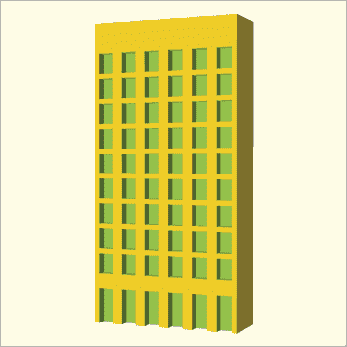
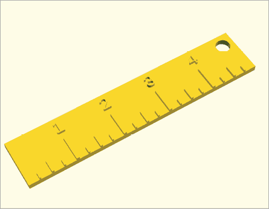
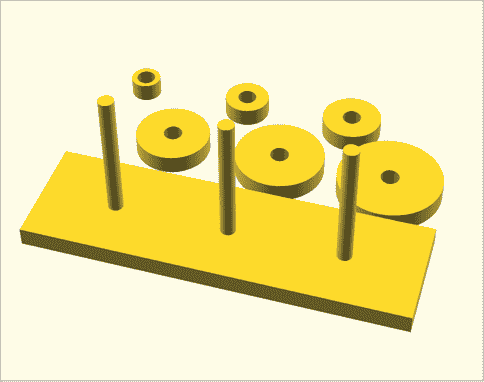

# 第六章：使用 if 语句创建动态设计


在本章中，你将学习如何使用`if`语句来创建根据不同条件做出反应的 OpenSCAD 设计。这个强大的编程工具赋予你的设计根据不同选项选择并仅执行某些代码行的能力。因此，你可以创建适应变化情况的动态设计。例如，你可以使用`if`语句快速重新配置设计，以便进行 3D 打印。

作为一个示例项目，在这里你将学习如何使用`if`语句根据刻度线的位置来改变尺子上刻度的长度，以表示英寸、半英寸和四分之一英寸的增量。你还将学习如何使用随机数来改变重复的形状，以创建更有机的设计特征变化。

## 使用 if 语句

`if`语句使用布尔表达式（一个计算结果为`true`或`false`的表达式）来比较两个值，然后根据该比较决定是否执行代码。如果`if`语句中的布尔表达式计算结果为`true`，则执行指定的代码语句。否则，这些语句将完全跳过。布尔表达式描述了一个条件，只有当满足该条件时，指定的语句才会被添加到设计中。

以下是`if`语句的语法：

```
if (`<boolean expression>`) {
  // code that is executed only when the boolean expression is true
}
```

列表 6-1 是第四章中创建的摩天大楼设计的一个变体。这个新版本使用`if`语句来决定将窗户和门放置在摩天大楼的哪个位置（图 6-1）。

```
num_rows = 10;
num_col = 6;

building_width = num_col * 5;
building_height = num_rows * 6;

difference() {
  cube([building_width, 10, building_height]);

  for (1 z = [1:1:num_rows]) {
    for  (x = [0:1:num_col-1]) {
    2 if (z == 1) {
      3 translate([x*5+1, -1, -1]) cube([3, 3, 8]); // door
      }
      4 if (z > 1) {
      5 translate([x*5+1, -1, z*5]) cube([3, 3, 4]);  // window
      }
    }
  }
}
```

列表 6-1：使用`if`语句根据楼层编号插入门和窗户

图 6-1 显示了一座摩天大楼，第一层有门，后续每一层都有窗户。在列表 6-1 中的两个`for`循环创建了这个设计中的窗户和门的行列。`z`变量 1 控制每一行的垂直位置。接下来，两个`if`语句使用这些`z`值来决定是否将窗户或门添加到设计中。如果`z`等于 1 2，则会在设计中添加一个大门 3。如果`z`大于 1 4，则会在设计中添加一个小窗户 5。



图 6-1：摩天大楼上的窗户网格，带有一排门

我们将在本章的其余部分中不断发展这一摩天大楼设计。然而，你可能会觉得没有更多细节的摩天大楼不算摩天大楼，尤其是建筑的其他面。我们完全同意这一点，并将添加更多细节的任务留给读者，作为对这个简单设计的挑战。

## 定义复杂条件

你可以使用 `if` 语句通过结合六个布尔运算符和两个逻辑运算符中的一个来评估多种类型的条件。此外，你还可以通过将 `else` 语句与 `if` 语句连接，指定一个默认场景（当指定的条件为假时执行）。最后，你可以通过使用 `else if` 语句将多个相关的条件连接在一起。

### 选择布尔运算符

OpenSCAD 使用六个布尔运算符来评估布尔表达式中变量的内容。每个运算符如果比较有效，则返回 `true`，如果比较无效，则返回 `false`：

1.  `<` 小于

1.  `>` 大于

1.  `<=` 小于或等于

1.  `>=` 大于或等于

1.  `==` 等于

1.  `!=` 不等于

许多布尔运算符的符号可能你在数学课上已经很熟悉。OpenSCAD（与大多数其他编程语言一样）稍微改变了符号，以便你可以轻松地在键盘上输入。例如，你可能习惯看到 ≤ 符号表示“小于或等于”。然而，编程语言通常使用 `<=` 来代替。同样，`>=` 代替了 ≥，`!=` 代替了 ≠。最后，一定不要混淆 `==` 和 `=`。由于单个等号已经有了用途（为变量赋值），布尔表达式使用双等号 (`==`) 来测试两个值是否“相等”。例如，Listing 6-1 通过使用等号 (`==`) 运算符测试两个值的相等性。

这一组布尔运算符提供了许多选择，可以评估变量并确定某个条件是 `true` 还是 `false`。现在你可以编写一个循环，根据循环执行的次数生成不同的形状。如你所见，你还可以指定仅在某个条件不成立时绘制一个形状。在 `if` 语句中使用布尔运算符使你能够用相对较少的语句创建动态设计。

### 使用逻辑运算符组合布尔表达式

此外，你可以使用两个逻辑运算符之一来组合多个布尔表达式：`&&`（表示 *且*）和 `||`（表示 *或*）。

如果使用 `&&` 运算符，所有条件必须为真，才能执行指定的语句。如果使用 `||` 运算符，多个条件中至少有一个为真即可。为了更好地理解 `&&` 运算符的工作方式，请考虑以下情况：

```
if (x > 10 && y <= 20) {
  translate([x, y, 0]) cube([3, 4, 3]);
}
```

这段代码仅当 `x` 大于 10 *且* `y` 小于或等于 20 时绘制一个平移的立方体。

现在考虑这个使用 `||` 运算符的 `if` 语句：

```
if (x > 10 || y <= 20) {
  translate([x, y, 0]) cube([3, 4, 3]);
}
```

当*任意*`x`大于 10*或者*`y`小于或等于 20 时，会绘制一个平移的立方体。连接的*或*运算符的布尔表达式中，只有一个为`true`时，形状就会被绘制。如果连接的两个布尔表达式都为`true`，立方体也会被绘制。

### 遵循扩展的运算顺序

你可以构造涉及许多算术、布尔和逻辑运算符的复杂布尔表达式。就像在数学课上学会在加法之前先进行乘法，即使加法在算术表达式中排在前面一样，OpenSCAD 也按照一个明确的运算顺序来评估表达式：

1.  `( )`

1.  `^`

1.  `*`, `/`, `%`

1.  `+`, `-`

1.  `<`, `>`, `<=`, `>=`

1.  `==`, `!=`

1.  `&&`

1.  `||`

在运算顺序中，处于相同级别的运算符按照它们在表达式中从左到右的出现顺序执行。否则，位于该列表顶部的运算符具有更高的优先级，并在位于列表底部的运算符之前进行计算，即使这意味着从内到外计算表达式。

### 使用 if…else 语句做出双向选择

一个基本的`if`语句仅在布尔条件为`true`时执行一段代码。若布尔条件为`false`时执行备用代码，可以在`if`语句后附加一个`else`语句。`if...else`语句在代码中创建了一个双向分支，使你能够根据不同的真值条件执行不同的语句集合。

请考虑以下`if...else`语法：

```
if (`<boolean expression>`) {
  // code that is executed only when the boolean expression is true
}
else {
  // code that is executed only when the boolean expression is false
}
```

如果`if`语句中的布尔表达式为`true`，则执行第一组语句。如果`if`语句中的布尔表达式为`false`，则执行`else`部分中的语句。`if`语句的`else`部分通常称为*默认*条件，因为它描述了在`if`语句指定的条件为`false`时应发生的情况。`else`语句是`if`语句的可选扩展，适用于*互斥*分支场景，在这种场景中，不可能同时包含代码的两个部分。

你可以通过使用`else`语句轻松重构示例 6-1。图 6-1 中的摩天大楼有且仅有一行门。其余所有行都将有窗户。因为`for`循环有时需要绘制门，而其他时候需要绘制窗户，所以你可以像这样重写`if`语句：

```
num_rows = 10;
num_col = 6;

building_width = num_col * 5;
building_height = num_rows * 6;

difference() {
  cube([building_width, 10, building_height]);

  for (z = [1:1:num_rows]) {
    for (x = [0:1:num_col-1]) {
      if (z == 11) {
       2 translate([x*5+1, -1, -1]) cube([3, 3, 8]); // door
      }
      else {
       3 translate([x*5+1, -1, z*5]) cube([3, 3, 4]);  // window
      }
    }
  }
}
```

如果布尔表达式`z == 1`的值为`true`，OpenSCAD 会绘制一个门 2。如果布尔表达式为`false`，OpenSCAD 会绘制一个窗户 3。

### 使用扩展的 if 语句

一个*扩展的*`if`*语句*将一个条件附加到`else`语句上，创建一个有序的相关决策集合。OpenSCAD 会按顺序评估扩展`if`语句中的布尔表达式，直到其中一个表达式评估为`true`。你可以选择性地在扩展`if`语句的末尾包含一个`else`语句，以便在所有决策的评估结果为`false`时提供一个兜底的默认选项。

扩展`if`语句的语法如下所示：

```
if (`<boolean expression>`) {
  // code that is executed only when the boolean expression is true
}
else if (`<boolean expression>`) {
  // code that is executed only when the first boolean expression is false
  // and the second boolean expression is true
}
else {
  // optional default scenario
  // code that is executed only when both boolean expressions are false
}
```

你可以根据需要添加任意数量的`else if`语句来描述任何数量的互斥设计可能性，特别是当你想确保恰好一个相关的结果发生时非常有用。扩展`if`语句中的每个布尔表达式会按顺序进行评估，直到找到一个评估为`true`的表达式。只有该布尔表达式对应的代码部分会被执行，而其他部分会被跳过。如果没有布尔表达式的评估结果为`true`，则执行可选的`else`部分（如果提供的话）中的代码。由于`else`部分描述的是默认的可能性，它必须放在扩展`if`语句的末尾。

Listing 6-2 使用扩展的`if`语句在尺子上绘制各种大小的刻度线（图 6-2）。此设计创建了一个基于英寸的尺子，刻度线间隔为三种重复的间距：1 英寸、半英寸和 1/4 英寸。1 英寸间隔的刻度线最长，其次是略短的半英寸刻度线，最后是更短的 1/4 英寸刻度线。OpenSCAD 没有单位，因此该设计使用基本的比例关系将尺子上的每英寸划分为四个相等大小的“间隙”。它的设计意图是在 3D 打印准备软件中将其调整到准确的宽度后再进行打印。

```
ruler(5);

module ruler(inches) {
1 gap_size = 1; // 1 unit per quarter inch
  total_marks = 4 * inches; // inch, half inch, quarter inch

  width = gap_size * total_marks;
  length = 4 * gap_size;
  height = 0.5 * gap_size;

  mark_width = 0.25 * gap_size; 
  mark_height = 1.5 * height;

  // main ruler body
  difference() {
    cube([width, length, height]);
    translate([width-gap_size, length-gap_size, -0.5]) 
      cylinder(h=height+1, r=0.15*length, $fn=20);
  }

  // tick marks
  2 for(t = [1:1:total_marks-1]) {
    mark_x = gap_size * t - 0.5 * mark_width;

  3 if (t%4 == 0) { // inch marks and number labels
      translate([gap_size * t, 0.65 * length, 0])
        linear_extrude(mark_height)
          text(str(t/4), size=gap_size, halign="center");
      translate([mark_x, 0, 0])
        cube([mark_width, 0.5 * length, mark_height]);
    }
    4 else if (t%2 == 0) { // half-inch marks
      translate([mark_x, 0, 0])
        cube([0.75 * mark_width, 0.25 * length, mark_height]);
    }
    5 else { // quarter-inch marks
      translate([mark_x, 0, 0])
        cube([0.5 * mark_width, 0.125 * length, mark_height]);
    }
  }
}
```

Listing 6-2：使用扩展的`if`语句来区分尺子上的刻度线大小



图 6-2：一个五英寸的尺子

首先，定义一组变量来帮助我们组织设计 1：`gap_size`表示每一个 OpenSCAD 单位将代表刻度线之间单个 1/4 英寸间隙的宽度，`total_marks`记录需要的总刻度数（根据`ruler`模块的`inches`参数）。我们每英寸需要四个刻度，因为我们将在英寸、半英寸和 1/4 英寸的位置添加刻度线。其他变量则将尺子的不同特征的比例关系与这两个初始选择相关联。以这种方式组织模块变量可以让你在未来快速更新设计。例如，你可能决定在下一个版本中制作一个更长的尺子。这个变化可以通过做一个简单的更改来轻松实现：计算`length`变量值的公式。

`for` 循环 2 会为每个需要的刻度线绘制相应的内容，除了第一个和最后一个刻度线，它们是需要推断的（因为它们是尺子的起始和结束位置）。`for` 循环中的 `t` 变量跟踪绘制的刻度线数量，而 `mark_x` 用于跟踪每个新刻度线在 x 轴上的位置。第一个布尔表达式 3 检查 `t` 变量是否能被 4 整除（记住，`%` 计算余数）。如果条件为 `true`，最长的刻度线将被添加到设计中，表示一英寸的间隔。如果 `t` 变量不能被 4 整除，第二个布尔表达式 4 会检查它是否能被 2 整除。如果可以，则会添加第二长的刻度线，表示半英寸标记。只有当 `t` 变量既不能被 4 整除，也不能被 2 整除时，`else` 语句才会添加最短的刻度线到设计中 5。

注意在这个扩展的 `if` 语句中决策的顺序。`for` 循环产生一个数字序列，每个数字都由扩展的 `if` 语句进行评估：1、2、3、4、5、6、7、8，依此类推。像 4、8 和 12 这样的数字既能被 4 整除，也能被 2 整除，那么应该执行哪个条件呢？扩展的 `if` 语句会按顺序评估每个决策，只执行第一个布尔表达式为 `true` 的 `if` 语句中的代码。即使一些数字能被 4 和 2 都整除，第二个决策 3 也只有在第一个表达式 2 为 `false` 时才会被评估。因此，对于 `for` 循环中的每个 `t` 值，只会绘制一个刻度线。这是一个互斥的场景：每个 `t` 值只应该绘制三种刻度线中的一种，且仅绘制一种。

### 使用嵌套 `if` 语句

将 `if` 语句放入另一个 `if` 语句中是一种保证只有当另一个布尔表达式为 `true` 时，才考虑当前布尔表达式的方式。从基本层面来看，嵌套的 `if` 语句可以替代 `&&` 运算符：

```
if (x < 8 && y == 10) {
  // code that is executed only when both boolean expressions are true
}
```

所以你可以用嵌套的 `if` 语句重写上面的代码：

```
if (x < 8) {
  if (y == 10) {
    // code that is executed only when both boolean expressions are true
  }
}
```

对于需要满足某些设计条件的简单布尔表达式组合，使用 `&&` 运算符可能是最简单的。但是，当你想测试多个布尔表达式的结果，这些表达式的值可能是 `true` 或 `false` 时，使用嵌套的 `if` 语句会更加方便：

```
if (x < 8) {
  if (y == 10) {
    // code that is executed only when both x < 8 and y == 10
  }
  else if (y < 10) {
    // code that is executed only when both x < 8 and y < 10
  }
  else {
    // code that is executed only when both x < 8 and y > 10
  }
} else {
  if (y == 10) {
    // code that is executed only when both x >= 8 and y ==10
  }
  else {
    // code that is executed only when both x >= 8 and y !=10
  }
}
```

通常可以使用布尔运算符、逻辑运算符、扩展的 `if` 语句和嵌套的 `if` 语句组合来描述复杂的条件。通常，最好的选择是组合那些对于设计创建者来说最有意义的条件。

## `if` 语句的有用应用

每当你希望 OpenSCAD 设计根据特定条件变化时，你应该使用 `if` 语句。以下情况是你在项目中可能需要使用 `if` 语句的示例。

### 设置设计模式和打印模式

考虑第四章中的汉诺塔项目。在设计堆叠圆盘系列时，直观地将圆盘堆叠在某个桩子上是方便的。然而，这种配置并不适合 3D 打印设计，因为圆盘相互堆叠在一起，而你不希望所有的圆盘都作为一个整体打印出来。

一个有用的技巧是创建设计的两个版本：一个用于可视化最终结果，另一个用于 3D 打印它。使用*设计模式*以便于可视化的方式构建设计，使用*打印模式*以更适合 3D 打印的方式重新组织相同的设计。

清单 6-3 结合了这两种设计配置；图 6-3 展示了打印模式。

```
$fn = 100;
mode = "print"; // or "design"

cube([200, 60, 10], center=true);

for (x = [-60:60:60]) {
  translate([x, 0, 5]) cylinder(h=70, r=4);
}

1 if (mode == "design") {
  for (d = [2:1:7]) {
    translate([-60, 0, 10 + (7-d)*10]) disc(d*4, 5);
  }
}
2 else if (mode == "print") {
  for (d = [2:1:7]) {
    if (d > 4) {
      translate([60*d - 350, 60, 0]) disc(d*4, 5);
    }
    else {
      translate([60*d - 200, 100, 0]) disc(d*4, 5);
    }
  }
}

module disc(disc_radius, hole_radius) {
  difference() {
 cylinder(h=10, r=disc_radius, center=true);
    cylinder(h=11, r=hole_radius, center=true);
  }
}
```

清单 6-3：使用`if`语句区分打印模式和设计模式



图 6-3：一个用于打印的汉诺塔项目设置

清单 6-3 使用名为`mode`的变量和扩展的`if`语句来决定是以`"print"`模式还是`"design"`模式绘制形状。如果`mode == "design"` 1，圆盘垂直排列，堆叠在一起，便于可视化并检查正确性。如果`mode == "print"` 2，圆盘被安排在两行水平位置，这对于 3D 打印来说是一个合适的设置。这种区分使得你可以在两种配置之间快速切换。当你准备好打印时，只需要将`mode`的值更改为`"print"`，设计就会自动改变。

### 使用随机数作为设计元素

随机数是为设计增添不可预测元素的一种有趣方式，这在设计中有些特征你希望它们相似但又不完全相同时非常方便。例如，你可以轻松地使用随机数生成一座城市的摩天大楼，所有大楼的高度、宽度和窗户数都不同。

当你掷一个六面骰子时，你可以预期其中一个值（1、2、3、4、5、6）会成为掷骰子的结果，但你无法预测具体的结果。类似的过程发生在`rands`函数中。你可以确信会在指定范围内选择一个小数值，但在语句执行之前你无法确切知道会选择哪个值。

使用数学函数`rands`来生成随机数。以下代码行选择两个介于 0 和 1 之间的随机小数：

```
number_list = rands(0, 1, 2);
```

你传递给`rands`的第一个参数指定了随机数生成器可以选择的最小小数值。在这个例子中，最小值为 0.0。第二个参数指定了可能的最大数值，在这个例子中是 1.0。第三个参数 2 指定了要选择多少个数字。变量`number_list`存储了生成的随机数列表，以便稍后使用。

以下代码段从 10 到 20 之间选择三个随机数，然后将这三个数字的列表存储在一个名为`number_list`的变量中。列表中的每个随机数随后会与`number_list`变量一起打印到控制台窗口，并在每个数字的位置后面加上方括号（`[` `]`）。与大多数编程语言一样，OpenSCAD 将列表中的第一个元素视为位置`[0]`：

```
number_list = rands(10, 20, 3);

echo(number_list[0]);
echo(number_list[1]);
echo(number_list[2]);
```

每次预览这段代码时，你将看到从 10 到 20 之间随机选择的三组不同的小数数值被打印到控制台。

`rands`函数可以选择你提供的范围内的任何小数，但有时限制设计仅使用整数（即没有小数的数字）会更方便。如果你的设计需要在特定范围内选择一个随机整数，可以使用数学`round`函数将随机生成的小数映射到整数。`round`函数根据数字的小数部分决定该数字是四舍五入为上（>=0.5）还是四舍五入为下（<0.5）：

```
number_list = rands(9.5, 20.49, 3);

echo(round(number_list[0]));
echo(round(number_list[1]));
echo(round(number_list[2]));
```

每次运行这段代码时，你将看到三组不同的整数，从 10 到 20 之间被打印到控制台，因为在每个`echo`语句中使用了数学`round`函数。请注意，`rands`函数的前两个参数已更改为 9.5 和 20.49，以确保原始范围中的每个整数（即 10、11、12、13、14、15、16、17、18、19 或 20）有大致相等的机会被选中。因为我们不希望允许随机选择 20.5 并将其四舍五入为 21，所以我们使用 20.49 作为可以生成的最大值。这会导致 20 被随机生成的概率略低于其他整数值，但差异非常小。

随机数是生成设计元素的一种有用方法，仅在特定百分比的情况下使用。例如，你可以修改前一章中的摩天大楼设计，使得 50%的情况下，摩天大楼的屋顶上会有一个水塔。

清单 6-4 绘制了与清单 6-2 相同的简单摩天大楼设计。这一新版本的设计有时会在建筑物顶部加上一个水塔(图 6-4)。

```
num_rows = 10;
num_col = 6;

building_width = num_col * 5;
building_height = num_rows * 6;

difference() {
  cube([building_width, 10, building_height]);

  for (z = [1:1:num_rows]) {
    for (x = [0:1:num_col-1]) {
      if (z == 1) {
        translate([x*5 + 1, -1, -1]) cube([3, 3, 8]);
      }
      else {
        translate([x*5 + 1, -1, z*5]) cube([3, 3, 4]);
      }
    }
  }
}

1 draw_tower = rands(0, 1, 1);

2 if (draw_tower[0] < 0.5) {
   translate([building_width/6, 5, building_height])
     watertower(building_width/4);
}

module watertower(width) {
  $fn = 20;
  cylinder(h=5, r=width/2);
  translate([0, 0, 5]) cylinder(h=5, r1=width/2, r2=0);
}
```

清单 6-4：使用`if`语句和随机数有时绘制一个水塔

在绘制一个基础建筑后，设计会生成一个包含 0 和 1 之间的单个随机数的列表 1。这个列表被存储在`draw_tower`变量中。一个`if`语句 2 测试这个随机生成的数字，只有当生成的数字小于 0.5 时，才会在摩天大楼顶部绘制一个水塔。这意味着摩天大楼大约 50%的时间会有水塔，另外 50%的时间则没有水塔。


图 6-4：带有水塔的摩天大楼

接下来，我们使用随机数创建一个随机大小的摩天大楼街区（图 6-5）：

```
1 use <skyscraper.scad>

num_buildings = 5;

2 width_list = rands(10, 30, num_buildings); 
length_list = rands(20, 30, num_buildings);
height_list = rands(20, 100, num_buildings);

window_row_list = rands(2.5, 10.49, num_buildings);
window_col_list = rands(2.5, 10.49, num_buildings);

watertower_list = rands(0, 1, num_buildings);

for (n=[0:1:num_buildings-1]) {
3 width = width_list[n]; 
  length = length_list[n];
  height = height_list[n];

4 window_rows = round(window_row_list[n]);
  window_cols = round(window_col_list[n]);

  watertower = round(watertower_list[n]);

  translate([0, n*30, 0]) {
  5 skyscraper(width, length, height, window_rows, window_cols, watertower);
  }
}
```


图 6-5：一排随机大小的摩天大楼，有些带有水塔

摩天大楼模块是从*skyscraper.scad* 1 导入的，以保持设计小巧和易于管理。接下来，为摩天大楼模块的每个参数生成一个随机数列表（大小为`num_buildings`）2。然后，使用`for`循环根据`num_buildings`变量指定的值绘制多个摩天大楼。对于每个新的摩天大楼，从每个列表中的适当位置分配随机数给变量 3。对于那些小数值不合适的参数（例如你不希望画出半个窗户），小数会被四舍五入为整数值 4。最后，这些随机生成的值指定了每个新摩天大楼的各种参数 5。每次预览或渲染这个设计时，每栋建筑都会有所不同，因为生成每个摩天大楼所使用的随机值不同。这种技术有助于让重复生成的计算机设计看起来更自然和有机。

## 总结

本章介绍了通过`if`语句创建条件分支的概念，这可以让你创建适应变化环境的设计。`if`语句的每个部分仅在特定条件为真时执行，从而允许你生成具有不同特征的设计。这种多样性使得你能够简洁地描述复杂的设计。

在使用`if`语句创建动态设计时，请记住以下概念：

+   `if`语句使用布尔表达式来评估条件是否为真或假。

+   `if`语句仅在其布尔表达式为`true`时执行。

+   OpenSCAD 中的所有表达式都会按照运算顺序进行评估，这意味着复杂的布尔表达式可以从内到外进行评估。

+   嵌套的`if`语句是一个`if`语句放置在另一个`if`语句内部。

+   要表示当布尔表达式为`false`时应该发生什么，可以用`else`语句扩展`if`语句。

+   你可以在一个扩展的`if`语句中结合多个互斥的决策。

+   `else`语句允许你提供一组默认的语句，在扩展的`if`语句中的布尔条件都不为真时执行。

+   你可以使用带有随机数的`if`语句为你的设计带来自然的有机感。

+   `if`语句可以帮助你将设计组织成不同的模式（比如`"print"`或`"design"`），使得修改重要配置细节变得更加简便。
