# 第七章：设计大型项目


在本章中，你将扩展迄今为止学到的知识，使用 OpenSCAD 构建一个复杂设计。具体来说，你将采用迭代设计周期来规划并完成一个更大的项目。首先，你将应用*计算思维*来分析和规划你的设计。然后，你将应用流行的*步进* *骨架*方法，从一个基础的抽象设计演变出一个低保真原型，最终转化为一个高度详细的最终设计。使用这种方法，你将首先连接项目的所有主要组件，然后再详细构建每个组件的个别细节。最后一步是填充较小的细节以完成项目。

## 设计周期

*设计周期*是一种常见的工作方法，包含四个连续的阶段，帮助开发复杂设计项目的解决方案：

**调查**

1.  明确你想要实现的目标。有哪些重要的考虑因素或限制条件可能会影响你的解决方案？你需要什么才能实现目标？你能想象你要建造的东西吗？

**计划**

1.  将构建解决方案的过程划分为一系列步骤。由于你是使用 OpenSCAD（一种编程语言）进行设计，因此可以在设计周期的这一阶段应用计算思维概念（*分解*、*抽象*、*发现模式*和*算法*），以确定实现目标的最佳方法。

**创建**

1.  遵循你的计划。创作过程中通常会暴露出新的问题，因此最好先构建大致的解决方案，再集中关注细节。采用步进骨架方法开发复杂设计有助于更轻松地多次重复创建阶段。每次重复的创建阶段（称为设计*迭代*）都会为整体设计增加更多细节，使你能够首先专注于最重要的结构细节。

**评估**

1.  将创建阶段的每次迭代（你实际构建的内容）与原始问题（你打算构建的内容）进行比较。识别关注点，然后根据需要重复设计周期的任何步骤。

请记住，设计周期的各个阶段更像是一个循环过程。在整个过程中，你可能会多次回到这些阶段，直到对最终设计满意为止。

## 比萨斜塔模型

让我们按照设计周期来创建意大利著名的比萨斜塔模型（图 7-1）。

本项目的重点是将设计过程与计算思维相结合，因此我们将创建一个可识别的比萨斜塔模型，而不是一个建筑学上精确的比例模型。

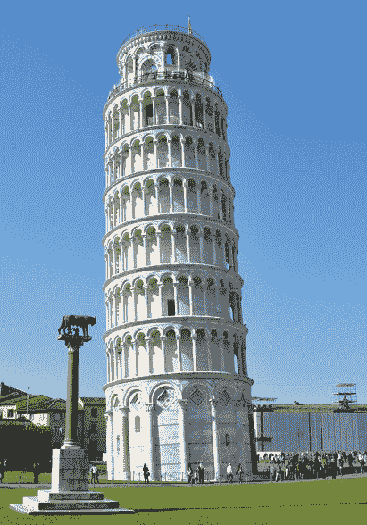

图 7-1：比萨斜塔（照片由 Svetlana Tikhonova 提供，依据 CC0 1.0 Universal [CC0 1.0] 公共领域献让许可；在图 7-2 至 7-4 中复制）

### 第 1 步：调查——定义多个视角

第一步是寻找比萨斜塔的照片，帮助可视化最终设计。我们收集了展示不同视角的图片，以便从各个角度了解这座建筑的样子，包括正面、背面、左侧、右侧和顶部。我们（毫不意外）没有找到底部视图的照片，但我们寻找了能够清楚展示塔楼与地面接触的照片。

设计周期中的*调查*步骤非常重要，即使你想要建造一些自己发明的东西。如果你找不到你想要建造的确切图片，可以寻找类似的东西。如果运气不好，手工草绘出你预期设计的粗略草图。*在*编码之前可视化你的设计，将为你节省大量的时间和挫折。关键是，在敲下第一行代码之前，先绘制出你的开发过程图。

### 步骤 2：规划——应用计算思维

通过对比萨斜塔外观有清晰的了解，你将分析这座建筑，找出可以应用*计算思维*原理的地方：分解、模式、抽象和算法。在使用 OpenSCAD（或任何其他编程语言）创建设计时，应用这些原理将帮助你更聪明地工作，而不是更辛苦地工作，并使计算机为你完成繁琐的任务。

#### 分解

*分解*是将一个庞大、复杂的问题拆解成更小、更易描述的子问题的过程，这有助于你在大型项目中识别何时创建模块并将文件分开。分解比萨斜塔的一种方法是将建筑物分为三个不同的部分（底部、中部和顶部），它们都以相同的角度“倾斜”。然后，你可以将这三个部分分解成更小的子组件，如柱子、层级、围栏和拱门（图 7-2）。


图 7-2：使用基本的分解方法将塔楼分解为更小的组件

#### 模式

在设计中寻找*模式*有点像分解，因为目标是将一个复杂的设计分解成更小、更易于管理的部分。然而，模式的目标是总结元素如何重复出现的过程（图 7-3）。

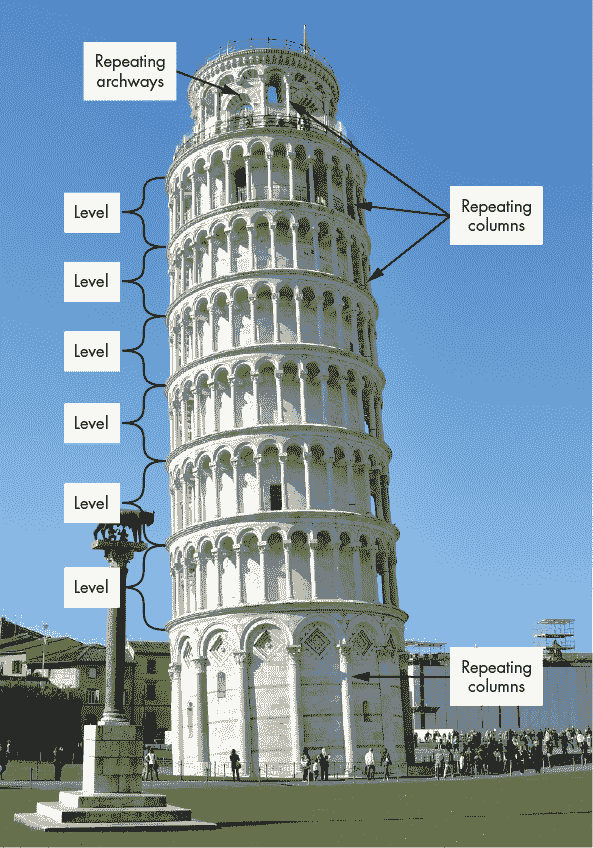

图 7-3：重复形状的模式

例如，比萨斜塔的中间部分基本上是由相同的形状组重复六次组成的。每个“层级”也都包括围绕其外周重复的拱门/柱子。事实上，底部和顶部部分也包含重复的拱门/柱子（尽管与中间部分的大小和间隔不同）。此外，顶部部分有两道围栏，重复的柱子，以及多种尺寸的重复拱门形状。

#### 抽象

*抽象*是通过高层次的描述总结较小细节的过程，以便传达全局信息。将比萨斜塔的每个部分表示为一个圆柱体是一种通用的抽象，省略了许多细节（图 7-4）。

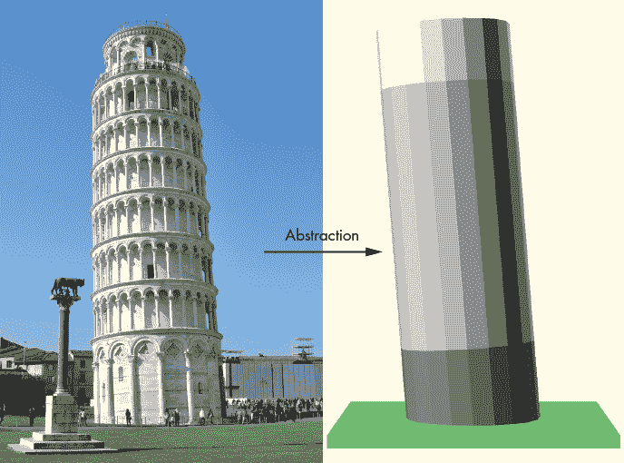

图 7-4：比萨斜塔抽象为三个圆柱体的示意图

将三个部分抽象为圆柱体使你能够在考虑较小且不太重要的特征之前，专注于更大的元素（如塔的倾斜角度和每个部分的比例大小）。

#### 算法

由于比萨斜塔的建筑中存在大量重复，创建塔的设计*算法*需要多个循环。例如，塔周围的柱子涉及一个不断递增旋转角度的循环。循环的柱子出现在三个部分（底部、中部和顶部）中，尽管每个部分包含不同数量的重复柱子，并且大小各异。

比萨斜塔周围不同大小的柱子的多个使用案例表明，使用参数化柱模块是一个合适的算法选择；在模块中包含参数可以让你为塔的每个部分重用相同的基本代码。事实上，这个项目的设计提供了许多机会来在你的代码中使用模块。在项目的分解和模式分析过程中，你确定的每个基本组件都可能成为模块的候选项。在这种情况下，你可以为顶部部分、中部部分、底部部分、层级、柱子、拱门和围栏创建模块。

### 步骤 3：创建—使用行走骨架方法

设计周期的前两步目标是理解你想要构建的内容，并为将一个大型复杂项目拆解成一系列可管理的部分创建明确的策略。在第 3 步中，你通过使用行走骨架开发过程开始编码，使你能够将设计从粗略的构建块演变为最终的高度详细完成品。你将使用这种方法创建塔的多个版本，在每次设计迭代中进行逐步改进（图 7-5）。

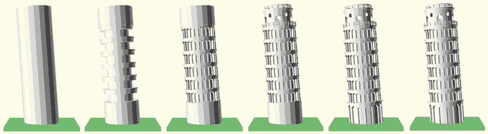

图 7-5：使用行走骨架方法演化比萨斜塔

图 7-5 中顶部、中部和底部的初始版本是最终详细版本的粗略抽象。这些设计的主要部分首先作为建筑骨架连接，然后在一个演变的过程中逐渐完善——因此称之为*行走骨架*。

### 步骤 4：评估—决定哪些设计过程步骤需要重复

设计周期的“最终”步骤更多的是一个问题而不是其他。你的设计是否达到了预期的效果？根据答案，决定需要重新审视设计过程中的哪些步骤。

为了解答塔楼示例中的问题，你将通过将渲染的 OpenSCAD 模型与真实的比萨斜塔照片进行对比。事实上，你将在每次步态骨架迭代后应用评估步骤，以决定下一次迭代要添加哪些特征。

## 步态骨架：构建比萨斜塔

在本章的剩余部分，你将通过一系列设计迭代构建比萨斜塔的多个版本，以展示步态骨架开发过程。每个版本都会增加更多细节，因此你需要将每个迭代与参考照片进行对比，并在过程中重新考虑你的计划和算法。这个方法让你可以将设计周期应用到每个迭代中，而无需过多担心代码的组织或连接方式。

### 迭代 1：连接塔楼的基本构建块

第一个版本塔楼设计的目标是创建并连接建筑的三个部分：顶部、中部和底部。你还需要加入一个平台以保证稳定性（毕竟塔楼是倾斜的）。

将建筑的整体设计分解为更小的部分，为逐步发展设计提供了基础，因为你可以独立编辑塔楼的各个部分。最初，你将只生成基本的圆柱体，作为每个部分设计的大致近似，因为步态骨架的第一阶段仅专注于连接项目的各个构建块（图 7-6）。

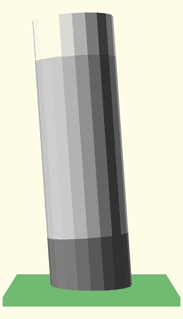

图 7-6：一个具有三个部分的抽象塔

虽然你可以使用一个包含多个模块的非常大的文件，但你将把这些部分分离到独立的文件中（*bottom.scad*、*middle.scad* 和 *top.scad*），并创建一个连接文件（*tower.scad*）。将代码分布在多个文件中可以让你轻松创建、查找和编辑每个部分相关的模块。你还可以使用这种多文件方法与他人合作，每个人可以同时专注于不同的文件。

第一步中最棘手的部分是考虑设计中不同组件之间如何相互作用。通常，这意味着需要识别每个设计部分绘制所需的关键信息。例如，为了绘制每个部分的抽象圆柱形表示，你至少需要该部分的高度和半径。主要项目文件（*tower.scad*）将通过模块参数把这些信息传递给每个部分。

由于顶部、中部和底部部分都使用圆柱体作为最终设计的抽象表示，因此首先创建这些文件相对容易。在设计的这个阶段，每个部分的代码看起来非常相似，这也是抽象的另一个优点。你不需要担心小细节，所以你可以在这三个文件中复制粘贴代码，仅进行最小的修改。

*bottom.scad* 文件定义了一个圆柱体来创建塔的最低部分的简单版本：

```
// bottom.scad v1
1 module bottom_section(width, height) {
    radius = 0.5 * width;
    cylinder(h=height, r=radius);
}
```

*tower.scad* 文件通过 `width` 和 `height` 参数将底部部分的尺寸传递给 `bottom_section` 模块 1。

接下来，*middle.scad* 文件定义了中部部分的初步版本：

```
// middle.scad v1
1 module middle_section(width, height) {
    radius = 0.5 * width;
    cylinder(h=height, r=radius);
}
```

再次，*tower.scad* 文件通过 `width` 和 `height` 参数将宽度和高度传递给 `middle_section` 模块 1。

类似地，*top.scad* 文件定义了一个基本的圆柱体来表示塔的顶部部分：

```
// top.scad v1
1 module top_section(width, height) {
    radius = 0.5 * width;
  2 cylinder(h=height, r=radius);
}
```

与底部和中部部分一样，*tower.scad* 文件使用参数为 `top_section` 模块提供所需的尺寸 1。三个模块中的参数顺序和数量是相同的。这是一个故意的选择，用以简化设计架构。随着设计复杂性的增加，*top.scad*、*bottom.scad*、*middle.scad* 和 *tower.scad* 之间的一致接口将使得调整每个部分的比例变得更容易。将每个圆柱体的测量值看作结构的半径而非直径 2 也是一个故意的决定（尽管有些任意）。在这一阶段，将宽度作为圆柱体的直径也可以理解。

接下来，我们创建 *tower.scad*，它提供了必要的尺寸并将塔的三个部分与平台连接起来：

```
// tower.scad v1
1 use <bottom.scad>
use <middle.scad>
use <top.scad>

2 tower_height = 100;
tower_width = 0.3 * tower_height;
bottom_height = 0.2 * tower_height;
middle_height = 0.65 * tower_height;
top_height = 0.15 * tower_height;

base_width = 2 * tower_width;
base_height = 0.1 * tower_width;

lean_angle = 4;

3 $fn = 20;

4 rotate([lean_angle, 0, 0]) {
    color("grey") {
        bottom_section(tower_width, bottom_height);
    }
    color("lightgrey") {
        translate([0, 0, bottom_height])
            middle_section(tower_width, middle_height);
    }
    color("white") {
        translate([0, 0, bottom_height + middle_height])
          5 top_section(tower_width, top_height);
    }
}

color("lightgreen") {
 6 cube([base_width, base_width, base_height], center=true);
}
```

*tower.scad* 文件的第一部分链接到前面描述的三个文件，这些文件定义了塔的顶部、中部和底部部分 1。接下来的部分定义了变量，用于帮助组织塔的重要特性 2。

由于设计不仅包括塔，还包括一个平台来保证稳定性，你创建了变量来组织整体塔的高度和宽度（`tower_height` 和 `tower_width`），塔各部分的高度（`bottom_height`、`middle_height` 和 `top_height`），平台的高度和宽度（`base_height` 和 `base_width`），以及塔的整体“倾斜”角度（`lean_angle`）。你最初将 `tower_height` 变量设置为一个任意值，然后将其作为大多数其他变量定义的一部分。例如，底部部分的高度是 `tower_height` 变量的 20%，因此如果你想改变整个设计的尺寸，只需改变 `tower_height` 变量的值。

接下来，您使用相对较少的段数（20）来近似曲线形状，以加速初始设计的渲染过程 3。最后的设计迭代将段数增加到 100，以便在最终设计中生成更平滑的曲面。

为了避免对所有三个部分重复相同的旋转操作，您使用一个操作将一致的旋转角度应用于三个部分 4。每个部分通过相应的模块调用，并调整其宽度和高度的参数。`translate`操作将中部和顶部部分沿 z 轴移动 5。

最后，您将平台绘制为一个简单的长方体 6。您还为地面和每个部分应用不同的颜色，以表示基本的比例关系。

从这一点开始，您不再需要对*tower.scad*文件进行重大更改。您最初对每个部分进行正确尺寸设置和定位的努力将构成塔楼设计的建筑“骨架”，而接下来的设计迭代将填补塔楼顶部、中部和底部部分的缺失细节。未来您可能需要对该文件进行的唯一更改是调整参数，以便在设计演变时微调比例，或者更改`$fn`以提高渲染模型的平滑度。您只需替换数值，而不是编写新的代码语句来进行这些更改。

### 迭代 2：在中间部分寻找重复

让我们仔细看看塔楼的中部部分（*middle.scad*）第二次迭代，并运用一些来自规划阶段的计算思维技巧——即分解和寻找模式。在中部部分，相同的形状集合（或层级）垂直重复六次（图 7-7）。

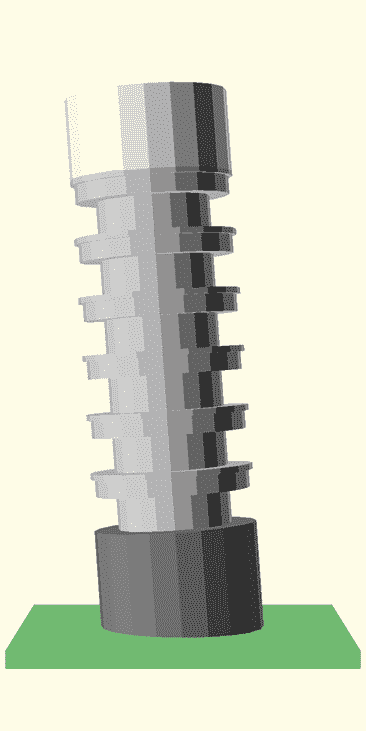

图 7-7：带有循环中间部分的抽象比萨斜塔

图 7-8 显示了其中一个重复的层级形状。

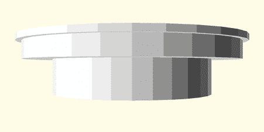

图 7-8：单个层级形状

要创建这些重复的层级，您需要对*middle.scad*文件进行以下更改：

```
// middle.scad v2
level(50, 25);

module middle_section(width, height) {
   level_height = height / 6;
   level_radius = 0.5 * width;

 1 for (h=[0:1:5]) {
     floor_offset = h * level_height;

     translate([0, 0, floor_offset]) 
       level(level_radius, level_height);
   }
} 

2 module level(level_radius, level_height) {
    lip_height = 0.1 * level_height;
    inner_radius = 0.7 * level_radius;
    overhang_height = 0.3 * level_height;
  3 overhang_radius = 0.95 * level_radius;

    // lip
    translate([0, 0, level_height - lip_height])
      cylinder(h=lip_height, r=level_radius);

    // overhang
    translate([0, 0, level_height - lip_height - overhang_height]) 
       cylinder(h=overhang_height, r=overhang_radius); 

    // inner structure
    cylinder(h=level_height, r=inner_radius);
}
```

这些更改为中间部分增加了更多的细节，使其不再是一个抽象的圆柱体。`level`模块 2 组织了构成中间部分每一层的所有形状，`for`循环 1 为该部分的六层每一层重复创建一个新的`level`形状。现在，每一层都包括一个延伸到塔全半径的唇缘，一个为柱子提供天花板的悬挑结构，以及一个用于容纳楼梯、门等的内部结构。您创建了几个变量，将每一层特征的大小（`lip_height`、`inner_radius`、`overhang_height`和`overhang_radius`）与`level`模块参数（`level_radius`和`level_height`）相关联 3。

使用这个重复的`level`模块，您可以通过在一个地方进行修改，立即同时更新所有六层。例如，如果您想让每一层的边缘稍微厚一点，或者改变悬挑半径以提供更多的柱子空间，您只需对`level`模块定义进行一次简单的修改。因为在我们步进式构建的过程中，您只是在这一阶段对`middle_section`模块添加细节，所以*middle.scad*是您需要更新的唯一文件，用于塔楼设计的第二次迭代。

要在整体设计中看到这些新变化的反映（图 7-7），保存*middle.scad*文件，然后在*tower.scad*中预览整个设计。除了使您的设计更改永久生效，保存*middle.scad*文件还可以让 OpenSCAD 知道您希望其他文件使用更新后的代码。如果您希望单独查看`middle_section`或`level`形状，可以在*middle.scad*顶部创建该形状并预览该文件。您可以在*middle.scad*中包括一个语句来绘制`middle_section`或`level`形状，而不用担心这些形状会自动显示在其他文件中。通过`use`指令连接另一个文件与*middle.scad*，意味着来自*middle.scad*的模块定义将在*tower.scad*中可用。除非连接的文件使用了*middle.scad*中的某个模块，否则*middle.scad*中的任何绘制形状都不会显示。

### 第三次迭代：为中间部分添加更多细节

在您的计算思维中，接下来要考虑的模式是沿每一层的周围重复柱子和拱门（图 7-9）。

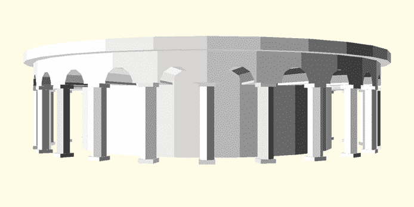

图 7-9：带有重复柱子的楼层

要将这些新模式应用到设计中，您需要创建一个`column`形状，并沿着`level`模块的圆周重复该形状。这意味着您需要再次修改*middle.scad*文件，因为`level`模块定义就在那个文件中。为了创建一个`column`形状，您还需要在新的*column.scad*文件中定义一个`column`模块。

在设计周期的规划阶段，您注意到柱子和拱门在塔楼的三个部分的周围重复出现。由于您需要在多个文件中包含柱子形状，在一个单独的文件中定义柱子模块，使得不同部分更容易使用该新形状定义。柱子和拱门在每个部分中以不同的模式重复，它们的装饰性也有所不同。因此，在这个初步阶段，您将专注于创建一个具有基本组件的抽象柱子（图 7-10）。然后，您可以在后续设计迭代中更新这个基本的柱子定义。

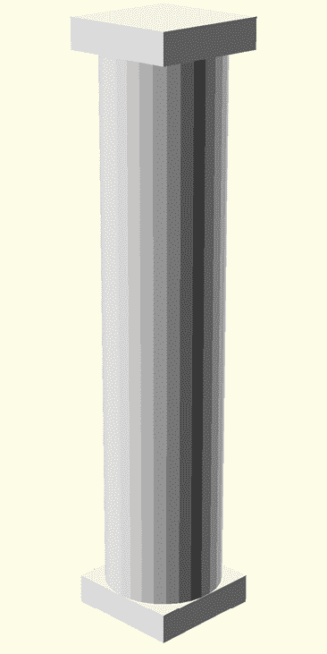

图 7-10：一个抽象柱子

在一个单独的文件*column.scad*中创建`column`模块，可以在未来根据需要更轻松地共享和发展您的柱子使用方式：

```
// column.scad v3
1 module column(col_width, col_height) { 
    col_radius = 0.5 * col_width;
  2 orn_height = 0.05 * col_height; 

    translate([-col_radius, -col_radius, col_height - orn_height]) 
        cube([col_width, col_width, orn_height]);
    cylinder(h=col_height, r=col_radius);
    translate([-col_radius, -col_radius, 0]) 
        cube([col_width, col_width, orn_height]);
} 
```

与其他模块一样，你在`column`模块 1 中包含了两个参数（`col_width`和`col_height`），提供了创建柱形所需的信息。根据柱子的高度和宽度，创建了变量（`col_radius`和`orn_height`），用来描述柱子的半径以及柱子顶部和底部装饰的高度 2。虽然这样定义模块可能会使模块的定义变得更复杂，但定义并使用这些变量，而不是将重复的算术运算作为模块参数或操作内部的一部分，可以减少出错的可能性，将所有设计假设集中在模块的顶部，并且更容易更新所有涉及的测量值。

要调用这个新的`column`模块，你接下来需要修改*middle.scad*中的`level`模块，在每一层的圆周上绘制重复的柱子和拱门：

```
// middle.scad v3
1 use <column.scad>
...
module level(level_radius, level_height) {
  2 lip_height = 0.1 * level_height;
    inner_radius = 0.7 * level_radius;
    overhang_height = 0.3 * level_height;
    overhang_radius = 0.95 * level_radius;

    num_cols = 24;
    angle_size = 360 / num_cols;

    col_height = 0.65 * level_height;
    col_width = 0.2 * col_height;  

    arch_depth = 2 * (level_radius - inner_radius); 

    // lip
    translate([0, 0, level_height - lip_height])
        cylinder(h=lip_height, r=level_radius);

    translate([0, 0, col_height]) {
        difference() {
            // overhang
            cylinder(h=overhang_height, r=overhang_radius); 

            // arches
            3 for (i=[0:1:num_cols-1]) {
                angle = i * angle_size + angle_size/2;
                rotate([0, 0, angle])
                    translate([inner_radius, 0, 0]) 
                        rotate([0, 90, 0]) 
                            cylinder(h=arch_depth, r=col_width, center=true);
            }
        }
    }

 // inner structure
    cylinder(h=level_height, r=inner_radius);

    // columns
    4 for (i=[0:1:num_cols-1]) {
        angle = i * angle_size;
        rotate([0, 0, angle])
            translate([overhang_radius - 0.5 * col_width, 0, 0]) 
                column(col_width, col_height);
    }
}
```

将这个更新版本的*middle.scad*与第二次设计迭代中的版本进行比较，揭示了`level`模块中的三大新增内容。首先，*column.scad*通过`use`指令与此文件 1 连接，以便你可以在该文件中使用新的`column`模块来绘制柱子形状。接下来，定义了描述每层柱子数量（`num_cols`）、柱子沿塔圆周重复的角度（`angle_size`）、每个柱子的宽度和高度（`col_width`和`col_height`）以及从每层悬挑雕刻的拱门深度（`arch_depth`）的变量 2。

在创建悬挑后，你在差异操作中包含了一个`for`循环，用来在每个柱子位置之间雕刻出拱门 3。一个最终的`for`循环在层的圆周上重复绘制柱子 4。你也可以将这两个循环合并成一个单一的`for`循环，并使用`if`语句；然而，为了让逻辑更加清晰，这里将它们分开。

如前所述，为了在整体设计中看到这些新的变化，保存*middle.scad*和*column.scad*；然后在*tower.scad*中预览整个塔的设计。如果只想查看没有其他塔身部分的中部部分，在*middle.scad*的顶部添加一个语句来绘制`middle_section`形状；然后在*middle.scad*中预览设计。你还可以通过在*column.scad*的顶部添加一个语句来绘制`column`形状，然后在该文件中预览设计，这样也能轻松查看单独的柱子形状。

在使用相对较少的代码向中部部分添加大量重复的柱子和拱门后，塔的这一部分（图 7-11）现在与我们参考的比萨斜塔照片（图 7-1）更加相似。

然而，正如你在 图 7-11 中看到的，顶部和底部部分仍然是抽象的简化设计。在每次迭代后的设计周期评估步骤有助于识别缺失的细节，这些细节可能为设计提供最显著的改进。完成这一迭代后，你应该再次参考照片（图 7-1），决定塔楼的哪一部分现在最需要改进。

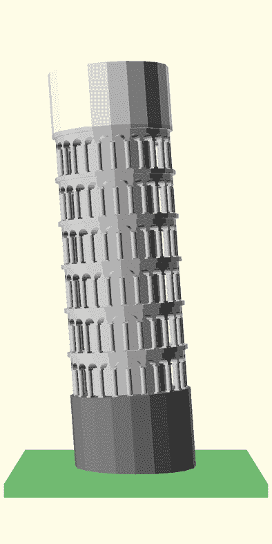

图 7-11：比萨斜塔带有模块化柱子

### 迭代 4：为顶部部分添加细节

塔楼顶部缺少围栏、重复的柱子和拱门（窗户和门），因此下一次迭代将集中在添加这些细节。你将为顶部部分添加两个围栏，并且会添加不同大小和高度交替的拱门（图 7-12），因此你将通过添加 `fence` 模块和 `archway` 模块来修改 *top.scad*。你将以不同的尺寸绘制 `archway` 模块，创建我们参考照片顶部部分中显示的门和窗户（图 7-1）。

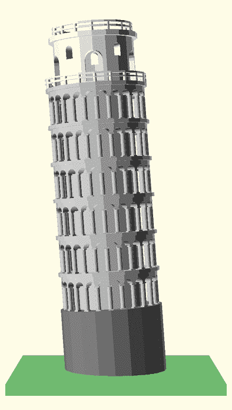

图 7-12：带有不同大小交替拱门的围栏顶部部分

更新后的 *top.scad* 文件将围栏和拱门的细节添加到塔楼的顶部部分：

```
// top.scad v4

module top_section(width, height) {
  1 top_radius = 0.4 * width;
    room_radius = 0.75 * top_radius;

    num_doors= 5;
    door_angle= 360 / num_doors;

    overhang_height = 0.1 * height;
    overhang_width = 1.1 * top_radius;

    door_height = 0.6 * height;
    door_width = 0.35 * height;

    window_height = 0.25 * height;
    window_width = 0.15 * height; 

 // overhang
    translate([0, 0, height - overhang_height])
        cylinder(h=overhang_height, r=overhang_width);  

    //inner structure
    difference() {
        cylinder(h=height, r=top_radius);  

        translate([0, 0, 1]) {
            cylinder(h=height-2, r=room_radius);

            2 for (i=[0:1:num_doors-1]) {
                angle = i * door_angle;
                rotate([0, 0, angle])
                    translate([top_radius-2, 0, 0.25*height]) 
                        // doors
                        archway(door_height, door_width, room_radius);
                rotate([0, 0, angle+0.5*door_angle])
                    translate([top_radius - 2, 0, 0.6*height]) 
                        // windows
                        archway(window_height, window_width, room_radius);
            }
        }
    }

    //fencing
    translate([0, 0, height]) 
        fence(15, 3, top_radius, 1);
  3 fence(20, 3, 0.5*width, 1); 
}

4 module fence(num_posts, fence_height, fence_radius, post_width) { 
    post_radius = 0.5 * post_width;
    angle_size = 360/num_posts;
    ring_height = 0.5;
    post_height = fence_height - ring_height;

    translate([0, 0, post_height])
        ring(fence_radius - post_width, fence_radius, ring_height); 
    translate([0, 0, post_height / 2])
        ring(fence_radius - post_width, fence_radius, ring_height);

    for (i=[0:1:num_posts-1]) {
        angle = i * angle_size;
        rotate([0, 0, angle])
            translate([fence_radius - post_radius, 0, 0])
                cylinder(h=post_height, r=post_radius);
    }
}

5 module ring(inner_radius, outer_radius, height) { 
    difference() {
        cylinder(h=height, r=outer_radius);
        translate([0, 0, 1])
 cylinder(h=height+2, r=inner_radius, center=true);
    }
}

6 module archway(height, width, depth) { 
    radius = 0.5 * width;

    rotate([90, 0, -90]) {
        translate([0, (height - radius) / 2, -depth / 2])
            cylinder(h=depth, r=radius);
        cube([width, height - radius, depth], center=true);
    }
}
```

和其他模块定义一样，你首先定义变量来描述顶部部分的各种特征 1。窗户的数量基于门的数量（`num_doors`），但其他部分，你刻意选择了自文档化的变量名。一个包含在 `difference` 操作中的 `for` 循环从顶部部分的内部结构中减去重复的窗户和门 2。窗户和门形状相似，因此你定义了一个单独的 `archway` 模块，通过 `height`、`width` 和 `depth` 参数来改变窗户和门形状的大小 6。

`top_section` 模块通过绘制两个围栏形状来结束 3。这些围栏基本相同，但尺寸不同，因此你定义了一个 `fence` 模块来构建它们 4。你还包含了一个 `ring` 模块，以便更容易创建各种围栏环 5。`ring` 模块的定义是从之前的设计活动中转移过来的（见第五章）。重复使用以前项目中的模块可以节省大量时间和精力。

为了简化项目的组织，你只在 *top.scad* 文件中包含了 `fence`、`ring` 和 `archway` 模块，因为其他部分没有这些形状。与之前的设计迭代一样，保存你对 *top.scad* 的更新；然后预览设计，以便查看这些更改在其他文件中的效果。

`top_section` 模块现在生成了塔楼顶部的更详细版本（图 7-13）。

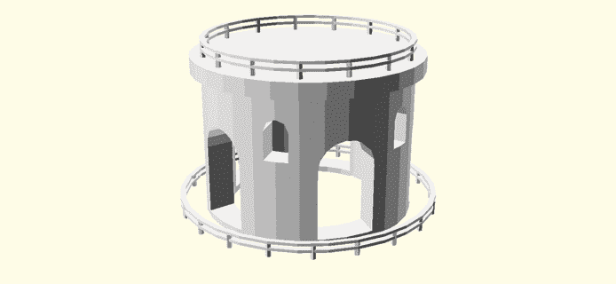

图 7-13：带有交替拱门的围栏顶部部分，详细视图

将这个设计迭代与塔楼的参考照片进行比较（见图 7-1），你的评估表明底部部分现在需要最多的关注。

### 迭代 5：为底部部分添加细节

此更新修改了*bottom.scad*文件，加入了主要缺失的特征（柱子和拱门）：

```
// bottom.scad v5

1 use <column.scad> 

module bottom_section(width, height) {
    radius = 0.5 * width;
    inner_radius = 0.9 * radius;
    lip_radius = 1.05 * radius;
    lip_height = 0.05 * height;
    overhang_height = 0.2 * height;

    num_cols = 14;
    angle_size = 360 / num_cols;
    col_height = height - overhang_height;
    col_width = 0.1 * col_height;

    // lip
    translate([0, 0, height - lip_height])
        cylinder(h=lip_height, r=lip_radius);

    // inner structure
    cylinder(h=height, r=inner_radius);

    // columns
  2 for (i=[0:1:num_cols-1]) {
        angle = i * angle_size;
        rotate([0, 0, angle])
            translate([radius - 0.5*col_width, 0, 0])
                column(col_width, col_height);
    }

    // arches
    translate([0, 0, col_height]) 
        difference( ) {
          // overhang
          cylinder(h=overhang_height, r=radius);        

          // arches  
          3 for (i=[0:1:num_cols-1]) {
            angle = i * angle_size + angle_size/2;
            rotate([0, 0, angle]) 
                translate([inner_radius, 0, 0])
                    rotate([0, 90, 0])
 cylinder(h=radius-inner_radius, r=col_width);
        }
    }
}
```

你首先引入了*column.scad*，以便访问`column`模块 1。这允许你使用`for`循环在底部部分的周围绘制柱子 2。底部部分的柱子比中间部分的柱子要大，因此绘制柱子的参数进行了相应的调整。接着你添加了拱门，同样使用`for`循环 3。

保存*bottom.scad*文件，然后预览设计，查看塔楼底部部分的新细节（见图 7-14）。

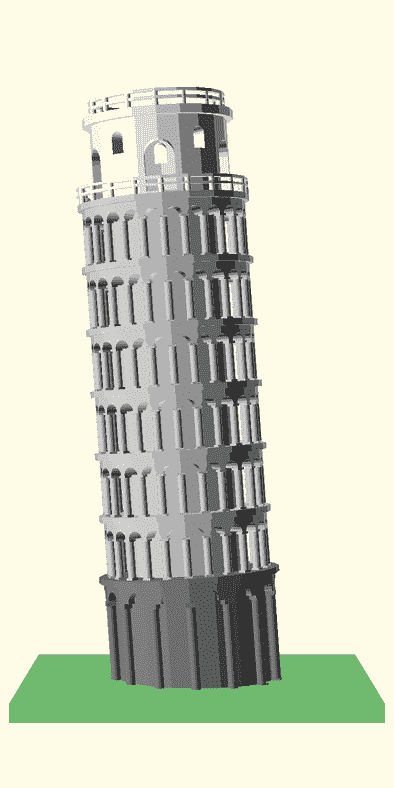

图 7-14：更新后的底部部分塔楼

现在，塔楼在视觉上已经非常接近实际的比萨斜塔。你可以再次进行评估阶段，但如果你打算制作一个小型的 3D 打印模型，添加更多细节可能不会带来太大好处。

### 设计周期的最终评估

在这个阶段，塔楼看起来非常类似于比萨斜塔。对*tower.scad*中的`$fn`进行轻微修改，可以增加设计的平滑度，使其与真实比萨斜塔更加相似（见图 7-15）。

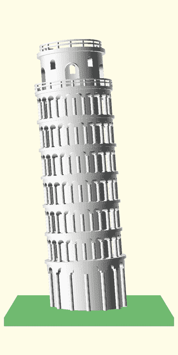

图 7-15：使用`$fn=100`而不是`$fn=20`的更平滑塔楼

你把最小的细节留到最后，这是“行走骨架”开发方法的一个故意特点。每次设计迭代都集中在一个主要领域，特别选择该领域来提供最明显的整体塔楼设计改进。如前所述，由于你打算 3D 打印这个模型，你省略了特别小的细节，但本可以包括以下内容：

+   顶部部分缺失的柱子和拱门。

+   中间和底部部分缺失的矩形门口。

+   每个部分的柱子和拱门的不同装饰。

+   柱子不是简单的圆柱形，你本可以将柱子的顶部半径设为比底部小。

我们提到这些缺失的特征，作为想要继续进行此模型设计迭代的读者的潜在练习。更大的 3D 打印可能会揭示出这些较小的设计特征。

## 设计组织概览

在你的第一次设计迭代中，你将建筑分为三个低保真度的部分，每个部分都有一个单独的*.scad*文件。这样，你只需要预览一个文件（*tower.scad*），因为该文件将三个文件连接在一起。图 7-16 展示了初始项目的组织结构，这样可以减少每个文件中的代码量，便于查找和修改特定部分。

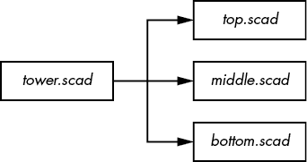

图 7-16：比萨斜塔项目的初步架构

在整个设计过程中，你使用了分解技术来寻找将塔的更大组件拆分成更小部分的机会。在你最后一次迭代后，项目的组织结构发展成包含许多模块和一个额外文件的形式（图 7-17）。这个最终的项目组织展示了“走动骨架”开发方法的主要原则。你的初始项目组织侧重于连接项目的大块部分，而最终的组织结构则展示了你在每次迭代中逐步增加的小细节。

这里描述的组织和开发过程只是构建此项目的一种方式。除了将项目组织成不同集合的独立*.scad*文件（甚至是一个巨大的*.scad*文件）外，你还可以创建不同的模块集，将塔分解为更小的构建块。

我们也错过了几个通过加入额外的`if`语句或`for`循环来减少重复代码的机会。例如，你本可以创建一个单独的`column_ring`模块，以“提取”塔周围的柱子和拱门的包含内容。通过谨慎使用`if`语句和参数，你可以利用`column_ring`模块绘制三部分中的柱子和拱门，从而大大简化`top_section`、`middle_section`和`bottom_section`模块中所需的代码。

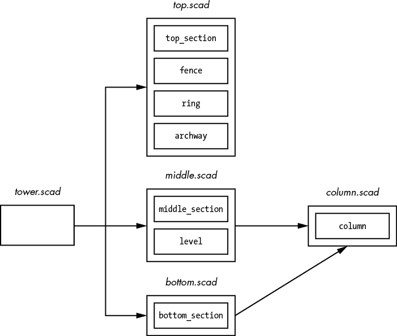

图 7-17：比萨斜塔的最终架构

设计可以随着时间的推移演变，而不会对整体项目的组织结构造成重大变化。你不需要在项目开始时就知道所有需要创建的模块或文件；你可以在对自己正在构建的内容有更好理解后再做决定。每次应用设计周期的评估阶段时，你都有机会重新考虑需要对设计做出的更改。

## 总结

本章介绍了在构建复杂项目时，故意遵循设计周期的好处。你应用了计算思维来指导规划阶段，并采用了“走动骨架”方法将构建和评估阶段结合成一个循环过程。你首先连接了设计中最重要的特性，然后逐步开发每个组件的主要特性。直到开发的最后阶段，你才考虑更小、更细致的细节。

总结一下，在设计复杂项目时，请牢记以下概念：

+   画出你想要构建的项目草图，并用模式、抽象和分解来标注它，帮助你理解如何组织代码。

+   描述绘制新形状所需的最少信息可以帮助你理解新模块可能需要哪些参数。

+   使用自文档化的命名约定将有助于通过揭示每个新变量或模块的目的来组织你的代码。

+   使用颜色来帮助组织不断发展的设计中的不同部分。

+   在进行任何更改时，请确保保存单独的文件，这样其他文件才能使用该文件的最新版本。

+   首先连接项目中最重要的部分，即使这些部分是大致的抽象概念。

+   在步态框架开发方法的最后阶段，设计项目的最小细节。

设计周期和步态框架开发模型是常见的方法，您可以在线找到大量资料供进一步阅读。在使用 OpenSCAD 创建新设计时，我们鼓励您进一步探索这些概念。
