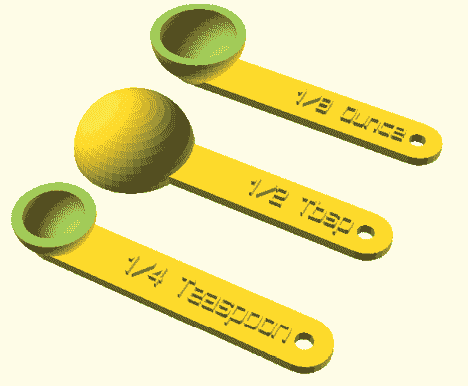
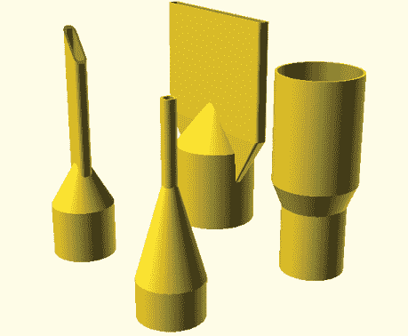
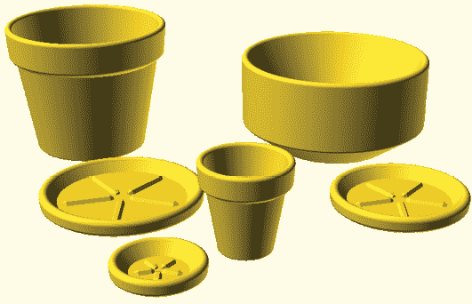
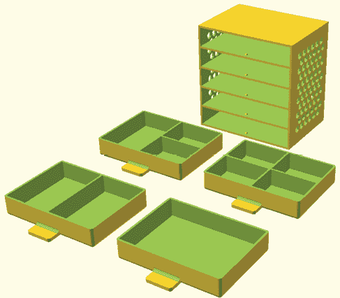
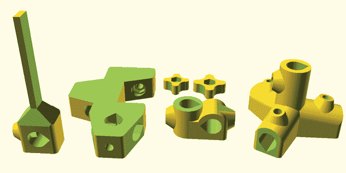
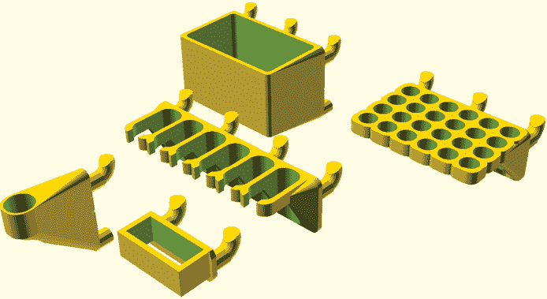

# 第八章：后记

阅读完本书后，特别是如果你参与了设计时间和大型项目练习，你应该已经牢牢掌握了如何使用 OpenSCAD 编程语言创建 3D 打印设计。最后，我们将提供一些有用的建议，指导你接下来该去哪里，并帮助你理解 OpenSCAD 如何融入开源和创客运动的更大生态系统。

## 了解更多关于 OpenSCAD 的信息

我们在这里已经涵盖了 OpenSCAD 大部分可用功能；然而，仍有更多高级功能等待你去发掘。各种资源可供你解锁 OpenSCAD 的全部创意力量：

**访问 OpenSCAD 在线文档**

一旦你准备好进一步提升你的 OpenSCAD 技能，你的第一站应该是官方在线 OpenSCAD 文档（[`openscad.org/documentation`](https://openscad.org/documentation)）。这是寻找其他结构良好的学习指南的地方，帮助你深入了解 OpenSCAD。你将找到教程、用户手册、更完整的语言参考以及定期更新的链接，包含许多其他学习材料，包括书籍、文章和视频。

**重新混合他人的 OpenSCAD 设计**

对于稍微不那么结构化的学习，尝试重新混合现有的 OpenSCAD 设计。学习阅读其他人编写的代码，能显著提升你的编码和组织能力。你可以轻松在线搜索 OpenSCAD 设计，并务必查看两个最受欢迎的 3D 设计共享网站：[`thingiverse.com/`](https://thingiverse.com/) 和 [`youmagine.com/`](https://youmagine.com/)。搜索*openscad*将会找到成千上万的 OpenSCAD 设计供你使用和混合。

大多数设计也可以作为 OpenSCAD 代码提供，你可以探索它们，了解其他人是如何在代码中解决具有挑战性的设计问题的。通过将你自己的创新整合到他们的代码中，重新混合他人的设计，是展示你真正理解他们设计中各个部分如何组合的好方法。

**加入 OpenSCAD 社区**

与 OpenSCAD 设计师社区中的志同道合者互动，是补充你学习的另一种方式。有时候，你的设计想法可能会提出一些独特的挑战，无论阅读或搜索多少，都难以找到答案。向 OpenSCAD 社区寻求帮助，可能会提供完美的解决方案。

官方 OpenSCAD 社区页面 ([`openscad.org/community`](https://openscad.org/community)) 提供了一个聊天室、邮件列表和论坛，OpenSCAD 用户可以在这里讨论项目、寻求帮助，甚至促进 OpenSCAD 本身的发展。OpenSCAD 是开源软件，开发讨论通常会在社区成员聚集的同一论坛上进行。除了可以找到解决你最困扰的设计问题的答案，参与 OpenSCAD 论坛意味着你也可以帮助他人，甚至通过建议新功能或报告 bug 来影响 OpenSCAD 软件本身的发展。

## 开源精神

正如我们在本书中多次提到的，OpenSCAD 是开源软件。专有的 3D 设计软件通常价格昂贵，并且有陡峭的学习曲线。即便是“免费”的基于网页的 3D 设计工具，通常也需要创建账户，这可能引发关于隐私或服务持续性的问题。OpenSCAD 的开发者社区希望创造一个真正免费且易于访问的 3D 建模平台，向每个人，尤其是对编程与 3D 设计交叉领域感兴趣的人开放实体 CAD 建模的世界。成百上千的人捐出了他们的时间和精力，以便为你创建和改进 OpenSCAD，期望通过消除这些传统的障碍，鼓励更多的人学习并利用 3D 建模来解决大小问题。

### 动机与生态系统

为什么这么多人会花费如此多的时间和精力，将传统上“困难”和“昂贵”的东西转变为既免费又更加易于访问和接近的形式？让 OpenSCAD 成为开源的背后有一些重要的动机，包括以下几点：

+   支持庆祝跨文化和跨学科探索的社区

+   支持并参与包容性教学、学习和分享重要的 STEM/STEAM 技能

+   鼓励个人与他人分享他们工作和努力的成果

+   通过提供基于群体的迭代设计过程，使个人能够通过对现有创作的拥有权来推动事物变得更好

+   相信将成果回馈他人会激励更多人也回馈他人，从而对社会产生更大的积极影响

事实上，OpenSCAD 开源项目的存在也得益于陌生人的善意。OpenSCAD 开发社区依赖于许多其他开源项目，这些项目的创建目的是让他人使用这些技术（希望）让世界变得更好。以下是一些最突出的例子：

+   使用 Qt 帮助构建 OpenSCAD 用户界面 ([`qt.io/`](https://qt.io/))

+   使用 CGAL 帮助评估构造实体几何（CSG）在 OpenSCAD 设计渲染时的表现 ([`cgal.org/`](https://cgal.org/))

+   OpenCSG 与 OpenGL 帮助生成 OpenSCAD 设计的 CSG 预览（[`opencsg.org/`](http://opencsg.org/) 和 [`www.opengl.org/`](https://www.opengl.org/)）

+   Boost 提供丰富的 C++便利库（[`boost.org/`](https://boost.org/)）

+   Eigen 提供快速且经过充分测试的线性代数函数（[`eigen.tuxfamily.org/`](https://eigen.tuxfamily.org/)）

我们要感谢 OpenSCAD 的开发者以及每一个开源项目的贡献者，感谢他们的时间和宝贵贡献。

### 网络公民身份

很容易忘记，你通过屏幕访问互联网时，屏幕的另一端是真正的人。开源软件运动在很大程度上依赖于网络公民身份的理念，确保互联网的分布式社交网络能够促进积极的社会变革，同时支持人权的进步。以下是一些关于网络公民身份的起始原则，我们希望你在继续使用 OpenSCAD 和其他开源软件项目的过程中，能始终铭记：

**给予应得的荣誉**

当你使用别人创作的东西时，请注明出处。这有助于支持原创作者（即使只是赞扬）并表明你意识到“站在巨人的肩膀上”的特权。

**对他人保持同理心**

记住，你在网上互动的对象不一定与你拥有相同的背景、语言、文化或内在笑话。在所有社区空间中，保持并展示一种尊重和体贴的沟通方式。尊重你所创造的事物对文化和环境的影响。

**传递善意**

创造能够帮助解决实际问题的事物。分享你的创作，特别是当你通过使用其他人免费提供的工具时所创作的内容。

## OpenSCAD 与创客运动

如果忽略 OpenSCAD 与创客运动的关系，那将是一个失误。*创客*已成为一个日益流行的术语，用来描述采取创意、DIY 方式解决问题的做法。创客通常包括通过使用迭代设计过程以及各种机器、工具和材料来尝试解决问题：纸板原型制作、3D 打印、激光切割、电子学、焊接、木工、缝纫、CNC（计算机数控）加工、乙烯基切割、丝网印刷、水刀切割等等。

OpenSCAD 是创客社区的一个关键软件工具。虽然本书主要集中于使用 OpenSCAD 进行 3D 打印设计，但 3D 打印仅仅是创客社区利用 OpenSCAD 所创造的成果的一部分。将 OpenSCAD 与 3D 打印结合是解决许多问题的绝佳方案，但它并不总是最好的解决方法。培养一种对创客领域内设计工具和范式的全面而深入的理解，会带来许多好处。

### 创作与创造性问题解决

我们特意使用了*设计*这个词来描述 OpenSCAD 创作，因为每一个 OpenSCAD 项目都是为了一个特定的原因而创建的，通常是为了解决现实世界中的物理问题。设计的基本概念是*问题解决*的实践。就像游泳一样，通过设计解决问题是一项真正只有在“水中”时才能学习的技能。每次完成一个 OpenSCAD 项目，你都会提高自己设计特定问题解决方案的能力。

创客运动正确地认为通过设计进行创造性问题解决是一项可转移的技能。如果你是创客运动的新手，你可能会惊讶地发现，设计一个缝纫工具包可以帮助你更好地创建 OpenSCAD 代码的有序序列，或者制作多层丝网印刷可以帮助你将复杂问题分解成定义明确的小部分。你可以在任何媒介中获得这些更高层次的设计技能。除了你在本书中学到的可转移的编程和 3D 打印技术，我们希望你会考虑将你的新问题解决和设计能力应用于其他一些有趣的方向。

### 2D 制造

2D 制造的世界是应用你在本书中所学技能的广阔领域。将 2D 影像拉伸为 3D 设计是一个强大的 3D 设计工具。然而，许多创客工具使用 2D 文件（如*.svg*或.*dxf*）来制造其设计的物理版本。2D 制造机器（如激光切割机、乙烯基切割机、水刀切割机等）本质上是将 2D 形状的轮廓切割成木材、金属、乙烯基、毡子、纸板或大多数其他平面材料的平面片。由于 OpenSCAD 使得使用变量、算术、循环和`if`语句来放置和组合形状变得非常容易，许多创客使用 OpenSCAD 专门为这些机器创建纯 2D 设计。

这里有一些想法，可以激发你用 OpenSCAD 进行 2D 创意设计：

+   使用一组循环生成你在 OpenSCAD 中创建的 2D 皮革缝纫图案周围的小圆孔。然后，用激光切割机或切割机将图案切割出来。皮革很难用针穿透，但使用 OpenSCAD 循环来生成孔洞将帮助节省时间和精力。

+   使用 CNC 木材切割机将你用 OpenSCAD 2D 形状设计的平板家具制作成真实大小的版本。尽管 3D 打印机的打印区域相对较小，但 CNC 切割机可以切割出相当大的表面面积。3D 打印机可以用于原型制作，而可用的家具则是在大型 CNC 机器上制作的。

+   在你用 OpenSCAD 设计并拉伸出的 2D 齿轮的几个原型版本 3D 打印之后，用水刀切割机将其从金属中切割出来。塑料齿轮的使用寿命远不如金属齿轮，特别是当你实际上将它们用于你的自行车时。

### 物理计算

许多互动制作项目将电子技术和计算机与其他物理组件相结合，创造出具有动态特性的事物。如果你的 OpenSCAD 设计能够感知并响应世界，甚至能够移动，怎么样？有许多价格便宜、口袋大小的计算机可以大幅提升你使用 OpenSCAD 创建的设计的互动性。

这些微型计算平台利用多种传感器和输出设备（如麦克风、温度传感器、运动传感器、扬声器、马达和 LED）与现实世界互动。以下是一些最受欢迎的小型计算平台：

+   树莓派 ([`raspberrypi.org/`](https://raspberrypi.org/))

+   Arduino ([`arduino.cc/`](https://arduino.cc/))

+   micro:bit ([`microbit.org/`](https://microbit.org/))

+   Circuit Playground ([`learn.adafruit.com/introducing-circuit-playground/`](https://learn.adafruit.com/introducing-circuit-playground/))

每个这些设备都有一个庞大的在线社区，提供丰富的学习资源。将 OpenSCAD 与这些便宜的口袋大小计算机结合使用，可以探索诸如机器人学、物理计算、可穿戴计算、人机交互或物联网等领域。以下是你可能使用 OpenSCAD 和这些设备之一创建的一些项目示例：

+   自动植物/花园浇水系统

+   完全新的互动数字仪器

+   个人、多节点数据中心的物理外壳

+   帮助残障人士提高可访问性的个人辅助设备

通过使用 OpenSCAD 为这些电子设备发明创造性的新用途，你正在让你的项目更容易定制、共享和扩展。也许你甚至可以创造出一些东西，启动你自己的开源项目。

### 创客空间

创作可以在任何地方进行，但聚集在一个中心地点，让志同道合的创作者们共享想法并解决问题，已成为创客们的流行做法。*创客空间*是一个物理地点和创客社区，提供一系列工具、机器和学习资源。创客空间提供了你可能无法个人拥有的设备，并作为一个创客的物理社区，能提供与前述虚拟社区相同的好处。你可以在图书馆、学校、独立场地以及创客集会或节日活动中找到创客空间（无论大小、免费或收费） ([`makerfaire.com/`](https://makerfaire.com/))。

如果你所在的本地社区还没有提供集中共享的创作场所，一些创客空间已经转为虚拟形式。许多在线供应商允许你上传 3D 打印或 2D 切割设计，使用各种材料，为你提供一个经济实惠的起步平台，当你没有访问制造机的权限时，可以创建你设计的物理版本。

## 更多实践的最终想法

我们想给你一些最后的建议。掌握任何技能的关键在于学习与实践的结合。如果你仅仅阅读了这本书，而没有实际进行编码或设计，那你错过了大量学习的机会，但现在还不晚！你可以现在放下这本书，回到任何一个项目中去。

如果你在寻找更多定义明确的设计练习示例，下面的截图展示了 OpenSCAD 社区中的一些视觉创意，这些创意应该能很好地作为“下一步”项目的灵感。你还可以访问[`openscad.org/gallery`](https://openscad.org/gallery)查看更多精心挑选的示例。

### 可定制量勺

创建一个量勺模块是一个很好的中级设计项目（图 1）。该项目的主要挑战是创建一个包含勺子尺寸、单位和配置（嵌套堆叠勺子或平放的勺子）作为参数的单一 OpenSCAD 模块。然后，可以根据这些参数生成量勺的形状和标签。你能生成具有准确测量值的 3D 打印量勺，确保在烹饪或烘焙时信赖这些测量吗？

图 1：一个集合，包含多个尺寸和配置的量勺

这些量勺是通过最初由 charliearmorycom 设计的 OpenSCAD 代码生成的。你可以在[`www.thingiverse.com/thing:51874/`](https://www.thingiverse.com/thing:51874/)找到可定制量勺项目。

### 可定制吸尘工具

设计一个定制吸尘器吸嘴以适配吸尘管的末端是一个很好的例子，展示了如何与现有物理工具接口。创建一个完美契合的物理连接需要仔细测量，并通过 3D 打印机不断实验，以便完善尺寸。此外，这个项目还提供了一个创建可定制喷嘴的机会，可以通过一个或多个模块参数生成（图 2）。

图 2：一个集合，包含带有参数化喷嘴的吸尘器吸嘴

用于生成这些定制吸尘器吸嘴的 OpenSCAD 代码最初由 Ziv Botzer 设计。可定制吸尘工具项目可以在网上找到，网址为[`www.thingiverse.com/thing:1571860/`](https://www.thingiverse.com/thing:1571860/)。

### 可定制花盆

使用 OpenSCAD 创建花盆模块将使你能够设计出兼具装饰性和功能性的物品。这个中级项目将允许你根据你想要容纳的植物大小，调整 3D 打印的尺寸，无论是大号还是小号（图 3）。这个项目有多个可以调整的参数，并且挑战还在于从同一个模块中生成花盆和托盘。别忘了在花盆底部留一个孔，让水能够流入托盘！

用于生成这系列花盆的 OpenSCAD 代码来自 Robert Wallace 的可定制花盆（经典风格）项目，可以在[`www.thingiverse.com/thing:2806583/`](https://www.thingiverse.com/thing:2806583/)找到。

图 3：不同大小和形状的花盆和托盘的集合

### 抽屉盒

记得你在第二章中创建的作为“大项目”的桌面整理器吗？这个盒子和抽屉整理器是一个更复杂的整理器概念，可以往很多方向发展。最初的挑战是调整盒子的尺寸，使抽屉既能顺利又牢固地滑入盒子中。定制盒子、抽屉以及抽屉布局的尺寸和设计（理想情况下通过参数化模块）也是未来的良好挑战。注意这个项目如何包括有用的细节，比如盒子隔板上的小球形凸起，以保持抽屉的位置，以及盒子三面上的循环生成孔，以减少 3D 打印抽屉盒所需的时间和材料（图 4）。

图 4：具有几种不同抽屉配置的桌面整理器

Gian Pablo Villamil 的抽屉盒项目可以在[`www.thingiverse.com/thing:421886/`](https://www.thingiverse.com/thing:421886/)找到。

### 实验室夹具

该项目专为物理教室设计，是使用 3D 打印制造通常因成本过高而无法购买的物品替代品的一个很好的例子。设计与现有工具或部件相匹配的 3D 打印机械部件总是具有挑战性的。在这个例子中，一系列夹具和支架设计用于与金属螺栓配合使用（图 5）。设计一个合适的内结构以与这些螺栓牢固配合，可能需要一些实验。像这样的项目很好地展示了 OpenSCAD 和 3D 打印如何作为服务项目，为学校或社区中心共同合作。

图 5：物理实验用夹具和支架的集合

实验室夹具项目由 Mark Schober 创建。你可以在[`www.modelingscience.org/post/3d-print-your-own-lab-clamps/`](https://www.modelingscience.org/post/3d-print-your-own-lab-clamps/)找到用来生成这张图片中夹具的代码（以及如何将金属螺栓和使用硅胶模具批量制造这些部件的更多细节）。

### 国际象棋棋盘

设计国际象棋棋盘是艺术家和 3D 打印爱好者的最爱项目。虽然所展示的例子非常接近经典的国际象棋棋盘（图 6），并且可能需要寻找一个马头的 3D 模型，但网上存在许多设计可以用来制作更现代或抽象的国际象棋棋盘。创建一个基础模块有助于为你的国际象棋棋盘提供一致的尺寸和设计，而为每个棋子创建一个单独的模块则能使你的 3D 打印更易于组织。

图 6：一个自定义棋盘

用于生成这个棋盘的代码是由 Tim Edwards 设计的，可以在[`www.thingiverse.com/thing:585218/`](https://www.thingiverse.com/thing:585218/)上找到。

### Pegboard Wizard

你是否曾经需要使用 pegboard 来整理工具或硬件？最后一个例子利用标准 pegboard 的模块化潜力，创建了一个包含有用容器盒和工具架的库（图 7）。可以创建一个包含多个参数的单一模块，也可以创建一个包含较少参数的模块集合。无论哪种方式，这个项目都会考验你在应用计算思维原理的同时，如何为你的离线工具包创造一个实用的组织解决方案。

图 7：由 pegboard wizard 创建的一系列 pegboard 收纳工具

Pegstr - Pegboard Wizard 是由 Marius Gheorghescu 设计的，可以在[`www.thingiverse.com/thing:537516/`](https://www.thingiverse.com/thing:537516/)上找到。
