# 第十章：B

OpenSCAD 视觉参考

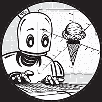

本附录是绘制、变换和组合本书中涵盖的 3D 和 2D 形状的快速视觉参考。每张截图旁都有一个示例 OpenSCAD 语句，可以用来生成该图像。在某些情况下，我们还包含了一个“阴影”对象，以说明操作之前形状的样子。示例代码语句不会生成这些阴影对象。

## 3D 基本图形

**长方体：**

```
`cube([30, 20, 10]);`
```

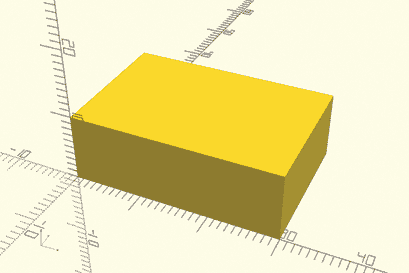

**居中长方体：**

```
`cube([30, 20, 10], center=true);` 
```

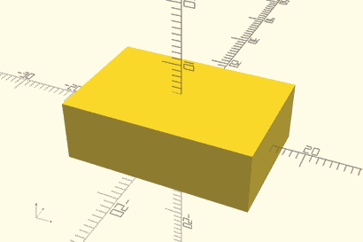

**球体：**

```
`sphere(10);` 
```

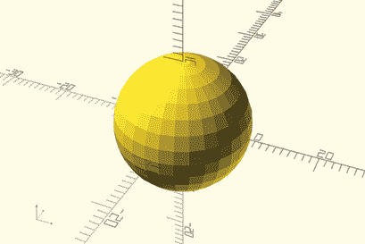

**平滑球体：**

```
`sphere(10, $fn=100);` 
```


**圆柱体：**

```
`cylinder(h=20, r=5);` 
```

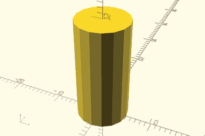

**锥体：**

```
`cylinder(h=20, r1=5, r2=0);` 
```

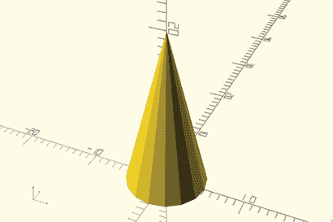

**居中平滑截头锥：**

```
`cylinder(h=10, r1=3, r2=5, $fn=100, center=true);` 
```

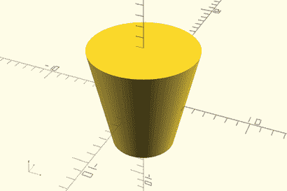

**规则棱柱体：**

```
`cylinder(h=5, r=5, $fn=6);` 
```

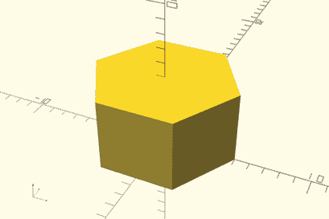

## 2D 形状

**矩形：**

```
`square([30, 20]);` 
```

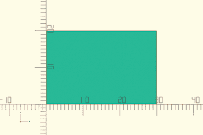

**居中矩形：**

```
`square([30, 20], center=true);` 
```

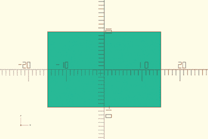

**圆形：**

```
`circle(10);` 
```

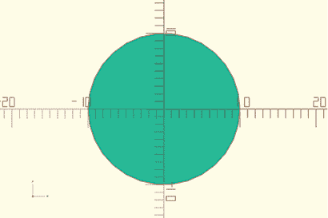

**规则多边形：**

```
`circle(10, $fn=5);`
```

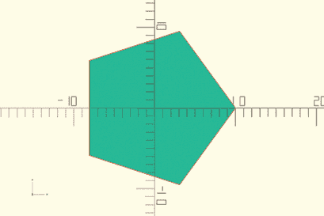

**不规则多边形：**

```
`polygon([[0,0], [10,0], [10,10], [5,10]]);` 
```

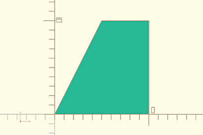

**文本：**

```
`text("hello", font="Sans", size=20);`
```

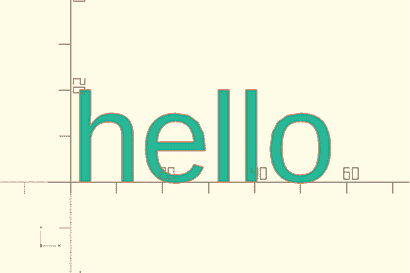

## 组合形状

**从形状中减去：**

```
`difference() {`
 `sphere(10);`
 `translate([0,-15,0]) cube([15,30,15]);`
`}`
```

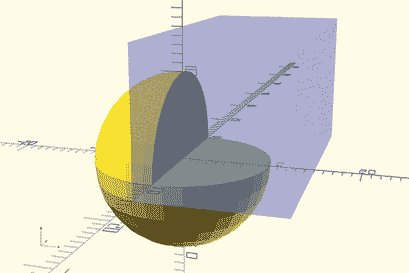

**从形状中进行多次减法：**

```
`difference() {`
 `sphere(10);`

 `cube([15, 15, 15]);`
 `cylinder(h=15, r=5);` 
`}`
```

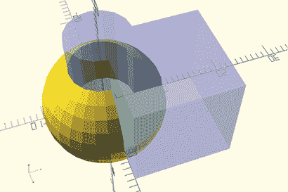

**两个形状的交集：**

```
`intersection() {`
 `cube([10, 10, 10]);`
 `cylinder(h=15, r=5);` 
`}`
```

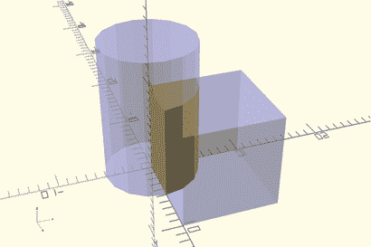

**从组合形状中减去：**

```
`difference() {`
 `union() {`
 `sphere(10);`
 `cylinder(h=30, r=5, center=true);` 
 `}`
 `cube([10, 30, 10], center=true);`
`}`
```

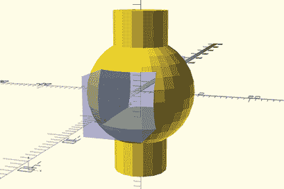

**凸包：**

```
`hull() {`
 `sphere(10);`
 `cylinder(h=20, r=5);` 
`}`
```

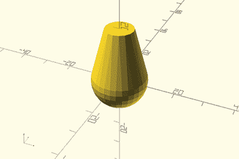

**闵可夫斯基和：**

```
`minkowski() {`
 `sphere(10, $fn=50);`
 `cylinder(h=20, r=5);` 
`}`
```

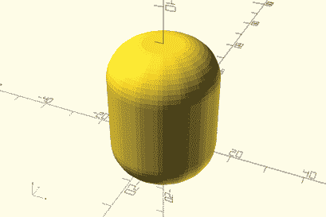

## 变换

**平移：**

```
`translate([5, 10, 0]) cube([5, 3, 1]);` 
```

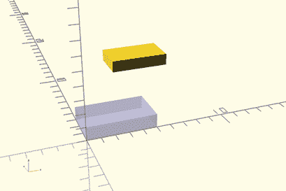

**旋转：**

```
`rotate([0, 0, 60]) cube([30, 20, 10]);`
```

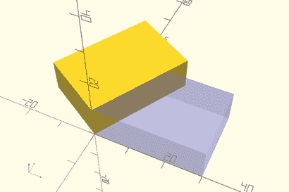

**反射：**

```
`mirror([1, 0, 0]) translate([5, 0, 0]) cylinder(h=1, r=5, $fn=5);` 
```

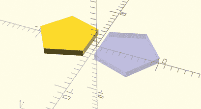

**调整尺寸：**

```
`resize([15, 20, 4]) sphere(r=5, $fn=32);` 
```

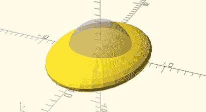

**挤出 2D 形状：**

```
`linear_extrude(height=10) {`
 `polygon([[0, 0], [10, 0],` 
 `[10, 10], [5, 10]]);` 
`}`
```

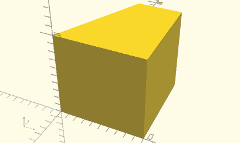

**旋转 2D 形状的挤出：**

```
`rotate_extrude(angle=180) translate([10, 0]) circle(5);`
```

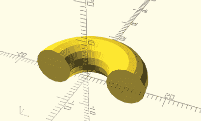

## 循环

**重复形状：**

```
`for (x=[0:10:40]) {`
 `translate([x, 0, 0]) cube([5, 5, 10]);`
`}`
```

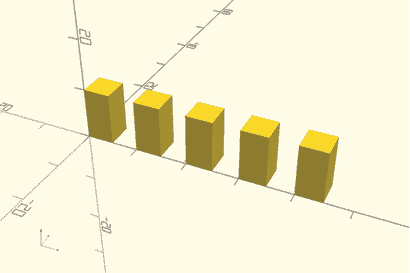

**改变重复形状的特征：**

```
`for (x=[0:1:4]) {`
 `h = x*5 + 5;`
 `translate([x*10, 0, 0]) cube([5, 5, h]);`
`}`
```

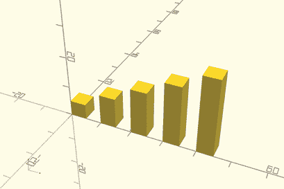

**重复形状的重复：**

```
`for (z=[0:15:45]) {`
 `for (x=[0:10:40]) {`
 `translate([x, 0, z]) cube([5, 5, 10]);`
 `}`
`}`
```

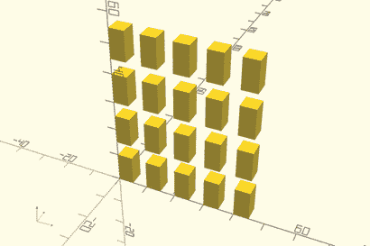
