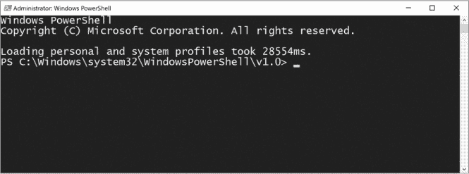
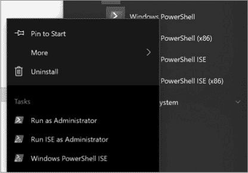

## 第一章：入门


*PowerShell* 这个名称指代两件事。其一是命令行外壳，默认安装在所有最新版本的 Windows 上（从 Windows 7 开始），并且最近通过 PowerShell Core 可在 Linux 和 macOS 操作系统上使用。其二是脚本语言。二者合起来指的是一个框架，可以用来自动化一切任务，从一次重启 100 台服务器，到构建一个完整的自动化系统，控制你整个数据中心的运作。

在本书的前几章中，你将使用 PowerShell 控制台来熟悉 PowerShell 的基础知识。一旦掌握了基础，你将进入更高级的主题，包括编写脚本、函数和自定义模块。

本章介绍基础内容：一些基本命令，以及如何查找和阅读帮助页面。

### 打开 PowerShell 控制台

本书中的示例使用的是 PowerShell v5.1，这是 Windows 10 自带的版本。较新的 PowerShell 版本拥有更多功能和 bug 修复，但自版本 2 起，PowerShell 的基本语法和核心功能并未发生剧烈变化。

在 Windows 10 中打开 PowerShell，输入**PowerShell**在开始菜单中搜索。你应该会看到 Windows PowerShell 选项出现在中间，点击该选项即可打开一个蓝色控制台和闪烁的光标，如图 1-1 所示。



*图 1-1：PowerShell 控制台*

闪烁的光标表示 PowerShell 已准备好接受你的输入。请注意，你的*提示符*——以`PS>`开头的那一行——可能与我的不同；提示符中的文件路径表示你在系统中的当前位置。如你在我控制台的标题中所见，我右键点击了 PowerShell 图标，并以管理员身份运行它。这为我提供了完全的权限，并将我启动在*C:\Windows\system32\WindowsPowerShell\v1.0*目录中。

### 使用 DOS 命令

一旦打开 PowerShell，你就可以开始探索了。如果你以前使用过 Windows 命令行工具 *cmd.exe*，你会很高兴地知道，所有你熟悉的命令（例如 `cd`、`dir` 和 `cls`）在 PowerShell 中也可以使用。在后台，这些 DOS “命令”实际上并不是真正的命令，而是命令*别名*，或者说是伪名，它们将你熟悉的命令转换为 PowerShell 识别的命令。但目前，你不需要了解这些差异——只需将它们视为你熟悉的 DOS 好朋友！

让我们尝试一些命令。如果你在`PS>`提示符下，并且想查看某个特定目录的内容，首先使用`cd`命令进入该目录，`cd`是*更改目录*（change directory）的缩写。这里你将进入*Windows*目录：

```
PS> cd .\Windows\
PS C:\Windows>
```

使用 TAB 完成

请注意，我用点和反斜杠指定了 *Windows* 目录：`.\Windows\`。事实上，你无需手动输入这些内容，因为 PowerShell 控制台具有很棒的 Tab 补全功能，允许你重复按 TAB 键来浏览你已经输入的内容所能使用的命令。

例如，如果你输入 GET- 后按 TAB 键，你可以开始滚动所有以 GET- 开头的命令。继续按 TAB 键可以向前浏览命令；按 SHIFT-TAB 键则可以向后浏览。你还可以对参数使用 Tab 补全，我将在“探索 PowerShell 命令”部分中讲解，正如你在 第 6 页 中看到的，输入 `Get-Content -` 然后按 TAB 键。此次，PowerShell 不再循环浏览命令，而是开始循环浏览 `Get-Content` 命令的可用参数。当你不确定时，按 TAB 键！

进入 *C:\Windows* 文件夹后，你可以使用 `dir` 命令列出当前目录的内容，如 Listing 1-1 中所示。

```
PS C:\Windows> dir

    Directory: C:\Windows

Mode                LastWriteTime         Length Name
----                -------------         ------ ----
d-----        3/18/2019   4:03 PM                addins
d-----         8/9/2019  10:28 AM                ADFS
d-----        7/24/2019   5:39 PM                appcompat
d-----        8/19/2019  12:33 AM                AppPatch
d-----        9/16/2019  10:25 AM                AppReadiness
--snip--
```

*Listing 1-1：使用 dir 命令显示当前目录的内容*

输入 `cls` 将清除屏幕并重新启动一个干净的控制台。如果你熟悉 *cmd.exe*，可以尝试一些你知道的其他 *cmd.exe* 命令，看看它们是否有效。请注意，虽然大多数命令有效，但并非所有命令都有效。如果你想知道哪些 *cmd.exe* 命令在 PowerShell 中存在，你可以在 PowerShell 控制台中输入 `Get-Alias`，它将返回许多你熟悉的老式 *cmd.exe* 命令，如下所示：

```
PS> Get-Alias
```

这将允许你查看所有内置的别名以及它们映射到的 PowerShell 命令。

### 探索 PowerShell 命令

像几乎所有语言一样，PowerShell 有 *命令*，这是指命名的可执行表达式的通用术语。一个命令几乎可以是任何东西——从传统的 *ping.exe* 工具到我之前提到的 `Get-Alias` 命令。你甚至可以创建自己的命令。然而，如果你尝试使用一个不存在的命令，你将看到著名的红色错误文本，正如在 Listing 1-2 中所示。

```
PS> foo
foo : The term 'foo' is not recognized as the name of a cmdlet, function,
script file, or operable program. Check the spelling of the name, or if a
path was included, verify that the path is correct and try again.
At line:1 char:1
+ foo
+ ~~~
    + CategoryInfo          : ObjectNotFound: (foo:String) [], CommandNotFoundException
    + FullyQualifiedErrorId : CommandNotFoundException
```

*Listing 1-2：输入未识别命令时显示错误信息。*

你可以执行 `Get-Command` 来查看 PowerShell 默认识别的所有命令列表。你可能会注意到一个常见的模式。大多数命令的名称遵循相同的模式：*动词*-*名词*。这是 PowerShell 的独特特点。为了保持语言尽可能直观，微软已经为命令名称设置了规范。虽然遵循这种命名约定是可选的，但强烈推荐在创建自己的命令时使用它。

PowerShell 命令有几种类型：cmdlet、函数、别名，有时还有外部脚本。微软提供的大多数内置命令是 *cmdlet*，通常是用其他语言（如 C#）编写的命令。通过运行 `Get-Command` 命令，如 Listing 1-3 中所示，你将看到一个 `CommandType` 字段。

```
PS> Get-Command -Name Get-Alias

CommandType     Name                Version    Source
-----------     ----                -------    ------
Cmdlet          Get-Alias           3.1.0.0    Microsoft.PowerShell.Utility
```

*列表 1-3：显示 Get-Alias 命令的类型*

*函数* 是用 PowerShell 编写的命令。你编写函数来完成任务；而 cmdlet 则交给软件开发人员处理。Cmdlet 和函数是你在 PowerShell 中最常用的命令类型。

你将使用 `Get-Command` 命令来浏览 PowerShell 中可用的众多 cmdlet 和函数。但是正如你刚刚看到的，输入没有参数的 `Get-Command` 会让你等几秒钟，因为控制台正在滚动显示所有可用的命令。

PowerShell 中有许多命令具有*参数*，这些参数是你传递给命令的值，用以定制其行为。例如，`Get-Command` 有多个参数，允许你只返回特定的命令，而不是所有命令。在查看 `Get-Command` 时，你可能会注意到一些常见的动词，如 `Get`、`Set`、`Update` 和 `Remove`。如果你猜测所有的 `Get` 命令都是用来*获取*信息的，而其他命令则修改信息，你猜对了。在 PowerShell 中，所见即所得。命令的命名直观，并且通常按预期执行。

由于你刚刚开始，你不想改变系统中的任何内容。你确实想从不同来源获取信息。例如，使用 `Get-Command` 的 `Verb` 参数，你可以将庞大的命令列表限制为仅包含使用 `Get` 动词的命令。要做到这一点，请在提示符下输入以下命令：

```
PS> Get-Command -Verb Get
```

你可能会同意，显示的命令太多了，因此你可以通过添加 `Noun` 参数来进一步限制结果，指定 `Content` 名词，如 列表 1-4 所示。

```
PS> Get-Command -Verb Get -Noun Content

CommandType     Name                Version    Source
-----------     ----                -------    ------
Cmdlet          Get-Content         3.1.0.0    Microsoft.PowerShell.Management
```

*列表 1-4：仅显示包含动词* Get *和名词* Content *的命令*

如果这些结果对你来说过于狭窄，你也可以使用 `Noun` 参数而不指定 `Verb` 参数，如 列表 1-5 所示。

```
PS> Get-Command -Noun Content

CommandType     Name                Version    Source
-----------     ----                -------    ------
Cmdlet          Add-Content         3.1.0.0    Microsoft.PowerShell.Management
Cmdlet          Clear-Content       3.1.0.0    Microsoft.PowerShell.Management
Cmdlet          Get-Content         3.1.0.0    Microsoft.PowerShell.Management
Cmdlet          Set-Content         3.1.0.0    Microsoft.PowerShell.Management
```

*列表 1-5：仅显示包含名词* Content *的命令*

你可以看到 `Get-Command` 允许你将动词和名词分开。如果你更愿意将整个命令定义为一个单元，你可以改用 `Name` 参数，指定整个命令名称，如 列表 1-6 所示。

```
PS> Get-Command -Name Get-Content

CommandType     Name                Version    Source
-----------     ----                -------    ------
Cmdlet          Get-Content         3.1.0.0    Microsoft.PowerShell.Management
```

*列表 1-6：按命令名称查找 Get-Content cmdlet*

正如我之前所说，PowerShell 中有许多命令带有可以定制其行为的参数。你可以通过使用强大的 PowerShell 帮助系统来学习命令的参数。

### 获取帮助

PowerShell 的文档并不独特，但其文档和帮助内容与语言的集成方式堪称艺术。在本节中，你将学习如何在提示窗口中显示命令帮助页面，如何通过 About 主题获取有关语言的更多一般信息，以及如何使用 `Update-Help` 更新文档。

#### 显示文档

类似于 Linux 中的 `man` 命令，PowerShell 有 `help` 命令和 `Get-Help` cmdlet。如果您有兴趣查看某个 `Content` cmdlet 的作用，您可以将该命令名称传递给 `Get-Help` 命令，以检索标准的 `SYNOPSIS`、`SYNTAX`、`DESCRIPTION`、`RELATED LINKS` 和 `REMARKS` 帮助部分。这些部分提供了命令的作用、在哪里可以找到该命令的更多信息，甚至一些相关命令。清单 1-7 显示了 `Add-Content` 命令的文档。

```
PS> Get-Help Add-Content

NAME
    Add-Content

SYNOPSIS
    Appends content, such as words or data, to a file.

--snip--
```

*清单 1-7：Add-Content 命令的帮助页面*

只向 `Get-Help` 提供命令名称是有用的，但此内容中最有帮助的部分是 `Examples` 参数。该参数显示了在各种场景下使用该命令的实际示例。尝试在任何命令上运行 `Get-Help` 命令名称 `-Examples`，您会注意到几乎所有内置命令都有示例，帮助您理解它们的作用。例如，您可以在 `Add-Content` cmdlet 上运行该命令，如清单 1-8 所示。

```
PS> Get-Help Add-Content -Examples

NAME
    Add-Content
SYNOPSIS
    Appends content, such as words or data, to a file.

    -------------------------- EXAMPLE 1 --------------------------

    C:\PS>Add-Content -Path *.txt -Exclude help* -Value "END"

    Description

    -----------

    This command adds "END" to all text files in the current directory,
    except for those with file names that begin with "help."
--snip--
```

*清单 1-8：获取 Add-Content 命令的示例用法*

如果您想要更多信息，`Get-Help` cmdlet 还具有 `Detailed` 和 `Full` 参数，它们会提供关于该命令的完整介绍。

#### 了解一般主题

除了单个命令的帮助内容，PowerShell 帮助系统还提供了*关于主题*，这些是针对更广泛主题和特定命令的帮助片段。例如，在本章中，您将学习 PowerShell 核心命令的一些内容。微软已经创建了一个关于主题，给出了这些命令的总体解释。要查看它，您可以运行 `Get-Help about_Core_Commands`，如清单 1-9 所示。

```
PS> Get-Help about_Core_Commands
TOPIC
    about_Core_Commands

SHORT DESCRIPTION
    Lists the cmdlets that are designed for use with Windows PowerShell
    providers.

LONG DESCRIPTION
    Windows PowerShell includes a set of cmdlets that are specifically
    designed to manage the items in the data stores that are exposed by Windows
    PowerShell providers. You can use these cmdlets in the same ways to manage
    all the different types of data that the providers make available to you.
    For more information about providers, type "get-help about_providers".

    For example, you can use the Get-ChildItem cmdlet to list the files in a
    file system directory, the keys under a registry key, or the items that
    are exposed by a provider that you write or download.
 The following is a list of the Windows PowerShell cmdlets that are designed
    for use with providers:

--snip--
```

*清单 1-9：PowerShell 核心命令的相关主题*

要获取所有可用的关于主题的完整列表，可以对 `Name` 参数使用通配符。在 PowerShell 中，*通配符*字符星号（`*`）可以作为零个或多个字符的占位符。您可以在 `Get-Help` 命令的 `Name` 参数中使用通配符，如清单 1-10 所示。

```
PS> Get-Help -Name About*
```

*清单 1-10：在 Get-Help 命令的 Name 参数上使用通配符*

通过将通配符附加到 `About`，您要求 PowerShell 搜索所有以 *About* 开头的主题。如果有多个匹配项，PowerShell 将显示一个列表，并简要介绍每个主题的信息。要获取有关某个匹配项的完整信息，您必须将其直接传递给 `Get-Help`，如前面在清单 1-9 中所示。

虽然 `Get-Help` 命令有一个 `Name` 参数，但你可以直接通过输入 `-Name` 来传递该参数的值，如 列表 1-10 所示。这被称为使用 *位置* *参数*，它根据参数在命令中的位置（你猜对了）来确定你传递的值。位置参数是许多 PowerShell 命令提供的快捷方式，可以减少输入的按键次数。

### 更新文档

PowerShell 中的帮助系统是任何想要深入了解语言的人的宝贵财富，但有一个关键特点使这个帮助系统更为出色：它是动态的！文档往往随着时间的推移而变得陈旧。一款产品发布时有文档，之后出现 bug，发布新特性，但系统中的文档却保持不变。PowerShell 通过 *可更新帮助* 来解决这个问题，它允许内置的 PowerShell cmdlet 以及其他由他人构建的 cmdlet 或函数，通过指向一个互联网 URI 来托管最新的文档。只需输入 `Update-Help`，PowerShell 就会开始读取系统上的帮助文件并与各种在线位置进行比对。

请注意，虽然所有内置 PowerShell cmdlet 都包含可更新的帮助，但对于任何第三方命令来说，这并不是必需的。另外，文档的更新频率取决于开发者的维护。PowerShell 提供了让开发者编写更好帮助内容的工具，但他们仍然需要保持帮助文件库的最新状态。最后，如果帮助文件存储的位置不再可用，你在运行 `Update-Help` 时可能会遇到错误。简而言之，不要指望 `Update-Help` *始终* 显示 PowerShell 中每个命令的最新帮助内容。

以管理员身份运行 PowerShell

有时需要以 *管理员身份* 运行 PowerShell 控制台。这通常发生在你需要修改文件、注册表或任何其他超出你用户个人资料的内容时。例如，前面提到的 `Update-Help` 命令需要修改系统级别的文件，普通用户无法正常运行该命令。

你可以通过右键点击 Windows PowerShell，然后点击 **以管理员身份运行** 来以管理员身份运行 PowerShell，如 图 1-2 所示。



*图 1-2：以管理员身份运行 PowerShell*

### 总结

在这一章中，你学到了一些有助于入门的命令。开始任何新事物时，你并不知道自己不知道什么。你只需要一些基本的知识，这些知识能够让你自主探索更多内容。通过理解 PowerShell 命令的基础以及如何使用 `Get-Command` 和 `Get-Help`，你现在拥有了开始学习 PowerShell 所需的工具。一个充满激动人心旅程的开始就在前方！
