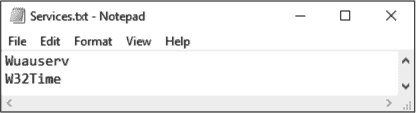
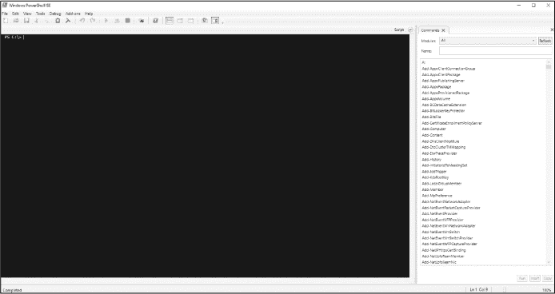
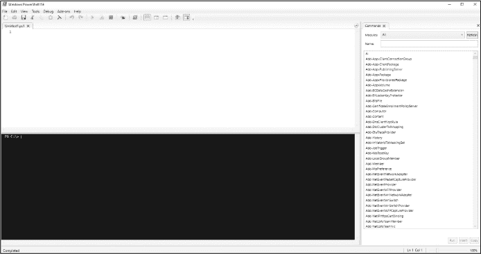

## 第三章：合并命令


到目前为止，你一直使用 PowerShell 控制台一次执行一个命令。对于简单的代码来说，这没什么问题：你运行需要的命令，如果需要再运行一个命令，也可以这样做。但对于较大的项目来说，单独调用每个命令太耗时了。幸运的是，你可以合并命令，使它们作为一个整体进行调用。在本章中，你将学习两种合并命令的方法：通过使用 PowerShell 管道以及将代码保存在外部脚本中。

### 启动 Windows 服务

为了说明为什么需要合并命令，首先让我们用传统的方法做一个简单的示例。你将使用两个命令：`Get-Service`，该命令查询 Windows 服务并返回相关信息；以及 `Start-Service`，该命令启动 Windows 服务。如示例 3-1 所示，使用 `Get-Service` 确保服务存在，然后使用 `Start-Service` 启动它。

```
PS> $serviceName = 'wuauserv'
PS> Get-Service -Name $serviceName
Status   Name               DisplayName
------   ----               -----------
Running  wuauserv           Windows Update
PS> Start-Service -Name $serviceName
```

*示例 3-1：使用 `Name` 参数查找服务并启动它*

你运行 `Get-Service` 只是为了确保 PowerShell 不会抛出错误。很可能该服务已经在运行。如果是这样，`Start-Service` 将只会将控制权返回给控制台。

当你只启动一个服务时，像这样运行命令并不会特别费劲。但如果你需要处理数百个服务，你可以想象它会变得多么单调。让我们来看看如何简化这个问题。

### 使用管道

简化代码的第一种方法是通过 PowerShell *管道* 将命令链接在一起，管道是一种工具，可以将一个命令的输出直接作为另一个命令的输入。要使用管道，在两个命令之间使用 *管道操作符* (`|`)，像这样：

```
PS> command1 | command2
```

在这里，命令 1 的输出被*管道*传递到命令 2，成为命令 2 的输入。管道中的最后一个命令将输出到控制台。

许多 shell 脚本语言，包括 *cmd.exe* 和 bash，都使用管道。但 PowerShell 中管道的独特之处在于它传递的是对象，而不是简单的字符串。本章稍后会讲解这一过程，但现在，让我们使用管道重新编写示例 3-1 中的代码。

#### 在命令之间传递对象

要将 `Get-Service` 的输出传递给 `Start-Service`，请使用示例 3-2 中的代码。

```
PS> Get-Service -Name 'wuauserv' | Start-Service
```

*示例 3-2：将现有服务通过管道传递给 `Start-Service` 命令*

在示例 3-1 中，你使用了 `Name` 参数来告诉 `Start-Service` 命令要启动哪个服务。但在这个示例中，你不需要指定任何参数，因为 PowerShell 会为你处理这一切。它会查看 `Get-Service` 的输出，决定应该将哪些值传递给 `Start-Service`，并将这些值与 `Start-Service` 需要的参数进行匹配。

如果你愿意，你可以将示例 3-2 中的代码重写为完全不使用参数： 

```
PS> 'wuauserv' | Get-Service | Start-Service
```

PowerShell 将字符串 `wuauserv` 发送到 `Get-Service`，然后将 `Get-Service` 的输出传递到 `Start-Service` ——这一切都不需要你做任何指定！你已经将三个独立的命令合并为一行，但每次你想启动服务时，仍然需要重新输入这一行。在下一节中，你将看到如何使用一行命令启动你需要的任意多个服务。

#### 在命令之间传递数组

在文本编辑器中，如记事本，创建一个名为 *Services.txt* 的文本文件，文件中每行包含 `Wuauserv` 和 `W32Time` 字符串，如图 3-1 所示。



*图 3-1：一个* Services.txt *文件，其中`Wuauserv`和`W32Time`分别列在不同的行上*

该文件包含了你想要启动的服务列表。为了简化起见，我这里使用了两个服务，但你可以根据需要添加更多服务。要将文件内容显示到 PowerShell 窗口中，请使用 `Get-Content` cmdlet 的 `Path` 参数：

```
PS> Get-Content -Path C:\Services.txt
Wuauserv
W32Time
```

`Get-Content` 命令逐行读取文件，将每一行添加到一个数组中，然后返回该数组。清单 3-3 使用管道将 `Get-Content` 返回的数组传递给 `Get-Service` 命令。

```
PS> Get-Content -Path C:\Services.txt | Get-Service

Status   Name               DisplayName
------   ----               -----------
Stopped  Wuauserv           Windows Update
Stopped  W32Time            Windows Time
```

*清单 3-3：通过管道将* Services.txt *传递给 `Get-Service`，显示服务列表*

`Get-Content` 命令正在读取文本文件并输出一个数组。但 PowerShell 并没有将整个数组通过管道传递，而是 *解开* 该数组，将数组中的每一项单独通过管道传递。这样，你就可以为数组中的每一项执行相同的命令。通过将你想要启动的每个服务放入文本文件中，并在清单 3-3 中的命令后面加上一个额外的 `| Start-Service`，你就能用一个命令启动任意数量的服务。

使用管道连接的命令数量没有限制。但如果你发现自己连接了五个以上的命令，可能需要重新考虑你的方法。请注意，尽管管道功能强大，但并不是所有地方都能使用：大多数 PowerShell 命令仅接受某些类型的管道输入，某些命令甚至根本不接受任何输入。在下一节中，你将深入了解 PowerShell 如何处理管道输入，重点讲解参数绑定。

#### 查看参数绑定

当你将参数传递给命令时，PowerShell 会启动一个叫做 *参数绑定* 的过程，其中它将你传递给命令的每个对象与命令创建者指定的各种参数进行匹配。为了让 PowerShell 命令接受管道输入，编写该命令的人——无论是 Microsoft 还是你——必须显式地为一个或多个参数构建管道支持。如果你尝试将信息传递到一个没有管道支持的命令中，或者 PowerShell 找不到合适的绑定，就会出现错误。例如，尝试运行以下命令：

```
PS> 'string' | Get-Process 
Get-Process : The input object cannot be bound to any parameters for the command either...
--snip--
```

你应该会看到命令不接受管道输入。为了查看是否可以使用管道，你可以使用 `Get-Help` 命令并带上 `Full` 参数来查看命令的完整帮助内容。我们使用 `Get-Help` 查看你在 示例 3-1 中使用的 `Get-Service` 命令：

```
PS> Get-Help -Name Get-Service –Full
```

你应该会看到相当多的输出。向下滚动到 `PARAMETERS` 部分。该部分列出了每个参数的信息，并提供比不使用 `Detailed` 或 `Full` 参数时更多的信息。示例 3-4 显示了 `Get-Service` 的 `Name` 参数的信息。

```
-Name <string[]>
        Required?                    false
        Position?                    0
        Accept pipeline input?       true (ByValue, ByPropertyName)
        Parameter set name           Default
        Aliases                      ServiceName
        Dynamic?                     false
```

*示例 3-4: `Get-Service` 命令的 `Name` 参数信息*

这里有很多信息，但我们想要关注的是 `Accept pipeline input?` 字段。正如你所想象的，这个字段告诉你一个参数是否接受管道输入；如果参数不接受管道输入，你会在此字段旁看到 `false`。但是注意这里有更多的信息：这个参数同时通过 `ByValue` 和 `ByPropertyName` 接受管道输入。与此对比的是 `ComputerName` 参数，它的相关信息在 示例 3-5 中。

```
-ComputerName <string[]>
        Required?                    false
        Position?                    Named
        Accept pipeline input?       true (ByPropertyName)
        Parameter set name           (all)
        Aliases                      Cn
        Dynamic?                     false
```

*示例 3-5: `Get-Service` 命令的 `ComputerName` 参数信息*

`ComputerName` 参数允许你指定希望在哪台计算机上运行 `Get-Service`。请注意，这个参数也接受 `string` 类型。那么当你执行类似以下操作时，PowerShell 怎么知道你指的是服务名称，而不是计算机名称呢？

```
PS> 'wuauserv' | Get-Service
```

PowerShell 匹配管道输入到参数有两种方式。第一种是通过 `ByValue`，这意味着 PowerShell 会查看传入对象的*类型*并相应地解释它。因为 `Get-Service` 指定它通过 `ByValue` 接受 `Name` 参数，所以除非另行指定，否则它会将传入的任何字符串解释为 `Name`。由于通过 `ByValue` 传递的参数依赖于输入的类型，每个通过 `ByValue` 传递的参数只能是一个类型。

PowerShell 匹配管道参数的第二种方式是通过 `ByPropertyName`。在这种情况下，PowerShell 会查看传入的对象，如果它有一个具有适当名称（在这种情况下是 `ComputerName`）的属性，则会查看该属性的值并将该值接受为参数。因此，如果你想将服务名称和计算机名称都传递给 `Get-Service`，你可以创建一个 `PSCustomObject` 并将其传入，如 示例 3-6 所示。

```
PS> $serviceObject = [PSCustomObject]@{Name = 'wuauserv'; ComputerName = 'SERV1'}
PS> $serviceObject | Get-Service
```

*示例 3-6: 将自定义对象传递给 `Get-Service`*

通过查看命令的参数规范，并使用哈希表干净地存储所需的参数，你将能够使用管道将各种命令串联起来。但随着你开始编写更复杂的 PowerShell 代码，你将需要比管道更多的东西。在下一节中，你将学习如何将 PowerShell 代码作为脚本外部存储。

### 编写脚本

*脚本* 是存储一系列命令的外部文件，你可以通过在 PowerShell 控制台中输入一行命令来运行它们。正如在示例 3-7 中所示，要运行脚本，你只需在控制台中输入脚本的路径。

```
PS> C:\FolderPathToScript\script.ps1
Hello, I am in a script!
```

*示例 3-7：从控制台运行脚本*

虽然在脚本中你能做的事情与在控制台中做的没有区别，但使用脚本运行单个命令比键入几千个命令要容易得多！更不用说，如果你想修改代码中的某些内容，或者你犯了错误，你将需要重新输入那些命令。正如你在本书后面将看到的，脚本可以让你编写复杂、健壮的代码。但在你开始编写脚本之前，你需要更改一些 PowerShell 设置，以确保你可以运行它们。

#### 设置执行策略

默认情况下，PowerShell 不允许你运行任何脚本。如果你尝试在默认的 PowerShell 安装中运行外部脚本，你会遇到示例 3-8 中的错误。

```
PS> C:\PowerShellScript.ps1 
C:\PowerShellScript.ps1: File C:\PowerShellScript.ps1 cannot be loaded because
running scripts is disabled on this system. For more information, see about
_Execution_Policies at http://go.microsoft.com/fwlink/?LinkID=135170.
At line:1 char:1
+ C:\PowerShellScript.ps1
+ ~~~~~~~~~~~~~~~~~~~~~~~
    + CategoryInfo          : SecurityError: (:) [], PSSecurityException
    + FullyQualifiedErrorId : UnauthorizedAccess
```

*示例 3-8：尝试运行脚本时发生的错误*

这个令人沮丧的错误信息是 PowerShell 的*执行策略*造成的，这是一个安全措施，用来决定哪些脚本可以运行。执行策略有四种主要配置：

**Restricted** 该配置是默认配置，不允许你运行脚本。

**AllSigned** 该配置仅允许你运行那些经过受信任方加密签名的脚本（稍后会详细介绍）。

**RemoteSigned** 该配置允许你运行任何自己编写的脚本，以及任何你下载的脚本，只要它们经过受信任方的加密签名。

**Unrestricted** 该配置允许你运行任何脚本。

要查看你的计算机当前使用的执行策略，可以运行示例 3-9 中的命令。

```
PS> Get-ExecutionPolicy
Restricted
```

*示例 3-9：使用 `Get-ExecutionPolicy` 命令显示当前的执行策略*

当你运行此命令时，很可能会得到 `Restricted`。为了本书的目的，你将把执行策略更改为 `RemoteSigned`。这将允许你运行任何你编写的脚本，同时确保你仅使用来自受信任来源的外部脚本。要更改执行策略，请使用 `Set-ExecutionPolicy` 命令并传入你想要的策略，如 Listing 3-10 所示。请注意，你需要以管理员身份运行此命令（有关以管理员身份运行命令的更多信息，请参见 第一章）。你只需要执行一次此命令，因为设置会保存在注册表中。如果你在一个大型的 Active Directory 环境中，还可以通过组策略将执行策略设置到多个计算机上。

```
PS> Set-ExecutionPolicy -ExecutionPolicy RemoteSigned

Execution Policy Change
The execution policy helps protect you from scripts that you do not trust. Changing the
execution policy might expose you to the security risks described in the about_Execution
_Policies help topic at http://go.microsoft.com/fwlink/?LinkID=135170\. Do you want to change
the execution policy?
[Y] Yes  [A] Yes to All  [N] No  [L] No to All  [S] Suspend  [?] Help (default is "N"): A
```

*Listing 3-10：使用 `Set-ExecutionPolicy` 命令更改执行策略*

再次运行 `Get-ExecutionPolicy` 命令，以验证你是否成功将策略更改为 `RemoteSigned`。如前所述，你不需要每次打开 PowerShell 时都设置执行策略。策略将保持在 `RemoteSigned`，直到你决定再次更改它。

脚本签名

*脚本签名* 是附加在脚本末尾的加密字符串，作为注释存在；这些签名是通过安装在你电脑上的证书生成的。当你将策略设置为 `AllSigned` 或 `RemoteSigned` 时，你将只能运行那些正确签名的脚本。签名源代码让 PowerShell 知道脚本的来源是可靠的，并且脚本作者确实如他们所说的那样。一个脚本签名看起来大致如下：

```
# SIG # Begin signature block
# MIIEMwYJKoZIhvcNAQcCoIIEJDCCBCACAQExCzAJBgUrDgMCGgUAMGkGCisGAQQB
# gjcCAQSgWzBZMDQGCisGAQQBgjcCAR4wJgIDAQAABBAfzDtgWUsITrck0sYpfvNR
# AgEAAgEAAgEAAgEAAgEAMCEwCQYFKw4DAhoFAAQU6vQAn5sf2qIxQqwWUDwTZnJj
--snip--
# m5ugggI9MIICOTCCAaagAwIBAgIQyLeyGZcGA4ZOGqK7VF45GDAJBgUrDgMCHQUA
# Dxoj+2keS9sRR6XPl/ASs68LeF8o9cM=
# SIG # End signature block
```

你应该签名任何你在专业环境中创建和执行的脚本。我在这里不会详细讲解如何做，但我找到的最好的资源之一是 Carlos Perez（著名安全专家）写的文章系列《PowerShell 基础——执行策略和代码签名》，你可以在 *[`www.darkoperator.com/blog/2013/3/5/powershell-basics-execution-policy-part-1.html`](https://www.darkoperator.com/blog/2013/3/5/powershell-basics-execution-policy-part-1.html)* 中找到。

#### PowerShell 脚本编写

现在，执行策略已设置完成，是时候编写脚本并在控制台中执行它了。你可以在任何文本编辑器中编写 PowerShell 脚本（如 Emacs、Vim、Sublime Text、Atom，甚至 Notepad），但编写 PowerShell 脚本的最便捷方式是使用 PowerShell 集成脚本环境（ISE）或 Microsoft 的 Visual Studio Code 编辑器。从技术上讲，ISE 已被弃用，但它随 Windows 一起预安装，因此它可能是你最先发现的编辑器。

##### 使用 PowerShell ISE

要启动 PowerShell ISE，运行 Listing 3-11 中的命令。

```
PS> powershell_ise.exe
```

*Listing 3-11：打开 PowerShell ISE*

一个看起来像 图 3-2 的交互式控制台界面应该会打开。



*图 3-2：PowerShell ISE 界面*

要添加脚本，点击 **文件 ▶ 新建**。屏幕应分为两部分，控制台上方会出现一个白色面板，如图 3-3 所示。



*图 3-3：打开脚本的 PowerShell ISE 界面*

点击 **文件 ▶ 保存**，将新文件保存为 *WriteHostExample.ps1*。我将我的脚本保存在 C: 盘的根目录下，所以它的位置是 *C:\WriteHostExample.ps1*。注意，你需要以 *.ps1* 扩展名保存脚本；这个扩展名告诉你的系统该文件是一个 PowerShell 脚本。

你将在白色面板中输入脚本的所有文本。PowerShell ISE 允许你在同一个窗口中编辑并运行脚本，这样在编辑时可以节省大量繁琐的反复操作。PowerShell ISE 还有许多其他功能，尽管我在这里不会介绍它们。

PowerShell 脚本是简单的文本文件。你使用哪个文本编辑器并不重要，只要使用正确的 PowerShell 语法即可。

##### 编写你的第一个脚本

使用你喜欢的编辑器，将 列表 3-12 中的那一行添加到你的脚本中。

```
Write-Host 'Hello, I am in a script!'
```

*列表 3-12：脚本中的第一行*

请注意，行首没有 `PS>`。从现在开始，这就是你判断我们是在控制台中操作还是在编写脚本的方式。

要运行此脚本，请前往控制台并键入脚本的路径，如 列表 3-13 所示。

```
PS> C:\WriteHostExample.ps1
Hello, I am in a script!
```

*列表 3-13：在控制台中执行* WriteHostExample.ps1 *

在这里，你使用完整路径运行 *WriteHostExample.ps1*。如果你已经位于包含要运行脚本的目录中，可以使用点符号表示当前工作目录，如：`.\WriteHostExample.ps1`。

恭喜，这就完成了——你已经创建了第一个脚本！它可能看起来不算什么，但这是朝正确方向迈出的重要一步。在本书结束时，你将能够在脚本中定义自己的 PowerShell 模块，甚至包含数百行代码。

### 总结

在本章中，你学习了两种将命令组合在一起的有价值的方法：管道和脚本。你还了解了如何更改执行策略，并通过查看参数绑定来揭示管道背后的某些奥秘。我们为创建更强大的脚本打下了基础，但在我们进入下一步之前，还需要涵盖一些关键概念。在第四章中，你将学习如何通过使用控制流结构，如 `if/then` 语句和 `for` 循环，使代码更加健壮。
