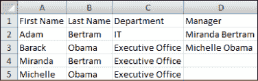
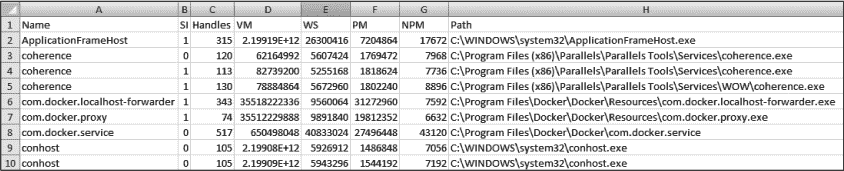
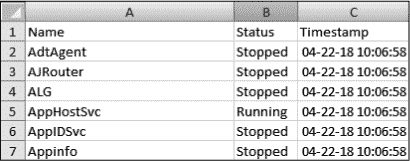
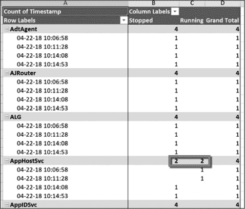

## 第十章：解析结构化数据


PowerShell 内置支持任何 .NET 对象，以及几乎所有你能想到的 shell 方法，因此它能够读取、更新和删除来自多个数据源的数据。如果你的数据以某种结构化的方式存储，处理这些数据会变得更加简单。

在本章中，我们将关注几种常见的结构化数据形式，包括 CSV、Microsoft Excel 电子表格和 JSON。你将学习如何使用 PowerShell 的本机 cmdlet 和 .NET 对象来管理每种数据类型。到本章结束时，你应该成为一个数据处理高手，能够使用 PowerShell 管理各种结构化数据。

### CSV 文件

存储数据的最简单、最常见方式之一就是使用 CSV 文件。*CSV 文件*是一个简单的文本文件，表示一个表格。表格中的每一项由一个共享的、预定的符号（称为*分隔符*）分隔开来（逗号是最常见的分隔符）。每个 CSV 文件都具有相同的基本结构：CSV 文件的第一行是标题行，包含表格列的所有标题；随后的行包含表格的所有内容。

在这一节中，你将主要使用两个 CSV cmdlet：`Import-Csv` 和 `Export-Csv`。

#### 读取 CSV 文件

在 PowerShell 能够执行的所有 CSV 处理任务中，最常见的任务几乎肯定是读取。鉴于 CSV 结构的简单性和有效性，CSV 文件在科技界的公司和应用程序中被广泛使用，因此 `Import-Csv` PowerShell 命令也非常流行。

那么，究竟什么是*读取* CSV 文件呢？虽然 CSV 文件包含了你需要的所有信息，但你不能直接将其导入到程序中；通常，你需要读取文件并将其转换为可用的数据。这个过程被称为*解析*。`Import-Csv` 命令解析 CSV 文件：读取它，并将数据转换为 PowerShell 对象。我稍后会详细介绍 `Import-Csv` 的使用方法，但首先，值得深入了解 `Import-Csv` 的底层操作。

我们从一个包含几位员工的简单电子表格开始，数据来自一个虚构公司的图 10-1。



*图 10-1：员工 CSV 文件*

图 10-1 是一个 Excel 截图，但你可以轻松地看到数据作为纯文本 CSV 文件的样子。对于我们的示例 CSV 文件，你将使用*Employees.csv*，它可以在本章的资源中找到；请参见清单 10-1。

```
PS> Get-Content -Path ./Employees.csv –Raw

First Name,Last Name,Department,Manager
Adam,Bertram,IT,Miranda Bertram
Barack,Obama,Executive Office,Michelle Obama
Miranda,Bertram,Executive Office
Michelle,Obama,Executive Office
```

*清单 10-1：使用 Get-Content 读取 CSV 文件*

在这里，你使用 `Get-Content` 命令来查询我们的文本文件（CSV）。`Get-Content` 是 PowerShell 中用于读取任何类型纯文本文件的命令。

你可以看到这是一个典型的 CSV 文件，包含一个头行和多个数据行，数据行通过逗号分隔成列。请注意，你可以通过使用`Get-Content` cmdlet 来读取该文件。由于 CSV 文件是一个文本文件，`Get-Content`能够很好地读取它（这实际上是`Import-Csv`执行的第一步）。

但也要注意`Get-Content`返回的信息：它是一个简单的字符串。这就是使用`Raw`参数时发生的情况。否则，`Get-Content`会返回一个字符串数组，每个元素代表 CSV 文件中的一行：

```
PS> Get-Content ./Employees.csv -Raw | Get-Member

   TypeName: System.String
   --snip--
```

尽管`Get-Content`命令可以读取数据，但该命令并不*理解*CSV 文件的结构。`Get-Content`不知道表格有头行或数据行，也不知道该如何处理分隔符。它只是获取内容然后输出。正因如此，我们才有了`Import-Csv`。

##### 使用 Import-Csv 处理数据

要查看`Import-Csv`的工作原理，可以将 Listing 10-1 中的输出与 Listing 10-2 中的`Import-Csv`输出进行对比。

```
PS> Import-Csv -Path ./Employees.csv

First Name Last Name  Department        Manager
---------- ---------  ----------        -------
Adam       Bertram    IT                Miranda Bertram
Barack     Obama      Executive Office  Michelle Obama
Miranda    Bertram    Executive Office
Michelle   Obama      Executive Office

PS> Import-Csv -Path ./Employees.csv | Get-Member

   TypeName: System.Management.Automation.PSCustomObject

PS> $firstCsvRow = Import-Csv -Path ./Employees.csv | Select-Object –First
1 
PS> $firstCsvRow | Select-Object -ExpandProperty 'First Name'
Adam
```

*Listing 10-2: 使用 Import-Csv*

你首先可能会注意到的是，标题与数据项之间现在由一条线分开。这意味着`Import-Csv`读取文件时，把顶部的行当作头行，并知道要将其与文件的其他部分分开。你还可能会注意到，没有更多的逗号——当一个命令读取并*理解*CSV 文件时，它知道分隔符用于分隔表格中的项，不应该出现在表格中。

但是如果代码中有一个多余的分隔符会发生什么呢？试着在*Employees.csv*文件中*Adam*的中间加入一个逗号，然后运行代码。会发生什么呢？现在 Adam 所在的行所有内容都被移动了：*am*变成了新的姓氏，*Bertram*变成了新的部门，*IT*变成了新的经理。`Import-Csv`足够智能，能够理解 CSV 的格式，但并不够聪明去理解其内容——这就是你要介入的地方。

##### 将原始数据转换为对象

`Import-Csv`不仅仅是读取 CSV 并打印出带有花哨格式的数据。文件的内容被放入一个`PSCustomObject`数组中。在这里，每个`PSCustomObject`是一个保存一行数据的对象。每个对象都有与头行中的标题对应的属性，如果你想获取某个标题列的数据，只需要访问该属性即可。只要知道预期的数据形式，`Import-Csv`就能将它从一个从未见过的字符串数据转换成易于使用的对象。相当酷！

将数据作为`PSCustomObject`数组保存，允许你更有效地使用这些数据。假设你只想找到姓氏为*Bertram*的员工。由于 CSV 中的每一行数据都是一个`PSCustomObject`，你可以通过使用`Where-Object`来实现：

```
PS> Import-Csv -Path ./Employees.csv | Where-Object { $_.'Last Name' -eq 'Bertram' }

First Name Last Name Department       Manager
---------- --------- ----------       -------
Adam       Bertram   IT               Miranda Bertram
Miranda    Bertram   Executive Office
```

如果你想返回 CSV 中只有“行政办公室”部门的行，你也可以轻松实现！你只需使用相同的技巧，将属性名称从“Last Name”改为“Department”，并将值从“Bertram”改为“Executive Office”：

```
PS> Import-Csv -Path ./Employees.csv | Where-Object {$_.Department -eq 'Executive Office' }

First Name Last Name Department       Manager
---------- --------- ---------        --------
Barack     Obama     Executive Office Michelle Obama
Miranda    Bertram   Executive Office
Michelle   Obama     Executive Office
```

如果你使用分号作为分隔符而不是逗号，会发生什么？尝试更改 CSV 文件，看看会发生什么。不好吧？你不一定非得使用逗号作为分隔符，但逗号是`Import-Csv`原生理解的分隔符。如果你想使用其他分隔符，你需要在`Import-Csv`命令中指定新的分隔符。

为了演示，将我们*Employees.csv*文件中的所有逗号替换为制表符：

```
PS> (Get-Content ./Employees.csv -Raw).replace(',',"`t") | Set-Content ./Employees.csv
PS> Get-Content ./Employees.csv –Raw
First Name  Last Name   Department  Manager
Adam    Bertram IT  Miranda Bertram
Barack  Obama   Executive Office    Michelle Obama
Miranda Bertram Executive Office
Michelle    Obama   Executive Office
```

一旦你有了一个制表符分隔的文件，你就可以通过使用`Delimiter`参数（列表 10-3）指定制表符字符（由反引号和`t`字符表示）作为新的分隔符。

```
PS> Import-Csv -Path ./Employees.csv -Delimiter "`t"

First Name Last Name Department       Manager
---------- --------- ----------       -------
Adam       Bertram   IT               Miranda Bertram
Barack     Obama     Executive Office Michelle Obama
Miranda    Bertram   Executive Office
Michelle   Obama     Executive Office
```

*列表 10-3：使用 Import-Csv 的 Delimiter 参数*

请注意，输出与列表 10-2 中的相同。

##### 定义你自己的表头

如果你有一个数据表，但想将表头行更改为更具用户友好的形式呢？`Import-Csv`也能做到这一点。与新的分隔符一样，你需要在 `Import-Csv` 中传递一个参数。列表 10-4 使用 `Header` 参数传入一个由逗号分隔的字符串序列（新的表头）。

```
PS> Import-Csv -Path ./Employees.csv -Delimiter "`t" 
-Header 'Employee FName','Employee LName','Dept','Manager'

Employee FName Employee LName Dept             Manager
-------------- -------------- ----             -------
First Name     Last Name      Department       Manager
Adam           Bertram        IT               Miranda Bertram
Barack         Obama          Executive Office Michelle Obama
Miranda        Bertram        Executive Office
Michelle       Obama          Executive Office
```

*列表 10-4：使用 Import-Csv 的 Header 参数*

如你所见，命令运行后，数据行中的每个对象都会将新标签作为属性名称。

#### 创建 CSV 文件

至此，关于读取 CSV 文件的部分结束。如果你想自己制作一个 CSV 文件呢？你可以手动键入，但那会花费时间和精力，特别是当你处理成千上万行数据时。幸运的是，PowerShell 也有一个原生 cmdlet 来创建 CSV 文件：`Export-Csv`。你可以使用这个 cmdlet 从任何现有的 PowerShell 对象创建 CSV 文件；你只需告诉 PowerShell 使用哪些对象作为行，并指定它应将文件创建到何处。

让我们先处理第二个需求。假设你运行了一些 PowerShell 命令，然后你希望以某种方式将控制台中的输出保存到文件中。你可以使用`Out-File`，但那样会将未经结构化的文本直接发送到新文件中。你需要一个结构化良好的文件，包含表头行和分隔符。这时，`Export-Csv`就派上用场了。

举个例子，假设你想从计算机中获取所有正在运行的进程，并记录每个进程的名称、公司和描述。你可以使用 `Get-Process` 来做到这一点，并使用 `Select-Object` 来缩小你想查看的属性，如下所示：

```
PS> Get-Process | Select-Object -Property Name,Company,Description

Name                 Company                      Description
----                 -------                      -----------
ApplicationFrameHost Microsoft Corporation        Application Frame Host
coherence            Parallels International GmbH Parallels Coherence service
coherence            Parallels International GmbH Parallels Coherence service
coherence            Parallels International GmbH Parallels Coherence service
com.docker.proxy
com.docker.service   Docker Inc.                 
Docker.Service
--snip--
```

在列表 10-5 中，你可以看到当你以结构化方式将此输出提交到文件系统时，使用 `Export-Csv` 的结果。

```
PS> Get-Process | Select-Object -Property Name,Company,Description | 
Export-Csv -Path C:\Processes.csv –NoTypeInformation
PS> Get-Content -Path C:\Processes.csv
"Name","Company","Description"
"ApplicationFrameHost","Microsoft Corporation","Application Frame Host"
"coherence","Parallels International GmbH","Parallels Coherence service"
"coherence","Parallels International GmbH","Parallels Coherence service"
"coherence","Parallels International GmbH","Parallels Coherence service"
"com.docker.proxy",,
"com.docker.service","Docker Inc.","Docker.Service"
```

*列表 10-5：使用 Export-Csv*

通过将输出直接传输到`Export-Csv`，并指定你希望创建的 CSV 文件路径（使用`Path`参数），并使用`NoTypeInformation`参数，你已经创建了一个包含预期标题行和数据行的 CSV 文件。

**注意**

*NoTypeInformation 参数不是必需的，但如果不使用它，你的 CSV 文件顶部会出现一行，指定该文件来自的对象类型。除非你将 CSV 文件直接重新导入到 PowerShell，否则通常不希望这样。一个示例行如下：#TYPE Selected.System.Diagnostics.Process.*

#### 项目 1：构建计算机库存报告

为了将到目前为止所学的内容整合起来，让我们做一个迷你项目，这是你在日常工作中可能会遇到的。

想象一下，你的公司收购了一家没有任何关于其网络上有哪些服务器和 PC 设备的知识的公司。它唯一拥有的就是一个包含 IP 地址和每个设备所在部门的 CSV 文件。你被招募进来，任务是弄清楚这些设备是什么，并将结果提供给管理层，创建一个新的 CSV 文件。

你需要做什么？从高层次来看，这是一个两步的过程：读取他们的 CSV 并写出你自己的 CSV。你的 CSV 文件需要包含以下信息：你处理的每个 IP 地址、它应该属于的部门、该 IP 地址是否响应 ping 请求，以及该设备的 DNS 名称。

你将从一个看起来像以下片段的 CSV 文件开始。IP 地址属于一个完整的 255.255.255.0 网络，因此它们的范围一直到 192.168.0.254：

```
PS> Get-Content -Path ./IPAddresses.csv
"192.168.0.1","IT"
"192.168.0.2","Accounting"
"192.168.0.3","HR"
"192.168.0.4","IT"
"192.168.0.5","Accounting"
--snip--
```

我创建了一个名为*Discover-Computer.ps1*的脚本，该脚本可以在本章的资源中找到。在进行这个实验时，可以开始向脚本中添加代码。

首先，你需要读取 CSV 文件中的每一行。你可以使用`Import-Csv`来实现，它将 CSV 的每一行捕获到一个变量中，以便进一步处理：

```
$rows = Import-Csv -Path C:\IPAddresses.csv
```

现在你有了数据，接下来需要使用它。你将对每个 IP 地址执行两个操作：ping 测试和查找其主机名。让我们先在 CSV 中的一行数据上测试这些操作，以确保语法正确。

在下面的列表中，你使用了`Test-Connection`命令，它向你指定的 IP 地址发送一个 ICMP 数据包（这里是 CSV 文件中第一行的 IP 地址）。`Quiet`参数告诉命令返回`True`或`False`的值。

```
PS> Test-Connection -ComputerName $row[0].IPAddress -Count 1 –Quiet
PS> (Resolve-DnsName -Name $row[0].IPAddress -ErrorAction Stop).Name
```

在这段代码的第二行中，你通过对相同 IP 地址使用`Resolve-DnsName`命令来获取主机名。`Resolve-DnsName`命令返回多个属性。这里，因为你只关心名称，所以将整个命令括在括号内，并使用点符号返回`Name`属性。

一旦你熟悉了每个操作的语法，你需要对 CSV 中的每一行都执行此操作。最简单的方法是使用`foreach`循环：

```
foreach ($row in $rows) {
    Test-Connection -ComputerName $row.IPAddress -Count 1 –Quiet
    (Resolve-DnsName -Name $row.IPAddress -ErrorAction Stop).Name
}
```

亲自运行代码。会发生什么？你得到了一堆带有主机名的`True`/`False`行，但无法知道哪个 IP 地址与输出相关联。你需要为每一行创建一个*哈希表*并为其分配自己的元素。你还需要考虑`Test-Connection`或`Resolve-DnsName`返回错误的情况。清单 10-6 展示了如何做到这一点的示例。

```
$rows = Import-Csv -Path C:\IPAddresses.csv
foreach ($row in $rows) {
    try { ❶
        $output = @{ ❷
            IPAddress  = $row.IPAddress
            Department = $row.Department
            IsOnline   = $false
            HostName   = $null
            Error      = $null
        }
        if (Test-Connection -ComputerName $row.IPAddress -Count 1 -Quiet) { ❸
            $output.IsOnline = $true
        }
        if ($hostname = (Resolve-DnsName -Name $row.IPAddress -ErrorAction Stop).Name) { ❹
            $output.HostName = $hostName
        }
    } catch {
        $output.Error = $_.Exception.Message ❺
    } finally {
        [pscustomobject]$output ❻
    }
}
```

*清单 10-6：迷你项目——CSV 文件发现*

让我们逐步了解发生了什么。首先，你创建一个哈希表，包含与行的列对应的值以及你想要的额外信息❷。接下来，通过 ping 测试计算机是否连接，测试 IP 地址❸。如果计算机连接，设置`IsOnline`为`True`。然后，对`HostName`做同样的测试，检查它是否被找到❹，如果找到，则更新哈希表中的值。如果出现任何错误，将其记录在哈希表的`Error`值中❺。最后，将你的哈希表转换为`PSCustomObject`并返回它（无论是否抛出错误）❻。注意，你已将整个函数包裹在`try/catch`块中❶，如果`try`块中的代码抛出错误，则会执行`catch`块中的代码。因为你使用了`ErrorAction`参数，所以如果`Resolve-DnsName`遇到意外情况，它将抛出一个异常（错误）。

运行此命令后，你应该看到如下所示的输出：

```
HostName   :
Error      : 1.0.168.192.in-addr.arpa : DNS name does not exist
IsOnline   : True
IPAddress  : 192.168.0.1
Department : HR

HostName   :
Error      : 2.0.168.192.in-addr.arpa : DNS name does not exist
IsOnline   : True
IPAddress  : 192.168.0.2
Department : Accounting
--snip--
```

恭喜！你已经完成了大部分繁重的工作，现在你可以知道哪个 IP 地址与哪个输出相关联。剩下的就是将输出记录到 CSV 文件中。正如你之前所学的，你可以使用`Export-Csv`来做到这一点。你只需将你创建的`PSCustomObject`管道传递给`Export-Csv`，输出将直接写入 CSV 文件，而不是输出到控制台。

注意，接下来你将使用`Append`参数。默认情况下，`Export-Csv`会覆盖 CSV 文件。使用`Append`参数会将一行添加到现有 CSV 文件的末尾，而不是覆盖它：

```
PS> [pscustomobject]$output | 
Export-Csv -Path C:\DeviceDiscovery.csv -Append 
-NoTypeInformation
```

一旦脚本运行，你会看到 CSV 文件与在 PowerShell 控制台中看到的输出完全相同：

```
PS> Import-Csv -Path C:\DeviceDiscovery.csv

HostName   :
Error      : 1.0.168.192.in-addr.arpa : DNS name does not exist
IsOnline   : True
IPAddress  : 192.168.0.1
Department : HR

HostName   :
Error      :
IsOnline   : True
IPAddress  : 192.168.0.2
Department : Accounting
```

现在，你应该有一个名为*DeviceDiscovery.csv*（或你命名的任何名字）的 CSV 文件，文件中包含原始 CSV 中每个 IP 地址的行，以及你通过`Test-Connection`和`Resolve-DnsName`发现的所有原始 CSV 文件值和新发现的值。

### Excel 电子表格

很难想象有哪个企业不使用 Excel 电子表格。如果你接到一个脚本编写项目，可能会涉及到一个 Excel 电子表格。但在深入了解 Excel 的世界之前，有一点需要明确地说明：如果可能，尽量不要使用它！

CSV 文件可以像简单的 Excel 电子表格一样有效地存储数据，并且使用 PowerShell 管理 CSV 文件要容易得多。Excel 电子表格是专有格式的文件，除非使用外部库，否则你无法直接用 PowerShell 读取它们。如果你有一个只有一个工作表的 Excel 工作簿，最好将其保存为 CSV 文件。当然，这并不总是可能的，但如果可以的话，以后你会感谢自己。相信我。

但如果无法将其保存为 CSV 呢？在这种情况下，你需要使用一个社区模块。曾几何时，使用 PowerShell 读取 *.xls* 或 *.xlsx* 格式的 Excel 表格需要软件开发人员的精细操作。你必须安装 Excel，并且必须访问 *COM 对象*，这是一种复杂的编程组件，让 PowerShell 的工作变得不那么有趣。幸运的是，其他人已经为你做了繁重的工作，所以在本节中，你将依赖 Doug Finke 的精彩 `ImportExcel` 模块。这个免费的社区模块不需要安装 Excel，而且比 COM 对象简单得多。

首先，你需要安装该模块。`ImportExcel`模块可以通过 PowerShell Gallery 获取，可以通过运行 `Install-Module ImportExcel` 来安装。一旦安装了 `ImportExcel` 模块，你就可以开始查看它的功能了。

#### 创建 Excel 电子表格

首先，你需要创建一个 Excel 电子表格。当然，你可以像平常一样打开 Excel 创建一个电子表格，但这样有趣吗？让我们使用 PowerShell 创建一个只有一个工作表的简单电子表格（在你学会走之前，得先学会爬行）。为此，你将使用 `Export-Excel` 命令。就像 `Export-Csv` 一样，`Export-Excel` 会读取它接收到的每个对象的属性名称，使用这些属性名称创建标题行，然后在下面创建数据行。

使用`Export-Excel`的最简单方法是将一个或多个对象传递给它，就像使用`Export-Csv`一样。举个例子，假设我们要创建一个包含我计算机上所有正在运行的进程的 Excel 工作簿，工作簿中只有一个工作表。

输入 Get-Process | Export-Excel .\Processes.xlsx 会生成一个像图 10-2 一样的电子表格。



*图 10-2：Excel 电子表格*

如果你还没有将其转换为 CSV 格式，那么你可能正在处理比单一工作表更复杂的内容。让我们在现有的工作簿中再添加几个工作表。为此，请使用`WorksheetName`参数，如示例 10-7 所示。通过将发送到`Export-Excel`的对象，你可以创建额外的工作表。

```
PS> Get-Process | Export-Excel .\Processes.xlsx -WorksheetName 'Worksheet2'
PS> Get-Process | Export-Excel .\Processes.xlsx -WorksheetName 'Worksheet3'
```

*示例 10-7：向 Excel 工作簿添加工作表*

使用`Export-Excel`创建电子表格可能会复杂得多，但为了节省时间（并为地球节省几棵树），我们在这里就不详细讨论了。如果你感兴趣，可以查阅`Export-Excel`的帮助文档，你会看到可以使用的众多参数！

#### 读取 Excel 电子表格

现在你已经有了一个可以操作的电子表格，让我们集中讨论如何读取其中的行。要读取电子表格，你使用`Import-Excel`命令。该命令读取工作簿中的一个工作表，并返回一个或多个代表每一行的`PSCustomObject`对象。使用这个命令的最简单方法是通过`Path`参数指定工作簿的路径。你会在示例 10-8 中看到，`Import-Excel`返回一个使用列名作为属性的对象。

```
PS> Import-Excel -Path .\Processes.xlsx

Name                       : ApplicationFrameHost
SI                         : 1
Handles                    : 315
VM                         : 2199189057536
WS                         : 26300416
PM                         : 7204864
NPM                        : 17672
Path                       : C:\WINDOWS\system32\ApplicationFrameHost.exe
Company                    : Microsoft Corporation
CPU                        : 0.140625
--snip--
```

*示例 10-8：使用 Import-Excel*

默认情况下，`Import-Excel`将只返回第一个工作表。我们的示例工作簿有多个工作表，因此你需要找出一种方法来遍历每个工作表。但假设自从你最后创建这个电子表格以来已经有一段时间了，你记不住工作表的名称了。没问题。你可以使用`Get-ExcelSheetInfo`来查找工作簿中的所有工作表，如示例 10-9 所示。

```
PS> Get-ExcelSheetInfo -Path .\Processes.xlsx

Name       Index  Hidden  Path
----       -----  ------  ----
Sheet1         1  Visible C:\Users\adam\Processes.xlsx
Worksheet2     2  Visible C:\Users\adam\Processes.xlsx
Worksheet3     3  Visible C:\Users\adam\Processes.xlsx
```

*示例 10-9：使用 Get-ExcelSheetInfo*

你将使用这个输出从所有工作表中提取数据。创建一个`foreach`循环，并对工作簿中的每个工作表调用`Import-Excel`，就像在示例 10-10 中一样。

```
$excelSheets = Get-ExcelSheetInfo -Path .\Processes.xlsx
Foreach ($sheet in $excelSheets) {
 $workSheetName = $sheet.Name
 $sheetRows = Import-Excel -Path .\Processes.xlsx -WorkSheetName
 $workSheetName 
  ❶ $sheetRows | Select-Object -Property *,@{'Name'='Worksheet';'Expression'={ $workSheetName }
}
```

*示例 10-10：从所有工作表获取所有行*

请注意，你在`Select-Object` ❶中使用了一个计算属性。通常，在使用`Select-Object`的`Property`参数时，使用简单的字符串来指定你想返回的属性。但如果使用计算属性，你需要为`Select-Object`提供一个包含返回属性名称和在接收输入时运行的表达式的哈希表。表达式的结果将是新计算属性的值。

默认情况下，`Import-Excel`不会将工作表名称作为属性添加到每个对象中——这意味着你无法知道行来自哪个工作表。为了解决这个问题，你需要在每一行对象上创建一个名为`Worksheet`的属性，以便后续引用。

#### 向 Excel 电子表格添加数据

在上一节中，你从头开始创建了一个工作簿。总会有那么一刻，你需要向工作表添加行。幸运的是，使用`ImportExcel`模块这非常简单；你只需要在`Export-Excel`命令中使用`Append`参数即可。

举个例子，假设你想跟踪你计算机上的进程执行历史。你希望导出你计算机上在一段时间内运行的所有进程，并在 Excel 中对结果进行比较。为此，你需要导出所有正在运行的进程，并确保在每行中包含一个时间戳，表示收集进程信息的时间。

让我们在演示工作簿中添加另一个工作表，并将其命名为**ProcessesOverTime**。你将使用计算属性为每个进程行添加一个时间戳属性，像这样：

```
PS> Get-Process | 
Select-Object -Property *,@{Name = 'Timestamp';Expression = { Get-Date -Format
'MM-dd-yy hh:mm:ss' }} | 
Export-Excel .\Processes.xlsx -WorksheetName 'ProcessesOverTime'
```

运行此命令后，打开进程工作簿。你应该能看到一个名为 ProcessesOverTime 的工作表，列出计算机上所有运行的进程，并且还有一个附加的时间戳列，指示进程信息被查询的时间。

此时，你将通过使用刚才使用的相同命令，但这次加上`Append`参数，向工作表附加更多行。这个命令可以执行多次，每次都会将行附加到工作表中：

```
PS> Get-Process | 
Select-Object -Property *,@{Name = 'Timestamp';Expression = { Get-Date -Format
'MM-dd-yy hh:mm:ss' }} | 
Export-Excel .\Processes.xlsx -WorksheetName 'ProcessesOverTime' -Append
```

一旦收集了数据，你可以查看你的 Excel 工作簿以及所有收集到的进程信息。

#### 项目 2：创建一个 Windows 服务监控工具

让我们将你在本节中学到的技能结合起来，进行另一个迷你项目。这一次，你将构建一个进程来跟踪 Windows 服务的状态变化并将其记录到 Excel 工作表中。然后，你将生成一份报告，展示各个服务何时发生状态变化——基本上，你在制作一个低成本的监控工具。

首先，你需要弄清楚如何拉取所有 Windows 服务，并仅返回它们的名称和状态。你可以通过运行`Get-Service | Select-Object -Property Name,Status`来轻松实现这一点。接下来，你需要在每一行 Excel 工作表中添加一个时间戳。就像在课程中一样，你将使用计算属性来实现这一点；见清单 10-11。

```
PS> Get-Service | 
Select-Object -Property Name,Status,@{Name = 'Timestamp';Expression = { Get-Date -Format 'MM-dd-yy hh:mm:ss' }} | 
Export-Excel .\ServiceStates.xlsx -WorksheetName 'Services'
```

*清单 10-11：导出服务状态*

你现在应该已经创建了一个名为*ServiceStates.xlsx*的 Excel 工作簿，里面有一个名为 Services 的工作表，内容大致如下所示：图 10-3。



*图 10-3：Excel 工作簿*

在再次运行相同的命令之前，让我们更改一些 Windows 服务的状态。这将允许你跟踪状态的变化。停止并启动一些服务以更改它们的状态。然后像在清单 10-11 中一样运行相同的命令，不过这次使用`Append`参数进行`Export-Excel`。这将为你提供一些可以使用的数据。（别忘了使用`Append`参数，否则命令会覆盖现有的工作表！）

收集到数据后，是时候对其进行汇总了。Excel 提供了多种方法来实现这一点，但现在你将使用透视表。*透视表*是一种通过将一个或多个属性分组，然后对这些属性的对应值执行某些操作（如计数、求和等）来汇总数据的方法。使用透视表，你可以轻松查看哪些服务发生了状态变化，以及它们何时发生变化。

你将使用`IncludePivotTable`、`PivotRows`、`PivotColumns`和`PivotData`参数来创建一个汇总透视表（见图 10-4）。



*图 10-4：服务状态透视表*

正如你在清单 10-12 中看到的，你正在读取 Services 工作表中的数据，并使用这些数据创建数据透视表。

```
PS> Import-Excel .\ServiceStates.xlsx -WorksheetName 'Services' | 
Export-Excel -Path .\ServiceStates.xlsx -Show -IncludePivotTable -PivotRows Name,Timestamp
-PivotData @{Timestamp = 'count'} -PivotColumns Status
```

*清单 10-12：使用 PowerShell 创建 Excel 数据透视表*

`ImportExcel` PowerShell 模块提供了一系列选项供你使用。如果你想继续使用这个数据集，随意操作并查看你能做些什么。看看 ImportExcel GitHub 仓库（[*https://github.com/dfinke/ImportExcel*](https://github.com/dfinke/ImportExcel)），或者如果你想使用其他数据，尝试一下。只要你有数据，PowerShell 就能以几乎任何你喜欢的方式进行操作和表示！

### JSON 数据

如果你在过去五年里一直从事技术工作，你可能已经读过一些 JSON。JSON 是在 2000 年代初期创建的，*JavaScript 对象表示法（JSON）*是一种机器可读、人类可理解的语言，用于表示层级数据集。正如它的名字所示，它在 JavaScript 应用程序中被广泛使用，这意味着它在 web 开发中占有重要地位。

最近，使用 *REST API*（一种用于在客户端和服务器之间传输数据的技术）在线服务的数量激增，导致了 JSON 使用量的激增。如果你从事任何与 web 相关的工作，JSON 是一个值得了解的格式，而且在 PowerShell 中也很容易管理。

#### 读取 JSON

类似于读取 CSV，PowerShell 中读取 JSON 的方式有几种：有解析和无解析。由于 JSON 本质上是纯文本，PowerShell 默认将其视为字符串。例如，看看本章资源中找到的 JSON 文件 *Employees.json*，这里重新展示一下：

```
{
    "Employees": [
        {
            "FirstName": "Adam",
            "LastName": "Bertram",
            "Department": "IT",
            "Title": "Awesome IT Professional"
        },
        {
            "FirstName": "Bob",
            "LastName": "Smith",
            "Department": "HR",
            "Title": "Crotchety HR guy"
        }
    ]
}
```

如果你只需要字符串输出，可以使用 `Get-Content -Path Employees``.json -Raw` 来读取文件并返回字符串。但你不能仅用字符串做太多事。你需要结构化的数据。为了得到这些，你需要一些能够理解 JSON 模式（即各个节点和节点数组在 JSON 中如何表示）并能据此解析文件的工具。你需要 `ConvertFrom-Json` cmdlet。

`ConvertFrom-Json` cmdlet 是 PowerShell 中的一个原生命令，它接受原始的 JSON 输入，并将其转换为 PowerShell 对象。你可以在清单 10-13 中看到，PowerShell 现在知道 `Employees` 是一个属性。

```
PS> Get-Content -Path .\Employees.json -Raw | ConvertFrom-Json

Employees
---------
{@{FirstName=Adam; LastName=Bertram; Department=IT;
Title=Awesome IT Professional}, @{FirstName=Bob;
LastName=Smith; Department=HR; Title=Crotchety H...
```

*清单 10-13：将 JSON 转换为对象*

如果你查看 `Employees` 属性，你会看到所有员工节点都已被解析出来，每个键代表一列标题，每个值代表行的值：

```
PS> (Get-Content -Path .\Employees.json -Raw | ConvertFrom-Json).Employees

FirstName LastName Department Title
--------- -------- ---------- -----
Adam      Bertram  IT         Awesome IT Professional
Bob       Smith    HR         Crotchety HR guy
```

`Employees` 属性现在是一个对象数组，你可以像查询和操作任何其他数组一样，查询和操作它。

#### 创建 JSON 字符串

假设你有来自多个来源的大量数据，并且想要将它们全部转换为 JSON。你该怎么办？这就是 `ConvertTo-Json` cmdlet 的神奇之处：它可以将 PowerShell 中的任何对象转换为 JSON。

例如，让我们将你在本章前面构建的 CSV 文件转换为*Employees.json*。首先，你需要导入我们的 CSV：

```
PS> Import-Csv -Path .\Employees.csv -Delimiter "`t"

First Name Last Name Department       Manager
---------- --------- ----------       -------
Adam       Bertram   IT               Miranda Bertram
Barack     Obama     Executive Office Michelle Obama
Miranda    Bertram   Executive Office
Michelle   Obama     Executive Office
```

要进行转换，你需要将输出通过管道传递给`ConvertTo-Json`，如清单 10-14 所示。

```
PS> Import-Csv -Path .\Employees.csv -Delimiter "`t" | ConvertTo-Json
[
    {
        "First Name":  "Adam",
        "Last Name":  "Bertram",
        "Department":  "IT",
        "Manager":  "Miranda Bertram"
    },
    {
        "First Name":  "Barack",
        "Last Name":  "Obama",
        "Department":  "Executive Office",
        "Manager":  "Michelle Obama"
    },
    {
        "First Name":  "Miranda",
        "Last Name":  "Bertram",
        "Department":  "Executive Office",
        "Manager":  null
    },
    {
        "First Name":  "Michelle",
        "Last Name":  "Obama",
        "Department":  "Executive Office",
        "Manager":  null
    }
]
```

*清单 10-14：将对象转换为 JSON*

正如你现在可能预料到的那样，你可以传递几个参数来修改转换。一项有用的参数是`Compress`，它通过去除所有可能不需要的换行符来缩小输出：

```
PS> Import-Csv -Path .\Employees.csv -Delimiter "`t" | ConvertTo-Json –Compress
[{"First Name":"Adam","Last
Name":"Bertram","Department":"IT","Manager":"Miranda
Bertram"},{"First Name":"Barack","Last
Name":"Obama","Department":"Executive Office","Manager":"Michelle Obama"},{"First
Name":"Miranda","Last Name":"Bertram","Department":"Executive
Office","Manager":null},{"First Name":"Michelle",
"Last Name":"Obama","Department":"Executive
Office","Manager":null}]
```

如果它有一个属性和值，`ConvertTo-Json`就可以完成它的工作。属性总是节点的键，属性值总是节点的值。

#### 项目 3：查询和解析 REST API

现在你知道如何解析 JSON 了，接下来我们做一些更高级的操作：使用 PowerShell 查询一个 REST API 并解析结果。你可以使用几乎任何 REST API，但有些需要身份验证，因此不涉及这些额外步骤会更容易。我们使用一个不需要身份验证的 API。我找到一个不需要身份验证的 REST API，它来自*postcodes.io*，这是一个允许你根据不同标准查询英国邮政编码的服务。

你将使用的 URI 是* [`api.postcodes.io/random/postcodes`](http://api.postcodes.io/random/postcodes)*。当你访问这个 URI 时，它会查询*postcodes.io* API 服务，并返回一个随机的邮政编码，格式为 JSON。要查询此 URI，你将使用 PowerShell 的`Invoke-WebRequest` cmdlet：

```
PS> $result = Invoke-WebRequest -Uri 'http://api.postcodes.io/random/postcodes'
PS> $result.Content
{"status":200,"result":{"postcode":"IP12
2FE","quality":1,"eastings":641878,"northings":250383,"country
:"England","nhs_ha":"East of England","longitude":
1.53013518866685,"latitude":52.0988661618569,"european_elector
al_region":"Eastern","primary_care_trust":"Suffolk","region":"
East of England","lsoa":"Suffo
lk Coastal 007C","msoa":"Suffolk Coastal
007","incode":"2FE","outcode":"IP12","parliamentary_constituen
cy":"Suffolk Coastal","admin_district":"Suffolk Coa
stal","parish":"Orford","admin_county":"Suffolk","admin_ward":
"Orford & Eyke","ccg":"NHS Ipswich and East
Suffolk","nuts":"Suffolk","codes":{"admin_distri
ct":"E07000205","admin_county":"E10000029","admin_ward":"E0501
449","parish":"E04009440","parliamentary_constituency":"E14000
81","ccg":"E38000086","nuts"
:"UKH14"}}}
```

在 Windows PowerShell 中，`Invoke-WebRequest`依赖于 Internet Explorer。如果你的计算机上没有 Internet Explorer，你可能需要使用`-UseBasicParsing`参数来去除该依赖。 “高级”解析会稍微详细地拆解结果的 HTML 输出，但并不是所有情况下都需要。

现在，让我们看看你能否将结果转换为 PowerShell 对象：

```
PS> $result = Invoke-WebRequest -Uri 'http://api.postcodes.io/random/postcodes'
PS> $result.Content | ConvertFrom-Json

status result
------ ------
   200 @{postcode=DE7 9HY; quality=1; eastings=445564;
       northings=343166; country=England; nhs_ha=East Midlands;
       longitude=-1.32277519314161; latitude=...

PS> $result = Invoke-WebRequest -Uri 'http://api.postcodes.io/random/postcodes'
PS> $contentObject = $result.Content | ConvertFrom-Json
PS> $contentObject.result

postcode                   : HA7 2SR
quality                    : 1
eastings                   : 516924
northings                  : 191681
country                    : England
nhs_ha                     : London
longitude                  : -0.312779792807334
latitude                   : 51.6118279308721
european_electoral_region  : London
primary_care_trust         : Harrow
region                     : London
lsoa                       : Harrow 003C
msoa                       : Harrow 003
incode                     : 2SR
outcode                    : HA7
parliamentary_constituency : Harrow East
admin_district             : Harrow
parish                     : Harrow, unparished area
admin_county               :
admin_ward                 : Stanmore Park
ccg                        : NHS Harrow
nuts                       : Harrow and Hillingdon
codes                      : @{admin_district=E09000015;
                             admin_county=E99999999; admin_ward=E05000303;
                             parish=E43000205;
```

你可以毫无问题地将响应转换为 JSON。但你必须使用两个命令，`Invoke-WebRequest`和`ConvertFrom-Json`。如果你只需要使用一个命令，生活是不是会更美好？事实证明，PowerShell 有一个命令可以为你完成所有操作：`Invoke-RestMethod`。

`Invoke-RestMethod` cmdlet 类似于`Invoke-WebRequest`；它将各种 HTTP 请求方法发送到 Web 服务并返回响应。由于*postcodes.io* API 服务不需要任何身份验证，你可以直接在`Invoke-RestMethod`中使用`Uri`参数来获取 API 响应：

```
PS> Invoke-RestMethod –Uri 'http://api.postcodes.io/random/postcodes'

status result
------ ------
   200 @{postcode=NE23 6AA; quality=1; eastings=426492;
       northings=576264; country=England; nhs_ha=North East;
       longitude=-1.5865793029774; latitude=55...
```

你可以看到，`Invoke-RestMethod`返回了 HTTP 状态代码和来自 API 的响应，在`result`属性中。所以，JSON 在哪里呢？如你所愿，它已经被转换为对象了。你无需手动将 JSON 转换为对象，因为你可以直接使用`result`属性：

```
PS> (Invoke-RestMethod –Uri 'http://api.postcodes.io/random/postcodes').result

postcode                   : SY11 4BL
quality                    : 1
eastings                   : 332201
northings                  : 331090
country                    : England
nhs_ha                     : West Midlands
longitude                  : -3.00873643515338
latitude                   : 52.8729967314029
european_electoral_region  : West Midlands
primary_care_trust         : Shropshire County
region                     : West Midlands
lsoa                       : Shropshire 011E
msoa                       : Shropshire 011
incode                     : 4BL
outcode                    : SY11
parliamentary_constituency : North Shropshire
admin_district             : Shropshire
parish                     : Whittington
admin_county               :
admin_ward                 : Whittington
ccg                        : NHS Shropshire
nuts                       : Shropshire CC
codes                      : @{admin_district=E06000051;
                             admin_county=E99999999; admin_ward=E05009287;
                             parish=E04012256;
```

在 PowerShell 中处理 JSON 是一个直接的过程。借助 PowerShell 易于使用的 cmdlet，通常无需复杂的字符串解析——只需将 JSON 或即将转化为 JSON 的对象传入管道，然后看着魔法发生！

### 总结

本章介绍了几种数据结构的构建方式，以及如何在 PowerShell 中处理这些结构。PowerShell 原生的 cmdlet 使得这个过程变得轻松，它抽象了许多复杂的代码，提供了简单易用的命令。但不要让它的简洁性让你掉以轻心：PowerShell 可以解析和操作几乎任何类型的数据。即便它没有原生命令来处理某种数据类型，由于基于 .NET 框架，它也能够深入到任何 .NET 类中，处理任何高级概念。

在下一章，我们将学习微软的活动目录（AD）。活动目录充满了重复的任务，是学习使用 PowerShell 时常见的起点；在本书的其余部分，我们将花费大量时间在这一重要资源上。
