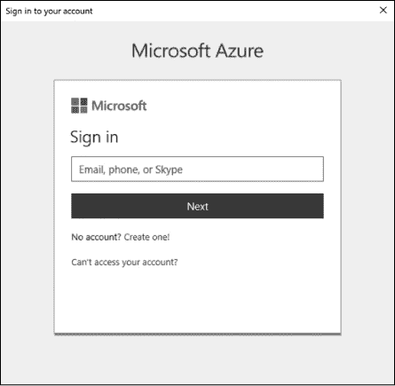

## 第十二章：与 Azure 一起工作


随着组织将越来越多的服务迁移到云端，自动化人员了解如何在云端工作变得至关重要。幸运的是，借助 PowerShell 的模块以及它与几乎任何 API 兼容的能力，在云端工作变得轻松无比。在本章和下一章中，我将向你展示如何使用 PowerShell 自动化任务；在本章，你将与 Microsoft Azure 一起工作，下一章则是与 Amazon Web Services 一起工作。

### 前提条件

如果你将在本章中运行代码，我对你的环境做了几点假设。第一个是假设你已经设置了 Microsoft Azure 订阅。在本章中，你将使用真实的云资源，所以你的账户会产生费用，但费用应该是合理的。只要你不让任何虚拟机长时间运行，费用应该不会超过 10 美元。

一旦你设置了 Azure 订阅，你需要 `Az` PowerShell 模块包。微软提供的这个模块包包含数百个命令，用于执行几乎所有 Azure 服务的任务。你可以通过在控制台中运行 Install-Module Az 来下载它（确保以管理员身份运行）。我应该指出，我正在使用 `Az` 模块的 2.4.0 版本。如果你使用的是更新的版本，我不能保证所有这些命令会完全相同地工作。

### Azure 身份验证

Azure 提供了几种身份验证方式。在本章中，你将使用服务主体。*服务主体*是一个 Azure 应用程序的身份。它是代表一个应用程序的对象，可以为该应用程序分配各种权限。

为什么要创建一个服务主体？你希望通过使用不需要用户交互的自动化脚本来进行 Azure 身份验证。为此，Azure 要求你使用服务主体或组织帐户。我希望每个人都能跟上，不论他们使用哪种类型的帐户，所以你将使用服务主体来进行 Azure 身份验证。

#### 创建服务主体

与直觉相反，创建服务主体的第一步是采用传统方式进行身份验证。为此，使用 `Connect-AzAccount`，它会弹出一个类似于图 12-1 的窗口。



*图 12-1：`Connect-AzAccount` 凭证提示*

提供你的 Azure 用户名和密码后，窗口应该关闭，并显示类似于清单 12-1 的输出。

```
PS> Connect-AzAccount

Environment           : AzureCloud
Account               : email
TenantId              : tenant id
SubscriptionId        : subscription id
SubscriptionName      : subscription name
CurrentStorageAccount :
```

*清单 12-1：`Connect-AzAccount` 输出*

请确保记录下订阅 ID 和租户 ID。稍后在脚本中你将需要这些信息。如果由于某些原因，在这里通过 `Connect-AzAccount` 进行身份验证时没有捕获到它们，你可以稍后使用 `Get-AzSubscription` 命令获取它们。

现在你已经完成了（交互式）认证，可以开始创建服务主体了。这个过程分为三个步骤：首先，创建一个新的 Azure AD 应用；然后，创建服务主体本身；最后，为该服务主体创建角色分配。

你可以使用任何你喜欢的名称和 URI 来创建 Azure AD 应用（清单 12-2）。对于我们的目的，使用什么 URI 并不重要，但创建 AD 应用时必须提供 URI。为了确保你有足够的权限来创建 AD 应用，参见[*https://docs**.microsoft.com/en-us/azure/active-directory/develop/app-objects-and-service-principals*](https://docs.microsoft.com/en-us/azure/active-directory/develop/app-objects-and-service-principals)*.*

```
PS> ❶$secPassword = ConvertTo-SecureString -AsPlainText -Force -String 'password'
PS> ❷$myApp = New-AzADApplication -DisplayName AppForServicePrincipal -IdentifierUris
'http://Some URL here' -Password $secPassword
```

*清单 12-2：创建 Azure AD 应用*

你可以看到，你首先通过使用密码❶来创建一个安全字符串。将密码转换为正确格式后，你会创建一个新的 Azure AD 应用❷。服务主体需要创建一个 Azure AD 应用。

接下来，你使用`New-AzADServicePrincipal`命令来创建服务主体，如清单 12-3 所示。你引用了清单 12-2 中创建的应用。

```
PS> $sp = New-AzADServicePrincipal -ApplicationId $myApp.ApplicationId
PS> $sp

ServicePrincipalNames : {application id, http://appforserviceprincipal}
ApplicationId         : application id
DisplayName           : AppForServicePrincipal
Id                    : service principal id
Type                  : ServicePrincipal
```

*清单 12-3：使用 PowerShell 创建 Azure 服务主体*

最后，你需要为服务主体分配一个角色。清单 12-4 为服务主体分配了一个`Contributor`角色，以确保该服务主体具备执行本章所有任务所需的访问权限。

```
PS> New-AzRoleAssignment -RoleDefinitionName Contributor -ServicePrincipalName 
$sp.ServicePrincipalNames[0]

RoleAssignmentId   : /subscriptions/subscription id/providers/Microsoft.Authorization/
                     roleAssignments/assignment id
Scope              : /subscriptions/subscription id
DisplayName        : AppForServicePrincipal
SignInName         :
RoleDefinitionName : Contributor
RoleDefinitionId   : id
ObjectId           : id
ObjectType         : ServicePrincipal
CanDelegate        : False
```

*清单 12-4：为服务主体创建角色分配*

这样，服务主体就创建完成并分配了角色。

剩下的唯一任务是将表示为安全字符串的加密密码保存到磁盘上的某个位置。你可以使用`ConvertFrom-SecureString`命令来实现。`ConvertFrom-SecureString`命令（`ConvertTo-SecureString`的互补命令）将表示为 PowerShell 安全字符串的加密文本转换为普通字符串，从而允许你稍后保存并引用它：

```
PS> $secPassword | ConvertFrom-SecureString | Out-File -FilePath C:\AzureAppPassword.txt
```

一旦你将密码保存到磁盘上，你就可以开始为 Azure 设置非交互式认证了。

#### 使用 Connect-AzAccount 进行非交互式认证

`Connect-AzAccount`命令会提示你手动输入用户名和密码。在你的脚本中，你希望尽可能减少交互操作，因为你最不希望依赖某个人坐在电脑前输入密码！幸运的是，你还可以将`PSCredential`对象传递给`Connect-AzAccount`。

你将编写一个小脚本来处理非交互式认证。首先，让我们创建一个包含 Azure 应用 ID 和密码的`PSCredential`对象：

```
$azureAppId = 'application id'
$azureAppIdPasswordFilePath = 'C:\AzureAppPassword.txt'
$pwd = (Get-Content -Path $azureAppIdPasswordFilePath | ConvertTo-SecureString)
$azureAppCred = (New-Object System.Management.Automation.PSCredential $azureAppId,$pwd)
```

还记得你之前写下的订阅 ID 和租户 ID 吗？你也需要将它们传递给`Connect-AzAccount`：

```
$subscriptionId = 'subscription id'
$tenantId = 'tenant id'
Connect-AzAccount -ServicePrincipal -SubscriptionId $subscriptionId -TenantId $tenantId
-Credential $azureAppCred
```

你已经为非交互式认证做好了准备！现在你完成了这个设置，它将被保存下来，以便以后无需再次进行认证。

如果你想要简化的代码，可以从本章的书籍资源中下载*AzureAuthentication.ps1*脚本。

### 创建 Azure 虚拟机及其所有依赖项

现在，是时候设置一个 Azure 虚拟机了。*Azure 虚拟机*是 Azure 最受欢迎的服务之一，掌握构建 Azure 虚拟机的技能对任何在 Azure 环境中工作的人来说都是一项重大优势。

很久以前，当我第一次创建我的 Azure 订阅并想玩虚拟机时，我以为会有一个单独的命令来设置它——就像我只需要运行`New-AzureVm`，然后 voilà！就会有一台全新的虚拟机让我玩。哦，我错得可真大。

我没意识到在虚拟机真正能够工作之前，有这么多的依赖关系需要设置。你有没有注意到本章的前提部分有多短？我故意这么做的，原因是：为了获得更多使用 PowerShell 的经验，你需要安装所有创建 Azure 虚拟机所需的依赖项。你将安装资源组、虚拟网络、存储账户、公共 IP 地址、网络接口和操作系统镜像。换句话说，你将从头开始构建这台虚拟机。我们开始吧！

#### 创建资源组

在 Azure 中，所有东西都是*资源*，而且所有东西都必须放在*资源组*内。你首先要做的就是创建一个资源组。为此，你将使用`New-AzResourceGroup`命令。此命令需要资源组名称以及它将被创建的地理区域。在这个例子中，你将创建一个名为`PowerShellForSysAdmins-RG`的资源组，并将其放置在美国东部区域（如 Listing 12-5 所示）。你可以通过运行`Get-AzLocation`命令来查找所有可用的区域。

```
PS> New-AzResourceGroup -Name 'PowerShellForSysAdmins-RG' -Location 'East US'
```

*Listing 12-5：创建 Azure 资源组*

一旦资源组创建完成，就可以开始构建虚拟机将使用的网络堆栈。

#### 创建网络堆栈

为了让你的虚拟机连接到外部世界和其他 Azure 资源，它需要一个*网络堆栈*：子网、虚拟网络、公共 IP 地址（可选）和虚拟网络适配器（vNIC）。

##### 子网

你的第一步是创建一个子网。*子网*是一个逻辑网络，IP 地址可以相互通信，而不需要路由器。子网将“进入”虚拟网络。子网将虚拟网络划分为更小的网络。

要创建子网配置，请使用`New-AzVirtualNetworkSubnetConfig`命令（见 Listing 12-6）。此命令需要一个名称和 IP 地址前缀或网络标识。

```
PS> $newSubnetParams = @{
 'Name' = 'PowerShellForSysAdmins-Subnet'
 'AddressPrefix' = '10.0.1.0/24'
}
PS> $subnet = New-AzVirtualNetworkSubnetConfig @newSubnetParams
```

*Listing 12-6：创建虚拟网络子网配置*

您为子网指定了 `PowerShellForSysAdmins-Subnet` 的名称，并使用前缀 10.0.1.0/24。

##### 虚拟网络

现在，您已经创建了一个子网配置，可以使用它来创建虚拟网络。*虚拟网络*是一个 Azure 资源，它允许您将虚拟机等资源与所有其他资源进行隔离。虚拟网络可以理解为您在本地网络路由器中可能实现的逻辑网络。

要创建虚拟网络，请使用 `New-AzVirtualNetwork` 命令，如列表 12-7 所示。

```
PS> $newVNetParams = @{
 ❶ 'Name' = 'PowerShellForSysAdmins-vNet'
 ❷ 'ResourceGroupName' = 'PowerShellForSysAdmins-RG'
 ❸ 'Location' = 'East US'
 ❹ 'AddressPrefix' = '10.0.0.0/16'
}
PS> $vNet = New-AzVirtualNetwork @newVNetParams -Subnet $subnet
```

*列表 12-7：创建虚拟网络*

请注意，要创建虚拟网络，您需要指定网络名称 ❶、资源组 ❷、区域（位置） ❸ 和子网所属的整体私有网络 ❹。

##### 公共 IP 地址

现在，您已经设置了一个虚拟网络，您需要一个公共 IP 地址，以便将虚拟机连接到互联网，并允许客户端连接到您的虚拟机。请注意，如果您计划将虚拟机仅提供给其他 Azure 资源，那么这一过程在技术上并不是必须的。但由于您对虚拟机有更大的规划，因此您将继续执行此步骤。

同样，您可以通过使用一条命令来创建公共 IP 地址：`New-AzPublicIpAddress`。您之前已经见过这个功能的大部分参数，但请注意有一个新的参数，名为 `AllocationMethod`。这个参数告诉 Azure 是否创建动态或静态 IP 地址资源。如列表 12-8 所示，指定您需要一个动态 IP 地址。您为虚拟机分配动态 IP 地址，因为这可以减少一个需要担心的任务。由于您不要求 IP 地址始终保持相同，使用动态 IP 地址可以让您免去另一项麻烦。

```
PS> $newPublicIpParams = @{
 'Name' = 'PowerShellForSysAdmins-PubIp'
 'ResourceGroupName' = 'PowerShellForSysAdmins-RG'
 'AllocationMethod' = 'Dynamic' ## Dynamic or Static
 'Location' = 'East US'
}
PS> $publicIp = New-AzPublicIpAddress @newPublicIpParams
```

*列表 12-8：创建公共 IP 地址*

尽管这个公共 IP 地址已经存在，但它没有任何作用，因为它尚未与任何内容关联。您需要将其*绑定*到 vNIC。

##### 虚拟网络适配器

要构建 vNIC，您需要执行另一个单行命令 `New-AzNetworkInterface`，并且可以使用您之前使用的大部分相同参数。您还需要先前创建的子网和公共 IP 地址的 ID。子网和公共 IP 地址都存储为具有 ID 属性的对象；您只需访问该属性，如列表 12-9 所示。

```
PS> $newVNicParams = @{
 'Name' = 'PowerShellForSysAdmins-vNIC'
 'ResourceGroupName' = 'PowerShellForSysAdmins-RG'
 'Location' = 'East US'
 'SubnetId' = $vNet.Subnets[0].Id
 'PublicIpAddressId' = $publicIp.Id
}
PS> $vNic = New-AzNetworkInterface @newVNicParams
```

*列表 12-9：创建 Azure vNIC*

您的网络堆栈已经完成！下一步是创建存储帐户。

#### 创建存储帐户

你需要为虚拟机指定存储位置。这个位置叫做 *存储帐户*。创建一个基本存储帐户和使用 `New-AzStorageAccount` 命令一样简单。与前面几条命令一样，你需要一个名称、资源组和位置；但这里有一个新的 `Type` 参数，它指定你的存储帐户的冗余级别。使用最便宜的存储帐户类型（*本地冗余*），通过 `Standard_LRS` 参数指定，如清单 12-10 所示。

```
PS> $newStorageAcctParams = @{
 'Name' = 'powershellforsysadmins'
 'ResourceGroupName' = 'PowerShellForSysAdmins-RG'
 'Type' = 'Standard_LRS'
 'Location' = 'East US'
}
PS> $storageAccount = New-AzStorageAccount @newStorageAcctParams
```

*清单 12-10：创建 Azure 存储帐户*

现在你有了虚拟机的存储位置，是时候设置操作系统映像了。

#### 创建操作系统映像

*操作系统映像* 是虚拟机将使用的虚拟磁盘的基础。你不会在虚拟机上安装 Windows，而是使用一个现有的操作系统映像，将你带到只需启动它的阶段。

创建操作系统映像分为两步：定义一些操作系统配置设置，然后定义要使用的 offer 或操作系统映像。Azure 使用 *offer* 这个术语来引用虚拟机映像。

为了设置所有配置选项，你需要构建一个虚拟机配置对象。此对象定义了你正在创建的虚拟机的名称和大小。你可以使用 `New-AzVMConfig` 命令来完成。在清单 12-11 中，你创建了一个 `Standard_A3` 虚拟机。（你可以运行 `Get-AzVMSize` 并指定区域，来查找所有可用的虚拟机大小。）

```
PS> $newConfigParams = @{
 'VMName' = 'PowerShellForSysAdmins-VM'
 'VMSize' = 'Standard_A3'
}
PS> $vmConfig = New-AzVMConfig @newConfigParams
```

*清单 12-11：创建虚拟机配置*

配置创建完成后，你可以将该对象作为 VM 参数传递给 `Set-AzVMOperatingSystem` 命令。此命令允许你定义操作系统特定的属性，例如虚拟机的主机名，并启用 Windows 更新及其他属性。我们在这里保持简单，但如果你想查看所有可能的选项，可以使用 `Get-Help` 查看 `Set-AzVMOperatingSystem` 的详细信息。

清单 12-12 创建了一个 Windows 操作系统对象，该对象的主机名为 `Automate-VM`（注意：主机名必须少于 16 个字符）。你将使用 `Get-Credential` 命令返回的用户名和密码来创建一个新的管理员用户，并使用提供的密码；同时，使用 `EnableAutoUpdate` 参数自动应用任何新的 Windows 更新。

```
PS> $newVmOsParams = @{
 'Windows' = $true
 'ComputerName' = 'Automate-VM'
 'Credential' = (Get-Credential -Message 'Type the name and password of the
    local administrator account.')
 'EnableAutoUpdate' = $true
 'VM' = $vmConfig
}
PS> $vm = Set-AzVMOperatingSystem @newVmOsParams
```

*清单 12-12：创建操作系统映像*

现在你需要创建一个 VM offer。offer 是 Azure 允许你选择安装在虚拟机操作系统磁盘上的操作系统类型的方式。此示例使用的是 Windows Server 2012 R2 数据中心映像。这是微软提供的映像，因此无需创建自己的映像。

一旦你创建了 offer 对象，你可以通过使用 `Set-AzVMSourceImage` 命令来创建源映像，如清单 12-13 所示。

```
PS> $offer = Get-AzVMImageOffer -Location 'East US'❶ –PublisherName
'MicrosoftWindowsServer'❷ | Where-Object { $_.Offer -eq 'WindowsServer' }❸
PS> $newSourceImageParams = @{
 'PublisherName' = 'MicrosoftWindowsServer'
 'Version' = 'latest'
 'Skus' = '2012-R2-Datacenter'
 'VM' = $vm
 'Offer' = $offer.Offer
}
PS> $vm = Set-AzVMSourceImage @newSourceImageParams
```

*清单 12-13：查找和创建虚拟机源映像*

在这里，你正在查询东部美国区域❶中所有发布商名称为`MicrosoftWindowsServer` ❷的可用项。你可以使用`Get-AzVMImagePublisher`来查找发布商列表。然后，你将可用项限制为名为`WindowsServer` ❸的项。分配了源镜像后，你现在可以将该镜像分配给虚拟机对象。这样就完成了虚拟机虚拟磁盘的设置。

要将镜像分配给虚拟机对象，你需要一个你刚刚创建的操作系统磁盘的 URI，并且需要将该 URI 与虚拟机对象一起传递给`Set-AzVMOSDisk`命令（清单 12-14）。

```
PS> $osDiskName = 'PowerShellForSysAdmins-Disk'
PS> $osDiskUri = '{0}vhds/PowerShellForSysAdmins-VM{1}.vhd' -f $storageAccount
                 .PrimaryEndpoints.Blob.ToString(), $osDiskName
PS> $vm = Set-AzVMOSDisk -Name $osDiskName -CreateOption 'fromImage' -VM $vm -VhdUri $osDiskUri
```

*清单 12-14：将操作系统磁盘分配给虚拟机*

到此为止，你已经有了操作系统磁盘，并且它已经分配给了虚拟机对象。现在是时候完成这项工作了！

#### 总结

你*几乎*完成了。剩下的就是附加你之前创建的 vNIC，并且，嗯，创建实际的虚拟机。

要将 vNIC 附加到虚拟机，你需要使用`Add-AzVmNetworkInterface`命令，并传递你创建的虚拟机对象以及之前创建的 vNIC 的 ID—你可以在清单 12-15 中查看所有这些。

```
PS> $vm = Add-AzVMNetworkInterface -VM $vm -Id $vNic.Id
```

*清单 12-15：将 vNIC 附加到虚拟机*

现在，终于可以创建虚拟机，如清单 12-16 所示。通过调用`New-AzVm`命令并提供虚拟机对象、资源组和区域，你就拥有了自己的虚拟机！请注意，这会启动虚拟机，并且此时你将开始产生费用。

```
PS> New-AzVM -VM $vm -ResourceGroupName 'PowerShellForSysAdmins-RG' -Location 'East US'

RequestId IsSuccessStatusCode StatusCode ReasonPhrase
--------- ------------------- ---------- ------------
                         True         OK OK
```

*清单 12-16：创建 Azure 虚拟机*

你应该已经在 Azure 中拥有一个全新的虚拟机，名为`Automate-VM`。为了确认，你可以运行`Get-AzVm`来确保虚拟机存在。查看清单 12-17 中的输出。

```
PS> Get-AzVm -ResourceGroupName 'PowerShellForSysAdmins-RG' -Name PowerShellForSysAdmins-VM

ResourceGroupName  : PowerShellForSysAdmins-RG
Id                 : /subscriptions/XXXXXXXXXXXXX/resourceGroups/PowerShellForSysAdmins-RG/
                     providers/Microsoft.Compute/virtualMachines/PowerShellForSysAdmins-VM
VmId               : e459fb9e-e3b2-4371-9bdd-42ecc209bc01
Name               : PowerShellForSysAdmins-VM
Type               : Microsoft.Compute/virtualMachines
Location           : eastus
Tags               : {}
DiagnosticsProfile : {BootDiagnostics}
Extensions         : {BGInfo}
HardwareProfile    : {VmSize}
NetworkProfile     : {NetworkInterfaces}
OSProfile          : {ComputerName, AdminUsername, WindowsConfiguration, Secrets}
ProvisioningState  : Succeeded
StorageProfile     : {ImageReference, OsDisk, DataDisks}
```

*清单 12-17：发现你的 Azure 虚拟机*

如果你看到类似的输出，那么你已经成功创建了一个 Azure 虚拟机！

#### 自动化虚拟机创建

呼！创建一个虚拟机并建立所有依赖关系真是件大事；当我想要创建下一个虚拟机时，我真不希望再经历一遍。为什么我们不创建一个函数来为我们处理这一切呢？通过使用函数，我们可以将刚才的所有代码整合到一个单独的、可执行的代码块中，并且可以重复使用。

如果你有冒险精神，我创建了一个名为`New-CustomAzVm`的自定义 PowerShell 函数，可以在本章的资源中找到。它提供了一个很好的示例，展示了如何将本节中完成的所有任务整合成一个简洁的函数，并且只需要最少的输入。

### 部署 Azure Web 应用

如果你在使用 Azure，你可能想了解如何部署 Azure web 应用。*Azure web 应用* 允许你快速配置网站和其他各种 web 服务，这些服务运行在 IIS、Apache 等服务器上，而无需担心构建 web 服务器本身。一旦你学会如何使用 PowerShell 部署 Azure web 应用，你就可以将这个过程融入到更大的工作流中，包括开发构建管道、测试环境配置、实验室配置等。

部署 Azure web 应用是一个两步过程：首先创建应用服务计划，然后创建 web 应用本身。Azure web 应用是 Azure 应用服务的一部分，任何属于此类别的资源都必须关联一个应用服务计划。*应用服务计划* 告诉 web 应用要构建程序的底层计算资源类型。

#### 创建应用服务计划和 web 应用

创建 Azure 服务计划相当简单。和之前一样，你只需要一个命令。此命令要求你提供应用服务计划的名称、所在的区域或位置、资源组，以及一个可选的层级，定义托管 web 应用的服务器的性能类型。

就像在前一节中做的一样，你需要创建一个资源组，将所有资源放在一起；使用以下命令：New-AzResourceGroup -Name 'PowerShellForSysAdmins-App' -Location 'East US'。一旦资源组创建完成，你就可以创建应用服务计划，并将其放入该资源组中。

你的 web 应用名为 `Automate`，将位于 East US 区域，并且属于 `Free` 层级的应用。你可以在 清单 12-18 中看到完成这些任务的所有代码。

```
PS> New-AzAppServicePlan -Name 'Automate' -Location 'East US'
-ResourceGroupName 'PowerShellForSysAdmins-App' -Tier 'Free'
```

*清单 12-18：创建 Azure 应用服务计划*

一旦执行了此命令，你将创建一个应用服务计划，并可以继续创建 web 应用本身。

你可能不会惊讶地发现，使用 PowerShell 创建 Azure web 应用也是一个单命令过程。只需运行 `New-AzWebApp`，并提供现在常见的参数：资源组名称、应用名称和位置，以及该 web 应用所在的应用服务计划。

清单 12-19 使用 `New-AzWebApp` 命令创建一个名为 `MyApp` 的 web 应用，位于 `PowerShellForSysAdmins-App` 资源组内，使用之前创建的应用服务计划 `Automate`。请注意，这会启动应用程序，可能会产生费用。

```
PS> New-AzWebApp -ResourceGroupName 'PowerShellForSysAdmins-App' -Name
'AutomateApp' -Location 'East US' -AppServicePlan 'Automate'
```

*清单 12-19：创建 Azure web 应用*

当你运行此命令时，你应该在输出中看到许多属性；这些是 web 应用的各种设置。

### 部署 Azure SQL 数据库

另一个常见的 Azure 任务是部署 Azure SQL 数据库。要部署 Azure SQL 数据库，你需要做三件事：创建 Azure SQL 服务器（数据库将运行在其上），创建数据库本身，然后创建一个 SQL Server 防火墙规则来连接到数据库。

如前所述，你需要创建一个资源组来容纳所有新的资源。可以运行`New-AzResourceGroup -Name 'PowerShellForSysAdmins-SQL' -Location 'East US'`来创建资源组。然后，你将创建一个 SQL 服务器来运行数据库。

#### 创建 Azure SQL 服务器

创建 Azure SQL 服务器需要另一个单行命令：`New-AzSqlServer`。同样，你需要提供资源名称、服务器名称以及区域，但在这里，你还需要提供 SQL 管理员用户的用户名和密码。这需要更多的工作。由于你需要创建一个凭证传递给`New-AzSqlServer`，我们先创建该凭证。我已经在“创建服务主体”一节中讲解了如何创建一个`PSCredential`对象，具体内容见第 158 页，所以这里不再赘述。

```
PS> $userName = 'sqladmin'
PS> $plainTextPassword = 's3cretp@SSw0rd!'
PS> $secPassword = ConvertTo-SecureString -String $plainTextPassword -AsPlainText -Force
PS> $credential = New-Object -TypeName System.Management.Automation.PSCredential -ArgumentList
$userName,$secPassword
```

一旦你有了凭证，其余的工作就像将所有参数放入哈希表，并传递给`New-AzSqlServer`函数一样简单，具体内容见清单 12-20。

```
PS> $parameters = @{
 ResourceGroupName = 'PowerShellForSysAdmins-SQL'
 ServerName = 'powershellforsysadmins-sqlsrv'
 Location =  'East US'
 SqlAdministratorCredentials = $credential
}
PS> New-AzSqlServer @parameters

ResourceGroupName        : PowerShellForSysAdmins-SQL
ServerName               : powershellsysadmins-sqlsrv
Location                 : eastus
SqlAdministratorLogin    : sqladmin
SqlAdministratorPassword :
ServerVersion            : 12.0
Tags                     :
Identity                 :
FullyQualifiedDomainName : powershellsysadmins-sqlsrv.database.windows.net
ResourceId               : /subscriptions/XXXXXXXXXXXXX/resourceGroups
                           /PowerShellForSysAdmins-SQL/providers/Microsoft.Sql
                           /servers/powershellsysadmins-sqlsrv
```

*清单 12-20：创建 Azure SQL 服务器*

现在 SQL 服务器已经创建，你已经为数据库奠定了基础。

#### 创建 Azure SQL 数据库

要创建 SQL 数据库，请使用`New-AzSqlDatabase`命令，具体内容见清单 12-21。除了常见的`ResourceGroupName`参数外，还需传入你刚才创建的服务器名称以及你要创建的数据库名称（在此示例中为`AutomateSQLDb`）。

```
PS> New-AzSqlDatabase -ResourceGroupName 'PowerShellForSysAdmins-SQL'
-ServerName 'PowerShellSysAdmins-SQLSrv' -DatabaseName 'AutomateSQLDb'

ResourceGroupName             : PowerShellForSysAdmins-SQL
ServerName                    : PowerShellSysAdmins-SQLSrv
DatabaseName                  : AutomateSQLDb
Location                      : eastus
DatabaseId                    : 79f3b331-7200-499f-9fba-b09e8c424354
Edition                       : Standard
CollationName                 : SQL_Latin1_General_CP1_CI_AS
CatalogCollation              :
MaxSizeBytes                  : 268435456000
Status                        : Online
CreationDate                  : 9/15/2019 6:48:32 PM
CurrentServiceObjectiveId     : 00000000-0000-0000-0000-000000000000
CurrentServiceObjectiveName   : S0
RequestedServiceObjectiveName : S0
RequestedServiceObjectiveId   :
ElasticPoolName               :
EarliestRestoreDate           : 9/15/2019 7:18:32 PM
Tags                          :
ResourceId                    : /subscriptions/XXXXXXX/resourceGroups
                                /PowerShellForSysAdmins-SQL/providers
                                /Microsoft.Sql/servers/powershellsysadmin-sqlsrv
                                /databases/AutomateSQLDb
CreateMode                    :
ReadScale                     : Disabled
ZoneRedundant                 : False
Capacity                      : 10
Family                        :
SkuName                       : Standard
LicenseType                   :
```

*清单 12-21：创建 Azure SQL 数据库*

到此为止，你已经在 Azure 中运行了一个 SQL 数据库。但当你尝试连接时，它无法正常工作。默认情况下，创建新的 Azure SQL 数据库时，它会锁定所有外部连接。你需要创建一个防火墙规则，允许连接到你的数据库。

#### 创建 SQL 服务器防火墙规则

创建防火墙规则的命令是`New-AzSqlServerFirewallRule`。此命令需要传入资源组名称、你之前创建的服务器名称、防火墙规则名称以及起始和结束的 IP 地址。起始和结束的 IP 地址可以让你指定一个单一的 IP 地址或 IP 地址范围，允许其连接到你的数据库。由于你只会在一台本地计算机上管理 Azure，我们将把 SQL 服务器的连接限制为仅来自当前计算机。为此，你需要先找出你的公共 IP 地址。你可以通过一个 PowerShell 单行命令轻松获取：`Invoke-RestMethod http://ipinfo.io/json | Select -ExpandProperty ip`。然后，你可以将公共 IP 地址用作`StartIPAddress`和`EndIPAddress`参数。然而，请注意，如果你的公共 IP 地址发生变化，你需要重新执行这些操作。

同时，请注意，清单 12-22 中的服务器名称必须由全小写字母、连字符和/或数字组成。否则，当你尝试创建防火墙规则时，会出现错误。

```
PS> $parameters = @{
 ResourceGroupName = 'PowerShellForSysAdmins-SQL'
 FirewallRuleName = 'PowerShellForSysAdmins-FwRule'
 ServerName = 'powershellsysadmin-sqlsrv'
 StartIpAddress = 'Your Public IP Address'
 EndIpAddress = 'Your Public IP Address'
}
PS> New-AzSqlServerFirewallRule @parameters

ResourceGroupName : PowerShellForSysAdmins-SQL
ServerName        : powershellsys-sqlsrv
StartIpAddress    : 0.0.0.0
EndIpAddress      : 0.0.0.0
FirewallRuleName  : PowerShellForSysAdmins-FwRule
```

*清单 12-22：创建 Azure SQL 服务器防火墙规则*

就这样！你的数据库应该已经启动并运行了。

#### 测试你的 SQL 数据库

要测试你的数据库，让我们创建一个小功能，使用`System.Data.SqlClient.SqlConnection`对象的`Open()`方法尝试一个简单的连接；请参见清单 12-23。

```
function Test-SqlConnection {
    param(
        [Parameter(Mandatory)]
     ❶ [string]$ServerName,

        [Parameter(Mandatory)]
        [string]$DatabaseName,

        [Parameter(Mandatory)]
     ❷ [pscredential]$Credential
    )

    try {
        $userName = $Credential.UserName
     ❸ $password = $Credential.GetNetworkCredential().Password
     ❹ $connectionString = 'Data Source={0};database={1};User
        ID={2};Password={3}' -f $ServerName,$DatabaseName,$userName,$password
        $sqlConnection = New-Object System.Data.SqlClient.SqlConnection
        $ConnectionString
     ❺ $sqlConnection.Open()
        $true
 } catch {
       if ($_.Exception.Message -match 'cannot open server') {
           $false
       } else {
           throw $_
       }
    } finally {
     ❻ $sqlConnection.Close()
    }
}
```

*清单 12-23：测试连接到 Azure SQL 数据库的 SQL 连接*

你使用之前创建的 SQL 服务器完全限定的域名作为此函数的`ServerName`参数❶，并将 SQL 管理员的用户名和密码放入一个`PSCredential`对象中❷。

然后，你将`PSCredential`对象分解成明文用户名和密码❸，创建连接字符串以建立数据库连接❹，在`SqlConnection`对象上调用`Open()`方法尝试连接到数据库❺，最后关闭数据库连接❻。

你可以通过运行 Test-SqlConnection -ServerName 'powershellsysadmins-sqlsrv.database.windows.net' -DatabaseName 'AutomateSQLDb' -Credential (Get-Credential) 来执行此功能。如果你能连接到数据库，函数将返回`True`；否则，它将返回`False`（并且需要进一步调查）。

你可以通过执行命令 Remove-AzResourceGroup -ResourceGroupName 'PowerShellForSysAdmins-SQL' 来清理所有内容。

### 总结

在这一章中，你深入学习了如何使用 PowerShell 自动化 Microsoft Azure。你设置了非交互式身份验证，部署了虚拟机、Web 应用和 SQL 数据库。而且，你全程都通过 PowerShell 完成，免去了访问 Azure 门户的麻烦。

如果没有`Az` PowerShell 模块和那些开发它的人的辛勤工作，你是做不到这一点的。像其他 PowerShell 云模块一样，所有这些命令都依赖于在后台调用的各种 API。多亏了这个模块，你不需要担心如何调用 REST 方法或使用端点 URL。

在下一章，你将学习如何使用 PowerShell 自动化 Amazon Web Services。
