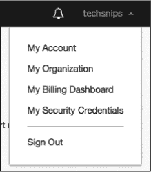
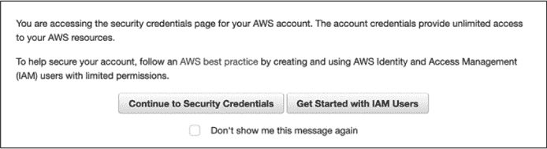

## 第十三章：与 AWS 合作


在前一章中，你学习了如何使用 PowerShell 与 Microsoft Azure 进行操作。现在让我们看看如何使用 Amazon Web Services（AWS）。在本章中，你将深入学习如何使用 PowerShell 与 AWS 交互。首先，你将学习如何通过 PowerShell 认证 AWS，然后你将学习如何从零开始创建一个 EC2 实例，部署 Elastic Beanstalk（EBS）应用程序，并创建一个 Amazon Relational Database Service（Amazon RDS）Microsoft SQL Server 数据库。

像 Azure 一样，AWS 是云计算领域的巨头。如果你从事 IT 工作，你很可能会在职业生涯中以某种方式与 AWS 打交道。和 Azure 一样，AWS 也有一个方便的 PowerShell 模块：`AWSPowerShell`。

你可以像安装`Az`模块一样，从 PowerShell Gallery 安装`AWSPowerShell`，只需调用 Install-Module AWSPowerShell。一旦该模块下载并安装完毕，你就可以开始使用了。

### 先决条件

我假设你已经有了一个 AWS 账户，并且可以访问根用户。你可以在* [`aws.amazon.com/free/`](https://aws.amazon.com/free/)* 注册一个 AWS 免费套餐账户。你不需要始终使用根用户，但你需要根用户来创建你的第一个*身份和访问管理*（*IAM*）用户。你还需要下载并安装`AWSPowerShell`模块，正如之前所提到的。

### AWS 认证

在 AWS 中，认证是通过 IAM 服务完成的，IAM 处理 AWS 中的认证、授权、计费和审计。要认证到 AWS，你必须在你的订阅下创建一个 IAM 用户，并且该用户必须能够访问相关资源。与 AWS 合作的第一步就是创建一个 IAM 用户。

当创建 AWS 账户时，会自动创建一个根用户，所以你将使用根用户来创建 IAM 用户。*从技术上讲*，你可以使用根用户在 AWS 中做任何事，但这强烈不推荐。

#### 使用根用户进行认证

让我们创建一个你将在本章余下部分使用的 IAM 用户。然而，首先你需要以某种方式进行认证。如果没有其他 IAM 用户，唯一的方法就是使用根用户。遗憾的是，这意味着你暂时需要放弃 PowerShell。你需要使用 AWS 管理控制台的 GUI 来获取根用户的访问密钥和秘密密钥。

你的第一步是登录到 AWS 账户。导航到屏幕的右上角，点击账户下拉菜单，如图 13-1 所示。



*图 13-1：我的安全凭证选项*

点击**我的安全凭证**选项。屏幕会弹出警告，提醒你修改安全凭证不是好主意；参见图 13-2。但是你需要在这里进行操作，以便创建一个 IAM 用户。



*图 13-2：认证警告*

点击**继续到安全凭证**，然后点击**访问密钥**。点击**创建新访问密钥**应该会显示查看帐户访问密钥 ID 和密钥的方式。它还会提供下载一个包含这两者的密钥文件的选项。如果你还没有下载，下载该文件并将其保存在安全位置。现在，你需要从此页面复制访问密钥和秘密密钥，并将它们添加到 PowerShell 会话中的默认配置文件中。

将这两个密钥传递给`Set-AWSCredential`命令，它会保存这些密钥，以便在后续创建 IAM 用户的命令中重用。查看列出 13-1 以查看完整的命令。

```
PS> Set-AWSCredential -AccessKey 'access key' -SecretKey 'secret key'
```

*列出 13-1：设置 AWS 访问密钥*

完成这些步骤后，你已经准备好创建 IAM 用户。

#### 创建 IAM 用户和角色

现在你已使用根用户身份验证，可以创建 IAM 用户。使用`New-IAMUser`命令，指定你想要使用的 IAM 用户名（在这个示例中是`Automator`）。当你创建用户时，你应该会看到类似列出 13-2 的输出。

```
PS> New-IAMUser -UserName Automator

Arn                 : arn:aws:iam::013223035658:user/Automator
CreateDate          : 9/16/2019 5:01:24 PM
PasswordLastUsed    : 1/1/0001 12:00:00 AM
Path                : /
PermissionsBoundary :
UserId              : AIDAJU2WN5KIFOUMPDSR4
UserName            : Automator
```

*列出 13-2：创建 IAM 用户*

注意在列出 13-2 中的`Arn`属性。在你创建 IAM 角色时，你需要使用这个值。

下一步是赋予用户适当的权限。你可以通过为该用户分配一个角色来完成此操作，角色已经分配了一个策略。AWS 将某些权限分组为称为*角色*的单位，这使得管理员可以更轻松地委派权限（这是一种称为*基于角色的访问控制*，或*RBAC*的策略）。*策略*则决定了角色可以访问哪些权限。

你可以通过使用`New-IAMRole`命令来创建一个角色，但首先你需要创建 AWS 所称的*信任关系策略文档*：一个 JSON 格式的文本字符串，定义了此用户可以访问的服务及其访问级别。

列出 13-3 是一个信任关系策略文档的示例。重要提示：注意 Principal 行中的 XXXXXX。请确保将你刚创建的 IAM 用户的 ARN 替换到这里。

```
{
    "Version": "2012-10-17",
    "Statement": [
        {
            "Effect": "Allow",
            "Principal" : { "AWS": "arn:aws:iam::XXXXXX:user/Automator" },
            "Action": "sts:AssumeRole"
        }
    ]
}
```

*列出 13-3：示例信任策略文档*

这个 JSON 会更改角色本身（修改其信任策略），以允许你的`Automator`用户使用它。它是将`AssumeRole`权限赋予你的用户。这是创建角色所必需的。如需了解如何创建信任关系策略文档的更多信息，请参阅[*https://docs.aws.amazon.com/IAM/latest/UserGuide/id_roles_manage_modify.html*](https://docs.aws.amazon.com/IAM/latest/UserGuide/id_roles_manage_modify.html)。

将此 JSON 字符串赋值给`$json`变量，然后将其作为`AssumeRolePolicyDocument`参数的值传递给`New-IamRole`，如列出 13-4 所示。

```
PS> $json = '{
>> "Version": "2012-10-17",
>> "Statement": [
>> {
>> "Effect": "Allow",
>> "Principal" : { "AWS": "arn:aws:iam::XXXXXX:user/Automator" },
>> "Action": "sts:AssumeRole"
>> }
>> ]
>> }'
PS> New-IAMRole -AssumeRolePolicyDocument $json -RoleName 'AllAccess'

Path             RoleName                         RoleId                   CreateDate          
----             --------                         ------                   ----------          
/                AllAccess                        <Your Specific Role ID>  <Date created>
```

*列出 13-4：创建新 IAM 角色*

现在 IAM 角色已经创建，你需要赋予它访问你将使用的各种资源的权限。与其花费接下来的几十页篇幅详细讲解 AWS IAM 角色和安全性，不如做一件简单的事，给`Automator`授予对所有内容的完全访问权限（实际上将其变成根用户）。

请注意，在实际操作中，你*不*应该这样做。最佳实践是尽量限制访问权限，仅授权必要的权限。有关更多信息，请参考 AWS IAM 最佳实践指南（* [`docs.aws.amazon.com/IAM/latest/UserGuide/best-practices.html`](https://docs.aws.amazon.com/IAM/latest/UserGuide/best-practices.html) *）。但现在，让我们通过使用`Register-IAMUserPolicy`命令为此用户分配`AdministratorAccess`托管策略。你需要该策略的 Amazon 资源名称（ARN）。为此，你可以使用`Get-IAMPolicies`命令，通过策略名称进行筛选，将名称存储在变量中，然后将该变量传递到`Register-IAMUserPolicy`（所有操作可以参考示例 13-5）。

```
PS> $policyArn = (Get-IAMPolicies | where {$_.PolicyName -eq 'AdministratorAccess'}).Arn
PS> Register-IAMUserPolicy -PolicyArn $policyArn -UserName Automator
```

*示例 13-5：将策略附加到用户*

你需要做的最后一件事是生成一个访问密钥，用以验证你的用户。你可以使用`New-IAMAcessKey`命令来完成这项工作，正如示例 13-6 所示。

```
PS> $key = New-IAMAccessKey -UserName Automator
PS> $key

AccessKeyId     : XXXXXXXX
CreateDate      : 9/16/2019 6:17:40 PM
SecretAccessKey : XXXXXXXXX
Status          : Active
UserName        : Automator
```

*示例 13-6：创建 IAM 访问密钥*

你的新 IAM 用户已经设置好了。现在让我们对其进行身份验证。

#### 身份验证你的 IAM 用户

在前面的章节中，你已经使用了根用户进行身份验证——这只是一个临时措施。你需要验证你的 IAM 用户，以便实际开始工作！在 AWS 中，几乎所有操作都需要先验证 IAM 用户。在这里，你将再次使用`Set-AWSCredential`命令，通过新访问密钥和秘密密钥更新你的配置文件。然而，这次需要稍微修改命令，使用`StoreAs`参数，正如示例 13-7 所示。由于你将在剩下的会话中使用该 IAM 用户，因此你将把访问密钥和秘密密钥存储在 AWS 默认配置文件中，这样每次会话就不需要再次运行此命令了。

```
PS> Set-AWSCredential -AccessKey $key.AccessKeyId -SecretKey 
$key.SecretAccessKey -StoreAs 'Default'
```

*示例 13-7：设置默认 AWS 访问密钥*

最后一个命令是`Initialize-AWSDefaultConfiguration -Region 'your region here'`，它可以避免每次调用命令时都必须指定区域。这是一次性步骤。你可以通过运行`Get-AWSRegion`命令来查找所有区域，并找出离你最近的区域。

就是这样！你现在已经在 AWS 中完成了身份验证，可以开始使用 AWS 服务了。为了确认，可以运行`Get-AWSCredentials`命令并使用`ListProfileDetail`参数查看所有已保存的凭证。如果一切正常，你将看到默认配置文件显示出来：

```
PS> Get-AWSCredentials -ListProfileDetail
ProfileName StoreTypeName         ProfileLocation
----------- -------------         ---------------
Default     NetSDKCredentialsFile
```

### 创建 AWS EC2 实例

在第十二章中，你创建了一个 Azure 虚拟机。在这里，你将做类似的事情，通过创建*AWS EC2 实例*。AWS EC2 实例提供与 Azure 虚拟机相同的学习机会；无论是在 Azure 还是 AWS 中，创建虚拟机是极其常见的事情。然而，在 AWS 中创建虚拟机时，你需要以不同于 Azure 的方式来进行资源配置。在这里，底层 API 不同，这意味着你运行的命令会有所不同，但简而言之，你将执行基本相同的任务：创建一个虚拟机。AWS 还有自己的术语，这也让人有些困惑！我尽量让步骤尽可能地与前一章中创建虚拟机的步骤相似，但由于 Azure 和 AWS 在架构和语法上的差异，你会看到一些明显的不同。

幸运的是，和 Azure 一样，你有一个名为`AWSPowerShell`的模块，它可以让你更轻松地从零开始编写所有内容。就像在前一章中做的那样，你将从头开始：设置所有所需的依赖项，然后创建 EC2 实例。

#### 虚拟私有云

第一个依赖是网络。你可以使用现有的网络或自己构建一个。因为本书是实践型的，你将从零开始构建自己的网络。在 Azure 中，你使用的是 vNet，但在 AWS 中，你将使用*虚拟私有云（VPCs）*，它是一种网络架构，使虚拟机能够连接到云的其他部分。为了复制 Azure vNet 可能具有的相同设置，你只需创建一个具有单个子网的 VPC，并将其设置为最基础的级别。由于有许多配置选项可以选择，我决定最好尽可能地模拟我们的 Azure 网络配置。

在开始之前，你需要知道要创建的子网。让我们以 10.10.0.0/24 作为我们的示例网络。你将存储该信息和一个变量，并使用`New-EC2Vpc`命令，如清单 13-8 所示。

```
PS> $network = '10.0.0.0/16'
PS> $vpc = New-EC2Vpc -CidrBlock $network
PS> $vpc

CidrBlock                   : 10.0.0.0/24
CidrBlockAssociationSet     : {vpc-cidr-assoc-03f1edbc052e8c207}
DhcpOptionsId               : dopt-3c9c3047
InstanceTenancy             : default
Ipv6CidrBlockAssociationSet : {}
IsDefault                   : False
State                       : pending
Tags                        : {}
VpcId                       : vpc-03e8c773094d52eb3
```

*清单 13-8：创建 AWS VPC*

创建 VPC 后，你必须手动启用 DNS 支持（Azure 会自动为你完成此操作）。手动启用 DNS 支持应该将连接到该 VPC 的服务器指向一个内部的 Amazon DNS 服务器。同样，你需要手动提供一个公共主机名（这是 Azure 为你完成的另一项任务）。要做到这一点，你需要启用 DNS 主机名。通过使用清单 13-9 中的代码来完成这两项操作。

```
PS> Edit-EC2VpcAttribute -VpcId $vpc.VpcId -EnableDnsSupport $true
PS> Edit-EC2VpcAttribute -VpcId $vpc.VpcId -EnableDnsHostnames $true
```

*清单 13-9：启用 VPC DNS 支持和主机名*

请注意，你在两者中都使用了`Edit-EC2VpcAttribute`命令。顾名思义，该命令让你编辑 EC2 VPC 的多个属性。

#### Internet 网关

下一步是创建一个互联网网关。这将允许你的 EC2 实例将流量路由到互联网并从互联网接收流量。你需要手动执行此操作，这里使用的是`New-EC2InternetGateway`命令（列表 13-10）。

```
PS> $gw = New-EC2InternetGateway
PS> $gw

Attachments InternetGatewayId     Tags
----------- -----------------     ----
{}          igw-05ca5aaa3459119b1 {}
```

*列表 13-10：创建互联网网关*

创建了网关后，你必须使用`Add-EC2InternetGateway`命令将其附加到 VPC 中，正如列表 13-11 所示。

```
PS> Add-EC2InternetGateway -InternetGatewayId $gw.InternetGatewayId -VpcId $vpc.VpcId
```

*列表 13-11：将 VPC 附加到互联网网关*

在 VPC 处理完后，让我们进入下一步，为你的网络添加路由。

#### 路由

在创建了网关之后，你现在需要创建一个路由表和一个路由，以便 VPC 上的 EC2 实例可以访问互联网。*路由*是网络流量到达目的地所经过的路径。*路由表*是一个，嗯，路由的表格。你的路由需要放在一个表格里，所以你会先创建路由表。使用`New-EC2RouteTable`命令，传入你的 VPC ID（列表 13-12）。

```
PS> $rt = New-EC2RouteTable -VpcId $vpc.VpcId
PS> $rt

Associations    : {}
PropagatingVgws : {}
Routes          : {}
RouteTableId    : rtb-09786c17af32005d8
Tags            : {}
VpcId           : vpc-03e8c773094d52eb3
```

*列表 13-12：创建路由表*

在路由表内，你创建一个指向刚刚创建的网关的路由。你正在创建一个*默认路由*，或者叫*默认网关*，意味着如果没有定义更具体的路由，外发的网络流量将通过该路由。你将所有流量（0.0.0.0/0）都通过你的互联网网关进行路由。使用`New-EC2Route`命令，如果成功返回`True`，正如列表 13-13 所示。

```
PS> New-EC2Route -RouteTableId $rt.RouteTableId -GatewayId 
$gw.InternetGatewayId -DestinationCidrBlock '0.0.0.0/0'

True
```

*列表 13-13：创建路由*

如你所见，路由应该已成功创建！

#### 子网

接下来，你需要在更大的 VPC 中创建一个子网，并将其与路由表关联。记住，子网定义了你的 EC2 实例的网络适配器将参与的逻辑网络。为了创建一个子网，你可以使用`New-EC2Subnet`命令，然后使用`Register-EC2RouteTable`命令将子网注册到之前创建的路由表中。首先，你需要为子网定义一个*可用区*（AWS 数据中心将托管你的子网的位置）。如果你不确定要使用哪个可用区，可以使用`Get-EC2AvailabilityZone`命令列出所有可用区。列表 13-14 显示了你执行此操作时的情况。

```
PS> Get-EC2AvailabilityZone

Messages RegionName State     ZoneName
-------- ---------- -----     --------
{}       us-east-1  available us-east-1a
{}       us-east-1  available us-east-1b
{}       us-east-1  available us-east-1c
{}       us-east-1  available us-east-1d
{}       us-east-1  available us-east-1e
{}       us-east-1  available us-east-1f
```

*列表 13-14：列举 EC2 可用区*

如果你不介意的话，我们使用`us-east-1d`可用区。列表 13-15 显示了使用`New-EC2Subnet`命令创建子网的代码，该命令需要你之前创建的 VPC ID，一个 CIDR 块（子网），以及你找到的可用区，最后是注册路由表的代码（使用`Register-EC2RouteTable`命令）。

```
PS> $sn = New-EC2Subnet -VpcId $vpc.VpcId -CidrBlock '10.0.1.0/24' -AvailabilityZone 'us-east-1d'
PS> Register-EC2RouteTable -RouteTableId $rt.RouteTableId -SubnetId $sn.SubnetId
rtbassoc-06a8b5154bc8f2d98
```

*列表 13-15：创建并注册子网*

现在你已经创建并注册了子网，网络栈的工作就完成了！

#### 将 AMI 分配给你的 EC2 实例

在构建网络堆栈之后，你需要为你的虚拟机分配一个 Amazon Machine Image（AMI）。*AMI*是一个磁盘的“快照”，用于作为模板，防止每次都要从头开始安装操作系统。你需要找到一个符合你需求的现有 AMI：你需要一个支持 Windows Server 2016 实例的 AMI，因此首先需要找到该实例的名称。使用`Get-EC2ImageByName`命令列出所有可用的实例，你应该会看到一个名为`WINDOWS_2016_BASE`的镜像。太完美了。

现在你已经知道了镜像的名称，重新使用`Get-EC2ImageByName`命令，这次指定你想使用的镜像。这样做会告诉命令返回你需要的镜像对象，正如你在列表 13-16 中看到的那样。

```
PS> $ami = Get-EC2ImageByName -Name 'WINDOWS_2016_BASE'
PS> $ami

Architecture        : x86_64
BlockDeviceMappings : {/dev/sda1, xvdca, xvdcb, xvdcc...}
CreationDate        : 2019-08-15T02:27:20.000Z
Description         : Microsoft Windows Server 2016...
EnaSupport          : True
Hypervisor          : xen
ImageId             : ami-0b7b74ba8473ec232
ImageLocation       : amazon/Windows_Server-2016-English-Full-Base-2019.08.15
ImageOwnerAlias     : amazon
ImageType           : machine
KernelId            :
Name                : Windows_Server-2016-English-Full-Base-2019.08.15
OwnerId             : 801119661308
Platform            : Windows
ProductCodes        : {}
Public              : True
RamdiskId           :
RootDeviceName      : /dev/sda1
RootDeviceType      : ebs
SriovNetSupport     : simple
State               : available
StateReason         :
Tags                : {}
VirtualizationType  : hvm
```

*列表 13-16：查找 AMI*

你的镜像已存储并准备就绪。最后，你可以创建你的 EC2 实例。你只需要指定实例类型；不幸的是，你无法通过 PowerShell cmdlet 获取实例类型的列表，但你可以在[*https://aws.amazon.com/ec2/instance-types/*](https://aws.amazon.com/ec2/instance-types/)上找到它们。我们来使用免费的`t2.micro`。加载你的参数——镜像 ID、是否希望与公共 IP 关联、实例类型和子网 ID——然后运行`New-EC2Instance`命令（列表 13-17）。

```
PS> $params = @{
>> ImageId = $ami.ImageId
>> AssociatePublicIp = $false
>> InstanceType = 't2.micro'
>> SubnetId = $sn.SubnetId
}
PS> New-EC2Instance @params

GroupNames    : {}
Groups        : {}
Instances     : {}
OwnerId       : 013223035658
RequesterId   :
ReservationId : r-05aa0d9b0fdf2df4f
```

*列表 13-17：创建 EC2 实例*

完成了！你应该可以在 AWS 管理控制台中看到一个全新的 EC2 实例，或者你可以使用`Get-EC2Instance`命令来返回你新创建的实例。

#### 总结

你已经搞定了创建 EC2 实例的代码，但目前的代码使用起来较为繁琐。让我们把这段代码改得更容易重复使用。创建 EC2 实例很可能是一个频繁的操作，因此你可以创建一个自定义函数，避免一步步手动执行。这个函数的高层工作原理与第十二章中在 Azure 创建的函数相同；我在这里不会详细讲解该函数的具体内容，但你可以在书本的资源中找到该脚本，我强烈建议你自己动手尝试构建这个函数。

当脚本被调用，并且所有依赖项已经存在，*除了*EC2 实例本身，你在运行带有`Verbose`参数时，将看到类似于列表 13-18 的输出。

```
PS> $parameters = @{
>> VpcCidrBlock = '10.0.0.0/16'
>> EnableDnsSupport = $true
>> SubnetCidrBlock = '10.0.1.0/24'
>> OperatingSystem = 'Windows Server 2016'
>> SubnetAvailabilityZone = 'us-east-1d'
>> InstanceType = 't2.micro'
>> Verbose = $true
}
PS> New-CustomEC2Instance @parameters

VERBOSE: Invoking Amazon Elastic Compute Cloud operation 'DescribeVpcs' in region 'us-east-1'
VERBOSE: A VPC with the CIDR block [10.0.0.0/16] has already been created.
VERBOSE: Enabling DNS support on VPC ID [vpc-03ba701f5633fcfac]...
VERBOSE: Invoking Amazon EC2 operation 'ModifyVpcAttribute' in region 'us-east-1'
VERBOSE: Invoking Amazon EC2 operation 'ModifyVpcAttribute' in region 'us-east-1'
VERBOSE: Invoking Amazon Elastic Compute Cloud operation 'DescribeInternetGateways' in region 
         'us-east-1'
VERBOSE: An internet gateway is already attached to VPC ID [vpc-03ba701f5633fcfac].
VERBOSE: Invoking Amazon Elastic Compute Cloud operation 'DescribeRouteTables' in region 
         'us-east-1'
VERBOSE: Route table already exists for VPC ID [vpc-03ba701f5633fcfac].
VERBOSE: A default route has already been created for route table ID [rtb-0b4aa3a0e1801311f 
         rtb-0aed41cac6175a94d].
VERBOSE: Invoking Amazon Elastic Compute Cloud operation 'DescribeSubnets' in region 'us-east-1'
VERBOSE: A subnet has already been created and registered with VPC ID [vpc-03ba701f5633fcfac].
VERBOSE: Invoking Amazon EC2 operation 'DescribeImages' in region 'us-east-1'
VERBOSE: Creating EC2 instance...
VERBOSE: Invoking Amazon EC2 operation 'RunInstances' in region 'us-east-1'

GroupNames    : {}
Groups        : {}
Instances     : {}
OwnerId       : 013223035658
RequesterId   :
ReservationId : r-0bc2437cfbde8e92a
```

*列表 13-18：运行自定义 EC2 实例创建函数*

现在你拥有了自动化创建 AWS 中 EC2 实例这一枯燥任务的工具！

### 部署 Elastic Beanstalk 应用程序

类似于微软 Azure 的 Web 应用服务，AWS 也有自己的 Web 应用服务。*Elastic Beanstalk (EB)*是一项允许你上传 Web 包以托管在 AWS 基础设施上的服务。在本节中，你将看到创建 EB 应用程序并将包部署到其中所需的步骤。这个过程需要五个步骤：

1.  创建应用程序。

1.  创建环境。

1.  上传包以使其可以用于应用程序。

1.  创建一个新的应用程序版本。

1.  将新版本部署到环境中。

让我们从创建一个新的应用程序开始。

#### 创建应用程序

要创建一个新的应用程序，请使用`New-EBApplication`命令，提供应用程序的名称。我们将其命名为`AutomateWorkflow`。运行该命令后，你应该会看到类似于清单 13-19 的输出。

```
PS> $ebApp = New-EBApplication -ApplicationName 'AutomateWorkflow'
PS> $ebApp

ApplicationName         : AutomateWorkflow
ConfigurationTemplates  : {}
DateCreated             : 9/19/2019 11:43:56 AM
DateUpdated             : 9/19/2019 11:43:56 AM
Description             :
ResourceLifecycleConfig : Amazon.ElasticBeanstalk.Model
                          .ApplicationResourceLifecycleConfig
Versions                : {}
```

*清单 13-19：创建一个新的 Elastic Beanstalk 应用程序*

下一步是创建*环境*，即应用程序将托管的基础设施。创建新环境的命令是`New-EBEnvironment`。不幸的是，创建环境不像创建应用程序那样简单。应用程序名称和环境名称等参数由你决定，但你需要知道`SolutionStackName`、`Tier_Type`和`Tier_Name`。让我们更仔细地看看这些参数。

你使用`SolutionStackName`来指定你希望应用程序运行的操作系统和 IIS 版本。要查看可用的解决方案栈，请运行`Get-EBAvailableSolutionStackList`命令，并检查`SolutionStackDetails`属性，如清单 13-20 所示。

```
PS> (Get-EBAvailableSolutionStackList).SolutionStackDetails

PermittedFileTypes SolutionStackName
------------------ -----------------
{zip}              64bit Windows Server Core 2016 v1.2.0 running IIS 10.0
{zip}              64bit Windows Server 2016 v1.2.0 running IIS 10.0
{zip}              64bit Windows Server Core 2012 R2 v1.2.0 running IIS 8.5
{zip}              64bit Windows Server 2012 R2 v1.2.0 running IIS 8.5
{zip}              64bit Windows Server 2012 v1.2.0 running IIS 8
{zip}              64bit Windows Server 2008 R2 v1.2.0 running IIS 7.5
{zip}              64bit Amazon Linux 2018.03 v2.12.2 runni...
{jar, zip}         64bit Amazon Linux 2018.03 v2.7.4 running Java 8
{jar, zip}         64bit Amazon Linux 2018.03 v2.7.4 running Java 7
{zip}              64bit Amazon Linux 2018.03 v4.5.3 running Node.js
{zip}              64bit Amazon Linux 2015.09 v2.0.8 running Node.js
{zip}              64bit Amazon Linux 2015.03 v1.4.6 running Node.js
{zip}              64bit Amazon Linux 2014.03 v1.1.0 running Node.js
{zip}              32bit Amazon Linux 2014.03 v1.1.0 running Node.js
{zip}              64bit Amazon Linux 2018.03 v2.8.1 running PHP 5.4
--snip--
```

*清单 13-20：查找可用的解决方案栈*

如你所见，你有很多选择。对于这个示例，选择 64 位的 Windows Server Core 2012 R2，并运行 IIS 8.5。

现在让我们看一下`Tier_Type`。`Tier_Type`指定了你的 Web 服务将运行的环境类型。如果你打算使用此环境来托管一个网站，则必须选择`Standard`类型。

最后，对于`Tier_Name`参数，你有`WebServer`和`Worker`两个选项。这里选择`WebServer`，因为你希望托管一个网站（如果创建的是 API，则需要选择`Worker`）。

现在所有参数都已确定，让我们运行`New-EBEnvironment`。清单 13-21 显示了命令及其输出。

```
PS> $instanceProfileOptionSetting = New-Object Amazon.ElasticBeanstalk.Model.
ConfigurationOptionSetting -ArgumentList aws:autoscaling:launchconfiguration,
IamInstanceProfile,'aws-elasticbeanstalk-ec2-role'

>> $parameters = @{
>>      ApplicationName = 'AutomateWorkflow'
>>      EnvironmentName = 'Testing'
>> SolutionStackName = '64bit Windows Server Core 2019 v2.5.9 running IIS 10.0'
>>      Tier_Type = 'Standard'
>>      Tier_Name = 'WebServer'
>>      OptionSetting = $instanceProfileOptionSetting
>> }
PS> New-EBEnvironment @parameters

AbortableOperationInProgress : False
ApplicationName              : AutomateWorkflow
CNAME                        :
DateCreated                  : 10/3/2020 9:31:49 AM
DateUpdated                  : 10/3/2020 9:31:49 AM
Description                  :
EndpointURL                  :
EnvironmentArn               : arn:aws:elasticbeanstalk:us-east-1:054715970076:environment/AutomateWorkflow/Testing 
EnvironmentId                :  e-f3pfgxhrzf
EnvironmentLinks             : {}
EnvironmentName              : Testing
Health                       : Grey
HealthStatus                 :
OperationsRole               :
PlatformArn                  : arn:aws:elasticbeanstalk:us-east-1::platform/IIS 10.0 running on 64bit Windows Server Core 
                               2019/2.5.9 
Resources                    :
SolutionStackName            : 64bit Windows Server Core 2019 v2.5.9 running IIS 10.0
Status                       : Launching
TemplateName                 :
Tier                         : Amazon.ElasticBeanstalk.Model.EnvironmentTier
VersionLabel                 :
```

*清单 13-21：创建一个 Elastic Beanstalk 应用程序*

你会注意到状态显示为`Launching`。这意味着应用程序尚未可用，因此你可能需要稍等片刻，直到环境启动。你可以通过运行`Get-EBEnvironment -ApplicationName 'AutomateWorkflow' -EnvironmentName 'Testing'`定期检查应用程序的状态。环境可能会在`Launching`状态下持续几分钟。

当你看到`Status`属性变为`Ready`时，环境已经启动，接下来可以将包部署到网站。

#### 部署一个包

现在开始部署。你要部署的包应该包含你希望网站托管的所有文件。你可以在其中放入任何文件——为了我们的目的，文件内容无关紧要。唯一需要确保的是它是一个 ZIP 文件。使用`Compress-Archive`命令将你想部署的文件打包：

```
PS> Compress-Archive -Path 'C:\MyPackageFolder\*' -DestinationPath 'C:\package.zip'
```

将你的包裹整理好并压缩后，你需要把它放在一个应用程序可以找到的地方。你可以把它放在几个地方，但在这个例子中，你将它放入一个 Amazon S3 存储桶，这是 AWS 中常用的数据存储方式。要将文件放入 Amazon S3 存储桶，首先你需要一个 Amazon S3 存储桶！让我们在 PowerShell 中创建一个。继续运行命令 `New-S3Bucket -BucketName 'automateworkflow'`。

现在你的 S3 存储桶已经准备好等待文件内容，使用 `Write-S3Object` 命令上传 ZIP 文件，如清单 13-22 所示。

```
PS> Write-S3Object -BucketName 'automateworkflow' -File 'C:\package.zip'
```

*清单 13-22：将包上传到 S3*

现在你必须指向你刚刚创建的 S3 密钥，并为其指定一个版本标签。版本标签可以是任何内容，但通常你会使用一个基于时间的唯一数字。所以我们使用表示当前日期和时间的刻度数。一旦你有了版本标签，运行 `New-EBApplicationVersion` 并加入更多参数，如清单 13-23 所示。

```
PS> $verLabel = [System.DateTime]::Now.Ticks.ToString()
PS> $newVerParams = @{
>>      ApplicationName       = 'AutomateWorkflow'
>>      VersionLabel          = $verLabel
>>      SourceBundle_S3Bucket = 'automateworkflow'
>>      SourceBundle_S3Key    = 'package.zip'
}
PS> New-EBApplicationVersion @newVerParams

ApplicationName        : AutomateWorkflow
BuildArn               :
DateCreated            : 9/19/2019 12:35:21 PM
DateUpdated            : 9/19/2019 12:35:21 PM
Description            :
SourceBuildInformation :
SourceBundle           : Amazon.ElasticBeanstalk.Model.S3Location
Status                 : Unprocessed
VersionLabel           : 636729573206374337
```

*清单 13-23：创建新的应用程序版本*

你的应用程序版本现在已经创建完成！现在是时候将这个版本部署到你的环境中了。通过使用 `Update-EBEnvironment` 命令来完成这个操作，如清单 13-24 所示。

```
PS> Update-EBEnvironment -ApplicationName 'AutomateWorkflow'  -EnvironmentName 
'Testing' -VersionLabel $verLabel -Force

AbortableOperationInProgress : True
ApplicationName              : AutomateWorkflow
CNAME                        : Testing.3u2ukxj2ux.us-ea...
DateCreated                  : 9/19/2019 12:19:36 PM
DateUpdated                  : 9/19/2019 12:37:04 PM
Description                  :
EndpointURL                  : awseb-e-w-AWSEBL...
EnvironmentArn               : arn:aws:elasticbeanstalk... 
EnvironmentId                : e-wkba2k4kcf
EnvironmentLinks             : {}
EnvironmentName              : Testing
Health                       : Grey
HealthStatus                 :
PlatformArn                  : arn:aws:elasticbeanstalk:... 
Resources                    :
SolutionStackName            : 64bit Windows Server Core 2012 R2 running IIS 8.5
Status                       : ❶Updating
TemplateName                 :
Tier                         : Amazon.ElasticBeanstalk.Model.EnvironmentTier
VersionLabel                 : 636729573206374337
```

*清单 13-24：将应用程序部署到 EB 环境*

你可以看到状态已经从`Ready`变为`Updating` ❶。同样，你需要等一会，直到状态变回`Ready`，正如在清单 13-25 中看到的那样。

```
PS> Get-EBEnvironment -ApplicationName 'AutomateWorkflow' 
-EnvironmentName 'Testing'

AbortableOperationInProgress : False
ApplicationName              : AutomateWorkflow
CNAME                        : Testing.3u2ukxj2ux.us-e...
DateCreated                  : 9/19/2019 12:19:36 PM
DateUpdated                  : 9/19/2019 12:38:53 PM
Description                  :
EndpointURL                  : awseb-e-w-AWSEBL...
EnvironmentArn               : arn:aws:elasticbeanstalk... 
EnvironmentId                : e-wkba2k4kcf
EnvironmentLinks             : {}
EnvironmentName              : Testing
Health                       : Green
HealthStatus                 :
PlatformArn                  : arn:aws:elasticbeanstalk:...
Resources                    :
SolutionStackName            : 64bit Windows Server Core 2012 R2 running IIS 8.5
Status                       : ❶Ready
TemplateName                 :
Tier                         : Amazon.ElasticBeanstalk.Model.EnvironmentTier
VersionLabel                 :
```

*清单 13-25：确认应用程序已准备好*

在你检查时，状态再次变为`Ready` ❶。一切看起来都很好！

### 在 AWS 中创建 SQL Server 数据库

作为 AWS 管理员，你可能需要设置不同类型的关系数据库。AWS 提供了 Amazon 关系数据库服务（Amazon RDS），它使管理员可以轻松地配置几种类型的数据库。有几种选择，但现在，你将专注于 SQL。

在这一部分，你将创建一个空白的 Microsoft SQL Server 数据库在 RDS 中。你将使用的主要命令是 `New-RDSDBInstance`。像 `New-AzureRmSqlDatabase` 一样，`New-RDSDBInstance` 有 *许多* 参数，远超过我在这一部分能覆盖的。如果你对其他配置 RDS 实例的方式感兴趣，我鼓励你查看 `New-RDSDBInstance` 的帮助文档。

对于我们的目的，你需要以下信息：

+   实例的名称

+   数据库引擎（SQL Server、MariaDB、MySQL 等）

+   实例类别，指定 SQL Server 运行所需的资源类型

+   主用户名和密码

+   数据库的大小（以 GB 为单位）

有些信息你可以很容易地搞明白：名称、用户名/密码和大小。其他的则需要进一步调查。

让我们从引擎版本开始。你可以使用 `Get-RDSDBEngineVersion` 命令获取所有可用引擎及其版本的列表。此命令在没有参数的情况下运行时，会返回大量信息——对于你正在做的事情来说，信息过多。你可以使用 `Group-Object` 命令按引擎对所有对象进行分组，这将提供按引擎名称分组的所有引擎版本的列表。正如你在 列表 13-26 中看到的，你现在有一个更易管理的输出，显示了你可以使用的所有可用引擎。

```
PS> Get-RDSDBEngineVersion | Group-Object -Property Engine

Count Name                      Group
----- ----                      -----
    1 aurora-mysql              {Amazon.RDS.Model.DBEngineVersion}
    1 aurora-mysql-pq           {Amazon.RDS.Model.DBEngineVersion}
    1 neptune                   {Amazon.RDS.Model.DBEngineVersion}
--snip--
   16 sqlserver-ee              {Amazon.RDS.Model.DBEngineVersion, 
                                Amazon.RDS.Model.DBEngineVersion, 
                                Amazon.RDS.Model.DBEngineVersion, 
                                Amazon.RDS.Mo...

   17 sqlserver-ex              {Amazon.RDS.Model.DBEngineVersion, 
                                Amazon.RDS.Model.DBEngineVersion, 
                                Amazon.RDS.Model.DBEngineVersion, 
                                Amazon.RDS.Mo...

   17 sqlserver-se              {Amazon.RDS.Model.DBEngineVersion, 
                                Amazon.RDS.Model.DBEngineVersion, 
                                Amazon.RDS.Model.DBEngineVersion, 
                                Amazon.RDS.Mo...

   17 sqlserver-web             {Amazon.RDS.Model.DBEngineVersion, 
                                Amazon.RDS.Model.DBEngineVersion, 
                                Amazon.RDS.Model.DBEngineVersion, 
                                Amazon.RDS.Mo...
--snip--
```

*列表 13-26：调查 RDS 数据库引擎版本*

你有四个 `sqlserver` 条目，分别代表 SQL Server Express、Web 版、标准版和企业版。由于这只是一个示例，你将选择 SQL Server Express；它是一个简洁的数据库引擎，最重要的是，它是免费的，这使得你可以在必要时对其进行调优和调整。通过使用 sqlserver-ex 选择 SQL Server Express 引擎。

选择引擎后，你需要指定一个版本。默认情况下，`New-RDSDBInstance` 会配置最新版本（即你将使用的版本），但你可以通过使用 `EngineVersion` 参数指定不同的版本。要查看所有可用版本，你需要再次运行 `Get-RDSDBEngineVersion`，将搜索限制为 `sqlserver-ex`，并且只返回引擎版本（参见 列表 13-27）。

```
PS> Get-RDSDBEngineVersion -Engine 'sqlserver-ex' | 
Format-Table -Property EngineVersion

EngineVersion
-------------
10.50.6000.34.v1
10.50.6529.0.v1
10.50.6560.0.v1
11.00.5058.0.v1
11.00.6020.0.v1
11.00.6594.0.v1
11.00.7462.6.v1
12.00.4422.0.v1
12.00.5000.0.v1
12.00.5546.0.v1
12.00.5571.0.v1
13.00.2164.0.v1
13.00.4422.0.v1
13.00.4451.0.v1
13.00.4466.4.v1
14.00.1000.169.v1
14.00.3015.40.v1
```

*列表 13-27：查找 SQL Server Express 引擎版本*

接下来，你需要为 `New-RDSDBInstance` 提供实例类的值。实例类代表托管数据库的基础架构性能——包括内存、CPU 等。不幸的是，没有 PowerShell 命令可以轻松找到所有可用的实例类选项，但你可以查看此链接以获取完整信息：[*https://docs.aws.amazon.com/AmazonRDS/latest/UserGuide/Concepts.DBInstanceClass.html*](https://docs.aws.amazon.com/AmazonRDS/latest/UserGuide/Concepts.DBInstanceClass.html)。

在选择实例类时，重要的是要验证它是否被你选择的引擎所支持。在这里，你将使用 `db2.t2.micro` 实例类来创建你的 RDS 数据库，但许多其他选项将无法使用。有关哪些实例类在不同的 RDS 数据库下受支持的详细信息，请参见 AWS RDS 常见问题解答 (*[`aws.amazon.com/rds/faqs/`](https://aws.amazon.com/rds/faqs/)*)。如果你选择了一个不被你使用的引擎支持的实例类，你将收到类似 列表 13-28 中的错误消息。

```
New-RDSDBInstance : RDS does not support creating a DB instance with the 
following combination: DBInstanceClass=db.t1.micro, Engine=sqlserver-ex, 
EngineVersion=14.00.3015.40.v1, LicenseModel=license-included. For supported 
combinations of instance class and database engine version, see the 
documentation.
```

*列表 13-28：指定无效实例配置时的错误*

一旦选择了（受支持的）实例类，你需要决定一个用户名和密码。请注意，AWS 不接受任何旧密码：密码中不能包含斜杠、`@` 符号、逗号或空格，否则你将收到类似 列表 13-29 中的错误消息。

```
New-RDSDBInstance : The parameter MasterUserPassword is not a valid password. 
Only printable ASCII characters besides '/', '@', '"', ' ' may be used.
```

*清单 13-29：使用 `New-RDSDBInstance` 指定无效密码*

有了这些，您就具备了启动 `New-RDSDBInstance` 所需的所有参数！您可以在 清单 13-30 中查看预期的输出。

```
PS> $parameters = @{
>>      DBInstanceIdentifier = 'Automating'
>>      Engine = 'sqlserver-ex'
>>      DBInstanceClass = 'db.t2.micro'
>>      MasterUsername = 'sa'
>>      MasterUserPassword = 'password'
>>      AllocatedStorage = 20
}
PS> New-RDSDBInstance @parameters

AllocatedStorage                      : 20
AutoMinorVersionUpgrade               : True
AvailabilityZone                      :
BackupRetentionPeriod                 : 1
CACertificateIdentifier               : rds-ca-2015
CharacterSetName                      :
CopyTagsToSnapshot                    : False
--snip--
```

*清单 13-30：配置一个新的 RDS 数据库实例*

恭喜！您的 AWS 应该已经拥有一个崭新的 RDS 数据库。

### 总结

本章介绍了使用 AWS 和 PowerShell 的基础知识。您学习了 AWS 的身份验证，然后逐步了解了几个常见的 AWS 任务：创建 EC2 实例、部署 Elastic Beanstalk Web 应用程序，以及配置 Amazon RDS SQL 数据库。

在本章以及前一章之后，您应该已经对如何使用 PowerShell 操作云有了一个清晰的了解。当然，还有更多内容需要学习——远远超出了我在本书中能够涉及的范围——但现在，您将进入本书的下一部分：创建您自己的完全功能的 PowerShell 模块。
