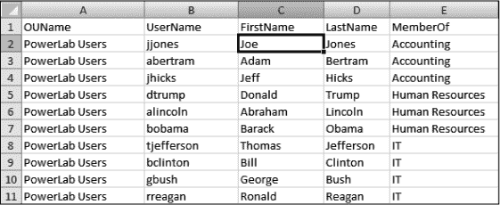
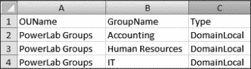

## 第十七章：部署 ACTIVE DIRECTORY


在本章中，你将运用你在第二部分中学到的内容，开始在虚拟机上部署服务。由于许多其他服务依赖于 Active Directory，你必须首先部署一个 Active Directory 林和域。AD 林和域将支持你在接下来的章节中进行身份验证和授权的需求。

假设你已经阅读并在前一章中配置了 LABDC 虚拟机，你将使用它来完全自动化部署 Active Directory 林，并用一些测试用户和组填充它。

### 前提条件

你将使用你在第十六章中创建的内容，因此我假设你已经设置了一个 LABDC 虚拟机，使用无人值守的 XML 构建并启动，运行 Windows Server 2016。如果是这样，你就可以开始了！如果不是，你仍然可以从本章中获取有关如何自动化 Active Directory 的示例，但请注意：你将无法完全跟上。

和往常一样，运行相关的前提条件 Pester 测试，以确保你满足本章的所有前提条件。

### 创建一个 Active Directory 林

好消息是，考虑到所有因素，使用 PowerShell 创建 AD 林其实非常简单。归根结底，你实际上只需要运行两个命令：`Install-WindowsFeature` 和 `Install-ADDSForest`。通过这两个命令，你可以构建一个林，创建一个域，并将 Windows 服务器配置为域控制器。

由于你将在实验环境中使用这个林，你还将创建一些组织单位、用户和组。处于实验环境意味着你没有任何生产对象可以使用。无需费劲地尝试将生产 AD 对象与实验环境同步，你可以创建许多模拟生产环境的对象，以便你有一些对象可以操作。

### 构建林

创建一个新的 AD 林时，首先需要提升一个 *域控制器*，这是 Active Directory 中的最低公分母。为了拥有一个正常运行的 AD 环境，你必须至少有一个域控制器。

由于这是一个实验环境，你将使用单个域控制器。在实际环境中，你希望至少有两个域控制器以确保冗余。然而，由于你的实验环境中没有数据，并且能够迅速从头开始重新创建它，因此这里只使用一个。在进行任何操作之前，你需要在 LABDC 服务器上安装 `AD-Domain-Services` Windows 功能。安装 Windows 功能的命令是 `Install-WindowsFeature`：

```
PS> $cred = Import-CliXml -Path C:\PowerLab\VMCredential.xml 
PS> Invoke-Command -VMName 'LABDC' -Credential $cred -ScriptBlock 
{ Install-windowsfeature -Name AD-Domain-Services }
PSComputerName : LABDC RunspaceId : 33d41d5e-50f3-475e-a624-4cc407858715
Success : True RestartNeeded : No FeatureResult : {Active Directory Domain
Services, Remote Server Administration Tools, Active Directory module for
Windows PowerShell, AD DS and AD LDS Tools...} ExitCode : Success ```

```

After providing a credential to connect to the server, you use `Invoke-Command` to remotely run the `Install-WindowsFeature` commands on the remote server.

Once the feature is installed, you can create the forest by using the `Install-ADDSForest` command. This command is part of the `ActiveDirectory` PowerShell module, which was installed on LABDC as part of the feature installation.

The `Install-ADDSForest` command is the only command you need to create a forest. It takes a few parameters, which you’ll fill in using code but are usually filled in using a GUI. This forest will be called `powerlab.local`. Since the domain controller is Windows Server 2016, you’ll set the domain mode and forest mode both to `WinThreshold`. For a full breakdown of all the available `DomainMode` and `ForestMode` values, refer to the *Install-ADDSForest* Microsoft documentation page (*[`bit.ly/2rrgUi6`](http://bit.ly/2rrgUi6)*).

#### Saving Secure Strings to Disk

In Chapter 16, when you needed credentials, you saved `PSCredential` objects and reused them in your commands. This time around, you don’t need a `PSCredential` object. Instead, you need only a single encrypted string.

In this section, you’ll see that you need to pass a safe mode administrator password to a command. As with any piece of sensitive information, you want to use encryption. As you did in the preceding chapter, you’ll use `Export-CliXml` and `Import-CliXml` to save and retrieve PowerShell objects from the filesystem. Here, though, instead of calling `Get-Credential`, you’ll create a secure string by using `ConvertTo-SecureString` and then save that object to a file.

To save an encrypted password to a file, you pass the plaintext password to `ConvertTo-SecureString` and then export that secure string object to `Export-CliXml`, creating a file you can reference later:

```

PS> 'P@$$w0rd12' | ConvertTo-SecureString -Force -AsPlainText

| Export-Clixml -Path C:\PowerLab\SafeModeAdministratorPassword.xml

```

As you can see, after you have the safe mode administrator password saved to disk, you can read it with `Import-CliXml` and pass in all the other parameters that `Install-ADDSForest` needs to run. You do this with the following code:

```

PS> $safeModePw = Import-CliXml -Path C:\PowerLab\

SafeModeAdministratorPassword.xml

PS> $cred = Import-CliXml -Path C:\PowerLab\VMCredential.xml

PS> $forestParams = @{

>>> DomainName                    = 'powerlab.local' ❶

>>> DomainMode                    = 'WinThreshold' ❷

>>> ForestMode                    = 'WinThreshold'

>>> Confirm                       = $false ❸

>>> SafeModeAdministratorPassword = $safeModePw ❹

>>> WarningAction                 = 'Ignore ❺

>>>}

PS> Invoke-Command -VMName 'LABDC' -Credential $cred -ScriptBlock { $null =

Install-ADDSForest @using:forestParams }

```

Here, you’re creating a forest and domain called *powerlab.local* ❶ running at a Windows Server 2016 functional level (`WinThreshold`) ❷, bypassing all confirmations ❸, passing your safe mode administrator password ❹, and ignoring the irrelevant warning messages that typically come up ❺.

#### Automating Forest Creation

Now that you’ve done it manually, let’s build a function in your PowerLab module that will handle AD forest creation for you. Once you have a function, you’ll be able to use it across numerous environments.

In the PowerLab module included with this chapter’s resources, you’ll see a function called `New-PowerLabActiveDirectoryForest`, as shown in Listing 17-1.

```

function New-PowerLabActiveDirectoryForest {

    param(

        [Parameter(Mandatory)]

        [pscredential]$Credential,

        [Parameter(Mandatory)]

        [string]$SafeModePassword,

        [Parameter()]

        [string]$VMName = 'LABDC',

        [Parameter()]

        [string]$DomainName = 'powerlab.local',

        [Parameter()]

        [string]$DomainMode = 'WinThreshold',

        [Parameter()]

        [string]$ForestMode = 'WinThreshold'

    )

    Invoke-Command -VMName $VMName -Credential $Credential -ScriptBlock {

        Install-windowsfeature -Name AD-Domain-Services

        $forestParams = @{

            DomainName                    = $using:DomainName

            DomainMode                    = $using:DomainMode

            ForestMode                    = $using:ForestMode

            Confirm                       = $false

            SafeModeAdministratorPassword = (ConvertTo-SecureString

                                            -AsPlainText -String $using:

                                            SafeModePassword -Force)

            WarningAction                 = 'Ignore'

        }

        $null = Install-ADDSForest @forestParams

    }

}

```

*Listing 17-1: The New-PowerLabActiveDirectoryForest function*

As in the preceding chapter, you simply define several parameters you’ll use to pass to the `ActiveDirectory` module’s `Install-ADDSForest` command. Notice that you define two `Mandatory` parameters for the credentials and password. As its name suggests, these are parameters the user needs to pass in (because the other parameters have default values, the user does not necessarily need to pass them in). You’ll use this function by reading in your saved administrator password and credential, and then passing the two into the function:

```

PS> $safeModePw = Import-CliXml -Path C:\PowerLab\SafeModeAdministratorPassword.xml

PS> $cred = Import-CliXml -Path C:\PowerLab\VMCredential.xml

PS> New-PowerLabActiveDirectoryForest -Credential $cred -SafeModePassword $safeModePw

```

After running this code, you’ll have a fully working Active Domain forest! Well, you should, anyway—let’s figure out a way to confirm that the forest is up and running. A good test is to query all the default user accounts in the domain. To do so, however, you need to create another `PSCredential` object stored on disk; because LABDC is a domain controller now, you need a domain user account (not a local user account). You’ll create and save a credential with the username of `powerlab.local\administrator` and a password of `P@$$w0rd12` to the *C:\PowerLab\DomainCredential.xml* file. Remember that you need to do this only once. Then, you can use the new domain credential to connect to LABDC:

```

PS> Get-Credential | Export-CliXml -Path C:\PowerLab\DomainCredential.xml

```

Once the domain credential is created, you’ll create another function in your PowerLab module called `Test-PowerLabActiveDirectoryForest`. Right now, this function just gathers all the users in a domain, but because you have this functionality wrapped in a function, you can customize this test to your liking:

```

function Test-PowerLabActiveDirectoryForest {

    param(

        [Parameter(Mandatory)]

        [pscredential]$Credential,

        [Parameter()]

        [string]$VMName = 'LABDC'

    )

    Invoke-Command -Credential $Credential -ScriptBlock {Get-AdUser -Filter * }

}

```

Try executing the `Test-PowerLabActiveDirectoryForest` function by using the domain credential and a `VMName` of `LABDC`. If you’re shown a few user accounts, congrats! You’re done! You’ve now successfully set up a domain controller and stored credentials for connecting to VMs in a workgroup (and any future domain-joined VMs).

#### Populating the Domain

In the preceding section, you set up a domain controller in your PowerLab. Now let’s create some test objects. Since this is a test lab, you want to create various objects (OUs, users, groups, and so on) so that you cover all your bases. You could run the required command to create each individual object, but because you have so many objects to create, that wouldn’t be practical. It’ll be a much better use of your time to define everything in one file, read in each object, and create them all in one go.

##### Handling Your Object Spreadsheet

Here, you’ll use an Excel spreadsheet as your input file to define everything you need as input. This Excel spreadsheet is available via the chapter’s downloadable resources. When you open it, you’ll see it has two worksheets: Users (Figure 17-1) and Groups (Figure 17-2).



*Figure 17-1: The Users spreadsheet*



*Figure 17-2: The Groups spreadsheet*

Each row of these worksheets corresponds to a user or group that needs to be created, containing information you’ll read into PowerShell. As you saw in Chapter 10, native PowerShell cannot handle Excel spreadsheets without significant work. With the help of a popular community module, however, you can make this much easier. Using the `ImportExcel` module, you can read Excel spreadsheets just as easily as you can natively read CSV files. To get `ImportExcel`, you can download it from the PowerShell Gallery by using Install-Module -Name ImportExcel. After a few security prompts, you should have the module downloaded and ready to use.

Now let’s use the `Import-Excel` command to parse in the rows from the worksheet:

```

PS> Import-Excel -Path 'C:\Program Files\WindowsPowerShell\Modules\PowerLab\

ActiveDirectoryObjects.xlsx' -WorksheetName Users | Format-Table -AutoSize

OUName         UserName   FirstName LastName  MemberOf

------         --------   --------- --------  --------

PowerLab 用户 jjones     Joe       Jones     会计

PowerLab 用户 abertram   Adam      Bertram   会计

PowerLab 用户 jhicks     Jeff      Hicks     会计

PowerLab 用户 dtrump     Donald    Trump     人力资源

PowerLab 用户 alincoln   Abraham   Lincoln   人力资源

PowerLab 用户 bobama     Barack    Obama     人力资源

PowerLab 用户 tjefferson Thomas    Jefferson IT

PowerLab 用户 bclinton   Bill      Clinton   IT

PowerLab 用户 gbush      George    Bush      IT

PowerLab 用户 rreagan    Ronald    Reagan    IT

PS> Import-Excel -Path 'C:\Program Files\WindowsPowerShell\Modules\PowerLab\

ActiveDirectoryObjects.xlsx' -WorksheetName Groups | Format-Table -AutoSize

OUName          GroupName       Type

------          ---------       ----

PowerLab 组 会计      DomainLocal

PowerLab 组 人力资源 DomainLocal

PowerLab 组 IT              DomainLocal

```

Using the `Path` and `WorksheetName` parameters, you can easily pull out the data you need. Notice that here, you’re using the `Format-Table` command. This is a useful command that forces PowerShell to display the output in a table format. The `AutoSize` parameter tells PowerShell to try to squeeze each row into one line in the console.

##### Creating a Plan

You now have a way to read the data from the Excel spreadsheet. The next step is figuring out what to do with it. You’ll build a function in your PowerLab module that reads each row and performs the action it requires. All code covered here is available via the `New-PowerLabActiveDirectoryTestObject` function in the associated PowerLab module.

This function is a little more complicated than our previous scripts, so let’s break it down in an informal way—this way, you have something to refer back to. This step may not sound important, but as you make bigger functions, you’ll find that planning them out at the start will save you a lot of work in the long run. In this function, you need to do the following:

1.  Read both worksheets in an Excel spreadsheet and retrieve all user and group rows.

2.  Read each row in both worksheets and first confirm whether the OU that the user or group is supposed to be a part of exists.

3.  If the OU does not exist, create the OU.

4.  If the user/group does not exist, create the user or group.

5.  For users only: add the user as a member of the specified group.

Now that you have this informal outline, let’s get down to coding.

##### Creating the AD Objects

For the first pass through, you want to keep it simple: let’s focus on handling a single object. No need to complicate things now by worrying about all of them. You installed the `AD-Domain-Services` Windows feature on LABDC earlier, so now you have the `ActiveDirectory` module installed. This module provides a large set of useful commands (as you saw in Chapter 11). Recall that many of the commands follow the same naming convention of `Get/Set/New-AD`.

Let’s open a blank *.ps1* script and get to work. Start by writing out all the commands you need (Listing 17-2) based on the previous outline:

```

Get-ADOrganizationalUnit -Filter "Name -eq 'OUName'" ❶

New-ADOrganizationalUnit -Name OUName ❷

Get-ADGroup -Filter "Name -eq 'GroupName'" ❸

New-ADGroup -Name $group.GroupName -GroupScope GroupScope -Path "OU=$group.OUName,DC=powerlab,DC=local" ❹

Get-ADUser -Filter "Name -eq 'UserName'" ❺

New-ADUser -Name $user.UserName -Path "OU=$($user.OUName),DC=powerlab,DC=local" ❻

UserName -in (Get-ADGroupMember -Identity GroupName).Name ❼

Add-ADGroupMember -Identity GroupName -Members UserName ❽

```

*Listing 17-2: Figuring out code to check for and create new users and groups*

Recall from our plan that you first need to check whether an OU exists ❶, and then create one if it doesn’t ❷. You do the same thing with each group: check whether it exists ❸ and create one if it doesn’t ❹. And do the same thing for each user: check ❺ and create ❻. Lastly, for your users, check whether they are a member of the group specified in the spreadsheet ❼, and add them to it if they are not ❽.

All you’re missing here is the conditional structure, which you add in Listing 17-3.

```

如果 (-not (Get-ADOrganizationalUnit -Filter "Name -eq 'OUName'")) {

    New-ADOrganizationalUnit -Name OUName

}

如果 (-not (Get-ADGroup -Filter "Name -eq 'GroupName'")) {

    New-ADGroup -Name GroupName -GroupScope GroupScope -Path "OU=OUName,DC=powerlab,DC=local"

}

如果 (-not (Get-ADUser -Filter "Name -eq 'UserName'")) {

    New-ADUser -Name $user.UserName -Path "OU=OUName,DC=powerlab,DC=local"

}

如果 (UserName -notin (Get-AdGroupMember -Identity GroupName).Name) {

    Add-ADGroupMember -Identity GroupName -Members UserName

}

```

*Listing 17-3: Creating users and groups only if they don’t already exist*

Now that you have the code to do what you want for an individual user or group, you need to figure out how to do it for all of them. First, though, you need to read in the worksheets. You’ve already seen which commands to use; now you need to store all those rows in variables. This isn’t technically required, but it keeps your code more explicit and self-documenting. You’ll use `foreach` loops to read all users and groups, as shown in Listing 17-4.

```

$users = Import-Excel -Path 'C:\Program Files\WindowsPowerShell\Modules\

PowerLab\ActiveDirectoryObjects.xlsx' -WorksheetName Users

$groups = Import-Excel -Path 'C:\Program Files\WindowsPowerShell\Modules\

PowerLab\ActiveDirectoryObjects.xlsx' -WorksheetName Groups

遍历 ($group 在 $groups 中) {

}

遍历 ($user 在 $users 中) {

}

```

*Listing 17-4: Building the code structure to iterate over each Excel worksheet row*

Now that you have a structure to loop through every row, let’s use our individual code to handle the rows, as shown in Listing 17-5.

```

$users = Import-Excel -Path 'C:\Program Files\WindowsPowerShell\Modules\PowerLab\

ActiveDirectoryObjects.xlsx' -WorksheetName Users

$groups = Import-Excel -Path 'C:\Program Files\WindowsPowerShell\Modules\PowerLab\

ActiveDirectoryObjects.xlsx' -WorksheetName Groups

遍历 ($group 在 $groups 中) {

    如果 (-not (Get-ADOrganizationalUnit -Filter "Name -eq '$($group.OUName)'")) {

        New-ADOrganizationalUnit -Name $group.OUName

    }

    如果 (-not (Get-ADGroup -Filter "Name -eq '$($group.GroupName)'")) {

        New-ADGroup -Name $group.GroupName -GroupScope $group.Type

        -Path "OU=$($group.OUName),DC=powerlab,DC=local"

    }

}

遍历 ($user 在 $users 中) {

    如果 (-not (Get-ADOrganizationalUnit -Filter "Name -eq '$($user.OUName)'")) {

        New-ADOrganizationalUnit -Name $user.OUName

    }

    如果 (-not (Get-ADUser -Filter "Name -eq '$($user.UserName)'")) {

        New-ADUser -Name $user.UserName -Path "OU=$($user.OUName),DC=powerlab,DC=local"

    }

    如果 ($user.UserName -notin (Get-ADGroupMember -Identity $user.MemberOf).Name) {

        Add-ADGroupMember -Identity $user.MemberOf -Members $user.UserName

    }

}

```

*Listing 17-5: Performing tasks on all users and groups*

You’re almost done! The script is all ready to go, but now you need to run it on the LABDC server. Since you’re not running this code directly on the LABDC VM itself yet, you have to wrap all this up into a scriptblock and have `Invoke-Command` run it remotely on LABDC for you. Since you want to create and populate the forest in one go, you’ll take all your “scratch” code and move it into your `New-PowerLabActiveDirectoryTestObject` function. You can download a copy of this fully created function in the chapter’s resources.

### Building and Running Pester Tests

You have all the code you need to create a new AD forest and populate it. Now you’ll build some Pester tests to confirm that everything is working as planned. You have quite a bit to test, so the Pester tests are going to be more complicated than before. Just as you did before creating the *New-PowerLabActiveDirectoryTestObject.ps1* script, first create a Pester test script, and then start thinking of test cases. If you need a refresher about Pester, check out Chapter 9. I’ve also included all Pester tests for this chapter in the book’s resources.

What do you need to test? In this chapter, you did the following:

*   Created a new AD forest

*   Created a new AD domain

*   Created AD users

*   Created AD groups

*   Created AD organizational units

After determining that they exist, you need to make sure that your objects have the correct attributes (the attributes you passed in as parameters to the commands that created them). These are the attributes you’re looking for:

**Table 17-1:** AD Attributes

| **Object** | **Attributes** |
| AD forest | `DomainName`, `DomainMode`, `ForestMode`, safe mode administrator password |
| AD user | OU path, name, group member |
| AD group | OU path, name |
| AD organizational unit | Name |

With that, you have a good back-of-the-napkin plan for what you’re looking for with your Pester tests. If you take a look at the *Creating an Active Directory Forest.Tests.ps1* script, you’ll see that I’ve chosen to break down each of these entities into contexts and test all the associated attributes inside as individual tests.

To give you an idea of how these tests are created, Listing 17-6 has a snippet of the test code.

```

上下文 '域' {

❶ $domain = Invoke-Command -Session $session -ScriptBlock { Get-AdDomain }

    $forest = Invoke-Command -Session $session -ScriptBlock { Get-AdForest }

❷ 它 "域模式应为 Windows2016Domain" {

        $domain.DomainMode | 应该是 'Windows2016Domain'

    }

    它 "林模式应为 WinThreshold" {

        $forest.ForestMode | 应该是 'Windows2016Forest'

    }

    它 "域名应为 powerlab.local" {

        $domain.Name | 应该是 'powerlab'

    }

}

```

*Listing 17-6: Some of the Pester test code*

For this context, you want to make sure that the AD domain and forest are created properly. So you first create the domain and forest ❶; then you verify that the domain and forest have the attributes you expect ❷.

Running the whole test should give you something like this:

```

描述 Active Directory 林

上下文 域

    [+] 域模式应为 Windows2016Domain 933ms

    [+] 林模式应为 WinThreshold 25ms

    [+] 域名应该是 powerlab.local 41ms

上下文 组织单位

    [+] OU[PowerLab Users]应该存在 85ms

    [+] OU[PowerLab Groups]应该存在 37ms

上下文 用户

    [+] 用户[jjones]应该存在 74ms

    [+] 用户[jjones]应该在[PowerLab Users] OU 中 35ms

    [+] 用户[jjones]应该在[Accounting]组中 121ms

    [+] 用户[abertram]应该存在 39ms

    [+] 用户[abertram]应该在[PowerLab Users] OU 中 30ms

    [+] 用户[abertram]应该在[Accounting]组中 80ms

    [+] 用户[jhicks]应该存在 39ms

    [+] 用户[jhicks]应该在[PowerLab Users] OU 中 32ms

    [+] 用户[jhicks]应该在[Accounting]组中 81ms

    [+] 用户[dtrump]应该存在 45ms

    [+] 用户[dtrump]应该在[PowerLab Users] OU 中 40ms

    [+] 用户[dtrump]应该在[Human Resources]组中 84ms

    [+] 用户[alincoln]应该存在 41ms

    [+] 用户[alincoln]应该在[PowerLab Users] OU 中 40ms

    [+] 用户[alincoln]应该在[Human Resources]组中 125ms

    [+] 用户[bobama]应该存在 44ms

    [+] 用户[bobama]应该在[PowerLab Users] OU 中 27ms

    [+] 用户[bobama]应该在[Human Resources]组中 92ms

[+] 用户[tjefferson]应该存在 58ms

    [+] 用户[tjefferson]应该在[PowerLab Users] OU 中 33ms

    [+] 用户[tjefferson]应该在[IT]组中 73ms

    [+] 用户[bclinton]应该存在 47ms

    [+] 用户[bclinton]应该在[PowerLab Users] OU 中 29ms

    [+] 用户[bclinton]应该在[IT]组中 84ms

    [+] 用户[gbush]应该存在 50ms

    [+] 用户[gbush]应该在[PowerLab Users] OU 中 33ms

    [+] 用户[gbush]应该在[IT]组中 78ms

    [+] 用户[rreagan]应该存在 56ms

    [+] 用户[rreagan]应该在[PowerLab Users] OU 中 30ms

    [+] 用户[rreagan]应该在[IT]组中 78ms

上下文 组

    [+] 组[Accounting]应该存在 71ms

    [+] 组[Accounting]应该在[PowerLab Groups] OU 中 42ms

    [+] 组[Human Resources]应该存在 48ms

    [+] 组[Human Resources]应该在[PowerLab Groups] OU 中 29ms

    [+] 组[IT]应该存在 51ms

    [+] 组[IT]应该在[PowerLab Groups] OU 中 31ms

```

### 总结

在本章中，你在创建 PowerLab 的过程中迈出了下一步，添加了一个 Active Directory 森林，并在其中填充了多个对象。你既进行了手动操作，也进行了自动操作，在这个过程中复习了一些你在前几章中学到的关于 Active Directory 的内容。最后，你深入了解了 Pester 测试，仔细研究了如何构建符合你需求的自定义测试。在下一章中，你将继续 PowerLab 项目，学习如何自动化安装和配置 SQL 服务器。
