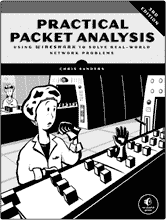
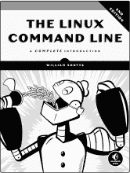
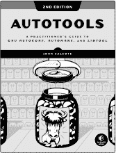
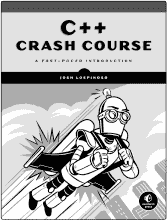

## 第二十一章：索引

### 符号

`+`（加法运算符），28–29

`@`（at 符号），27

`$`（美元符号），14

`#`（井号），50

`|`（管道符号），38

`..`（范围运算符），28

`*`（通配符字符），10

### A

关于主题，9–10

`AccountInactive` 参数，141

Active Directory (AD) 域，101–102，242–252

`ActiveDirectory` 模块

`Get` 命令，139–140

组，145–146

安装，138

对象，139–149

字符串格式化，147

同步进程，149–155

AD 林创建，242–245

临时命令，93

`Add()` 方法，30，32–33

`Add-Computer` 命令，256

`Add-Content` cmdlet，8–9

加法运算符（`+`），28–29

管理员角色，11，219

别名，4–5

所有用户模块，82

AllSigned 执行策略，42

亚马逊关系型数据库服务（Amazon RDS），188

亚马逊 Web 服务（AWS）

身份验证，174–178

AWS EC2 实例，178–183

弹性 Beanstalk（EB）应用程序，184–188

IAM 最佳实践指南，177

SQL Server 数据库，188–191

应用服务计划，167–168

`Append` 参数，125，128

应用池，280–281

`ArgumentList` 参数，95–96

ArrayLists，29–31

数组，26–29

断言，110–111

星号（`*`），10

@ 符号（`@`），27

属性，150–151，155

身份验证

亚马逊 Web 服务（AWS），174–178

Microsoft Azure，158–161

PowerShell 远程认证, 101–105

自动错误变量, 66

自动变量, 16–19

AWS EC2 实例, 178–183

`Az` 模块, 158

Azure SQL 数据库, 168–172

Azure 虚拟机, 161–167

Azure Web 应用, 167–168

### B

RAM 银行, 204

bash, 38

最佳实践

不要重复自己 (DRY), 54, 210

命名约定, 220

参数, 236

重构代码, 266–272

二进制模块, 79

布尔值与布尔类型, 12–20

`break` 关键字, 53

内置前缀, 220

### C

强制转换变量, 21, 72

证书存储, 281–282

`CimSession` 参数, 210–212

类, 23–24

云资源

亚马逊网络服务 (AWS), 174–191

Microsoft Azure, 158–172

`cls` 命令, 5

`cmd.exe` 命令, 5, 38

cmdlet

`Add-Content`, 8–9

`ConvertFrom-Json`, 132

`ForEach-Object`, 55–56

与函数对比, 70

`Get-Content`, 39

`Get-Help`, 8–9

`Get-Member`, 25

`Get-Module`, 80–81

`Invoke-RestMethod`, 135

`Invoke-WebRequest`, 134

`Measure-Object`, 199–201

概述, 6

`Search-ADAccount`, 141

`Test-Connection`, 49–50

代码重构, 266–272

COM 对象, 126

命令

临时命令, 93

`Add-Computer`, 256

`cls`, 5

`cmd.exe` 命令, 5, 38

`Connect-PSSession`, 99–100

`ConvertFrom-SecureString`, 160

核心命令, 9–10

`dir`, 5

`Disconnect-PSSession`, 99

DOS 命令, 4–5

`Enable-WsManCredSSP`, 103

`Enter-PSSession`, 98

`Export-Csv`, 122

`Export-Excel`, 126

`Find-Module`, 86–87

`Get` 命令, 139–140

`Get-Alias`, 5

`Get-Commands`, 6–7

`Get-PSSession`, 99

`Get-Service`, 37–41

`Get-Variable`, 16

`Get-Vm`, 223

`help`, 8

`Import-Csv`, 118–121

`Import-Excel`, 127–128

`Invoke-Command`, 93–94, 98, 100

`Invoke-Pester`, 111

`New-Object`, 33–34

`New-PSSession`, 97

概览, 4–8

`Remove-PSSession`, 101

`Resolve-DnsName`, 124

`Select-Object`, 24, 128

`Set-Variable`, 15–16

`Start-Service`, 38–40

`Test-Connection`, 123–124

`Where-Object`, 208

注释, 50

常用参数, 63

社区脚本, 234

比较运算符, 49–50

`Compress` 参数, 133

`ComputerName` 参数, 41

条件逻辑, 235

条件语句, 49–54

`Connect-AzAccount`, 158–160

`Connect-PSSession` 命令, 99–100

控制台, 4

`–contains` 运算符, 49

`ContainsKey()` 方法, 33

`context` 块, 109

控制流, 48

转换脚本, 233

`ConvertFrom-Json` cmdlet, 132

`ConvertFrom-SecureString` 命令, 160

核心命令, 9–10

凭证, 237–238, 243–244

CredSSP, 101–105

CSV 文件, 118–126

大括号, 70

当前用户模块, 82

自定义对象, 33–34

### D

数据结构, 26–33

数据类型, 19–23

`DelegateComputer` 参数, 103–104

分隔符, 118

`describe` 块, 109

`Description` 参数, 145

字典, 31

`dir` 命令, 5

`Disconnect-PSSession` 命令, 99

文档, 8–10

美元符号 (`$`), 14

域控制器, 242

不重复自己 (DRY), 54, 210

DOS 命令, 4–5

点表示法, 24

点源, 233

双重跳跃问题, 102–105

`Double` 类型, 21

双引号与单引号, 22–23

`do/while` 和 `do/until` 循环, 58–59

动态模块, 79

### E

EC2 实例, 178–183

Elastic Beanstalk (EB) 应用程序, 184–188

`else` 语句, 51

`elseif` 语句, 51–52

`Enabled` 条件, 142–143

`Enable-WsManCredSSP` 命令, 103

加密凭证, 237–238, 243–244

`Enter-PSSession` 命令, 98

`–eq` 运算符, 49

错误消息, 6, 19

`$Error` 变量, 66

`ErrorAction` 参数, 63–64, 223

`$ErrorActionPreference` 变量, 64

错误, 62–63

Excel 电子表格, 126–131, 246–247

异常, 62–63

执行策略, 42–43

退出代码, 17–18

扩展, 23

`Export-Csv` 命令, 122

`Export-Excel` 命令, 126

外部脚本, 42–46

### F

`FilePath` 参数, 94

`Filter` 参数, 139–140, 206

`Find-Module` 命令, 86–87

Finke, Doug, 126

防火墙规则, 170–171

`Float` 类型，21

浮点数据类型，21

`for` 循环，57

`foreach` 循环，54–56，202–203

`foreach()` 方法，56

`ForEach-Object` cmdlet，55–56

林创建，242–245

`FreeSpace`，202

完整会话，96–101

函数

添加参数，71–76

vs. cmdlets，70

辅助函数，262

命名约定，220

概述，6，70–71

管道能力，76–78

### G

Gallery，86，108，126

`Get` 命令，139

`Get-Alias` 命令，5

`Get-Command`，6–7

`Get-Content` cmdlet，39

`Get-Help` cmdlet，8–9

`Get-Member` cmdlet，25

`Get-Module` cmdlet，80–81

`Get-PSSession` 命令，99

`Get-Service` 命令，37–41

`Get-Variable` 命令，16

`Get-Vm` 命令，223

组，145–146

`GroupScope` 参数，145

`–gt` 操作符，49

### H

硬盘空间，202

哈希标记（`#`），50

哈希表，31–33，124

`help` 命令，8

帮助系统，10

辅助函数，81，262

Hyper-V，218–219

### I

IAM 服务，174–178

幂等性，222

`Identity` 参数，141

`if/then` 语句，50–51

IIS 网络服务器，275–283

`Import-Csv` 命令，118–121

`Import-Excel` 命令，127–128

`ImportExcel` 模块，126，246–247

基础设施测试，108

实例类选项，190

整数数据类型，20–21

集成脚本环境（ISE），44–45

交互式会话, 98–99

Internet 网关, 179–180

插值, 23

`Invoke-Command`, 93–94, 98, 100

`Invoke-Pester` 命令, 111

`Invoke-RestMethod` 命令, 135

`Invoke-WebRequest` 命令, 134

IP 地址, 163, 206–208

`IPEnabled` 属性, 206–208

ISE (集成脚本环境), 44–45

`it` 块, 110

迭代, 54

### J

JavaScript 对象表示法 (JSON) 数据, 131–136

### K

Kerberos, 101–102

键值对, 31

### L

LABDC 虚拟机

`AD-Domain-Services` 安装, 242–243

创建, 223–224

`$LASTEXITCODE` 变量, 17–18

`–le` 运算符, 49

`Length` 值, 199–201

换行符, 133

`ListAvailable` 参数, 81

本地会话, 96

本地变量, 95

本地冗余存储帐户, 164

循环, 54–59, 196

`–lt` 运算符, 49

### M

`Mandatory` 关键字, 73

`Mandatory` 参数, 245

`$MaximumHistoryCount` 变量, 14

`Measure-Object` 命令, 199–201

成员, 25

组成员, 145

`Memory`, 203–205

方法, 23, 25–26

Microsoft Active Directory (AD). *参见* `ActiveDirectory` 模块

Microsoft Azure

身份验证, 158–161

Azure SQL 数据库, 168–172

Azure 虚拟机, 161–167

Azure 网络应用, 167–168

`Microsoft.PowerShell.Management` 模块, 83

模块化代码, 265

模块容器, 88

模块清单, 84–85, 88, 219–220

模块

`Az` 模块, 158

组件, 84–85

创建，88–89

自定义模块，86–88

默认，80–83

下载，86–87

`Get`命令，139

`ImportExcel`模块，126

导入，82–83

安装，87

`PSADSync`模块，155

移除，83

卸载，88

### N

`Name`参数，7

命名约定，220

`–ne`操作符，49

网络信息，205–208

网络堆栈，162–163

`New-Object`命令，33–34

`New-PowerLabSqlServer`，266–269

`New-PSSession`命令，97

非终止错误，62–64

`–not`操作符，50

`NoTypeInformation`参数，122–123

`$null`变量，16–17

### O

对象

`ActiveDirectory`模块，139–149

COM 对象，126

自定义对象，33–34

`ForEach-Object` cmdlet，55–56

JavaScript 对象表示法（JSON），131–136

`Measure-Object` cmdlet，199–201

`New-Object`命令，33–34

概览，23–26

`PSCustomObject`类型，33–34

`Select-Object`命令，24，128

`Where-Object`命令，208

操作系统映像，164–166

操作系统信息，202–203

操作系统安装

加密凭证，237–238

操作系统部署，232–236

Pester 测试，239–240

PowerShell Direct，238–239

先决条件，231–232

SQL 服务器数据库，254–255

组织单位（OUs），148

操作系统部署，232–236

### P

`param`块，72

参数

`AccountInactive`，141

添加到函数，71–76

`Append`, 125, 128

`ArgumentList`, 95–96

属性, 72–74

绑定, 40–41

`CimSession`, 210–212

常见, 63

`Compress`, 133

`ComputerName`, 41

`DelegateComputer`, 103–104

`Description`, 145

`ErrorAction`, 63–64, 223

`FilePath`, 94

`Filter`, 139–140, 206

`GroupScope`, 145

`Identity`, 141

`ListAvailable`, 81

`Mandatory`, 245

`Name`, 7

`NoTypeInformation`, 122–123

概述, 6–7

参数集, 269–272

位置参数, 10

`Role`, 103

`ServerType`, 269

使用, 236

`ValidateSet`, 269

`WorksheetName`, 127

Pester 测试

Active Directory (AD) 域, 250–252

操作系统安装, 239–240

概述, 108–111

`PowerLab` 模块, 216, 228–229

SQL 服务器部署, 263

*ping.exe*, 17–18

管道操作符 (`|`), 38

管道, 38–41, 76–78

数据透视表, 130

位置参数, 10

*postcodes.io*, 134

PowerLab

安装, 215–216

概述, 213–215

`PowerLab` 模块

创建, 219–221

Pester 测试, 216, 228–229

前提条件, 218–219

PowerShell Direct, 238–239

PowerShell Gallery, 86, 108, 126

PowerShell 集成脚本环境 (ISE), 44–45

`PowerShellGet` 模块, 86

偏好变量, 18–19

前缀, 220

私有函数, 81

私钥, 282

`process` 块, 77–78

提示符, 4

属性, 23–24

`PSADSync` 模块, 155

`PSCustomObject` 类型, 33–34

*.psm1* 文件扩展名, 84

`$PSModulePath` 环境变量, 82

公共 IP 地址, 163

### R

RAM, 204

范围操作符 (`..`), 28

RBAC (基于角色的访问控制), 175

领域, 101

重构代码, 266–272

远程桌面协议 (RDP) 应用程序, 99

远程服务器管理工具软件包, 138

RemoteSigned 执行策略, 43

`Remove()` 方法, 25–26, 31

`Remove-PSSession` 命令, 101

`Resolve-DnsName` 命令, 124

资源组, 161

REST API, 131, 134–136

受限执行策略, 42

返回代码, 17–18

`Role` 参数, 103

基于角色的访问控制 (RBAC), 175

路由表, 180

路由, 180

运行空间, 95

### S

架构, 150

脚本签名, 44

脚本块, 56, 92–96

脚本

最佳实践, 210

清理与优化, 210–212

输入, 194–195

循环, 196

输出, 194, 196–198

概述, 42–46

远程文件, 199–201

服务器名称, 194–195

Windows 管理工具 (WMI), 201–208

`Search-ADAccount` cmdlet, 141

安全字符串, 160, 237, 243–244

`Select-Object` 命令, 24, 128

Server 2012 R2, 94

服务器名称, 194

`ServerType` 参数, 269

服务主体, 158–160

会话, 96–101

`Set-Variable` 命令，15–16

`SHIFT-TAB`，5

`should` 断言，110

签名数据类型，20

`SilentlyContinue` 值，223

单引号与双引号，22–23

扩展参数，211

SQL 服务器数据库

亚马逊网络服务 (AWS)，188–191

部署，253–263

Microsoft Azure，168–172

方括号 (`[]`)，27

SSL 配置，281–284

`Start-Service` 命令，38–40

停止条件，54

存储帐户，164

严格模式，15

字符串

`ConvertFrom-SecureString` 命令，160

概述，21–23

安全字符串，237，243–244

字符串格式化，147

结构化数据

CSV 文件，118–126

Excel 电子表格，126–131

JSON 数据，131–136

子网，162，180–181

`switch` 语句，52–54，235–236

同步进程，149–155

系统模块，81

### T

`TAB` 补全，5

终止错误，62，64–66

`Test-Connection` cmdlet，49–50

`Test-Connection` 命令，123–124

测试。*参见* Pester 测试

文本编辑器，44–45

拇指印，282

信任关系策略文档，176

`try/catch/finally` 结构，64–66

### U

无人值守的答案文件，232，255

单元测试，108

不受限制的执行策略，43

无符号数据类型，20

可更新的帮助，10

用户定义变量，14–16

`$using` 语句，96

### V

`ValidateSet` 参数，269

变量

`$Error`，66

`$ErrorActionPreference`，64

`$LASTEXITCODE`，17–18

`$MaximumHistoryCount`，14

`$null`, 16–17

`$PSModulePath`, 82

`$using` 语句, 96

扩展, 23

插值, 23

概述, 13–19, 235

值的, 13–15

虚拟环境配置

虚拟硬盘（VHDXs）, 225–228

虚拟机（VMs）, 223–225

虚拟交换机, 220–223

虚拟硬盘（VHDXs）, 225–228

虚拟机（VMs）, 223–225, 254

虚拟网络适配器（vNICs）, 163

虚拟网络, 162

虚拟专用云（VPCs）, 178–179

虚拟交换机, 220–223

VMware, 86–87

### W

Web 服务器, 275–283

`WebAdministration` 模块, 277–281

网站, 278–279

`Where-Object` 命令, 208

`while` 循环, 58

通配符字符（`*`）, 10

Windows Management Instrumentation (WMI), 201–208

Windows 查询语言（WQL）, 206–207

Windows 远程管理（WinRM）服务, 92

Windows Server 2012 R2, 94

Windows Server 2016 ISO, 231

`WorksheetName` 参数, 127

*PowerShell for Sysadmins* 使用了 New Baskerville、Futura、Dogma 和 TheSansMono Condensed 字体。

**资源**

访问 *[`nostarch.com/powershellsysadmins/`](https://nostarch.com/powershellsysadmins/)* 获取资源、勘误和更多信息。

*更多实用的书籍来自*  **NO STARCH PRESS**

**PENTESTING AZURE APPLICATIONS**

**测试和保护部署的权威指南**

*作者* MATT BURROUGH

2018 年 7 月，216 页，$39.95

ISBN 978-1-59327-863-2

**实用数据包分析，第三版**

**使用 Wireshark 解决现实世界的网络问题**

*作者* CHRIS SANDERS

2017 年 4 月，368 页，$49.95

ISBN 978-1-59327-802-1

**绝对 FreeBSD，第三版**

**The Complete Guide to FreeBSD**

*作者* MICHAEL W. LUCAS

2018 年 10 月，704 页，$59.95

ISBN 978-1-59327-892-2

**Linux 命令行，第二版**

**完全介绍**

*作者* WILLIAM SHOTTS

2019 年 3 月，504 页，$39.95

ISBN 978-1-59327-952-3

**AUTOTOOLS，第 2 版**

**GNU Autoconf、Automake 和 Libtool 实践指南**

*作者：* 约翰·卡尔科特（JOHN CALCOTE）

2019 年 11 月，584 页，$49.95

ISBN 978-1-59327-972-1

**C++速成课程**

**快速入门**

*作者：* 乔什·洛斯皮诺索（JOSH LOSPINOSO）

2019 年 9 月，792 页，$59.95

ISBN 978-1-59327-888-5

**电话：**

1.800.420.7240 或

1.415.863.9900

**电子邮件：**

SALES@NOSTARCH.COM

**网站：**

[WWW.NOSTARCH.COM](http://WWW.NOSTARCH.COM)

## **节省时间。

自动化。**

PowerShell^®既是一种脚本语言，也是一种管理外壳，允许你控制和自动化几乎所有 IT 方面的内容。在*PowerShell for Sysadmins*中，五次微软^® MVP 获奖者亚当“自动化者”伯特拉姆将向你展示如何使用 PowerShell 管理和自动化桌面和服务器环境，让你能够提前去享受午餐。

你将学到如何：

+   结合命令、控制流程、处理错误、编写脚本、远程运行脚本，并使用 PowerShell 测试框架 Pester 测试脚本。

+   解析结构化数据（如 XML 和 JSON），处理常见领域（如 Active Directory、Azure 和 Amazon Web Services），并创建实际的服务器清单脚本

+   设计并构建一个 PowerShell 模块，展示 PowerShell 不仅仅是关于临时脚本的工具

+   使用 PowerShell 创建一个完全自动化的 Windows 部署，无需人工干预

+   从一个 Hyper-V 主机和几个 ISO 文件开始，构建一个完整的 Active Directory 森林

+   只需几行代码，就能创建无数的 Web 和 SQL 服务器！

全书贯穿的实际案例有助于弥合理论与实际系统之间的差距，作者的趣事使内容更加生动有趣。

停止依赖昂贵的软件和花哨的顾问。学习如何使用*PowerShell for Sysadmins*管理你自己的环境，让每个人都开心。

### 关于作者

亚当·伯特拉姆（Adam Bertram）是一位拥有 20 年 IT 经验的资深专业人士，同时也是一位经验丰富的在线商业专家。他是企业家、IT 影响者、微软 MVP、博客作者、培训师、作家和多家技术公司的内容营销作者。亚当还是著名 IT 职业发展平台 TechSnips 的创始人。

**涵盖 Windows Powershell v5.1**

*最棒的极客娱乐™*

[www.nostarch.com](http://www.nostarch.com)
