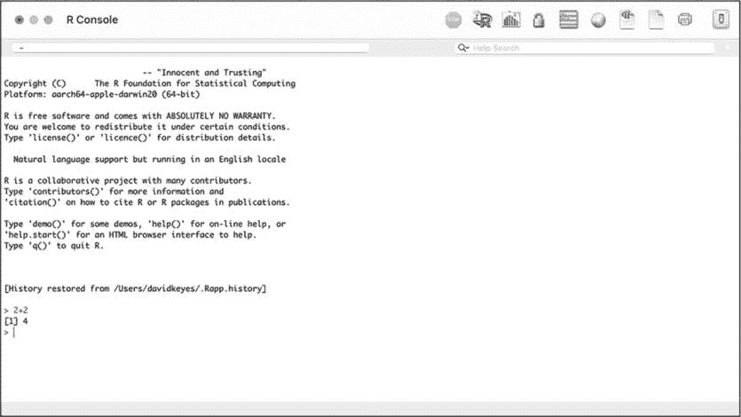
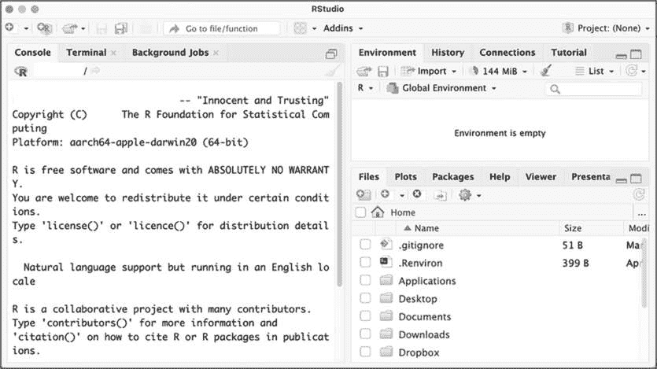
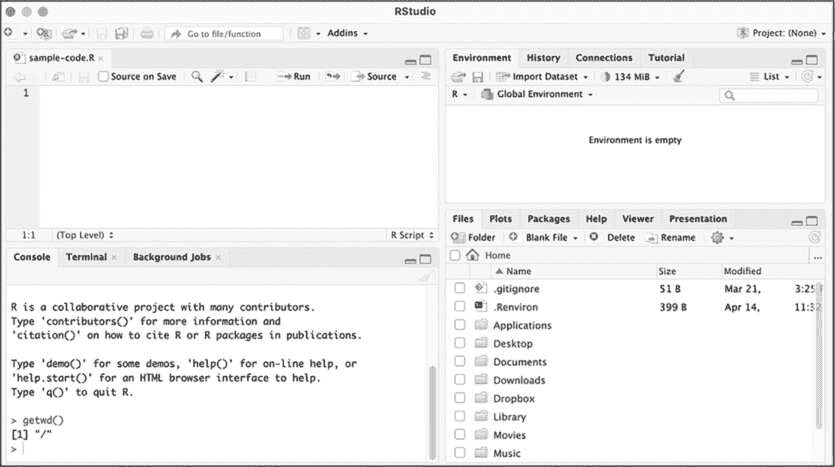
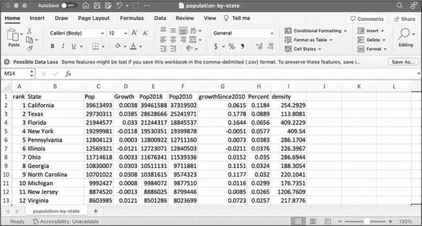
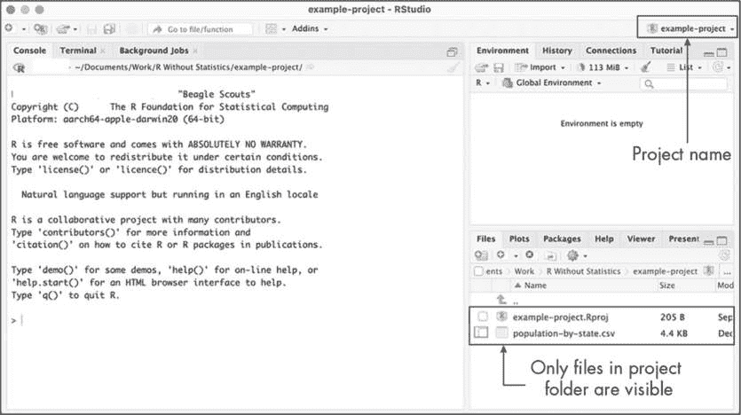
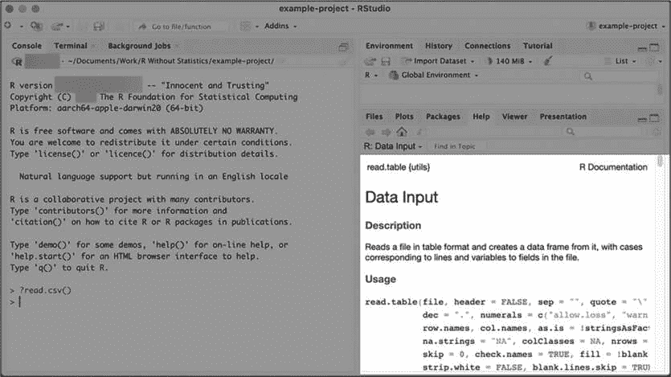

## 第一章：1 R 编程速成课程


R 因学习难度大而声名显赫，尤其是对于那些没有编程经验的人。本章旨在帮助从未使用过 R 的人。你将通过 RStudio 设置一个 R 编程环境，并学习如何使用函数、对象、包和项目来处理数据。你还将了解 tidyverse 包，它包含了本书中使用的核心数据分析和操作功能。

本章不会提供 R 编程的完整介绍；它将集中介绍你跟随本书其余部分所需的知识。如果你有 R 的先前经验，可以跳到 第二章。

### 设置

要有效使用 R，你需要两个软件。第一个是 R 本身，它提供了支撑语言运作的计算工具。第二个是像 RStudio 这样的 *集成开发环境（IDE）*。这个编码平台简化了与 R 的工作。理解 R 和 RStudio 之间关系的最佳方式是参考 Chester Ismay 和 Albert Kim 在其著作 *《通过数据科学进行统计推断：R 和 Tidyverse 的现代探究》* 中的类比：R 就像是驱动数据的引擎，而 RStudio 就像是提供用户友好界面的仪表盘。

#### 安装 R 和 RStudio

要下载 R，请访问 *[`cloud.r-project.org`](https://cloud.r-project.org)* 并选择与你操作系统相对应的链接。安装完成后，打开该文件。这将打开一个界面，就像 图 1-1 中所示的那样，允许你在操作系统的命令行中使用 R。例如，输入 2 + 2，你应该会看到 4。



图 1-1：R 控制台

一些勇敢的灵魂仅使用命令行与 R 工作，但大多数人选择使用 RStudio，它提供了一种查看文件、代码输出等的方式。你可以在 *[`posit.co/download/rstudio-desktop/`](https://posit.co/download/rstudio-desktop/)* 下载 RStudio。像安装其他应用一样安装 RStudio 并打开它。

#### 探索 RStudio 界面

当你第一次打开 RStudio 时，你应该会看到 图 1-2 中显示的三个窗格。



图 1-2：RStudio 编辑器

左侧窗格应该看起来很熟悉。它类似于你在命令行中使用 R 时看到的屏幕。这被称为 *控制台*。你将使用它来输入代码并查看结果。这个窗格有几个标签页，例如 Terminal 和 Background Jobs，用于更高级的功能。现在，你将只使用默认的标签页。

在右下角，*文件面板*显示了你计算机上的所有文件。你可以点击任何一个文件，在 RStudio 中打开它。最后，在右上角是*环境面板*，它显示了在 RStudio 中工作时可用的对象。有关对象的讨论，请参见“将数据保存为对象”部分，见第 11 页。

还有一个你在 RStudio 中工作时通常会使用的面板，但要查看它，你首先需要创建一个 R 脚本文件。

### R 脚本文件

如果你所有的代码都写在控制台中，你将没有任何记录。假设你今天坐下来导入数据、进行分析，然后制作一些图表。如果你在控制台中运行这些操作，明天你必须从头开始重新编写这些代码。但如果你将代码写入文件中，你就可以多次运行它。

*R 脚本文件*，使用*.R*扩展名，可以保存你的代码，以便以后运行。要创建一个 R 脚本文件，进入**文件****新建文件****R 脚本**，然后*脚本文件面板*应该出现在 RStudio 的左上角，如图 1-3 所示。将此文件保存到你的*文档*文件夹中，命名为*sample-code.R*。



图 1-3：脚本文件面板（左上角）

现在，你可以在新的面板中输入 R 代码，将其添加到你的脚本文件中。例如，尝试在脚本文件面板中输入 2 + 2，执行一个简单的加法运算。

要运行脚本文件，点击**运行**或使用快捷键：在 macOS 上是 COMMAND-ENTER，在 Windows 上是 CTRL-ENTER。结果（在此案例中是 4）应该会显示在控制台面板中。

现在，你已经有了一个可用的编程环境。接下来，你将使用它编写一些简单的 R 代码。

### 基本的 R 语法

如果你正在学习 R，可能希望执行比 2 + 2 更复杂的操作，但理解基础知识将为你后续更严肃的数据分析任务做好准备。让我们先了解一些基础内容。

#### 算术运算符

除了+，R 还支持常见的算术运算符：- 用于减法，* 用于乘法，/ 用于除法。尝试在控制台中输入以下内容：

```
> **2 - 1**
1
> **3 * 3**
9
> **16 / 4**
4 
```

如你所见，R 会返回你输入的每个计算结果。你不必像这里显示的那样在运算符周围加上空格，但这样做会使你的代码更具可读性。

你还可以使用括号一次执行多个运算并查看其结果。括号指定了 R 评估表达式的顺序。试试运行以下代码：

```
> **2 * (2 + 1)**
6 
```

这段代码首先计算括号内的表达式 2 + 1，然后将结果乘以 2，得到 6。

R 还具有更高级的算术运算符，如**用于计算指数：

```
> **2 ** 3**
8 
```

这相当于 2³，结果是 8。

要获取除法操作的余数，你可以使用%%运算符：

```
> **10 %% 3**
1 
```

将 10 除以 3 会产生余数 1，这是 R 返回的值。

对于本书中的活动，你不需要使用这些高级算术运算符，但了解它们总是有益的。

#### 比较运算符

R 还使用*比较运算符*，它让你测试一个值与另一个值的比较结果。R 会返回 TRUE 或 FALSE。例如，在控制台中输入 `2 > 1`：

```
> **2 > 1**
TRUE 
```

R 应该返回 TRUE，因为 2 大于 1。

其他常见的比较运算符包括小于（<）、大于或等于（>=）、小于或等于（<=）、等于（==）和不等于（!=）。以下是一些示例：

```
> **498 == 498**
TRUE
> **2 != 2**
FALSE 
```

当你在控制台输入 `498 == 498` 时，R 应该返回 TRUE，因为两个值是相等的。如果你在控制台运行 `2 != 2`，R 应该返回 FALSE，因为 2 并不*不等于* 2。

你很少会使用比较运算符直接测试一个值与另一个值的比较；相反，你会用它们来执行像仅保留大于某个阈值的数据这样的任务。你将在“tidyverse 函数”部分看到比较运算符是如何使用的，见 第 15 页。

#### 函数

你可以通过利用 R 的许多*函数*来执行更多有用的操作，函数是预定义的代码段，可以让你高效地完成特定任务。函数有一个名称和一对括号，其中包含*参数*，这些参数是影响函数行为的值。

考虑一下 `print()` 函数，它用于显示信息：

```
> **print(x = 1.1)**
1.1 
```

`print()` 函数的名称是 `print`。在函数的括号内，你需要指定参数名称——在这个例子中是 `x`，然后是等号（=）和一个值，表示要显示的内容。这段代码会打印数字 1.1。

要分隔多个参数，你可以使用逗号。例如，你可以使用 `print()` 函数的 `digits` 参数来指定显示数字的小数位数：

```
> **print(x = 1.1, digits = 1)**
1 
```

这段代码将只显示一个数字（换句话说，显示整数）。

使用这两个参数让你可以做特定的事情（显示结果），同时又提供了灵活性来改变函数的行为。

> 注意

*要查看所有内置 R 函数的列表，请参见* [`stat.ethz.ch/R-manual/R-devel/library/base/html/00Index.xhtml`](https://stat.ethz.ch/R-manual/R-devel/library/base/html/00Index.xhtml)*。*

一个常见的 R 语言模式是将函数嵌套使用。例如，如果你想计算值 10、20 和 30 的*均值*或平均数，你可以使用 `mean()` 函数对 `c()` 函数的结果进行操作，如下所示：

```
> **mean(x = c(10, 20, 30))**
20 
```

`c()` 函数将多个值组合成一个，这非常必要，因为 `mean()` 函数只接受一个参数。这就是为什么代码中有两个匹配的开括号和闭括号：一个用于 `mean()`，另一个是嵌套的，用于 `c()`。

在这个例子中，等号后面的值 `c(10, 20, 30)` 告诉 R 使用值 10、20 和 30 来计算均值。在控制台运行这段代码会返回值 20。

`median()` 和 `mode()` 函数与 `c()` 的使用方式相同。要了解如何使用一个函数以及它接受哪些参数，可以在控制台输入 `?` 后跟函数名称，查看该函数的帮助文件。

接下来，让我们看看如何导入 R 程序需要处理的数据。

### 数据处理

R 可以让你完成类似于 Excel 中可能执行的所有数据操作任务，比如计算平均值或总计。然而，从概念上讲，R 中的数据处理与在 Excel 中的工作非常不同，因为在 Excel 中，数据和分析代码存在于同一个地方：电子表格中。虽然你在 R 中处理的数据可能看起来与你在 Excel 中处理的数据类似，但通常来自某个外部文件，因此你必须运行代码来导入它。

#### 导入数据

你将从一个*逗号分隔值（CSV）*文件中导入数据，这是一个保存一系列相关值的文本文件，以逗号分隔。你可以使用大多数电子表格应用程序打开 CSV 文件，它们使用列而不是逗号作为分隔符。例如，图 1-4 展示了 Excel 中的*population-by-state.csv*文件。



图 1-4：Excel 中的 population-by-state.csv 文件

要在 R 中处理此文件，请从*[`data.rfortherestofus.com/population-by-state.csv`](https://data.rfortherestofus.com/population-by-state.csv)*下载它。将它保存到你计算机上的一个位置，比如你的*文档*文件夹。

接下来，要将文件导入 R 中，在本章前面创建的*sample-code.R*文件中添加以下类似的行，将我的文件路径替换为你系统上文件位置的路径：

```
read.csv(file = "`/Users/davidkeyes/Documents`/population-by-state.csv") 
```

read.csv()函数中的 file 参数指定要打开的文件的路径。

read.csv()函数可以接受额外的可选参数，用逗号分隔。例如，以下行除了文件外还使用了 skip 参数来导入相同的文件但跳过第一行：

```
read.csv(file = "`/Users/davidkeyes/Documents`/population-by-state.csv", skip = 1) 
```

要了解此函数的其他参数，请在控制台中输入?read.csv()以查看其帮助文件。

此时，你可以运行代码来导入你的数据（不带 skip 参数）。在 RStudio 中的脚本文件窗格中高亮显示要运行的行，并点击**Run**。你应该在控制台窗格中看到以下输出：

```
#>    rank                State      Pop  Growth  Pop2018
#> 1     1           California 39613493  0.0038 39461588
#> 2     2                Texas 29730311  0.0385 28628666
#> 3     3              Florida 21944577  0.0330 21244317
#> 4     4             New York 19299981 -0.0118 19530351
#> 5     5         Pennsylvania 12804123  0.0003 12800922
#> 6     6             Illinois 12569321 -0.0121 12723071
#> 7     7                 Ohio 11714618  0.0033 11676341
#> 8     8              Georgia 10830007  0.0303 10511131
#> 9     9       North Carolina 10701022  0.0308 10381615
#> 10   10             Michigan  9992427  0.0008  9984072
`--snip--` 
```

这是 R 确认它导入了 CSV 文件并理解其中数据的方式。四个变量显示了每个州的排名（按人口大小计算），名称，当前人口，Pop 和 Pop2018 变量之间的人口增长（以百分比表示），以及 2018 年人口。输出中隐藏了几个其他变量，但如果你自己导入这个 CSV 文件，你会看到它们。

你可能认为现在你已经准备好处理数据了，但实际上你所做的只是显示了导入数据的代码的结果。要真正使用数据，你需要将它保存到一个对象中。

#### 将数据保存为对象

要保存你的数据以便重用，你需要创建一个对象。在本讨论中，*对象*是一个数据结构，用于以后使用。要创建一个对象，请更新你的数据导入语法，使其看起来像这样：

```
population_data <- read.csv(file = "`/Users/davidkeyes/Documents`/population-by-state.csv") 
```

现在，这行代码包含了<- *赋值操作符*，它将后面的内容赋值给左边的项目。赋值操作符左侧是 population_data 对象。结合起来，这整行代码将 CSV 文件导入并赋值给名为 population_data 的对象。

当你运行这段代码时，你应该能在你的环境窗格中看到 population_data，如图 1-5 所示。


图 1-5：环境窗格中的 population_data 对象

这条信息确认了你的数据导入成功，并且 population_data 对象已准备好用于未来使用。现在，你无需重新运行代码来导入数据，只需在 R 脚本文件或控制台中输入 population_data，就可以输出数据。

以这种方式导入到对象中的数据被称为*数据框*。你可以看到，population_data 数据框有 52 个观测值和 9 个变量。*变量*是数据框的列，每个列代表一个值（例如，每个州的人口）。正如你将在全书中看到的，你可以使用 R 代码添加新变量或修改现有变量。52 个观测值来自 50 个州，以及哥伦比亚特区和波多黎各。

#### 安装包

你一直在使用的 read.csv()函数，以及之前看到的 mean()和 c()函数，来自*base R*，即内置的 R 函数集。要使用 base R 函数，你只需输入它们的名称。然而，R 作为开源语言的一个好处是，任何人都可以创建自己的代码并与他人分享。全球的 R 用户会制作 R *包*，提供自定义函数以完成特定目标。

理解包的最佳类比也来自《*通过数据科学的统计推断*》一书。base R 中的功能就像智能手机内置的功能。智能手机本身可以做很多事情，但你通常需要安装额外的应用程序来完成特定任务。包就像应用程序，提供超出 base R 内置功能的功能。在第十二章中，你将创建自己的 R 包。

你可以使用 install.packages()函数安装包。你将使用 tidyverse 包，它提供了一系列用于数据导入、清理、分析、可视化等的函数。要安装它，输入 install.packages("tidyverse")。通常，你会在控制台中输入包安装代码，而不是在脚本文件中，因为你只需要在电脑上安装一次包，未来就可以访问其代码。

要确认 tidyverse 包是否已正确安装，在 RStudio 的右下角窗格中点击**Packages**标签。搜索 tidyverse，你应该会看到它弹出。

现在您已经安装了 tidyverse，接下来将开始使用它。虽然您只需要在每台计算机上*安装*一次包，但每次重新启动 RStudio 时，您需要*加载*它们。返回到*sample-code.R*文件，并使用 tidyverse 包中的函数重新导入数据（您的文件路径会略有不同）：

```
library(tidyverse)

population_data_2 <- read_csv(file = "/`Users/davidkeyes/Documents/`population-by-state.csv") 
```

脚本顶部的`library(tidyverse)`语句加载了 tidyverse 包。然后，包中的 read_csv()函数用于导入数据。请注意，函数名称中的下划线（_）替代了句点（.）；这与您之前使用的基础 R 函数不同。使用 read_csv()导入 CSV 文件实现了相同的目标——创建一个对象，在本例中，称为 population_data_2。在控制台中输入 population_data_2，您应该会看到以下输出：

```
#> # A tibble: 52 × 9
#>     rank State               Pop  Growth  Pop2018  Pop2010
#>    <dbl> <chr>             <dbl>   <dbl>    <dbl>    <dbl>
#>  1     1 California     39613493  0.0038 39461588 37319502
#>  2     2 Texas          29730311  0.0385 28628666 25241971
#>  3     3 Florida        21944577  0.0330 21244317 18845537
#>  4     4 New York       19299981 -0.0118 19530351 19399878
#>  5     5 Pennsylvania   12804123  0.0003 12800922 12711160
#>  6     6 Illinois       12569321 -0.0121 12723071 12840503
#>  7     7 Ohio           11714618  0.0033 11676341 11539336
#>  8     8 Georgia        10830007  0.0303 10511131  9711881
#>  9     9 North Carolina 10701022  0.0308 10381615  9574323
#> 10    10 Michigan        9992427  0.0008  9984072  9877510
#> # 42 more rows
#> # 3 more variables: growthSince2010 <dbl>, Percent <dbl>,
#> #   density <dbl> 
```

这些数据与您使用 read.csv()函数生成的数据略有不同。例如，R 只显示前 10 行。之所以会有这种差异，是因为 read_csv()导入的数据不是数据框，而是称为*tibble*的数据类型。数据框和 tibble 都用于描述*矩形*数据，就像电子表格中的数据一样。数据框和 tibble 之间有一些小的差异，其中最重要的是，tibble 默认只打印前 10 行，而数据框则打印所有行。对于本书的目的，两个术语可以互换使用。

### RStudio 项目

到目前为止，您已经从*Documents*文件夹导入了一个 CSV 文件。但因为其他人计算机上的文件路径可能不同，所以他们尝试运行您的代码时将无法正常工作。解决这个问题的一个方法是使用 RStudio 项目。

通过在项目中工作，您可以使用*相对路径*来引用文件，而不必在调用导入数据的函数时写出完整的文件路径。然后，如果您将 CSV 文件放入项目中，任何人都可以通过使用文件名来打开它，像这样：read_csv(file = "population-by-state.csv")。这使得路径更容易编写，并使其他人能够使用您的代码。

要创建一个新的 RStudio 项目，请前往**文件****新建项目**。选择**新建目录**或**现有目录**，然后选择项目的存储位置。如果选择新建目录，您需要指定想要创建一个新项目。接下来，为新目录选择一个名称并指定它的位置。（不要勾选创建 Git 仓库和使用 renv 的选项框，它们用于更高级的用途。）

创建项目后，你应该能看到 RStudio 外观上的两个主要变化。首先，文件面板不再显示你计算机上的所有文件，而是仅显示 *example-project* 目录中的文件。现在，它只显示 *example-project.Rproj* 文件，这表明该文件夹包含一个项目。其次，在 RStudio 右上角，你可以看到 *example-project* 的名称。之前这里显示的是 Project: (None)。如果你想确认自己正在一个项目中工作，请在这里检查其名称。图 1-6 显示了这些变化。



图 1-6：RStudio 中的活动项目

现在你已经创建了项目，请将 *population-by-state.csv* 文件复制到 *example-project* 目录中。完成后，你应该能在 RStudio 的文件面板中看到它。

现在将此 CSV 文件添加到项目中，你可以更轻松地导入它。像之前一样，首先加载 tidyverse 包。然后，移除对 *Documents* 文件夹的引用，直接使用文件名导入数据：

```
library(tidyverse)

population_data_2 <- read_csv(file = "population-by-state.csv") 
```

你能够以这种方式导入 *population-by-state.csv* 文件的原因是 RStudio 项目将工作目录设置为项目的根目录。通过这种方式设置工作目录后，所有对文件的引用都是相对于项目根目录下的 *.Rproj* 文件的。因此，任何人都可以运行这段代码，因为它从一个在他们计算机上保证存在的位置导入数据。

### 使用 tidyverse 进行数据分析

现在你已经导入了人口数据，可以开始对其进行一些分析了。尽管我一直把 tidyverse 称为一个单一的包，但它实际上是一个包的集合。我们将在本书中探索其中的几个函数，但本节将介绍其基本工作流程。

#### tidyverse 函数

由于你已经加载了 tidyverse 包，现在可以访问它的函数。例如，该包的 `summarize()` 函数接受一个数据框或 tibble，并计算该数据集中的一个或多个变量的信息。以下代码使用 `summarize()` 计算所有州的平均人口：

```
summarize(.data = population_data_2, mean_population = mean(Pop)) 
```

首先，代码将 `population_data_2` 传递给 `summarize()` 函数的 `.data` 参数，告诉 R 使用该数据框进行计算。接下来，它创建了一个名为 `mean_population` 的新变量，并将其赋值为之前介绍的 `mean()` 函数的输出。`mean()` 函数运行在 `Pop` 上，这是 `population_data_2` 数据框中的一个变量。

你可能会想，为什么在 `mean()` 函数中不需要像本章前面所示的那样使用 `c()` 函数。原因是你这里只传递了一个参数给函数：Pop，它包含了你计算均值所需的人口数据集。在这种情况下，不需要使用 `c()` 来将多个值合并为一个。

运行此代码应该返回一个包含单个变量（mean_population）的 tibble，如下所示：

```
#> # A tibble: 1 × 1
#>   mean_population
#>             <dbl>
#> 1         6433422 
```

该变量是双精度类型（dbl），用于存储一般的数字数据。其他常见的数据类型有整数（用于存储整数值，如 4、82、915）、字符（用于存储文本值）和逻辑（用于存储 TRUE/FALSE 值，通常来源于比较操作）。mean_population 变量的值为 6433422，这是所有州的平均人口。

还要注意，summarize()函数从原始的 population_data_2 数据框中创建了一个全新的 tibble。这就是为什么在输出中不再出现来自 population_data_2 的变量。

这是一个基本的数据分析示例，但你可以使用 tidyverse 做更多的事情。

#### tidyverse 管道

使用 tidyverse 的一个优势是，它使用*管道*进行多步骤操作。tidyverse 管道写作%>%，允许你将步骤拆分成多行。例如，你可以像这样重写你的代码：

```
population_data_2 %>%
  summarize(mean_population = mean(Pop)) 
```

这段代码的意思是：“从 population_data_2 数据框开始，然后在它上面运行 summarize()函数，通过计算 Pop 变量的均值来创建一个名为 mean_population 的变量。”

注意，管道后的行有缩进。为了使代码更易于阅读，RStudio 会自动在管道后的行首添加两个空格。

当你在数据分析中使用多个步骤时，管道就显得更加有用。举个例子，假设你想计算五个最大州的平均人口。以下代码添加了一行，使用 filter()函数（同样来自 tidyverse 包）仅包括 rank 变量小于或等于（<=）5 的州。然后，使用 summarize()函数计算这些州的平均值：

```
population_data_2 %>%
  filter(rank <= 5) %>%
  summarize(mean_population = mean(Pop)) 
```

运行这段代码会返回五个最大州的平均人口：

```
#> # A tibble: 1 × 1
#>   mean_population
#>             <dbl>
#> 1        24678497 
```

使用管道将多个函数组合在一起，让你能够以多种方式精炼数据，同时保持代码的可读性和易理解性。缩进也可以使代码更易于阅读。到目前为止，你只看到了几个用于分析的函数，但 tidyverse 还有许多其他函数，能够让你几乎做任何你想做的事情。由于 tidyverse 的强大，它将出现在本书中你写的每一段 R 代码里。

> 注意

《R for Data Science》*第二版，由 Hadley Wickham、Mine Çetinkaya-Rundel 和 Garrett Grolemund 编写，是 tidyverse 编程的圣经，值得阅读以了解更多关于包中众多函数如何工作的细节。*

### 注释

除了代码，R 脚本文件通常还包含*注释*——这些是以井号（#）开头的行，R 会忽略这些行，它们只是供阅读脚本的人做备注。例如，你可以在前一节的代码中添加一个注释，像这样：

```
# Calculate the mean population of the five largest states

population_data_2 %>%
 filter(rank <= 5) %>%
  summarize(mean_population = mean(Pop)) 
```

这个注释将帮助他人理解代码中发生的事情，如果你有一段时间没有处理这段代码，它还可以作为一个有用的提醒。R 会忽略任何以井号开头的行，而不是尝试运行它们。

### 如何获得帮助

现在你已经学会了 R 的基础，可能已经准备好深入编码了。不过，在编写代码时，你会遇到错误。当你遇到问题时，能够获得帮助是成功使用 R 的重要部分。你可以使用两种主要策略来解决问题。

第一个方法是阅读你使用的函数的文档。记住，要访问任何函数的文档，只需在控制台输入 ? 然后输入函数名。例如，在图 1-7 的右下角面板中，你可以看到运行 ?read.csv 的结果。



图 1-7：read.csv()函数的文档

帮助文件可能有点难以解读，但本质上它们描述了函数来源的包、函数的功能、它接受的参数，以及如何使用它的一些示例。

> 注意

*有关阅读文档的额外指导，我推荐 Kieran Healy 的《数据可视化：实用入门》一书的附录。该书的在线免费版可在* [`socviz.co/appendix.xhtml`](https://socviz.co/appendix.xhtml)*.* 

第二种方法是阅读与许多 R 包相关的文档网站。这些网站通常比 RStudio 的帮助文件更容易阅读。此外，它们通常包含较长的文章，称为*小插曲*，提供了有关如何使用特定包的概述。阅读这些可以帮助你了解如何在更大的项目背景下组合各个函数。本书中讨论的每个包都有一个很好的文档网站。

### 总结

在本章中，你学习了 R 编程的基础。你了解了如何下载和设置 R 及 RStudio，RStudio 的各个面板的作用，以及 R 脚本文件的工作原理。你还学会了如何导入 CSV 文件并在 R 中进行探索，如何将数据保存为对象，以及如何安装包以访问额外的功能。然后，为了使代码中使用的文件更易于访问，你创建了一个 RStudio 项目。最后，你尝试了 tidyverse 函数和 tidyverse 管道，并学会了如何在这些函数没有按预期工作时获得帮助。

现在你已经掌握了基础，准备开始使用 R 处理数据了。我们在第二章见！

### 额外资源

+   Kieran Healy, *数据可视化：实用入门*（普林斯顿，新泽西州：普林斯顿大学出版社，2018），*[`socviz.co`](https://socviz.co)*。

+   Chester Ismay 和 Albert Y. Kim, *统计推断与数据科学：R 和 Tidyverse 的现代深入探索*（佛罗里达州博卡拉顿：CRC 出版社，2020），*[`moderndive.com`](https://moderndive.com)*。

+   David Keyes, “R 入门”，在线课程，访问日期：2023 年 11 月 10 日，*[`rfortherestofus.com/courses/getting-started`](https://rfortherestofus.com/courses/getting-started)*。

+   哈德利·威克姆（Hadley Wickham）、米娜·切廷卡亚-伦德尔（Mine Çetinkaya-Rundel）和加勒特·格罗莱蒙德（Garrett Grolemund），*R 数据科学*，第二版。（加利福尼亚州塞巴斯托波尔：O'Reilly Media，2023 年）。
