<hgroup>

## 2 数据可视化的原则

</hgroup>


2021 年春季，几乎整个美国西部都处于干旱状态。南加州官员在 4 月宣布进入水源紧急状态，称面临前所未有的状况。对于加利福尼亚和其他西部州的居民来说，这可能并不算新闻。像 2021 年西部的干旱情况一样，干旱越来越常见，但如何准确而有说服力地传达这一问题的程度仍然非常困难。如何以既准确又引人注目的方式呈现这些数据，促使人们关注？

数据可视化设计师 Cédric Scherer 和 Georgios Karamanis 在 2021 年秋季承担了这个挑战，为《科学美国人》杂志制作了过去二十年美国干旱状况的图表。他们转向了 ggplot2 包，将来自国家干旱中心的干巴巴的数据（不好意思，打了个小小的双关）转化为视觉上引人注目且富有冲击力的可视化。

本章深入探讨了 Scherer 和 Karamanis 创建的干旱数据可视化为何有效，并向你介绍了*图形语法*，这是一种用于理解图表的理论，支持 ggplot2 包的基础。随后，你将通过一步一步地重现干旱图表，学习如何使用 ggplot2。在此过程中，我将重点介绍一些高质量数据可视化的关键原则，帮助你提升自己的工作。

### 干旱可视化

其他新闻机构也在他们的报道中使用了相同的国家干旱中心数据，但 Scherer 和 Karamanis 将其可视化，使其既能吸引注意力，又能传达现象的规模。图 2-1 展示了最终可视化的一部分（由于空间限制，我只能包含四个区域）。该图表清晰地显示了过去二十年干旱状况的增加，尤其是在加利福尼亚和西南地区。

为了理解为什么这种可视化有效，我们来逐步分析。最广泛层面上，这种数据可视化以其极简的美学而著称。例如，图表没有网格线，文本标签也很少，轴线上的文字也非常简约。Scherer 和 Karamanis 去除了统计学家 Edward Tufte 在其 1983 年出版的《*定量信息的视觉呈现*》（Graphics Press）一书中所称的*图表垃圾*。Tufte 写道，冗余的元素往往会阻碍我们对图表的理解，而不是帮助我们理解（研究人员和数据可视化设计师普遍对此认同）。

需要证明 Scherer 和 Karamanis 的简化版图表比其他版本更好吗？图 2-2 展示了通过调整代码，添加了网格线和轴线上的文本标签的版本。

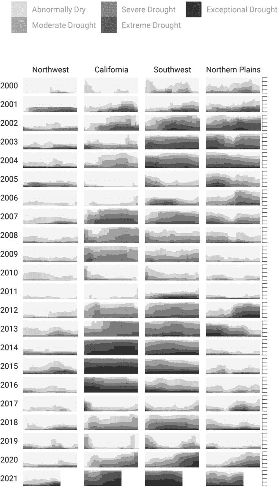

图 2-1：最终干旱可视化的一部分，经过一些调整以适应本书内容

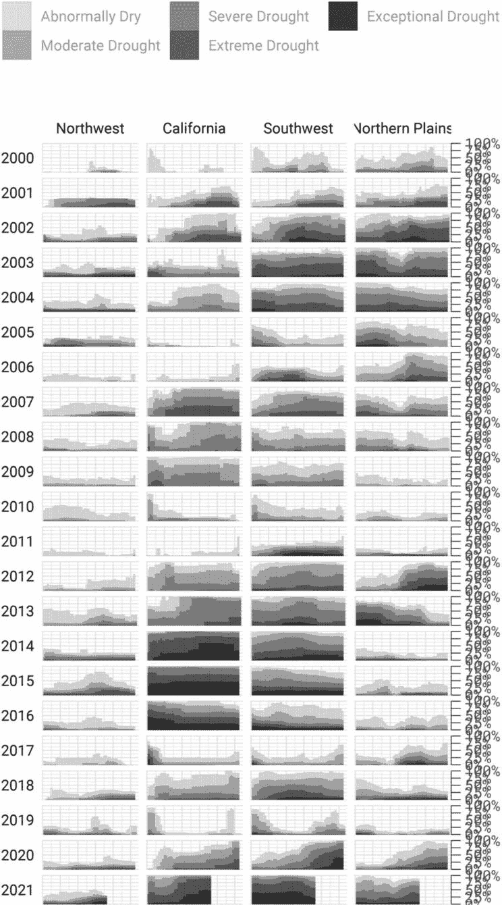

图 2-2：干旱可视化的杂乱版本

这不仅仅是因为这个杂乱的版本看起来更糟；这种杂乱实际上会妨碍理解。我们的大脑没有集中在整体的干旱模式（图表的重点），而是被重复和不必要的轴文本困住了。

减少杂乱的最佳方法之一是将单个图表拆分成一组组件图表，正如 Scherer 和 Karamanis 所做的那样（这种方法叫做*分面*，将在“图表的分面”章节中进一步讨论，第 36 页）。每个矩形代表某一年中的一个地区。将更大的图表筛选出显示 2003 年西南地区的情况，便得到了图 2-3，其中 x 轴表示周，y 轴表示该地区在不同干旱水平下的百分比。

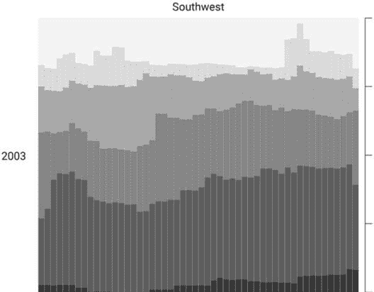

图 2-3：2003 年西南地区的干旱可视化

放大单一区域的单一年份也使颜色选择更为显眼。最浅的橙色条（这里打印的最浅灰色）显示该地区异常干旱的百分比，最深的紫色条（这里打印的最深灰色）显示经历极端干旱条件的百分比。正如你稍后会看到的，这一颜色范围的选择是有意为之，目的是让所有读者都能清晰地看到干旱水平的差异。

尽管图表复杂，Scherer 和 Karamanis 为生成它所编写的 R 代码相对简单，这在很大程度上归功于一种叫做*图形语法*的理论。

### 图形语法

在使用 Excel 时，你首先需要选择你想制作的图表类型。需要柱状图吗？点击柱状图图标。需要折线图吗？点击折线图图标。如果你只在 Excel 中制作过图表，这第一步可能看起来太显而易见，你甚至没有深入思考数据可视化过程，但实际上有许多方式可以思考图表。例如，我们可以不将图表类型视为独立的，而是从它们的共性出发，作为制作图表的起点。

这种思考图表的方式源于已故统计学家利兰·威尔金森。多年来，威尔金森深入思考数据可视化是什么，以及我们如何描述它。1999 年，他出版了一本名为*《图形语法》*（Springer）的书，试图开发一种一致的方式来描述所有图表。在书中，威尔金森认为我们不应将图表视为像 Excel 中那样的独立类型，而应将其视为遵循一种语法，我们可以用来描述*任何*图表。就像英语语法告诉我们名词后通常跟动词（这就是为什么“he goes”是对的，而“goes he”不对），图形语法帮助我们理解为什么某些图表类型“有效”。

从图形语法的角度思考数据可视化有助于突出显示，例如图表通常有一些数据被绘制在 x 轴上，另一些数据则绘制在 y 轴上。无论图表是条形图还是折线图，情况都是如此，正如图 2-4 所示。

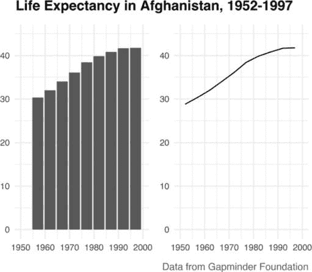

图 2-4：展示相同数据的条形图和折线图

尽管这些图表看起来不同（对于 Excel 用户来说，它们属于不同类型的图表），威尔金森的图形语法强调它们的相似性。（顺便提一下，威尔金森对像 Excel 这样的图表工具的看法在他写到“多数图表软件将用户的请求导向一系列固定的图表类型”时变得清晰可见。）

当威尔金森写这本书时，还没有任何数据可视化工具能够实现他的图形语法。直到 2010 年，哈德利·威克汉姆（Hadley Wickham）在《计算与图形统计学杂志》上发表了文章《层次化图形语法》，并宣布推出了 ggplot2 包，这一局面才发生了变化。通过提供实现威尔金森思想的工具，ggplot2 彻底改变了数据可视化的世界。

### 使用 ggplot

ggplot2 R 包（我和几乎所有数据可视化领域的人一样，简称为*ggplot*）依赖于图表具有多个层次的理念。本节将带你了解一些最重要的层次。你将首先选择映射到美学属性的变量。然后，你将选择一个几何对象来表示你的数据。接下来，你将使用 scale_ 函数来改变图表的美学属性（例如颜色方案）。最后，你将使用 theme_ 函数来设置图表的整体外观和风格。

#### 将数据映射到美学属性

要用 ggplot 创建图表，你首先需要将数据映射到美学属性。其实这只是意味着你使用 x 轴或 y 轴、颜色、大小等元素（即所谓的*美学属性*）来表示变量。你将使用在图 2-4 中介绍的阿富汗人均寿命数据来生成一个图表。要访问这些数据，可以输入以下代码：

```
**library(tidyverse)**

**gapminder_10_rows <- read_csv("https://data.rfortherestofus.com/data/gapminder_10_rows.csv")** 
```

这段代码首先加载了在第一章中介绍的 tidyverse 包，然后使用 read_csv()函数从书籍网站获取数据，并将其赋值给 gapminder_10_rows 对象。

结果得到的 gapminder_10_rows tibble 如下所示：

```
#> # A tibble: 10 × 6
#>    country     continent  year lifeExp      pop gdpPercap
#>    <fct>       <fct>     <int>   <dbl>    <int>    <dbl>
#>  1 Afghanistan Asia       1952    28.8  8425333      779.
#>  2 Afghanistan Asia       1957    30.3  9240934      821.
#>  3 Afghanistan Asia       1962    32.0 10267083      853.
#>  4 Afghanistan Asia       1967    34.0 11537966      836.
#>  5 Afghanistan Asia       1972    36.1 13079460      740.
#>  6 Afghanistan Asia       1977    38.4 14880372      786.
#>  7 Afghanistan Asia       1982    39.9 12881816      978.
#>  8 Afghanistan Asia       1987    40.8 13867957      852.
#>  9 Afghanistan Asia       1992    41.7 16317921      649.
#> 10 Afghanistan Asia       1997    41.8 22227415      635. 
```

这个输出是完整版 gapminder 数据框的简短版本，包含超过 1700 行数据。

在使用 ggplot 制作图表之前，你需要决定哪个变量放在 x 轴，哪个放在 y 轴。对于显示时间变化的数据，通常将日期（在此例中是年份）放在 x 轴，将变化的数值（在此例中是 lifeExp）放在 y 轴。为此，定义 ggplot()函数如下：

```
ggplot(
  data = gapminder_10_rows,
  mapping = aes(
    x = year,
    y = lifeExp
  )
) 
```

这个函数包含许多参数。每个参数单独占一行，以提高可读性，参数之间用逗号分隔。data 参数告诉 R 使用数据框 gapminder_10_rows，mapping 参数将 year 映射到 x 轴，lifeExp 映射到 y 轴。

运行此代码生成了图 2-5 中的图表，虽然看起来还不怎么特别。

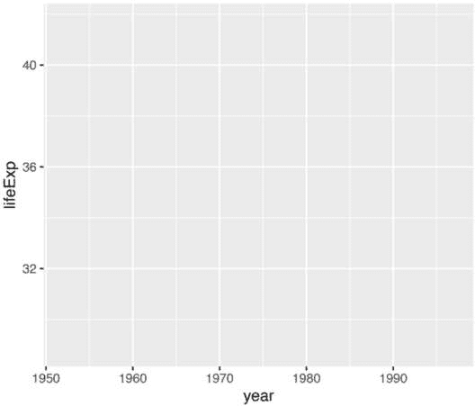

图 2-5：一个空白图表，将年份值映射到 x 轴，将预期寿命值映射到 y 轴

请注意，x 轴对应年份，y 轴对应预期寿命，并且两个轴上的数值与数据的范围相匹配。在 gapminder_10_rows 数据框中，第一年是 1952 年，最后一年是 1997 年。x 轴的范围是根据这些数据创建的。同样，预期寿命（lifeExp）的数值从约 28 上升到约 42，能够很好地适配到 y 轴上。

#### 选择几何对象

坐标轴很好，但图表缺乏任何类型的数据可视化表示。要获得这些，你需要添加下一个 ggplot 层：几何对象（geoms）。*几何对象*（*geoms*）是提供不同数据表示方式的函数。例如，要向图表中添加点，可以使用 geom_point()：

```
ggplot(
  data = gapminder_10_rows,
  mapping = aes(
    x = year,
    y = lifeExp
  )
) +
 **geom_point()** 
```

现在图表显示，1952 年的人均预期寿命约为 28 岁，并且数据集中的每一年这个值都有所上升（见图 2-6）。

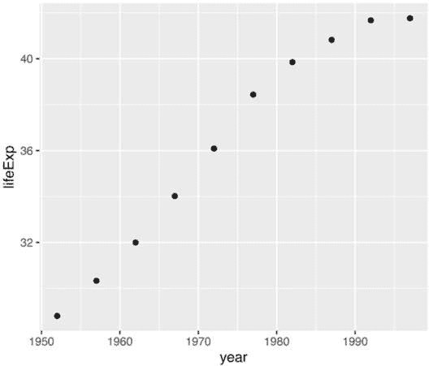

图 2-6：添加了点的预期寿命图表

假设你改变主意，想改为绘制线图。只需将 geom_point() 替换为 geom_line()，如下所示：

```
ggplot(
  data = gapminder_10_rows,
  mapping = aes(
    x = year,
    y = lifeExp
  )
) +
 **geom_line()** 
```

图 2-7 显示了结果。

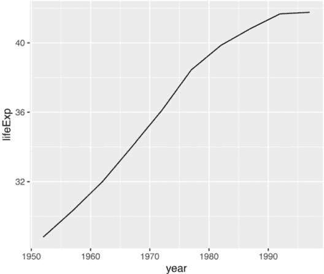

图 2-7：相同数据的线图

如果你想让图表更加精美，可以同时添加 geom_point() 和 geom_line()，如下所示：

```
ggplot(
  data = gapminder_10_rows,
  mapping = aes(
    x = year,
    y = lifeExp
  )
) +
 **geom_point() +**
 **geom_line()** 
```

这段代码生成了带点的线图，如图 2-8 所示。

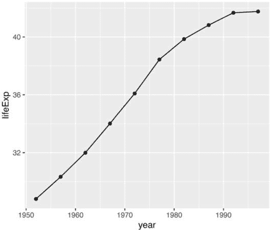

图 2-8：包含点和线的相同数据

你可以用 geom_col() 来创建一个条形图：

```
ggplot(
  data = gapminder_10_rows,
  mapping = aes(
    x = year,
    y = lifeExp
  )
) +
 **geom_col()** 
```

请注意，在图 2-9 中，y 轴的范围已自动更新，从 0 到 40，以适应不同的几何对象（geom）。

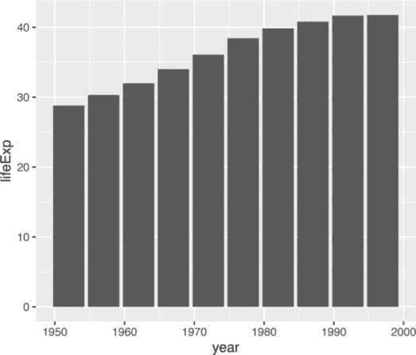

图 2-9：以条形图表示的预期寿命数据

如你所见，线图和条形图之间的差异并不像 Excel 图表类型选择器所展示的那样大。两者都可以具有相同的基本属性（即，x 轴为年份，y 轴为预期寿命）。它们只是使用不同的几何对象来以可视化的方式展示数据。

许多几何对象已内置于 ggplot 中。除了 geom_bar()、geom_point() 和 geom_line()，geom_histogram()、geom_boxplot() 和 geom_area() 是最常用的几何对象。要查看所有几何对象，请访问 ggplot 文档网站：[`ggplot2.tidyverse.org/reference/index.xhtml#geoms`](https://ggplot2.tidyverse.org/reference/index.xhtml#geoms)。

#### 修改美学属性

在我们回到旱灾数据可视化之前，先看一些额外的层，看看如何改变条形图的外观。假设你想改变条形的颜色。在图形语法方法中，这意味着将某个变量映射到填充的美学属性。（对于条形图，美学属性颜色只会改变条形的轮廓。）就像你将年份映射到 x 轴，生命预期（lifeExp）映射到 y 轴一样，你也可以将填充映射到一个变量，例如年份：

```
ggplot(
  data = gapminder_10_rows,
  mapping = aes(
    x = year,
    y = lifeExp,
 **fill = year**
  )
) +
  geom_col() 
```

图 2-10 显示了结果。现在，较早的年份的填充颜色更深，较晚的年份的填充颜色更浅（这也在图表右侧的图例中有所指示）。

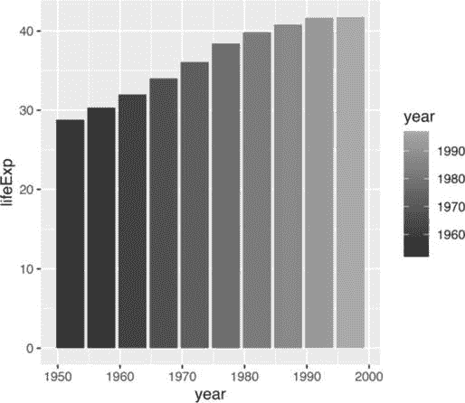

图 2-10：相同的图表，现在添加了颜色

要更改填充颜色，使用一个新的 scale 层，调用 scale_fill_viridis_c() 函数（函数名末尾的 c 表示数据是连续的，意味着它可以取任何数字值）：

```
ggplot(
  data = gapminder_10_rows,
  mapping = aes(
    x = year,
    y = lifeExp,
    fill = year
  )
) +
  geom_col() +
 **scale_fill_viridis_c()** 
```

这个函数将默认调色板更改为对色盲友好的颜色，并且在灰度打印时效果良好。scale_fill_viridis_c() 函数只是许多以 scale_ 开头并可以改变填充尺度的函数之一。《ggplot2：数据分析的优雅图形》第三版的第十一章讨论了各种颜色和填充尺度。你可以在线阅读它，网址是 *[`ggplot2-book.org/scales-colour.xhtml`](https://ggplot2-book.org/scales-colour.xhtml)*。

#### 设置主题

我们将要看的最后一个层是主题层，它允许你改变图表的整体外观和感觉（包括背景和网格线）。与 scale_ 函数类似，许多函数也以 theme_ 开头。你可以如下添加 theme_minimal()：

```
ggplot(
  data = gapminder_10_rows,
  mapping = aes(
    x = year,
    y = lifeExp,
    fill = year
  )
) +
  geom_col() +
  scale_fill_viridis_c() +
 **theme_minimal()** 
```

这个主题开始清理图表中的杂乱，正如你在图 2-11 中看到的那样。

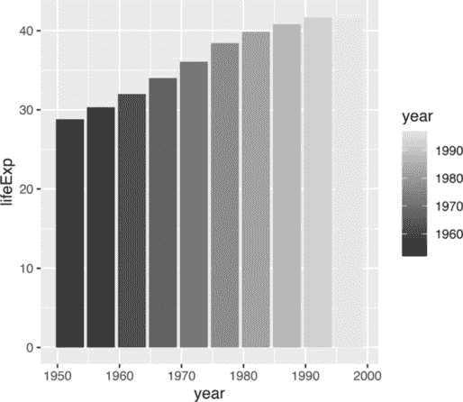

图 2-11：添加 theme_minimal() 后的相同图表

到目前为止，你应该明白为什么 Hadley Wickham 将 ggplot2 包描述为使用图形的分层语法。它通过创建多个层次来实现 Wilkinson 的理论：首先，映射到美学属性的变量；其次，表示数据的几何图形（geoms）；第三，调整美学属性的 scale_ 函数；最后，设置图表整体外观和感觉的 theme_ 函数。

你仍然可以在许多方面改进这个图表，但我们不如回到 Scherer 和 Karamanis 的旱灾数据可视化。通过逐步分析他们的代码，你将学到如何使用 ggplot 和 R 创建高质量的数据可视化。

### 重新创建旱灾可视化

旱灾可视化代码依赖于 ggplot 基础知识和一些鲜为人知的调整，使其非常出色。为了理解 Scherer 和 Karamanis 是如何制作他们的数据可视化的，我们将从一个简化版本的代码开始，然后逐层构建，逐步添加元素。

首先，您将导入数据。Scherer 和 Karamanis 对原始数据进行了大量的数据整理，但我为您保存了简化的输出。由于它是 JavaScript 对象表示法（JSON）格式，Scherer 和 Karamanis 使用 rio 包中的 `import()` 函数，这简化了导入 JSON 数据的过程：

```
**library(rio)**

**dm_perc_cat_hubs <- import("https://data.rfortherestofus.com/dm_perc_cat_hubs.json"))** 
```

*JSON* 是用于 Web 应用程序的数据的常见格式，尽管在 R 中使用得较少，且处理起来可能比较复杂。幸运的是，rio 包简化了它的导入。

#### 绘制一个区域和年份

Scherer 和 Karamanis 的最终图表包含多个年份和区域。为了了解他们是如何创建的，我们将首先查看 2003 年的西南地区。

首先，您需要创建一个数据框。您将使用 `filter()` 函数两次：第一次仅保留西南地区的数据，第二次仅保留 2003 年的数据。在这两种情况下，您使用以下语法：

```
filter(`variable_name == value`) 
```

这告诉 R 仅保留变量名称等于某个值的观察。代码从 `dm_perc_cat_hubs_raw` 数据框开始，然后对其进行过滤，并将其保存为一个名为 southwest_2003 的新对象：

```
southwest_2003 <- dm_perc_cat_hubs %>%
  filter(hub == "Southwest") %>%
  filter(year == 2003) 
```

要查看这个对象并查看您可以使用的变量，请在控制台中输入 southwest_2003，这应该会返回以下输出：

```
#> # A tibble: 255 × 7
#>    date       hub  category  percentage  year  week max_week
#>    <date>    <fct> <fct>          <dbl> <dbl> <dbl>    <dbl>
#>  1 2003-12-30 Sout... D0           0.0718  2003    52       52
#>  2 2003-12-30 Sout... D1           0.0828  2003    52       52
#>  3 2003-12-30 Sout... D2           0.2693  2003    52       52
#>  4 2003-12-30 Sout... D3           0.3108  2003    52       52
#>  5 2003-12-30 Sout... D4           0.0796  2003    52       52
#>  6 2003-12-23 Sout... D0           0.0823  2003    51       52
#>  7 2003-12-23 Sout... D1           0.1312  2003    51       52
#>  8 2003-12-23 Sout... D2           0.1886  2003    51       52
#>  9 2003-12-23 Sout... D3           0.3822  2003    51       52
#> 10 2003-12-23 Sout... D4           0.0828  2003    51       52
#> # 245 more rows 
```

日期变量表示观察发生的周的开始日期。hub 变量是区域，category 是干旱水平：D0 表示最低的干旱水平，而 D5 表示最高的干旱水平。percentage 变量是该区域在该干旱类别中的百分比，范围从 0 到 1。year 和 week 变量分别是观察的年份和周数（从第 1 周开始）。max_week 变量是给定年份的最大周数。

现在您可以使用这个 southwest_2003 对象进行绘图：

```
ggplot(
  data = **southwest_2003**,
  aes(
    x = week,
    y = percentage,
    fill = category
  )
) +
  geom_col() 
```

`ggplot()` 函数告诉 R 将周数放在 x 轴上，将百分比放在 y 轴上，并使用类别变量作为填充颜色。`geom_col()` 函数创建一个条形图，其中每个条形的填充颜色表示该特定周该区域在每个干旱水平下的百分比，如 图 2-12 所示。

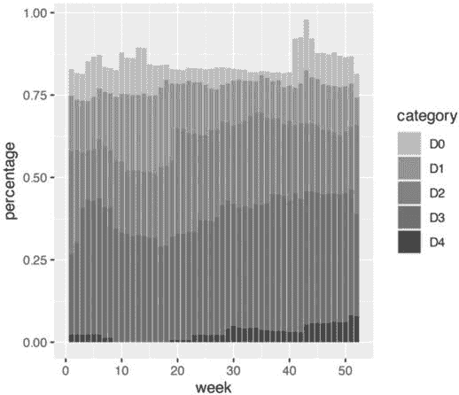

图 2-12：干旱可视化的一个年份（2003）和区域（西南）

这些颜色，包括明亮的粉色、蓝色、绿色和红色（在这里以灰度显示），与图表的最终版本不匹配，但您可以开始看到 Scherer 和 Karamanis 数据可视化的轮廓。

#### 更改美学属性

接下来，Scherer 和 Karamanis 为他们的条形图选择了不同的填充颜色。为此，他们使用了 `scale_fill_viridis_d()` 函数。这里的 *d* 表示填充比例应用于具有离散类别的数据（D0、D1、D2、D3、D4 和 D5）：

```
ggplot(
  data = southwest_2003,
  aes(
    x = week,
    y = percentage,
    fill = category
  )
) +
  geom_col() +
  **scale_fill_viridis_d(**
 **option = "rocket",**
 **direction = -1**
 **)** 
```

他们使用了参数 option = "rocket" 来选择 rocket 配色方案，该方案的颜色范围从奶油色到接近黑色。你还可以在 scale_fill_viridis_d() 函数中使用其他多个配色方案；可以在 *[`sjmgarnier.github.io/viridisLite/reference/viridis.xhtml`](https://sjmgarnier.github.io/viridisLite/reference/viridis.xhtml)* 查看它们。

然后，他们使用 direction = -1 参数反转了填充颜色的顺序，使得颜色越深表示干旱条件越严重。

Scherer 和 Karamanis 还调整了 x 轴和 y 轴的外观：

```
ggplot(
  data = southwest_2003,
  aes(
    x = week,
    y = percentage,
    fill = category
  )) +
  geom_col() +
  scale_fill_viridis_d(
    option = "rocket",
    direction = -1
  ) +
 **scale_x_continuous(**
 **name = NULL,**
 **guide = "none"**
 **) +**
 **scale_y_continuous(**
 **name = NULL,**
 **labels = NULL,**
 **position = "right"**
 **)** 
```

在 x 轴上，他们通过使用 name = NULL 移除了轴标题（“week”）和通过 guide = "none" 移除了轴标签（编号为 0 到 50 的周数）。在 y 轴上，他们通过 labels = NULL 移除了标题和显示百分比的文本，实际上这与 guide = "none" 起到了相同的作用。他们还通过 position = "right" 将轴线本身移到了右侧。此时这些轴线仅作为刻度标记出现，但稍后会变得更加明显。图 2-13 展示了这些调整的结果。

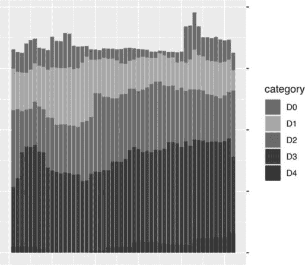

图 2-13：带有 x 轴和 y 轴调整的 2003 年西南部干旱数据

到目前为止，我们已经关注了组成较大数据可视化的单个图表。但 Scherer 和 Karamanis 实际上制作了 176 个图表，展示了 22 年和 8 个区域的数据。接下来，我们将讨论他们用来创建所有这些图表的 ggplot 特性。

#### 对图表进行分面

ggplot 最有用的功能之一就是 *分面*（或在数据可视化领域更常见的术语 *小型多图*）。分面使用一个变量将单个图表拆分为多个图表。例如，想象一下一个显示各国预期寿命随时间变化的折线图；与其在一个图表中绘制多条线，分面会创建多个图表，每个图表显示一条线。为了指定要放在分面图表的行和列中的变量，使用 facet_grid() 函数，就像 Scherer 和 Karamanis 在他们的代码中做的那样：

```
dm_perc_cat_hubs %>%
  filter(hub %in% c(
    "Northwest",
    "California",
    "Southwest",
    "Northern Plains"
  )) %>%
  ggplot(aes(
    x = week,
    y = percentage,
    fill = category
  )) +
  geom_col() +
  scale_fill_viridis_d(
    option = "rocket",
    direction = -1
  ) +
  scale_x_continuous(
    name = NULL,
    guide = "none"
  ) +
  scale_y_continuous(
    name = NULL,
    labels = NULL,
    position = "right"
  ) +
 **facet_grid(**
 **rows = vars(year),**
 **cols = vars(hub),**
 **switch = "y"**
 **)** 
```

Scherer 和 Karamanis 将年份放在行中，将区域（hub）放在列中。switch = "y" 参数将年份标签从右侧（默认显示的位置）移动到左侧。将此代码应用后，你可以在图 2-14 中看到最终的图表效果。

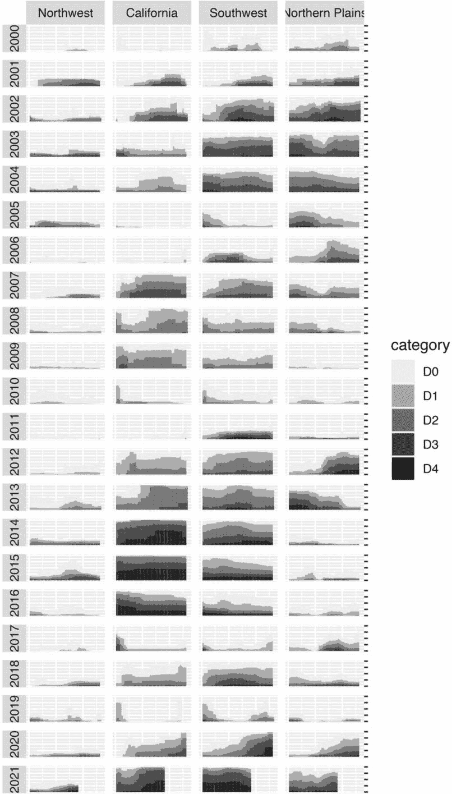

图 2-14：干旱可视化的分面版本

难以置信的是，图表的轮廓只用了 10 行代码就创建出来了。其余的代码属于小幅修饰的范畴。这并不是说小幅修饰不重要（非常重要），或者它们的创建过程不费时（其实非常费时）。然而，这也显示出，即便是少量的 ggplot 代码，也能起到很大的作用。

#### 添加最终修饰

现在让我们来看一下 Scherer 和 Karamanis 做的一些小的改进。第一个是应用主题。他们使用了 theme_light()，它去除了默认的灰色背景，并通过 base_family 参数将字体更改为 Roboto。

theme_light() 函数被称为*完整主题*，它会改变图表的整体外观和感觉。ggplot 包有多个完整的主题可供使用（它们在 *[`ggplot2.tidyverse.org/reference/index.xhtml#themes`](https://ggplot2.tidyverse.org/reference/index.xhtml#themes)* 中列出）。个人和组织也会制作自己的主题，就像你在 第三章 中要做的那样。关于你可能考虑使用哪些主题，参考我在 *[`rfortherestofus.com/2019/08/themes-to-improve-your-ggplot-figures`](https://rfortherestofus.com/2019/08/themes-to-improve-your-ggplot-figures)* 上的博客文章。

Scherer 和 Karamanis 不仅仅停留在应用 theme_light() 上。他们还使用了 theme() 函数对图表设计进行了进一步调整：

```
dm_perc_cat_hubs %>%
  filter(hub %in% c(
    "Northwest",
    "California",
    "Southwest",
    "Northern Plains"
  )) %>%
  ggplot(aes(
    x = week,
    y = percentage,
    fill = category
  )) +
  geom_rect(
    aes(
      xmin = .5,
      xmax = max_week + .5,
      ymin = -0.005,
      ymax = 1
    ),
    fill = "#f4f4f9",
    color = NA,
    size = 0.4
  ) +
  geom_col() +
  scale_fill_viridis_d(
    option = "rocket",
    direction = -1
  ) +
  scale_x_continuous(
 name = NULL,
    guide = "none"
  ) +
  scale_y_continuous(
    name = NULL,
    labels = NULL,
    position = "right"
  ) +
  facet_grid(
    rows = vars(year),
    cols = vars(hub),
    switch = "y"
  ) +
  theme_light(base_family = "Roboto") +
  theme(
    axis.title = element_text(
      size = 14,
      color = "black"
    ),
    axis.text = element_text(
      family = "Roboto Mono",
      size = 11
    ),
  ❶ axis.line.x = element_blank(),
    axis.line.y = element_line(
      color = "black",
      size = .2
    ),
    axis.ticks.y = element_line(
      color = "black",
      size = .2
    ),
    axis.ticks.length.y = unit(2, "mm"),
  ❷ legend.position = "top",
    legend.title = element_text(
      color = "#2DAADA",
      face = "bold"
    ),
    legend.text = element_text(color = "#2DAADA"),
    strip.text.x = element_text(
      hjust = .5,
      face = "plain",
      color = "black",
      margin = margin(t = 20, b = 5)
    ),
    strip.text.y.left = element_text(
    ❸ angle = 0,
      vjust = .5,
      face = "plain",
      color = "black"
    ),
    strip.background = element_rect(
      fill = "transparent",
      color = "transparent"
    ),
 ❹ panel.grid.minor = element_blank(),
    panel.grid.major = element_blank(),
    panel.spacing.x = unit(0.3, "lines"),
    panel.spacing.y = unit(0.25, "lines"),
  ❺ panel.background = element_rect(
      fill = "transparent",
      color = "transparent"
    ),
    panel.border = element_rect(
      color = "transparent",
      size = 0
    ),
    plot.background = element_rect(
      fill = "transparent",
      color = "transparent",
      size = .4
    ),
    plot.margin = margin(rep(18, 4))
  )
  ) 
```

theme() 函数中的代码做了许多不同的事情，但我们来看几个最重要的。首先，它将图例从右侧（默认位置）移到了图表的顶部 ❷。然后，angle = 0 参数将列中的年份文字从垂直方向旋转为水平方向 ❸。如果没有这个参数，年份会难以辨认。

theme() 函数还在最终图表的右侧生成了独特的坐标轴线和刻度 ❶。调用 element_blank() 会去除所有网格线 ❹。最后，这段代码去除了边框，并给每个子图设置了透明背景 ❺。

你可能在想，*等一下，单独的图表后面不是有灰色背景吗？* 是的，亲爱的读者，的确有。Scherer 和 Karamanis 使用了一个单独的 geom，geom_rect() 来实现这一点：

```
geom_rect(
  aes(
    xmin = .5,
    xmax = max_week + .5,
    ymin = -0.005,
    ymax = 1
  ),
  fill = "#f4f4f9",
  color = NA,
  size = 0.4
) 
```

他们还设置了一些特定于这个 geom 的额外美学属性——xmin、xmax、ymin 和 ymax——这些属性决定了它所生成的矩形的边界。结果是在每个小的子图后面加上了一个灰色背景，如 图 2-15 所示。

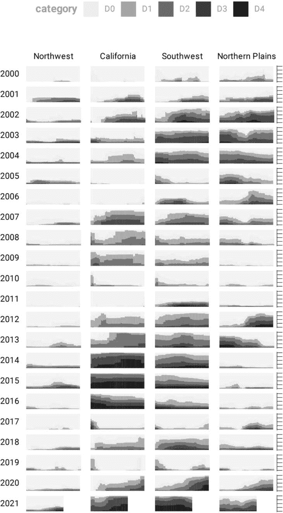

图 2-15：带有灰色背景的干旱可视化，每个小图都有一个灰色背景

最后，Scherer 和 Karamanis 对图例做了一些调整。之前你看到的是 scale_fill_viridis_d() 函数的简化版本。这里是一个更完整的版本：

```
scale_fill_viridis_d(
  option = "rocket",
  direction = -1,
  name = "Category:",
  labels = c(
    "Abnormally Dry",
    "Moderate Drought",
    "Severe Drought",
    "Extreme Drought",
    "Exceptional Drought"
  )
) 
```

name 参数设置图例标题，labels 参数指定图例中显示的标签。图 2-16 展示了这些更改的结果。


图 2-16：更改图例文本的干旱可视化

现在，图例中的文本从 D0、D1、D2、D3 和 D4 改成了“不正常干旱”、“中度干旱”、“严重干旱”、“极端干旱”和“异常干旱”——这些类别更加用户友好。

### 完整的可视化代码

虽然我已经向你展示了 Scherer 和 Karamanis 编写的几乎完整的代码版本，但我做了一些小的修改以使其更易于理解。如果你感兴趣，完整代码可以在这里找到：

```
ggplot(dm_perc_cat_hubs, aes(week, percentage)) +
  geom_rect(
    aes(
      xmin = .5,
      xmax = max_week + .5,
      ymin = -0.005,
      ymax = 1
    ),
    fill = "#f4f4f9",
    color = NA,
    size = 0.4,
    show.legend = FALSE
  ) +
  geom_col(
 aes(
      fill = category,
      fill = after_scale(addmix(
        darken(
          fill,
          .05,
          space = "HLS"
        ),
        "#d8005a",
        .15
      )),
      color = after_scale(darken(
        fill,
        .2,
        space = "HLS"
      ))
    ),
    width = .9,
    size = 0.12
  ) +
  facet_grid(
    rows = vars(year),
    cols = vars(hub),
    switch = "y"
  ) +
  coord_cartesian(clip = "off") +
  scale_x_continuous(
    expand = c(.02, .02),
    guide = "none",
    name = NULL
  ) +
  scale_y_continuous(
    expand = c(0, 0),
    position = "right",
    labels = NULL,
    name = NULL
  ) +
  scale_fill_viridis_d(
    option = "rocket",
    name = "Category:",
    direction = -1,
    begin = .17,
    end = .97,
    labels = c(
      "Abnormally Dry",
      "Moderate Drought",
      "Severe Drought",
      "Extreme Drought",
      "Exceptional Drought"
    )
  ) +
  guides(fill = guide_legend(
    nrow = 2,
    override.aes = list(size = 1)
 )) +
  theme_light(
    base_size = 18,
    base_family = "Roboto"
  ) +
  theme(
    axis.title = element_text(
      size = 14,
      color = "black"
    ),
    axis.text = element_text(
      family = "Roboto Mono",
      size = 11
    ),
    axis.line.x = element_blank(),
    axis.line.y = element_line(
      color = "black",
      size = .2
    ),
    axis.ticks.y = element_line(
      color = "black",
      size = .2
    ),
    axis.ticks.length.y = unit(2, "mm"),
    legend.position = "top",
    legend.title = element_text(
      color = "#2DAADA",
      size = 18,
      face = "bold"
    ),
    legend.text = element_text(
      color = "#2DAADA",
      size = 16
    ),
    strip.text.x = element_text(
      size = 16,
      hjust = .5,
      face = "plain",
      color = "black",
      margin = margin(t = 20, b = 5)
    ),
    strip.text.y.left = element_text(
      size = 18,
      angle = 0,
      vjust = .5,
      face = "plain",
      color = "black"
    ),
    strip.background = element_rect(
      fill = "transparent",
      color = "transparent"
    ),
    panel.grid.minor = element_blank(),
    panel.grid.major = element_blank(),
    panel.spacing.x = unit(0.3, "lines"),
 panel.spacing.y = unit(0.25, "lines"),
    panel.background = element_rect(
      fill = "transparent",
      color = "transparent"
    ),
    panel.border = element_rect(
      color = "transparent",
      size = 0
    ),
    plot.background = element_rect(
      fill = "transparent",
      color = "transparent",
      size = .4
    ),
    plot.margin = margin(rep(18, 4))
  ) 
```

还有一些关于颜色和间距的小调整，但大部分代码和你到目前为止看到的相差无几。

### 总结

你可能会认为 ggplot 是解决所有数据可视化问题的答案。是的，你手中有了一把新的锤子，但并不是所有问题都是钉子。如果你查看 2021 年 11 月《科学美国人》上出现的数据可视化版本，你会发现其中一些注释在我们的重现中并不可见。这是因为它们是在后期制作中添加的。虽然你可以在 ggplot 中找到方法来创建这些注释，但这通常不是最有效的时间利用方式。用 ggplot 完成 90% 的工作，然后使用 Illustrator、Figma 或类似的工具来完善你的作品。

即便如此，ggplot 仍然是一个非常强大的工具，用来制作你在*纽约时报*、FiveThirtyEight、BBC 以及其他知名新闻媒体中见过的图表。虽然它不是唯一能够生成高质量数据可视化的工具，但它使得这一过程变得简单直接。Scherer 和 Karamanis 的图表在多个方面展示了这一点：

+   它去除了多余的元素，比如网格线，保持对数据本身的关注。像 theme_light() 和 theme() 函数这样的完整主题帮助 Scherer 和 Karamanis 创建了一个简洁、有效传达信息的可视化。

+   它使用了精心挑选的颜色。scale_fill_viridis_d() 函数使他们能够创建一种色彩方案，能够展示不同组之间的差异，且对色盲友好，在打印成灰度时也表现良好。

+   它使用分面将来自二十年和八个地区的数据拆解成一组图表，并将这些图表结合起来创建一个单一的图。通过一次调用 facet_grid() 函数，Scherer 和 Karamanis 创建了超过 100 个小型子图，工具会自动将它们合并为一个单一图表。

学习在 ggplot 中创建数据可视化需要投入相当的时间。但长期来看，这种投入的回报更为丰厚。一旦你了解了 ggplot 的工作原理，你就能查看他人的代码并学会如何改进自己的代码。相比之下，当你在 Excel 中制作数据可视化时，一系列点击操作会消失在虚空中。要重新创建你上周做过的可视化，你需要记得你当时使用的确切步骤；而要制作别人做的数据可视化，你则需要他们为你写出自己的过程。

由于基于代码的数据可视化工具允许你记录每一个步骤，你不必是最有才华的设计师就能用 ggplot 制作高质量的数据可视化。你可以研究他人的代码，将其调整为自己的需求，并创造出既美观又能有效传达信息的数据可视化。

### 额外资源

+   Will Chase，“图形的魅力”，在线课程，访问时间：2023 年 11 月 6 日，*[`rfortherestofus.com/courses/glamour/`](https://rfortherestofus.com/courses/glamour/)*。

+   Kieran Healy，*数据可视化：实用导论*（新泽西州普林斯顿：普林斯顿大学出版社，2018 年），*[`socviz.co`](https://socviz.co)*。

+   Cédric Scherer，*使用 ggplot2 的图形设计*（佛罗里达州博卡拉顿：CRC 出版社，敬请期待）。

+   Hadley Wickham、Danielle Navarro 和 Thomas Lin Pedersen，*ggplot2: 优雅的数据分析图形*，第三版（纽约：Springer，敬请期待），*[`ggplot2-book.org`](https://ggplot2-book.org)*。

+   Claus Wilke，*数据可视化基础*（加利福尼亚州塞巴斯托波尔：O'Reilly Media，2019 年），*[`clauswilke.com/dataviz/`](https://clauswilke.com/dataviz/)*。
