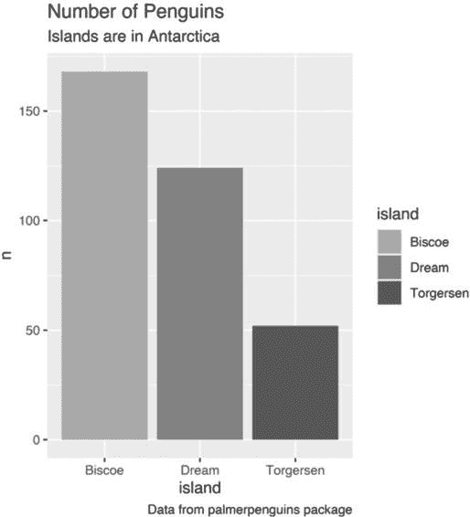
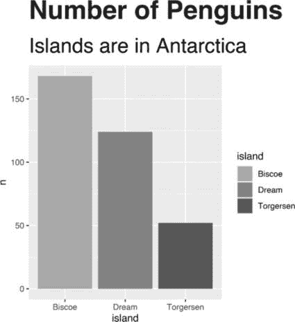
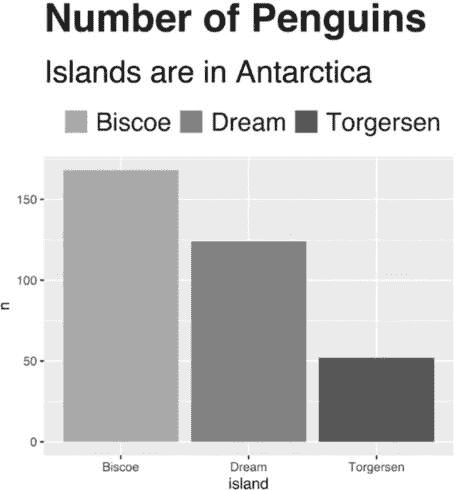
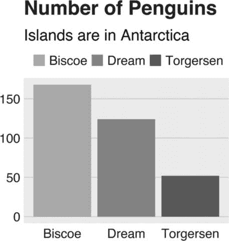
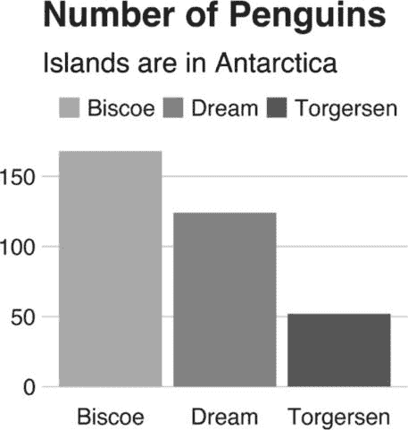
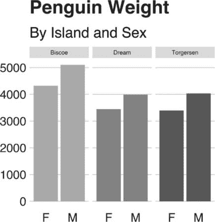
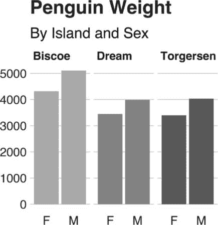

## 第三章：3 个自定义数据可视化主题


*自定义主题*不过是一段代码，它对所有图表应用一系列小的调整。在制作专业图表时，许多工作都涉及这些类型的调整。你应该使用什么字体？图例应该放在哪里？坐标轴应该有标题吗？图表需要网格线吗？这些问题看起来微不足道，但对最终结果有着重大影响。

2018 年，BBC 的数据记者 Nassos Stylianou 和 Clara Guibourg 与他们的团队共同开发了一个符合 BBC 风格的定制 ggplot 主题。通过推出这个 bbplot 包供他人使用，他们改变了组织文化，消除了瓶颈，使 BBC 能够更具创意地可视化数据。

与其强迫每个人都复制冗长的代码来调整他们制作的每个图表，不如让定制主题让所有使用它的人遵循风格指南，确保所有数据可视化符合品牌的标准。例如，为了理解 BBC 引入的自定义主题的意义，了解 bbplot 出现之前的工作方式是很有帮助的。在 2010 年代中期，想要制作数据可视化的记者有两种选择：

+   使用一个内部工具来创建数据可视化，但仅限于它设计生成的预定义图表。

+   使用 Excel 创建框架图，然后与平面设计师合作，最终确定图表。这种方法带来了更好的效果，并且灵活性更高，但也需要与设计师进行大量的、耗时的来回沟通。

这两种选择都不是理想的，BBC 的数据可视化输出有限。R 解放了记者们不必依赖设计师。并不是说设计师不好（他们并不差），而是 ggplot 让记者们能够自己探索不同的可视化方式。随着团队提升 ggplot 技能，他们意识到可能不仅仅能生成探索性数据可视化，还能够在 R 中创建生产就绪的图表，直接发布到 BBC 网站上。

本章讨论了自定义 ggplot 主题的强大功能，并逐步介绍 bbplot 包中的代码，演示自定义主题是如何工作的。你将学习如何将样式代码整合成一个可重用的函数，并且如何一致地修改图表的文本、坐标轴、网格线、背景及其他元素。

### 使用自定义主题样式化图表

bbplot 包有两个函数：bbc_style()和 finalise_plot()。后者处理像添加 BBC 标志和保存图表为正确尺寸之类的任务。现在，我们先来看 bbc_style()函数，它应用一个自定义的 ggplot 主题，使所有图表看起来一致，并遵循 BBC 的风格指南。

#### 示例图

要查看这个函数的工作原理，你将创建一个显示几种企鹅物种人口数据的图表。你将使用 palmerpenguins 包，该包包含有关生活在南极洲三个岛屿上的企鹅的数据。为了了解这些数据的样子，加载 palmerpenguins 和 tidyverse 包：

```
**library(palmerpenguins)**

**library(tidyverse)** 
```

现在你有了一个名为 penguins 的可用数据对象。以下是前 10 行的数据样式：

```
#> # A tibble: 344 × 8
#>    species island   bill_le... bill_...  flipp...  body_...    sex
#>    <fct>   <fct>         <dbl>    <dbl>     <int>     <int>    <fct>
#>  1 Adelie  Torgersen      39.1     18.7       181      3750    male
#>  2 Adelie  Torgersen      39.5     17.4       186      3800    fema...
#>  3 Adelie  Torgersen      40.3       18       195      3250    fema...
#>  4 Adelie  Torgersen        NA       NA        NA        NA    <NA>
#>  5 Adelie  Torgersen      36.7     19.3       193      3450    fema...
#>  6 Adelie  Torgersen      39.3     20.6       190      3650    male
#>  7 Adelie  Torgersen      38.9     17.8       181      3625    fema...
#>  8 Adelie  Torgersen      39.2     19.6       195      4675    male
#>  9 Adelie  Torgersen      34.1     18.1       193      3475    <NA>
#> 10 Adelie  Torgersen      42       20.2       190      4250    <NA>
`--snip--` 
```

为了将数据转换为更可用的格式，你将使用 dplyr 包中的 count()函数（tidyverse 包中的几个包之一）来计算每个岛上居住的企鹅数量：

```
**penguins %>%**
 **count(island)** 
```

这为你提供了一些可以用于绘图的简单数据：

```
#> # A tibble: 3 × 2
#>   island        n
#>   <fct>     <int>
#> 1 Biscoe      168
#> 2 Dream       124
#> 3 Torgersen    52 
```

你将在本章中多次使用这些数据，因此将其保存为名为 penguins_summary 的对象：

```
**penguins_summary <- penguins %>%**
 **count(island)** 
```

现在你可以开始创建一个图表。在看 bbplot 的效果之前，先用 ggplot 的默认设置创建一个图表：

```
penguins_plot <- ggplot(
  data = penguins_summary,
  aes(
    x = island,
    y = n,
    fill = island
  )
) +
  geom_col() +
  labs(
 title = "Number of Penguins",
    subtitle = "Islands are in Antarctica",
    caption = "Data from palmerpenguins package"
  ) 
```

这段代码告诉 R 使用 penguins_summary 数据框，将岛屿放在 x 轴上，并将企鹅数量（n）放在 y 轴上，并使用填充美学属性使每个条形图呈现不同颜色。由于你将多次修改这个图表，将其保存为名为 penguins_plot 的对象会简化此过程。图 3-1 显示了结果图表。



图 3-1：默认主题的图表

这不是最美观的图表。灰色背景不好看，y 轴标题因为倾斜难以阅读，整体文本大小相当小。但别担心，很快你将对其进行改进。

#### BBC 的自定义主题

现在你已经有了一个基本的图表可供使用，你将开始使其看起来像 BBC 的图表。为此，你需要安装 bbplot 包。首先使用 install.packages("remotes")安装 remotes 包，以便能够从远程源访问包。然后，运行以下代码从 GitHub 仓库 *[`github.com/bbc/bbplot`](https://github.com/bbc/bbplot)* 安装 bbplot：

```
**library(remotes)**

**install_github("bbc/bbplot")** 
```

安装 bbplot 包后，加载它并将 bbc_style()函数应用于 penguins_plot，如下所示：

```
**library(bbplot)**

**penguins_plot +**
 **bbc_style()** 
```

图 3-2 展示了结果。


图 3-2：应用 BBC 样式后的相同图表

看起来差别很大，对吧？字体大小更大了，图例在顶部，没有轴标题，网格线简化了，背景是白色的。我们逐一看看这些变化。

### BBC 主题组件

你刚刚看到 bbc_style()函数对基本图表的影响有多大。本节将带你深入了解函数的代码，稍作修改以提高可读性。有关函数的进一步讨论，请参阅第十二章。

#### 函数定义

第一行为函数命名，并指示其后的内容实际上是函数定义：

```
bbc_style <- function() {
  font <- "Helvetica"

  ggplot2::theme(
`--snip--` 
```

然后，代码定义了一个名为 font 的变量，并将其值设置为 Helvetica。这使得后续的部分可以简单地使用 font，而不需要多次重复 Helvetica。如果 BBC 团队想要使用不同的字体，他们可以在此处将 Helvetica 更改为例如 Comic Sans，这样就会更新所有 BBC 图形的字体（尽管我怀疑 BBC 高层可能不会同意这个选择）。

历史上，使用自定义字体在 R 中一直颇具挑战，但最近的变化使得这一过程变得简单了很多。为了确保像 Helvetica 这样的自定义字体能在 ggplot 中正常工作，请首先通过在控制台运行以下代码安装 systemfonts 和 ragg 包：

```
**install.packages(c("systemfonts", "ragg"))** 
```

systemfonts 包使得 R 可以直接访问你在计算机上安装的字体，而 ragg 则允许 ggplot 在生成图形时使用这些字体。

接下来，从 RStudio 的主菜单栏中选择**工具****全局选项**。点击界面顶部的**图形**菜单，在后端选项下选择**AGG**。这个更改应该确保 RStudio 在预览任何图形时使用 ragg 包。设置完成后，你应该能够像 bbc_style()函数使用 Helvetica 一样使用你想要的任何字体（前提是你已安装这些字体）。

在指定要使用的字体后，代码调用了 ggplot 的 theme()函数。与先加载 ggplot 并调用其 theme()函数不同，ggplot2::theme()语法一步到位地表明 theme()函数来自 ggplot2 包。在第十二章中创建 R 包时，你会以这种方式编写代码。

bbc_style()中的几乎所有代码都存在于 theme()函数内。记得在第二章中，theme()对现有主题进行额外的调整；它不像 theme_light()那样是一个完整的主题，后者会改变整个图形的外观和感觉。换句话说，通过直接进入 theme()函数，bbc_style()对 ggplot 的默认设置进行调整。正如你将看到的，bbc_style()函数进行了很多微调。

#### 文本

theme()函数中的第一部分代码格式化文本：

```
 plot.title = ggplot2::element_text(
      family = font,
      size = 28,
      face = "bold",
      color = "#222222"
    ),
    plot.subtitle = ggplot2::element_text(
      family = font,
      size = 22,
      margin = ggplot2::margin(9, 0, 9, 0)
    ),
    plot.caption = ggplot2::element_blank(),
`--snip--` 
```

要更改标题、副标题和注释，请遵循以下模式：

```
`area_of_chart` = `element_type`(
  `property` = `value`
) 
```

对于每个区域，此代码指定了元素类型：element_text()、element_line()、element_rect()或 element_blank()。在元素类型内，你为属性分配值——例如，将字体系列（属性）设置为 Helvetica（值）。如你将在本章后面看到的，bbc_style()函数使用各种 element_ 函数进行调整。

> 注意

*有关自定义图形各部分的其他方法，请参见 ggplot2 包文档（*[`ggplot2.tidyverse.org/reference/element.xhtml`](https://ggplot2.tidyverse.org/reference/element.xhtml)*），它提供了一个全面的列表。*

bbc_style() 函数做出的主要调整之一是增大了字体大小，以帮助提高可读性，特别是当使用 bbplot 包制作的图表在较小的移动设备上查看时。代码首先使用 Helvetica 28 点粗体字和接近黑色的颜色（十六进制代码 #222222）格式化标题（plot.title）。副标题（plot.subtitle）则为 22 点 Helvetica 字体。

bbc_style() 代码还通过 margin() 函数在标题和副标题之间添加了一些间距，指定了顶部（9）、右侧（0）、底部（9）和左侧（0）的间距值。最后，element_blank() 函数移除了默认的标题（通过 labs() 函数中的 caption 参数设置）“来自 palmer penguins 包的数据。”（如前所述，bbplot 包中的 finalise_plot() 函数会向图表底部添加元素，包括更新后的标题和 BBC 标志。）图 3-3 显示了这些更改。



图 3-3：带有文本和边距格式化更改的企鹅图表

有了这些更改，你就朝着 BBC 风格迈进了。

#### 图例

接下来是格式化图例，将其定位于图表上方，并左对齐文本：

```
 legend.position = "top",
    legend.text.align = 0,
    legend.background = ggplot2::element_blank(),
    legend.title = ggplot2::element_blank(),
    legend.key = ggplot2::element_blank(),
    legend.text = ggplot2::element_text(
      family = font,
      size = 18,
      color = "#222222"
    ), 
```

这段代码移除了图例背景（如果整个图表的背景颜色不是白色，背景会显示），标题和图例键（显示岛屿名称的框的边框，仅在图 3-3 中隐约可见）。最后，代码将图例文本设置为 18 点的 Helvetica 字体，颜色接近黑色。图 3-4 显示了结果。



图 3-4：带有图例更改的企鹅图表

图例看起来更好了，但现在是时候格式化图表的其余部分，使其一致。

#### 坐标轴

这段代码首先移除了坐标轴标题，因为它们通常占用大量的图表空间，而你可以使用标题和副标题来阐明坐标轴显示的内容：

```
 axis.title = ggplot2::element_blank(),
    axis.text = ggplot2::element_text(
      family = font,
      size = 18,
      color = "#222222"
    ),
    axis.text.x = ggplot2::element_text(margin = ggplot2::margin(5, b = 10)),
    axis.ticks = ggplot2::element_blank(),
    axis.line = ggplot2::element_blank(), 
```

所有坐标轴上的文本都变成了 18 点的 Helvetica 字体，颜色接近黑色。x 轴上的文本（Biscoe、Dream 和 Torgersen）周围有些间距。最后，两个坐标轴的刻度和线条都被移除。图 3-5 显示了这些更改，尽管坐标轴线条的移除对此处的显示没有影响。


图 3-5：带有坐标轴格式化更改的企鹅图表

坐标轴文本与图例文本匹配，坐标轴的刻度线和线条被移除。

#### 网格线

接下来是网格线：

```
 panel.grid.minor = ggplot2::element_blank(),
    panel.grid.major.y = ggplot2::element_line(color = "#cbcbcb"),
    panel.grid.major.x = ggplot2::element_blank(),
`--snip--` 
```

这里的方法相当简单：这段代码移除了两个坐标轴的次要网格线，移除了 x 轴的主要网格线，并保持 y 轴的主要网格线，但将其颜色改为浅灰色（#cbcbcb 十六进制颜色）。图 3-6 显示了结果。



图 3-6：带有网格线调整的企鹅图表

请注意，x 轴上的网格线已消失。

#### 背景

上一版本的图表仍然有灰色背景。`bbc_style()`函数通过以下代码移除了它：

```
 panel.background = ggplot2::element_blank(), 
```

图 3-7 展示了生成的图。



图 3-7：去掉灰色背景后的图表

你几乎已经用`bbc_style()`函数重建了企鹅图。

#### 小多图

`bbc_style()`函数包含了更多的代码来修改`strip.background`和`strip.text`。在 ggplot 中，*strip*指的是像第二章中讨论的那种在分面图上方的文字。接下来，你将把企鹅图转换为一个分面图，以便查看 BBC 主题中的这些组件。我使用了`bbc_style()`函数中的代码，去除了处理小多图的部分，制作了图 3-8。



图 3-8：没有改变条带文字格式的小多图

使用`facet_wrap()`函数制作小多图会为每个岛屿生成一张图表，但默认情况下，每个小多图上方的文字明显比其他部分的小。更重要的是，文字背后的灰色背景显得尤为突出，因为你已经去掉了图表其他部分的灰色背景。你努力实现的一致性此时被破坏了，文字小得与其他图表文字不成比例，灰色背景也像一个显眼的眼中钉。

以下代码更改了每个小多图上方的条带文字：

```
 strip.background = ggplot2::element_rect(fill = "white"),
    strip.text = ggplot2::element_text(size = 22, hjust = 0)
  )
 `--snip--` 
```

这段代码移除了背景（更准确地说，给它上了白色背景）。接着，它使文字变大，加粗，并通过`hjust = 0`使其左对齐。请注意，我确实需要把文字大小调整得比实际图表中的稍微小一些，以适应书本的排版，并且我添加了代码来使其加粗。图 3-9 展示了结果。



图 3-9：BBC 风格的小多图

如果你查看 BBC 网站上的任何图表，你会发现它看起来和你自己的图表非常相似。`bbc_style()`函数对文字格式、图例、坐标轴、网格线和背景的调整会出现在全球数百万观众看到的图表中。

### 颜色

你可能在想，*等一下，条形图的颜色呢？难道主题没有改变它们吗？* 这是一个常见的困惑，但答案是没有改变。theme()函数的文档解释了为什么会这样：“主题是自定义图表非数据部分的强大方式：例如标题、标签、字体、背景、网格线和图例。”换句话说，ggplot 主题仅改变与数据无关的图表元素。

另一方面，图表使用颜色来传达有关数据的信息。例如，在分面图中，填充属性映射到岛屿（Biscoe 是鲑鱼色，Dream 是绿色，Torgersen 是蓝色）。正如你在第二章中看到的，你可以使用各种 scale_fill_ 函数来更改填充。在 ggplot 的世界里，这些 scale_ 函数控制颜色，而自定义主题控制图表的整体外观和感觉。

### 总结

当 Stylianou 和 Guibourg 开始为 BBC 开发自定义主题时，他们有一个问题：他们能否在 R 中创建可以直接放到 BBC 网站上的图表？使用 ggplot，他们成功了。bbplot 包使他们能够制作具有一致外观和感觉的图表，这些图表符合 BBC 标准，最重要的是，不需要设计师的帮助。

你可以在这个自定义主题中看到许多在第二章中讨论的高质量数据可视化原则。特别是，去除多余元素（例如坐标轴标题和网格线）有助于将注意力集中在数据本身。由于应用主题只需要用户在 ggplot 代码中添加一行代码，所以很容易让其他人参与进来。他们只需在代码中附加 bbc_style() 即可生成 BBC 风格的图表。

随着时间的推移，BBC 其他部门的人注意到了数据新闻团队生产的可直接使用的图表，并希望自己也能制作。团队成员为同事们设置了 R 培训，并开发了一本“食谱”(*[`bbc.github.io/rcookbook/`](https://bbc.github.io/rcookbook/)*)，展示了如何制作各种类型的图表。很快，BBC 的数据可视化的质量和数量都大幅提升。Stylianou 告诉我：“我不认为 BBC 有哪一天没有人使用这个包来制作图形。”

现在你已经了解了自定义 ggplot 主题的工作原理，试着做一个属于你自己的主题吧。毕竟，一旦你写好代码，就只需要一行代码即可应用它。

### 额外资源

+   BBC 视觉与数据新闻团队，“BBC 视觉与数据新闻 R 图形食谱，”GitHub，2019 年 1 月 24 日，*[`bbc.github.io/rcookbook/`](https://bbc.github.io/rcookbook/)*。

+   BBC 视觉与数据新闻团队，“BBC 视觉与数据新闻团队如何使用 R 制作图形，”Medium，2019 年 2 月 1 日，*[`medium.com/bbc-visual-and-data-journalism/how-the-bbc-visual-and-data-journalism-team-works-with-graphics-in-r-ed0b35693535`](https://medium.com/bbc-visual-and-data-journalism/how-the-bbc-visual-and-data-journalism-team-works-with-graphics-in-r-ed0b35693535)*。
