<hgroup>

## 4 地图和地理空间数据

</hgroup>


当我刚开始学习 R 时，我认为它是一个用于处理数字的工具，而不是处理形状的工具，因此当我看到人们用它来制作地图时，我感到很惊讶。例如，开发者 Abdoul Madjid 使用 R 制作了一张 2021 年美国 COVID-19 疫情传播率的地图。

你可能认为制作地图需要像 ArcGIS 这样的专业地图制作软件，但它是一个昂贵的工具。虽然 Excel 近年来增加了地图制作支持，但它的功能有限（例如，你不能用它根据街道地址制作地图）。即使是类似于 ArcGIS 的开源工具 QGIS，仍然需要学习新技能。

使用 R 制作地图比使用 Excel 更灵活，比使用 ArcGIS 更便宜，而且基于你已经知道的语法。它还允许你使用一个工具完成所有数据操作任务，并应用第二章中讨论的高质量数据可视化原则。在本章中，你将处理地理空间数据的简单特征，并检查 Madjid 的代码，以了解他是如何制作这张地图的。你还将学习在哪里找到地理空间数据以及如何使用这些数据制作自己的地图。

### 地理空间数据简明入门

你不需要成为 GIS 专家就能制作地图，但你需要了解一些关于地理空间数据的工作原理，首先是它的两种主要类型：矢量数据和栅格数据。*矢量*数据使用点、线和多边形来表示世界。*栅格*数据通常来自数字照片，它将图像中的每个像素与特定的地理位置关联。矢量数据通常更容易处理，你将在本章中专门使用它。

过去，处理地理空间数据意味着要掌握不同的标准，每个标准都需要学习不同的方法。然而今天，大多数人使用*简单特征*模型（通常缩写为*sf*）来处理矢量地理空间数据，这种模型更易于理解。例如，要导入关于怀俄明州的简单特征数据，只需输入以下内容：

```
**library(sf)**

**wyoming <- read_sf("https://data.rfortherestofus.com/wyoming.geojson")** 
```

然后你可以像这样查看数据：

```
> **wyoming**
#> Simple feature collection with 1 feature and 1 field
#> Geometry type: POLYGON
#> Dimension:     XY
#> Bounding box:  xmin: -111.0546 ymin: 40.99477 xmax: -104.0522 ymax: 45.00582
#> Geodetic CRS:  WGS 84
#>   NAME    geometry
#> 1 Wyoming POLYGON ((-111.0449 43.3157... 
```

输出包含两列，一列是州名（NAME），另一列叫做 geometry。除了两个主要区别外，这些数据看起来就像你之前见过的数据框。

首先，数据框上方有五行元数据。最上面的一行说明数据包含一个特征和一个字段。*特征*是一行数据，*字段*是包含非空间数据的任何列。其次，简单特征数据包含一个名为 geometry 的地理数据变量。因为 geometry 列必须存在，才能将数据框视为地理空间数据，因此它不算作一个字段。让我们逐一看看这些简单特征数据的各个部分。

#### 几何类型

*几何类型*表示你正在处理的地理空间数据的形状，通常用大写字母表示。在这种情况下，相对简单的 POLYGON 类型表示一个单一的多边形。你可以通过调用 geom_sf() 来使用 ggplot 显示这些数据，geom_sf() 是专为处理简单要素数据而设计的特殊几何：

```
library(tidyverse)

wyoming %>%
  ggplot() +
  **geom_sf()** 
```

图 4-1 显示了怀俄明州的结果地图。它看起来可能不太复杂，但并不是我让怀俄明州几乎变成了一个完美的矩形！

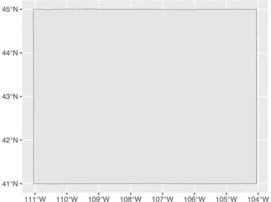

图 4-1：使用 POLYGON 简单要素数据生成的怀俄明州地图

简单要素数据中使用的其他几何类型包括 POINT，用于显示例如地图上的一个标记，表示单一位置。例如，图 4-2 中的地图使用 POINT 数据来显示怀俄明州的一个电动汽车充电站。

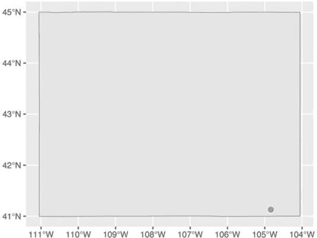

图 4-2：包含 POINT 简单要素数据的怀俄明州地图

LINESTRING 几何类型用于一组可以用线连接的点，通常用于表示道路。图 4-3 显示了一张地图，使用 LINESTRING 数据表示穿过怀俄明州的美国 30 号公路的一段。

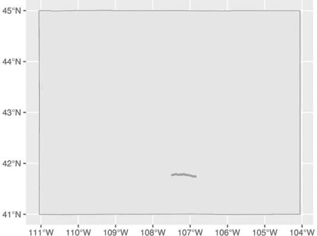

图 4-3：使用 LINESTRING 简单要素数据表示的道路

每种几何类型都有一个 MULTI 变体（MULTIPOINT、MULTI LINESTRING 和 MULTIPOLYGON），它将该类型的多个实例组合在一行数据中。例如，图 4-4 使用 MULTIPOINT 数据来显示怀俄明州的所有电动汽车充电站。

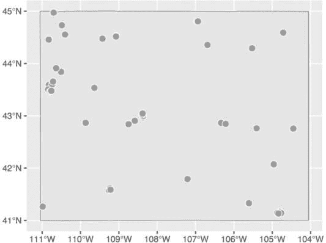

图 4-4：使用 MULTIPOINT 数据表示多个电动汽车充电站

同样，你可以使用 MULTILINESTRING 数据不仅显示一条道路，而是显示怀俄明州的所有主要道路（图 4-5）。

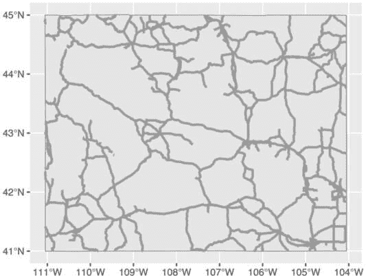

图 4-5：使用 MULTILINESTRING 数据表示几条道路

最后，你可以使用 MULTIPOLYGON 数据，例如，表示一个由多个多边形组成的州。以下数据表示怀俄明州的 23 个县：

```
#> Simple feature collection with 23 features and 1 field
#> Geometry type: MULTIPOLYGON
#> Dimension:     XY
#> Bounding box:  xmin: -111.0546 ymin: 40.99477 xmax: -104.0522 ymax: 45.00582
#> Geodetic CRS:  WGS 84
#> First 10 features:
#>          NAME        geometry
#> 34       Lincoln     MULTIPOLYGON (((-111.0472 4...
#> 104      Fremont     MULTIPOLYGON (((-109.4582 4...
#> 121      Uinta       MULTIPOLYGON (((-110.6068 4...
#> 527      Big Horn    MULTIPOLYGON (((-108.5923 4...
#> 551      Hot Springs MULTIPOLYGON (((-109.1714 4...
#> 601      Washakie    MULTIPOLYGON (((-107.6335 4...
#> 769      Converse    MULTIPOLYGON (((-105.6985 4...
#> 970      Sweetwater  MULTIPOLYGON (((-110.0489 4...
#> 977      Crook       MULTIPOLYGON (((-105.0856 4...
#> 1097     Carbon      MULTIPOLYGON (((-106.9129 4... 
```

如第二行所示，这些数据的几何类型是 MULTIPOLYGON。此外，几何列中重复出现的 MULTIPOLYGON 文本表明每行数据都包含一个 MULTIPOLYGON 类型的形状。图 4-6 展示了使用这些数据制作的地图。

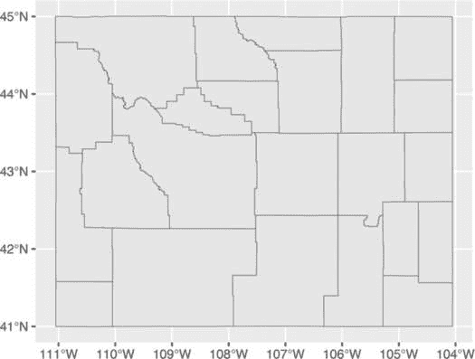

图 4-6：怀俄明州各县的地图

注意，地图完全由多边形组成。

#### 维度

接下来，地理空间数据框包含数据的*维度*，即你正在处理的地理空间数据类型。在怀俄明州的例子中，它看起来像是维度：XY，意味着数据是二维的，就像本章中使用的所有地理空间数据一样。还有另外两个维度（Z 和 M），你会更少见到它们。我将留给你进一步探索。

#### 边界框

元数据倒数第二个元素是*边界框*，它表示能够容纳所有地理空间数据的最小区域。对于 wyoming 对象，它如下所示：

```
Bounding box:  xmin: -111.0569 ymin: 40.99475 xmax: -104.0522 ymax: 45.0059 
```

ymin 值 40.99475 和 ymax 值 45.0059 分别代表该州多边形可以适配的最低和最高纬度。x 值则用于表示经度的相应范围。边界框是自动计算的，通常你不需要担心修改它们。

#### 坐标参考系统

最后一项元数据指定了*坐标参考系统*，该系统用于在绘制数据时对其进行投影。表示任何地理空间数据的挑战在于，你需要在二维地图上展示关于三维地球的信息。这样做需要选择一个坐标参考系统，它决定了在绘制地图时使用哪种类型的对应关系或*投影*。

怀俄明州县地图的数据包括行 Geodetic CRS: WGS 84，表示使用了名为*WGS84*的坐标参考系统。要查看不同的投影，可以查看使用*Albers 等面积圆锥投影*的相同地图。虽然在 图 4-6 中，怀俄明州看起来是完全水平的，但在 图 4-7 中，它似乎倾斜了。

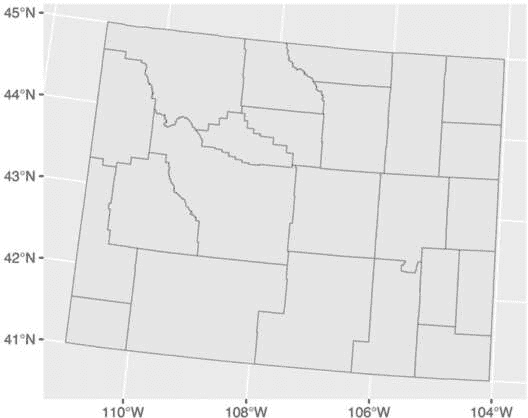

图 4-7：使用 Albers 等面积圆锥投影制作的怀俄明州县地图

如果你想知道如何在制作自己的地图时更改投影，请不要担心：当我们在下一节查看 Madjid 的地图时，你将看到如何操作。如果你想了解如何为地图选择合适的投影，可以查看“使用合适的投影”章节中的 第 81 页。

#### 几何列

除了元数据，简单要素数据在另一个方面与传统数据框有所不同：它的几何列。如你所猜测的那样，这一列保存了绘制地图所需的数据。

为了理解这一点，想象一下你小时候可能完成过的连点成图的绘画活动。当你将线条连接一个点到下一个点时，你的画作主题变得更加清晰。几何列也类似。它包含一组数字，每个数字对应一个点。如果你使用的是 LINESTRING/MULTILINESTRING 或 POLYGON/MULTIPOLYGON 简单要素数据，ggplot 会使用几何列中的数字绘制每个点，并添加线条连接这些点。如果你使用的是 POINT/MULTIPOINT 数据，它会绘制这些点，但不会连接它们。

再次感谢 R，你不需要担心这些细节或深入查看几何列。

### 重建 COVID-19 地图

现在你理解了地理空间数据的基础知识，让我们一起来看看 Madjid 用来制作 COVID-19 地图的代码。图 4-8 中展示了该地图，利用了几何类型、维度、边界框、投影和刚才讨论过的几何列。

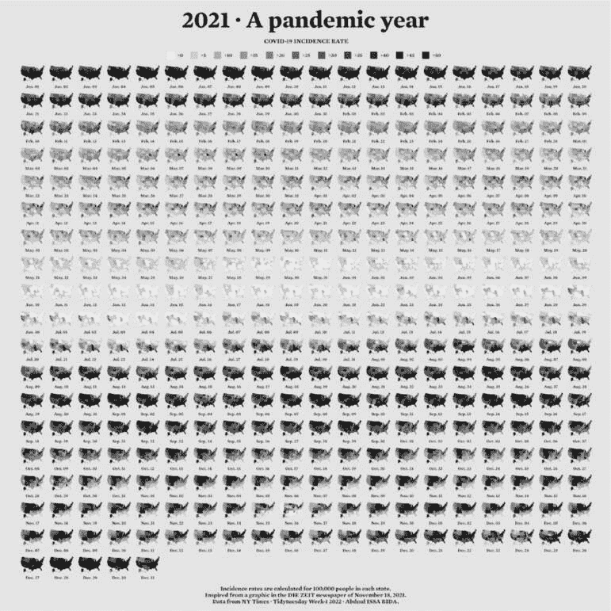

图 4-8：Abdoul Madjid 的 2021 年美国 COVID-19 地图

我对代码做了一些小修改，使得最终的地图能够适应页面。你将从加载一些包开始：

```
**library(tidyverse)**
**library(albersusa)**
**library(sf)**
**library(zoo)**
**library(colorspace)** 
```

albersusa 包将为你提供地理空间数据的访问权限。按以下步骤安装它：

```
**remotes::install_github("hrbrmstr/albersusa")** 
```

你可以使用标准的 install.packages()代码安装所有其他包。你将使用 tidyverse 导入数据、操作数据并通过 ggplot 绘制图表。sf 包将帮助你更改坐标参考系统，并使用适合数据的投影。zoo 包有计算滚动平均数的函数，而 colorspace 包则提供了一个能够突出显示数据的颜色比例。

#### 导入数据

接下来，你将导入所需的数据：按州的 COVID-19 病例率、州人口以及地理空间信息。Madjid 将这些数据分别导入，然后将它们合并，你也将按此方式操作。

COVID-19 数据直接来自*纽约时报*，该报通过其 GitHub 账户每天发布按州分类的病例率 CSV 文件。要导入该数据，请输入以下内容：

```
**covid_data <- read_csv("https://data.rfortherestofus.com/covid-us-states.csv") %>%**
 **select(-fips)** 
```

联邦信息处理标准（FIPS）是用于表示州的数字代码，但你将通过州的名称来引用州，因此这一行选择(-fips)会去掉 fips 变量。

查看这些数据，你可以看到 2020 年 1 月美国首次出现 COVID-19 病例：

```
#> # A tibble: 56,006 × 4
#>    date       state      cases deaths
#>    <date>     <chr>      <dbl>  <dbl>
#>  1 2020-01-21 Washington     1      0
#>  2 2020-01-22 Washington     1      0
#>  3 2020-01-23 Washington     1      0
#>  4 2020-01-24 Illinois       1      0
#>  5 2020-01-24 Washington     1      0
#>  6 2020-01-25 California     1      0
#>  7 2020-01-25 Illinois       1      0
#>  8 2020-01-25 Washington     1      0
#>  9 2020-01-26 Arizona        1      0
#> 10 2020-01-26 California     2      0
`--snip--` 
```

Madjid 的地图显示的是人均率（每 10 万人口的比率），而不是绝对率（没有考虑州人口的比率）。因此，要重建他的地图，你还需要获得每个州的人口数据。按照以下步骤将数据下载为 CSV 格式：

```
**usa_states <- read_csv("https://data.rfortherestofus.com/population-by-state.csv") %>%**
 **select(State, Pop)** 
```

这段代码导入数据，保留州和人口（Pop）变量，并将数据保存为名为 usa_states 的对象。usa_states 的样子如下：

```
#> # A tibble: 52 × 2
#>    State          Pop
#>    <chr>          <dbl>
#>  1 California     39613493
#>  2 Texas          29730311
#>  3 Florida        21944577
#>  4 New York       19299981
#>  5 Pennsylvania   12804123
#>  6 Illinois       12569321
#>  7 Ohio           11714618
#>  8 Georgia        10830007
#>  9 North Carolina 10701022
#> 10 Michigan        9992427
`--snip--` 
```

最后，导入地理空间数据并将其保存为名为 usa_states_geom 的对象，如下所示：

```
**usa_states_geom <- usa_sf() %>%**
 **select(name) %>%**
 **st_transform(us_laea_proj)** 
```

来自 albersusa 包的 usa_sf()函数为你提供所有美国州的简单要素数据。方便的是，它将阿拉斯加和夏威夷放置在易于查看的位置和比例。这些数据包含多个变量，但由于你只需要州名，代码仅保留了州名变量。

来自 sf 包的 st_transform()函数用于更改坐标参考系统。这里使用的参考系统来自 albersusa 包中的 us_laea_proj 对象。这是你之前用来改变怀俄明州县地图外观的阿尔伯斯等面积圆锥投影。

#### 计算每日 COVID-19 病例

`covid_data`数据框列出了按州统计的累计 COVID-19 病例数，但没有按日统计病例数，所以下一步是计算每日病例数：

```
covid_cases <- covid_data %>%
  group_by(state) %>%
  mutate(
  ❶ pd_cases = lag(cases)
  ) %>%
❷ replace_na(list(pd_cases = 0)) %>%
  mutate(
  ❸ daily_cases = case_when(
      cases > pd_cases ~ cases - pd_cases,
 TRUE ~ 0
    )
) %>%
❹ ungroup() %>%
  arrange(state, date) 
```

`group_by()`函数按州计算总数，然后创建一个名为`pd_cases`的新变量，表示前一天的病例数（使用`lag()`函数将数据分配给此变量）❶。某些天没有前一天的病例数，因此使用`replace_na()`函数将该值设为 0❷。

接下来，这段代码创建了一个名为`daily_cases`的新变量❸。要设置这个变量的值，使用`case_when()`函数创建一个条件：如果`cases`变量（表示当天的病例数）大于`pd_cases`变量（表示前一天的病例数），那么`daily_cases`等于`cases`减去`pd_cases`。否则，`daily_cases`设置为 0。

最后，因为你在代码开始时按州对数据进行了分组，现在需要使用`ungroup()`函数去除这个分组，然后再按州和日期对数据进行排序❹。

这是结果数据框`covid_cases`：

```
#> # A tibble: 56,006 × 6
#>    date       state   cases deaths pd_cases daily_cases
#>    <date>     <chr>   <dbl>  <dbl>    <dbl>       <dbl>
#>  1 2020-03-13 Alabama     6      0        0           6
#>  2 2020-03-14 Alabama    12      0        6           6
#>  3 2020-03-15 Alabama    23      0       12          11
#>  4 2020-03-16 Alabama    29      0       23           6
#>  5 2020-03-17 Alabama    39      0       29          10
#>  6 2020-03-18 Alabama    51      0       39          12
#>  7 2020-03-19 Alabama    78      0       51          27
#>  8 2020-03-20 Alabama   106      0       78          28
#>  9 2020-03-21 Alabama   131      0      106          25
#> 10 2020-03-22 Alabama   157      0      131          26
`--snip--` 
```

在下一步中，你将利用新的`daily_cases`变量。

#### 计算发病率

你还没有完全计算出所有的值。Madjid 用于制作地图的数据没有包括每日新增病例数。相反，它包含的是每 10 万人中五天滚动平均的病例数。*滚动平均*是某一时间段内的平均病例率。报告的特殊情况（例如，周末没有报告，而是将周六和周日的病例合并到周一）可能会导致某一天的数值不太可靠。使用滚动平均可以平滑这些特殊情况。按如下方式生成这些数据：

```
**covid_cases %>%**
 **mutate(roll_cases = rollmean(**
 **daily_cases,**
 **k = 5,**
 **fill = NA**
 **))** 
```

这段代码创建了一个名为`covid_cases_rm`的新数据框（其中*rm*代表滚动均值）。它创建的第一步是使用`zoo`包中的`rollmean()`函数来创建一个`roll_cases`变量，表示围绕单一日期的五天期间的平均病例数。`k`参数是你希望计算滚动平均的天数（在这里是 5 天），`fill`参数确定在像第一天这样没有先前几天的数据时会发生什么（Madjid 将这些值设为 NA）。

计算了`roll_cases`之后，你需要计算人均病例率。为此，你需要人口数据，因此将`usa_states`数据框中的人口数据与`covid_cases`数据进行连接，如下所示：

```
**covid_cases_rm <- covid_cases %>%**
  **mutate(roll_cases = rollmean(**
 **daily_cases,**
 **k = 5,**
 **fill = NA**
 **)**
 **) %>%**
 **left_join(usa_states,**
 **by = c("state" = "State")) %>%**
 **drop_na(Pop)** 
```

要删除缺失人口数据的行，你需要调用`drop_na()`函数，并将 Pop 变量作为参数。在实际操作中，这会删除几个美国领土（美属萨摩亚、关岛、北马里亚纳群岛和美属维尔京群岛）。

接下来，你通过将`roll_cases`变量乘以 100,000 并除以每个州的人口来创建一个名为`incidence_rate`的按人均病例率变量：

```
**covid_cases_rm <- covid_cases_rm %>%**
  **mutate(incidence_rate = 10⁵ * roll_cases / Pop) %>%**
 **mutate(**
 **incidence_rate = cut(**
 **incidence_rate,**
 **breaks = c(seq(0, 50, 5), Inf),**
 **include.lowest = TRUE**
 **) %>%**
 **factor(labels = paste0(">", seq(0, 50, 5)))**
 **)** 
```

与其保留原始值（例如，2021 年 6 月 29 日，佛罗里达州每 10 万人有 57.77737 例病例），不如使用 cut()函数将数值转换为类别：大于 0（大于零）的值，大于 5（大于五）的值，以及大于 50（大于五十）的值。

最后一步是过滤数据，只保留 2021 年的数据（这是 Madjid 地图中展示的唯一年份），然后选择创建地图所需的变量（州、省、日期和发病率）：

```
**covid_cases_rm %>%**
 **filter(date >= as.Date("2021-01-01")) %>%**
 **select(state, date, incidence_rate)** 
```

这是最终的 covid_cases_rm 数据框：

```
#> # A tibble: 18,980 × 3
#>    state   date       incidence_rate
#>    <chr>   <date>     <fct>
#>  1 Alabama 2021-01-01 >50
#>  2 Alabama 2021-01-02 >50
#>  3 Alabama 2021-01-03 >50
#>  4 Alabama 2021-01-04 >50
#>  5 Alabama 2021-01-05 >50
#>  6 Alabama 2021-01-06 >50
#>  7 Alabama 2021-01-07 >50
#>  8 Alabama 2021-01-08 >50
#>  9 Alabama 2021-01-09 >50
#> 10 Alabama 2021-01-10 >50
`--snip--` 
```

你现在有一个可以与地理空间数据合并的数据框。

#### 添加地理空间数据

你已经使用了三个数据源中的两个（COVID-19 病例数据和州人口数据），创建了 covid_cases_rm 数据框，接下来需要使用第三个数据源：你保存的地理空间数据 usa_states_geom。简单特征数据允许你将常规数据框与地理空间数据合并（这也是它的优势之一）：

```
**usa_states_geom %>%**
 **left_join(covid_cases_rm, by = c("name" = "state"))** 
```

这段代码将 covid_cases_rm 数据框与地理空间数据合并，匹配 usa_states_geom 中的 name 变量与 covid_cases_rm 中的 state 变量。

接下来，创建一个新变量 fancy_date，用于美化日期格式（例如，使用“Jan. 01”而不是“2021-01-01”）：

```
**usa_states_geom_covid <- usa_states_geom %>%**
  left_join(covid_cases_rm, by = c("name" = "state")) %>%
  **mutate(fancy_date = fct_inorder(format(date, "%b. %d"))) %>%**
 **relocate(fancy_date, .before = incidence_rate)** 
```

format()函数负责格式化，而 fct_inorder()函数使得 fancy_date 变量按照日期排序数据（而不是按字母顺序排列，这样 8 月就不会排在 1 月之前）。最后，relocate()函数将 fancy_date 列移到日期列旁边。

将此数据框保存为 usa_states_geom_covid，并查看结果：

```
#> Simple feature collection with 18615 features and 4 fields
#> Geometry type: MULTIPOLYGON
#> Dimension:     XY
#> Bounding box:  xmin: -2100000 ymin: -2500000 xmax: 2516374 ymax: 732103.3
#> CRS:           +proj=laea +lat_0=45 +lon_0=-100 +x_0=0 +y_0=0 +a=6370997
+b=6370997 +units=m +no_defs
#> First 10 features:
#>    name    date        fancy_date incidence_rate
#> 1  Arizona 2021-01-01  Jan. 01    >50
#> 2  Arizona 2021-01-02  Jan. 02    >50
#> 3  Arizona 2021-01-03  Jan. 03    >50
#> 4  Arizona 2021-01-04  Jan. 04    >50
#> 5  Arizona 2021-01-05  Jan. 05    >50
#> 6  Arizona 2021-01-06  Jan. 06    >50
#> 7  Arizona 2021-01-07  Jan. 07    >50
#> 8  Arizona 2021-01-08  Jan. 08    >50
#> 9  Arizona 2021-01-09  Jan. 09    >50
#> 10 Arizona 2021-01-10  Jan. 10    >50
#>    geometry
#> 1  MULTIPOLYGON (((-1111066 -8...
#> 2  MULTIPOLYGON (((-1111066 -8...
#> 3  MULTIPOLYGON (((-1111066 -8...
#> 4  MULTIPOLYGON (((-1111066 -8...
#> 5  MULTIPOLYGON (((-1111066 -8...
#> 6  MULTIPOLYGON (((-1111066 -8...
#> 7  MULTIPOLYGON (((-1111066 -8...
#> 8  MULTIPOLYGON (((-1111066 -8...
#> 9  MULTIPOLYGON (((-1111066 -8...
#> 10 MULTIPOLYGON (((-1111066 -8... 
```

你可以看到之前章节中提到的元数据和几何列。

#### 制作地图

花了很多工夫才得到看似简单的 usa_states_geom_covid 数据框。虽然数据看起来简单，但 Madjid 用来制作地图的代码相当复杂。本节将分步骤向你讲解这些代码。

最终地图实际上是多个地图，每个地图代表 2021 年中的一天。将 365 天的数据合并会产生一个庞大的最终产品，因此，代码不会展示每一天，而是通过过滤 usa_states_geom_covid 来只显示 1 月的前六天：

```
**usa_states_geom_covid_six_days <- usa_states_geom_covid %>%**
 **filter(date <= as.Date("2021-01-06"))** 
```

将结果保存为一个名为 usa_states_geom_covid_six_days 的数据框。以下是该数据的样子：

```
#> Simple feature collection with 306 features and 4 fields
#> Geometry type: MULTIPOLYGON
#> Dimension:     XY
#> Bounding box:  xmin: -2100000 ymin: -2500000 xmax: 2516374 ymax: 732103.3
#> CRS:           +proj=laea +lat_0=45 +lon_0=-100 +x_0=0 +y_0=0 +a=6370997 +b=6370997 +unit...
#> First 10 features:
#>     name    date          fancy_date incidence_rate
#> 1   Arizona 2021-01-01    Jan. 01    >50
#> 2   Arizona 2021-01-02    Jan. 02    >50
#> 3   Arizona 2021-01-03    Jan. 03    >50
#> 4   Arizona 2021-01-04    Jan. 04    >50
#> 5   Arizona 2021-01-05    Jan. 05    >50
#> 6   Arizona 2021-01-06    Jan. 06    >50
#> 7  Arkansas 2021-01-01    Jan. 01    >50
#> 8  Arkansas 2021-01-02    Jan. 02    >50
#> 9  Arkansas 2021-01-03    Jan. 03    >50
#> 10 Arkansas 2021-01-04    Jan. 04    >50
#>    geometry
#> 1  MULTIPOLYGON (((-1111066 -8...
#> 2  MULTIPOLYGON (((-1111066 -8...
#> 3  MULTIPOLYGON (((-1111066 -8...
#> 4  MULTIPOLYGON (((-1111066 -8...
#> 5  MULTIPOLYGON (((-1111066 -8...
#> 6  MULTIPOLYGON (((-1111066 -8...
#> 7  MULTIPOLYGON (((557903.1 -1...
#> 8  MULTIPOLYGON (((557903.1 -1...
#> 9  MULTIPOLYGON (((557903.1 -1...
#> 10 MULTIPOLYGON (((557903.1 -1... 
```

Madjid 的地图非常庞大，因为它包含了所有 365 天的数据。为了适应本书的排版，某些元素的大小有所调整。

##### 生成基本地图

有了六天的数据，你已经准备好制作地图。Madjid 的地图制作代码分为两大部分：生成基本地图，然后调整其外观。首先，你将回顾用于制作怀俄明州地图的三行代码，并进行一些装饰，以提高可视化效果：

```
**usa_states_geom_covid_six_days %>%**
 **ggplot() +**
 **geom_sf(**
 **aes(fill = incidence_rate),**
 **size = .05,**
 **color = "grey55"**
 **) +**
 **facet_wrap(**
 **vars(fancy_date),**
 **strip.position = "bottom"**
 **)** 
```

geom_sf()函数绘制地理空间数据，修改了几个参数：size = .05 使州边界不那么突出，color = "grey55"将它们设置为中灰色。然后，facet_wrap()函数用于分面（即为每一天制作一张地图）。vars(fancy_date)代码指定使用 fancy_date 变量作为分面地图的依据，strip.position = "bottom"将标签 Jan. 01、Jan. 02 等移到地图底部。图 4-9 展示了结果。

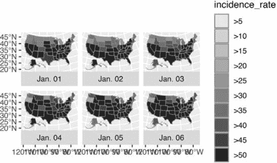

图 4-9：展示 2021 年前六天 COVID-19 发病率的地图

生成了基本地图后，接下来你将让它看起来更加美观。

##### 应用数据可视化原则

从现在开始，Madjid 使用的所有代码都用于改善地图的外观。如果你阅读过第二章，那么这些调整应该会让你感到熟悉，这突显了使用 ggplot 制作地图的一个好处：你可以应用制作图表时学到的数据可视化原则。

```
usa_states_geom_covid_six_days %>%
  ggplot() +
  geom_sf(
    aes(fill = incidence_rate),
    size = .05,
    color = "transparent"
  ) +
  facet_wrap(
    vars(fancy_date),
    strip.position = "bottom"
  ) +
  scale_fill_discrete_sequential(
    palette = "Rocket",
    name = "COVID-19 INCIDENCE RATE",
    guide = guide_legend(
      title.position = "top",
      title.hjust = .5,
      title.theme = element_text(
        family = "Times New Roman",
        size = rel(9),
 margin = margin(
          b = .1,
          unit = "cm"
        )
      ),
      nrow = 1,
      keyheight = unit(.3, "cm"),
      keywidth = unit(.3, "cm"),
      label.theme = element_text(
        family = "Times New Roman",
        size = rel(6),
        margin = margin(
          r = 5,
          unit = "pt"
        )
      )
    )
  ) +
  labs(
    title = "2021 · A pandemic year",
    caption = "Incidence rates are calculated for 100,000 people in each state.
                  Inspired from a graphic in the DIE ZEIT newspaper of November 18, 2021.
                  Data from NY Times · Tidytuesday Week-1 2022 · Abdoul ISSA BIDA."
  ) +
  theme_minimal() +
  theme(
    text = element_text(
      family = "Times New Roman",
      color = "#111111"
    ),
    plot.title = element_text(
      size = rel(2.5),
      face = "bold",
      hjust = 0.5,
      margin = margin(
        t = .25,
        b = .25,
        unit = "cm"
      )
    ),
    plot.caption = element_text(
      hjust = .5,
      face = "bold",
      margin = margin(
        t = .25,
        b = .25,
        unit = "cm"
      )
    ),
    strip.text = element_text(
      size = rel(0.75),
      face = "bold"
    ),
    legend.position = "top",
 legend.box.spacing = unit(.25, "cm"),
    panel.grid = element_blank(),
    axis.text = element_blank(),
    plot.margin = margin(
      t = .25,
      r = .25,
      b = .25,
      l = .25,
      unit = "cm"
    ),
    plot.background = element_rect(
      fill = "#e5e4e2",
      color = NA
    )
  ) 
```

来自 colorspace 包的 scale_fill_discrete_sequential()函数设置颜色比例。该代码使用火箭调色板（与 Cédric Scherer 和 Georgios Karamanis 在第二章中使用的调色板相同），并将图例标题更改为“COVID-19 发病率”。guide_legend()函数调整标题的位置、对齐方式和文本属性。然后，代码将彩色方块放在一行中，调整它们的高度和宽度，并调整标签（>0、>5 等）的文本属性。

接下来，labs()函数添加标题和说明。遵循主题 _minimal()，theme()函数进行一些设计调整，包括设置字体和文本颜色；使标题和说明加粗；并调整它们的大小、对齐方式和边距。然后，代码调整条形文本（如 Jan. 01、Jan. 02 等）的大小并加粗，图例被放置在地图顶部，并增加了一些间距。网格线、经纬度线被移除，接着整个可视化区域增加了一些内边距，并设置了浅灰色背景。

就是这样！图 4-10 展示了他重建的 COVID-19 地图。

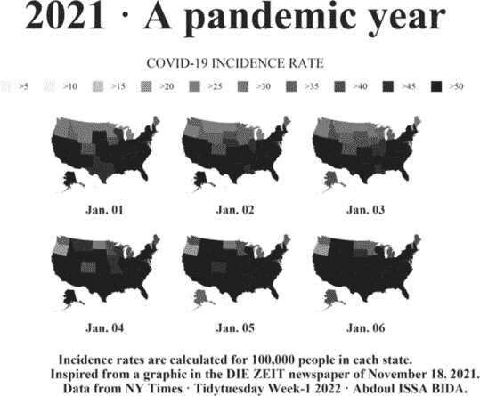

图 4-10：Abdoul Madjid 地图的重建

从数据导入、数据清理到分析和可视化，你已经看到 Madjid 是如何在 R 中制作出一张漂亮的地图的。

### 制作自己的地图

你现在可能在想，*好吧，太好了，但我到底该如何制作自己的地图呢？* 在这一节中，你将学习如何找到地理空间数据，如何选择投影，并且如何准备数据进行绘制。

有两种方式可以访问简单特征的地理空间数据。第一种是导入原始数据，第二种是通过 R 函数访问它。

#### 导入原始数据

地理空间数据可以有多种格式。尽管 ESRI shapefile（带 *.shp* 扩展名）是最常见的格式，但你也可能遇到 GeoJSON 文件（*.geojson*），如我们在本章开头的怀俄明州示例中使用的，KML 文件（*.kml*）等。Robin Lovelace、Jakub Nowosad 和 Jannes Muenchow 所著的 *Geocomputation with R* 第八章（第八章）讨论了这些格式。

好消息是，一个函数几乎可以读取任何类型的地理空间数据：sf 包中的 read_sf()。假设你从 *geojson.xyz* 网站下载了关于美国州边界的 GeoJSON 格式的地理空间数据，并将其保存在 *data* 文件夹中，命名为 *states.geojson*。要导入这些数据，可以使用 read_sf() 函数，像这样：

```
**us_states <- read_sf(dsn = "https://data.rfortherestofus.com/states.geojson")** 
```

dsn 参数（即 *数据源名称*）告诉 read_sf() 从哪里查找文件。你将数据保存为对象 us_states。

#### 使用 R 函数访问地理空间数据

有时你可能需要以这种方式处理原始数据，但并非总是如此。这是因为某些 R 包提供了访问地理空间数据的函数。Madjid 使用了 albersusa 包中的 usa_sf() 函数来获取数据。另一个访问与美国相关的地理空间数据的包 tigris，拥有许多为不同数据类型命名的函数。例如，加载 tigris 包并运行 states() 函数，如下所示：

```
**library(tigris)**

**states_tigris <- states(**
 **cb = TRUE,**
 **resolution = "20m",**
 **progress_bar = FALSE**
**)** 
```

cb = TRUE 参数让你放弃使用最详细的 shapefile，并将分辨率设置为更易管理的 20m（1:2000 万）。如果不做这些修改，生成的 shapefile 会很大，且处理起来很慢。设置 progress_bar = FALSE 可以隐藏 tigris 在加载数据时生成的消息。结果会保存为 states_tigris。tigris 包有函数可以获取关于县、普查区、道路等的地理空间数据。

如果你需要寻找美国以外的数据，rnaturalearth 包提供了从全球导入地理空间数据的函数。例如，使用 ne_countries() 来获取关于各个国家的地理空间数据：

```
**library(rnaturalearth)**

**africa_countries <- ne_countries(**
 **returnclass = "sf",**
 **continent = "Africa"**
**)** 
```

这段代码使用了两个参数：returnclass = "sf" 用于获取简单特征格式的数据，continent = "Africa" 用于只获取非洲大陆上的国家。如果你将结果保存为名为 africa_countries 的对象，你可以像下面这样在地图上绘制数据：

```
**africa_countries %>%**
 **ggplot() +**
 **geom_sf()** 
```

图 4-11 显示了生成的地图。

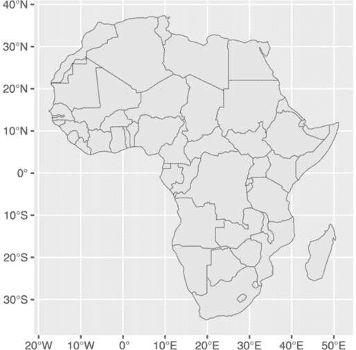

图 4-11：使用 rnaturalearth 包的数据制作的非洲地图

如果你找不到合适的包，始终可以退而求其次，使用 sf 包中的 read_sf()。

#### 使用适当的投影

一旦你访问了地理空间数据，你需要决定使用哪种投影。如果你期望有一个简单的答案，可能会失望。正如 *Geocomputation with R* 所说：“*哪个* CRS [使用什么坐标参考系统] 是个棘手的问题，通常没有一个‘正确’的答案。”

如果你被选择投影的任务压倒，可以使用 Kyle Walker 的 crsuggest 包来获得灵感。它的`suggest_top_crs()`函数返回一个非常适合你的数据的坐标参考系统。加载 crsuggest 并尝试在你的 africa_countries 数据上使用它：

```
**library(crsuggest)**

**africa_countries %>%**
 **suggest_top_crs()** 
```

`suggest_top_crs()`函数应该返回投影编号 28232。将该值传递给`st_transform()`函数，在绘图之前更改投影：

```
africa_countries %>%
  **st_transform(28232) %>%**
 **ggplot() +**
 **geom_sf()** 
```

运行时，此代码生成了图 4-12 中的地图。

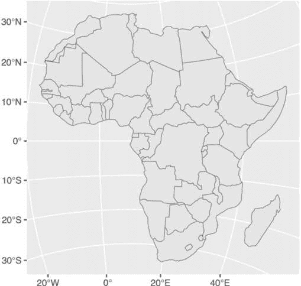

图 4-12：使用投影编号 28232 制作的非洲地图

如你所见，你已成功使用不同的投影绘制了非洲地图。

#### 地理空间数据整理

将传统数据框与地理空间数据合并的能力是处理简单特征数据的一个巨大优势。记住，在制作 COVID-19 地图时，Madjid 在将传统数据框与地理空间数据合并之前，先对传统数据框进行了分析。但因为简单特征数据就像传统数据框一样工作，所以你可以直接将 tidyverse 的数据整理和分析函数应用到简单特征对象上。为了了解这一点，请重新访问 africa_countries 简单特征数据，并选择两个变量（name 和 pop_est），查看国家的名称和人口：

```
**africa_countries %>%**
 **select(name, pop_est)** 
```

输出结果如下所示：

```
#> Simple feature collection with 51 features and 2 fields
#> Geometry type: MULTIPOLYGON
#> Dimension:     XY
#> Bounding box:  xmin: -17.62504 ymin: -34.81917 xmax: 51.13387 ymax: 37.34999
#> CRS:           +proj=longlat +datum=WGS84 +no_defs +ellps=WGS84 +towgs84=0,0,0
#> First 10 features:
#>    name                   pop_est
#>  1 Angola                 12799293
#> 11 Burundi                8988091
#> 13 Benin                  8791832
#> 14 Burkina Faso           15746232
#> 25 Botswana               1990876
#> 26 Central African Rep.   4511488
#> 31 Côte d'Ivoire          20617068
#> 32 Cameroon               18879301
#> 33 Dem. Rep. Congo        68692542
#> 34 Congo                  4012809
#>    geometry
#>  1 MULTIPOLYGON (((16.32653 -5...
#> 11 MULTIPOLYGON (((29.34 -4.49...
#> 13 MULTIPOLYGON (((2.691702 6....
#> 14 MULTIPOLYGON (((-2.827496 9...
#> 25 MULTIPOLYGON (((25.64916 -1...
#> 26 MULTIPOLYGON (((15.27946 7....
#> 31 MULTIPOLYGON (((-2.856125 4...
#> 32 MULTIPOLYGON (((13.07582 2....
#> 33 MULTIPOLYGON (((30.83386 3....
#> 34 MULTIPOLYGON (((12.99552 -4... 
```

假设你想制作一张显示哪些非洲国家人口超过 2000 万的地图。首先，你需要为每个国家计算这个值。为此，使用`mutate()`和`if_else()`函数，它们会返回 TRUE（如果国家人口超过 2000 万）或 FALSE（否则），然后将结果存储在名为 population_above_20_million 的变量中：

```
africa_countries %>%
  select(name, pop_est) %>%
 **mutate(population_above_20_million = if_else(pop_est > 20000000, TRUE, FALSE))** 
```

然后，你可以将此代码传递到 ggplot 中，将填充美学属性设置为 population_above_20_million：

```
africa_countries %>%
  select(name, pop_est) %>%
  mutate(population_above_20_million = if_else(pop_est > 20000000, TRUE, FALSE)) %>%
  **ggplot(aes(fill = population_above_20_million)) +**
 **geom_sf()** 
```

此代码生成了图 4-13 中显示的地图。

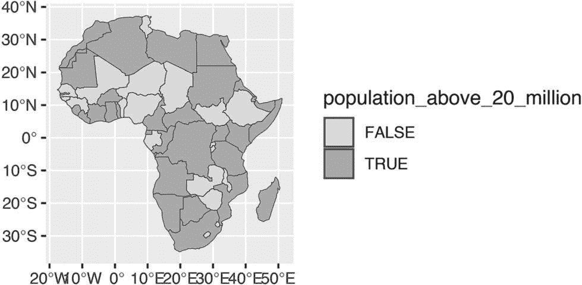

图 4-13：一张突出显示人口超过 2000 万的非洲国家的地图

这是你可以在简单特征数据上执行数据整理和分析的一个基本示例。更大的启示是：你在 R 中开发的任何数据处理技能，都将在处理地理空间数据时派上用场。

### 总结

在这次简短的 R 地图制作之旅中，你学习了简单特征地理空间数据的基础知识，回顾了 Abdoul Madjid 如何运用这些知识制作他的地图，探索了如何获取自己的地理空间数据，并看到了如何适当地投影它们以制作你自己的地图。

R 很可能是制作地图的最佳工具。它还允许你利用为处理传统数据框和 ggplot 代码所开发的技能，使你的可视化效果看起来很棒。毕竟，Madjid 不是 GIS 专家，但他结合了对地理空间数据的基本理解、R 的基础技能和数据可视化原则的知识，制作了一张美丽的地图。现在轮到你来做同样的事了。

### 额外资源

+   Kieran Healy， “绘制地图”，载于 *《数据可视化：实用入门》*（新泽西州普林斯顿：普林斯顿大学出版社，2018 年）， *[`socviz.co`](https://socviz.co)*。

+   Andrew Heiss， “来自数据可视化的空间课：使用 R、ggplot2 和图形设计原理创建美观且真实的数据可视化”，在线课程，最后更新于 2022 年 7 月 11 日， *[`datavizs22.classes.andrewheiss.com/content/12-content/`](https://datavizs22.classes.andrewheiss.com/content/12-content/)*。

+   Robin Lovelace，Jakub Nowosad 和 Jannes Muenchow， *《R 地理计算》*（佛罗里达州博卡拉顿：CRC 出版社，2019 年）， *[`r.geocompx.org`](https://r.geocompx.org)*。

+   Kyle Walker，*《分析美国人口普查数据：R 中的方法、地图和模型》*（佛罗里达州博卡拉顿：CRC 出版社，2013 年）。
